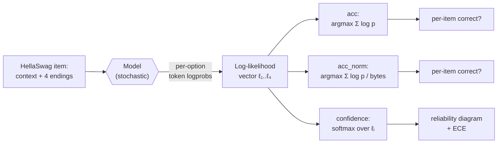

# Day 2 — MC scoring mechanics and the calibration overlay

## The opening question

Day 1 ended with a small puzzle: `lm-evaluation-harness` reports two numbers for every multiple-choice task, `acc` and `acc_norm`, and they can disagree. On MMLU the gap is usually a point or two — annoying, mostly ignorable. On HellaSwag the gap is routinely **15–20 points** for the same model on the same data: Llama-2 7B, for instance, scores roughly 57 on `acc` and 76 on `acc_norm` (lm-eval-harness reports). One model, one dataset, two numbers, both produced by the same harness — and a 19-point delta you can't reason about until you understand what the two metrics actually compute.

That delta is today's pedagogical engine. Unpacking it forces three things into the open: how log-likelihood scoring works mechanically on options of unequal length, why HellaSwag's adversarially-generated continuations are an unusually pathological case, and — the bigger move — that **a model's confidence is itself an evaluable quantity, distinct from its accuracy**. That second move opens the **calibration thread** the curriculum will return to on D15, D20, and D24.

## The pipeline, with scoring zoomed in

Day 1's pipeline diagram had a single "Scoring rule" box. Today we open it up:



The same forward pass produces (i) two accuracy numbers via different normalizations of the option scores, and (ii) a confidence distribution that you can score *separately* for how well-calibrated it is. Models can be accurate without being calibrated, and calibrated without being accurate. They're orthogonal axes.

## Anchor: HellaSwag (Zellers et al. 2019)

HellaSwag — *Can a Machine Really Finish Your Sentence?* — is a 4-way commonsense sentence-completion benchmark introduced at ACL 2019. It is the successor to SWAG (Zellers et al. 2018), and was designed specifically to defeat models that had saturated SWAG: the authors used **adversarial filtering** with BERT-Large as the discriminator to retain only those generated wrong answers that are plausible to a strong LM but obviously wrong to humans. Source contexts are drawn from ActivityNet captions and WikiHow articles.

Format and stats (Hugging Face dataset card, `Rowan/hellaswag`):

- **59,950 items** total: 39,905 train / 10,042 validation / 10,003 test.
- Each item is a context plus **4 candidate endings**; one is the gold continuation, three are adversarially-generated distractors.
- Test labels are not public; the standard published `acc`/`acc_norm` numbers (including those on the Open LLM Leaderboard v1) are computed on the **validation split**.
- Human accuracy is reported at >95%; in 2019 BERT-Large scored under 50%.

A representative item:

```
Context: A woman is outside with a bucket and a dog. The dog is running
around trying to avoid a bath. She…

(A) rinses the bucket off with soap and blow-dries the dog's head.
(B) uses a hose to keep the dog wet.
(C) gets the dog wet, then it runs away again.
(D) gets into the bath tub with the dog.
```

Two things to notice. First, the four endings are **not equal-length** — and unlike MMLU's mostly-uniform options, the length variance is the rule, not the exception, because the distractors were generated by a language model. Second, the adversarial filter ensures the distractors are surface-fluent: the wrong answers don't fail because they're ungrammatical, they fail because they violate physical or causal commonsense. This is what makes HellaSwag the right anchor for `acc` vs. `acc_norm`: option-length asymmetry is severe and the gap surfaces clearly.

### Running it

The canonical Open LLM Leaderboard v1 configuration is **10-shot**, scored on `acc_norm`:

```bash
lm_eval \
  --model hf \
  --model_args pretrained=meta-llama/Llama-2-7b-hf \
  --tasks hellaswag \
  --num_fewshot 10 \
  --batch_size 8
```

The output reports both `acc` and `acc_norm`. As a calibration sanity check: for Llama-2 7B on HellaSwag the published numbers are roughly `acc ≈ 0.571`, `acc_norm ≈ 0.760`. The 19-point gap is the cost of unnormalized log-likelihood scoring on a benchmark with high option-length variance.

## `acc` vs. `acc_norm`, mechanically

Day 1 introduced these in passing. Today, the math.

Given a context $c$ and four candidate endings $o_1,\ldots,o_4$ (gold = $o_{y}$), tokenize each $o_i$ as $t_{i,1},\ldots,t_{i,n_i}$. The model gives us per-token log-probabilities conditional on $c$ and the preceding tokens of the option. The **summed log-likelihood** of option $i$ is:

$$\ell_i \;=\; \sum_{j=1}^{n_i} \log P\!\left(t_{i,j} \,\middle|\, c,\, t_{i,1},\ldots,t_{i,j-1}\right).$$

The two metrics differ only in what they compare:

- **`acc`** — the unnormalized rule. Predict $\hat{y} = \arg\max_i \ell_i$. **Length bias**: every additional token contributes a $\log P < 0$ term, so the sum is mechanically biased toward shorter options. The "knowledge" is the same; the score is not.

- **`acc_norm`** — byte-length normalization. Let $B_i$ be the **byte length** of option $i$ when encoded as UTF-8 (not the token count). Predict $\hat{y} = \arg\max_i \ell_i / B_i$. The result is an average log-probability *per byte*, which (a) removes the additive penalty for longer options and (b) is **tokenizer-agnostic**: a model that tokenizes "apple" as one token and a model that tokenizes it as two will be compared on the same denominator. (Implementation detail: EleutherAI's `lm-evaluation-harness` uses byte length specifically for this tokenizer-agnosticism property; see the EleutherAI blog post on multiple-choice normalization.)

On MMLU the four options are usually short (single phrases, sometimes a single word), and the byte counts are similar. The `acc`/`acc_norm` gap is small. On HellaSwag the options are full sentence continuations of unequal length, and the gap blows up — which is exactly why the Open LLM Leaderboard v1 reported HellaSwag on `acc_norm` rather than `acc`.

The general lesson: **whenever option lengths vary, prefer `acc_norm`**. `acc` reports the model plus a length-confound; `acc_norm` reports the model. The Open LLM Leaderboard v1 made this choice for ARC-Challenge, MMLU, and HellaSwag.

## From scoring rule to confidence: the calibration move

So far, both `acc` and `acc_norm` flatten the model's output into a single hard prediction (the argmax). But the score vector $(\ell_1,\ell_2,\ell_3,\ell_4)$ contains more information than its argmax: it tells you **how much the model preferred its top choice**. Convert to a probability distribution with softmax:

$$p_i \;=\; \frac{\exp(\ell_i)}{\sum_{k=1}^{4} \exp(\ell_k)}, \qquad \text{confidence} \;=\; \max_i p_i.$$

Now we can ask a question that accuracy alone cannot answer: **when the model says it's 90% confident, is it right 90% of the time?** A model can be highly accurate and badly miscalibrated (overconfident even on questions it gets right is fine; overconfident on questions it gets *wrong* is the problem). It can also be poorly accurate but well-calibrated — its "I think this is right" probabilities track reality even though they're often low. These are different model properties, and the decision-theoretic cost of confusing them is real: a triage system that uses `confidence > 0.9` as a threshold will silently drop the right calls on a miscalibrated model regardless of its top-1 accuracy.

### Reliability diagrams

The standard visualization is the **reliability diagram** (Guo et al. 2017). Construction:

1. Run the model on every test item. For each item, record the predicted class and its softmax confidence $\max_i p_i$.
2. Bin the confidences. Standard practice is 10 or 15 equal-width bins on $[0, 1]$ — or equivalently, on $[0.25, 1]$ for 4-way MC, since random-guess confidence is $1/4$.
3. For each bin, compute (i) the **average confidence** of items in the bin and (ii) the **empirical accuracy** of items in the bin.
4. Plot accuracy vs. confidence, one point per bin. A perfectly calibrated model lies on the $y = x$ diagonal: when it says "70% confident", it's right 70% of the time.

Bars below the diagonal mean **overconfidence** (the model claims more certainty than it has — the dominant failure mode for modern neural networks per Guo et al.). Bars above the diagonal mean **underconfidence**.

### Expected Calibration Error

Reliability diagrams are visual; **Expected Calibration Error** (ECE) is the scalar that summarizes them. With $M$ equal-width bins $B_1,\ldots,B_M$ partitioning $[0,1]$, and $n$ test items:

$$\text{ECE} \;=\; \sum_{m=1}^{M} \frac{|B_m|}{n} \,\Big|\, \text{acc}(B_m) - \text{conf}(B_m) \,\Big|$$

where $\text{acc}(B_m)$ is the empirical accuracy of items whose confidence fell in bin $m$, and $\text{conf}(B_m)$ is the average confidence of those items. ECE is the **sample-weighted average gap** between the diagonal and the bars: 0 is perfectly calibrated, larger is worse. (Guo et al. 2017 attribute the binned form to Naeini et al. 2015.)

Three caveats worth internalizing now, because the calibration-skeptical literature lands on all three:

1. **ECE is bin-sensitive.** With 10 vs. 15 vs. 30 bins you get different numbers on the same predictions. Reporting bin count alongside ECE is mandatory.
2. **ECE does not distinguish over- from under-confidence.** It's an absolute value. Two models with the same ECE can be miscalibrated in opposite directions; the reliability diagram tells you which.
3. **ECE on a 4-way MC is not the same scale as ECE on free-form generation.** Confidence on MC is a softmax over 4 logits, with floor $0.25$. ECE numbers in the calibration literature are not directly comparable across these regimes — Day 15 and Day 24 will hit this when calibration shows up on TruthfulQA and RewardBench respectively.

### A worked, schematic ECE on HellaSwag

Suppose you bin a 1,000-item run into 10 confidence bins and observe:

| Bin (confidence) | Items | Avg confidence | Empirical accuracy | $\|\text{acc} - \text{conf}\|$ |
| :--: | :--: | :--: | :--: | :--: |
| [0.25, 0.35) | 60  | 0.31 | 0.30 | 0.01 |
| [0.35, 0.45) | 90  | 0.41 | 0.38 | 0.03 |
| [0.45, 0.55) | 130 | 0.50 | 0.46 | 0.04 |
| [0.55, 0.65) | 160 | 0.60 | 0.55 | 0.05 |
| [0.65, 0.75) | 180 | 0.70 | 0.62 | 0.08 |
| [0.75, 0.85) | 170 | 0.80 | 0.71 | 0.09 |
| [0.85, 0.95) | 140 | 0.90 | 0.79 | 0.11 |
| [0.95, 1.00] | 70  | 0.97 | 0.85 | 0.12 |

Then ECE is the items-weighted average of the rightmost column: roughly 0.072. Interpretation: **the model is on average ~7 points overconfident**, and the overconfidence grows monotonically with the model's claimed confidence — the classic high-confidence-overshoots-truth shape that Guo et al. 2017 documented for modern deep classifiers and that Kadavath et al. 2022 then revisited specifically for language models.

## Calibration as a safety property

Up to this point calibration looks like a statistical hygiene topic — and Guo et al. 2017 is, primarily, a statistics paper. The shift the safety literature makes is to treat calibration as a **safety-relevant property of model outputs**, not just a statistical curiosity.

Kadavath et al. 2022 (*Language Models (Mostly) Know What They Know*, Anthropic) is the canonical move. Their finding, in one sentence: **larger language models are well-calibrated on multiple-choice and true/false questions when probed properly**, and they can be trained to produce a self-rated $P(\text{True})$ that tracks ground truth — but calibration of $P(\text{IK})$ ("I know") on novel tasks is harder. The framing this opens up:

- **Confidence is communicable.** A well-calibrated model that says "I'm 30% sure" lets a downstream system route the question to a human, retrieve more context, or refuse. A miscalibrated overconfident model robs the downstream system of that signal.
- **Abstention is a function of calibration.** A model that abstains (refuses to answer) on its low-confidence items improves selective accuracy *only if* its confidence is informative about correctness. Without calibration, abstention is just mood. (Day 15 returns to this on TruthfulQA, where the benchmark's incentive structure rewards refusal — and a well-calibrated abstention is mechanically very different from a refuse-everything policy that happens to match the rubric.)
- **Calibration is brittle under fine-tuning.** RLHF and instruction-tuning routinely degrade calibration, because the optimization target is human-preferred phrasing rather than truth-tracking probabilities. (Day 24 returns to this on RewardBench: reward-model confidence and how it composes with downstream sampling.)

This is the framing Day 2 plants and the curriculum picks up later. The shorthand: **accuracy tells you whether the model gets it right; calibration tells you whether the model knows when it doesn't.**

> **Safety researcher's note.** Calibration matters more for safety-relevant evaluations than for capability ones, and the asymmetry is sharp. On MMLU, an overconfident wrong answer costs you a point. On a dangerous-capability eval (D21, WMDP) or a refusal eval (D18, IFEval; D19, HarmBench), an overconfident wrong answer means the model produced harmful content with conviction. A well-calibrated model that says "I'm not sure how to synthesize this" is safer than a confidently-wrong one even if their top-1 accuracies are identical — because the calibrated one is *legible* to a downstream filter or human reviewer. Calibration is also Goodhart-relevant in a meta sense: confidence is one of the few model outputs that downstream pipelines treat as load-bearing without re-evaluating it. If we start optimizing models *to look calibrated* on a fixed eval set, we get the same Goodhart pathology described in D6 (contamination) and D22 (judge bias) — just one level up. For both reasons, calibration recurs across the curriculum: **D15** (selective prediction / abstention vs. truth on TruthfulQA), **D20** (a light callback: position-holding under challenge as a confidence-calibration question), and **D24** (full reprise: reward-model confidence on RewardBench). When you read those lessons, the ECE/reliability-diagram framing introduced today is what they're referring back to.

## What today changes about how you read leaderboards

Three immediate consequences:

1. **When option lengths vary, `acc_norm` is the metric to trust.** When you see a HellaSwag, ARC, or OpenBookQA score that doesn't say which it is, assume `acc_norm` (it's the leaderboard default) but check.
2. **Two models with the same accuracy can have very different calibration profiles**, and the calibration profile matters whenever a downstream system uses the model's confidence — which is almost any deployment. Headline accuracy hides this.
3. **Calibration is a separate evaluation**, not a subroutine of accuracy evaluation. It needs a reliability diagram and an ECE number alongside `acc`/`acc_norm`. Most public leaderboards report only the latter; this is a hole in the standard reporting.

## Takeaways

1. **`acc`** sums log-probabilities; **`acc_norm`** divides that sum by option *byte length*. The gap is small when options are equal-length (MMLU) and large when they aren't (HellaSwag, ~15–20 points for Llama-2 7B).
2. The same forward pass that gives you `acc`/`acc_norm` also gives you a confidence (softmax over the option logits). Confidence is an *additional* eval target, not a byproduct.
3. **Reliability diagrams** plot binned accuracy vs. binned confidence; the diagonal is perfect calibration. **ECE** is the items-weighted average gap between bars and diagonal; it is bin-sensitive and direction-blind.
4. Modern neural networks are typically **overconfident** (Guo et al. 2017); large language models are **mostly well-calibrated** on MC and T/F formats, with caveats around novel tasks and fine-tuning (Kadavath et al. 2022).
5. Calibration is a recurring thread in this curriculum, not a one-shot topic. **D15** picks it up on TruthfulQA (selective prediction / abstention), **D20** on sycophancy (position-holding under challenge), **D24** on RewardBench (reward-model calibration and downstream composition).

## References

- **Anchor.** Zellers, R., Holtzman, A., Bisk, Y., Farhadi, A., & Choi, Y. (2019). *HellaSwag: Can a Machine Really Finish Your Sentence?* ACL 2019. arXiv:1905.07830.
- **Calibration (default anchor reading).** Guo, C., Pleiss, G., Sun, Y., & Weinberger, K. Q. (2017). *On Calibration of Modern Neural Networks.* ICML 2017. arXiv:1706.04599.
- **Calibration as a safety property (secondary anchor).** Kadavath, S., Conerly, T., Askell, A., et al. (2022). *Language Models (Mostly) Know What They Know.* Anthropic. arXiv:2207.05221.
- **ECE binned form (origin).** Naeini, M. P., Cooper, G. F., & Hauskrecht, M. (2015). *Obtaining Well Calibrated Probabilities Using Bayesian Binning.* AAAI 2015.
- **`acc_norm` byte-length normalization.** EleutherAI Blog. *Multiple Choice Normalization in LM Evaluation.* https://blog.eleuther.ai/multiple-choice-normalization/
- **Harness.** EleutherAI. `lm-evaluation-harness`, `lm_eval/tasks/hellaswag/`. https://github.com/EleutherAI/lm-evaluation-harness/tree/main/lm_eval/tasks/hellaswag
- **Open LLM Leaderboard v1 (HellaSwag, 10-shot, `acc_norm`).** Hugging Face. *Open LLM Leaderboard archive docs.* https://huggingface.co/docs/leaderboards/en/open_llm_leaderboard/archive
- **SWAG predecessor.** Zellers, R., Bisk, Y., Schwartz, R., & Choi, Y. (2018). *SWAG: A Large-Scale Adversarial Dataset for Grounded Commonsense Inference.* EMNLP 2018.

## Quiz

**Q1.** On a HellaSwag run, the same model reports `acc = 0.57` and `acc_norm = 0.76`. The 19-point gap is best explained by:

- A. The model was retrained between the two computations.
- B. HellaSwag's options have highly variable lengths, so unnormalized summed log-likelihoods penalize the longer (often correct) options.
- C. `acc_norm` uses a different test split than `acc`.
- D. `acc_norm` includes few-shot examples in the score; `acc` does not.

**Q2.** Why does `lm-evaluation-harness` normalize by **byte length** rather than **token count**?

- A. Byte length is faster to compute.
- B. Token count would inflate scores for byte-pair-encoded tokenizers.
- C. Byte length is tokenizer-agnostic, so models with different tokenizations of the same string get comparable denominators.
- D. Byte length is required by HellaSwag's official scoring rule.

**Q3.** A model on a 4-way MC task has accuracy 0.80 and average confidence 0.95. The reliability-diagram bar for the high-confidence bin lies clearly **below** the diagonal. The model is best described as:

- A. Underconfident.
- B. Overconfident.
- C. Perfectly calibrated.
- D. Random.

**Q4.** Which of the following is **not** a known caveat of Expected Calibration Error?

- A. ECE depends on the number of bins chosen.
- B. ECE does not distinguish over-confidence from under-confidence.
- C. ECE values are directly comparable between MC tasks (4-way softmax) and free-form generation.
- D. ECE is the items-weighted average gap between empirical accuracy and average confidence per bin.

**Q5.** Kadavath et al. 2022 (*Language Models (Mostly) Know What They Know*) primarily argues that:

- A. Smaller language models are better calibrated than larger ones.
- B. Language models cannot be trained to self-evaluate.
- C. Sufficiently large language models are well-calibrated on MC and T/F formats and can be trained to produce a self-rated $P(\text{True})$ that tracks correctness.
- D. Calibration is a property of the dataset, not the model.

**Q6.** A safety-leaning practitioner is choosing between two 7B models for a tool that must abstain when unsure. Both score `acc_norm = 0.78` on HellaSwag. Model A has ECE = 0.03; Model B has ECE = 0.12 (10 bins, both). Which is the better choice **for the abstention use case**, and why?

- A. Model B, because higher ECE means more confident answers.
- B. Model A, because abstention requires confidence to track correctness, and lower ECE means it does.
- C. Either — accuracy is what matters; ECE is cosmetic.
- D. Model B, because higher ECE indicates better separation between classes.

<details>
<summary>Answers</summary>

1. **B** — HellaSwag's adversarially-generated endings vary in length, so unnormalized summed log-likelihoods are biased toward shorter options; the gold ending is often longer than the shortest distractor. `acc_norm` removes this length-confound.
2. **C** — byte length is tokenizer-agnostic. Two models that tokenize the same option differently still have the same byte-count denominator, so their normalized scores are comparable. (See EleutherAI's multiple-choice-normalization blog post.)
3. **B** — confidence (0.95) exceeds accuracy (0.80) and the bar is below the diagonal: the model is overconfident, the dominant failure mode in Guo et al. 2017.
4. **C** — ECE numbers are *not* directly comparable across regimes with different confidence floors (4-way MC has floor 0.25; free-form generation has none). A, B, D are all standard, established caveats / definitions.
5. **C** — the paper's core finding for MC and T/F regimes; the harder case is $P(\text{IK})$ on novel tasks.
6. **B** — abstention is only meaningful when confidence is informative about correctness, and ECE measures exactly that. Equal accuracy + lower ECE = the right choice for any pipeline that uses confidence as a routing or refusal signal. This is the framing D15, D20, and D24 will build on.

</details>
