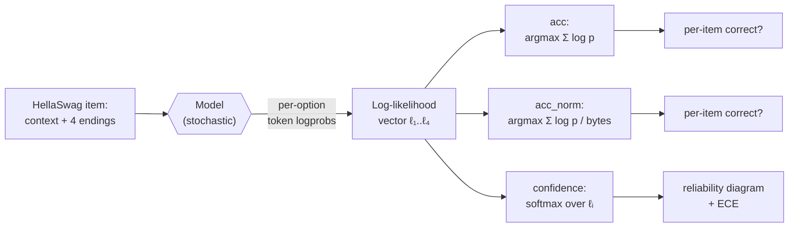

# Day 2 — MC scoring mechanics and the calibration overlay

## TL;DR

Multiple-choice scoring on log-likelihoods produces *two* numbers — `acc` and `acc_norm` — that can disagree by 15–20 points on benchmarks with variable-length options like HellaSwag. The same forward pass that gives you those numbers also gives you a softmax confidence, and treating that confidence as an evaluable quantity in its own right opens this curriculum's **calibration thread**: reliability diagrams and Expected Calibration Error measure something orthogonal to accuracy, and that orthogonality is where most safety-relevant signal lives.

## Learning objectives

By the end of this lesson, you will be able to:

1. **(L2)** Describe HellaSwag's construction (4-way commonsense completion, adversarial filtering on top of SWAG, validation-split reporting) and why byte-length normalization is its standard `acc_norm` reporting choice.
2. **(L3)** *Apply* the binned ECE formula to a 10-bin reliability table and reproduce the headline ECE number, including the items-weighting step.
3. **(L4)** *Analyze* a 19-point `acc_norm − acc` gap on HellaSwag and identify the load-bearing mechanism (option-length variance combined with length-biased summed log-likelihoods).
4. **(L4)** Decompose accuracy and calibration into orthogonal evaluation axes and explain why a single forward pass yields *two* eval targets, not one.
5. **(L5)** *Evaluate* a deployment choice between two equally-accurate models with different ECE in an abstention pipeline, and defend the calibration-aware pick.
6. **(L4)** Frame calibration as a recurring curriculum thread (introduced [D-2](/lesson/2), reprised [D-15](/lesson/15), callback [D-20](/lesson/20), closed [D-24](/lesson/24)) and explain why fine-tuning is its standard failure mode.

## Prerequisites & callback

[D-1](/lesson/1) introduced the four-step evaluation pipeline (dataset → prompt → model → scoring rule → aggregation), the distinction between **letter-only** and **log-likelihood** scoring, and a brief preview of `acc` vs. `acc_norm` and **length bias** as a mechanical artifact of unnormalized log-likelihood scoring. Today picks up exactly where [D-1](/lesson/1) ended: we open the "scoring rule" box, derive both metrics from a single forward pass, and reframe everything around a third quantity [D-1](/lesson/1) only hinted at — the model's confidence — which becomes this curriculum's recurring **calibration** thread.

## The opening hook

[D-1](/lesson/1) ended with a small puzzle: `lm-evaluation-harness` reports two numbers for every multiple-choice task, `acc` and `acc_norm`, and they can disagree. On MMLU the gap is usually a point or two — annoying, mostly ignorable. On HellaSwag the gap is routinely **15–20 points** for the same model on the same data: Llama-2 7B, for instance, scores roughly 57 on `acc` and 76 on `acc_norm` (lm-eval-harness reports). One model, one dataset, two numbers, both produced by the same harness — and a 19-point delta you can't reason about until you understand what the two metrics actually compute.

That delta is today's pedagogical engine. Unpacking it forces three things into the open: how log-likelihood scoring works mechanically on options of unequal length, why HellaSwag's adversarially-generated continuations are an unusually pathological case, and — the bigger move — that **a model's confidence is itself an evaluable quantity, distinct from its accuracy**. That second move opens the **calibration thread** the curriculum will return to on [D-15](/lesson/15), [D-20](/lesson/20), and [D-24](/lesson/24).

## The pipeline, with scoring zoomed in

[D-1](/lesson/1)'s pipeline diagram had a single "Scoring rule" box. Today we open it up:



The same forward pass produces (i) two accuracy numbers via different normalizations of the option scores, and (ii) a confidence distribution that you can score *separately* for how well-calibrated it is. Models can be accurate without being calibrated, and calibrated without being accurate. They're orthogonal axes.

## Anchor: HellaSwag (Zellers et al. 2019)

HellaSwag — *Can a Machine Really Finish Your Sentence?* — is a 4-way commonsense sentence-completion benchmark introduced at ACL 2019. It is the successor to SWAG (Zellers et al. 2018), and was designed specifically to defeat models that had saturated SWAG: the authors used **adversarial filtering** with BERT-Large as the discriminator to retain only those generated wrong answers that are plausible to a strong LM but obviously wrong to humans. Source contexts are drawn from ActivityNet captions and WikiHow articles.

Format and stats (Hugging Face dataset card, `Rowan/hellaswag`):

- **59,950 items** total: 39,905 train / 10,042 validation / 10,003 test.
- Each item is a context plus **4 candidate endings**; one is the gold continuation, three are adversarially-generated distractors.
- Test labels are not public; the standard published `acc`/`acc_norm` numbers (including those on the Open LLM Leaderboard v1) are computed on the **validation split**.
- Human accuracy is reported at >95%; in 2019 BERT-Large scored under 50%.

A representative item:

```
Context: A woman is outside with a bucket and a dog. The dog is running
around trying to avoid a bath. She…

(A) rinses the bucket off with soap and blow-dries the dog's head.
(B) uses a hose to keep the dog wet.
(C) gets the dog wet, then it runs away again.
(D) gets into the bath tub with the dog.
```

Two things to notice. First, the four endings are **not equal-length** — and unlike MMLU's mostly-uniform options, the length variance is the rule, not the exception, because the distractors were generated by a language model. Second, the adversarial filter ensures the distractors are surface-fluent: the wrong answers don't fail because they're ungrammatical, they fail because they violate physical or causal commonsense. This is what makes HellaSwag the right anchor for `acc` vs. `acc_norm`: option-length asymmetry is severe and the gap surfaces clearly.

### Running it

The canonical Open LLM Leaderboard v1 configuration is **10-shot**, scored on `acc_norm`:

```bash
lm_eval \
  --model hf \
  --model_args pretrained=meta-llama/Llama-2-7b-hf \
  --tasks hellaswag \
  --num_fewshot 10 \
  --batch_size 8
```

The output reports both `acc` and `acc_norm`. As a calibration sanity check: for Llama-2 7B on HellaSwag the published numbers are roughly `acc ≈ 0.571`, `acc_norm ≈ 0.760`. The 19-point gap is the cost of unnormalized log-likelihood scoring on a benchmark with high option-length variance.

## ⏵ Check yourself — locating the length confound

A model on a single HellaSwag item produces summed log-likelihoods $(\ell_A,\ell_B,\ell_C,\ell_D) = (-12.4,\,-8.1,\,-10.3,\,-6.9)$ on options of UTF-8 byte lengths $(B_A,B_B,B_C,B_D) = (90, 35, 65, 25)$. **Compute** the predicted option under `acc` and under `acc_norm`, and identify which option is structurally favored by `acc` purely on length grounds.

<details>
<summary>Show answer</summary>

`acc` is the argmax of the summed log-likelihoods directly: option D wins ($\ell_D = -6.9$, the least-negative value).

`acc_norm` divides each $\ell_i$ by $B_i$ before the argmax:

- A: $-12.4 / 90 \approx -0.138$
- B: $-8.1 / 35 \approx -0.231$
- C: $-10.3 / 65 \approx -0.158$
- D: $-6.9 / 25 \approx -0.276$

Now option **A** wins (least negative per byte). The two metrics disagree on this single item, with `acc` picking the *shortest* option (D) and `acc_norm` picking the *longest* (A). The structural favorite under `acc` is whichever option is shortest, regardless of content; `acc_norm` removes that confound by comparing average per-byte log-probability. Aggregated across an adversarially-filtered HellaSwag, this is exactly the per-item shape that produces the headline 15–20-point delta.

</details>

## `acc` vs. `acc_norm`, mechanically

[D-1](/lesson/1) introduced these in passing. Today, the math.

Given a context $c$ and four candidate endings $o_1,\ldots,o_4$ (gold = $o_{y}$), tokenize each $o_i$ as $t_{i,1},\ldots,t_{i,n_i}$. The model gives us per-token log-probabilities conditional on $c$ and the preceding tokens of the option. The **summed log-likelihood** of option $i$ is:

$$\ell_i \;=\; \sum_{j=1}^{n_i} \log P\!\left(t_{i,j} \,\middle|\, c,\, t_{i,1},\ldots,t_{i,j-1}\right).$$

The two metrics differ only in what they compare:

- **`acc`** — the unnormalized rule. Predict $\hat{y} = \arg\max_i \ell_i$. **Length bias**: every additional token contributes a $\log P < 0$ term, so the sum is mechanically biased toward shorter options. The "knowledge" is the same; the score is not.

- **`acc_norm`** — byte-length normalization. Let $B_i$ be the **byte length** of option $i$ when encoded as UTF-8 (not the token count). Predict $\hat{y} = \arg\max_i \ell_i / B_i$. The result is an average log-probability *per byte*, which (a) removes the additive penalty for longer options and (b) is **tokenizer-agnostic**: a model that tokenizes "apple" as one token and a model that tokenizes it as two will be compared on the same denominator. (Implementation detail: EleutherAI's `lm-evaluation-harness` uses byte length specifically for this tokenizer-agnosticism property; see the EleutherAI blog post on multiple-choice normalization.)

On MMLU the four options are usually short (single phrases, sometimes a single word), and the byte counts are similar. The `acc`/`acc_norm` gap is small. On HellaSwag the options are full sentence continuations of unequal length, and the gap blows up — which is exactly why the Open LLM Leaderboard v1 reported HellaSwag on `acc_norm` rather than `acc`.

The general lesson: **whenever option lengths vary, prefer `acc_norm`**. `acc` reports the model plus a length-confound; `acc_norm` reports the model. The Open LLM Leaderboard v1 made this choice for ARC-Challenge, MMLU, and HellaSwag.

## From scoring rule to confidence: the calibration move

So far, both `acc` and `acc_norm` flatten the model's output into a single hard prediction (the argmax). But the score vector $(\ell_1,\ell_2,\ell_3,\ell_4)$ contains more information than its argmax: it tells you **how much the model preferred its top choice**. Convert to a probability distribution with softmax:

$$p_i \;=\; \frac{\exp(\ell_i)}{\sum_{k=1}^{4} \exp(\ell_k)}, \qquad \text{confidence} \;=\; \max_i p_i.$$

Now we can ask a question that accuracy alone cannot answer: **when the model says it's 90% confident, is it right 90% of the time?** A model can be highly accurate and badly miscalibrated (overconfident even on questions it gets right is fine; overconfident on questions it gets *wrong* is the problem). It can also be poorly accurate but well-calibrated — its "I think this is right" probabilities track reality even though they're often low. These are different model properties, and the decision-theoretic cost of confusing them is real: a triage system that uses `confidence > 0.9` as a threshold will silently drop the right calls on a miscalibrated model regardless of its top-1 accuracy.

### Reliability diagrams

The standard visualization is the **reliability diagram** (Guo et al. 2017). Construction:

1. Run the model on every test item. For each item, record the predicted class and its softmax confidence $\max_i p_i$.
2. Bin the confidences. Standard practice is 10 or 15 equal-width bins on $[0, 1]$ — or equivalently, on $[0.25, 1]$ for 4-way MC, since random-guess confidence is $1/4$.
3. For each bin, compute (i) the **average confidence** of items in the bin and (ii) the **empirical accuracy** of items in the bin.
4. Plot accuracy vs. confidence, one point per bin. A perfectly calibrated model lies on the $y = x$ diagonal: when it says "70% confident", it's right 70% of the time.

Bars below the diagonal mean **overconfidence** (the model claims more certainty than it has — the dominant failure mode for modern neural networks per Guo et al.). Bars above the diagonal mean **underconfidence**.

### Expected Calibration Error

Reliability diagrams are visual; **Expected Calibration Error** (ECE) is the scalar that summarizes them. With $M$ equal-width bins $B_1,\ldots,B_M$ partitioning $[0,1]$, and $n$ test items:

$$\text{ECE} \;=\; \sum_{m=1}^{M} \frac{|B_m|}{n} \,\Big|\, \text{acc}(B_m) - \text{conf}(B_m) \,\Big|$$

where $\text{acc}(B_m)$ is the empirical accuracy of items whose confidence fell in bin $m$, and $\text{conf}(B_m)$ is the average confidence of those items. ECE is the **sample-weighted average gap** between the diagonal and the bars: 0 is perfectly calibrated, larger is worse. (Guo et al. 2017 attribute the binned form to Naeini et al. 2015.)

Three caveats worth internalizing now, because the calibration-skeptical literature lands on all three:

1. **ECE is bin-sensitive.** With 10 vs. 15 vs. 30 bins you get different numbers on the same predictions. Reporting bin count alongside ECE is mandatory.
2. **ECE does not distinguish over- from under-confidence.** It's an absolute value. Two models with the same ECE can be miscalibrated in opposite directions; the reliability diagram tells you which.
3. **ECE on a 4-way MC is not the same scale as ECE on free-form generation.** Confidence on MC is a softmax over 4 logits, with floor $0.25$. ECE numbers in the calibration literature are not directly comparable across these regimes — [D-15](/lesson/15) and [D-24](/lesson/24) will hit this when calibration shows up on TruthfulQA and RewardBench respectively.

### A worked, schematic ECE on HellaSwag

> **Worked example.** A 1,000-item HellaSwag validation run binned into 10 confidence bins on $[0, 1]$. The two lowest bins ($[0, 0.10)$ and $[0.10, 0.20)$) are empty because random-guess confidence on a 4-way MC task is $0.25$; the items distribute across the eight populated bins shown.

| Bin (confidence) | Items | Avg confidence | Empirical accuracy | $\|\text{acc} - \text{conf}\|$ |
| :--: | :--: | :--: | :--: | :--: |
| [0.25, 0.35) | 60  | 0.31 | 0.30 | 0.01 |
| [0.35, 0.45) | 90  | 0.41 | 0.38 | 0.03 |
| [0.45, 0.55) | 130 | 0.50 | 0.46 | 0.04 |
| [0.55, 0.65) | 160 | 0.60 | 0.55 | 0.05 |
| [0.65, 0.75) | 180 | 0.70 | 0.62 | 0.08 |
| [0.75, 0.85) | 170 | 0.80 | 0.71 | 0.09 |
| [0.85, 0.95) | 140 | 0.90 | 0.79 | 0.11 |
| [0.95, 1.00] | 70  | 0.97 | 0.85 | 0.12 |

The items-weighted sum of the rightmost column is

$$\text{ECE} = \tfrac{60}{1000}(0.01) + \tfrac{90}{1000}(0.03) + \tfrac{130}{1000}(0.04) + \tfrac{160}{1000}(0.05) + \tfrac{180}{1000}(0.08) + \tfrac{170}{1000}(0.09) + \tfrac{140}{1000}(0.11) + \tfrac{70}{1000}(0.12) \approx 0.072.$$

Interpretation: **the model is on average ~7 points overconfident**, and the overconfidence grows monotonically with the model's claimed confidence — the classic high-confidence-overshoots-truth shape that Guo et al. 2017 documented for modern deep classifiers and that Kadavath et al. 2022 then revisited specifically for language models. (Sanity check: $60+90+130+160+180+170+140+70 = 1000$, so the items-weighting is exact. If you re-bin the same predictions into 15 bins, the ECE number will move — caveat 1 above.)

## ⏵ Check yourself — over- vs. underconfidence

Two models on the same 4-way MC task report identical ECE = 0.08 (10 bins). Model X's reliability bars sit consistently *below* the diagonal; Model Y's bars sit consistently *above*. **Compare** the two models on the load-bearing question of whether their confidence is usable as an abstention signal, and identify which model breaks the symmetry the scalar ECE collapses.

<details>
<summary>Show answer</summary>

ECE is direction-blind (caveat 2 above): both models have the same scalar gap-to-diagonal but in opposite directions. Model X is **overconfident** — its high-confidence bin (e.g., 0.95) maps to lower empirical accuracy (e.g., 0.87). Model Y is **underconfident** — its high-confidence bin maps to *higher* empirical accuracy than claimed.

For abstention, a threshold rule like "abstain when confidence < 0.7" relies on confidence being an *upper bound* on the rate at which you'd be wrong if you answered. Model Y is safer to deploy under that rule — its abstentions are over-cautious (it abstains on items it would have answered correctly, a recall hit but not a safety hit). Model X is dangerous under that rule — it answers items it claims 0.9 confidence on but is right only ~0.82 of the time, so the threshold systematically under-protects. The scalar ECE hides this; the reliability diagram does not. The pedagogical hook: ECE is a starting summary, not the conclusion. For any safety-relevant deployment, look at the reliability diagram before trusting the ECE number.

</details>

## Calibration as a safety property

Up to this point calibration looks like a statistical hygiene topic — and Guo et al. 2017 is, primarily, a statistics paper. The shift the safety literature makes is to treat calibration as a **safety-relevant property of model outputs**, not just a statistical curiosity.

Kadavath et al. 2022 (*Language Models (Mostly) Know What They Know*, Anthropic) is the canonical move. Their finding, in one sentence: **larger language models are well-calibrated on multiple-choice and true/false questions when probed properly**, and they can be trained to produce a self-rated $P(\text{True})$ that tracks ground truth — but calibration of $P(\text{IK})$ ("I know") on novel tasks is harder. The framing this opens up:

- **Confidence is communicable.** A well-calibrated model that says "I'm 30% sure" lets a downstream system route the question to a human, retrieve more context, or refuse. A miscalibrated overconfident model robs the downstream system of that signal.
- **Abstention is a function of calibration.** A model that abstains (refuses to answer) on its low-confidence items improves selective accuracy *only if* its confidence is informative about correctness. Without calibration, abstention is just mood. ([D-15](/lesson/15) returns to this on TruthfulQA, where the benchmark's incentive structure rewards refusal — and a well-calibrated abstention is mechanically very different from a refuse-everything policy that happens to match the rubric.)
- **Calibration is brittle under fine-tuning.** RLHF and instruction-tuning routinely degrade calibration, because the optimization target is human-preferred phrasing rather than truth-tracking probabilities. ([D-24](/lesson/24) returns to this on RewardBench: reward-model confidence and how it composes with downstream sampling.)

This is the framing [D-2](/lesson/2) plants and the curriculum picks up later. The shorthand: **accuracy tells you whether the model gets it right; calibration tells you whether the model knows when it doesn't.**

> **Safety researcher's note.** Calibration matters more for safety-relevant evaluations than for capability ones, and the asymmetry is sharp. On MMLU, an overconfident wrong answer costs you a point. On a dangerous-capability eval ([D-21](/lesson/21), WMDP) or a refusal eval ([D-18](/lesson/18), IFEval; [D-19](/lesson/19), HarmBench), an overconfident wrong answer means the model produced harmful content with conviction. A well-calibrated model that says "I'm not sure how to synthesize this" is safer than a confidently-wrong one even if their top-1 accuracies are identical — because the calibrated one is *legible* to a downstream filter or human reviewer.

## ⏵ Check yourself — calibration ≠ accuracy

A model card claims "Model X scores 0.78 on HellaSwag (`acc_norm`) and is well-calibrated (ECE = 0.04 on 10 bins)." A second model card claims "Model Y scores 0.78 on HellaSwag and produces high-confidence outputs suitable for production." For a downstream tool that uses `confidence > 0.85` as an auto-execute threshold, which claim is the **most defensible** signal of safety, and what is the load-bearing distinction the two reports surface?

<details>
<summary>Show answer</summary>

Model X's claim is the defensible one. The two claims look superficially similar — both report 0.78 accuracy — but only Model X has reported the *additional* eval target (calibration) that is load-bearing for the auto-execute use case. "High-confidence outputs" without an ECE number is ambiguous: it could mean *well-calibrated and confident on items the model knows*, or it could mean *uniformly overconfident regardless of correctness*. The latter is the dominant failure mode for modern neural networks (Guo et al. 2017) and is exactly what makes a confidence-thresholded auto-execute pipeline unsafe. The general lesson: when a model card foregrounds confidence without calibration data, treat the confidence numbers as untrustworthy by default. This is the framing [D-15](/lesson/15) (selective prediction) and [D-24](/lesson/24) (RewardBench) build on.

</details>

## What today changes about how you read leaderboards

Three immediate consequences:

1. **When option lengths vary, `acc_norm` is the metric to trust.** When you see a HellaSwag, ARC, or OpenBookQA score that doesn't say which it is, assume `acc_norm` (it's the leaderboard default) but check.
2. **Two models with the same accuracy can have very different calibration profiles**, and the calibration profile matters whenever a downstream system uses the model's confidence — which is almost any deployment. Headline accuracy hides this.
3. **Calibration is a separate evaluation**, not a subroutine of accuracy evaluation. It needs a reliability diagram and an ECE number alongside `acc`/`acc_norm`. Most public leaderboards report only the latter; this is a hole in the standard reporting.

## Goodhart sub-thread

Calibration is Goodhart-relevant in a meta sense: confidence is one of the few model outputs downstream pipelines treat as load-bearing without re-evaluating it. If labs start optimizing models *to look calibrated* on a fixed eval set — minimizing ECE on a held-out HellaSwag slice, say — the same Goodhart pathology that [D-6](/lesson/6) will foreground for contamination and [D-22](/lesson/22) for judge bias appears one level up: the calibration *measure* (ECE on a fixed slice) decouples from the calibration *property* (the model's confidence tracking its actual correctness rate in deployment). The defensive move is the one [D-1](/lesson/1) named — keep measure and property distinct, watch for cases where improving the former no longer implies improving the latter, and prefer reliability-diagram inspection over a single ECE number when the stakes are non-trivial. We park this here as a sub-thread; [D-6](/lesson/6), [D-22](/lesson/22), and [D-24](/lesson/24) each foreground a different version of the same shape.

## Calibration introduces

Today is the first lesson where **calibration** enters the curriculum as a named recurring thread. The frame: calibration is orthogonal to accuracy, measurable via reliability diagrams and ECE, and disproportionately important for safety because downstream pipelines rely on confidence as a routing / abstention / refusal signal. The thread reappears at three more places, each picking up today's framing rather than re-deriving it:

- **[D-15](/lesson/15)** (*reprises*) — TruthfulQA and selective prediction. Calibration shifts from "softmax over 4 options" to "should the model refuse to answer at all?", and abstention-as-calibrated-action becomes the operational measure.
- **[D-20](/lesson/20)** (*callback*) — sycophancy. Position-holding under user challenge is a calibration question: a confidently-correct model that flips to confidently-wrong under pushback was never calibrated about its confidence, only about its first-pass output.
- **[D-24](/lesson/24)** (*closes*) — RewardBench. Reward-model calibration and how it composes with downstream sampling is the curriculum's last calibration topic; that's where the thread terminates.

When those lessons say "calibration", they refer back to today's reliability-diagram-and-ECE framing.

## Cross-references

**Backward.**
- [D-1](/lesson/1) — picks up `acc` vs. `acc_norm`, log-likelihood scoring, and length bias as the mechanical artifact this lesson opens up; reframes them as the entry point for the calibration thread.

**Forward.**
- [D-3](/lesson/3) — picks up free-form scoring (EM, F1, BLEU/ROUGE) where MC drops out; the length-bias defense moves from "byte-normalize" to "structured matching".
- [D-15](/lesson/15) — reprises calibration as selective prediction / abstention on TruthfulQA, where refusal becomes the operational measure of "the model knows when it doesn't know".
- [D-20](/lesson/20) — calibration callback under sycophantic challenge; position-holding is reframed as a confidence-calibration question.
- [D-24](/lesson/24) — closes the calibration thread on RewardBench: reward-model confidence and downstream sampling composition.

## Takeaways

1. **`acc`** sums log-probabilities; **`acc_norm`** divides that sum by option *byte length*. The gap is small when options are equal-length (MMLU) and large when they aren't (HellaSwag, ~15–20 points for Llama-2 7B). *(LO 1, LO 3)*
2. The same forward pass that gives you `acc`/`acc_norm` also gives you a softmax confidence. Confidence is an *additional* eval target, not a byproduct, and accuracy and calibration are orthogonal axes. *(LO 4)*
3. **Reliability diagrams** plot binned accuracy vs. binned confidence; the diagonal is perfect calibration. **ECE** is the items-weighted average gap between bars and diagonal — bin-sensitive and direction-blind. *(LO 2)*
4. Modern neural networks are typically **overconfident** (Guo et al. 2017); large language models are **mostly well-calibrated** on MC and T/F formats, with caveats around novel tasks and fine-tuning (Kadavath et al. 2022). *(LO 6)*
5. For abstention pipelines, equal accuracy plus lower ECE is the calibration-aware pick — confidence has to be informative about correctness or the abstention rule is mood, not policy. *(LO 5)*
6. Calibration is a recurring thread in this curriculum, not a one-shot topic. **[D-15](/lesson/15)** reprises it on TruthfulQA, **[D-20](/lesson/20)** is a callback under sycophancy, **[D-24](/lesson/24)** closes it on RewardBench. *(LO 6)*

## Glossary

- **log-likelihood scoring**: scoring an MC item by the model's $\log P(\text{option} \mid \text{prompt})$ summed over the option's tokens, rather than by sampling a letter [introduced D-1 · reused](/lesson/1).
- **byte-length normalization**: dividing summed log-likelihood by the option's UTF-8 byte length before argmax; the basis of `acc_norm` and tokenizer-agnostic by construction [introduced D-2](/lesson/2).
- **softmax confidence**: $p_i = \exp(\ell_i) / \sum_k \exp(\ell_k)$ over option log-likelihoods; the model's $\max_i p_i$ is its confidence in the predicted option [introduced D-2](/lesson/2).
- **reliability diagram**: a plot of binned empirical accuracy vs. binned average confidence; the $y = x$ diagonal is perfect calibration; bars below ⇒ overconfidence, above ⇒ underconfidence (Guo et al. 2017) [introduced D-2](/lesson/2).
- **Expected Calibration Error (ECE)**: items-weighted average of $|\text{acc}(B_m) - \text{conf}(B_m)|$ over confidence bins; scalar summary of a reliability diagram. Bin-sensitive and direction-blind [introduced D-2](/lesson/2).
- **adversarial filtering**: dataset construction pattern where a discriminator (BERT-Large for HellaSwag) is used to retain only those generated wrong answers that are plausible to a strong model but obviously wrong to humans (Zellers et al. 2019) [introduced D-2](/lesson/2).
- **abstention**: refusing to answer on low-confidence items; only improves selective accuracy when confidence is informative about correctness — i.e., when the model is calibrated [introduced D-2](/lesson/2).
- **calibration**: the property that a model's stated confidence matches its empirical accuracy; orthogonal to top-1 accuracy and the curriculum's recurring thread [D-2](/lesson/2) → [D-15](/lesson/15) → [D-20](/lesson/20) → [D-24](/lesson/24) [introduced D-2](/lesson/2).

## References

- **Anchor.** Zellers, R., Holtzman, A., Bisk, Y., Farhadi, A., & Choi, Y. (2019). *HellaSwag: Can a Machine Really Finish Your Sentence?* ACL 2019. arXiv:1905.07830.
- **Harness.** EleutherAI. `lm-evaluation-harness`, `lm_eval/tasks/hellaswag/`. https://github.com/EleutherAI/lm-evaluation-harness/tree/main/lm_eval/tasks/hellaswag
- **Secondary.** Guo, C., Pleiss, G., Sun, Y., & Weinberger, K. Q. (2017). *On Calibration of Modern Neural Networks.* ICML 2017. arXiv:1706.04599. (Default anchor reading for reliability diagrams + ECE.)
- **Secondary.** Kadavath, S., Conerly, T., Askell, A., et al. (2022). *Language Models (Mostly) Know What They Know.* Anthropic. arXiv:2207.05221. (Calibration as a safety property of language models.)
- **Secondary.** Naeini, M. P., Cooper, G. F., & Hauskrecht, M. (2015). *Obtaining Well Calibrated Probabilities Using Bayesian Binning.* AAAI 2015. (Origin of the binned ECE form Guo et al. 2017 cite.)
- **Secondary.** EleutherAI Blog. *Multiple Choice Normalization in LM Evaluation.* https://blog.eleuther.ai/multiple-choice-normalization/
- **Secondary.** Hugging Face. *Open LLM Leaderboard v1 archive docs* (HellaSwag, 10-shot, `acc_norm`). https://huggingface.co/docs/leaderboards/en/open_llm_leaderboard/archive
- **Secondary.** Zellers, R., Bisk, Y., Schwartz, R., & Choi, Y. (2018). *SWAG: A Large-Scale Adversarial Dataset for Grounded Commonsense Inference.* EMNLP 2018.

## Quiz

**Q1.** On a HellaSwag run, the same model reports `acc = 0.57` and `acc_norm = 0.76`. **What is the load-bearing mechanism** behind the 19-point gap?

- A. The model was retrained with a different decoding objective between the two harness computations.
- B. HellaSwag's options vary in length, so summed log-likelihoods penalize the longer correct ones.
- C. `acc_norm` is computed on a different held-out split than `acc`, which inflates its number.
- D. `acc_norm` includes the few-shot in-context examples in the score; `acc` excludes them.

**Q2.** Why does `lm-evaluation-harness` normalize by **byte length** rather than **token count**?

- A. Byte length is faster to compute on the modern GPU tokenizer pipelines used by the harness.
- B. Token count would inflate the scores of byte-pair-encoded tokenizers with very large vocabularies.
- C. Byte length is tokenizer-agnostic, so different tokenizations of a string share a denominator.
- D. Byte length is required by HellaSwag's ACL 2019 official scoring rule for sentence completion.

**Q3.** A model on a 4-way MC task has accuracy 0.80 and average confidence 0.95. The reliability-diagram bar for the high-confidence bin lies clearly **below** the diagonal. **Compute** the sign of the accuracy-minus-confidence gap and classify the model:

- A. Underconfident.
- B. Overconfident.
- C. Perfectly calibrated.
- D. Random.

**Q4.** Which of the following statements about Expected Calibration Error is **least defensible** as a caveat to flag in a calibration report?

- A. ECE depends on the number of bins chosen.
- B. ECE does not distinguish over-confidence from under-confidence.
- C. ECE values are directly comparable between MC tasks (4-way softmax) and free-form generation.
- D. ECE is the items-weighted average gap between empirical accuracy and average confidence per bin.

**Q5.** Which option **best captures** the central finding of Kadavath et al. 2022 (*Language Models (Mostly) Know What They Know*)?

- A. Smaller language models are better calibrated than their larger and more capable counterparts after RLHF.
- B. Language models cannot reliably be trained to self-evaluate without external supervised feedback.
- C. Large LMs are well-calibrated on MC and T/F formats and can produce a self-rated $P(\text{True})$ that tracks correctness.
- D. Calibration is a property of the evaluation dataset and prompt format, not the underlying model.

**Q6.** A safety-leaning practitioner is choosing between two 7B models for a tool that must abstain when unsure. Both score `acc_norm = 0.78` on HellaSwag. Model A has ECE = 0.03; Model B has ECE = 0.12 (10 bins, both). Which is the **most defensible** choice for the abstention use case, and why?

- A. Model B, because higher ECE means the model produces more confident and decisive answers.
- B. Model A, because abstention needs confidence to track correctness, and lower ECE delivers that.
- C. Either is fine — only top-1 accuracy matters for downstream pipelines; ECE is cosmetic.
- D. Model B, because higher ECE indicates better class-separation in the softmax output.

<details>
<summary>Answers</summary>

1. **B** — HellaSwag's adversarially-generated endings vary in length, so unnormalized summed log-likelihoods are biased toward shorter options; the gold ending is often longer than the shortest distractor. `acc_norm` removes this length-confound.
2. **C** — byte length is tokenizer-agnostic. Two models that tokenize the same option differently still have the same byte-count denominator, so their normalized scores are comparable. (See EleutherAI's multiple-choice-normalization blog post.)
3. **B** — confidence (0.95) exceeds accuracy (0.80) and the bar is below the diagonal: the model is overconfident, the dominant failure mode in Guo et al. 2017.
4. **C** — ECE numbers are *not* directly comparable across regimes with different confidence floors (4-way MC has floor 0.25; free-form generation has none). A, B, D are all standard, established caveats / definitions.
5. **C** — the paper's core finding for MC and T/F regimes; the harder case is $P(\text{IK})$ on novel tasks.
6. **B** — abstention is only meaningful when confidence is informative about correctness, and ECE measures exactly that. Equal accuracy + lower ECE = the right choice for any pipeline that uses confidence as a routing or refusal signal. This is the framing [D-15](/lesson/15), [D-20](/lesson/20), and [D-24](/lesson/24) will build on.

</details>
