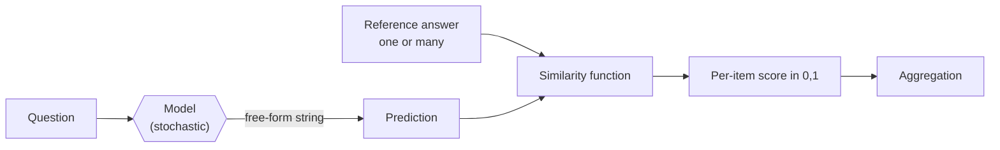

# Day 3 — Open-ended generation scoring: EM, F1, BLEU/ROUGE, and beyond

## TL;DR

When the model writes prose instead of picking a letter, "scoring" becomes a *similarity function* from (prediction, reference) to a number — and there are at least six standard candidates (EM, F1, BLEU, ROUGE, BERTScore, LLM-as-judge), each with different failure modes. Today's anchor — **TriviaQA** (Joshi et al. 2017), short-form factoid QA — makes the trade-off mechanically observable: EM is too strict, token F1 with alias expansion is the workable default for short answers, and $n$-gram overlap metrics start measuring fluency rather than meaning the moment outputs grow past a noun phrase. The right reflex is to pick the *simplest sufficient* metric your task admits and budget for what every alternative still misses.

## Learning objectives

By the end of this lesson, you will be able to:

1. **(L2)** State why free-form scoring is structurally a similarity function and name the six standard candidates (EM, F1, BLEU, ROUGE, BERTScore, LLM-as-judge).
2. **(L2)** Describe TriviaQA's construction (95K QA pairs, alias sets, `rc.nocontext` closed-book configuration) and why it is the right anchor for demonstrating EM/F1 mechanics.
3. **(L3)** *Compute* EM and token-level F1 on a worked free-form example, including SQuAD-style normalization and the max-over-aliases reduction.
4. **(L4)** *Analyze* the documented failure modes of BLEU and ROUGE — paraphrase blindness, ordering insensitivity, formatting brittleness, reference-count sensitivity — and identify which ones the brevity penalty does *not* fix.
5. **(L5)** *Evaluate* a metric choice for a given task profile (short factoid QA vs. long-form summarization vs. system-level translation) using the "simplest sufficient metric" rule.
6. **(L4)** *Contrast* embedding-based scoring (BERTScore), reward-model scoring, and LLM-as-judge on the cost / reproducibility / human-correlation axes.

## Prerequisites & callback

This lesson sits directly on [D-1](/lesson/1)'s pipeline framing. [D-1](/lesson/1) split every benchmark into (dataset, scoring rule, reporting convention) and showed that on multiple-choice the *scoring rule* box is set membership over `{A, B, C, D}`. [D-1](/lesson/1) also flagged the MC-vs-free-form trade-off explicitly: MC removes generation-quality confounds at the cost of cue exploitation; free-form tests what users actually do but pushes all the difficulty into the similarity function. [D-3](/lesson/3) is the deep dive on that second arm — same pipeline diagram, same "evaluation-as-code" framing, but the `Scoring rule` box is now an open research question. Bring [D-1](/lesson/1)'s habit of asking *"what pipeline?"* with you, because for free-form the answer is no longer "n-shot, template, `acc` vs. `acc_norm`" but "EM vs. F1 vs. BLEU vs. judge".

## The opening hook

[D-1](/lesson/1) ended with a sharp trade-off: multiple-choice scoring is automatic and cheap, but it only tests whether the model can pick a letter. Free-form generation tests what users actually do — typing a question and reading prose back — but somebody now has to decide whether the prose is *right*. That "somebody" used to be a regex. Then it was BLEU. Then it was ROUGE. Today it's increasingly another language model. None of these is a free lunch, and the failure modes are different for each.

This lesson is the deep dive on the free-form side of [D-1](/lesson/1)'s contrast. We'll use **TriviaQA** (Joshi et al. 2017) as the lab — short-form factoid QA where the gold answer is one or a few tokens, so you can directly observe why exact match is too strict, why F1 helps a little, and why $n$-gram overlap metrics are a poor proxy for reasoning the moment outputs get longer than a noun phrase.

## What changes when the answer is free-form

In MMLU-style MC, the model's output space is `{A, B, C, D}` and scoring is set membership. In free-form, the output space is "any string the tokenizer can emit" and scoring becomes a *similarity function* — a deterministic-but-imperfect map from (prediction, reference) to a number in $[0, 1]$:



Every choice on the right of that diagram is a research argument. EM, F1, BLEU, ROUGE, BERTScore, and LLM-as-judge are five different similarity functions plus a learned one, and they disagree on which outputs count as correct. The rest of the lesson walks through them in roughly historical order.

## Anchor: TriviaQA (Joshi et al. 2017)

**TriviaQA** — *A Large Scale Distantly Supervised Challenge Dataset for Reading Comprehension* — was introduced by Mandar Joshi, Eunsol Choi, Daniel S. Weld, and Luke Zettlemoyer at ACL 2017 (arXiv:1705.03551).

Format and stats:

- **95K** human-authored question-answer pairs sourced from 14 trivia websites.
- **~650K** question-answer-evidence triples in total (the dataset pairs each QA with ~6 distantly-supervised evidence documents — Wikipedia articles or Web search results).
- The released `rc` (reading-comprehension) split has **138,384 train / 18,669 validation / 17,210 test** examples; the `unfiltered` split (where evidence isn't guaranteed to contain the answer) has **87,622 / 11,313 / 10,832**. Test labels are held out — evaluation goes through the official server.
- Each configuration has a `nocontext` variant that strips the evidence documents. `rc.nocontext` and `rc.wikipedia.nocontext` are how modern LLMs are evaluated: **closed-book**, no retrieval, the model has to know the answer from its parameters.

Why TriviaQA for *this* lesson? Three reasons:

1. **Answers are short** — usually 1–4 tokens (a person, a place, a date). That makes EM and F1 mechanically clean to demonstrate; you can compute both by hand on a single example.
2. **Answers have natural surface variation** — `Barack Obama` vs. `Obama` vs. `President Obama` vs. `Barack Hussein Obama II`. The dataset releases an *alias list* per question (Wikipedia redirects + manually curated) precisely because exact match against a single string would be unfair.
3. **It contrasts with MMLU on [D-1](/lesson/1).** Same kind of "factual knowledge" probe, but the model now has to *produce* the answer, not pick it. The gap between a model's MMLU score and its TriviaQA closed-book score tells you something about generation vs. recognition.

A canonical lm-evaluation-harness run:

```bash
lm_eval \
  --model hf \
  --model_args pretrained=meta-llama/Llama-3.1-8B \
  --tasks triviaqa \
  --num_fewshot 5 \
  --batch_size 8
```

The harness's `triviaqa` task is closed-book by default (the `rc.nocontext` Wikipedia subset), prompts the model with the question, takes the generated continuation up to a stop string, and scores it with **exact match against the alias set**, ignoring case and punctuation. That's the official metric — which we'll now show is a deliberate choice, not the only one.

## Exact match (EM)

EM is the strictest possible scoring rule for free-form output:

$$
\text{EM}(\hat{y}, Y) = \mathbb{1}\bigl[\, \text{norm}(\hat{y}) \in \{\text{norm}(y) : y \in Y\} \,\bigr]
$$

where $\hat{y}$ is the model's prediction, $Y$ is the set of gold aliases, and $\text{norm}(\cdot)$ is a *normalization function* that lowercases, strips punctuation, removes English articles (`a`, `an`, `the`), and collapses whitespace. The normalization pipeline used in TriviaQA evaluation is the one inherited from SQuAD (Rajpurkar et al. 2016) and reused almost everywhere downstream.

**Why EM is too strict.** Consider the question *"Who painted the Mona Lisa?"*

| Prediction | Gold aliases | EM |
| --- | --- | --- |
| `Leonardo da Vinci` | {`Leonardo da Vinci`, `da Vinci`, `Leonardo`} | 1 |
| `Leonardo` | same | 1 |
| `It was Leonardo da Vinci.` | same | 0 (extra tokens) |
| `Leonardo di ser Piero da Vinci` | same | 0 (alias not in set) |
| `Da Vinci, Leonardo` | same | 0 (ordering) |

Normalization handles capitalization, articles, and punctuation, but it can't handle word-order variation, additional context tokens, or aliases that weren't pre-collected. EM systematically under-credits correct answers that don't match the canonical surface form.

The blunt mitigation is **alias expansion**: TriviaQA ships Wikipedia-redirect-derived alias sets per question, and modern QA harnesses (NaturalQuestions, HotpotQA) do the same. This raises EM by several points but doesn't fix the structural problem — the alias set is necessarily finite, and any free-form answer has infinite valid surface forms.

## Token-level F1

F1 relaxes EM from set membership to bag-of-tokens overlap. Treat both prediction and reference as multisets of (normalized) tokens; compute precision, recall, and their harmonic mean:

$$
P = \frac{|\hat{T} \cap T|}{|\hat{T}|}, \quad R = \frac{|\hat{T} \cap T|}{|T|}, \quad F_1 = \frac{2 P R}{P + R}
$$

where $\hat{T}$ and $T$ are the token bags. When multiple gold aliases exist, the reported F1 is the *max* over aliases.

> **Worked example.** Question: *"Who painted the Mona Lisa?"* Prediction: `It was Leonardo da Vinci.` Gold aliases: {`Leonardo da Vinci`, `da Vinci`, `Leonardo`}.
>
> 1. **Normalize the prediction.** Lowercase, strip punctuation, drop articles → tokens `{it, was, leonardo, da, vinci}`. Bag size $|\hat{T}| = 5$.
> 2. **Normalize each alias and pick the best.** `leonardo da vinci` → tokens `{leonardo, da, vinci}` (bag size 3); `da vinci` → `{da, vinci}` (size 2); `leonardo` → `{leonardo}` (size 1). The best-overlapping alias is `leonardo da vinci`.
> 3. **Compute the overlap.** $\hat{T} \cap T = \{leonardo, da, vinci\}$, three tokens.
> 4. **Compute precision and recall.** $P = 3/5 = 0.6$, $R = 3/3 = 1.0$.
> 5. **Compute F1.** $F_1 = 2 \cdot 0.6 \cdot 1.0 / (0.6 + 1.0) = 1.2 / 1.6 = 0.75$.
> 6. **Compute EM.** `it was leonardo da vinci` $\notin$ {normalized aliases}, so $\text{EM} = 0$.
>
> EM scores this 0; F1 scores it 0.75. The 0.75 is the *partial credit* recall buys you when the prediction includes the right tokens plus some extras.

F1 is mostly an improvement, but inherits structural problems. It is still:

- **Bag-of-words** — `dog bites man` and `man bites dog` get F1 = 1. Fine for short factoid answers, catastrophic for anything longer.
- **Tokenization-dependent** — the same answer scores differently under different tokenizers, and "tokens" in the SQuAD evaluation script means *whitespace-split words* after normalization, not BPE tokens. Subtle, and a source of harness disagreement.
- **Insensitive to entity boundaries** — `New York` (one place) shares tokens with `York` (a different place); F1 overweights overlap on common-word entities.

EM and F1 are the official TriviaQA metrics, and they are the *right* metrics for short-form factoid QA. The trouble starts when researchers reach for them on longer outputs.

## ⏵ Check yourself — EM and F1 by hand

Question: *"Who wrote the play 'Hamlet'?"*. Gold aliases: {`Shakespeare`, `William Shakespeare`}. The model outputs `the playwright was William Shakespeare`. Under standard SQuAD-style normalization (lowercase, strip punctuation, drop English articles, collapse whitespace), **compute** the EM score and the token-level F1 (max over aliases). Show your normalized bags and the precision/recall step.

<details>
<summary>Show answer</summary>

**Normalize the prediction.** `the playwright was william shakespeare`; "the" is an English article, drop it. Tokens: `{playwright, was, william, shakespeare}`. Bag size 4.

**Normalize aliases.** `shakespeare` → `{shakespeare}` (size 1); `william shakespeare` → `{william, shakespeare}` (size 2). Best-overlapping alias is `william shakespeare`.

**Overlap.** $\hat{T} \cap T = \{william, shakespeare\}$, two tokens.

**Precision and recall against the best alias.** $P = 2/4 = 0.5$, $R = 2/2 = 1.0$. $F_1 = 2 \cdot 0.5 \cdot 1.0 / (0.5 + 1.0) = 1/1.5 \approx 0.67$.

**EM.** `the playwright was william shakespeare` (after dropping the article: `playwright was william shakespeare`) is not in the normalized alias set $\{$`shakespeare`, `william shakespeare`$\}$, so $\text{EM} = 0$.

**Final answer.** EM = 0, F1 ≈ 0.67. The pedagogical point: EM zeroes out the answer because of the two extra tokens; F1 awards partial credit via recall, which is the modal regime for short-form QA where models often append framing words.

</details>

## $n$-gram overlap: BLEU and ROUGE

Once outputs are sentence- or paragraph-length (machine translation, summarization, long-form QA), people generally reach for **BLEU** (Papineni et al. 2002) for translation-flavored tasks and **ROUGE** (Lin 2004) for summarization-flavored tasks. Both are $n$-gram overlap metrics; they differ mainly on which side of the precision/recall axis they emphasize.

### BLEU in 60 seconds

BLEU computes *modified $n$-gram precision* — for each $n$ in $\{1, 2, 3, 4\}$, the fraction of $n$-grams in the hypothesis that appear in any reference, capped by the reference's count of that $n$-gram (so a hypothesis that repeats `the the the the` doesn't get free credit). Then it geometric-means across $n$ and applies a brevity penalty to discourage truncated outputs:

$$
\text{BLEU} = \text{BP} \cdot \exp\left( \sum_{n=1}^{4} w_n \log p_n \right)
$$

with $w_n = 1/4$ uniform and brevity penalty $\text{BP} = \min(1, e^{1 - r/c})$ where $r$ is reference length and $c$ is candidate length. BLEU is **corpus-level**: the $p_n$ are aggregated over the whole test set before the geometric mean, which is why per-sentence BLEU is a different (and generally worse-correlated) thing from corpus BLEU.

### ROUGE in 60 seconds

**ROUGE-N** is the recall-oriented analog: the fraction of $n$-grams in the *reference* that appear in the hypothesis. **ROUGE-L** uses the longest common subsequence rather than fixed $n$. Summarization people prefer recall-orientation because they care that the reference's content is covered, not that the hypothesis stays brief.

### The well-known failure modes

Both metrics fail in the same families of ways. Pick any of these and you can construct a hypothesis that scores well while being wrong, or scores badly while being right:

1. **Paraphrase blindness.** `The bank refused the loan` and `The loan was denied by the bank` share almost no $n$-grams beyond unigrams. The 2006 EACL critique (Callison-Burch, Osborne, & Koehn) demonstrated this with translation systems where higher BLEU did *not* track human judgments — a result later formalized in Reiter's (2018) structured review of 284 BLEU-vs-human correlations across 34 papers.
2. **Ordering insensitivity** *(unigram BLEU/ROUGE-1)*. Bigram and higher partially fix this, but not robustly — `dog bites man` and `man bites dog` share all unigrams and most bigrams under loose tokenization.
3. **Brittleness to formatting.** A trailing period, a different quotation-mark style, or a tokenizer that splits contractions differently can move BLEU by points without changing semantics. This is why BLEU implementations (`sacrebleu`, NLTK's `bleu_score`, the original Moses script) report different numbers on the same outputs — there is no canonical BLEU.
4. **Reference-count sensitivity.** BLEU was designed for *multiple* references per item; with one reference the score is much noisier and lower. Most modern LLM-eval setups have one reference. Ehud Reiter's review concludes BLEU is defensible for *system-level* MT comparison with multiple references and indefensible for individual-text scoring or non-MT tasks — which is the regime most LLM evaluation now operates in.

The deeper point: $n$-gram overlap is a proxy for "writes the same words in roughly the same order." For short factoid answers (TriviaQA), there's not much room for the proxy to fail. For anything longer, the proxy starts measuring fluency and surface form rather than meaning.

> **Safety researcher's note.** A model trained to optimize BLEU (rare today, common in pre-2019 MT work) is a small instance of a recurring pattern: an imperfect proxy metric becomes a training objective and the model finds the cheapest way to maximize it — typically by producing $n$-grams that pattern-match the reference distribution rather than the reference *meaning*. This is the entry-level Goodhart story, and it generalizes: if you train against an LLM-as-judge ([D-22](/lesson/22)) or a reward model ([D-24](/lesson/24)), the model finds judge/RM-specific shortcuts. The metric drift is not a hypothetical — it's the default outcome unless you actively defend against it. We don't foreground Goodhart on [D-3](/lesson/3), but this is where the curriculum starts collecting examples.

## ⏵ Check yourself — what the brevity penalty does (and doesn't)

The brevity penalty $\text{BP} = \min(1, e^{1 - r/c})$ in BLEU was designed to fix one specific failure mode of $n$-gram precision. Out of (a) *paraphrase blindness*, (b) *the model emitting a hypothesis much shorter than the reference*, (c) *formatting brittleness across BLEU implementations*, and (d) *single-reference noise*, identify which one the brevity penalty actually addresses, and **decompose** what each of the other three would still require to fix.

<details>
<summary>Show answer</summary>

The brevity penalty addresses **(b)**: a hypothesis far shorter than the reference $r$ produces $r/c > 1$, which makes $1 - r/c < 0$ and pulls $\text{BP}$ below 1, discounting the BLEU score. Without it, a degenerate system that emits only its highest-confidence $n$-grams would game raw $n$-gram precision.

Each of the other three is structurally outside what the BP can do:

- **(a) Paraphrase blindness.** The BP changes the magnitude of the score, not the set of $n$-grams it counts as overlapping. Paraphrase blindness requires moving away from surface $n$-gram matching — embedding-based metrics (BERTScore) or judge-based scoring.
- **(c) Formatting brittleness.** Tokenization and detokenization rules sit *upstream* of the BP. The standard fix is `sacrebleu`, which freezes a canonical tokenizer + detokenizer so the same outputs produce the same number across implementations.
- **(d) Single-reference noise.** The BP applies per-item but is not a variance reducer. The fix is structural — collect multiple references per item (which is why BLEU was designed for that regime) or move to a metric whose noise floor is tolerable with one reference.

The takeaway: the BP corrects *one* specific length-gaming pathology. The "well-known failure modes" of BLEU — paraphrase, formatting, single-reference, ordering — are independent and need their own remedies.

</details>

## Modern semantic alternatives

Three categories of metric tried to fix $n$-gram overlap's semantic blindness, in roughly chronological order.

### 1. Embedding-based: BERTScore

**BERTScore** (Zhang, Kishore, Wu, Weinberger, & Artzi, ICLR 2020; arXiv:1904.09675) replaces $n$-gram matching with cosine similarity between contextual embeddings:

1. Run the candidate and reference through a pretrained BERT-family model.
2. For each token in the candidate, find the reference token with the highest cosine similarity (greedy match).
3. Aggregate to precision (candidate-side max), recall (reference-side max), and F1.

This handles paraphrase — `denied` and `refused` end up close in embedding space — and partial credit for near-synonyms. It still struggles with negation (`the loan was denied` vs. `the loan was approved` are embedding-close), with longer outputs where small embedding differences accumulate, and with the choice of underlying encoder (BERTScore numbers from RoBERTa-large and from DeBERTa-xlarge are not directly comparable).

Other embedding-based metrics — **MoverScore**, **BLEURT** (a BERT fine-tuned on MT human judgments), **COMET** (the modern MT-eval workhorse) — sit on the same axis with different aggregation choices and different supervision signals. They're better than BLEU at correlating with human judgments; they're not perfect, and they require GPU at eval time.

### 2. Reward-model-based scoring

After RLHF, every aligned LLM ships with (or near) a **reward model** — a classifier trained on pairwise human preferences that scores any (prompt, response). Stiennon et al. (2020) showed reward models trained on human comparisons of summaries produced summaries that humans preferred over those optimizing ROUGE — early, direct evidence that the RM was a better target than the $n$-gram metric.

You can use a reward model as an evaluator: score each candidate response, aggregate. The catch is **calibration** — RMs are confident in ways that don't always match human judgments, and they encode the preferences of whoever labeled them. [D-24](/lesson/24) is a full reprise on RewardBench and the calibration thread; the takeaway here is just that "use a trained scorer instead of a hand-coded metric" is the modern alternative.

### 3. LLM-as-judge

The frontier of automatic open-ended evaluation is **LLM-as-judge**: prompt a strong model (GPT-4, Claude) with the question, the reference (or not), and the candidate, and ask it to score or compare. Zheng et al. (2023, NeurIPS) — *Judging LLM-as-a-Judge with MT-Bench and Chatbot Arena* — established this methodology and documented its biases (position, verbosity, self-preference, bandwagon). On agreeable open-ended tasks, GPT-4-as-judge agrees with humans at roughly the level humans agree with each other (~80%).

This is the metric that's eaten the field for open-ended evaluation since 2023. **[D-22](/lesson/22)** is the full lesson; the pointer here is that when you see a paper score Llama-3 against GPT-4 on a free-form benchmark, the scorer is increasingly another LLM rather than BLEU/ROUGE, with all that implies for cost, reproducibility, and judge-specific systematic error.

## ⏵ Check yourself — picking the simplest sufficient metric

You are evaluating three systems and need to pick a metric for each. (i) A closed-book factoid QA system on TriviaQA, where answers are usually 1–4 tokens. (ii) A neural MT system being compared against last year's baseline at the *system level*, with two reference translations per item. (iii) An open-ended summarization system whose outputs are 200–400 tokens of prose. Which metric is the **most defensible** simplest sufficient choice for each, and what is the load-bearing reason in each case?

<details>
<summary>Show answer</summary>

(i) **EM + F1 with alias expansion.** Answers are short, alias sets handle most surface variation, the metrics are deterministic and cheap, and they are the official TriviaQA metrics. Reaching for an LLM judge on this task adds cost and judge bias without improving human-correlation in a regime where overlap is already a tight proxy.

(ii) **BLEU (e.g., `sacrebleu`) at system level, optionally with COMET as a complement.** Reiter's structured review explicitly defends this regime: system-level MT comparison with multiple references is where BLEU's per-sentence noise washes out and its correlations with human judgment become defensible. COMET adds a learned-metric perspective for free.

(iii) **LLM-as-judge with multiple judges, or reward-model scoring ([D-24](/lesson/24)).** $n$-gram overlap is paraphrase-blind on long outputs; embedding-based metrics drift as embedding errors accumulate over hundreds of tokens. The defensible move is the most expensive one — judge with multiple models to absorb judge-specific biases, and budget for it. If multi-judge is out of reach, BERTScore is a defensible-but-weaker fallback.

The unifying rule: **simplest sufficient metric that captures the property you care about**. (i) wants surface match — overlap is sufficient. (ii) wants relative system ranking with low noise — corpus BLEU at system level is sufficient. (iii) wants meaning-level judgment — only a learned scorer is sufficient.

</details>

## Where each metric earns its keep

For the rest of the curriculum, the rule of thumb is:

| Task shape | Metric | Why |
| --- | --- | --- |
| Short factoid QA (TriviaQA, NQ) | EM + F1 with alias expansion | Answers are short; alias sets handle most surface variation. |
| Math/code with verifiable answers (GSM8K, HumanEval) | Exact match on extracted answer / `pass@k` | Answer is a number or a program output — checkable. ([D-9](/lesson/9), [D-11](/lesson/11)) |
| Long-form generation (summarization, open-ended) | LLM-as-judge with multiple judges or reward-model scoring | $n$-gram overlap is too weak; embedding-based is better but still misses meaning-level errors. ([D-22](/lesson/22), [D-24](/lesson/24)) |
| Translation, system-level comparison | BLEU + COMET | BLEU is defensible *at system level* with multiple references; COMET is the modern complement. |
| Anything where you need fast, cheap, reproducible | The simplest sufficient metric — usually EM or F1 if you can get away with it | Cost and reproducibility matter. Don't reach for an LLM judge if regex would do. |

Most modern capability evals deliberately pick tasks with checkable answers (GSM8K, MATH, HumanEval, GPQA) precisely so they can avoid this whole question. The price is that "checkability" filters out the most realistic generation tasks — which is why [D-22](/lesson/22) and [D-24](/lesson/24) exist.

## Cross-references

**Backward.**

- [D-1](/lesson/1) — picks up the MC vs. free-form contrast and the "scoring rule" box in the pipeline diagram; today's lesson is the deep dive on what fills that box when the output space is open.

**Forward.**

- [D-9](/lesson/9) — picks up *exact match on extracted answer* as the scoring rule for math (GSM8K), where the answer is a number you can pull out of a chain of reasoning.
- [D-11](/lesson/11) — picks up *checkable-answer* scoring for code via `pass@k` — the unit test is the similarity function.
- [D-15](/lesson/15) — picks up factuality scoring (TruthfulQA), where free-form correctness is harder than TriviaQA-style alias matching because the failure mode is plausible-but-wrong.
- [D-22](/lesson/22) — full lesson on **LLM-as-judge**: the modern default for long-form open-ended evaluation, with its biases (position, verbosity, self-preference) named and measured.
- [D-24](/lesson/24) — full lesson on **reward-model evaluation** (RewardBench), closing the calibration thread and reprising the "trained scorer instead of a hand-coded metric" lineage from Stiennon et al. 2020.

## Takeaways

1. Free-form scoring is structurally a similarity function from (prediction, reference) to $[0, 1]$; EM, F1, BLEU, ROUGE, BERTScore, and LLM-as-judge are six standard choices with different failure modes. *(LO 1)*
2. **TriviaQA**'s closed-book `rc.nocontext` configuration scores predictions with **exact match against alias sets**; alias expansion is the blunt-but-necessary fix for EM's strictness on natural surface variation. *(LO 2)*
3. **EM** is too strict; **token-level F1** with bag-of-tokens overlap and the *max-over-aliases* reduction is the workable default for short-form QA. The Mona Lisa worked example yields EM = 0, F1 = 0.75 — partial credit via recall. *(LO 3)*
4. **BLEU** (Papineni et al. 2002) and **ROUGE** (Lin 2004) are $n$-gram overlap metrics — paraphrase-blind, ordering-fragile, formatting-brittle, single-reference-noisy. The brevity penalty fixes only the length-gaming pathology, not the others. Defensible at *system level* with *multiple references* on the tasks they were designed for; misleading otherwise (Callison-Burch et al. 2006; Reiter 2018). *(LO 4)*
5. **Semantic alternatives** trade compute and reproducibility for better human-judgment correlation: embedding-based (BERTScore, BLEURT, COMET), reward-model-based (Stiennon et al. 2020 lineage; [D-24](/lesson/24)), LLM-as-judge (Zheng et al. 2023; [D-22](/lesson/22)). *(LO 6)*
6. Pick the **simplest sufficient metric** your task admits — overlap for short factoid QA, system-level BLEU for MT, judge-based for long-form. Reach for an LLM judge only when nothing cheaper captures the property you care about, and budget for the judge's biases and cost. *(LO 5)*

## Glossary

- **exact match (EM)**: the strictest free-form scoring rule — $\text{EM} = 1$ iff the normalized prediction exactly equals one of the normalized gold aliases. The official TriviaQA metric for short-form QA [introduced D-3](/lesson/3).
- **token-level F1**: harmonic mean of precision and recall over bag-of-(normalized-)tokens overlap between prediction and reference; reported as the *max* over aliases when multiple aliases exist [introduced D-3](/lesson/3).
- **alias expansion**: the practice of pre-collecting equivalent surface forms (Wikipedia redirects, manual curation) per question so EM/F1 don't penalize valid paraphrases. Necessary but finite — any free-form answer has infinite valid surface forms [introduced D-3](/lesson/3).
- **SQuAD-style normalization**: lowercase, strip punctuation, drop English articles (`a`, `an`, `the`), collapse whitespace; inherited from Rajpurkar et al. 2016 and reused across most short-form-QA harnesses [introduced D-3](/lesson/3).
- **BLEU**: corpus-level modified $n$-gram precision (n = 1..4, geometric mean) with a brevity penalty for short hypotheses; defensible for system-level MT with multiple references, indefensible for individual-text scoring (Reiter 2018) [introduced D-3](/lesson/3).
- **ROUGE**: $n$-gram (ROUGE-N) or longest-common-subsequence (ROUGE-L) recall-oriented analog of BLEU, designed for summarization where reference-content coverage is the property being measured [introduced D-3](/lesson/3).
- **BERTScore**: contextual-embedding cosine-similarity scoring (Zhang et al. 2020); handles paraphrase but stumbles on negation, long outputs, and encoder-choice non-comparability [introduced D-3](/lesson/3).
- **LLM-as-judge**: prompting a strong language model to score or compare candidate responses; the modern default for long-form open-ended evaluation, with documented position / verbosity / self-preference / bandwagon biases (Zheng et al. 2023). Foregrounded [D-22](/lesson/22) [introduced D-3 · used here](/lesson/3).

## References

- **Anchor.** Joshi, M., Choi, E., Weld, D. S., & Zettlemoyer, L. (2017). *TriviaQA: A Large Scale Distantly Supervised Challenge Dataset for Reading Comprehension.* ACL. arXiv:1705.03551. https://aclanthology.org/P17-1147/
- **Harness.** EleutherAI. *lm-evaluation-harness*, `triviaqa` task. https://github.com/EleutherAI/lm-evaluation-harness/tree/main/lm_eval/tasks/triviaqa
- **Secondary.** Rajpurkar, P., Zhang, J., Lopyrev, K., & Liang, P. (2016). *SQuAD: 100,000+ Questions for Machine Comprehension of Text.* EMNLP. arXiv:1606.05250.
- **Secondary.** Papineni, K., Roukos, S., Ward, T., & Zhu, W.-J. (2002). *BLEU: a Method for Automatic Evaluation of Machine Translation.* ACL. https://aclanthology.org/P02-1040/
- **Secondary.** Lin, C.-Y. (2004). *ROUGE: A Package for Automatic Evaluation of Summaries.* Text Summarization Branches Out (ACL workshop). https://aclanthology.org/W04-1013/
- **Secondary.** Callison-Burch, C., Osborne, M., & Koehn, P. (2006). *Re-evaluating the Role of Bleu in Machine Translation Research.* EACL. https://aclanthology.org/E06-1032/
- **Secondary.** Reiter, E. (2018). *A Structured Review of the Validity of BLEU.* Computational Linguistics 44(3). https://aclanthology.org/J18-3002/
- **Secondary.** Zhang, T., Kishore, V., Wu, F., Weinberger, K. Q., & Artzi, Y. (2020). *BERTScore: Evaluating Text Generation with BERT.* ICLR. arXiv:1904.09675.
- **Secondary.** Stiennon, N., Ouyang, L., Wu, J., Ziegler, D., Lowe, R., Voss, C., Radford, A., Amodei, D., & Christiano, P. (2020). *Learning to Summarize from Human Feedback.* NeurIPS. arXiv:2009.01325.
- **Secondary.** Zheng, L., Chiang, W.-L., Sheng, Y., et al. (2023). *Judging LLM-as-a-Judge with MT-Bench and Chatbot Arena.* NeurIPS Datasets and Benchmarks. arXiv:2306.05685. (Full treatment on [D-22](/lesson/22).)

## Quiz

**Q1.** A model is asked *"Who wrote Hamlet?"*. The gold alias set is `{Shakespeare, William Shakespeare}`. The model outputs `It was William Shakespeare.` Under the standard SQuAD-style normalization (lowercase, strip punctuation, drop articles), **compute** EM and token-level F1 (max over aliases):

- A. EM = 1, F1 = 1.0
- B. EM = 0, F1 = 1.0
- C. EM = 0, F1 ≈ 0.67
- D. EM = 1, F1 ≈ 0.67

**Q2.** Which of the following is **not** a documented failure mode of BLEU on individual-sentence scoring — i.e., decompose the list and identify the option that misnames BLEU's mechanism?

- A. Paraphrase blindness — semantically equivalent rewrites share few $n$-grams.
- B. Brittleness to formatting and tokenization differences.
- C. Length bias toward shorter hypotheses, even after the brevity penalty corrects for it.
- D. Sensitivity to the number of references — single-reference BLEU is much noisier than multi-reference BLEU.

**Q3.** TriviaQA's `rc.nocontext` configuration is the standard subset for evaluating modern LLMs. What does the `nocontext` part change?

- A. It strips the questions and replaces them with cloze-style fill-ins drawn from the evidence document spans, recasting the task as span prediction.
- B. It removes the evidence documents, forcing closed-book evaluation against parametric knowledge.
- C. It removes the gold answers and requires an LLM-as-judge to verify free-form predictions against the retrieved Wikipedia evidence.
- D. It removes the alias lists, forcing strict exact match against the single Wikipedia-canonical answer string per question.

**Q4.** BERTScore improves on BLEU primarily because — i.e., what is the load-bearing structural difference?

- A. It aggregates corpus-level rather than per-sentence statistics, which stabilizes the geometric mean of $n$-gram precisions on short outputs.
- B. It replaces hard $n$-gram matching with cosine similarity over contextual embeddings, handling paraphrase.
- C. It removes the need for a reference by scoring the candidate against a fluency model fine-tuned on web text.
- D. It is symmetric in precision and recall — unlike BLEU, which is precision-only and bolts on a separate brevity penalty for length.

**Q5.** A team reports a 4-point BLEU improvement on a translation system. Which of the following claims is **least supported** by Reiter (2018)'s structured review?

- A. The improvement may not correspond to a human-judged quality improvement at the system level if measured with a single reference.
- B. Per-sentence BLEU correlates poorly with human judgment even when corpus-level BLEU does not.
- C. BLEU is reasonably defensible for diagnostic, system-level MT comparison with multiple references.
- D. A 4-point BLEU improvement is statistically guaranteed to be a meaningful gain in translation quality.

**Q6.** You are evaluating a long-form summarization system and choosing between ROUGE-L, BERTScore, and an LLM-as-judge setup. Which framing is the **most defensible** read of modern practice on this curriculum's terms?

- A. ROUGE-L's longest-common-subsequence formulation remains the gold standard for summarization; embedding- and judge-based alternatives add compute without measurably improving human correlation.
- B. LLM-as-judge is strictly dominant on long-form outputs; ROUGE-L and BERTScore are obsolete and should not appear in modern summarization papers.
- C. Each metric trades cost, reproducibility, and human-correlation differently — report the simplest sufficient one your task and budget admit.
- D. Reward-model scoring ([D-24](/lesson/24)) is the only defensible option for long-form generation, since $n$-gram and embedding metrics provably fail to track human preference.

<details>
<summary>Answers</summary>

1. **C** — after normalization, prediction tokens are `{it, was, william, shakespeare}` and the best-matching alias `william shakespeare` normalizes to `{william, shakespeare}`. EM = 0 (extra tokens). $P = 2/4 = 0.5$, $R = 2/2 = 1.0$, $F_1 = 2/3 \approx 0.67$. The takeaway: EM penalizes extra tokens, F1 forgives them via recall.
2. **C** — BLEU's brevity penalty is specifically the correction for length bias toward shorter hypotheses; the option misnames the BP's role. The other three are well-documented failure modes (Callison-Burch et al. 2006; Reiter 2018).
3. **B** — `nocontext` strips the evidence documents so the model must answer from its parameters; this is how lm-evaluation-harness's `triviaqa` task is configured by default.
4. **B** — soft contextual-embedding similarity is the core idea; A and D are false (BERTScore is per-sentence and reports P/R/F1), and C is wrong (BERTScore needs a reference).
5. **D** — Reiter's review is precisely an argument *against* assuming BLEU deltas equate to quality gains, especially at sentence level or with single references. A, B, and C all match the review's conclusions.
6. **C** — the lesson's "where each metric earns its keep" framing: ROUGE-L is the cheap reproducible baseline, BERTScore adds paraphrase tolerance, LLM-as-judge correlates best with humans on long-form but costs more and brings its own biases ([D-22](/lesson/22)). A, B, and D each overclaim a single metric.

</details>
