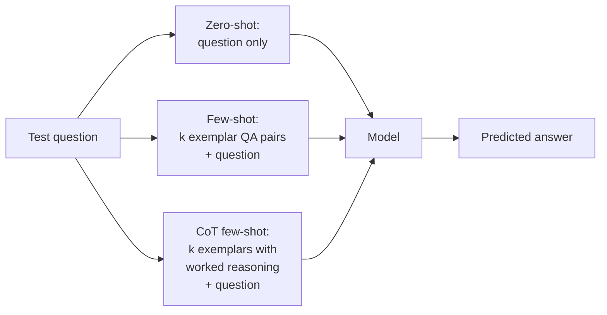

# Day 4 — Prompting strategies in evals: zero-shot, few-shot, chain-of-thought

## TL;DR

The prompting strategy is part of the eval, not a knob outside it: holding the model, dataset, and scoring rule fixed, switching among zero-shot, few-shot, and chain-of-thought few-shot can swing the headline number by 10–30 points. Today's anchor — **BIG-Bench Hard (BBH)**, a 23-task BIG-Bench subset (Suzgun et al. 2022) — was curated precisely to surface that swing: on Codex (`code-davinci-002`), answer-only few-shot scores 56.6% averaged across 23 tasks while CoT few-shot scores 73.9%, a +17.3-point gap on the same model and data. A model card that reports "BBH = 73.9" without naming its prompting variant is unfalsifiable.

## Learning objectives

By the end of this lesson, you will be able to:

1. **(L2)** Distinguish zero-shot, few-shot, zero-shot CoT, and few-shot CoT as four points in the prompting-strategy matrix, and state the one-line input-side change between each pair.
2. **(L3)** Given a published BBH headline, *apply* `lm-evaluation-harness`'s four-variant matrix (`bbh_zeroshot` / `bbh_fewshot` / `bbh_cot_zeroshot` / `bbh_cot_fewshot`) to identify which variant is required to reproduce the number.
3. **(L4)** *Analyze* a few-shot exemplar block by decomposing its contribution into the three independent mechanisms — format induction, task identification, reasoning elicitation — and identify which mechanism is load-bearing for a given task.
4. **(L4)** *Analyze* the BBH per-task pattern (CoT-helps / CoT-neutral / CoT-hurts buckets) to predict, for a new BIG-Bench task, which bucket its CoT-vs-direct gap is most likely to land in.
5. **(L5)** *Evaluate* a model card's BBH score for unstated prompting-pipeline assumptions (variant, exemplar source, aggregate vs. per-task) and surface the methodological question the headline leaves unfalsifiable.
6. **(L4)** Read CoT as a compute-budget knob — moving compute from inside the model to outside via decoded tokens — and connect that framing forward to the inference-time-scaling story ([D-25](/lesson/25)).

## Prerequisites & callback

Today's lesson assumes two pieces of prior machinery. From **[D-1](/lesson/1)**, the framing that an evaluation is a *(dataset, scoring rule, reporting convention) pipeline* — the prompting strategy is the input-side stage of that pipeline, the part [D-1](/lesson/1) grouped under "prompt template" and largely deferred to today. From **[D-2](/lesson/2)**, the mechanics of log-likelihood scoring on multiple-choice items — the option-by-option `acc` / `acc_norm` machinery that lets you score zero-shot MC at all on a base model. The Day-4 move is to admit a fourth degree of freedom — *what the prompt to the model actually looks like* — alongside the three [D-1](/lesson/1) introduced, and show that this fourth axis can swing scores by 10–30 points on the same model and dataset.

## The opening hook

[D-1](/lesson/1) ended on a quiet observation: two papers can report different MMLU numbers for the same model checkpoint and both be "correct." [D-2](/lesson/2) traced one source of that drift to the scoring rule (`acc` vs. `acc_norm`). [D-3](/lesson/3) traced another to the metric on free-form output. Today's source is the one most likely to swing a headline number by ten points or more, and it lives entirely on the input side.

If you take the same model, the same dataset, and the same scoring rule, and change only **how the prompt is constructed** — zero-shot vs. five-shot, with reasoning steps vs. answer-only — you can move the score from below random to above the average human. On BIG-Bench Hard, switching Codex (`code-davinci-002`) from answer-only few-shot to chain-of-thought few-shot moves it from **56.6%** to **73.9%** averaged across 23 tasks (Suzgun et al. 2022). Same model, same data, same scoring; the prompt is the experiment.

The pedagogical job of today's lesson is to convince you that the **prompting strategy is not separate from the eval — it is part of the eval**, on the same footing as the dataset and the scoring rule.

## The three strategies, in one frame



Every prompting strategy is a function from a test item to a formatted string the model conditions on. The three canonical choices:

- **Zero-shot.** Show the model the question alone, optionally with a task instruction.
- **Few-shot ($k$-shot).** Prepend $k$ worked exemplars of the form `(question, answer)`. The model conditions on those before seeing the test item.
- **Chain-of-thought few-shot (CoT).** Same as few-shot, but each exemplar's "answer" is replaced by *reasoning steps followed by the answer*. The model imitates the format and produces its own reasoning trace before the final token.

A fourth, **zero-shot CoT**, drops the exemplars but appends a trigger like `Let's think step by step.` to elicit reasoning without imitation (Kojima et al. 2022). It is cheaper than few-shot CoT but generally weaker; harnesses expose it as `bbh_cot_zeroshot`.

The harness change between any two of these is a few lines of YAML. The score change can be 10–30 points.

## Why the choice matters

There are three independent reasons a prompting strategy moves the score, and a literate reader of an eval-paper methods section will recognize all three.

### 1. Format induction

Few-shot exemplars do not teach the model the task in any meaningful sense. What they do is **demonstrate the answer format**. If the gold answer is `"(C)"` and the model's untuned tendency on a zero-shot prompt is to produce a paragraph that contains the word "carbon," then zero-shot scoring will fail not because the model lacks knowledge but because the harness's letter-extraction regex misses. Adding three exemplars where each ends with `So the answer is (X).` collapses that variance — the model now produces a string the regex can parse.

This is why the gap between zero-shot and few-shot is often *larger* on base (non-instruction-tuned) models, where the format-inducing role of exemplars matters most. Instruction-tuned chat models can usually be coaxed into the right format zero-shot, which compresses the gap but does not eliminate it.

### 2. Task identification

For ambiguous tasks, exemplars also disambiguate **what is being asked**. The BBH task `disambiguation_qa` has a question template like *"In the sentence 'The lawyer hired the assistant because she needed help', who needed help?"* — there are at least three reasonable readings (resolve to the lawyer, resolve to the assistant, "ambiguous"). Three exemplars where the gold answer is consistently `"Ambiguous"` for sentences that are in fact ambiguous tells the model both *the answer space* (a small set of options) and *the convention* (when in doubt, say "ambiguous"). Zero-shot, the model has to guess the convention.

### 3. Reasoning elicitation

This is the part CoT changes. For tasks where the answer is one token but the work is many tokens — multi-step arithmetic, object tracking, logical deduction — a model that is *forced* to produce a single answer token at decoding time has no scratchpad. CoT reframes the problem: the model is allowed (in fact, demonstrated) to produce intermediate state. This is not a property of the model's weights; it is a property of what the decoding loop allows the model to compute over. Wei et al. (2022) named the technique; Suzgun et al. (2022) curated the benchmark that demonstrates exactly which kinds of tasks this matters for.

## ⏵ Check yourself — which mechanism is doing the work?

You evaluate an instruction-tuned chat model on a BBH-style multi-step arithmetic task that asks for a single letter, and find the zero-shot score is roughly the same as the few-shot answer-only score, but the few-shot **CoT** score is +25 points higher. Of the three mechanisms (format induction, task identification, reasoning elicitation), which is most plausibly load-bearing here, and which is most plausibly *not* doing significant work?

<details>
<summary>Show answer</summary>

For this model on this task, **reasoning elicitation** is doing the heavy lifting — the +25-point gap appears only when the prompt format permits a reasoning trace, indicating the model can solve the task with a scratchpad it cannot solve in one decoded token. **Format induction** is most plausibly *not* doing significant work: an instruction-tuned model already produces letter-formatted answers zero-shot, and the observation that few-shot answer-only didn't help over zero-shot is direct evidence that demonstrating the answer format wasn't the bottleneck. **Task identification** is in between — the few-shot exemplars surface what's being asked, but on a familiar arithmetic format the model wasn't lost zero-shot. The lesson generalizes: which of the three mechanisms is load-bearing depends on the model (base vs. instruction-tuned) and the task (recognition vs. multi-step), and the diagnosis comes from the *pattern of gaps* across the four-variant matrix, not from any single number.

</details>

## Anchor: BIG-Bench Hard (Suzgun et al. 2022)

BIG-Bench Hard is a 23-task subset of BIG-Bench (Srivastava et al. 2022/2023, ~204 tasks contributed by 450 authors). The selection criterion is sharp and *makes the benchmark explicitly about prompting*:

> The 23 tasks are precisely those BIG-Bench tasks where the **best prior language-model performance failed to exceed the average human-rater baseline** in the original BIG-Bench evaluation.

The BIG-Bench evaluation used few-shot prompting *without* chain-of-thought. So BBH is, by construction, the slice of BIG-Bench where answer-only few-shot demonstrably underestimates what the field's best models can do. The pedagogical hook is that the benchmark exists *to surface the CoT-vs-direct gap*. If you don't believe prompting strategy is part of the eval, BBH is the benchmark designed to change your mind.

Headline numbers on BBH (Suzgun et al. 2022, Codex `code-davinci-002`, averaged across 23 tasks):

| Setting | Score |
| --- | --- |
| Random baseline | 25.7% |
| Average human-rater | 67.7% |
| Few-shot answer-only | 56.6% |
| Few-shot **with CoT** | **73.9%** |

The +17.3 point gap on Codex is what the paper exists to document. CoT moved Codex from "below the average human" to "above the average human on 17 of 23 tasks." PaLM 540B (also reported in the paper) shows the same direction: with CoT it surpasses the average human on 10 of 23 tasks, reaching ≈65% averaged across BBH. The PaLM 540B answer-only baseline is reported per-task in the paper rather than as a single aggregate, so we don't quote it as a number; the qualitative pattern is the same — answer-only underperforms the human average on most tasks; CoT closes the gap.

### Example item

BBH ships every task in two prompt formats — `direct-prompts/` (answer-only few-shot) and `cot-prompts/` (CoT few-shot) — so the *prompt format itself* is part of the eval contract. The shared item is the same; the demonstrations and answer format differ. Below is the same `tracking_shuffled_objects_three_objects` test item rendered in both formats so you can see the contract end-to-end.

The BBH task `tracking_shuffled_objects_three_objects` asks the model to track which of three objects each player ends up with after a sequence of pairwise swaps. Both prompt formats use $k = 3$ worked exemplars; only the exemplar content differs.

**Direct (answer-only) exemplar — `direct-prompts/`:**

```text
Q: Alice, Bob, and Claire are playing a game. At the start, they each
hold a ball: Alice has yellow, Bob has blue, and Claire has pink.
First, Claire and Alice swap. Then, Alice and Bob swap. Finally,
Claire and Bob swap. At the end, Bob has the
Options:
(A) yellow ball
(B) blue ball
(C) pink ball
A: (A)
```

**CoT exemplar — `cot-prompts/`:**

```text
Q: Alice, Bob, and Claire are playing a game. At the start, they each
hold a ball: Alice has yellow, Bob has blue, and Claire has pink.
First, Claire and Alice swap. Then, Alice and Bob swap. Finally,
Claire and Bob swap. At the end, Bob has the
Options:
(A) yellow ball
(B) blue ball
(C) pink ball
A: Let's think step by step.
(0) At the start: Alice: yellow, Bob: blue, Claire: pink.
(1) Claire and Alice swap: Alice: pink, Bob: blue, Claire: yellow.
(2) Alice and Bob swap:    Alice: blue, Bob: pink, Claire: yellow.
(3) Claire and Bob swap:   Alice: blue, Bob: yellow, Claire: pink.
At the end of the game, Bob has the yellow ball. So the answer is (A).
```

The dataset, the scoring rule (exact match on `(A)` / `(B)` / `(C)`), and the model are identical. Only the exemplar style changes. On `tracking_shuffled_objects_three_objects`, that change is the difference between near-random performance and near-perfect performance for the strongest models in the paper.

### The per-task pattern is the lesson

If you average over BBH, CoT helps. If you read it task by task, the picture is more interesting and more *pedagogically* useful: CoT does not help uniformly. The paper sorts the 23 tasks into three rough buckets:

1. **CoT unlocks the task.** Multi-step reasoning where the answer requires holding intermediate state: `tracking_shuffled_objects_*`, `multistep_arithmetic`, `dyck_languages`, `web_of_lies`, `logical_deduction_*`. Gaps of +20 to +60 points are common. These tasks have *flat scaling curves* under answer-only prompting (more parameters don't help) and *steep* scaling curves under CoT.
2. **CoT is roughly neutral.** Single-step recognition tasks where the answer is essentially a lookup or a one-step inference: parts of `sports_understanding`, `causal_judgement`. CoT neither helps nor much hurts.
3. **CoT can hurt.** A small number of tasks where reasoning out loud lets the model talk itself into a wrong answer, or where the format of "reasoning then answer" disrupts a strong direct-recognition signal. The paper notes this is rare on BBH but real, and it is the seed of a much larger story about CoT failure modes (faithfulness — does the verbalized reasoning actually drive the answer? — gets a full treatment on [D-9](/lesson/9) with GSM8K and process supervision).

The takeaway: *whether to use CoT in your evaluation pipeline is a per-task design decision, not a global default.* Picking one strategy for the whole benchmark and reporting a single aggregate number throws away the information BBH was designed to surface.

## Few-shot mechanics, in detail

The mechanical implementation of few-shot is exemplar prepending, but two non-obvious choices live inside that:

**Where do exemplars come from?** They are typically a separate held-out dev/train split, not items from the test set. MMLU draws its 5-shot exemplars from a per-subject 5-item dev set. BBH ships hand-curated exemplars in `cot-prompts/` and `direct-prompts/` directories — the *same* exemplars are used for every test item in a given task, which means the few-shot prompt is constant across the test set. This is a deliberate choice: it makes the eval reproducible (no exemplar-sampling variance) at the cost of giving up the variance reduction you'd get from rotating exemplars.

**Are exemplars selected, or fixed?** "Fixed exemplars" is the default; "selected exemplars" (retrieving the $k$ most similar dev items per test item) is a stronger but pipeline-heavy variant that is *not* what `lm-evaluation-harness` defaults to. If a paper claims few-shot performance with selected exemplars, that is a different pipeline.

`lm-evaluation-harness` exposes BBH through four configs that map directly onto the matrix above:

```text
bbh_zeroshot      — k=0, no reasoning trace
bbh_fewshot       — k=3, answer-only exemplars
bbh_cot_zeroshot  — k=0, "Let's think step by step." trigger
bbh_cot_fewshot   — k=3, CoT exemplars  (alias: bbh)
```

A canonical run:

```bash
lm_eval \
  --model hf \
  --model_args pretrained=meta-llama/Llama-3.1-8B-Instruct \
  --tasks bbh_cot_fewshot \
  --batch_size 8
```

Switching `--tasks bbh_cot_fewshot` to `--tasks bbh_fewshot` is the entire pipeline change required to reproduce the CoT-vs-direct gap on your own model. It is a one-token edit in YAML and the most informative single experiment a Week 1 reader can run.

## ⏵ Check yourself — variant-ambiguous headlines

Two papers report BBH scores for the same Llama-3-8B-Instruct checkpoint: Paper A reports 35.6, Paper B reports 67.4. The weights are identical and both papers cite Suzgun et al. (2022)'s exemplars. **Compute** the gap and identify which pipeline difference under the four `bbh_*` configurations is the most plausible single explanation, and what additional information you would need from each paper's methods section to confirm it.

<details>
<summary>Show answer</summary>

A 31.8-point gap on the same checkpoint is overwhelmingly characteristic of a *variant difference*: Paper A is most plausibly running `bbh_zeroshot` (k=0, no reasoning trace, the floor of the matrix) while Paper B is running `bbh_cot_fewshot` (k=3 with CoT exemplars, the ceiling). Pipeline drift inside a *single* variant — different exemplars, slightly different scoring regex, batch-size effects on stochastic decoding — rarely opens 30-point gaps; the +17.3 Codex aggregate is itself the canonical magnitude of *one variant change*, and the open-weights spread on smaller models is similar. The confirming information you would ask each paper for is the exact `--tasks` config (or its equivalent), the exemplar block actually used, and whether reasoning was elicited (k > 0 with CoT exemplars or a `Let's think step by step.` trigger). Without that line of methods text, the headline number is unfalsifiable — the same paper-level claim "BBH = 35.6" is consistent with at least two of the four canonical variants.

</details>

## A small piece of math: why CoT is a *compute* knob

A useful way to read CoT is as moving compute from the inside of the model to the outside. A standard decoding step computes one forward pass per output token. If the answer is one token, answer-only prompting buys exactly one forward pass to do the work. If the answer is preceded by 200 tokens of reasoning, the model gets 201 forward passes — each conditioned on the previous tokens — to compute the answer.

Roughly, with $T$ output tokens generated under temperature-zero greedy decoding:

$$
\text{compute per item} \;\propto\; T \cdot N_\text{params}.
$$

Doubling $T$ doubles the compute. *Where CoT helps, it does so partly by buying more sequential compute per item.* This is the seed of the entire **inference-time-scaling** thread: if more decoded tokens means more compute means more correct answers on reasoning-heavy tasks, then a model's accuracy is no longer a single number — it is a curve over decoding budget. We pick this back up on [D-25](/lesson/25) (AIME, FrontierMath, the o1 system card) where the budget axis becomes a first-class reporting axis.

> **Safety researcher's note.** CoT is a double-edged tool for a safety practitioner. On one side, the verbalized reasoning trace is a *transparency surface*: you can read it, grep it for refusals, train a process-supervision reward model on it (Lightman et al. 2023, previewed on [D-9](/lesson/9)). On the other side, **CoT faithfulness is not guaranteed** — recent work (Turpin et al. 2023; Anthropic 2025 "Reasoning models don't always say what they think") shows that models routinely produce reasoning that does not in fact drive the final answer. Optimizing for legible CoT can produce models whose visible reasoning looks aligned while their actual decision is something else. Today's BBH-flavored takeaway is narrower: CoT changes scores. The deeper question of whether the reasoning trace is a real window into the model is an open problem we'll pick up on [D-9](/lesson/9) (process supervision) and again on [D-25](/lesson/25) (reasoning models).

## What the headline number doesn't tell you

Three things that the single number `BBH = 73.9%` quietly hides, and that any reader of an eval paper should reach for:

- **Which prompting variant?** A paper that reports "BBH = 73.9" without saying *which of the four variants* is unfalsifiable. The same model can plausibly score anywhere from 35% (zero-shot, answer-only) to 75%+ (3-shot CoT) depending on the variant. The methods section must specify.
- **Per-task vs. aggregate?** The aggregate number averages over tasks where CoT swung +60 and tasks where it swung -2. The per-task table is doing far more work than the average.
- **Whose exemplars?** Different papers using BBH have occasionally re-written the CoT exemplars (e.g., to fit a chat template). The "BBH score" of one model under one paper's exemplars is not strictly comparable to the same model under another paper's exemplars. The Suzgun et al. (2022) shipped exemplars in `cot-prompts/` are the canonical reference; deviation from them is methodologically meaningful and should be flagged.

## ⏵ Check yourself — per-task vs. aggregate

Suzgun et al. (2022) report that on BBH-aggregate Codex moves from 56.6% to 73.9% under CoT — a +17.3 point gap. On a specific sub-task `sports_understanding`, the same paper reports CoT and answer-only within roughly a point of each other. **What is the most defensible reading** of why one should *not* report only the BBH aggregate when comparing two prompting strategies in a research paper or model card?

<details>
<summary>Show answer</summary>

The aggregate compresses a non-uniform per-task pattern into a single number. On BBH the +17.3-point average is the mean of (a) tasks where CoT unlocks +20 to +60 points (multi-step object tracking, multistep arithmetic, dyck languages, logical deduction), (b) tasks where CoT is roughly neutral (single-step recognition like sports understanding or causal judgement), and (c) a small set where CoT can hurt. Reporting only the aggregate hides which of those three regimes a *new* task or model lands in — and the methodological question the BBH paper exists to answer is exactly *which regime*, not "what is the average lift." A model card that headlines the aggregate without showing a per-task breakdown is doing the same thing MMLU did with subject-aggregate ([D-1](/lesson/1)'s macro-vs-micro point): surfacing one number where a 23-row table is the actual evidence.

</details>

## Cross-references

**Backward.**

- [D-1](/lesson/1) — picks up the *(dataset, scoring rule, reporting convention) pipeline* framing and adds the prompting strategy as a fourth axis on the input side.
- [D-2](/lesson/2) — picks up *log-likelihood scoring* and the `acc` / `acc_norm` mechanics, which are the per-option scoring substrate that lets zero-shot MC be scored on a base model in the first place.
- [D-3](/lesson/3) — picks up *free-form scoring* — relevant because CoT outputs are free-form prose terminating in an extracted answer, so generative-output extraction (regex on `So the answer is …`) becomes part of the pipeline.

**Forward.**

- [D-9](/lesson/9) — picks up the *CoT faithfulness* failure mode on math reasoning, where the gap is even larger and process-supervision (Lightman et al. 2023) becomes the central instrument.
- [D-22](/lesson/22) — picks up the methodology question of whether CoT-as-rationale should be *judged* by an LLM (and the Goodhart hazards of doing so).
- [D-25](/lesson/25) — picks up *inference-time scaling*: when "produce more reasoning tokens" stops being a prompting trick and becomes a model property (o1, o3, R1), the entire evaluation contract has to change to put compute-per-item on the x-axis.

## Takeaways

1. The prompting strategy (zero-shot, few-shot, CoT) is part of the eval pipeline, not separate from it — same model, same data, same scoring; the prompt is the experiment. *(LO 1)*
2. Few-shot exemplars do three things at once: induce the answer format, identify the task, and (with CoT) elicit reasoning. The first two often dominate on simple tasks; the third dominates on multi-step ones. *(LO 3)*
3. BBH is the 23-task BIG-Bench slice where prior LMs underperformed the average human under answer-only few-shot — it exists *to surface the CoT-vs-direct gap*. *(LO 1)*
4. On BBH, Codex moves from 56.6% (answer-only) to 73.9% (CoT) averaged across 23 tasks — the +17.3 point gap is the canonical magnitude of "prompting strategy is part of the eval," and `lm-evaluation-harness` exposes the four variants as `bbh_zeroshot` / `bbh_fewshot` / `bbh_cot_zeroshot` / `bbh_cot_fewshot`. *(LO 2)*
5. The aggregate hides the per-task pattern: CoT unlocks some tasks, is neutral on others, and can hurt on a few. Choosing one strategy globally throws away that information. *(LO 4)*
6. Before treating a BBH headline as a measurement, ask **"which variant, whose exemplars, aggregate or per-task?"** — without those three, the number is unfalsifiable. *(LO 5)*
7. Reading CoT as a compute-budget knob (more decoded tokens = more sequential compute per item) prepares the reader for the inference-time-scaling story ([D-25](/lesson/25)). *(LO 6)*

## Glossary

- **few-shot ($k$-shot) prompting**: prepending $k$ worked `(question, answer)` exemplars to the test item before the model reads it [introduced D-4](/lesson/4).
- **chain-of-thought (CoT) prompting**: a few-shot variant whose exemplar answers are *reasoning steps then final answer*, so the model imitates the format and produces its own trace before committing to an answer [introduced D-4](/lesson/4).
- **zero-shot CoT**: the trigger-phrase variant ("Let's think step by step.") that elicits reasoning without exemplars; cheaper than few-shot CoT, generally weaker [introduced D-4](/lesson/4).
- **format induction**: the role of exemplars in *demonstrating the answer format* so harness regex extraction succeeds — distinct from teaching the task [introduced D-4](/lesson/4).
- **exemplar**: a `(question, answer)` pair (or `(question, reasoning, answer)` triple in CoT) prepended to the test item; typically held-out and fixed across the test set in canonical evals [introduced D-4](/lesson/4).
- **BIG-Bench Hard (BBH)**: the 23-task BIG-Bench subset where prior LMs under answer-only few-shot underperformed the average human-rater baseline — curated to surface the CoT-vs-direct gap [introduced D-4](/lesson/4).
- **CoT faithfulness**: whether the verbalized reasoning trace actually drives the model's final answer; not guaranteed (Turpin et al. 2023) [introduced D-4 · forward pointer to D-9](/lesson/4).
- **inference-time scaling**: the framing in which a model's accuracy is a curve over decoded-tokens-per-item rather than a single number; CoT is the seed of this thread [introduced D-4 · forward pointer to D-25](/lesson/4).

## References

- **Anchor.** Suzgun, M., Scales, N., Schärli, N., Gehrmann, S., Tay, Y., Chung, H. W., Chowdhery, A., Le, Q. V., Chi, E. H., Zhou, D., & Wei, J. (2022). *Challenging BIG-Bench Tasks and Whether Chain-of-Thought Can Solve Them.* arXiv:2210.09261. (Findings of ACL 2023.)
- **Harness.** `EleutherAI/lm-evaluation-harness`, `lm_eval/tasks/bbh/` (`bbh_zeroshot`, `bbh_fewshot`, `bbh_cot_zeroshot`, `bbh_cot_fewshot`). https://github.com/EleutherAI/lm-evaluation-harness/tree/main/lm_eval/tasks/bbh
- **Secondary.** Wei, J., Wang, X., Schuurmans, D., Bosma, M., Ichter, B., Xia, F., Chi, E. H., Le, Q. V., & Zhou, D. (2022). *Chain-of-Thought Prompting Elicits Reasoning in Large Language Models.* NeurIPS 2022. arXiv:2201.11903.
- **Secondary.** Kojima, T., Gu, S. S., Reid, M., Matsuo, Y., & Iwasawa, Y. (2022). *Large Language Models are Zero-Shot Reasoners.* NeurIPS 2022. arXiv:2205.11916.
- **Secondary.** Srivastava, A., et al. (2022/2023). *Beyond the Imitation Game: Quantifying and extrapolating the capabilities of language models* (BIG-Bench). TMLR.
- **Secondary.** Turpin, M., Michael, J., Perez, E., & Bowman, S. R. (2023). *Language Models Don't Always Say What They Think: Unfaithful Explanations in Chain-of-Thought Prompting.* NeurIPS 2023. arXiv:2305.04388.
- **Secondary.** `suzgunmirac/BIG-Bench-Hard` GitHub repo (`bbh/`, `cot-prompts/`, `direct-prompts/`). https://github.com/suzgunmirac/BIG-Bench-Hard

## Quiz

**Q1.** A paper reports "BBH = 71.2" for a model checkpoint and gives no further methodology detail. Which is the **most defensible reading** of the single piece of methodology information an evaluation-literate reader should ask for first before treating that number as a measurement?

- A. Which GPU type was used during the evaluation run.
- B. The decoding temperature and top-$p$ used to sample answers.
- C. The model's parameter count and pre-training corpus size.
- D. Which of the four `bbh_*` prompting variants was used.

**Q2.** BIG-Bench Hard's 23 tasks were selected because:

- A. They are the easiest BIG-Bench tasks, chosen so that small open-source models could solve them at near-ceiling without exemplars.
- B. They are the BIG-Bench tasks where prior LMs under answer-only few-shot failed to beat the average human-rater baseline.
- C. They cover exactly 23 mutually disjoint reasoning domains, one task per domain, balanced between arithmetic and language.
- D. They are the BIG-Bench tasks with multiple-choice format and a fixed four-option layout, selected for harness compatibility.

**Q3.** Suzgun et al. (2022) report Codex (`code-davinci-002`) at 56.6% on BBH under answer-only few-shot and 73.9% under CoT few-shot. **Compute** the gap and identify which of the following is **not** a contributing reason CoT moves the score on this benchmark:

- A. CoT lets the model produce intermediate state on multi-step reasoning tasks where one decoded token is not enough compute.
- B. CoT exemplars demonstrate a richer answer format than direct exemplars.
- C. The CoT condition uses a different test set than the answer-only condition.
- D. The benchmark was specifically curated to surface tasks where CoT helps.

**Q4.** A safety practitioner reads a model's chain-of-thought and concludes the trace is reasoning honestly to a refusal. Which assumption is the **load-bearing** one in that conclusion, and which [D-4](/lesson/4) reference flags it as not always justified?

- A. They are assuming CoT is faithful to the model's actual decision; Turpin et al. 2023 shows this is often false.
- B. They are assuming CoT reduces decoding latency, which Wei et al. 2022 report is offset by the longer reasoning trace.
- C. They are assuming the model must be instruction-tuned to refuse, which contradicts Suzgun et al. 2022's results on base Codex.
- D. They are assuming the harness uses log-likelihood scoring on the full trace; in practice CoT requires generative decoding throughout.

**Q5.** Which of the following correctly describes the relationship between zero-shot CoT (`Let's think step by step.`) and few-shot CoT?

- A. They are equivalent prompting techniques given different names by Wei et al. 2022 and Kojima et al. 2022 in the same NeurIPS proceedings.
- B. Few-shot CoT only works on instruction-tuned chat models; zero-shot CoT is the only variant compatible with base pre-trained checkpoints.
- C. Zero-shot CoT is strictly stronger on BBH because the trigger phrase generalizes across tasks while hand-written exemplars overfit.
- D. Few-shot CoT prepends $k$ worked-reasoning exemplars; zero-shot CoT instead appends a trigger phrase, and is usually weaker.

**Q6.** On BBH, you observe that on the 23-task average CoT beats answer-only by +17 points, but on a specific sub-task (e.g., `causal_judgement`) the two prompting strategies are within noise. What is the **right takeaway**?

- A. The sub-task's evaluation pipeline is broken: its scoring rule is silently rejecting CoT outputs that don't match the regex format.
- B. The aggregate hides the per-task pattern: CoT helps on multi-step-reasoning tasks and is neutral on single-step recognition tasks.
- C. The model is overfitting to the CoT exemplars on the sub-task, memorizing their reasoning style without generalizing to the test items.
- D. The sub-task should be removed from BBH because it dilutes the headline CoT-vs-direct gap reported by Suzgun et al. 2022.

<details>
<summary>Answers</summary>

1. **D** — the four BBH variants in `lm-evaluation-harness` can produce scores that span 30+ points on the same model. A reader who doesn't know which variant was used cannot interpret the headline number; the other three options are either irrelevant to BBH score (A, C) or second-order to variant choice (B).
2. **B** — see "Anchor: BIG-Bench Hard." The selection criterion is exactly the slice of BIG-Bench where answer-only few-shot underestimated frontier model capability against the human-rater baseline.
3. **C** — the test set is identical across conditions; that's the whole point of the comparison. A and B are the format-induction and reasoning-elicitation mechanisms; D is the curation criterion. Computing the gap (73.9 − 56.6 = +17.3) is the headline magnitude the lesson tracks.
4. **A** — CoT is a transparency *surface*, not a guaranteed *window*. Turpin et al. 2023 demonstrate models producing rationalizations that do not drive their final answer (the "unfaithful CoT" failure mode). [D-9](/lesson/9) returns to this with process supervision.
5. **D** — Kojima et al. 2022 introduced zero-shot CoT as the trigger-phrase variant; Wei et al. 2022 introduced few-shot CoT with hand-written exemplars. Both work; the few-shot variant is generally stronger when the exemplars are good. C overstates zero-shot CoT; B is empirically false (few-shot CoT was originally demonstrated on base PaLM and Codex).
6. **B** — BBH's per-task table tells a finer story than its aggregate. CoT unlocks multi-step-reasoning tasks (large gaps), is neutral on recognition tasks, and occasionally hurts. Reporting only the aggregate is what makes "BBH = 73.9" a less informative number than the underlying 23 numbers.

</details>
