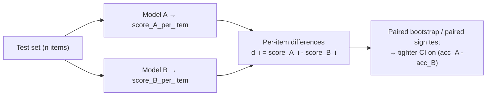
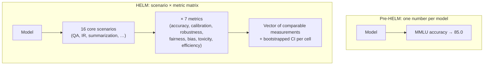

# Day 5 — Statistical hygiene: sample size, error bars, scenario coverage

## TL;DR

A score is not a measurement; an *interval* is. At $n \approx 14{,}000$ and $p \approx 0.85$ the sampling-noise floor on accuracy is already ±0.4 points, and a per-subject breakdown at $n \approx 250$ is ±4.5 points — wider than most "improvements" you read about. Today's anchor — **HELM** (Liang et al. 2022/2023) — is the project that built statistical rigor (bootstrapped CIs, paired comparisons, mean win rate) and *scenario coverage* (16 scenarios × 7 metrics, not one benchmark × accuracy) into the same framework.

## Learning objectives

By the end of this lesson, you will be able to:

1. **(L2)** State why a benchmark score without an uncertainty interval is incomplete, and recall the rough sampling-noise envelopes — ~±0.4 points at $n \approx 14{,}000$, ~±2.4 at $n = 1{,}000$, ~±4.5 at $n = 250$ — at $p \approx 0.85$.
2. **(L3)** *Apply* the Bernoulli SE and Wilson interval to compute a 95% confidence interval for an observed accuracy at a stated $n$ and $\hat{p}$.
3. **(L3)** *Apply* a paired-difference / paired-bootstrap framing to a comparison of two models on the same test items, and distinguish it from naively comparing two marginal CIs.
4. **(L4)** *Analyze* HELM's scenario × metric matrix as a structural alternative to "one benchmark, one number" — decomposing what a single MMLU-style score does and does not support.
5. **(L5)** *Evaluate* a small-$n$ safety-eval claim ("refusal rate 87.3% → 89.1% on $n = 200$") against the relevant Wilson CI and judge whether the reported delta is signal or noise.
6. **(L4)** *Contrast* HELM (suite + harness with bootstrapped CIs and a per-scenario instance cap) with `lm-evaluation-harness`'s task-centric default, and identify which design moves enable the cost-vs-coverage trade-off.

## Prerequisites & callback

Two prior lessons are load-bearing today. **D1** framed an evaluation as a (dataset, scoring rule, reporting convention) **pipeline** and noted in passing that "with ~14k MMLU items, sampling noise alone is around ±0.4 points" — today does that math and asks what to assume when a 0.6-point delta is reported with no interval. **D2** introduced **calibration** as a property of the scoring rule (`acc` vs. `acc_norm`, the reliability-diagram framing); HELM lifts calibration into a *scenario-level metric* reported alongside accuracy, so D2's mechanic and today's structural argument meet inside the same scoring matrix.

## The opening hook

On Day 1 we noted, almost in passing, that "with ~14k test items, sampling noise alone is around ±0.4 points." Today we do the math, then ask the harder question: if a benchmark is reported with no confidence interval at all, what should you assume about a 0.6-point gap between two models?

In most other empirical sciences the answer is "assume nothing — the report is incomplete." LLM evaluation has spent five years cheerfully ignoring this norm. Leaderboards rank models on point estimates; papers headline a one-decimal-place delta and call it state-of-the-art; press releases cite "+1.2 on MMLU" as if it were a meaningful effect size. **A score without an uncertainty interval is not a measurement; it is a guess with extra digits.**

The lesson's anchor — **HELM**, the *Holistic Evaluation of Language Models* framework (Liang et al. 2022/2023) — is the project that tried hardest, earliest, and most publicly to fix this. HELM is two things at once: a *suite* (a collection of scenarios chosen to give breadth-of-coverage rather than a single headline number) and a *harness* (a Python framework, `crfm-helm`, that runs them). Both pieces of HELM exist because the original team believed evaluation literacy required statistical rigor and scenario plurality, not point estimates on three benchmarks. Today's lesson installs the rigor; Days 6, 7, and 15 build on the plurality.

## Why the headline number has a confidence interval

Imagine MMLU-style accuracy as a Bernoulli experiment: each test item is a coin flip, the coin's bias is the model's per-item correctness probability $p$, and your score is the empirical mean. Standard probability says the standard error of the mean of $n$ Bernoulli draws is

$$\mathrm{SE}(\hat{p}) = \sqrt{\frac{p(1-p)}{n}}$$

which is maximized when $p = 0.5$ (the most uncertain coin). For the full 14,042-item MMLU test set with a model scoring around $p = 0.85$:

$$\mathrm{SE}(\hat{p}) = \sqrt{\frac{0.85 \cdot 0.15}{14042}} \approx 0.0030$$

A 95% normal-approximation interval is roughly $\hat{p} \pm 1.96 \cdot \mathrm{SE} \approx \hat{p} \pm 0.0059$ — the **±0.4 to ±0.6 percentage points** sampling-noise envelope we waved at on Day 1. Two models reporting MMLU scores of 85.1 and 85.4 are *statistically indistinguishable* under this model. Three out of four "improvements" of <1 point on MMLU are noise.

Three corrections to that simple picture matter:

- **Wilson interval over normal approximation.** For accuracies near 0 or 1, the symmetric normal interval can extend below 0 or above 1 and is empirically miscalibrated. The Wilson score interval is the standard fix and what most careful eval reports use:

$$\mathrm{Wilson}(\hat{p}, n, z) = \frac{\hat{p} + \frac{z^2}{2n}}{1 + \frac{z^2}{n}} \pm \frac{z}{1 + \frac{z^2}{n}} \sqrt{\frac{\hat{p}(1-\hat{p})}{n} + \frac{z^2}{4n^2}}$$

For $n = 14{,}042$ this barely moves the interval; for a 100-item subset it matters a lot.

- **Subject-level reporting is much noisier.** MMLU's 57 subjects average ~250 items each. At $n = 250, p = 0.85$ the SE is $\sqrt{0.85 \cdot 0.15/250} \approx 0.023$ — a ±4.5-point 95% CI. The "high-school physics: 91" and "college chemistry: 87" delta in a model card is well within sampling noise, even before you ask whether the questions in those two subjects are comparable.

- **Bootstrap when items aren't IID.** The closed-form formulas assume independent items. When items share structure (multi-question passages, scenario-grouped tasks, paired AB items) the effective $n$ is smaller than the nominal $n$. A nonparametric bootstrap — resample the test set with replacement $B = 1000$ times, recompute accuracy, take the 2.5th/97.5th percentiles — gives an interval that respects clustering. HELM uses bootstrapping as its default for non-trivial scenarios.

A useful rule of thumb to commit to memory: **at $p \approx 0.85$, a 95% CI of ±1 point requires roughly $n = 5{,}000$ items; ±0.5 points requires ~20,000.**

## ⏵ Check yourself — the per-subject noise floor

A model card reports MMLU = 85.0 overall and breaks out a 91.0 on "high school physics" and 80.0 on "college chemistry." Each subject has roughly 250 items. **Compute** the approximate 95% Wilson CI on each per-subject score and decide whether the 11-point gap supports the claim "the model is dramatically stronger at physics than chemistry."

<details>
<summary>Show answer</summary>

At $n = 250$ and $\hat{p} \approx 0.85$, $\mathrm{SE} \approx \sqrt{0.85 \cdot 0.15 / 250} \approx 0.023$, so the 95% CI is roughly $\pm 1.96 \cdot 0.023 \approx \pm 0.045$, i.e. ±4.5 points. The two subject-level intervals are roughly $[86.5, 95.5]$ and $[75.5, 84.5]$ — they do *not* overlap, so a between-subject difference exists, but the precision is much weaker than the headline 85.0 ±0.5 implies. The load-bearing point is structural rather than purely numerical: per-subject accuracy is computed on ~250 items, so the 11-point gap is a *coarse* signal, and a 4-point per-subject gap (e.g., 89 vs. 85) would be entirely within noise. Per-subject leaderboards are doing 57 simultaneous noisy measurements, and any "this model is best at logic" claim built on a ~250-item subject is borderline-uninterpretable without intervals.

</details>

## Two models, one comparison: paired vs. unpaired tests

The interval above answers "how uncertain is my single number?" The downstream question — "is model A better than model B?" — is harder, because the two models are usually evaluated on the *same* test items.



If you pretend the two scores are independent samples and apply an unpaired interval, you'll wildly overestimate uncertainty. The correct move is a **paired test**: for each item, record the difference $d_i = \mathbb{1}[A_i] - \mathbb{1}[B_i]$, then bootstrap the mean of $d$. The variance of the paired difference is

$$\mathrm{Var}(\hat{d}) = \frac{\sigma_A^2 + \sigma_B^2 - 2\,\mathrm{Cov}(A, B)}{n}$$

and the covariance term is large and positive when the two models tend to get the same items right (which is almost always true for similar-capability models). A paired CI on the *gap* can be tighter than either model's individual CI by 2–5×. This is why the same data can support "Llama-3 ranks above Mistral-7B" with high confidence even when both models' individual CIs overlap.

The lm-evaluation-harness `--bootstrap_iters` flag computes per-task standard errors but not paired differences across runs. To compare two models rigorously you need to keep the per-item scores and pair them yourself.

## Anchor: HELM (Liang et al. 2022/2023)

HELM was published as *Holistic Evaluation of Language Models* (arXiv:2211.09110, November 2022; published in TMLR 2023). The author list is unusually long — 50 authors led by Percy Liang, with Rishi Bommasani and Tony Lee as the other lead contributors and a long tail of Stanford CRFM collaborators. The size of the author list is itself a methodological signal: HELM was designed as community infrastructure, not a single paper's experiment. The framework has been continuously updated since release and as of early 2026 the `crfm-helm` package on PyPI is on its fifth-year minor-version cadence.

### The methodological move: scenarios × metrics, not benchmarks × accuracy

Pre-HELM evaluation reported one metric (accuracy) on each of a handful of benchmarks. HELM's signature contribution is the **scenario × metric matrix**: every model is evaluated on every (scenario, metric) cell where it makes sense.



The original 2022 release defined:

- **16 core scenarios** spanning question answering, information retrieval, summarization, sentiment analysis, toxicity detection, and miscellaneous text classification — drawn from existing datasets (NaturalQuestions, NarrativeQA, MMLU, TruthfulQA, RAFT, etc.).
- **42 total scenarios** including 26 targeted evaluations for specific properties (knowledge, reasoning, harms, efficiency).
- **7 metrics per scenario where applicable**: accuracy, calibration, robustness, fairness, bias, toxicity, and efficiency.

The headline empirical claim of the paper is that HELM improved benchmark coverage of the 30 surveyed models from an average of ~17.9% of the core scenarios pre-HELM to 96.0% under the HELM evaluation. *Coverage* — not headline accuracy — is the deliverable.

The shift from "benchmark × accuracy" to "scenario × metric" is the structural argument. A model that scores 85 on MMLU has revealed *one number*. A model that has been run through HELM has revealed accuracy, calibration, robustness to typos, demographic-fairness gaps, social-bias scores, toxicity rate, and tokens-per-second on the same scenarios. The reader gets a vector of comparable measurements rather than a single comparable scalar. That is the same philosophy you will see again on D22 (judge biases) and D24 (RewardBench): the "headline number" is a compression that throws away signal.

> **Calibration in HELM.** Day 2 introduced calibration as a property of the *scoring rule* (acc vs. acc_norm and the reliability-diagram framing). HELM treats it as a first-class scenario-level *metric* — Expected Calibration Error reported alongside accuracy in the same table. The methodological commitment: calibration is not a separate workstream from accuracy but one of seven readings on the same instrument. The full calibration thread (D2 → D15 → D20 → D24) returns to this view on TruthfulQA, sycophancy, and RewardBench respectively.

### A scenario in detail: HELM's MMLU run

To make the scenario × metric structure concrete, take HELM's treatment of MMLU. (HELM also runs a dedicated MMLU leaderboard since 2024, separate from the 2022 paper's core suite.)

- **Prompt template:** standardized 5-shot, single canonical format across all models. No per-model tuning. The HELM team's rationale is that fairness across models requires a common pipeline — a model that "would have" scored higher under a different prompt template is not the comparison HELM is making.
- **Sampling:** in the 2022 evaluation, each scenario was capped at 1,000 items per evaluation run (the full MMLU has 14,042; HELM Lite re-introduced a similar cap in 2023). The cap matters statistically: at $n = 1000, p = 0.85$, the 95% CI is roughly ±2.2 points — wider than the difference between most state-of-the-art models on the leaderboard. HELM's choice was: cover more scenarios at narrower-but-still-meaningful per-scenario CIs rather than fewer scenarios at very tight CIs.
- **Aggregation:** *macro*-average across MMLU's 57 subjects (matching the original benchmark) rather than micro-average across items. HELM later added a separate full-MMLU leaderboard (announced May 2024) that uses all 57 subjects without subsampling.
- **Reporting:** the result is published as an *interval*, not a point estimate. Bootstrapped standard errors are computed by resampling the per-item scores with replacement and are reported alongside the mean.
- **Comparison:** HELM headlines a **mean win rate** — fraction of (scenario, model-pair) cells where model $A$ beats model $B$ — rather than an averaged accuracy across scenarios. A win rate is rank-based and survives the cross-scenario unit problem (you cannot meaningfully average BLEU on summarization with accuracy on MMLU).

The forward-pointer here is **D15** (TruthfulQA), which appeared as a HELM scenario from the start and inherited HELM's measurement philosophy — including the calibration-vs-truthfulness reading that D15 unpacks.

### HELM as harness — the framework, not the suite

The other half of "HELM" is `crfm-helm`, the Python framework that runs the suite. This is the first non-`lm-evaluation-harness` framework you have met in this curriculum, and the design contrast is instructive:

- **Install:** `pip install crfm-helm`. Repository: `github.com/stanford-crfm/helm`. License: Apache-2.0.
- **Core abstractions:** `Scenario` (loads a dataset and produces `Instance` objects), `Adapter` (formats prompts — few-shot, multiple-choice, generation), `Metric` (scores model outputs — exact-match, F1, calibration, bias-classifier-based, etc.), `Runner` (orchestrates the pipeline, caches per-prompt model calls). Compared to `lm-evaluation-harness`'s task-centric design, HELM's separation of `Scenario`/`Adapter`/`Metric` makes it easier to swap in a new metric on an existing scenario — useful when (e.g.) a new calibration measure appears.
- **Caching:** HELM caches model responses by (model, prompt) key. Re-running a scenario with a new metric does not re-query the model. Important for cost control on a 50-scenario suite.
- **Web UI:** HELM ships a static-site frontend at `crfm.stanford.edu/helm/` that renders the scenario × metric × model matrix. You can drill into individual prompts and the model's full output — this *prompt-level transparency* is the same first-principle as Day 1's "an evaluation is a pipeline."
- **Sub-leaderboards:** as of 2026 the HELM project hosts several sibling leaderboards — HELM Classic (the original 16-scenario suite), HELM Lite (a faster 9-scenario suite, December 2023), HELM MMLU (full 57-subject MMLU, May 2024), HELM Capabilities (March 2025; MMLU-Pro + GPQA + IFEval + WildBench + Omni-MATH at ~1,000 instances each), HELM Safety, MedHELM, and others. Each is a curated scenario set served by the same harness.

```bash
# Verify the scenario list and run a single scenario locally.
pip install crfm-helm
helm-run \
  --conf-paths run_specs.conf \
  --suite v1 \
  --max-eval-instances 1000 \
  --models-to-run openai/gpt-4o-2024-05-13 \
  --scenarios-to-run mmlu
# Outputs: per-instance JSON, aggregated metrics with bootstrapped CIs,
# and a static site fragment under benchmark_output/runs/v1/.
```

> **Maintenance note.** The `crfm-helm` GitHub repo is on its v0.5.x release line as of early 2026 and continues to ship updates; the project hosts active sub-leaderboards (HELM Lite, MMLU, Capabilities, Long Context, Safety, MedHELM). Treat the harness as production-quality and the suites as evolving at HELM Lite / HELM Capabilities cadence — new scenarios get added; older ones don't refresh on a strict schedule.

## ⏵ Check yourself — paired vs. marginal CIs

Two models are evaluated on the same 1,000-item scenario. Their **marginal** 95% Wilson CIs are $[0.712, 0.766]$ and $[0.681, 0.737]$ — they overlap at $[0.712, 0.737]$. Decide whether you can conclude "no significant difference" from this overlap, and identify the **load-bearing** assumption that determines which test is the right one to run.

<details>
<summary>Show answer</summary>

You cannot. Marginal-CI overlap is the wrong test when the two models are evaluated on the same items, because per-item scores are *paired* and typically highly correlated — similar-capability models tend to get the same items right. The correct test is a **paired bootstrap** on $d_i = \mathbb{1}[A_i] - \mathbb{1}[B_i]$, whose variance is $(\sigma_A^2 + \sigma_B^2 - 2\,\mathrm{Cov}(A, B))/n$. The covariance term is large and positive in the typical case, so the paired CI on the gap is much narrower than either marginal. The load-bearing assumption is the *pairing*: if the two models were evaluated on independent samples (e.g., different random subsets), the marginal-overlap reading would be appropriate, but that's almost never the case in practice. Many "no significant difference" claims you read in eval blog posts use the wrong test.

</details>

## What scenario coverage actually buys you

The "scenarios × metrics" matrix is more than a presentation choice. It changes what kind of claim you can make about a model.

Consider a model card that reports MMLU = 85.0. It supports the claim "this model is good at multi-domain knowledge questions." It does not support:

- "This model is calibrated" (separate metric, often anti-correlated with accuracy after RLHF).
- "This model is robust" (typos and capitalization changes can move accuracy 2–5 points without the model "learning" anything).
- "This model is fair" (demographic-conditioned accuracy gaps may be 5–15 points even at high overall accuracy).
- "This model is safe to deploy on user inputs" (toxicity rate is uncorrelated with MMLU).

A HELM-style report makes those four properties first-class, comparable, and uncomparably more decision-relevant than the headline accuracy number on its own. This is also the methodological philosophy that **D22** (LLM-as-judge biases) returns to: judges, like models, must be evaluated on multiple axes, because the single-number compression is what allows systemic biases to hide.

The trade-off is honest: a HELM-style evaluation costs roughly $K$× a single-benchmark eval, where $K$ is the number of scenarios. The 2022 paper's 30 models × 42 scenarios run reportedly cost ~$50,000 in API calls. HELM Lite cut this by an order of magnitude by dropping the most expensive scenarios (calibration on log-likelihood-only models, MS MARCO retrieval) and by reducing to a single random seed. The cost-vs-coverage trade-off is permanent and is itself an evaluation-design dimension you should reason about before clicking *run*.

## A worked CI example

> **Worked example.** You want to claim that model A beats model B on a 1,000-item scenario, observing accuracies 0.74 and 0.71. Should you believe the 3-point gap?

Step 1 — **Unpaired Wilson 95% CIs**, computed independently per model.

For model A at $\hat{p}_A = 0.74, n = 1000, z = 1.96$:

$$\mathrm{SE}_A \approx \sqrt{\frac{0.74 \cdot 0.26}{1000}} \approx 0.0139$$

so the Wilson CI is approximately $[0.712, 0.766]$. For model B at $\hat{p}_B = 0.71$:

$$\mathrm{SE}_B \approx \sqrt{\frac{0.71 \cdot 0.29}{1000}} \approx 0.0143$$

so the Wilson CI is approximately $[0.681, 0.737]$.

The intervals **overlap** on $[0.712, 0.737]$. Naive read: "no significant difference."

Step 2 — **Paired bootstrap on $d_i$.** If the per-item agreement between A and B is 0.85 (roughly typical for two similar-capability models), the variance of the paired difference is

$$\mathrm{Var}(\hat{d}) = \frac{\sigma_A^2 + \sigma_B^2 - 2\,\mathrm{Cov}(A, B)}{n}$$

with the covariance term large and positive. Plugging in plausible numbers gives a paired SE of roughly $0.0095$, so the 95% CI on the gap is approximately $[0.011, 0.049]$ — i.e., the gap is significant at $p < 0.05$ even though the marginal CIs overlapped.

The lesson: **overlapping marginal CIs do not imply a non-significant difference when the items are paired.** Many "no-significant-difference" claims you see in eval blog posts use the wrong test. HELM's bootstrap-of-the-difference (when it is reported) is the right one.

## ⏵ Check yourself — the small-$n$ safety report

A safety-eval report claims: *"refusal rate improved from 87.3% to 89.1% on $n = 200$ borderline prompts."* Decide whether this is a **defensible** claim of improvement and identify the right reflex.

<details>
<summary>Show answer</summary>

At $n = 200$ and $\hat{p} \approx 0.88$, $\mathrm{SE} \approx \sqrt{0.88 \cdot 0.12 / 200} \approx 0.023$, so the 95% Wilson CI is roughly $\pm 4.5$ points. The 1.8-point delta is well *inside* the noise floor: any reading of the report should treat the change as indistinguishable from noise unless paired per-item scores are available (and even then a paired bootstrap on $n = 200$ has limited power for sub-2-point gaps). The right reflex is two-step: (1) compute the Wilson CI before reading the delta as evidence of progress; (2) ask whether the reported number is paired or marginal — if marginal, the case for improvement is weaker still. Safety-eval test sets are usually $n < 500$ and effect sizes are small; this is exactly the regime where the field's "no error bars" norm produces the most spurious "improvement" claims.

</details>

## Practical checklist for reading or writing an eval report

When you read someone else's eval, look for:

- [ ] $n$ — the number of test items used. (If subsampled from a larger set, the subsampling seed and method.)
- [ ] A confidence interval, standard error, or bootstrapped quantiles on every reported number.
- [ ] **Paired** comparisons when comparing two models on the same data, not unpaired intervals.
- [ ] Per-subject / per-scenario breakdowns where the noise floor is stated, not buried.
- [ ] Whether multiple seeds were used (HELM Classic: yes, ≥3; HELM Lite: 1; lm-eval-harness: configurable, default 1).
- [ ] Coverage of *non-accuracy* metrics where applicable: calibration (D2 → D24), robustness (D6/D19), fairness/bias (D16), efficiency (D25).

When you write one, treat reporting a single point estimate as a defect — analogous to reporting a physics measurement without an error bar.

> **Safety researcher's note.** Statistical hygiene is doubly important for safety evals because their effect sizes are usually small. A capability benchmark might show a +12-point gap between Llama-3-8B and Llama-3-70B; a safety eval (refusal rate on borderline prompts, harm-classifier rate on jailbroken responses, sycophancy score) typically shows 1–3 point gaps between adjacent model versions, and the test sets are often $n < 500$. At $n = 300, p = 0.5$, the 95% CI is ±5.7 points — wider than every reported safety improvement in some recent model cards. The HELM Safety leaderboard is one of the only public safety reports that reports CIs as a default; the rest of the field has not caught up. When you build internal safety dashboards, build the CIs in from day one — they will save you from celebrating a regression.

## Cross-references

**Backward.**

- D-1 — picks up the "evaluation is a pipeline" framing and adds the missing piece: every step of the pipeline produces a number with an *uncertainty interval*, not a point estimate.
- D-2 — picks up the calibration mechanic introduced as a scoring-rule property and lifts it to a scenario-level *metric* reported alongside accuracy in HELM's matrix.

**Forward.**

- D-6 — explains *why* point estimates are even less trustworthy than the CI math suggests: if the data is contaminated, even a perfectly tight CI is centered on the wrong number.
- D-7 — explains why the noise floor matters increasingly more as benchmarks age: when SOTA approaches the ceiling, every visible "improvement" lands inside the ±0.5-point envelope and the benchmark stops discriminating.
- D-15 — TruthfulQA was a HELM scenario from the start and inherited HELM's measurement philosophy, exposing a calibration-vs-truthfulness trade only visible in the multi-metric matrix.
- D-22 — generalizes the multi-metric philosophy to LLM-as-judge: a judge that scores high on agreement-with-humans but high on position-bias is not a good judge, and only a multi-axis report surfaces that.
- D-24 — completes the calibration thread (D2 → D15 → D20 → D24): reward-model confidence is itself a calibration story and inherits today's statistical-hygiene discipline.

## Takeaways

1. A score is not a measurement; an interval is. At $n = 14{,}000, p \approx 0.85$ the sampling-noise floor is roughly ±0.4 points; at $n = 250$ it is ±4.5 points. Per-subject breakdowns are much noisier than headline numbers. *(LO 1)*
2. Use the Bernoulli SE and the Wilson interval to compute a 95% CI; near $p = 0$ or $p = 1$ Wilson is the defensible default, and a **bootstrap** is the right tool when items are non-IID (passage-grouped, paired AB, scenario-grouped). *(LO 2)*
3. Comparisons between two models on the same items are *paired*. Marginal CIs overlapping does not mean the gap is insignificant — paired bootstrap on $d_i$ gives the right interval, often 2–5× tighter than the marginals. *(LO 3)*
4. HELM's signature methodological move is the **scenario × metric** matrix: 16 core scenarios × 7 metrics (accuracy, calibration, robustness, fairness, bias, toxicity, efficiency) instead of one benchmark × accuracy. *Coverage* — not headline number — is the deliverable, evidenced by the 17.9% → 96.0% pre/post-HELM coverage shift. *(LO 4)*
5. Small-$n$ safety reports are exactly the regime where the field's "no error bars" norm produces the most spurious "improvement" claims; the right reflex is to compute the Wilson CI before reading the delta. *(LO 5)*
6. HELM as a *harness* (`crfm-helm`) implements `Scenario` / `Adapter` / `Metric` / `Runner` abstractions, prompt-level caching, and a 1,000-item-per-scenario cap that locks in the cost-vs-coverage trade-off — distinct from `lm-evaluation-harness`'s task-centric default. *(LO 6)*

## Glossary

- **Wilson interval**: a binomial confidence interval that stays inside $[0, 1]$ near the boundaries and is the standard fix to the symmetric normal approximation when $\hat{p}$ is near $0$ or $1$ [introduced D-5].
- **paired bootstrap**: nonparametric CI on a *paired* statistic — for two models on the same items, resample the per-item differences $d_i$ with replacement; tighter than unpaired comparisons by 2–5× when models are correlated [introduced D-5].
- **sampling-noise floor**: the irreducible Bernoulli SE on accuracy at a given $n$ and $p$; ~±0.4 points at $n = 14{,}000$, ~±2.4 at $n = 1{,}000$, ~±4.5 at $n = 250$ at $p \approx 0.85$ [introduced D-5].
- **scenario × metric matrix**: HELM's structural reframing of evaluation — every model evaluated on every applicable (scenario, metric) cell rather than one benchmark × accuracy [introduced D-5].
- **mean win rate**: HELM's headline ranking statistic — fraction of (scenario, model-pair) cells where one model beats another; rank-based and unit-free across heterogeneous metrics [introduced D-5].
- **scenario coverage**: fraction of a fixed scenario set on which a given model has been evaluated; HELM's 17.9% → 96.0% lift quantified the pre/post-HELM gap [introduced D-5].
- **Expected Calibration Error (ECE)**: gap between a model's stated confidence and its empirical accuracy, binned and averaged; reported by HELM as a per-scenario metric alongside accuracy [introduced D-2 · reused].
- **paired test / per-item difference**: comparison statistic $d_i = \mathbb{1}[A_i] - \mathbb{1}[B_i]$ over a shared test set; the variance term $-2\,\mathrm{Cov}(A, B)$ is what makes the paired CI tighter than the marginals [introduced D-5].

## References

- **Anchor.** Liang, P., Bommasani, R., Lee, T., Tsipras, D., Soylu, D., et al. (2022/2023). *Holistic Evaluation of Language Models.* TMLR. arXiv:2211.09110.
- **Harness.** Stanford CRFM. *`crfm-helm` (HELM)*. Apache-2.0. https://github.com/stanford-crfm/helm
- **Secondary.** Wilson, E. B. (1927). *Probable Inference, the Law of Succession, and Statistical Inference.* JASA 22(158).
- **Secondary.** Efron, B. (1979). *Bootstrap Methods: Another Look at the Jackknife.* Annals of Statistics 7(1).
- **Secondary.** Madaan, L., Singh, A. K., Schaeffer, R., Poulton, A., Koyejo, S., Stenetorp, P., Narang, S., & Hupkes, D. (2024). *Quantifying Variance in Evaluation Benchmarks.* arXiv:2406.10229. — empirical companion piece on bench-to-bench variance, seed variance, and monotonicity-during-training as evaluation metrics.
- **Secondary.** Stanford CRFM. *HELM Classic launch post.* November 2022. https://crfm.stanford.edu/2022/11/17/helm.html
- **Secondary.** Stanford CRFM. *HELM Lite: Lightweight and Broad Capabilities Evaluation.* December 2023. https://crfm.stanford.edu/2023/12/19/helm-lite.html
- **Secondary.** Stanford CRFM. *MMLU on HELM.* May 2024. https://crfm.stanford.edu/2024/05/01/helm-mmlu.html
- **Secondary.** Stanford CRFM. *HELM Capabilities.* March 2025. https://crfm.stanford.edu/2025/03/20/helm-capabilities.html

## Quiz

**Q1.** A model scores 82.0% on a 1,000-item scenario. **Compute** the approximate 95% Wilson CI on this estimate. The answer is closest to:

- A. ±0.4 points
- B. ±1.2 points
- C. ±2.4 points
- D. ±5.0 points

**Q2.** Two models report MMLU scores of 85.1 and 85.5 on the full 14,042-item test set, with no other information given. Which is the **most defensible reading** of the 0.4-point gap?

- A. The 0.4-point gap is statistically significant under a paired bootstrap and headlines a real win for B.
- B. The 0.4-point gap is within the ±0.4-to-±0.6-point sampling-noise envelope; the gap is plausibly noise.
- C. The two models are statistically identical because their headline scores agree to one decimal digit.
- D. You need at least 100,000 items to distinguish a sub-1-point gap under any reasonable Wilson test.

**Q3.** Two models are evaluated on the same 1,000-item scenario and their marginal 95% CIs overlap. Which option **best captures** the load-bearing assumption that determines which significance test you should run?

- A. Conclude that there is no significant difference because the two marginal Wilson CIs visibly overlap.
- B. Run an unpaired Welch t-test on the two reported accuracies and check the p-value against $\alpha = 0.05$.
- C. Compute per-item differences $d_i$ and bootstrap a CI on the mean of $d$ (paired bootstrap).
- D. Re-run both models on a freshly drawn 1,000-item subsample and compare the new bootstrapped accuracies.

**Q4.** HELM's signature methodological contribution is best described as:

- A. A new few-shot prompt template that fixes the acc-versus-acc_norm calibration bias on MCQ tasks.
- B. The scenario × metric matrix: every model evaluated on every applicable (scenario, metric) cell.
- C. A drop-in replacement for lm-evaluation-harness with faster GPU batching and lower memory footprint.
- D. A live leaderboard that ranks models on a single mean accuracy averaged across all core scenarios.

**Q5.** Which of these metrics is **not** part of HELM's canonical 7-metric core (per Liang et al. 2022)?

- A. Accuracy (exact-match score on the scenario's primary task)
- B. Calibration (Expected Calibration Error against per-item correctness)
- C. Cost-per-token (USD spent per output token at vendor list price)
- D. Toxicity (rate of harmful generations flagged by a classifier)

**Q6.** You read a safety-eval report claiming "refusal rate improved from 87.3% to 89.1% on $n = 200$ borderline prompts." What is the **right reflex**?

- A. Believe the 1.8-point improvement; safety evaluations from major labs are usually statistically rigorous and adequately powered.
- B. Compute the Wilson CI: at $n = 200$ near $p = 0.88$ it spans roughly ±4.5 points, so the 1.8-point delta is inside the noise floor.
- C. The improvement is significant because the model version changed and the prompt set was held fixed across both evaluation runs.
- D. Reject the report because safety evals require an LLM-judge harness rather than a hard-coded refusal-rate classifier.

<details>
<summary>Answers</summary>

1. **C** — $\mathrm{SE} = \sqrt{0.82 \cdot 0.18 / 1000} \approx 0.012$, so 95% CI is roughly $\pm 1.96 \cdot 0.012 \approx \pm 0.024$, i.e., ±2.4 points.
2. **B** — at $n = 14{,}042, p \approx 0.85$, the per-model SE is about 0.30 points, so a 0.4-point gap is well within sampling noise. (A paired test could in principle resolve it, but only with the per-item scores in hand, which the report does not provide.)
3. **C** — paired comparisons on the same test set have lower variance than unpaired tests because the per-item correlation is high. Marginal CIs can overlap while a paired CI excludes zero. The load-bearing assumption is the *pairing* of per-item scores across models.
4. **B** — the scenarios × metrics matrix is HELM's structural innovation; it pushes evaluation from "one benchmark, one number" to "many scenarios, many metrics, all comparable."
5. **C** — HELM's seven metrics are accuracy, calibration, robustness, fairness, bias, toxicity, and efficiency. Cost-per-token is related to (but not the same as) efficiency, which HELM operationalizes as wall-clock and energy-style measures, not dollars.
6. **B** — at $n = 200, p \approx 0.88$, $\mathrm{SE} \approx \sqrt{0.88 \cdot 0.12 / 200} \approx 0.023$, so the 95% CI is about ±4.5 points. A 1.8-point delta is well inside the noise floor and the claim of "improvement" is not statistically supported on this sample size alone.

</details>
