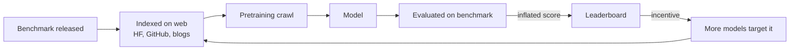

# Day 6 — Test-set contamination

## The opening question

You measure a meter stick by laying it next to itself. The reading is exactly one meter. Are you a careful experimentalist?

Modern LLMs are trained on essentially the open web, and the open web contains the test sets of the benchmarks they are evaluated on. When GPT-4 scored 86.4 on MMLU on release, some non-trivial fraction of those 14,042 test items had appeared verbatim in pretraining — in textbook PDFs, in Quizlet decks, in StackExchange threads, in the Hugging Face dataset card itself, in countless blog posts that quote sample questions to explain what the benchmark is. **The model wasn't necessarily reasoning. Some of the time it was remembering.**

That is *test-set contamination*. It is the cleanest empirical instance of Goodhart's Law in modern ML: the moment a benchmark becomes the target everyone optimizes against, the benchmark's signal leaks into the training distribution it was supposed to measure against, and the score stops measuring what it claims to measure. Today's lesson is about how that leak happens, how we detect it, and how MMLU-Pro (Wang et al. 2024) tries to harden MMLU against it — while quietly conceding that for any benchmark that lives long enough, the leak is inevitable.

## Defining the problem

A test item is **contaminated** if a model has seen it (or a near-paraphrase of it) during pretraining or fine-tuning. Three flavors are worth distinguishing because they leak at different rates and call for different forensics:

1. **Verbatim contamination.** The exact item — question + options + correct answer — appears in pretraining data. Most damaging, easiest to detect with n-gram overlap.
2. **Paraphrase contamination.** A reworded version of the item appears in pretraining. Harder to detect with substring matching; needs semantic search or membership inference.
3. **Distributional / indirect contamination.** No specific item leaked, but solutions to closely-related items, the answer key, or commentary on the benchmark were in training. Almost impossible to fully exclude for a popular public benchmark.

A subtle fourth flavor matters for the post-2023 fine-tuning era: **post-training contamination**, where the test set sneaks into RLHF or SFT data via crowd-worker prompts or dataset aggregators. Decontaminating pretraining is hard; decontaminating every fine-tune is harder.



The loop is the point. Once the benchmark is on the leaderboard, every release produces blog posts, HuggingFace dataset cards, Reddit threads explaining sample items — all of which become *next* year's pretraining.

## Why contamination IS the Goodhart story

We have been circling Goodhart's Law all week, but Day 6 is where it becomes mechanical rather than philosophical. Restate it:

> When a measure becomes a target, it ceases to be a good measure.

For a static public benchmark, the *causal mechanism* by which Goodhart bites is contamination. There is no mysterious "the model is now optimizing the wrong thing" — the corruption is concrete, namespaced, and bytewise: the test items end up in the pretraining set. The training-and-evaluation pipeline, viewed end-to-end, is now training-on-the-test-set with extra steps. The benchmark's headline number is no longer an estimate of generalization; it is an estimate of how much of the test set the model memorized, plus a residual generalization signal that gets harder to disentangle as the contamination fraction rises.

Three things follow:

- **Contamination compounds with leaderboard popularity.** The more attention a benchmark gets, the faster it leaks. MMLU was the most-cited LLM benchmark of 2021–2024 (Day 1) and consequently among the most-contaminated.
- **Contamination is asymmetric across labs.** Labs that aggressively decontaminate report lower numbers than labs that don't, all else equal. This is one reason cross-lab leaderboard comparisons should be read with caution (Day 5).
- **The Goodhart "fix" is not a better metric — it is a benchmark redesign.** MMLU-Pro, GPQA (Day 7), LiveCodeBench (Day 11), ARC-AGI's private split, and FrontierMath (Day 25) are all responses to the same diagnosis: the answer to a contaminated benchmark is not "compute it more carefully" but "build a benchmark that is structurally harder to contaminate."

This is the throughline for the rest of the curriculum. Wherever you see a "v2" benchmark replacing a "v1" — Open LLM Leaderboard v1→v2 (Day 1), MMLU→MMLU-Pro (today), HumanEval→LiveCodeBench (Day 11), ARC-AGI-1→ARC-AGI-2 (referenced under Day 7) — the upgrade is, at its core, a Goodhart-collapse response.

## Anchor: MMLU-Pro (Wang et al. 2024)

MMLU-Pro is the canonical "hardened MMLU" — a re-curated successor designed to push back against both contamination and saturation. It was published at NeurIPS 2024 (Datasets & Benchmarks track; Wang et al. 2024, arXiv:2406.01574) and adopted as the MMLU replacement on the Hugging Face Open LLM Leaderboard v2 in June 2024.

**What MMLU-Pro is:**

- **12,032 questions** across **14 disciplines** (math, physics, chemistry, law, engineering, psychology, business, history, health, economics, philosophy, computer science, biology, "other") — a flatter discipline grouping than MMLU's 57-subject taxonomy.
- **10 answer choices per question**, up from MMLU's 4. This is the single biggest mechanical change.
- Questions are sourced four ways (per the paper):
  - **~57%** from the original MMLU after filtering (6,810 items kept; 5,886 dropped as "too easy" — i.e., answered correctly by more than four of eight evaluated models).
  - **~34%** newly authored from STEM-website problem sets.
  - **~5%** from TheoremQA.
  - **~5%** from SciBench.
- Two-phase expert review: humans verify correctness and remove unsuitable items; Gemini 1.5 Pro flags candidate "false negative" distractors that look plausibly correct, which humans then re-check.

**Why 4 → 10 choices is the headline change.** A 4-choice MC item has a random-guess baseline of 25%. A 10-choice item has a random-guess baseline of 10%. The difference matters in two ways:

1. **Headroom**: top frontier models scored ~86–90% on MMLU but only ~60–75% on MMLU-Pro at release, restoring the dynamic range that saturation had collapsed (more on this Day 7).
2. **Cue exploitation is harder.** With 4 options a model can rule out two and coin-flip; with 10 options it has to actually localize the answer. This is also why the paper reports MMLU-Pro is *less prompt-sensitive* than MMLU: with more distractors, surface-feature heuristics carry less of the score, so the score depends more on the underlying knowledge and less on the prompt template (sensitivity drops from ~4–5% on MMLU to ~2% on MMLU-Pro across 24 prompt styles).

**Where contamination resistance specifically comes in.** MMLU-Pro's contamination defenses are *partial and indirect*, and the paper is honest about this. The four mechanisms:

- **Filtering "too-easy" MMLU items** preferentially removes items most likely to be memorized (memorized items are easier).
- **New STEM/TheoremQA/SciBench items** were less indexed at the time of MMLU-Pro's release than MMLU's items, which had been on the open web since 2020.
- **More distractors** make memorization a harder signal to exploit — a model that vaguely remembers "the answer was the option mentioning 'momentum'" has worse odds with 9 distractors than with 3.
- **Reasoning-heavy authoring** shifts items toward problems where the path-to-answer matters, not just the surface form.

What MMLU-Pro does **not** do: it does not use a private held-out set, does not procedurally generate items, and does not refresh over time. It is a static public benchmark, which means the same Goodhart loop will eventually catch up to it. The paper's own framing is essentially "buy us a few years of headroom while the field figures out structurally contamination-resistant designs" — see ARC-AGI's private split (Chollet 2019; ARC-AGI-2 in Chollet et al. 2025) or LiveCodeBench's post-cutoff sampling (Jain et al. 2024, Day 11) for those structurally-resistant designs.

## Detection methods

Four families. They differ in what access they require (corpus / weights / API only) and what kind of contamination they detect.

### 1. N-gram overlap

The original method, and still the workhorse. Brown et al. (2020) defined the GPT-3 contamination protocol: an example is "contaminated" if it shares a 13-gram with any document in the training corpus (or has a full-example match for examples shorter than 13 grams). 13 was chosen as a length above which n-gram collisions are very unlikely to be coincidental in natural text.

```python
# Illustrative: 13-gram overlap detection between a test item and a training shard.
# Production decontamination pipelines (e.g., Llama, GPT) are more careful about
# tokenization, normalization, and case/whitespace handling than this sketch.
def ngrams(text: str, n: int = 13) -> set[tuple[str, ...]]:
    toks = text.lower().split()
    return {tuple(toks[i:i + n]) for i in range(len(toks) - n + 1)}

def is_contaminated(test_item: str, train_doc: str, n: int = 13) -> bool:
    return bool(ngrams(test_item, n) & ngrams(train_doc, n))
```

**Strengths:** simple, exact, fast with hash-based indexing.
**Weaknesses:** misses paraphrases; misses items that are quoted with a single edit ("Q: A wave travels at 200 m/s" → "Q. A wave is moving at 200 m/s"); requires access to the training corpus, which proprietary labs do not release.

The GPT-3 paper found, surprisingly, that running on decontaminated splits barely changed the headline numbers — but it also reported >90% contamination rates on Quac, SQuADv2, and DROP, which is hard to read as anything other than "13-gram overlap is a noisy signal at scale" (Brown et al. 2020). Either the test detected too aggressively, or contamination didn't matter for those benchmarks; Brown et al. did not resolve which.

### 2. Min-K% Prob

Shi et al. (2023) introduced **Min-K% Prob** as a black-box contamination test: it works on API-only access without the training corpus.

The hypothesis: **unseen** text contains some low-probability tokens (because the model is genuinely uncertain on parts of it); **seen** text has uniformly high probabilities everywhere because the model has memorized it. So if you take only the *lowest-probability* tokens of a candidate string and average their log-probs, the result will be lower for unseen text than for seen text.

Formally, for a string $x = (x_1, \ldots, x_T)$ and a model with probabilities $P(x_t \mid x_{<t})$, let $L = \{\log P(x_t \mid x_{<t})\}_{t=1}^{T}$, sort ascending, and take the bottom $K\%$:

$$
\text{Min-K\% Prob}(x) = \frac{1}{|S_K|} \sum_{\log p \in S_K} \log p
$$

where $S_K$ is the bottom-$K$% of $L$ by value. Higher (less negative) values suggest membership in the pretraining set; the typical $K$ is 20%. The paper reports a 7.4% AUC improvement on the WIKIMIA membership-inference benchmark over previous methods (Shi et al. 2023).

**Strengths:** black-box; no corpus needed.
**Weaknesses:** detects *memorization*, not contamination per se — a model can memorize without test-set leakage and vice versa; later work (Min-K%++, Zhang et al. 2024) refined the calibration. AUCs are typically 0.6–0.75 for typical-length test items, which is "above chance" but not "smoking gun."

### 3. Canary strings

Carlini et al. (2019), *The Secret Sharer* (USENIX Security), formalized the **canary** method. Insert a randomly-generated, low-perplexity-impossible string into your training data — e.g., a 9-digit "social security number" with random digits. After training, query the model: can it complete the canary? The exposure metric quantifies how memorized the canary is, comparing its likelihood to that of equivalently-random non-inserted strings:

$$
\text{exposure}(s) = \log_2 |\mathcal{R}| - \log_2 \text{rank}(s, \mathcal{R})
$$

where $\mathcal{R}$ is the population of equally-random sequences and $\text{rank}(s, \mathcal{R})$ is the canary's rank by model likelihood within that population. High exposure ≈ memorization.

For benchmark contamination specifically, the analog is:

```python
# Illustrative canary check: is a uniquely-formatted answer key string regurgitable?
canary = "BENCHMARK_X_CANARY_2024::a8f3c1::A,C,B,D,A"  # never appeared in legit text
prompt = "BENCHMARK_X_CANARY_2024::a8f3c1::"
completion = model.generate(prompt, max_tokens=20)
if completion.startswith("A,C,B,D,A"):
    print("Model has seen the canary — training data includes the answer key file.")
```

Canaries are how some benchmark authors fingerprint their datasets — BIG-Bench famously embedded a canary GUID specifically asking models *not* to be trained on it (and that GUID is in plenty of training corpora anyway).

**Strengths:** unambiguous when triggered; quantifies memorization.
**Weaknesses:** only detects contamination of the specific canary you planted, not all of the test set; requires foresight before training.

### 4. Membership inference attacks (MIA)

The umbrella name for the broader family of techniques that try to decide, for an input $x$, whether $x$ was in the training set — applied to LLMs by Carlini et al. (2021, *Extracting Training Data from Large Language Models*, USENIX Security) and formalized as **LiRA** (Likelihood Ratio Attack) in Carlini et al. (2022, *Membership Inference Attacks From First Principles*, IEEE S&P).

The likelihood-ratio framing:

$$
\Lambda(x) = \frac{P(x \mid \theta_{\text{train}})}{P(x \mid \theta_{\text{ref}})}
$$

where $\theta_{\text{train}}$ is the target model and $\theta_{\text{ref}}$ is a reference model trained on similar data without $x$. If $\Lambda(x)$ is anomalously high, $x$ is likely a training member.

**Strengths:** statistically principled; works for paraphrase contamination if the reference model is well-chosen.
**Weaknesses:** strong MIAs require shadow-model training, which is computationally infeasible at LLM scale; recent work (Duan et al. 2024) finds membership inference is *near chance* for typical LLM test items — that is, MIA against frontier LLMs barely works. Min-K% and friends are practical compromises against this difficulty.

A related and increasingly-influential approach: Oren et al. (2023), *Proving Test Set Contamination in Black Box Language Models* (ICLR 2024), uses **exchangeability**. If a model has seen a benchmark in canonical order, it will assign higher likelihood to the canonical ordering than to shuffled orderings. The test is a black-box, finite-sample exact false-positive-rate procedure that has flagged contamination in several published models.

## Decontamination — what labs (claim to) do

Standard practice as of 2026, with the caveat that most lab decontamination protocols are described in model cards rather than peer-reviewed; specifics vary by lab and aren't independently auditable:

- **Pretraining-corpus n-gram filtering** against a list of known benchmark test sets, before pretraining starts. This is what Llama, Mistral, and (per their system cards) Anthropic's Claude family describe. The 13-gram threshold from Brown et al. (2020) remains common.
- **Held-out evaluation pipelines** that test the same checkpoint on both the public benchmark and an internal paraphrase to estimate leakage.
- **Post-hoc audits** using Min-K% Prob or Oren et al.'s exchangeability test on the released model.
- **Deliberate non-disclosure** of certain held-out test sets (FrontierMath's private split; ARC-AGI's private set on Kaggle) so that the canonical test items never appear in public data at all.

What labs don't do, despite claims: full deduplication against every paraphrase or commentary about the benchmark. That is intractable for a popular benchmark like MMLU. The honest framing is *partial decontamination*.

## Conceptual contrast: contamination vs. memorization vs. overfitting

Three terms that get conflated:

- **Memorization**: the model has stored a verbatim training-data substring and can regurgitate it. Studied by Carlini et al. (2021, 2022) — large LLMs memorize a measurable fraction of their training data and can be made to emit it under the right prompt.
- **Contamination**: the test set is a subset of (or overlaps with) the training set. Memorization of contaminated items inflates benchmark scores.
- **Overfitting**: the classical ML notion, where train-set loss falls while held-out loss rises. Modern LLM training is data-bounded enough that classical overfitting is rare; the failure mode at scale is contamination, not overfitting.

Memorization is necessary but not sufficient for contamination-driven score inflation; contamination is necessary but not sufficient for inflated scores (a model can be exposed to a test item and still get it wrong if memorization didn't take). The cleanest evidence for contamination-driven inflation is a benchmark redesign: when MMLU-Pro launched, GPT-4-class models dropped 16–33 percentage points, and that gap is the upper bound on the contamination + saturation contribution to MMLU's reported score.

## Forward pointers

- **Day 7 (GPQA / saturation)** picks up where this lesson leaves off: contamination is the Goodhart mechanism, saturation is its visible consequence on the leaderboard. They are two views of the same problem.
- **Day 11 (HumanEval / LiveCodeBench)** revisits contamination on a code benchmark, where the leak rate is even higher because GitHub is in pretraining wholesale. LiveCodeBench's *post-cutoff problem sampling* is the structurally-resistant design alternative.
- **Day 15 (TruthfulQA)** is a different incentive-shape Goodhart: not data leakage but the benchmark's reward structure (refusal beats truth on contested items). Same Goodhart, different mechanism.
- **Day 17 (SAD)** is the deepest version: models that know they're being evaluated and behave differently when they detect it. That is contamination of the *situational* kind — the model has learned what evaluation contexts look like and conditions on the fact that it's in one.

> **Safety researcher's note.** Contamination matters for safety evals more than for capability evals, and in the opposite direction. On capabilities, contamination *inflates* scores — bad, but the mistake is "this model is more capable than reality." On safety, contamination of red-team prompts and jailbreaks (Day 19, HarmBench) into post-training data means the model has seen the attack format and learned to refuse it — *deflating* measured attack success rates without genuine robustness gains. A model that refuses every attack pattern in your held-out set might be safer; or it might just have memorized the patterns, with no transfer to novel attacks. The asymmetry: an inflated capability score is embarrassing; a deflated unsafe-response rate is dangerous. Worth carrying into Week 3.

## Takeaways

1. **Contamination is the Goodhart-collapse mechanism for benchmarks.** Once a public benchmark is the optimization target, the leaderboard incentivizes its presence on the open web, which is the pretraining set.
2. **Three flavors:** verbatim, paraphrase, indirect/distributional. N-gram overlap catches verbatim; Min-K% Prob and MIA partially catch the rest; nothing catches indirect contamination cleanly.
3. **MMLU-Pro (Wang et al. 2024)** hardens MMLU via 4→10 answer choices, 12,032 reasoning-heavy curated items across 14 disciplines, and removal of the easiest (most-likely-memorized) MMLU items — a partial defense, not a structural one.
4. **Detection has tiers of access.** Corpus access → n-gram overlap. Weights → Min-K% Prob, MIA. API only → exchangeability tests (Oren et al. 2023). Frontier-LLM membership inference is currently near chance per Duan et al. (2024).
5. **Structural defenses beat metrics.** Private test splits (ARC-AGI), post-cutoff sampling (LiveCodeBench), procedural generation (BABILong), and held-out evaluation environments are how contamination-resistant benchmarks are built. MMLU-Pro is partial; the post-2024 trend is structural.

## References

- **Anchor.** Wang, Y., Ma, X., Zhang, G., Ni, Y., Chandra, A., Guo, S., Ren, W., Arulraj, A., He, X., Jiang, Z., Li, T., Ku, M., Wang, K., Zhuang, A., Fan, R., Yue, X., & Chen, W. (2024). *MMLU-Pro: A More Robust and Challenging Multi-Task Language Understanding Benchmark.* NeurIPS 2024 Datasets & Benchmarks Track. arXiv:2406.01574. https://arxiv.org/abs/2406.01574
- **GPT-3 contamination protocol.** Brown, T., et al. (2020). *Language Models are Few-Shot Learners.* NeurIPS 2020. arXiv:2005.14165. (See §4 / Appendix C for the 13-gram overlap method.)
- **Min-K% Prob.** Shi, W., Ajith, A., Xia, M., Huang, Y., Liu, D., Blevins, T., Chen, D., & Zettlemoyer, L. (2023). *Detecting Pretraining Data from Large Language Models.* ICLR 2024. arXiv:2310.16789.
- **Min-K%++.** Zhang, J., et al. (2024). *Min-K%++: Improved Baseline for Detecting Pre-Training Data from Large Language Models.* arXiv:2404.02936.
- **Canary / memorization.** Carlini, N., Liu, C., Erlingsson, Ú., Kos, J., & Song, D. (2019). *The Secret Sharer: Evaluating and Testing Unintended Memorization in Neural Networks.* USENIX Security 2019. arXiv:1802.08232.
- **MIA on LLMs.** Carlini, N., et al. (2021). *Extracting Training Data from Large Language Models.* USENIX Security 2021. arXiv:2012.07805.
- **MIA from first principles (LiRA).** Carlini, N., Chien, S., Nasr, M., Song, S., Terzis, A., & Tramèr, F. (2022). *Membership Inference Attacks From First Principles.* IEEE S&P 2022. arXiv:2112.03570.
- **MIA-near-chance critique.** Duan, M., et al. (2024). *Do Membership Inference Attacks Work on Large Language Models?* arXiv:2402.07841.
- **Exchangeability test.** Oren, Y., Meister, N., Chatterji, N., Ladhak, F., & Hashimoto, T. B. (2023). *Proving Test Set Contamination in Black Box Language Models.* ICLR 2024. arXiv:2310.17623.
- **ARC-AGI structural design.** Chollet, F. (2019). *On the Measure of Intelligence.* arXiv:1911.01547. https://arxiv.org/abs/1911.01547 (introduces the ARC-AGI evaluation framework and its private-split design.) Chollet, F., et al. (2025). *ARC-AGI-2: A New Challenge for Frontier AI Reasoning Systems.* arXiv:2505.11831. https://arxiv.org/abs/2505.11831
- **Open LLM Leaderboard v2 (MMLU → MMLU-Pro).** Hugging Face Leaderboards docs (v2 launched June 2024, retired March 2025). https://huggingface.co/docs/leaderboards/en/open_llm_leaderboard/archive

## Quiz

**Q1.** Which of the following best states why contamination is the canonical Goodhart-collapse mechanism for static benchmarks?

- A. Saturation drags every benchmark's headline accuracy toward 100% over time, leaving no headroom for further capability gains and forcing the leaderboard into ties at the ceiling.
- B. It becomes an optimization target, gets indexed online, and leaks into pretraining — so the score reflects memorization rather than generalization.
- C. Reference answers in popular benchmarks are written by crowd workers with inconsistent rubrics, so different graders disagree about edge cases and any reported number carries a large grader-variance term.
- D. Researchers cherry-pick few-shot prompt templates per task, and the resulting multiple-comparisons effect across templates inflates the headline number with no training-data leakage required.

**Q2.** What is the single biggest mechanical change MMLU-Pro makes vs. MMLU?

- A. It uses generative scoring instead of log-likelihood.
- B. It expands answer choices from 4 to 10.
- C. It drops to a 5-subject subset.
- D. It moves to a chat-template-only prompt.

**Q3.** What does Min-K% Prob compute, and why is it "low for unseen text, high for seen text"?

- A. It averages log-probs of the bottom-K% tokens; unseen text has some genuinely-low-probability tokens that drag the mean down, while memorized text stays uniformly high even at its weakest tokens.
- B. It computes a Bayesian posterior over training-set membership by integrating across the full pretraining corpus, using the model's perplexity ratio against a held-out reference distribution as the likelihood term.
- C. It is the rank of an inserted canary string among equivalently-random non-inserted sequences, normalized by population size to give an exposure score in bits of memorization.
- D. It is the 13-gram overlap fraction between a candidate test string and the training corpus, scaled by document length to estimate the verbatim contamination rate at corpus scale.

**Q4.** A lab decontaminates against a benchmark using 13-gram overlap on its pretraining corpus. Which type of contamination is **least** mitigated?

- A. A test item appearing verbatim in a Common Crawl page.
- B. A test item appearing on a Hugging Face dataset card.
- C. A reworded version of a test item appearing in a textbook PDF.
- D. The test items appearing in a published JSON answer key.

**Q5.** Why does Duan et al. (2024) find that membership inference attacks against frontier LLMs are near chance, and what does this imply for contamination forensics?

- A. Strong MIAs require an infinite ensemble of shadow models trained without each candidate item, which is theoretically impossible to construct under the standard learning-theoretic assumptions used by LiRA.
- B. Each training item contributes too little to a frontier-scale loss landscape for the membership signal to be detectable. Implication: pre-training decontamination beats post-hoc detection.
- C. MIAs only work on small models because the per-parameter membership signal vanishes with model width, and frontier LLMs sit well past the parameter count where the LiRA test retains measurable AUC.
- D. Frontier LLMs are now routinely trained with differential-privacy noise injection at the optimizer level, which provably bounds membership-inference advantage to near zero across input distributions.

**Q6.** A safety researcher reports that a frontier model's measured attack-success rate on HarmBench dropped from 30% (last quarter) to 12% (this quarter). The model card mentions that HarmBench prompts were used in red-team training. Why is the 12% number not necessarily evidence of improved safety?

- A. HarmBench's 400-prompt test set is too small for the reported quarter-over-quarter difference to clear a Wilson confidence interval at the 95% level, so the change sits within sampling noise.
- B. The test prompts were in training, so the drop partly reflects pattern-matching rather than transfer to novel attacks. Contamination deflates safety scores the same way it inflates capability scores.
- C. HarmBench uses multiple-choice scoring across ten harm categories, so 12% sits at the random-baseline floor and any sub-15% number is statistically indistinguishable from random guessing on the format.
- D. HarmBench scoring requires an LLM judge, which has a documented refusal-classification bias toward false negatives that grows with judge-model scale and explains the apparent quarter-over-quarter drop.

<details>
<summary>Answers</summary>

1. **B** — the contamination loop (benchmark → leaderboard target → web indexing → pretraining → inflated score) is the mechanism. See "Why contamination IS the Goodhart story."
2. **B** — 4 → 10 answer choices is the headline mechanical change; it raises the random baseline from 25% to 10% and reduces cue-exploitation room. The other changes (reasoning-heavy items, 14-discipline grouping) are downstream of the questions and the curation, not of the format change.
3. **A** — Min-K% averages the *bottom* K% of token log-probs. Memorized text lacks the genuinely-low-probability tokens that unseen text has. (B describes a fully Bayesian approach that's intractable; C is the canary exposure metric; D is n-gram overlap.)
4. **C** — paraphrase contamination is the failure mode of n-gram overlap detection. A reworded textbook PDF would not share a 13-gram with the original test item but is still contamination. Min-K% Prob and exchangeability tests are the partial counters.
5. **B** — the Duan et al. result is the empirical version of the obvious information-theoretic point: one item's contribution to the loss landscape of a 10T-token training run is tiny, so distinguishing "trained on" from "not trained on" from likelihoods alone is statistically near impossible at frontier scale. Implication: pre-training decontamination is more reliable than post-hoc detection.
6. **B** — the safety-researcher's-note point. Contamination of safety prompts into training data deflates measured attack success without genuine robustness gains, the mirror image of capability-score inflation.

</details>
