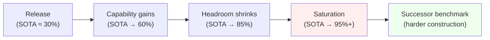
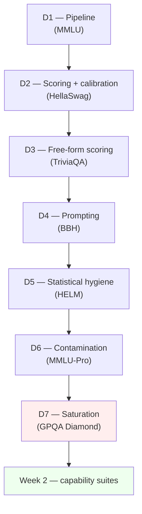

# Day 7 — Benchmark saturation: why benchmarks die

## TL;DR

A benchmark *saturates* when frontier scores climb close enough to 1.0 that headroom shrinks faster than the binomial standard error on a single score, and model-vs-model differences collapse into the noise floor. **GPQA Diamond** (198 expert-validated, Google-proof graduate-science items) was designed to push that ceiling out via construction — and frontier models still moved from ~39% to ~94% on it in roughly 28 months. Saturation is the fourth and final hidden property Week 1 has been unpacking, and it is what closes the loop on reading any eval-paper methods section.

## Learning objectives

By the end of this lesson, you will be able to:

1. **(L2)** Define saturation as headroom-vs-SE collapse, distinguish it from contamination ([D-6](/lesson/6)), and state why a clean pipeline does not save a saturated benchmark.
2. **(L3)** *Compute* the per-model 95% CI for a binomial accuracy near the ceiling on a small benchmark (e.g. GPQA Diamond, $n = 198$, $p \approx 0.94$) and use it to decide whether two reported scores are distinguishable.
3. **(L4)** *Decompose* a 39% → 94% trajectory on GPQA Diamond into plausible co-drivers — genuine capability gain, contamination-adjacent training data, and format-targeted optimization — and identify which the construction guarantees actually defend against.
4. **(L4)** Contrast GPQA's *gatekept* construction-time resistance (expert + non-expert pilot) with ARC-AGI's *structural* resistance (per-task novelty), and explain why structural designs typically buy more time per design dollar.
5. **(L5)** *Evaluate* a leaderboard claim that "Model B (95.1%) beats Model A (93.4%) on GPQA Diamond" and surface the most defensible critique a Week 1 reader is now equipped to make.
6. **(L4)** *Articulate* the four hidden properties Week 1 has unpacked — pipeline drift, statistical hygiene, contamination, saturation — as the working lens for any 2024+ benchmark paper's introduction.

## Prerequisites & callback

This lesson presupposes three load-bearing concepts already developed in Week 1. **[D-1](/lesson/1)'s pipeline framing** — that a "score" is a (dataset, scoring rule, reporting convention) triple — is what lets us locate saturation as a property of the *dataset* rather than of the model: even the best harness cannot recover signal from items every frontier model gets right. **[D-5](/lesson/5)'s statistical-hygiene machinery** — binomial standard error, paired-bootstrap and McNemar CIs over items — supplies the math behind "headroom shrinks faster than SE", and is the toolkit for the worked example below. **[D-6](/lesson/6)'s contamination forensics** — n-gram overlap, Min-K% Prob, decontamination — names the failure mode saturation is most often confused with, and the one we explicitly distinguish today: a saturated benchmark can be perfectly clean, and a contaminated one can look unsaturated when its ceiling is artificial. Today's anchor closes Week 1 by adding the *fourth* hidden property the headline number conceals.

## The opening hook

Every popular LLM benchmark has the same life cycle. It is published with frontier models scoring somewhere in the 25–45% range and humans (or experts) scoring 80–90%. Three years later, frontier models are at 90%+ and the benchmark is "solved." The headline number stops moving. Differences between models — *the* thing the benchmark exists to measure — collapse into the noise floor. The benchmark dies, and the field builds a new one.

This is **saturation**. It is not the same failure as contamination ([D-6](/lesson/6)), though the two interact: a contaminated benchmark saturates artificially fast because models score above their genuine capability. But a clean benchmark saturates too, just more honestly. The question is what to do once the ceiling is in sight, and the answer the field has converged on is: build benchmarks that are *harder by construction* — graduate-level rather than high-school-level, search-resistant rather than searchable, post-cutoff rather than archival.

[D-7](/lesson/7)'s anchor — **GPQA Diamond** (Rein et al. 2023) — is the canonical example of construction-time saturation resistance. It is also, as of mid-2026, beginning to saturate itself. That tension is the whole lesson.

## The saturation curve, visualized

The shape is sigmoidal in expectation: slow at first, fast in the middle, asymptotic at the top. The asymptote is what kills the benchmark.

## Why headroom shrinks faster than standard error

Suppose two models score $p_A$ and $p_B$ on a benchmark of $n$ items. Under a binomial null, the standard error on each is roughly $\sqrt{p(1-p)/n}$, and the SE on the *difference* (independent items) is $\sqrt{p_A(1-p_A)/n + p_B(1-p_B)/n}$.

At $p = 0.5$, $p(1-p) = 0.25$. At $p = 0.9$, $p(1-p) = 0.09$. At $p = 0.95$, $p(1-p) = 0.0475$. The variance is shrinking, which sounds good — but the *headroom* is shrinking faster:

$$
\text{headroom} = 1 - p
$$

At $p = 0.95$, only **5 points** remain between the model and the ceiling. With a 200-item benchmark, the SE on a single model's score is $\sqrt{0.95 \cdot 0.05 / 200} \approx 0.0154$, so the 95% CI is roughly $\pm 3$ points — *most of the headroom*. Two models scoring 0.93 and 0.96 are statistically indistinguishable on that test, even though the gap "looks" meaningful. The signal-to-noise ratio (SNR) of model differences collapses as $p \to 1$.

> **Worked example.** Compute the per-model 95% CI on GPQA Diamond ($n = 198$) at three accuracies — $p = 0.50$, $p = 0.90$, $p = 0.94$ — and watch the SNR collapse against the ceiling.
>
> Standard error: $\mathrm{SE}(p) = \sqrt{p(1-p)/n}$. The 95% half-width is $1.96 \cdot \mathrm{SE}$.
>
> | $p$ | $p(1-p)$ | $\mathrm{SE}$ | 95% half-width | Headroom $1-p$ | SNR (headroom / half-width) |
> | --- | --- | --- | --- | --- | --- |
> | 0.50 | 0.2500 | $\sqrt{0.2500/198} = 0.0355$ | $\pm 6.96$ pts | 0.50 | 7.18 |
> | 0.90 | 0.0900 | $\sqrt{0.0900/198} = 0.0213$ | $\pm 4.18$ pts | 0.10 | 2.39 |
> | 0.94 | 0.0564 | $\sqrt{0.0564/198} = 0.0169$ | $\pm 3.31$ pts | 0.06 | 1.81 |
>
> The SE column is *shrinking* (good), but the headroom column is shrinking *faster*. At $p = 0.94$, a single model's CI is roughly $\pm 3.3$ points — over half the headroom. Two models scoring 93.4% and 95.1% on Diamond are inside each other's independent CIs; the apparent 1.7-point gap is well below the half-width, and a paired test on the same 198 items ([D-5](/lesson/5)'s McNemar) is the only way to claim a real ranking.

This is the formal version of the intuition: **near saturation, you cannot rank models reliably**. [D-5](/lesson/5)'s statistical-hygiene machinery (CIs, McNemar's test on paired items) is what tells you the gap is noise; [D-7](/lesson/7)'s framing is *why you keep needing harder benchmarks* even when the harness is correct and the data is clean.

## ⏵ Check yourself — saturation math

A new benchmark releases with $n = 500$ items and the frontier scoring 60%. Two years later the frontier sits at 92%. **Compute** the per-model 95% half-width at each point and the ratio of headroom to half-width. By the SNR argument, has the benchmark saturated?

Show answer

At $p = 0.60$: $\mathrm{SE} = \sqrt{0.60 \cdot 0.40 / 500} = \sqrt{0.00048} \approx 0.0219$, so the 95% half-width is $\pm 4.30$ pts. Headroom is 40 points. Ratio: $40 / 4.30 \approx 9.3$ — comfortably resolvable.

At $p = 0.92$: $\mathrm{SE} = \sqrt{0.92 \cdot 0.08 / 500} = \sqrt{0.000147} \approx 0.0121$, so the 95% half-width is $\pm 2.37$ pts. Headroom is 8 points. Ratio: $8 / 2.37 \approx 3.4$.

The half-width nearly *halved* (good), but the headroom shrank *fivefold*, so the resolvable-rank SNR dropped by ~2.7x. By the operational rule of thumb — "you have left the rank-resolvable regime once the ratio falls below ~3" — this benchmark is on the edge of saturation, even with $n = 500$ and a 92% absolute score that doesn't yet *look* saturated. The right next move is a successor benchmark with stronger construction, not a bigger $n$ on the same one.

## Anchor: GPQA Diamond (Rein et al. 2023)

**Citation.** Rein, D., Hou, B. L., Stickland, A. C., Petty, J., Pang, R. Y., Dirani, J., Michael, J., & Bowman, S. R. (2023). *GPQA: A Graduate-Level Google-Proof Q&A Benchmark.* arXiv:2311.12022.

GPQA is **448 multiple-choice questions** in biology, physics, and chemistry, written by domain experts holding (or pursuing) PhDs in the relevant field. The construction is the point: the benchmark is designed from the start to resist two specific failure modes that killed earlier knowledge benchmarks — search-engine lookup and capability-headroom collapse.

### The Google-proof construction

For each candidate question, Rein et al. ran a two-pronged validation pipeline:

1. **Expert validation.** Two independent domain-expert PhDs (other than the question writer) attempt the question. The question is retained only if at least one expert solves it correctly — and the question writer must respond to expert feedback before the question is finalized.
2. **Non-expert validation.** Three "highly skilled non-experts" — PhD-holders, but in a *different* field — attempt the question with **unrestricted internet access** and an average of **over 30 minutes per question**. Their job is to break the question via search. If they succeed, the question is searchable and gets rejected.

The aggregate human numbers from the paper:

- **Domain experts:** 65% accuracy (74% if you exclude questions experts agree contain errors).
- **Skilled non-experts with internet access:** 34% accuracy, despite 30+ minutes per question.

The 31-point gap between "expert who knows the field" and "PhD-with-Google" is the operational definition of *Google-proof*. You can't search your way to the answer; you need internalized graduate-level domain knowledge. This is also why GPQA is a useful capability eval rather than a retrieval-augmented-generation eval ([D-10](/lesson/10)): it tests what the model *knows*, not what it can look up.

### The Diamond subset

The full 448-item set has three nested difficulty tiers — **Extended** (546 including questions with disagreement), **Main** (448), and **Diamond** (198). Diamond is the highest-quality, hardest subset and is what frontier-model reports almost always cite when they say "GPQA." The selection criteria for Diamond:

- **Both expert validators must answer correctly** (stronger than Main, which requires only one).
- **Non-expert agreement is bounded:** no more than one of the three non-experts answered correctly. (In Main, the threshold is looser.)

In plain language, Diamond is the slice where experts converge on the right answer but non-experts with Google can't find it. It is 198 questions, which is *small* — [D-5](/lesson/5)'s CI math says a single-model 95% CI is roughly $\pm 6$ points at $p = 0.5$ and $\pm 3$ points at $p = 0.95$. Frontier-model gaps on Diamond should always be reported with paired-bootstrap or McNemar's CIs; the headline number alone is misleading.

### An example item (paraphrased to avoid contaminating the benchmark)

The questions look like graduate qualifying-exam problems. A typical physics item runs along these lines (this is a paraphrased composite, *not* a verbatim GPQA item):

> A relativistic electron in a uniform magnetic field $B$ has total energy $E$ much greater than its rest energy. Which of the following best characterizes the synchrotron radiation spectrum's critical frequency $\omega_c$ in the limit $\gamma \gg 1$?
>
> (A) $\omega_c \propto \gamma^2 B / m$
> (B) $\omega_c \propto \gamma B / m$
> (C) $\omega_c \propto \gamma^3 B / m$
> (D) $\omega_c$ is independent of $\gamma$ in this limit

A non-expert with Google can find Wikipedia's "synchrotron radiation" page, but the page lists several closely related expressions (Larmor formula, characteristic frequency, peak frequency, critical frequency) — picking the right one without graduate-level E&M training is hard. That's the construction in microcosm: the answer is *findable* in some sense, but not *retrievable* without expertise that filters the search results. Real GPQA items go further — many require chaining two or three pieces of domain knowledge that no single search will surface.

### Frontier performance and where Diamond stands as of mid-2026

Diamond's whole *point* was to be saturation-resistant. The trajectory tells you how that's gone:

- **Nov 2023 (release).** Frontier models scored ~39% on Diamond — barely above the 25% random baseline, and well below the 65% expert ceiling.
- **Sep 2024.** OpenAI's o1 reached ~77%, the first frontier model to clear the expert-PhD threshold of 65%.
- **Mid-2025.** Top reasoning models pushed past 90%.
- **As of early 2026.** Frontier model SOTA on Diamond is in the **92–95%** range across multiple labs' top reasoning models. (Specific scores drift weekly on vendor leaderboards; verify against primary system cards before quoting. Treat anything above 90% as "near-ceiling, gaps probably noise" rather than a meaningful ranking.)

That trajectory — 39% → 95% in ~28 months on a benchmark *designed* to resist saturation — is what makes [D-7](/lesson/7)'s lesson urgent. Construction-time difficulty is not a one-shot fix. It buys you a couple of years before the next benchmark is needed. GPQA Diamond's headroom is now small enough that, by the same SNR argument as above, frontier-model rankings on it are increasingly noise-dominated. Successor benchmarks aimed at this regime — Humanity's Last Exam, FrontierMath ([D-25](/lesson/25) overlay), and others — already exist.

## ⏵ Check yourself — Diamond filter

A candidate question survives Rein et al.'s pipeline as follows: both expert validators answer it correctly; among the three non-experts with internet access and 30+ minutes per question, two get it right. Does this question land in **Main**, **Diamond**, both, or neither — and what does its construction tell you about its expected resistance to saturation?

Show answer

The question lands in **Main** but **not Diamond**. Main requires at least one expert correct; Diamond requires *both* experts correct *and* at most one of the three non-experts correct. Two non-experts correct exceeds Diamond's bound.

What that means structurally: the item is high-quality (experts agree) but *not* Google-proof in Diamond's strict sense — it survived non-experts' search well enough that two of three found the answer in 30 minutes. Items that pass the Main filter but fail the Diamond filter are exactly the ones whose ceiling will rise *fastest* when training data accumulates the kind of explanatory web pages non-experts found. That is why Diamond's 198-item slice resists saturation for longer than the 448-item Main set, even on identical models.

## Why benchmarks die faster than capability grows

Saturation has two drivers, and only one is "the models got better."

The first driver is **genuine capability gain.** A 2026 frontier model really does know more graduate-level chemistry than a 2023 model. Scores rise because capability rises. This is the boring-but-true reason benchmarks saturate.

The second driver is **Goodhart's Law.** Once a benchmark is the *target* of optimization — once labs train on adjacent data, run RL with reward signals correlated with the benchmark format, or fine-tune on similar problem distributions — the score climbs faster than the underlying capability. The benchmark's ability to *measure* that capability degrades at the same rate. The Open LLM Leaderboard's retirement ([D-1](/lesson/1)) was exactly this: in March 2025, the Hugging Face team retired v2 citing concern that models were optimizing toward leaderboard targets rather than the underlying capabilities the targets were proxies for. The leaderboard saturated, but more pointedly, it stopped being a reliable *measure* well before it stopped moving.

The two drivers are hard to disentangle from the outside. A score that climbs from 40% to 90% on a benchmark could mean (a) capability tripled, (b) the benchmark leaked into post-training, (c) the field is selecting for benchmark-shaped problems, or (d) all three. [D-6](/lesson/6)'s contamination tools partially address (b); [D-7](/lesson/7)'s saturation framing names the meta-failure (d) that no single technical fix dissolves. The structural answer is to keep building successor benchmarks with *stronger construction-time guarantees* — Google-proof piloting (GPQA), post-cutoff problem sourcing (LiveCodeBench, [D-11](/lesson/11)), expert-only solvability (FrontierMath), or task structures that resist memorization entirely (ARC-AGI, below).

## Conceptual contrast: ARC-AGI's resistance is structural, not gatekept

GPQA's saturation resistance is **gatekept**: a panel of experts decides which questions are hard enough. ARC-AGI (Chollet 2019, *On the Measure of Intelligence*, arXiv:1911.01547) takes a different approach — **structural** resistance. ARC-AGI tasks are visual grid-transformation puzzles, each with a handful of input/output examples and a held-out test. The point is that the *task type* is novel: a model that has memorized millions of ARC-AGI-style puzzles is no better off than one that hasn't, because each puzzle requires inferring a unique rule from a few examples.

The empirical numbers tell the story. As of mid-2026, frontier reasoning models on ARC-AGI-2 (Chollet et al. 2025, arXiv:2505.11831) score in the 30–55% range depending on cost-budget — *much* below the ~95% they hit on GPQA Diamond. That gap is the difference between "graduate-level knowledge that's been heavily targeted" and "few-shot novel-task generalization that hasn't been." The curriculum's [D-28](/lesson/28) closer is METR's autonomy suite rather than ARC-AGI (per the overview, ARC-AGI was considered and rejected as the closer for being less policy-relevant), but ARC-AGI's design is the cleanest example of *structurally* contamination- and saturation-resistant evaluation, and it's the right reference point when you're asking "could we have built GPQA differently?"

The two designs are complements, not competitors. GPQA tests *knowledge*. ARC-AGI tests *task-novel reasoning*. Both saturate eventually — ARC-AGI-1 was effectively cleared, which is why ARC-AGI-2 exists — but the *clock* on structural-resistance benchmarks runs slower.

## ⏵ Check yourself — gatekept vs. structural

You are designing a successor to GPQA Diamond. Your team has a budget for either (a) doubling the expert-validator panel from 2 to 4 PhDs per item, or (b) reformulating the question stem so each item embeds a *novel* sub-task that requires inferring a rule from 2–3 worked sub-cases before answering. **Decompose** which option buys more saturation resistance per unit of construction cost, and why.

Show answer

Option (b) buys more. Option (a) raises the *quality bar* on items that already passed gatekeeping — it shrinks expert disagreement noise, but it does not change the kind of item the benchmark contains. The frontier-capability clock on those items keeps ticking at roughly the same rate, because models train on graduate-domain explanatory text whether two or four experts validated it.

Option (b) introduces a *structural* novelty per item — the embedded sub-task — that frustrates direct memorization the way ARC-AGI's grid-puzzles do. Even if training data accumulates pages adjacent to the surface domain (chemistry, physics, biology), each item's sub-task has to be inferred at evaluation time from its own few examples. That is why ARC-AGI-1 took longer to clear than GPQA Diamond despite GPQA having explicit Google-proof piloting: structural per-item novelty resists optimization-toward-target in a way that gatekept difficulty alone cannot. Gatekeeping wins time linearly in panel size; structural novelty wins time roughly as long as no general method automates the sub-task class.

## The successor pattern across Week 2

Saturation and contamination together produce a recurring design pattern across the rest of the curriculum: **contamination-resistant successor benchmarks**. You will see it three times in Week 2 alone:

- **[D-8](/lesson/8) (ARC-Challenge).** AI2's grade-school science benchmark — older, partially saturated, but methodologically clean. The Week 2 opener uses it to show how reasoning evaluation generalized beyond MMLU's MC-knowledge format.
- **[D-11](/lesson/11) (HumanEval → LiveCodeBench).** HumanEval (Chen et al. 2021) defined `pass@k` and is now contaminated. LiveCodeBench (Jain et al. 2024) samples problems *post-cutoff* — the same methodology, but the items are demonstrably absent from training data because they didn't exist yet.
- **[D-6](/lesson/6) → [D-7](/lesson/7).** MMLU-Pro is the contamination-and-saturation-resistant successor to MMLU; GPQA Diamond is the construction-resistant alternative. Both sit downstream of MMLU.

Once you internalize the pattern — *original benchmark saturates and/or gets contaminated; the field builds a harder/cleaner successor; that one too eventually saturates* — you can read any 2024+ benchmark paper's introduction in 30 seconds. The first paragraph names a saturated predecessor, the second describes the construction guarantee that's supposed to fix it, the third reports the headroom the new benchmark restores. Week 2 is six lessons of that pattern applied across reasoning, math, RAG, code, SWE, multimodal, and long-context.

## Cross-references

**Backward.**

- [D-1](/lesson/1) — extends [D-1](/lesson/1)'s *pipeline-not-a-number* framing by adding the fourth property (ceiling) the headline number conceals.
- [D-5](/lesson/5) — uses [D-5](/lesson/5)'s binomial-SE and McNemar machinery as the math behind headroom-vs-SE collapse.
- [D-6](/lesson/6) — distinguishes saturation from contamination: a clean benchmark can saturate, and a contaminated one can look unsaturated when its ceiling is artificial.

**Forward.**

- [D-8](/lesson/8) — opens Week 2 with ARC-Challenge, an older, partially saturated reasoning benchmark that survives because it is methodologically clean.
- [D-11](/lesson/11) — extends today's *successor-by-construction* pattern with HumanEval → LiveCodeBench's post-cutoff sampling.
- [D-15](/lesson/15) — reprises saturation as a TruthfulQA-shaped problem: the construct ("truthfulness") is harder to saturate than knowledge accuracy, and Goodhart returns foregrounded.
- [D-22](/lesson/22) — picks up *what happens when the judge is the bottleneck*: LLM-as-judge resists capability saturation but introduces its own measurement-instrument-as-target failure.
- [D-25](/lesson/25) — the FrontierMath / AIME overlay returns to construction-time-difficulty as the operational answer for math reasoning.
- [D-28](/lesson/28) — the closing METR autonomy suite is structurally the most saturation-resistant benchmark in the curriculum, in part because horizon length is unbounded above by 1.

## Week 1 review

You have now seen the whole stack of framing tools you need to read any eval-paper methods section.

The chain reads as a single argument:

- **[D-1](/lesson/1) (pipeline).** An eval is a (dataset, scoring rule, reporting convention) triple plus a model run. Pipeline differences explain most apparent score disagreements between papers.
- **[D-2](/lesson/2) (MC scoring + calibration).** `acc` vs. `acc_norm`, log-likelihood vs. generative letter extraction, and the Day-2 calibration framing (ECE, reliability diagrams) — the mechanics of the scoring box in [D-1](/lesson/1)'s flowchart.
- **[D-3](/lesson/3) (free-form scoring).** EM, F1, BLEU/ROUGE failure modes, and the semantic/judge-based alternatives that Week 4 returns to. The *other* scoring family.
- **[D-4](/lesson/4) (prompting).** n-shot, chain-of-thought, instruction templates — the prompt-formatting box that swings scores by 5+ points without touching the model.
- **[D-5](/lesson/5) (statistical hygiene).** Sample-size math, confidence intervals, scenario coverage — the floor under any score comparison.
- **[D-6](/lesson/6) (contamination).** Did the model see the test? n-gram overlap, Min-K% Prob, canary strings, decontamination — and MMLU-Pro as the structural answer.
- **[D-7](/lesson/7) (saturation, today).** Even if the pipeline is right, the scoring is normalized, the prompts are fixed, the CIs are computed, and the data is clean — once $p \to 1$, the benchmark stops being a measure. Successor design (GPQA-style gatekeeping, ARC-AGI-style structural novelty) is the field's response.

If you can articulate (a) what changes between two papers reporting different scores, (b) whether a score difference is statistically meaningful, (c) whether a benchmark has been compromised by training-data leakage, and (d) whether a benchmark is near its ceiling — you can read any eval-paper methods section. Those are the four hidden properties [D-1](/lesson/1) promised the headline number conceals. Week 1 has now unpacked all four.

> **Safety researcher's note.** Saturation has a specifically safety-relevant edge. Capability benchmarks saturate; *safety* benchmarks often don't, because the failure mode they measure (refusal compliance, adversarial robustness, sycophancy) doesn't live in a 0-to-1 accuracy frame the same way knowledge does. So as capability scores plateau near the ceiling and become noisy, the *safety delta* between models can grow more visible relative to the capability delta. The "capability up, safety flat" pattern from [D-1](/lesson/1)'s safety-researcher note becomes "capability indistinguishable, safety still distinguishable" — and the policy-relevant signal shifts from "which model is more capable?" to "which model is *adequately* aligned at ceiling capability?". Week 3 (alignment / safety / robustness) is where this question gets concrete.

## Week 1 handoff

You are now equipped to read any capability-benchmark paper's methods section. Week 2 stops asking *how to read evaluations* and starts asking *what the evaluations say about model capability* — reasoning ([D-8](/lesson/8) ARC-Challenge), math ([D-9](/lesson/9) GSM8K + MATH), RAG robustness ([D-10](/lesson/10) RGB), code ([D-11](/lesson/11) HumanEval + LiveCodeBench), software engineering ([D-12](/lesson/12) SWE-Bench), multimodal ([D-13](/lesson/13) MMMU), and long context ([D-14](/lesson/14) RULER). The recurring pattern from [D-7](/lesson/7) — *saturated predecessor → contamination-resistant successor* — runs through every one of those days. Week 1's tools are how you tell the difference between a benchmark that is informative and a benchmark that is folkloric.

## Takeaways

1. Saturation is what happens when a benchmark's headline scores approach 1 and the SNR of model-vs-model differences collapses. Even with a perfect pipeline and clean data, a saturated benchmark cannot rank models reliably. *(LO 1)*
2. The per-model 95% half-width on a binomial accuracy is $1.96 \sqrt{p(1-p)/n}$; near $p = 0.94$ on $n = 198$ it is $\pm 3.3$ points — over half the headroom — so paired tests on the same items, not independent CIs, are the only way to claim a real ranking. *(LO 2)*
3. GPQA Diamond (198 items, biology + physics + chemistry, expert-validated) is the canonical *construction-time* saturation resistance: Google-proof via non-expert+internet piloting, expert-validated for correctness, gatekept for difficulty. *(LO 1)*
4. The 39% → 94% Diamond trajectory is the joint signature of three co-drivers — genuine capability gain, contamination-adjacent training data, and format-targeted optimization. Construction guarantees defend against the second well and the third partially; they do not defend against the first. *(LO 3)*
5. ARC-AGI's *structural* per-task novelty resists saturation longer than GPQA's *gatekept* difficulty for the same dollar of construction effort, which is why structural designs are the right reference point when asking how a successor benchmark could be built more durably. *(LO 4)*
6. Week 1 is now complete. The four-property framework — pipeline drift, statistical hygiene, contamination, saturation — is the working lens for any 2024+ capability-benchmark paper, and is what the leaderboard claim "Model B (95.1%) > Model A (93.4%) on GPQA Diamond" fails on its third and fourth properties. *(LO 5, LO 6)*

## Glossary

- **saturation**: a benchmark's headline scores cluster near 1.0 such that headroom shrinks faster than the binomial standard error and model-vs-model differences fall into the noise floor [introduced D-7](/lesson/7).
- **headroom**: the distance $1 - p$ between a model's accuracy and the ceiling — the regime in which model rankings are still resolvable [introduced D-7](/lesson/7).
- **signal-to-noise ratio (SNR)**: ratio of the typical model-vs-model gap to the standard error on that gap; collapses as $p \to 1$ [introduced D-7](/lesson/7).
- **Google-proof**: GPQA's construction guarantee — items survive the pilot only if PhD-level non-experts with unrestricted internet access and 30+ minutes per question fail at near-chance levels [introduced D-7](/lesson/7).
- **construction-time difficulty**: resistance built into a benchmark *at dataset-construction time* — expert gatekeeping (GPQA), post-cutoff sampling (LiveCodeBench), per-item task novelty (ARC-AGI) — as opposed to harness-time fixes [introduced D-7](/lesson/7).
- **structural novelty**: the per-item resistance of benchmarks like ARC-AGI, where each item requires inferring a unique rule from a few examples; contrasts with gatekept-difficulty designs [introduced D-7](/lesson/7).
- **successor benchmark**: the field's recurring response to a saturated predecessor — MMLU-Pro, GPQA Diamond, LiveCodeBench, ARC-AGI-2 — with stronger construction guarantees [introduced D-7](/lesson/7).
- **item-difficulty floor**: the practical lower bound on per-item difficulty achievable under a given construction process; it sets how long a benchmark can resist saturation before a successor is needed [introduced D-7](/lesson/7).

## References

- **Anchor.** Rein, D., Hou, B. L., Stickland, A. C., Petty, J., Pang, R. Y., Dirani, J., Michael, J., & Bowman, S. R. (2023). *GPQA: A Graduate-Level Google-Proof Q&A Benchmark.* arXiv:2311.12022. https://arxiv.org/abs/2311.12022
- **Harness.** Gao, L., et al. *lm-evaluation-harness* (EleutherAI). https://github.com/EleutherAI/lm-evaluation-harness
- **Secondary.** Chollet, F. (2019). *On the Measure of Intelligence.* arXiv:1911.01547. https://arxiv.org/abs/1911.01547 — the structural-novelty design philosophy.
- **Secondary.** Chollet, F., et al. (2025). *ARC-AGI-2: A New Challenge for Frontier AI Reasoning Systems.* arXiv:2505.11831. https://arxiv.org/abs/2505.11831 — the contemporary structural-resistance benchmark.
- **Secondary.** Jain, N., Han, K., Gu, A., Li, W.-D., Yan, F., Zhang, T., Wang, S., Sen, A., Stoica, I., & Sun, Y. (2024). *LiveCodeBench: Holistic and Contamination Free Evaluation of Large Language Models for Code.* arXiv:2403.07974. https://arxiv.org/abs/2403.07974 — post-cutoff successor design (forward reference for [D-11](/lesson/11)).
- **Secondary.** Public leaderboards for frontier-model SOTA tracking: Epoch AI GPQA Diamond (https://epoch.ai/benchmarks/gpqa-diamond), Artificial Analysis GPQA Diamond (https://artificialanalysis.ai/evaluations/gpqa-diamond), and vendor system cards. Specific 2026 numbers drift weekly; cite primary system cards rather than leaderboard snapshots.

## Quiz

**Q1.** Which of the following is the **most defensible reading** of why a small standard error on a model's accuracy *fails* to protect you from saturation?

- A. SE goes to zero as $p \to 1$, but the model's true skill becomes unmeasurable in absolute terms.
- B. SE is dominated by tokenizer choice and prompt format, not by item count or scoring rule.
- C. SE shrinks as $p \to 1$, but headroom shrinks faster, so cross-model SNR collapses.
- D. SE is only valid for binary-classification benchmarks, not for generative or rubric-graded items.

**Q2.** Which is the *defining* construction property of GPQA's "Google-proof" pipeline?

- A. Items are written at graduate level across biology, physics, and chemistry.
- B. Items are piloted by PhDs in *other* fields with internet access and 30+ minutes per question.
- C. Items are filtered through a content-policy review and a per-item refusal-rate threshold.
- D. Items are translated into multiple languages and back-translated for cross-lingual robustness.

**Q3.** GPQA Diamond is the subset where:

- A. All three non-experts with internet access answer correctly within the time limit.
- B. Both expert validators answer correctly *and* at most one of three non-experts is correct.
- C. The question writer is anonymous and reviewers cannot see the source domain.
- D. Items are released only after a specified post-training cutoff date for retrieval evaluation.

**Q4.** **Decompose** the GPQA Diamond trajectory from 39% (late 2023) to 94% (early 2026) into plausible co-drivers. Which of the following is **not** one of them?

- A. Genuine capability gains in graduate-level science reasoning.
- B. Training data picking up problems and explanations adjacent to GPQA items.
- C. RL with rewards correlated to multiple-choice exam-style problem distributions.
- D. The set of GPQA Diamond items was secretly expanded each year, raising the ceiling.

**Q5.** Why is ARC-AGI a useful conceptual *contrast* to GPQA Diamond, even though it is not the [D-28](/lesson/28) anchor?

- A. ARC-AGI is multilingual and tokenizer-agnostic, while GPQA is English-only and tokenizer-sensitive.
- B. ARC-AGI's resistance is *structural* — each task requires inferring a novel rule from few examples — not gatekept by an expert panel.
- C. ARC-AGI uses log-likelihood scoring with normalized choice ranking, which GPQA's free-form rubric can't support.
- D. ARC-AGI is part of the Open LLM Leaderboard's v3 reasoning suite alongside GPQA Diamond.

**Q6.** A reviewer claims that "Model A scores 93.4% and Model B scores 95.1% on GPQA Diamond, so Model B is better." **Compute** the per-model 95% CI at $p \approx 0.94$ on $n = 198$ items and pick the option that correctly diagnoses the comparison.

- A. The two models should be compared on MMLU-Pro and HELM scenario coverage with bootstrap CIs over scenarios.
- B. At $p \approx 0.94$ on 198 items, per-model 95% CI is about $\pm 3$ points; a paired test (e.g., McNemar) is needed.
- C. GPQA Diamond's free-form rubric doesn't support log-likelihood scoring, so the comparison is invalid by construction.
- D. The reviewer must report `acc_norm` rather than `acc` and verify the gap with paired-bootstrap CIs over items.

Answers

1. **C** — the headroom-vs-SE argument from "Why headroom shrinks faster than standard error."
2. **B** — the non-expert + internet + 30-minute pilot is what makes GPQA *Google-proof* in the technical sense; graduate-level difficulty (A) is necessary but not sufficient.
3. **B** — the Diamond filter requires both experts correct *and* non-expert agreement bounded; Main is looser.
4. **D** — the Diamond set is fixed at 198 items. A, B, and C are all genuine co-drivers (real capability + contamination + Goodhart-style optimization toward exam-format problems).
5. **B** — ARC-AGI's task-novelty design resists memorization and benchmark-targeted optimization in a way that gatekept difficulty alone (GPQA) does not. Both saturate eventually; ARC-AGI's clock runs slower.
6. **B** — [D-5](/lesson/5)'s CI math gives $\sqrt{0.94 \cdot 0.06 / 198} \approx 0.017$, so a per-model 95% CI is roughly $\pm 3.4$ points. Independent CIs overlap; a paired test on the same items is needed to claim a real ranking. This is the saturation argument made concrete.

