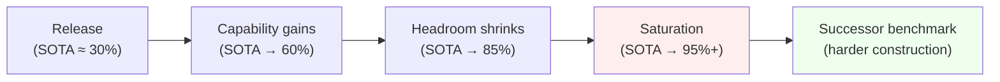
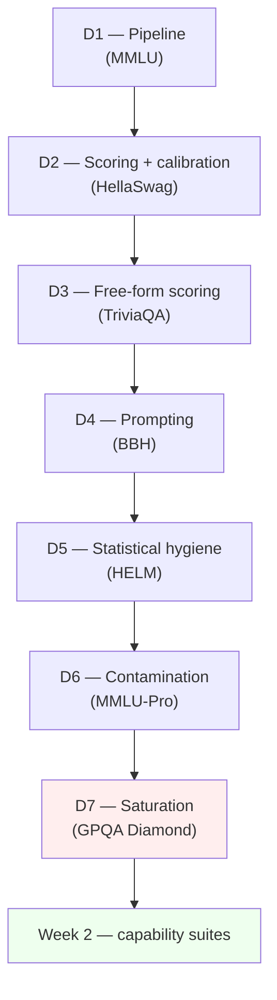

# Day 7 — Benchmark saturation: why benchmarks die

## The opening hook

Every popular LLM benchmark has the same life cycle. It is published with frontier models scoring somewhere in the 25–45% range and humans (or experts) scoring 80–90%. Three years later, frontier models are at 90%+ and the benchmark is "solved." The headline number stops moving. Differences between models — *the* thing the benchmark exists to measure — collapse into the noise floor. The benchmark dies, and the field builds a new one.

This is **saturation**. It is not the same failure as contamination (Day 6), though the two interact: a contaminated benchmark saturates artificially fast because models score above their genuine capability. But a clean benchmark saturates too, just more honestly. The question is what to do once the ceiling is in sight, and the answer the field has converged on is: build benchmarks that are *harder by construction* — graduate-level rather than high-school-level, search-resistant rather than searchable, post-cutoff rather than archival.

Day 7's anchor — **GPQA Diamond** (Rein et al. 2023) — is the canonical example of construction-time saturation resistance. It is also, as of mid-2026, beginning to saturate itself. That tension is the whole lesson.

## The saturation curve, visualized

The shape is sigmoidal in expectation: slow at first, fast in the middle, asymptotic at the top. The asymptote is what kills the benchmark.

## The math: why "near 1.0" hurts more than the gap suggests

Suppose two models score $p_A$ and $p_B$ on a benchmark of $n$ items. Under a binomial null, the standard error on each is roughly $\sqrt{p(1-p)/n}$, and the SE on the *difference* (independent items) is $\sqrt{p_A(1-p_A)/n + p_B(1-p_B)/n}$.

At $p = 0.5$, $p(1-p) = 0.25$. At $p = 0.9$, $p(1-p) = 0.09$. At $p = 0.95$, $p(1-p) = 0.0475$. The variance is shrinking, which sounds good — but the *headroom* is shrinking faster:

$$
\text{headroom} = 1 - p
$$

At $p = 0.95$, only **5 points** remain between the model and the ceiling. With a 200-item benchmark, the SE on a single model's score is $\sqrt{0.95 \cdot 0.05 / 200} \approx 0.0154$, so the 95% CI is roughly $\pm 3$ points — *most of the headroom*. Two models scoring 0.93 and 0.96 are statistically indistinguishable on that test, even though the gap "looks" meaningful. The signal-to-noise ratio (SNR) of model differences collapses as $p \to 1$.

This is the formal version of the intuition: **near saturation, you cannot rank models reliably**. Day 5's statistical hygiene machinery (CIs, McNemar's test on paired items) is what tells you the gap is noise; Day 7's framing is *why you keep needing harder benchmarks* even when the harness is correct and the data is clean.

## Anchor: GPQA (Rein et al. 2023)

**Citation.** Rein, D., Hou, B. L., Stickland, A. C., Petty, J., Pang, R. Y., Dirani, J., Michael, J., & Bowman, S. R. (2023). *GPQA: A Graduate-Level Google-Proof Q&A Benchmark.* arXiv:2311.12022.

GPQA is **448 multiple-choice questions** in biology, physics, and chemistry, written by domain experts holding (or pursuing) PhDs in the relevant field. The construction is the point: the benchmark is designed from the start to resist two specific failure modes that killed earlier knowledge benchmarks — search-engine lookup and capability-headroom collapse.

### The Google-proof construction

For each candidate question, Rein et al. ran a two-pronged validation pipeline:

1. **Expert validation.** Two independent domain-expert PhDs (other than the question writer) attempt the question. The question is retained only if at least one expert solves it correctly — and the question writer must respond to expert feedback before the question is finalized.
2. **Non-expert validation.** Three "highly skilled non-experts" — PhD-holders, but in a *different* field — attempt the question with **unrestricted internet access** and an average of **over 30 minutes per question**. Their job is to break the question via search. If they succeed, the question is searchable and gets rejected.

The aggregate human numbers from the paper:

- **Domain experts:** 65% accuracy (74% if you exclude questions experts agree contain errors).
- **Skilled non-experts with internet access:** 34% accuracy, despite 30+ minutes per question.

The 31-point gap between "expert who knows the field" and "PhD-with-Google" is the operational definition of *Google-proof*. You can't search your way to the answer; you need internalized graduate-level domain knowledge. This is also why GPQA is a useful capability eval rather than a retrieval-augmented-generation eval (Day 10): it tests what the model *knows*, not what it can look up.

### The Diamond subset

The full 448-item set has three nested difficulty tiers — **Extended** (546 including questions with disagreement), **Main** (448), and **Diamond** (198). Diamond is the highest-quality, hardest subset and is what frontier-model reports almost always cite when they say "GPQA." The selection criteria for Diamond:

- **Both expert validators must answer correctly** (stronger than Main, which requires only one).
- **Non-expert agreement is bounded:** no more than one of the three non-experts answered correctly. (In Main, the threshold is looser.)

In plain language, Diamond is the slice where experts converge on the right answer but non-experts with Google can't find it. It is 198 questions, which is *small* — Day 5's CI math says a single-model 95% CI is roughly $\pm 6$ points at $p = 0.5$ and $\pm 3$ points at $p = 0.95$. Frontier-model gaps on Diamond should always be reported with paired-bootstrap or McNemar's CIs; the headline number alone is misleading.

### An example item (paraphrased to avoid contaminating the benchmark)

The questions look like graduate qualifying-exam problems. A typical physics item runs along these lines (this is a paraphrased composite, *not* a verbatim GPQA item):

> A relativistic electron in a uniform magnetic field $B$ has total energy $E$ much greater than its rest energy. Which of the following best characterizes the synchrotron radiation spectrum's critical frequency $\omega_c$ in the limit $\gamma \gg 1$?
>
> (A) $\omega_c \propto \gamma^2 B / m$
> (B) $\omega_c \propto \gamma B / m$
> (C) $\omega_c \propto \gamma^3 B / m$
> (D) $\omega_c$ is independent of $\gamma$ in this limit

A non-expert with Google can find Wikipedia's "synchrotron radiation" page, but the page lists several closely related expressions (Larmor formula, characteristic frequency, peak frequency, critical frequency) — picking the right one without graduate-level E&M training is hard. That's the construction in microcosm: the answer is *findable* in some sense, but not *retrievable* without expertise that filters the search results. Real GPQA items go further — many require chaining two or three pieces of domain knowledge that no single search will surface.

### Frontier performance and where Diamond stands as of mid-2026

Diamond's whole *point* was to be saturation-resistant. The trajectory tells you how that's gone:

- **Nov 2023 (release).** Frontier models scored ~39% on Diamond — barely above the 25% random baseline, and well below the 65% expert ceiling.
- **Sep 2024.** OpenAI's o1 reached ~77%, the first frontier model to clear the expert-PhD threshold of 65%.
- **Mid-2025.** Top reasoning models pushed past 90%.
- **As of early 2026.** Frontier model SOTA on Diamond is in the **92–95%** range across multiple labs' top reasoning models. (Specific scores drift weekly on vendor leaderboards; verify against primary system cards before quoting. Treat anything above 90% as "near-ceiling, gaps probably noise" rather than a meaningful ranking.)

That trajectory — 39% → 95% in ~28 months on a benchmark *designed* to resist saturation — is what makes Day 7's lesson urgent. Construction-time difficulty is not a one-shot fix. It buys you a couple of years before the next benchmark is needed. GPQA Diamond's headroom is now small enough that, by the same SNR argument as above, frontier-model rankings on it are increasingly noise-dominated. Successor benchmarks aimed at this regime — Humanity's Last Exam, FrontierMath (Day 25 overlay), and others — already exist.

## The Goodhart sub-thread: why benchmarks die *faster* than capability grows

Saturation has two drivers, and only one is "the models got better."

The first driver is **genuine capability gain.** A 2026 frontier model really does know more graduate-level chemistry than a 2023 model. Scores rise because capability rises. This is the boring-but-true reason benchmarks saturate.

The second driver is **Goodhart's Law.** Once a benchmark is the *target* of optimization — once labs train on adjacent data, run RL with reward signals correlated with the benchmark format, or fine-tune on similar problem distributions — the score climbs faster than the underlying capability. The benchmark's ability to *measure* that capability degrades at the same rate. The Open LLM Leaderboard's retirement (Day 1) was exactly this: in March 2025, the Hugging Face team retired v2 citing concern that models were optimizing toward leaderboard targets rather than the underlying capabilities the targets were proxies for. The leaderboard saturated, but more pointedly, it stopped being a reliable *measure* well before it stopped moving.

The two drivers are hard to disentangle from the outside. A score that climbs from 40% to 90% on a benchmark could mean (a) capability tripled, (b) the benchmark leaked into post-training, (c) the field is selecting for benchmark-shaped problems, or (d) all three. Day 6's contamination tools partially address (b); Day 7's saturation framing names the meta-failure (d) that no single technical fix dissolves. The structural answer is to keep building successor benchmarks with *stronger construction-time guarantees* — Google-proof piloting (GPQA), post-cutoff problem sourcing (LiveCodeBench, Day 11), expert-only solvability (FrontierMath), or task structures that resist memorization entirely (ARC-AGI, below).

## Conceptual contrast: ARC-AGI's resistance is structural, not gatekept

GPQA's saturation resistance is **gatekept**: a panel of experts decides which questions are hard enough. ARC-AGI (Chollet 2019, *On the Measure of Intelligence*, arXiv:1911.01547) takes a different approach — **structural** resistance. ARC-AGI tasks are visual grid-transformation puzzles, each with a handful of input/output examples and a held-out test. The point is that the *task type* is novel: a model that has memorized millions of ARC-AGI-style puzzles is no better off than one that hasn't, because each puzzle requires inferring a unique rule from a few examples.

The empirical numbers tell the story. As of mid-2026, frontier reasoning models on ARC-AGI-2 (Chollet et al. 2025, arXiv:2505.11831) score in the 30–55% range depending on cost-budget — *much* below the ~95% they hit on GPQA Diamond. That gap is the difference between "graduate-level knowledge that's been heavily targeted" and "few-shot novel-task generalization that hasn't been." The curriculum's D28 closer is METR's autonomy suite rather than ARC-AGI (per the overview, ARC-AGI was considered and rejected as the closer for being less policy-relevant), but ARC-AGI's design is the cleanest example of *structurally* contamination- and saturation-resistant evaluation, and it's the right reference point when you're asking "could we have built GPQA differently?"

The two designs are complements, not competitors. GPQA tests *knowledge*. ARC-AGI tests *task-novel reasoning*. Both saturate eventually — ARC-AGI-1 was effectively cleared, which is why ARC-AGI-2 exists — but the *clock* on structural-resistance benchmarks runs slower.

## Forward pointer: Week 2 and the contamination-resistant successor pattern

Saturation and contamination together produce a recurring design pattern across the rest of the curriculum: **contamination-resistant successor benchmarks**. You will see it three times in Week 2 alone:

- **D8 (ARC-Challenge).** AI2's grade-school science benchmark — older, partially saturated, but methodologically clean. The Week 2 opener uses it to show how reasoning evaluation generalized beyond MMLU's MC-knowledge format.
- **D11 (HumanEval → LiveCodeBench).** HumanEval (Chen et al. 2021) defined `pass@k` and is now contaminated. LiveCodeBench (Jain et al. 2024) samples problems *post-cutoff* — the same methodology, but the items are demonstrably absent from training data because they didn't exist yet.
- **D6 → D7.** MMLU-Pro is the contamination-and-saturation-resistant successor to MMLU; GPQA Diamond is the construction-resistant alternative. Both sit downstream of MMLU.

Once you internalize the pattern — *original benchmark saturates and/or gets contaminated; the field builds a harder/cleaner successor; that one too eventually saturates* — you can read any 2024+ benchmark paper's introduction in 30 seconds. The first paragraph names a saturated predecessor, the second describes the construction guarantee that's supposed to fix it, the third reports the headroom the new benchmark restores. Week 2 is six lessons of that pattern applied across reasoning, math, RAG, code, SWE, multimodal, and long-context.

## Week 1 in review

You have now seen the whole stack of framing tools you need to read any eval-paper methods section.

The chain reads as a single argument:

- **D1 (pipeline).** An eval is a (dataset, scoring rule, reporting convention) triple plus a model run. Pipeline differences explain most apparent score disagreements between papers.
- **D2 (MC scoring + calibration).** `acc` vs. `acc_norm`, log-likelihood vs. generative letter extraction, and the Day-2 calibration framing (ECE, reliability diagrams) — the mechanics of the scoring box in D1's flowchart.
- **D3 (free-form scoring).** EM, F1, BLEU/ROUGE failure modes, and the semantic/judge-based alternatives that Week 4 returns to. The *other* scoring family.
- **D4 (prompting).** n-shot, chain-of-thought, instruction templates — the prompt-formatting box that swings scores by 5+ points without touching the model.
- **D5 (statistical hygiene).** Sample-size math, confidence intervals, scenario coverage — the floor under any score comparison.
- **D6 (contamination).** Did the model see the test? n-gram overlap, Min-K% Prob, canary strings, decontamination — and MMLU-Pro as the structural answer.
- **D7 (saturation, today).** Even if the pipeline is right, the scoring is normalized, the prompts are fixed, the CIs are computed, and the data is clean — once $p \to 1$, the benchmark stops being a measure. Successor design (GPQA-style gatekeeping, ARC-AGI-style structural novelty) is the field's response.

If you can articulate (a) what changes between two papers reporting different scores, (b) whether a score difference is statistically meaningful, (c) whether a benchmark has been compromised by training-data leakage, and (d) whether a benchmark is near its ceiling — you can read any eval-paper methods section. Those are the four hidden properties Day 1 promised the headline number conceals. Week 1 has now unpacked all four.

> **Safety researcher's note.** Saturation has a specifically safety-relevant edge. Capability benchmarks saturate; *safety* benchmarks often don't, because the failure mode they measure (refusal compliance, adversarial robustness, sycophancy) doesn't live in a 0-to-1 accuracy frame the same way knowledge does. So as capability scores plateau near the ceiling and become noisy, the *safety delta* between models can grow more visible relative to the capability delta. The "capability up, safety flat" pattern from D1's safety-researcher note becomes "capability indistinguishable, safety still distinguishable" — and the policy-relevant signal shifts from "which model is more capable?" to "which model is *adequately* aligned at ceiling capability?". Week 3 (alignment / safety / robustness) is where this question gets concrete.

## Week 2 handoff

You are now equipped to read any capability-benchmark paper's methods section. Week 2 stops asking *how to read evaluations* and starts asking *what the evaluations say about model capability* — reasoning (D8 ARC-Challenge), math (D9 GSM8K + MATH), RAG robustness (D10 RGB), code (D11 HumanEval + LiveCodeBench), software engineering (D12 SWE-Bench), multimodal (D13 MMMU), and long context (D14 RULER). The recurring pattern from D7 — *saturated predecessor → contamination-resistant successor* — runs through every one of those days. Week 1's tools are how you tell the difference between a benchmark that is informative and a benchmark that is folkloric.

## Takeaways

1. Saturation is what happens when a benchmark's headline scores approach 1 and the SNR of model-vs-model differences collapses. Even with a perfect pipeline and clean data, a saturated benchmark cannot rank models reliably.
2. GPQA Diamond (198 items, biology + physics + chemistry, expert-validated) is the canonical *construction-time* saturation resistance: Google-proof via non-expert+internet piloting, expert-validated for correctness, gatekept for difficulty.
3. Construction-time resistance buys time but doesn't grant immunity: GPQA Diamond went from ~39% (Nov 2023) to 92–95% (early 2026), and is now near saturation itself.
4. Saturation has two drivers — genuine capability gain and Goodhart-style optimization-toward-target. The Open LLM Leaderboard's March 2025 retirement (Day 1) is the canonical Goodhart case study.
5. The field's structural response is *successor benchmarks with stronger construction guarantees*: GPQA's expert gatekeeping, LiveCodeBench's post-cutoff sampling, ARC-AGI's task-novel format. ARC-AGI is the cleanest example of *structural* (not gatekept) resistance.
6. Week 1 is now complete. You have the four-property framework — pipeline drift, statistical hygiene, contamination, saturation — needed to read any eval-paper methods section critically. Week 2 applies it to capability suites.

## References

- **Anchor.** Rein, D., Hou, B. L., Stickland, A. C., Petty, J., Pang, R. Y., Dirani, J., Michael, J., & Bowman, S. R. (2023). *GPQA: A Graduate-Level Google-Proof Q&A Benchmark.* arXiv:2311.12022. https://arxiv.org/abs/2311.12022
- **Successor design — structural novelty.** Chollet, F. (2019). *On the Measure of Intelligence.* arXiv:1911.01547. https://arxiv.org/abs/1911.01547
- **ARC-AGI-2.** Chollet, F., et al. (2025). *ARC-AGI-2: A New Challenge for Frontier AI Reasoning Systems.* arXiv:2505.11831. https://arxiv.org/abs/2505.11831
- **Successor design — post-cutoff sampling.** Jain, N., Han, K., Gu, A., Li, W.-D., Yan, F., Zhang, T., Wang, S., Sen, A., Stoica, I., & Sun, Y. (2024). *LiveCodeBench: Holistic and Contamination Free Evaluation of Large Language Models for Code.* arXiv:2403.07974. https://arxiv.org/abs/2403.07974 (Forward reference for D11.)
- **Goodhart context.** Open LLM Leaderboard retirement, Hugging Face, March 2025 — see D1 references.
- **Frontier-model SOTA tracking.** Public leaderboards: Epoch AI GPQA Diamond (https://epoch.ai/benchmarks/gpqa-diamond), Artificial Analysis GPQA Diamond (https://artificialanalysis.ai/evaluations/gpqa-diamond), and vendor system cards. Specific 2026 numbers drift weekly; cite primary system cards rather than leaderboard snapshots.

## Quiz

**Q1.** Why does the standard error on a model's score *not* protect you from saturation?

- A. SE goes to zero as $p \to 1$, but the model's true skill becomes unmeasurable in absolute terms.
- B. SE is dominated by tokenizer choice and prompt format, not by item count or scoring rule.
- C. SE shrinks as $p \to 1$, but headroom shrinks faster, so cross-model SNR collapses.
- D. SE is only valid for binary-classification benchmarks, not for generative or rubric-graded items.

**Q2.** Which is the *defining* construction property of GPQA's "Google-proof" pipeline?

- A. Items are written at graduate level across biology, physics, and chemistry.
- B. Items are piloted by PhDs in *other* fields with internet access and 30+ minutes per question.
- C. Items are filtered through a content-policy review and a per-item refusal-rate threshold.
- D. Items are translated into multiple languages and back-translated for cross-lingual robustness.

**Q3.** GPQA Diamond is the subset where:

- A. All three non-experts with internet access answer correctly within the time limit.
- B. Both expert validators answer correctly *and* at most one of three non-experts is correct.
- C. The question writer is anonymous and reviewers cannot see the source domain.
- D. Items are released only after a specified post-training cutoff date for retrieval evaluation.

**Q4.** A model's GPQA Diamond score moves from 39% (late 2023) to 94% (early 2026). Which of the following is **not** a plausible co-explanation?

- A. Genuine capability gains in graduate-level science reasoning.
- B. Training data picking up problems and explanations adjacent to GPQA items.
- C. RL with rewards correlated to multiple-choice exam-style problem distributions.
- D. The set of GPQA Diamond items was secretly expanded each year, raising the ceiling.

**Q5.** Why is ARC-AGI a useful conceptual contrast to GPQA Diamond, even though it's not the D28 anchor?

- A. ARC-AGI is multilingual and tokenizer-agnostic, while GPQA is English-only and tokenizer-sensitive.
- B. ARC-AGI's resistance is *structural* — each task requires inferring a novel rule from few examples — not gatekept by an expert panel.
- C. ARC-AGI uses log-likelihood scoring with normalized choice ranking, which GPQA's free-form rubric can't support.
- D. ARC-AGI is part of the Open LLM Leaderboard's v3 reasoning suite alongside GPQA Diamond.

**Q6.** A reviewer claims that "Model A scores 93.4% and Model B scores 95.1% on GPQA Diamond, so Model B is better." On a 198-item benchmark, what is the most precise critique?

- A. The two models should be compared on MMLU-Pro and HELM scenario coverage with bootstrap CIs over scenarios.
- B. At $p \approx 0.94$ on 198 items, per-model 95% CI is about $\pm 3$ points; a paired test (e.g., McNemar) is needed.
- C. GPQA Diamond's free-form rubric doesn't support log-likelihood scoring, so the comparison is invalid by construction.
- D. The reviewer must report `acc_norm` rather than `acc` and verify the gap with paired-bootstrap CIs over items.

Answers

1. **C** — the headroom-vs-SE argument from "The math: why 'near 1.0' hurts more than the gap suggests."
2. **B** — the non-expert + internet + 30-minute pilot is what makes GPQA *Google-proof* in the technical sense; graduate-level difficulty (A) is necessary but not sufficient.
3. **B** — the Diamond filter requires both experts correct *and* non-expert agreement bounded; Main is looser.
4. **D** — the Diamond set is fixed at 198 items. A, B, and C are all genuine co-drivers (real capability + contamination + Goodhart-style optimization toward exam-format problems).
5. **B** — ARC-AGI's task-novelty design resists memorization and benchmark-targeted optimization in a way that gatekept difficulty alone (GPQA) does not. Both saturate eventually; ARC-AGI's clock runs slower.
6. **B** — Day 5's CI math gives $\sqrt{0.94 \cdot 0.06 / 198} \approx 0.017$, so a per-model 95% CI is roughly $\pm 3.4$ points. Independent CIs overlap; a paired test on the same items is needed to claim a real ranking. This is the saturation argument made concrete.

