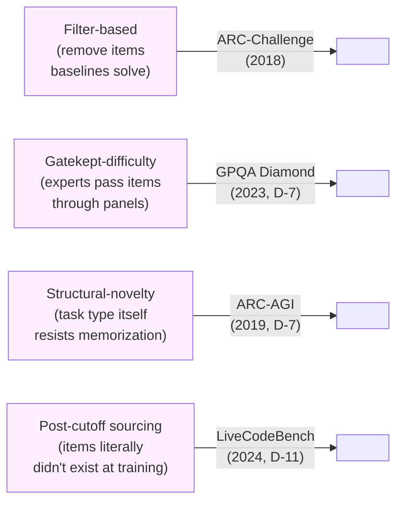

# Day 8 — Reasoning evaluation: when knowing isn't enough

## TL;DR

A reasoning benchmark is not defined by what its items *look like* (4-way MC, like MMLU and HellaSwag) but by what shallow strategies the dataset has been built to *defeat*. Today's anchor — **ARC-Challenge** (Clark et al. 2018), the AI2 Reasoning Challenge — is the canonical *filter benchmark*: 1,172 grade-school science items selected because **both** an IR baseline and a word-co-occurrence baseline fail them, leaving a slice that cannot be solved by lexical pattern-matching against a corpus. ARC-Challenge has been near-saturated since 2024 and now sits in the 95% range, but the construction move it makes — defining "reasoning required" as "shallow baselines fail" — is the methodology lesson that opens Week 2.

## Learning objectives

By the end of this lesson, you will be able to:

1. **(L2)** State ARC-Challenge's construction (1,172-item test split filtered from a 7,787-item parent corpus by a two-baseline rule) and the canonical 25-shot `lm-evaluation-harness` pipeline that runs it.
2. **(L3)** *Apply* the binomial-CI estimate from [D-5](/lesson/5) to an ARC-Challenge headline near 0.95 and decide whether a one-point gap between two frontier models is single-run distinguishable.
3. **(L4)** *Analyze* the difference between MMLU-style knowledge evaluation and ARC-Challenge-style reasoning evaluation, decomposing the discriminator into "what does scoring above chance require?" rather than format.
4. **(L4)** *Analyze* a model's MMLU-vs-ARC score gap to diagnose whether its weaker axis is *retrieval* (knowing facts) or *composition* (chaining inferences over them).
5. **(L5)** *Evaluate* the claim "a high ARC-Challenge score demonstrates genuine reasoning capability" against the filter's calibration to 2018-era baselines, surfacing the load-bearing methodological assumption.
6. **(L4)** Place ARC-Challenge on the spectrum of construction methodologies — filter / gatekept / structural-novelty / post-cutoff — and predict each strategy's saturation clock relative to the others.

## Prerequisites & callback

Today's lesson assumes two pieces of prior machinery. From **[D-4](/lesson/4)**, the framing of the prompting strategy as a fourth axis, with chain-of-thought vs. direct prompting producing 10–30-point swings on multi-step-reasoning benchmarks; ARC-Challenge sits at the *small-CoT-gap* end of that axis, which is itself diagnostic of what kind of reasoning the benchmark exercises. From **[D-1](/lesson/1)**, the framing that an evaluation is a *(dataset, scoring rule, reporting convention) pipeline* — ARC-Challenge's whole methodology lives inside that pipeline's *dataset* stage, in the form of the construction filter that selects which items survive into the test split. The Day-8 move is to introduce reasoning evaluation as a distinct *capability axis* from knowledge evaluation, opening Week 2's seven-day capability tour.

## The opening hook

Week 1 was about *how to read a number*. The pipeline ([D-1](/lesson/1)), MC scoring mechanics ([D-2](/lesson/2)), free-form scoring ([D-3](/lesson/3)), prompting ([D-4](/lesson/4)), statistical hygiene ([D-5](/lesson/5)), contamination ([D-6](/lesson/6)), and saturation ([D-7](/lesson/7)) gave you the toolkit to look at any benchmark report and ask the right four questions: what pipeline produced it, is it statistically real, was the test in the training data, and is the benchmark anywhere near its ceiling.

Week 2 turns the question around. Instead of asking *how do you measure a model*, you start asking *what does the model do*. The seven capability suites of this week — reasoning (today), math ([D-9](/lesson/9)), retrieval ([D-10](/lesson/10)), code ([D-11](/lesson/11)), software engineering ([D-12](/lesson/12)), multimodal ([D-13](/lesson/13)), long context ([D-14](/lesson/14)) — are each a different answer to that question.

Today's anchor is the oldest and methodologically simplest: **ARC-Challenge** (Clark et al. 2018), the AI2 Reasoning Challenge. ARC's questions look almost trivial — fourth-grade science exams. The methodological move is what makes it interesting: ARC was the first widely adopted benchmark to *separate* knowledge-lookup from reasoning **by construction**. The Easy/Challenge split is engineered specifically so that the Challenge subset cannot be solved by pattern-matching against a corpus. That construction is the lesson.

## Knowledge eval vs. reasoning eval

Both MMLU ([D-1](/lesson/1)) and HellaSwag ([D-2](/lesson/2)) are 4-way multiple choice. So is ARC-Challenge. **Format does not tell you what kind of capability is being measured.** The discriminator is what the model needs to do *to score above chance*.

| Benchmark | Format | Capability tested | Failure mode it catches |
| --- | --- | --- | --- |
| MMLU | 4-way MC | breadth of factual knowledge | model doesn't *know* the fact |
| HellaSwag | 4-way MC | commonsense plausibility ranking | model doesn't have grounded common sense |
| ARC-Challenge | 4-way MC | multi-step deductive reasoning over known facts | model knows the facts but can't compose them |

The MMLU failure mode is "doesn't know A". The ARC-Challenge failure mode is "knows A and B and the rule that connects them, but doesn't *apply* the rule." The shift is from *retrieval* to *composition*. This matters for what the score tells you about the model: an MMLU score of 90 says the model has read a lot; an ARC-Challenge score of 90 says the model has read a lot *and* can chain inferences over what it has read. The two scores can come apart, and historically they did — early bag-of-words IR systems did fine on knowledge MC but collapsed on items that required two-step inference, which is exactly the gap ARC was built to expose.

## Anchor: ARC-Challenge (Clark et al. 2018)

**Citation.** Clark, P., Cowhey, I., Etzioni, O., Khot, T., Sabharwal, A., Schoenick, C., & Tafjord, O. (2018). *Think you have Solved Question Answering? Try ARC, the AI2 Reasoning Challenge.* arXiv:1803.05457.

ARC ships **7,787 multiple-choice questions** drawn from natural grade-school science exams (questions written by humans for human test-takers, not synthesized). Most items are 4-way MC, and a small minority are 3- or 5-way; harness implementations handle the variable choice count rather than discarding the off-format items. The dataset is partitioned into two non-overlapping subsets:

- **ARC-Easy: 5,197 questions** (2,251 train / 570 dev / 2,376 test).
- **ARC-Challenge: 2,590 questions** (1,119 train / 299 dev / 1,172 test).

When papers say "ARC" without qualification they almost always mean **ARC-Challenge test** — the 1,172-item slice that frontier-model reports cite. ARC also ships an **ARC Corpus** of ~14M science-related sentences, intended as a retrieval source for IR-style baselines; modern LM evaluations ignore the corpus and run the questions closed-book.

### The split criterion is the methodology

The Easy/Challenge partition is not difficulty-rated by humans. It is defined operationally by two baselines:

1. An **information-retrieval (IR) baseline** that scores each candidate answer by how well it matches a top retrieval hit from the ARC Corpus.
2. A **word co-occurrence baseline** (PMI-style) that scores each candidate by how often its content words co-occur with the question's content words in a large background corpus.

A question lands in **ARC-Challenge if and only if both baselines answer it incorrectly**. If either one solves it, it goes to Easy. (The original prompt for this lesson had the criterion inverted; the paper's actual rule is "incorrect on both baselines" — a stronger filter than "incorrect on either", because it requires that *neither* shallow strategy works.)

This is a tighter operationalization of "reasoning required" than it looks. Both baselines are *surface-feature* solvers: IR finds a sentence that looks like the answer; co-occurrence finds words that travel with the question's words. The intersection of "IR fails" and "co-occurrence fails" is the slice where you cannot win by *finding similar text*. Whatever the model is doing on the Challenge set, it is not lexical pattern-matching against a known corpus. By construction.

The Challenge set is, in effect, a **negative-filter benchmark**: items aren't selected because they are reasoning-heavy, they are selected because they survive a filter that removes items the shallow baselines can solve. That's a different design discipline from "ask experts to write hard questions" (GPQA, [D-7](/lesson/7)) or "construct novel task types" (ARC-AGI, [D-7](/lesson/7)'s contrast). Filter-based difficulty is cheaper to build but yields a benchmark whose difficulty is bounded by the strength of the filter — better baselines would yield a smaller, harder Challenge set. This is worth holding onto: ARC-Challenge difficulty is calibrated to *2018-era* IR and co-occurrence systems.

### Example item

A canonical ARC-Challenge item from the public AI2 release (Clark et al. 2018, mirrored on Hugging Face as `allenai/ai2_arc`):

```
George wants to warm his hands quickly by rubbing them. Which skin
surface will produce the most heat?

(A) dry palms
(B) wet palms
(C) palms covered with oil
(D) palms covered with lotion

Answer: A
```

A retrieval baseline searching the ARC Corpus on the keywords *hands, heat, rubbing* will surface sentences that mention all four surface treatments — dry skin, wet skin, oils, and lotions all appear in physics-of-friction text alongside *heat*. The retrieved sentences score similarly against all four options. A co-occurrence baseline does no better: the content words in each option co-occur with *heat* in everyday text at comparable rates. **The shallow baselines cannot tell which surface produces the most friction *for this scenario*.** Picking (A) requires recognizing that wet / oily / lotioned palms reduce friction and that friction is the heat-producing mechanism here. That is two-step reasoning over known facts — the failure mode the Challenge filter is designed to surface.

### Why retrieval fails on Challenge items

The spoon-in-soup pattern generalizes. A representative ARC-Challenge item along the same lines:

> Why does a metal spoon left in a hot bowl of soup eventually feel hot at the handle, even though only the bowl end is in the soup?
>
> (A) The handle radiates heat from the surrounding air.
> (B) Kinetic energy is transferred from the soup molecules to the spoon's metal atoms, which transfer it along the spoon by conduction.
> (C) Convection currents carry heat through the spoon.
> (D) The spoon emits infrared light from its hot end to its cold end.

The options here all contain real physics terms. The shallow baselines retrieve correct definitions of conduction, convection, and radiation but cannot disambiguate which mechanism applies to *this* scenario. Picking (B) requires recognizing that solids are involved (rules out convection), that no light source is implied (rules out radiation), and that direct contact is the transfer mode (selects conduction). Two-step reasoning over known facts is what the Challenge filter selects for.

## ⏵ Check yourself — applying the filter

You inspect a candidate ARC item and find that the **IR baseline answers it correctly** but the **word-co-occurrence baseline answers it incorrectly**. Which subset does the item land in under the Clark et al. (2018) construction rule, and what does that placement tell you about the kind of "shallow solvability" the rule is willing to tolerate?

<details>
<summary>Show answer</summary>

The item lands in **ARC-Easy**. The Challenge filter requires *both* baselines to fail; if *either* one solves the item, it is excluded from Challenge. So an item solvable by IR alone — even one that defeats co-occurrence — is treated as "shallow-solvable" and routed to Easy. The placement tells you the rule's tolerance is asymmetric in a specific way: the rule does not require that an item resist *every conceivable* shallow strategy, only that it resist these two. An item solvable by some other shallow strategy (say, a length heuristic, or a word-frequency baseline the authors didn't run) could still land in Challenge. The filter's strength is bounded by the basket of baselines that defines it — a recurring point about filter benchmarks.

</details>

## Mechanics: how `lm-evaluation-harness` runs ARC-Challenge

The canonical run on EleutherAI's harness:

```bash
lm_eval \
  --model hf \
  --model_args pretrained=meta-llama/Llama-3.1-8B \
  --tasks arc_challenge \
  --num_fewshot 25 \
  --batch_size 8
```

The harness's `arc_challenge` task config inherits from `arc_easy.yaml`. The relevant settings:

- `output_type: multiple_choice` — log-likelihood scoring over the option strings, not generative letter extraction.
- `doc_to_text: "Question: {{question}}\nAnswer:"` — the prompt template.
- `doc_to_target: "{{choices.label.index(answerKey)}}"` — gold is the index of the correct option.
- `metric_list`: `acc` and `acc_norm`.
- `should_decontaminate: true` — the harness flags potential train-test contamination if you pass the appropriate train corpus.

The 25-shot convention comes from the Open LLM Leaderboard v1, not from the harness defaults — the YAML itself doesn't pin `num_fewshot`. Different reports use 0-shot, 5-shot, or 25-shot, which is a [D-1](/lesson/1)-style pipeline difference: same model, same dataset, different number on the scoreboard. When you read an ARC-Challenge score, check the n-shot before comparing it to anything else.

**`acc` vs. `acc_norm` on ARC-Challenge.** From [D-1](/lesson/1): `acc` is the argmax over each option's summed log-likelihood; `acc_norm` divides by byte length first to remove the length bias toward shorter options. ARC-Challenge options are typically full sentences with significantly varying length (compare option B above to options A, C, D). `acc_norm` is the metric the Open LLM Leaderboard reports for ARC-Challenge, and it is the one to quote unless you have a specific reason not to — the option-length distribution makes the unnormalized number meaningfully biased.

## ⏵ Check yourself — diagnosing the MMLU-vs-ARC gap

Two models are reported on the same model card. Model X scores **89 on MMLU** and **78 on ARC-Challenge**. Model Y scores **78 on MMLU** and **89 on ARC-Challenge**. Holding the pipelines fixed, what does the MMLU-vs-ARC gap on each model tell you about *which capability axis* is the load-bearing weakness — retrieval or composition — and which model would you bet on for an agentic planning task?

<details>
<summary>Show answer</summary>

The two models have inverted profiles on the *retrieval* axis (MMLU) versus the *composition* axis (ARC-Challenge). Model X is the more typical pattern: deeper world knowledge (MMLU = 89), weaker at chaining inferences over it (ARC-Challenge = 78) — its bottleneck is composition. Model Y is the unusual profile: it composes more reliably (ARC-Challenge = 89) than it knows (MMLU = 78) — its bottleneck is retrieval. For an agentic planning task, the composition axis is the load-bearing one, because planning *is* multi-step inference over partial information. Model Y is the better bet for that downstream use, even with the lower headline knowledge score. The general lesson: a *single* benchmark number can't surface this — the diagnosis comes from the **gap between two numbers** on the same model. This is the same pattern [D-1](/lesson/1) named for macro-vs-micro, applied here across capability axes rather than within a single benchmark.

</details>

## Saturation: where ARC-Challenge stands in 2026

ARC-Challenge is a 2018 benchmark. The trajectory since then is the textbook saturation curve from [D-7](/lesson/7):

- **2018 (release).** The strongest baselines in the original paper were below 30% — barely above the 25% random floor.
- **2019–2021.** BERT-era and early GPT-3 models pushed into the 50–70% range.
- **2023–2024.** Frontier models cleared 90% on standard 25-shot evaluations.
- **As of May 2026.** Public leaderboards report top frontier models in the **95–96%** range, with the upper tail tightly clustered. The benchmark's average across the cohort of frontier-class models tracked on public leaderboards is reported in the low-90s.

By the [D-7](/lesson/7) SNR argument, this is squarely in the saturation regime. With $n = 1{,}172$ test items and $p \approx 0.95$, the per-model 95% CI is roughly $\sqrt{0.95 \cdot 0.05 / 1172} \approx 0.0064$, so $\pm 1.3$ percentage points. The headroom is about $5$ points. Two frontier models scoring 94.8 and 96.0 on ARC-Challenge are statistically distinguishable on a single run — barely — but the gap carries almost no information about reasoning capability differences. ARC-Challenge has gone from "reasoning-required filter" to "frontier-model rounding error" in eight years.

This is the [D-7](/lesson/7) lesson made concrete. ARC's filter-based construction was a real methodological advance in 2018 — it ruled out shallow IR and shallow co-occurrence as solvers. But the filter was calibrated to 2018-era baselines, and modern LMs are not just better IR systems; they have internalized far more world knowledge and can chain inference over it. The benchmark is *clean* — no contamination story like MMLU's, no leaderboard-retirement story like the Open LLM Leaderboard's — but it has aged out of usefulness for ranking frontier models. It still serves as a **floor check**: any modern model that can't clear 90% on ARC-Challenge has a basic-reasoning problem worth investigating.

## ⏵ Check yourself — floor-check vs. ranking signal

In May 2026, you receive two evaluation reports. Report A says "Model M scores 88.2 on ARC-Challenge (25-shot, `acc_norm`)." Report B says "Model N scores 95.4 on ARC-Challenge (25-shot, `acc_norm`)." Both reports cite the same harness config. **Compute** what the right reading of each headline is for a frontier-capability claim, and identify which of the two numbers carries more diagnostic value.

<details>
<summary>Show answer</summary>

The diagnostic value flips between the two reports. **Model M at 88.2 is informative as a floor-check failure**: by mid-2026 the frontier cohort is clustered in the 95–96% range, so a sub-90 score on a model claimed to be frontier-class is a red flag that something is wrong — either the model is not actually frontier-class, the pipeline has a bug, or there's a mismatch between the model's training and what the harness expects (e.g., a chat model being run with a base-model prompt template). The number itself is the signal, and it warrants investigation. **Model N at 95.4 is essentially uninformative for ranking**: it lands inside the cluster, the per-run binomial CI is roughly $\pm 1.3$ pp, and the headroom is only ~5 points. Whether N is "the best" frontier model on ARC-Challenge cannot be read off this number; ranking-quality decisions need a benchmark with more headroom ([D-7](/lesson/7)'s GPQA, ARC-AGI, or a post-cutoff suite from [D-11](/lesson/11)). The general lesson: a saturated benchmark's *low* outliers carry more information than its *high* ones.

</details>

## Filter benchmarks vs. construction benchmarks

ARC-Challenge sits at one end of a methodological spectrum that recurs through Week 2 and Week 4. The four design strategies are different answers to the same underlying question — **how do you make a benchmark resist being solved by surface-feature pattern-matching?**



Each strategy has a different saturation clock. **Filter-based** is the cheapest to build and the fastest to saturate: a stronger filter would yield a harder benchmark, but the filter has to actually exist in the form of running baselines, and once those baselines are obsolete the filter no longer pins difficulty. **Gatekept-difficulty** buys more headroom but depends on a panel and is gameable as benchmark-shaped problems leak into training. **Structural-novelty** has the longest clock but is hardest to construct — the task type itself has to resist being memorized, which limits the design space. **Post-cutoff sourcing** is the cleanest contamination story but tells you nothing about whether the items are *hard*, only that they're *unseen*; difficulty has to come from somewhere else.

The point of holding these four against each other is that **"reasoning eval" is not a single design problem**. ARC-Challenge's 2018 construction was the right move for 2018; it would not be the right move today. [D-11](/lesson/11) (LiveCodeBench) and [D-7](/lesson/7) (GPQA, ARC-AGI) make the same argument from different angles — same goal, different design discipline, different clock.

> **Safety researcher's note.** Reasoning evals like ARC-Challenge are not safety evals, but the *gap* between knowledge-MC scores and reasoning-MC scores on the same model is a useful capability signal. A model that scores 88 on MMLU and 95 on ARC-Challenge is, oddly, better at *applying* what it knows than at *knowing* it — an unusual profile that is worth flagging. The more common direction (high MMLU, lower ARC-Challenge) is the historical pattern: models accumulate facts faster than they accumulate inference machinery. From a safety standpoint, the inference-machinery axis is the one that matters more for downstream agentic capability, because chaining inferences is what an autonomous system has to do to plan. Week 3 returns to this when we look at SAD ([D-17](/lesson/17)) and dangerous-capability evaluation ([D-21](/lesson/21), WMDP), both of which require multi-step inference over partial information rather than retrieval over a closed-book corpus. ARC-Challenge is no longer a frontier capability eval, but the *shape* of capability it measures — composition over knowledge — is the shape that matters most for the safety questions Week 3 asks.

## Cross-references

**Backward.**

- [D-1](/lesson/1) — picks up the *(dataset, scoring rule, reporting convention) pipeline* framing; ARC-Challenge's whole methodology lives in the *dataset* stage as the construction filter.
- [D-2](/lesson/2) — picks up the `acc` vs. `acc_norm` length-bias mechanic; ARC-Challenge options vary substantially in length, so `acc_norm` is the metric to quote.
- [D-4](/lesson/4) — picks up the chain-of-thought-vs-direct gap framing; ARC-Challenge's *small* CoT gap (in contrast to [D-9](/lesson/9)'s large gap) is itself diagnostic of single-pass vs. multi-step reasoning shape.
- [D-5](/lesson/5) — picks up the binomial-CI estimate; with $n = 1{,}172$ and $p \approx 0.95$ the per-run CI is $\pm 1.3$ pp, which is what makes frontier-model ranking on ARC-Challenge near-noise.
- [D-7](/lesson/7) — picks up the saturation argument; ARC-Challenge is the textbook example of a clean, contamination-free benchmark that has saturated anyway because its filter was calibrated to its era's baselines.

**Forward.**

- [D-9](/lesson/9) — picks up the *chain-of-thought gap* on grade-school arithmetic (GSM8K), where switching from direct to CoT prompting can swing accuracy by 30+ points on the same model — a much larger gap than ARC-Challenge shows, and the contrast is itself a finding about each benchmark's reasoning shape.
- [D-11](/lesson/11) — picks up *post-cutoff sourcing* (LiveCodeBench) as the modern alternative to filter-based construction when you want a contamination-resistant difficulty signal.
- [D-17](/lesson/17) — picks up *multi-step inference over partial information* (SAD), where the composition-over-retrieval axis ARC-Challenge measures becomes the load-bearing capability for a safety eval.
- [D-25](/lesson/25) — picks up *reasoning models* (o1, o3, R1) where inference-time scaling makes the CoT-vs-direct distinction structural rather than prompt-side, and the entire reasoning-eval contract has to change.

## Takeaways

1. ARC-Challenge (Clark et al. 2018) is 2,590 grade-school science MC questions filtered from a 7,787-item parent set; the test split is 1,172 items. *(LO 1)*
2. The Challenge set is defined as questions answered incorrectly by **both** an IR baseline and a word co-occurrence baseline — a filter-based "reasoning-required" criterion, calibrated to 2018-era shallow solvers. *(LO 1)*
3. Knowledge eval (MMLU) tests *what the model knows*; reasoning eval (ARC-Challenge) tests *what the model can compose from what it knows*. Same MC format, different capability axis. *(LO 3)*
4. A model's MMLU-vs-ARC score gap diagnoses which axis is its load-bearing weakness — high MMLU + lower ARC means *composition* is the bottleneck; the inverse profile means *retrieval* is. *(LO 4)*
5. `lm-evaluation-harness` runs ARC-Challenge as multiple-choice log-likelihood with `acc` and `acc_norm`; the 25-shot convention comes from the Open LLM Leaderboard, not the YAML default. `acc_norm` is the right metric for ARC because option lengths vary substantially. *(LO 1)*
6. ARC-Challenge has been saturating since 2024 and frontier models cleared 95% by 2026. With ~5 points of headroom on a 1,172-item test, the binomial CI is roughly $\pm 1.3$ pp — ranking frontier models on it is mostly noise ([D-7](/lesson/7)'s SNR argument). It still works as a floor check: a sub-90 score on a frontier model is a red flag. *(LO 2, LO 5)*
7. Filter-based difficulty (ARC), gatekept difficulty (GPQA), structural novelty (ARC-AGI), and post-cutoff sourcing (LiveCodeBench) are four distinct methodologies for resisting surface-feature solvers. Each has a different saturation clock, and the right choice is era-specific. *(LO 6)*

## Glossary

- **filter benchmark**: a benchmark whose difficulty is operationalized by *removing* items that named shallow baselines can solve, leaving the residual as the test set. Difficulty is bounded by the strength of the filter [introduced D-8](/lesson/8).
- **construction benchmark**: a benchmark whose difficulty comes from *building* items that resist memorization or retrieval — by structural novelty, expert gatekeeping, or post-cutoff sourcing — rather than by filtering. Contrast with filter benchmark [introduced D-8](/lesson/8).
- **ARC-Challenge filter**: the operational rule defining ARC's hard split — an item is in Challenge iff *both* the IR baseline and the word-co-occurrence baseline answer it incorrectly [introduced D-8](/lesson/8).
- **multi-step reasoning**: capability shape where the answer requires chaining two or more inference steps over known facts; distinct from single-step retrieval or one-shot pattern recognition [introduced D-8](/lesson/8).
- **capability axis**: a distinct dimension of model capability — retrieval (knowing facts), composition (chaining inferences), instruction-following, calibration, etc. — along which scores can move independently [introduced D-8](/lesson/8).
- **acc_norm**: lm-evaluation-harness metric that divides each MC option's summed log-likelihood by byte length before argmax, removing length bias toward shorter options [introduced D-1 · reused](/lesson/1).
- **chain-of-thought gap**: the per-benchmark difference between CoT-prompted and direct-prompted scores on the same model; the gap's size is diagnostic of the benchmark's reasoning shape [introduced D-4 · reused](/lesson/4).
- **saturation**: the regime where a benchmark's frontier-model scores cluster near the ceiling and the per-run CI exceeds the inter-model gap, so the benchmark stops carrying ranking signal [introduced D-7 · reused](/lesson/7).

## References

- **Anchor.** Clark, P., Cowhey, I., Etzioni, O., Khot, T., Sabharwal, A., Schoenick, C., & Tafjord, O. (2018). *Think you have Solved Question Answering? Try ARC, the AI2 Reasoning Challenge.* arXiv:1803.05457. https://arxiv.org/abs/1803.05457
- **Harness.** EleutherAI. *lm-evaluation-harness — `arc_challenge` task.* https://github.com/EleutherAI/lm-evaluation-harness/blob/main/lm_eval/tasks/arc/arc_challenge.yaml
- **Secondary.** Allen Institute for AI. *AI2 Reasoning Challenge (ARC) 2018 Dataset card.* https://huggingface.co/datasets/allenai/ai2_arc
- **Secondary.** Hugging Face. *Open LLM Leaderboard archive (25-shot ARC convention).* https://huggingface.co/docs/leaderboards/en/open_llm_leaderboard/archive
- **Secondary.** Bhakthavatsalam, S., Khashabi, D., Khot, T., Mishra, B. D., Richardson, K., Sabharwal, A., Schoenick, C., Tafjord, O., & Clark, P. (2021). *Think you have Solved Direct-Answer Question Answering? Try ARC-DA, the Direct-Answer AI2 Reasoning Challenge.* arXiv:2102.03315. https://arxiv.org/abs/2102.03315 (Pointer: ARC-DA reframes ARC as free-form QA, removing the MC scaffold; not used as today's anchor but referenced for context.)

## Quiz

**Q1.** Which is the operational definition of "ARC-Challenge" — i.e., what filter selects an item into the Challenge subset rather than the Easy subset?

- A. A panel of grade-school science teachers rates the question "hard" on the AI2 four-level difficulty rubric.
- B. Both an IR baseline and a word co-occurrence baseline answer it incorrectly.
- C. The question requires at least one numerical computation step combined with a unit conversion.
- D. Domain-expert PhDs validate the question and a Google-with-internet pilot consistently fails to solve it.

**Q2.** A model scores 89 on MMLU and 78 on ARC-Challenge. A second model scores 78 on MMLU and 89 on ARC-Challenge. What does the gap tell you, holding all else equal?

- A. The first model has more world knowledge but composes inferences less reliably; the second has the inverse profile.
- B. The first model is better-calibrated on multiple-choice log-likelihood scoring; the second has higher Brier loss.
- C. The first model is contaminated on the ARC-Challenge train split; the second was filtered with a clean-decontamination protocol.
- D. Both models are equivalent because the average across both benchmarks is identical, and averaging is the standard frontier-model summary.

**Q3.** You evaluate Llama-3.1-8B on ARC-Challenge with `lm-evaluation-harness` and see `acc = 0.543` and `acc_norm = 0.577`. Which is the right metric to report for an Open LLM Leaderboard-style comparison?

- A. `acc`, because raw accuracy is the only meaningful metric on multiple-choice tasks under log-likelihood scoring.
- B. Neither — the harness should be run with `output_type: generate_until` and answer-letter regex extraction instead.
- C. The mean of `acc` and `acc_norm`, because either metric alone is statistically unstable on small test sets.
- D. `acc_norm`, because ARC option lengths vary and length-normalization removes that bias.

**Q4.** ARC-Challenge has 1,172 test items. A frontier model scores 0.951. **Compute** the approximate 95% CI on its score under a binomial model, and identify what the result implies about ranking it against a model scoring 0.962:

- A. CI is roughly $\pm 1.3$ pp; the $\sim 1.1$ pp gap is borderline on a single run and a paired test on shared items is needed.
- B. CI is roughly $\pm 0.05$ (i.e. $\pm 5$ pp); the gap is small relative to the CI and is clearly noise.
- C. CI is roughly $\pm 0.005$ ($\pm 0.5$ pp); the 1.1-pp gap is more than two CI widths and is highly significant.
- D. The binomial confidence interval is undefined for length-normalized accuracy because the score is no longer a proportion of binary trials.

**Q5.** A reviewer claims that "ARC-Challenge tests reasoning, while MMLU tests knowledge — so a high ARC score guarantees genuine reasoning capability." What is the **most defensible reading** of why this claim overstates the evidence?

- A. ARC's filter only rules out 2018-era IR and co-occurrence baselines, so a high score shows absence of shallow-baseline solvability, not presence of reasoning.
- B. MMLU also requires multi-step inference on its harder subdomains, so the knowledge-versus-reasoning dichotomy is wrong by definition and ARC adds nothing.
- C. ARC-Challenge can only be scored via free-form generation with regex letter extraction rather than log-likelihood, so accuracy numbers are not directly interpretable across harnesses.
- D. The Easy/Challenge split is randomized at dataset construction, so the distinction is meaningless and any score gap is just sampling variance across splits.

**Q6.** ARC-Challenge has a small chain-of-thought gap (CoT vs. direct prompting changes the score by only a few points), while GSM8K ([D-9](/lesson/9) anchor) has a large CoT gap. **Contrast** the two benchmarks: what does this gap difference tell you about the *kind* of reasoning each one exercises?

- A. ARC-Challenge cannot be evaluated under chain-of-thought prompting because its multiple-choice scoring frame leaves no place for reasoning traces; GSM8K can.
- B. ARC items are mostly one- or two-step inferences in a single forward pass; GSM8K items are multi-step arithmetic where externalized state helps.
- C. CoT gap sizes are determined by the harness's decoding parameters and few-shot count, not by anything intrinsic to the benchmark or its reasoning shape.
- D. GSM8K is contaminated by web-scale text whereas ARC-Challenge is not, and the gap is purely the contamination differential being amplified by chain-of-thought decoding.

<details>
<summary>Answers</summary>

1. **B** — the Challenge filter is "incorrect on *both* the IR and co-occurrence baselines." (A) is gatekept-difficulty (GPQA-style); (D) is also GPQA. The intersection of the two baselines failing is the actual operational rule.
2. **A** — MMLU's failure mode is "doesn't know"; ARC-Challenge's is "knows but doesn't compose." The two scores can come apart, and the direction tells you which capability axis is weaker.
3. **D** — `acc_norm` is the leaderboard convention for ARC, and the option-length variance on ARC items makes the unnormalized `acc` length-biased. (B) confuses the harness's `output_type` settings.
4. **A** — $\sqrt{0.95 \cdot 0.05 / 1172} \approx 0.00637$, so $\pm 1.96 \times 0.00637 \approx \pm 0.0125$ (≈ $\pm 1.3$ pp). The 1.1-pp gap between 0.951 and 0.962 is at the edge of single-run distinguishability; paired McNemar ([D-5](/lesson/5)) on the same items is the right test.
5. **A** — the filter rules out *2018-era* shallow solvers. A modern LM that beats those baselines need not be doing what the filter was designed to require. This is the [D-7](/lesson/7) saturation argument applied to construction methodology rather than headroom.
6. **B** — the CoT gap's *size* reflects the benchmark's reasoning shape: short single-pass items (ARC) gain little from externalized scratchwork; multi-step arithmetic (GSM8K) gains a lot. [D-9](/lesson/9) develops this directly.

</details>
