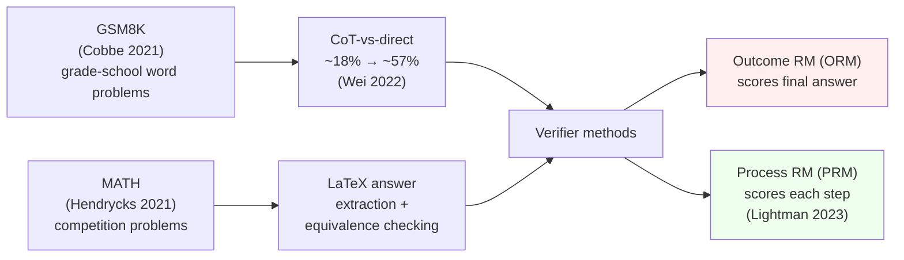
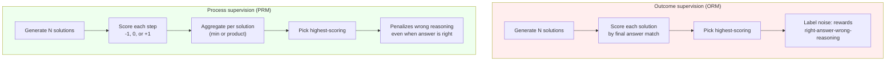

# Day 9 — Mathematical reasoning: GSM8K, MATH, and process supervision

## TL;DR

Math is where the field cleanly demonstrated that *how you prompt* (chain-of-thought) and *how you score* (final-answer match vs. step-level supervision) are first-class evaluation choices, not implementation details. Today's anchors — GSM8K (Cobbe et al. 2021), MATH (Hendrycks et al. 2021), and PRM800K (Lightman et al. 2023) — together encode three of the most-cited methodological moves in modern LLM evaluation: the CoT-vs-direct gap, LaTeX answer extraction with symbolic equivalence, and the right-answer-wrong-reasoning failure mode that motivates process supervision.

## Learning objectives

By the end of this lesson, you will be able to:

1. **(L2)** State the canonical CoT-vs-direct numbers on GSM8K (PaLM 540B, ~18% direct → ~57% CoT → ~74% with self-consistency) and explain why arithmetic chains are the cleanest CoT testbed.
2. **(L2)** Describe MATH's `\boxed{...}` answer-extraction pipeline, the role of LaTeX normalization plus symbolic equivalence, and the MATH-500 subset convention.
3. **(L3)** *Apply* the standard $\min_t r_t$ PRM aggregation rule to a step-score vector and predict whether ORM and PRM rank the same solution differently.
4. **(L4)** *Analyze* why GSM8K above ~95% has lost most of its useful ranking signal, decomposing the argument into the per-item 95% CI and the label-noise floor.
5. **(L5)** *Evaluate* the empirical claim that PRM-based selection beats ORM at best-of-$N$ on MATH and identify what the comparison hides about training-time vs. inference-time signal.
6. **(L4)** Frame the right-answer-wrong-reasoning failure mode as the structural reason process supervision outperforms outcome supervision on hard problems.

## Prerequisites & callback

Three earlier lessons are load-bearing today. **[D-2](/lesson/2)** introduced log-likelihood scoring and the difference between `acc` and `acc_norm`; today's PRM aggregation $\min_t r_t$ is built on the same per-token scoring intuition pushed to the step level. **[D-4](/lesson/4)** introduced chain-of-thought as a prompting strategy; this lesson is the empirical anchor — GSM8K is *why* [D-4](/lesson/4) mattered. **[D-8](/lesson/8)** introduced reasoning-evaluation framing (process vs. outcome, faithfulness vs. correctness); today's ORM-vs-PRM contrast is the most-studied operationalization of that distinction. If any of these feel hazy, skim those lessons before going further.

## The opening hook

Math is where the field first saw, cleanly and reproducibly, that *how you prompt* can move a frontier model from below the random-guessing line to near-ceiling on the same benchmark. The 2022 chain-of-thought (CoT) result on GSM8K — PaLM 540B going from ~18% with direct prompting to ~57% with eight CoT exemplars (Wei et al. 2022) — is the canonical demonstration that what looks like a "capability gap" can also be a *prompting gap*. [D-4](/lesson/4) introduced CoT as a prompting strategy; today's lesson is the empirical anchor for why [D-4](/lesson/4) mattered.

But math evaluation is also where the field first hit a wall that pure outcome scoring couldn't get past. A model can reach the right number through wrong reasoning; a model can hallucinate a clean derivation that ends in the wrong number. Outcome supervision rewards the first; process supervision (Lightman et al. 2023, PRM800K) is the field's structural answer. This is a multi-anchor lesson — GSM8K is the primary, MATH and PRM800K live as companions inside the same anchor block — and the densest day in Week 2. Budget your reading attention accordingly.

## The three threads



Three threads, one through-line: the CoT gap is what makes GSM8K's pedagogy work, the answer-extraction problem is what makes MATH's pedagogy work, and the ORM-vs-PRM contrast is what closes the loop on "we have the right answer; do we trust the reasoning?".

## Anchor: GSM8K (Cobbe et al. 2021)

**Citation.** Cobbe, K., Kosaraju, V., Bavarian, M., Chen, M., Jun, H., Kaiser, L., Plappert, M., Tworek, J., Hilton, J., Nakano, R., Hesse, C., & Schulman, J. (2021). *Training Verifiers to Solve Math Word Problems.* OpenAI. arXiv:2110.14168.

GSM8K is **8,500 grade-school math word problems** (7,473 train / 1,319 test), each requiring 2–8 multi-step arithmetic operations with natural-language reasoning. The problems are linguistically diverse, written by human contractors, and shipped with full natural-language solutions ending in a `####` delimiter followed by the final integer answer. It is the primary anchor of this lesson because its scoring rule is so spartan — exact match on a single integer — that the only thing that varies between "direct" and "CoT" is whether the model produces the intermediate arithmetic before the final number.

### Example item — GSM8K

A canonical item:

```
Q: Janet's ducks lay 16 eggs per day. She eats three for breakfast every morning
   and bakes muffins for her friends every day with four. She sells the remainder
   at the farmers' market daily for $2 per fresh duck egg. How much in dollars
   does she make every day at the farmers' market?

A: Janet sells 16 - 3 - 4 = 9 duck eggs a day.
   She makes 9 * 2 = $18 every day at the farmers' market.
   #### 18
```

The scoring rule is **exact match on the integer after `####`** — no LaTeX, no equivalence checking. That simplicity is what makes GSM8K the cleanest CoT demonstration in the literature.

### The CoT-vs-direct gap

Wei et al. (2022) reported the canonical numbers on GSM8K with PaLM 540B, 8-shot:

| Prompting | PaLM 540B accuracy on GSM8K |
| --- | --- |
| Direct (answer only) | ~18% |
| Chain-of-thought (8 exemplars) | ~57% |
| CoT + self-consistency (Wang et al. 2022, maj@40) | ~74% |

That is roughly a **40-point swing** from a prompt change with frozen weights — which is the strongest empirical case in the literature for [D-4](/lesson/4)'s claim that prompt formatting is part of the evaluation pipeline, not a confound to control away. The mechanism is that arithmetic is a *serial* computation: each operation depends on the previous, and a transformer's single forward pass at the answer position cannot carry the working state. Generating the intermediate tokens turns the model's KV cache into scratch paper.

**Self-consistency** (Wang et al. 2022) sharpens this further. Sample $k$ CoT chains at $T > 0$, take the *plurality vote* over their final answers (`maj@k`). Different reasoning paths that arrive at the same number reinforce each other; idiosyncratic errors don't. Reported as a +17.9 percentage-point gain on GSM8K over greedy CoT for PaLM 540B. The cost is $k$× sampling, which [D-25](/lesson/25) returns to as the inference-time-scaling story.

### GSM8K's saturation status (mid-2026)

Frontier models cleared 95% on GSM8K by mid-2024, and many recent system cards (o1, Claude 3.7-class) drop GSM8K reporting entirely in favor of MATH/AIME. Per [D-7](/lesson/7)'s saturation framing, the per-model 95% CI on a 1,319-item benchmark at $p = 0.97$ is roughly $\sqrt{0.97 \cdot 0.03 / 1319} \approx 0.0047$, or $\pm 0.9$ points — and label-noise audits (GSM-Symbolic, GSM8K-Platinum) suggest mislabeling rates exceed frontier-model error rates, so GSM8K above ~95% is mostly measuring the test set's mistakes. The pedagogical value remains; the ranking value is gone.

### Companion: MATH (Hendrycks et al. 2021)

**Citation.** Hendrycks, D., Burns, C., Kadavath, S., Arora, A., Basart, S., Tang, E., Song, D., & Steinhardt, J. (2021). *Measuring Mathematical Problem Solving With the MATH Dataset.* NeurIPS Datasets and Benchmarks. arXiv:2103.03874.

MATH is **12,500 competition-level mathematics problems** (7,500 train / 5,000 test), sourced from AMC 10, AMC 12, AIME, and similar high-school olympiad-style contests. Two structural features distinguish it from GSM8K:

- **5 difficulty levels** (Level 1 = easiest within subject, Level 5 = hardest), per Art of Problem Solving's standard rating scale.
- **7 subjects:** Prealgebra, Algebra, Number Theory, Counting and Probability, Geometry, Intermediate Algebra, Precalculus.

Each problem ships with a full step-by-step LaTeX solution; the final answer is wrapped in `\boxed{...}`. That convention is the methodological focus: where GSM8K can scrape an integer after `####`, MATH requires *symbolic equivalence checking* on arbitrary LaTeX expressions.

#### Example item — MATH

A typical MATH item:

> *Find the sum of all integers $n$ such that $\dfrac{n+6}{n}$ is an integer.*
>
> Solution: $\dfrac{n+6}{n} = 1 + \dfrac{6}{n}$, so we need $n \mid 6$. The divisors of $6$ are $\pm 1, \pm 2, \pm 3, \pm 6$, summing to $0$. The answer is $\boxed{0}$.

Now consider what equivalence-checking has to handle. A model's CoT might end with any of these, all referring to the same answer:

$$
\boxed{\tfrac{1}{2}}, \quad \boxed{\frac{1}{2}}, \quad \boxed{0.5}, \quad \boxed{\frac{2}{4}}, \quad \boxed{\frac{\sqrt{4}}{4}}, \quad \boxed{2^{-1}}
$$

A literal string-match scorer fails on five of these six. The community-standard fix is a two-stage pipeline:

1. **Extraction.** Find the last `\boxed{...}` in the output (or, for non-boxed CoT, the last numerical/symbolic expression). `lm-evaluation-harness`, the Lightman et al. PRM800K grader, and most modern math evaluators all converge on this.
2. **Normalization + symbolic equivalence.** Strip whitespace, normalize fractions (`\frac{1}{2}` ↔ `\dfrac{1}{2}`), normalize negative signs, parse with SymPy, compare with `sympy.simplify(a - b) == 0` or numeric evaluation with tolerance.

Failure modes in the wild:

- **Format-only mismatch.** `\frac{1}{2}` vs. `1/2` — solved by normalization.
- **Algebraically equivalent, syntactically different.** $\sin^2(x) + \cos^2(x)$ vs. $1$ — solved only with symbolic simplification, which can hang on adversarial inputs.
- **Numerically equivalent, symbolically not.** $\sqrt{2}$ vs. $1.414$ — handled with a numeric-tolerance fallback (e.g., `abs(a - b) < 1e-6`).
- **Multi-part answers.** `(2, 3)` vs. `\{2, 3\}` vs. `2, 3` — handled by tuple/set parsers, but evaluator implementations diverge here.

Two papers reporting different MATH numbers for the same model often differ on the equivalence checker, not the model — [D-1](/lesson/1)'s "evaluation is a pipeline" point applied to a nastier scoring rule.

#### MATH's saturation and the MATH-500 split

The original 5,000-item test set is largely used in the **MATH-500** form introduced by Lightman et al. (2023) for PRM800K: 4,500 test problems were moved into training, leaving a 500-item held-out set. Most modern reports cite *MATH-500* even when they say "MATH". As of early 2026, frontier reasoning models score in the **90–96%** range on MATH-500 — the benchmark is approaching saturation but hasn't fully cleared, partly because Level 5 problems still discriminate between models. AIME 2024/2025 is the natural successor at the frontier ([D-25](/lesson/25)).

### Companion: PRM800K / process supervision (Lightman et al. 2023)

**Citation.** Lightman, H., Kosaraju, V., Burda, Y., Edwards, H., Baker, B., Lee, T., Leike, J., Schulman, J., Sutskever, I., & Cobbe, K. (2023). *Let's Verify Step by Step.* OpenAI. arXiv:2305.20050.

The Cobbe et al. 2021 GSM8K paper introduced the verifier idea: train a *separate* model to score candidate solutions, sample $k$ candidates from the generator, and pick the highest-scoring one. The original verifier was trained on **outcomes**: did the final answer match? This is an **outcome-supervised reward model** (ORM).

The Lightman et al. 2023 paper asked: what if we score each *step* instead?

#### Example item — PRM800K

The unit of supervision in PRM800K is one *step-level* label, not one problem. A row from the released `prm800k` JSONL (Lightman et al. 2023; schema simplified):

```json
{
  "problem": "Find the sum of all integers $n$ such that $\\frac{n+6}{n}$ is an integer.",
  "ground_truth_answer": "0",
  "steps": [
    {"text": "We can rewrite $\\frac{n+6}{n} = 1 + \\frac{6}{n}$.",            "rating": 1},
    {"text": "So $\\frac{6}{n}$ must be an integer, meaning $n$ divides 6.",   "rating": 1},
    {"text": "The divisors of 6 are $\\pm 1, \\pm 2, \\pm 3, \\pm 6$.",          "rating": 1},
    {"text": "Summing the positive divisors: $1 + 2 + 3 + 6 = 12$.",          "rating": -1},
    {"text": "So the answer is $\\boxed{12}$.",                                "rating": -1}
  ]
}
```

The last two steps carry `-1` labels even though the *prefix* (steps 1–3) is correct. The annotator's job is to mark the *first* incorrect step and every step downstream of it. A PRM trained on this signal learns to assign low probability to step 4 conditioned on the (correct) prefix — exactly the failure mode an outcome-only verifier cannot see, because outcome-only judges the final `12` against the gold `0` and produces the same "wrong" label whether the error happened in step 1 or step 4.

#### ORM vs. PRM, formally

Let a candidate solution be a sequence of reasoning steps $s_1, s_2, \ldots, s_T$ ending in a final answer $a$.

- **ORM** scores the whole solution with a single number $r_{\text{ORM}}(s_1, \ldots, s_T) \in [0, 1]$, trained on labels $y \in \{0, 1\}$ where $y = 1$ iff $a$ matches gold. The training signal is *one bit per solution*.
- **PRM** scores each step: $r_{\text{PRM}}(s_t \mid s_{<t}) \in [0, 1]$, trained on per-step human labels $y_t \in \{-1, 0, +1\}$. The training signal is *one label per step*.

To rank a candidate solution under PRM, the standard aggregation is the *minimum* (or product) of step scores:

$$
\text{score}(s_1, \ldots, s_T) = \min_{t \in [1, T]} r_{\text{PRM}}(s_t \mid s_{<t})
$$

The intuition: a chain is no stronger than its weakest step. A solution with one egregiously wrong step but a coincidentally correct final answer gets a low PRM score even though ORM would label it correct.

> **Worked example.** A four-step solution to a MATH problem produces step scores $r = [0.91, 0.94, 0.20, 0.88]$ under a PRM, and its final answer matches gold so an ORM trained on outcomes returns $r_{\text{ORM}} = 0.95$.
>
> 1. **PRM aggregation.** $\min_t r_t = \min(0.91, 0.94, 0.20, 0.88) = 0.20$. The PRM also commonly reports the *product* $\prod_t r_t \approx 0.91 \cdot 0.94 \cdot 0.20 \cdot 0.88 \approx 0.151$ — a stricter but more variance-prone alternative.
> 2. **ORM score.** $r_{\text{ORM}} = 0.95$. Outcome supervision sees only the final integer match, so it cannot detect the broken third step.
> 3. **Best-of-N consequence.** Suppose this is candidate solution $A$ and a competing candidate $B$ has step scores $[0.78, 0.79, 0.81, 0.80]$ with final answer that *also* matches gold. Under ORM, $A$ wins ($0.95 > 0.93$, say). Under $\min_t r_t$ PRM aggregation, $B$ wins ($\min B = 0.78 > \min A = 0.20$). The PRM correctly demotes the right-answer-wrong-reasoning solution.
>
> The general lesson: $\min_t$ aggregation is *unforgiving*. One bad step is enough to bury the candidate. That asymmetry is the source of the PRM's selection power on hard problems where guessing-and-checking can luck into a small answer space.

## ⏵ Check yourself — PRM aggregation

A solution to a MATH problem has step scores $[0.88, 0.92, 0.45, 0.91]$ under a PRM. Its final answer matches gold, and an ORM gives it $0.96$. Compute the PRM score under $\min_t r_t$ and identify which model is more likely to demote this solution in best-of-$N$ ranking.

<details>
<summary>Show answer</summary>

$\min(0.88, 0.92, 0.45, 0.91) = 0.45$. The ORM rates the solution highly because the final answer is correct; the PRM detects the weak third step ($0.45$) and produces a much lower aggregate. In best-of-$N$ ranking against a competitor whose step scores are uniformly around $0.7$, the PRM would demote this solution (its min, $0.45$, is below the competitor's min) while the ORM would promote it (its outcome score is higher than the competitor's). This is the canonical right-answer-wrong-reasoning case the Lightman et al. paper highlights — and it's why $\min_t$ aggregation is the defensible default rather than the average or sum.

</details>

#### The PRM800K dataset

PRM800K is **~800,000 step-level human labels** on model-generated MATH solutions. Annotators see the problem, the prior steps, and the next candidate step, and label each step as `+1` (correct progress), `0` (uninformative but not wrong), or `-1` (incorrect). Labeling is iterative: PRMs trained on early labels are used to select solutions worth labeling next, biasing toward the model's hard examples.

#### The empirical claim

Lightman et al. report that on MATH (using the **MATH-500** split — 4,500 of the original test items moved into training, 500 held out), PRM-based selection over $N$ generator samples meaningfully outperforms ORM at every $N$. Reported headline: process-supervised models reach **78%** on the held-out 500 problems with best-of-1860 sampling, vs. lower numbers for outcome supervision. The gap is largest where it matters — the hardest problems — because outcome correctness has the highest false-positive rate (right answer, wrong reasoning) on problems where guessing-and-checking can luck into a small answer space.



#### Why this matters beyond math

PRM-style supervision is a *transparency-rewarding* training signal: it pays the model for legible step-by-step reasoning, not just for getting the answer. That makes it directly relevant to the safety case for chain-of-thought, and it is one of the load-bearing techniques behind the o1-class reasoning models that close Week 4 ([D-25](/lesson/25)). We return to the safety angle below.

## Running these benchmarks

A canonical lm-evaluation-harness run for both datasets:

```bash
lm_eval \
  --model hf \
  --model_args pretrained=meta-llama/Llama-3.1-70B-Instruct \
  --tasks gsm8k,hendrycks_math \
  --num_fewshot 8 \
  --batch_size 4 \
  --apply_chat_template
```

`gsm8k` defaults to 8-shot CoT and exact-match scoring on the post-`####` integer. `hendrycks_math` defaults to 4-shot CoT and uses the harness's bundled equivalence checker on `\boxed{...}` extractions. The 4-shot vs. 8-shot detail is part of the pipeline — and a paper reporting "MATH 4-shot" vs. another's "MATH 0-shot CoT" is comparing different evaluations.

For PRM-style verifier scoring at evaluation time you typically *don't* use lm-eval-harness — you sample $N$ candidates, score each with a separately-loaded PRM (e.g., the OpenAI PRM800K-trained model or one of the open Math-Shepherd / RLHFlow PRMs), and report best-of-$N$ accuracy. This sits at the boundary between "static eval" and "inference-time scaling" ([D-25](/lesson/25)).

## ⏵ Check yourself — equivalence pipeline

A model's MATH output ends with `\boxed{\frac{\sqrt{4}}{4}}`; the gold answer is `\boxed{\tfrac{1}{2}}`. Naive byte-level string matching marks this incorrect. Which stage of the standard two-stage pipeline (extraction, then normalization + symbolic equivalence) would you expect to actually catch this case, and why is the *normalization-only* fallback insufficient on its own?

<details>
<summary>Show answer</summary>

The **extraction** stage succeeds — both outputs have a clean `\boxed{...}` and the extractor pulls the inner LaTeX. The catch happens in the **symbolic-equivalence** stage: the parsed expressions are $\sqrt{4}/4$ and $1/2$, which a normalization pass alone (which only collapses `\frac` ↔ `\dfrac`, `\tfrac` ↔ `\frac`, whitespace, sign placement) would *not* recognize as equal because the strings still differ syntactically. SymPy's `simplify(a - b) == 0` or a numeric-tolerance fallback is needed to evaluate $\sqrt{4} = 2$ and arrive at $1/2$. Two papers' reported MATH numbers for the same model often differ on exactly this stage's robustness, which is [D-1](/lesson/1)'s "evaluation is a pipeline" point applied to a nastier scoring rule.

</details>

## Conceptual contrast: arithmetic chains vs. competition reasoning

GSM8K and MATH look like the same evaluation — math problems scored on final-answer correctness — but they probe different capabilities and have different failure modes.

| Property | GSM8K | MATH |
| --- | --- | --- |
| Source | Hand-written grade-school word problems | Competition problems (AMC/AIME) |
| Items | 8.5K (7,473 / 1,319) | 12.5K (7,500 / 5,000); MATH-500 used in practice |
| Difficulty | 2–8 arithmetic steps | 5 levels, 7 subjects, requires insight not just calculation |
| Answer format | Integer after `####` | `\boxed{...}` with arbitrary LaTeX |
| Scoring | Exact match | LaTeX normalization + symbolic equivalence |
| Failure mode under saturation | Label noise > model error | Equivalence-checker disagreements |
| Frontier SOTA (early 2026) | ~95–99% (saturated) | ~90–96% on MATH-500 |
| What CoT helps with | Carrying multi-step state | State *and* problem-decomposition insight |

The pedagogically clean lesson is that GSM8K isolates the *serial-computation* benefit of CoT (you literally need scratch paper for 8-step arithmetic), while MATH adds the *insight-search* benefit (the model has to find the right transformation, not just execute it). Both are real; they're just different reasons CoT works.

> **Safety researcher's note.** Mathematical CoT looks like the cleanest possible case for chain-of-thought *faithfulness* — the model writes out arithmetic, you can check each step, and a wrong step usually breaks the answer. But Turpin et al. 2023 (*Language Models Don't Always Say What They Think*, referenced on [D-4](/lesson/4)) showed that CoT explanations systematically *omit* the actual causes of model decisions, even on benchmark-style multiple-choice tasks. Math is a partial exception — wrong arithmetic steps usually do break the answer — but PRM-style training is *also* a pressure on transparency: optimize the model to write *legible* reasoning, and the model can learn to produce reasoning that *looks* legible whether or not it reflects the actual computation. The PRM800K result is genuine progress; it is also a place where the measure (legibility-as-judged-by-annotators) is now a target. [D-17](/lesson/17) (situational awareness) and [D-24](/lesson/24) (reward-model evaluation) take this further. The short version: faithful-looking CoT is necessary for safety claims about reasoning, and not yet sufficient.

## Cross-references

**Backward.**

- [D-2](/lesson/2) — log-likelihood scoring and the `acc`/`acc_norm` mechanic generalize directly to per-step scores; PRM aggregation is the same idea pushed to the step level.
- [D-4](/lesson/4) — chain-of-thought as a prompting strategy was introduced abstractly there; today's PaLM 540B 18%→57% gap on GSM8K is its empirical anchor.
- [D-8](/lesson/8) — the process-vs-outcome distinction was framed conceptually for reasoning evaluation; ORM-vs-PRM is its most-studied operationalization.

**Forward.**

- [D-15](/lesson/15) — factuality-and-truthfulness picks up the right-answer-wrong-reasoning pattern in the verbal domain (correct claims supported by fabricated evidence).
- [D-22](/lesson/22) — LLM-as-judge generalizes the verifier-on-step-quality idea beyond math to open-ended generation; the PRM is the canonical structured-domain precedent.
- [D-24](/lesson/24) — reward-model evaluation is where ORM/PRM training quality gets its own benchmark suite; today's lesson supplies the construct.
- [D-25](/lesson/25) — reasoning models internalize chain-of-thought into a long internal trace and report a single answer, with token-budget as a first-class evaluation axis. PRM-style step scoring is one of the training signals that makes that shift possible; AIME 2024/2025 replaces MATH-500 at the frontier.

## Takeaways

1. **GSM8K** (Cobbe et al. 2021, 8.5K grade-school word problems, exact-match on `####` integer) is the cleanest CoT demonstration: PaLM 540B went from ~18% direct to ~57% CoT to ~74% with self-consistency on the same items, frozen weights. *(LO 1)*
2. **MATH** (Hendrycks et al. 2021, 12.5K competition problems, 5 difficulty levels, 7 subjects) is the canonical answer-extraction-and-equivalence benchmark: `\boxed{...}` extraction plus LaTeX/symbolic equivalence is where pipeline disagreements between papers concentrate. Most modern reports use the **MATH-500** subset. *(LO 2)*
3. Under $\min_t r_t$ PRM aggregation, a single broken step buries a solution regardless of final-answer correctness — the structural reason PRMs separate right-reasoning from right-answer in best-of-$N$ ranking. *(LO 3)*
4. GSM8K above ~95% is past its useful ranking ceiling because the per-item 95% CI is roughly $\pm 0.9$ points and label-noise audits (GSM-Symbolic, GSM8K-Platinum) suggest mislabeling rates exceed frontier-model error rates. *(LO 4)*
5. The PRM800K best-of-$N$ result on MATH-500 (~78% with best-of-1860) is genuine and structural, but the comparison hides training-time vs. inference-time signal: the PRM is a separately-trained model and the gain is conditional on $N$ generator samples per item. *(LO 5)*
6. **Outcome supervision (ORM)** scores the final answer; **process supervision (PRM)** scores each step. The right-answer-wrong-reasoning failure mode is the load-bearing reason ORM underperforms PRM at the hard-problem end. *(LO 6)*

## Glossary

- **chain-of-thought (CoT)**: prompting strategy that elicits intermediate reasoning steps before the final answer. Anchored empirically on GSM8K (PaLM 540B 18%→57%) [introduced D-4 · reused](/lesson/4).
- **answer extraction**: the deterministic step that pulls a candidate answer out of free-form model output before scoring. On GSM8K it is the integer after `####`; on MATH it is the contents of the last `\boxed{...}` [introduced D-9](/lesson/9).
- **LaTeX equivalence checking**: the normalization plus symbolic/numeric pipeline that decides whether two LaTeX expressions denote the same mathematical object. The dominant source of evaluator disagreement on MATH [introduced D-9](/lesson/9).
- **outcome reward model (ORM)**: verifier trained on a single binary label per solution (final answer matches gold or not); one bit of training signal per solution [introduced D-9](/lesson/9).
- **process reward model (PRM)**: verifier trained on per-step human labels in $\{-1, 0, +1\}$; one label per step per solution [introduced D-9](/lesson/9).
- **min-step PRM aggregation**: the standard rule $\text{score}(s_1, \ldots, s_T) = \min_t r_{\text{PRM}}(s_t \mid s_{<t})$ for ranking candidate solutions; product is a stricter alternative [introduced D-9](/lesson/9).
- **best-of-$N$ selection**: sample $N$ candidate solutions from a generator, score each with a verifier (ORM or PRM), pick the highest-scoring. The inference-time-scaling axis that connects to [D-25](/lesson/25) [introduced D-9](/lesson/9).
- **MATH-500**: the 500-item held-out subset of the original 5,000-item MATH test set, introduced by Lightman et al. (2023) for PRM800K. Most modern "MATH" reports cite MATH-500 [introduced D-9](/lesson/9).

## References

- **Anchor.** Cobbe, K., Kosaraju, V., Bavarian, M., Chen, M., Jun, H., Kaiser, L., Plappert, M., Tworek, J., Hilton, J., Nakano, R., Hesse, C., & Schulman, J. (2021). *Training Verifiers to Solve Math Word Problems.* arXiv:2110.14168. https://arxiv.org/abs/2110.14168
- **Harness.** Gao, L., et al. *lm-evaluation-harness* (EleutherAI). GSM8K and MATH (`hendrycks_math`) tasks. https://github.com/EleutherAI/lm-evaluation-harness
- **Secondary.** Hendrycks, D., Burns, C., Kadavath, S., Arora, A., Basart, S., Tang, E., Song, D., & Steinhardt, J. (2021). *Measuring Mathematical Problem Solving With the MATH Dataset.* NeurIPS Datasets and Benchmarks. arXiv:2103.03874. https://arxiv.org/abs/2103.03874
- **Secondary.** Lightman, H., Kosaraju, V., Burda, Y., Edwards, H., Baker, B., Lee, T., Leike, J., Schulman, J., Sutskever, I., & Cobbe, K. (2023). *Let's Verify Step by Step.* OpenAI. arXiv:2305.20050. https://arxiv.org/abs/2305.20050
- **Secondary.** Wei, J., Wang, X., Schuurmans, D., Bosma, M., Ichter, B., Xia, F., Chi, E., Le, Q., & Zhou, D. (2022). *Chain-of-Thought Prompting Elicits Reasoning in Large Language Models.* NeurIPS. arXiv:2201.11903. https://arxiv.org/abs/2201.11903
- **Secondary.** Wang, X., Wei, J., Schuurmans, D., Le, Q., Chi, E., Narang, S., Chowdhery, A., & Zhou, D. (2022). *Self-Consistency Improves Chain of Thought Reasoning in Language Models.* ICLR 2023. arXiv:2203.11171. https://arxiv.org/abs/2203.11171
- **Secondary.** Turpin, M., Michael, J., Perez, E., & Bowman, S. R. (2023). *Language Models Don't Always Say What They Think: Unfaithful Explanations in Chain-of-Thought Prompting.* NeurIPS. arXiv:2305.04388. https://arxiv.org/abs/2305.04388
- **Secondary.** Vendrow, J., et al. (2025). *GSM8K-Platinum: Revealing Performance Gaps in Frontier LLMs.* https://gradientscience.org/gsm8k-platinum/
- **Secondary.** OpenAI. *prm800k* GitHub repository. https://github.com/openai/prm800k

## Quiz

**Q1.** Wei et al. (2022) reported that PaLM 540B scores roughly 18% with direct prompting and 57% with 8-shot chain-of-thought on GSM8K. Which of the following best explains *why* CoT produces such a large gap on this specific benchmark?

- A. CoT prompts implicitly switch the model into a different system-message regime whose token distribution is closer to GSM8K's grade-school solution traces, raising the likelihood of the gold answer.
- B. CoT bypasses an instruction-tuning safety layer that suppresses standalone numerical answers under direct prompting, letting the model emit final integers it would otherwise refuse.
- C. CoT exemplars internally raise the decoding temperature for the answer span, which empirically helps on math by widening the search over plausible numerical completions.
- D. Multi-step arithmetic needs intermediate state, and generating CoT tokens uses the KV cache as scratch space that a single forward pass at the answer position cannot carry.

**Q2.** A model produces the answer `\frac{2}{4}` to a MATH problem whose gold answer is `\boxed{\frac{1}{2}}`. A naive string-match scorer marks this incorrect. Which scorer behavior is the *standard* fix used in modern math evaluators?

- A. Apply token-level BLEU between the predicted and gold LaTeX strings and accept any score above an empirically tuned threshold of 0.8.
- B. Re-sample the model under self-consistency at higher temperature until at least one of the $k$ chains exact-matches the gold LaTeX byte-for-byte.
- C. Extract the last `\boxed{...}`, normalize the LaTeX, and compare via symbolic simplification or numeric tolerance.
- D. Route every item to an LLM-as-judge such as GPT-4 with a calibrated equivalence rubric, averaging the verdict across two independent passes.

**Q3.** A solution to a MATH problem has step scores under a process reward model of $[0.95, 0.91, 0.12, 0.94, 0.93]$ and a final answer that *matches* the gold answer. An outcome reward model scores it $0.97$. Under the standard PRM aggregation $\min_t r_t$, what is the PRM score for this solution, and which model is more likely to demote it in best-of-$N$ ranking?

- A. PRM score $= 0.12$; PRM is more likely to demote it.
- B. PRM score $= 0.97$; ORM is more likely to demote it.
- C. PRM score $= 0.93$ (the median); PRM and ORM rank it equally.
- D. PRM score $= 0.97$; PRM is more likely to demote it.

**Q4.** Why is GSM8K above ~95% considered to be at or past its useful ranking ceiling, even though the test set has 1,319 items? Pick the **most defensible** single-line characterization.

- A. The 95% CI at $p \approx 0.97$ on 1,319 items is roughly $\pm 0.9$ points, and label-noise audits suggest mislabeling rates exceed frontier-model error rates.
- B. GSM8K can only be reliably evaluated under maj@40 self-consistency, and the $40\times$ sampling cost makes head-to-head frontier comparisons economically infeasible at scale.
- C. The lm-evaluation-harness GSM8K task is hard-coded for models below 70B parameters because of a context-window assumption baked into its 8-shot prompt template.
- D. GSM8K's post-`####` exact-match rule systematically breaks for instruction-tuned models, which emit boxed LaTeX answers that the integer-extractor cannot parse.

**Q5.** Which of the following is the **clearest** reason process supervision (PRM) outperforms outcome supervision (ORM) at best-of-$N$ selection on hard math problems?

- A. PRMs are larger models than ORMs by construction, since per-step scoring requires more parameters than scoring a whole solution at once.
- B. Outcome supervision rewards right-answer-wrong-reasoning false positives, which dominate on hard problems with small answer spaces; PRMs penalize the wrong steps directly.
- C. PRMs are trained with on-policy reinforcement learning against a held-out math validator, while ORMs use supervised learning on a single binary outcome label per solution.
- D. PRM800K is roughly an order of magnitude larger than the GSM8K verifier dataset, so PRMs simply have more training data and broader coverage of solution patterns.

**Q6.** The "Safety researcher's note" frames PRM-style training as *also* a pressure on chain-of-thought transparency, not just a capability gain. Which of the following is the **most defensible reading** of that concern?

- A. PRMs eventually saturate at the human annotator's accuracy ceiling and stop yielding best-of-$N$ improvements once the verifier's calibration matches the labeler's.
- B. Process supervision can only be applied to mathematical and code domains where step correctness is mechanically checkable, which limits transfer to open-ended reasoning tasks.
- C. PRM training requires roughly an order of magnitude more annotators than ORM training, which creates a labor-supply bottleneck for scaling step-level reward datasets.
- D. Optimizing for human-rated step legibility makes the model produce reasoning that *looks* legible regardless of whether it reflects the actual computation, so the proxy becomes the target.

<details>
<summary>Answers</summary>

1. **D** — the serial-computation argument. CoT works on GSM8K because each arithmetic step depends on the previous, and the model needs the intermediate tokens as scratch space; without them, the answer position can't carry the working state. A is wrong (no system-message change is implied by CoT exemplars), C is wrong (CoT is independent of temperature in the Wei et al. setup), B is unrelated.
2. **C** — the standard two-stage pipeline (boxed-extraction + LaTeX normalization + symbolic/numeric equivalence). A and B are nonsensical for math equivalence; D works but is far slower and rarely the *standard* — it's an LLM-judge fallback when the symbolic checker fails.
3. **A** — under $\min_t r_t$, the score is $\min(0.95, 0.91, 0.12, 0.94, 0.93) = 0.12$. ORM rates the solution highly (final answer matches), so ORM would *promote* it; PRM detects the broken step and demotes it. This is the canonical right-answer-wrong-reasoning case the Lightman et al. paper highlights.
4. **A** — the CI math: $\sqrt{0.97 \cdot 0.03 / 1319} \approx 0.0047$, so $\pm 0.9$ points at 95%. The label-noise floor on GSM8K is now larger than that gap, so above ~95% you are measuring the test set's errors, not the model's. This is [D-7](/lesson/7)'s saturation argument applied to GSM8K.
5. **B** — the right-answer-wrong-reasoning failure mode is the structural reason ORM underperforms PRM at the hard-problem end. A is incorrect (the architectures are similar), C is incorrect (both are typically trained as supervised reward models), D conflates dataset size with the methodological claim.
6. **D** — the proxy-becomes-target argument. Once "step legibility as judged by annotators" is the optimization target, the model can satisfy it without faithfulness — Turpin et al. 2023's central worry, applied to math reasoning specifically. A, B, C are unrelated to the faithfulness concern.

</details>
