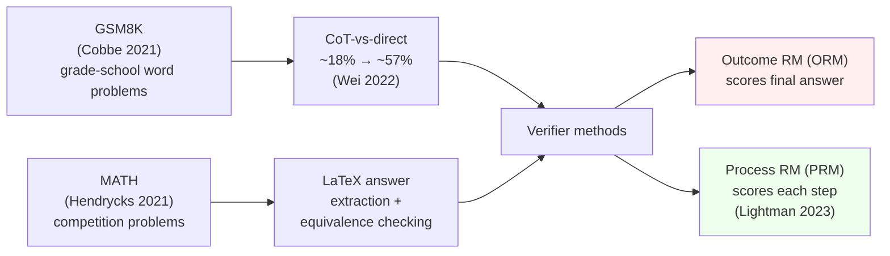

# Day 9 — Mathematical reasoning: GSM8K, MATH, and process supervision

## The opening hook

Math is where the field first saw, cleanly and reproducibly, that *how you prompt* can move a frontier model from below the random-guessing line to near-ceiling on the same benchmark. The 2022 chain-of-thought (CoT) result on GSM8K — PaLM 540B going from ~18% with direct prompting to ~57% with eight CoT exemplars (Wei et al. 2022) — is the canonical demonstration that what looks like a "capability gap" can also be a *prompting gap*. D4 introduced CoT as a prompting strategy; today's lesson is the empirical anchor for why D4 mattered.

But math evaluation is also where the field first hit a wall that pure outcome scoring couldn't get past. A model can reach the right number through wrong reasoning; a model can hallucinate a clean derivation that ends in the wrong number. Outcome supervision rewards the first; process supervision (Lightman et al. 2023, PRM800K) is the field's structural answer. This is a three-anchor lesson and the densest day in Week 2 — budget your reading attention accordingly.

## The three threads



Three threads, one through-line: the CoT gap is what makes GSM8K's pedagogy work, the answer-extraction problem is what makes MATH's pedagogy work, and the ORM-vs-PRM contrast is what closes the loop on "we have the right answer; do we trust the reasoning?".

## Anchor 1: GSM8K (Cobbe et al. 2021)

**Citation.** Cobbe, K., Kosaraju, V., Bavarian, M., Chen, M., Jun, H., Kaiser, L., Plappert, M., Tworek, J., Hilton, J., Nakano, R., Hesse, C., & Schulman, J. (2021). *Training Verifiers to Solve Math Word Problems.* OpenAI. arXiv:2110.14168.

GSM8K is **8,500 grade-school math word problems** (7,473 train / 1,319 test), each requiring 2–8 multi-step arithmetic operations with natural-language reasoning. The problems are linguistically diverse, written by human contractors, and shipped with full natural-language solutions ending in a `####` delimiter followed by the final integer answer.

A canonical item:

```
Q: Janet's ducks lay 16 eggs per day. She eats three for breakfast every morning
   and bakes muffins for her friends every day with four. She sells the remainder
   at the farmers' market daily for $2 per fresh duck egg. How much in dollars
   does she make every day at the farmers' market?

A: Janet sells 16 - 3 - 4 = 9 duck eggs a day.
   She makes 9 * 2 = $18 every day at the farmers' market.
   #### 18
```

The scoring rule is **exact match on the integer after `####`** — no LaTeX, no equivalence checking. That simplicity is what makes GSM8K the cleanest CoT demonstration: the only thing that varies between "direct" and "CoT" is whether the model produces the intermediate arithmetic before the final number.

### The CoT-vs-direct gap

Wei et al. (2022) reported the canonical numbers on GSM8K with PaLM 540B, 8-shot:

| Prompting | PaLM 540B accuracy on GSM8K |
| --- | --- |
| Direct (answer only) | ~18% |
| Chain-of-thought (8 exemplars) | ~57% |
| CoT + self-consistency (Wang et al. 2022, maj@40) | ~74% |

That is roughly a **40-point swing** from a prompt change with frozen weights — which is the strongest empirical case in the literature for D4's claim that prompt formatting is part of the evaluation pipeline, not a confound to control away. The mechanism is that arithmetic is a *serial* computation: each operation depends on the previous, and a transformer's single forward pass at the answer position can't carry the working state. Generating the intermediate tokens turns the model's KV cache into scratch paper.

**Self-consistency** (Wang et al. 2022) sharpens this further. Sample $k$ CoT chains at $T > 0$, take the *plurality vote* over their final answers (`maj@k`). Different reasoning paths that arrive at the same number reinforce each other; idiosyncratic errors don't. Reported as a +17.9 percentage-point gain on GSM8K over greedy CoT for PaLM 540B. The cost is $k$× sampling, which D25 returns to as the inference-time-scaling story.

### GSM8K's saturation status (mid-2026)

Frontier models cleared 95% on GSM8K by mid-2024, and many recent system cards (o1, Claude 3.7-class) drop GSM8K reporting entirely in favor of MATH/AIME. Per D7's saturation framing, the per-model 95% CI on a 1,319-item benchmark at $p = 0.97$ is roughly $\sqrt{0.97 \cdot 0.03 / 1319} \approx 0.0047$, or $\pm 0.9$ points — and label-noise audits (GSM-Symbolic, GSM8K-Platinum) suggest mislabeling rates exceed frontier-model error rates, so GSM8K above ~95% is mostly measuring the test set's mistakes. The pedagogical value remains; the ranking value is gone.

## Anchor 2: MATH (Hendrycks et al. 2021)

**Citation.** Hendrycks, D., Burns, C., Kadavath, S., Arora, A., Basart, S., Tang, E., Song, D., & Steinhardt, J. (2021). *Measuring Mathematical Problem Solving With the MATH Dataset.* NeurIPS Datasets and Benchmarks. arXiv:2103.03874.

MATH is **12,500 competition-level mathematics problems** (7,500 train / 5,000 test), sourced from AMC 10, AMC 12, AIME, and similar high-school olympiad-style contests. Two structural features distinguish it from GSM8K:

- **5 difficulty levels** (Level 1 = easiest within subject, Level 5 = hardest), per Art of Problem Solving's standard rating scale.
- **7 subjects:** Prealgebra, Algebra, Number Theory, Counting and Probability, Geometry, Intermediate Algebra, Precalculus.

Each problem ships with a full step-by-step LaTeX solution; the final answer is wrapped in `\boxed{...}`. That convention is the methodological focus: where GSM8K can scrape an integer after `####`, MATH requires *symbolic equivalence checking* on arbitrary LaTeX expressions.

### The boxed-LaTeX answer extraction problem

A typical MATH item:

> *Find the sum of all integers $n$ such that $\dfrac{n+6}{n}$ is an integer.*
>
> Solution: $\dfrac{n+6}{n} = 1 + \dfrac{6}{n}$, so we need $n \mid 6$. The divisors of $6$ are $\pm 1, \pm 2, \pm 3, \pm 6$, summing to $0$. The answer is $\boxed{0}$.

Now consider what equivalence-checking has to handle. A model's CoT might end with any of these, all referring to the same answer:

$$
\boxed{\tfrac{1}{2}}, \quad \boxed{\frac{1}{2}}, \quad \boxed{0.5}, \quad \boxed{\frac{2}{4}}, \quad \boxed{\frac{\sqrt{4}}{4}}, \quad \boxed{2^{-1}}
$$

A literal string-match scorer fails on five of these six. The community-standard fix is a two-stage pipeline:

1. **Extraction.** Find the last `\boxed{...}` in the output (or, for non-boxed CoT, the last numerical/symbolic expression). `lm-evaluation-harness`, the Lightman et al. PRM800K grader, and most modern math evaluators all converge on this.
2. **Normalization + symbolic equivalence.** Strip whitespace, normalize fractions (`\frac{1}{2}` ↔ `\dfrac{1}{2}`), normalize negative signs, parse with SymPy, compare with `sympy.simplify(a - b) == 0` or numeric evaluation with tolerance.

Failure modes in the wild:

- **Format-only mismatch.** `\frac{1}{2}` vs. `1/2` — solved by normalization.
- **Algebraically equivalent, syntactically different.** $\sin^2(x) + \cos^2(x)$ vs. $1$ — solved only with symbolic simplification, which can hang on adversarial inputs.
- **Numerically equivalent, symbolically not.** $\sqrt{2}$ vs. $1.414$ — handled with a numeric-tolerance fallback (e.g., `abs(a - b) < 1e-6`).
- **Multi-part answers.** `(2, 3)` vs. `\{2, 3\}` vs. `2, 3` — handled by tuple/set parsers, but evaluator implementations diverge here.

Two papers reporting different MATH numbers for the same model often differ on the equivalence checker, not the model — D1's "evaluation is a pipeline" point applied to a nastier scoring rule.

### MATH's saturation and the MATH-500 split

The original 5,000-item test set is largely used in the **MATH-500** form introduced by Lightman et al. (2023) for PRM800K: 4,500 test problems were moved into training, leaving a 500-item held-out set. Most modern reports cite *MATH-500* even when they say "MATH". As of early 2026, frontier reasoning models score in the **90–96%** range on MATH-500 — the benchmark is approaching saturation but hasn't fully cleared, partly because Level 5 problems still discriminate between models. AIME 2024/2025 is the natural successor at the frontier (D25).

## Anchor 3: Outcome- vs. process-supervised verifiers (Lightman et al. 2023)

**Citation.** Lightman, H., Kosaraju, V., Burda, Y., Edwards, H., Baker, B., Lee, T., Leike, J., Schulman, J., Sutskever, I., & Cobbe, K. (2023). *Let's Verify Step by Step.* OpenAI. arXiv:2305.20050.

The Cobbe et al. 2021 GSM8K paper introduced the verifier idea: train a *separate* model to score candidate solutions, sample $k$ candidates from the generator, and pick the highest-scoring one. The original verifier was trained on **outcomes**: did the final answer match? This is an **outcome-supervised reward model** (ORM).

The Lightman et al. 2023 paper asked: what if we score each *step* instead?

### ORM vs. PRM, formally

Let a candidate solution be a sequence of reasoning steps $s_1, s_2, \ldots, s_T$ ending in a final answer $a$.

- **ORM** scores the whole solution with a single number $r_{\text{ORM}}(s_1, \ldots, s_T) \in [0, 1]$, trained on labels $y \in \{0, 1\}$ where $y = 1$ iff $a$ matches gold. The training signal is *one bit per solution*.
- **PRM** scores each step: $r_{\text{PRM}}(s_t \mid s_{<t}) \in [0, 1]$, trained on per-step human labels $y_t \in \{-1, 0, +1\}$. The training signal is *one label per step*.

To rank a candidate solution under PRM, the standard aggregation is the *minimum* (or product) of step scores:

$$
\text{score}(s_1, \ldots, s_T) = \min_{t \in [1, T]} r_{\text{PRM}}(s_t \mid s_{<t})
$$

The intuition: a chain is no stronger than its weakest step. A solution with one egregiously wrong step but a coincidentally correct final answer gets a low PRM score even though ORM would label it correct.

### The PRM800K dataset

PRM800K is **~800,000 step-level human labels** on model-generated MATH solutions. Annotators see the problem, the prior steps, and the next candidate step, and label each step as `+1` (correct progress), `0` (uninformative but not wrong), or `-1` (incorrect). Labeling is iterative: PRMs trained on early labels are used to select solutions worth labeling next, biasing toward the model's hard examples.

### The empirical claim

Lightman et al. report that on MATH (using their non-standard 4,500-train / 500-test split — the "MATH-500" set), PRM-based selection over $N$ generator samples meaningfully outperforms ORM at every $N$. Reported headline: process-supervised models reach **78%** on the held-out 500 problems with best-of-1860 sampling, vs. lower numbers for outcome supervision. The gap is largest where it matters — the hardest problems — because outcome correctness has the highest false-positive rate (right answer, wrong reasoning) on problems where guessing-and-checking can luck into a small answer space.


### Why this matters beyond math

PRM-style supervision is a *transparency-rewarding* training signal: it pays the model for legible step-by-step reasoning, not just for getting the answer. That makes it directly relevant to the safety case for chain-of-thought. We return to this in the safety-researcher's note below.

## Running these benchmarks

A canonical lm-evaluation-harness run for both datasets:

```bash
lm_eval \
  --model hf \
  --model_args pretrained=meta-llama/Llama-3.1-70B-Instruct \
  --tasks gsm8k,hendrycks_math \
  --num_fewshot 8 \
  --batch_size 4 \
  --apply_chat_template
```

`gsm8k` defaults to 8-shot CoT and exact-match scoring on the post-`####` integer. `hendrycks_math` defaults to 4-shot CoT and uses the harness's bundled equivalence checker on `\boxed{...}` extractions. The 4-shot vs. 8-shot detail is part of the pipeline — and a paper reporting "MATH 4-shot" vs. another's "MATH 0-shot CoT" is comparing different evaluations.

For PRM-style verifier scoring at evaluation time you typically *don't* use lm-eval-harness — you sample $N$ candidates, score each with a separately-loaded PRM (e.g., the OpenAI PRM800K-trained model or one of the open Math-Shepherd / RLHFlow PRMs), and report best-of-$N$ accuracy. This sits at the boundary between "static eval" and "inference-time scaling" (D25).

## Conceptual contrast: arithmetic chains vs. competition reasoning

GSM8K and MATH look like the same evaluation — math problems scored on final-answer correctness — but they probe different capabilities and have different failure modes.

| Property | GSM8K | MATH |
| --- | --- | --- |
| Source | Hand-written grade-school word problems | Competition problems (AMC/AIME) |
| Items | 8.5K (7,473 / 1,319) | 12.5K (7,500 / 5,000); MATH-500 used in practice |
| Difficulty | 2–8 arithmetic steps | 5 levels, 7 subjects, requires insight not just calculation |
| Answer format | Integer after `####` | `\boxed{...}` with arbitrary LaTeX |
| Scoring | Exact match | LaTeX normalization + symbolic equivalence |
| Failure mode under saturation | Label noise > model error | Equivalence-checker disagreements |
| Frontier SOTA (early 2026) | ~95–99% (saturated) | ~90–96% on MATH-500 |
| What CoT helps with | Carrying multi-step state | State *and* problem-decomposition insight |

The pedagogically clean lesson is that GSM8K isolates the *serial-computation* benefit of CoT (you literally need scratch paper for 8-step arithmetic), while MATH adds the *insight-search* benefit (the model has to find the right transformation, not just execute it). Both are real; they're just different reasons CoT works.

## Forward pointer: D25 and reasoning models

The story this lesson tells ends with verifiers picking the best of $N$ samples. D25 picks it up where the verifier becomes part of the model: o1-style reasoning models internalize chain-of-thought into a long internal trace and report a single final answer, with token-budget as a first-class evaluation axis. The methodological shift is that pass@1 stops being a single number and becomes a function of inference-time compute — accuracy-vs-tokens Pareto curves on AIME 2024/2025 replace single-scalar scores. PRM-style step scoring is one of the training signals that makes that shift possible. If you're curious about how the math story ends, D25 is where it goes.

> **Safety researcher's note.** Mathematical CoT looks like the cleanest possible case for chain-of-thought *faithfulness* — the model writes out arithmetic, you can check each step, and a wrong step usually breaks the answer. But Turpin et al. 2023 (*Language Models Don't Always Say What They Think*, referenced on D4) showed that CoT explanations systematically *omit* the actual causes of model decisions, even on benchmark-style multiple-choice tasks. Math is a partial exception — wrong arithmetic steps usually do break the answer — but PRM-style training is *also* a Goodhart pressure on transparency: optimize the model to write *legible* reasoning, and the model learns to produce reasoning that *looks* legible whether or not it reflects the actual computation. The PRM800K result is genuine progress; it is also a place where the measure (legibility-as-judged-by-annotators) is now a target, and Goodhart's Law on transparency is the next-order concern. D17 (situational awareness) and D24 (reward-model evaluation) take this further. The short version: faithful-looking CoT is necessary for safety claims about reasoning, and not yet sufficient.

## Takeaways

1. **GSM8K** (Cobbe et al. 2021, 8.5K grade-school word problems, exact-match on `####` integer) is the cleanest CoT demonstration: PaLM 540B went from ~18% direct to ~57% CoT to ~74% with self-consistency on the same items, frozen weights.
2. **MATH** (Hendrycks et al. 2021, 12.5K competition problems, 5 difficulty levels, 7 subjects) is the canonical answer-extraction-and-equivalence benchmark: `\boxed{...}` extraction plus LaTeX/symbolic equivalence is where pipeline disagreements between papers concentrate. Most modern reports use the **MATH-500** subset.
3. Self-consistency (Wang et al. 2022) is the canonical $k$-sample voting baseline; `maj@k` is now table stakes for any math eval claim.
4. **Outcome supervision (ORM)** scores the final answer; **process supervision (PRM)** scores each step. PRM800K (Lightman et al. 2023, ~800K step-level labels on MATH solutions) showed PRMs outperform ORMs at best-of-$N$ selection, especially on hard problems where right-answer-wrong-reasoning is most likely.
5. GSM8K is saturated as a ranking instrument; MATH-500 is approaching saturation; AIME (D25) is where frontier discrimination has moved.
6. CoT *transparency* is a safety-relevant property, but optimizing for it is a Goodhart pressure on the very thing it's measuring (Turpin et al. 2023).

## References

- **Anchor — GSM8K.** Cobbe, K., Kosaraju, V., Bavarian, M., Chen, M., Jun, H., Kaiser, L., Plappert, M., Tworek, J., Hilton, J., Nakano, R., Hesse, C., & Schulman, J. (2021). *Training Verifiers to Solve Math Word Problems.* arXiv:2110.14168. https://arxiv.org/abs/2110.14168
- **Anchor — MATH.** Hendrycks, D., Burns, C., Kadavath, S., Arora, A., Basart, S., Tang, E., Song, D., & Steinhardt, J. (2021). *Measuring Mathematical Problem Solving With the MATH Dataset.* NeurIPS Datasets and Benchmarks. arXiv:2103.03874. https://arxiv.org/abs/2103.03874
- **Anchor — process supervision.** Lightman, H., Kosaraju, V., Burda, Y., Edwards, H., Baker, B., Lee, T., Leike, J., Schulman, J., Sutskever, I., & Cobbe, K. (2023). *Let's Verify Step by Step.* OpenAI. arXiv:2305.20050. https://arxiv.org/abs/2305.20050
- **CoT prompting.** Wei, J., Wang, X., Schuurmans, D., Bosma, M., Ichter, B., Xia, F., Chi, E., Le, Q., & Zhou, D. (2022). *Chain-of-Thought Prompting Elicits Reasoning in Large Language Models.* NeurIPS. arXiv:2201.11903. https://arxiv.org/abs/2201.11903
- **Self-consistency.** Wang, X., Wei, J., Schuurmans, D., Le, Q., Chi, E., Narang, S., Chowdhery, A., & Zhou, D. (2022). *Self-Consistency Improves Chain of Thought Reasoning in Language Models.* ICLR 2023. arXiv:2203.11171. https://arxiv.org/abs/2203.11171
- **CoT faithfulness (safety).** Turpin, M., Michael, J., Perez, E., & Bowman, S. R. (2023). *Language Models Don't Always Say What They Think: Unfaithful Explanations in Chain-of-Thought Prompting.* NeurIPS. arXiv:2305.04388. https://arxiv.org/abs/2305.04388
- **Label-noise audit.** Vendrow, J., et al. (2025). *GSM8K-Platinum: Revealing Performance Gaps in Frontier LLMs* (gradient science / context for the GSM8K saturation discussion). https://gradientscience.org/gsm8k-platinum/
- **PRM800K dataset release.** OpenAI. *prm800k* GitHub repository. https://github.com/openai/prm800k
- **Harness.** GSM8K and MATH tasks in `lm-evaluation-harness`. https://github.com/EleutherAI/lm-evaluation-harness

## Quiz

**Q1.** Wei et al. (2022) reported that PaLM 540B scores roughly 18% with direct prompting and 57% with 8-shot chain-of-thought on GSM8K. Which of the following best explains *why* CoT produces such a large gap on this specific benchmark?

- A. CoT prompts let the model condition on a different system message that is closer to GSM8K's training distribution.
- B. Multi-step arithmetic requires carrying intermediate state across operations, and generating intermediate tokens uses the KV cache as scratch space; the single forward pass at the answer position can't carry that state otherwise.
- C. CoT raises the temperature, which empirically helps on math.
- D. CoT bypasses the model's safety filter, which suppresses numerical answers under direct prompting.

**Q2.** A model produces the answer `\frac{2}{4}` to a MATH problem whose gold answer is `\boxed{\frac{1}{2}}`. A naive string-match scorer marks this incorrect. Which scorer behavior is the *standard* fix used in modern math evaluators?

- A. Apply BLEU to the LaTeX strings and threshold at 0.8.
- B. Extract the contents of the last `\boxed{...}`, normalize the LaTeX (whitespace, fraction commands), then compare via symbolic simplification or numeric tolerance.
- C. Re-run the model with self-consistency until it produces an exact-match string.
- D. Use an LLM-as-judge (e.g., GPT-4) to decide equivalence on every item.

**Q3.** A solution to a MATH problem has step scores under a process reward model of $[0.95, 0.91, 0.12, 0.94, 0.93]$ and a final answer that *matches* the gold answer. An outcome reward model scores it $0.97$. Under the standard PRM aggregation $\min_t r_t$, what is the PRM score for this solution, and which model is more likely to demote it in best-of-$N$ ranking?

- A. PRM score $= 0.97$; ORM is more likely to demote it.
- B. PRM score $= 0.12$; PRM is more likely to demote it.
- C. PRM score $= 0.93$ (the median); PRM and ORM rank it equally.
- D. PRM score $= 0.97$; PRM is more likely to demote it.

**Q4.** Why is GSM8K above ~95% considered to be at or past its useful ranking ceiling, even though the test set has 1,319 items?

- A. The 95% confidence interval at $p \approx 0.97$ on 1,319 items is roughly $\pm 0.9$ points, and label-noise audits suggest mislabeling rates exceed frontier-model error rates — most of the remaining gap is the test set's mistakes, not the models'.
- B. GSM8K can only be evaluated with self-consistency, which is too expensive for frontier comparisons.
- C. The harness only supports models with fewer than 70B parameters on GSM8K.
- D. GSM8K's exact-match scoring breaks for any model that has been instruction-tuned.

**Q5.** Which of the following is the **clearest** reason process supervision (PRM) outperforms outcome supervision (ORM) at best-of-$N$ selection on hard math problems?

- A. PRMs are larger models than ORMs by construction.
- B. Outcome supervision rewards solutions that reach the right answer through wrong reasoning (right-answer-wrong-reasoning false positives), and these false positives are most common on hard problems with small answer spaces; PRMs penalize the wrong steps directly.
- C. PRMs use reinforcement learning while ORMs use supervised learning.
- D. PRM800K is larger than the GSM8K verifier dataset, so PRMs simply have more training data.

**Q6.** The "Safety researcher's note" argues that PRM-style training is *also* a Goodhart pressure on chain-of-thought transparency. What is the precise concern?

- A. PRMs eventually saturate and stop improving model accuracy.
- B. Optimizing for human-rated step legibility makes the model produce reasoning that *looks* legible whether or not it reflects the model's actual computation, so the legibility signal becomes the target rather than a faithful proxy for the underlying reasoning.
- C. PRM training requires more annotators than ORM training, which is a logistical concern.
- D. Process supervision can only be applied to mathematical domains.

<details>
<summary>Answers</summary>

1. **B** — the serial-computation argument. CoT works on GSM8K because each arithmetic step depends on the previous, and the model needs the intermediate tokens as scratch space; without them, the answer position can't carry the working state. A is wrong (no system-message change is implied by CoT exemplars), C is wrong (CoT is independent of temperature in the Wei et al. setup), D is unrelated.
2. **B** — the standard two-stage pipeline (boxed-extraction + LaTeX normalization + symbolic/numeric equivalence). A and C are nonsensical for math equivalence; D works but is far slower and rarely the *standard* — it's an LLM-judge fallback when the symbolic checker fails.
3. **B** — under $\min_t r_t$, the score is $\min(0.95, 0.91, 0.12, 0.94, 0.93) = 0.12$. ORM rates the solution highly (final answer matches), so ORM would *promote* it; PRM detects the broken step and demotes it. This is the canonical right-answer-wrong-reasoning case the Lightman et al. paper highlights.
4. **A** — the CI math: $\sqrt{0.97 \cdot 0.03 / 1319} \approx 0.0047$, so $\pm 0.9$ points at 95%. The label-noise floor on GSM8K is now larger than that gap, so above ~95% you are measuring the test set's errors, not the model's. This is D7's saturation argument applied to GSM8K.
5. **B** — the right-answer-wrong-reasoning failure mode is the structural reason ORM underperforms PRM at the hard-problem end. A is incorrect (the architectures are similar), C is incorrect (both are typically trained as supervised reward models), D conflates dataset size with the methodological claim.
6. **B** — the Goodhart-on-transparency argument. Once "step legibility as judged by annotators" is the optimization target, the model can satisfy it without faithfulness — Turpin et al. 2023's central worry, applied to math reasoning specifically. A, C, D are unrelated to the faithfulness concern.

</details>
