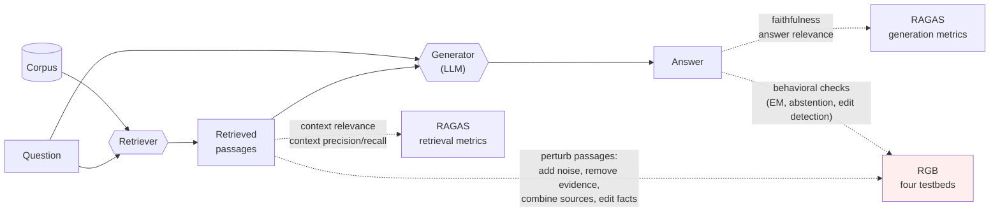

# Day 10 — RAG evaluation: RGB's four dimensions and the RAGAS metric scaffold

## TL;DR

A retrieval-augmented generation (RAG) system has two moving parts — a retriever and a generator — and one accuracy number cannot tell you which one failed. **RGB** (Chen et al. 2023) provides four behavioral testbeds that perturb the retrieved passages (noise, missing evidence, multi-document, edited facts) and measure the generator's response; **RAGAS** (Es et al. 2024) provides reference-free metrics that score a fixed (question, context, answer) trace. The two are complements, not substitutes — and the seam between them, *counterfactual robustness*, is the controlled-lab on-ramp to [D-26](/lesson/26)'s indirect prompt injection.

## Learning objectives

By the end of this lesson, you will be able to:

1. **(L2)** Name RGB's four testbeds — noise robustness, negative rejection, information integration, counterfactual robustness — and the retrieval condition each one isolates.
2. **(L2)** Describe the **three** metrics defined in the original RAGAS paper (faithfulness, answer relevance, context relevance) and the **two** ground-truth-aware extensions (context precision, context recall) added by the `ragas` library.
3. **(L3)** *Apply* the RAGAS faithfulness definition to a concrete (question, context, answer) trace — including a counterfactual case where the answer is correct but contradicts the context — and predict whether the score is high or low.
4. **(L4)** *Analyze* why RAGAS faithfulness gives the *wrong* sign on RGB-counterfactual traces by decomposing what construct each metric is actually measuring.
5. **(L5)** *Evaluate* a production RAG-eval setup that reports only RAGAS metrics and surface which retrieval-failure mode it cannot catch without RGB-style perturbation.
6. **(L4)** Contrast the controlled (RGB-counterfactual, warned, single-span edits) and adversarial ([D-26](/lesson/26)'s AgentDojo, no warning, attacker-controlled tool outputs) variants of the *perturb-retrieved-passages-and-measure-behavior* primitive.

## Prerequisites & callback

[D-10](/lesson/10) is the first lesson on a *system* — retriever plus generator — rather than a single-input single-output task, and two earlier lessons are load-bearing for the framing. **[D-3](/lesson/3)'s open-ended scoring primitives** (exact-match, abstention detection, free-form span comparison) are reused across all four RGB testbeds — RGB does not introduce new scoring rules, it stages four retrieval *conditions* under which [D-3](/lesson/3)'s existing rules become diagnostically informative. If [D-3](/lesson/3)'s distinction between "model abstained" and "model hallucinated a confident wrong answer" is unfamiliar, revisit it before proceeding; RGB's negative-rejection testbed is built on that distinction. **[D-1](/lesson/1)'s pipeline framing** ("an evaluation is a (dataset, scoring rule, reporting convention) triple plus a model run") expands today: the RAG "pipeline" now has retrieved passages as a deterministic-but-perturbable intermediate stage, and RGB's contribution is to *systematically vary* that stage to surface generator-side failure modes a single accuracy number hides.

## The opening hook

A retrieval-augmented generation (RAG) system has two moving parts that a single accuracy number cannot disentangle: a **retriever** that selects passages from a corpus, and a **generator** that conditions on those passages to produce an answer. When the system gets something wrong, the failure could live in either part — or in the *interaction* between them, which is the new failure mode RAG introduces and that vanilla QA benchmarks were never designed to surface.

Two papers from late 2023 anchor the methodological response, and they answer different questions. **RGB** (Chen et al. 2023) asks: *under what retrieval conditions does the generator fail, and how?* It defines four behavioral testbeds — noise robustness, negative rejection, information integration, counterfactual robustness — that each isolate a different retrieval condition (irrelevant context, missing context, multi-document context, poisoned context) and measure the generator's response. **RAGAS** (Es et al. 2024) asks: *given a fixed input/output trace, how do we automatically score it without ground-truth references?* It defines a small set of LLM-judged metrics that decompose a RAG response into faithfulness (does the answer follow from the retrieved context?), answer relevance (does the answer address the question?), and context relevance (was the retrieved context focused?).

[D-10](/lesson/10)'s claim is that the two are complements. RGB tells you *what failure modes to provoke*; RAGAS tells you *how to score the trace once provoked*. Counterfactual robustness — the fourth RGB dimension — is also the on-ramp to [D-26](/lesson/26)'s indirect prompt injection: the moment retrieved content stops being a passive evidence source and becomes attacker-controllable, the same evaluation primitive measures a different threat.

## The RAG pipeline and where each evaluation primitive applies



RGB intervenes on the retrieved-passages box and measures behavior at the answer; RAGAS sits as a passive observer over the same trace and scores both the retrieval slice and the generation slice. You do not have to pick one — most production RAG eval suites in 2026 layer RAGAS-style metrics over RGB-style perturbations, and we'll do the same below.

## Anchor: RGB (Chen et al. 2023)

**Citation.** Chen, J., Lin, H., Han, X., & Sun, L. (2023). *Benchmarking Large Language Models in Retrieval-Augmented Generation.* AAAI 2024. arXiv:2309.01431.

RGB ships **1,000 instances** across English and Chinese (≈50/50 split): 600 base questions reused for noise robustness and negative rejection (with the retrieved-passage composition varied per testbed), plus 200 additional multi-hop questions for information integration and 200 fact-edited questions for counterfactual robustness. The base questions come from recent news articles to limit overlap with model pre-training; retrieval is over a passage corpus the authors constructed alongside the questions.

The four testbeds — verbatim, paraphrased only where the paper's wording is awkward — are:

1. **Noise robustness.** The model is given context that is *topically relevant* to the question but does *not* contain the answer, mixed at a configurable ratio with passages that do. Definition: the ability to extract useful information from documents that are noisy in the sense of being on-topic-but-not-answer-bearing. The metric is exact-match accuracy on the gold answer as the noise ratio increases (the paper sweeps 0%, 20%, 40%, 60%, 80%).
2. **Negative rejection.** The model is given retrieved context that contains *no* answer-bearing passage at all — every passage is on-topic-but-noisy. Definition: the model should *abstain* (refuse to answer, or say "the information is not available"). The metric is rejection rate; a model that hallucinates a confident answer fails.
3. **Information integration.** The model is given a multi-hop question whose answer requires *combining facts from at least two retrieved passages*. Definition: the ability to integrate information across multiple sources. The metric is exact-match accuracy on the integrated answer.
4. **Counterfactual robustness.** The model is given retrieved context where the answer-bearing fact has been *deliberately edited* to be incorrect (e.g., a date is changed, a name is swapped). The model is *warned* via instructions that retrieved passages may contain errors, and is asked to flag and override them. Definition: the ability to identify and reject known factual errors in retrieved documents when given warnings. The metric is a combination of error-detection rate and corrected-answer accuracy.

The paper's headline finding from the original 2023 evaluation is that frontier LLMs of the time were *acceptable* on noise robustness but *fragile* on the other three — abstention failure (negative rejection) and uncritical acceptance of edited facts (counterfactual robustness) were the most consistent failure modes. The order of magnitudes has shrunk on 2025–2026 frontier models, but the *ranking* of failure modes is stable: integration and counterfactual robustness remain the harder dimensions.

### A worked example: counterfactual robustness

Suppose the question is: *"What year did the Apollo 11 mission land on the Moon?"* The model is given two retrieved passages, with instructions warning that the passages may contain errors:

```text
Passage 1: "Apollo 11 was the United States' first crewed Moon landing.
Astronauts Neil Armstrong and Buzz Aldrin walked on the lunar surface
on July 21, 1971, while Michael Collins remained in lunar orbit."

Passage 2: "The Apollo program ran from 1961 to 1972; Apollo 11 was its
first successful crewed lunar landing."
```

Passage 1 is the counterfactual — the date has been edited from 1969 to 1971. The correct behaviors are:

- **Detect** the edit (the model's parametric memory says 1969; the passage says 1971; flag the conflict).
- **Override** the retrieved context using parametric knowledge: report 1969.
- **Surface** the disagreement to the user (a strong model says "the retrieved passage gives 1971, but this is incorrect — Apollo 11 landed in 1969").

A model that fails counterfactual robustness either (a) reports 1971 because it deferred to the (wrong) retrieved passage, or (b) reports 1969 *without flagging* the disagreement, which is correct on the surface but indicates the model isn't actually attending to the evidence. RGB scores both the answer accuracy and the explicit error-detection rate to distinguish these cases.

The construction is the methodological point. Counterfactual passages aren't naturally occurring noise — Chen et al. produced them by taking model-known facts and surgically editing the answer-bearing span. That is a benign editor's analogue of what an attacker does in indirect prompt injection ([D-26](/lesson/26)): inject content into the retrieval corpus that flips the model's answer. RGB's 200 counterfactual items are the **upper bound on the easy case** — known, isolated, single-fact edits with explicit warning. [D-26](/lesson/26)'s AgentDojo is the lower bound where edits are arbitrary, adversarial, and not pre-announced. The continuity between the two is the safety-relevant thread we will return to in the closing.

## ⏵ Check yourself — distinguishing the four RGB testbeds

You are reviewing a RAG-eval report that says: *"the model's negative-rejection score was 0.18 and its noise-robustness score (at 60% noise) was 0.71."* Without looking at any other numbers, what do you know about (a) the retrieved-context composition each score was computed over, and (b) which of the two failure modes is more concerning for a production deployment that retrieves from a small, often-empty corpus?

<details>
<summary>Show answer</summary>

(a) The two scores were computed over *different* retrieved-context compositions. Noise robustness mixes on-topic-but-noisy passages *with* answer-bearing passages at a configurable ratio (60% means 60% of the retrieved chunks are noisy, the rest contain the answer). Negative rejection uses contexts with *zero* answer-bearing passages — every chunk is on-topic-but-noisy, and the gold behavior is to abstain.

(b) For a small, often-empty corpus, *negative rejection* is the load-bearing dimension. A 0.18 score there means the model abstains only 18% of the time when it should — meaning 82% of empty-corpus queries produce a confidently-wrong hallucinated answer. Noise robustness at 0.71 with 60% noise is a strong number and suggests the generator can extract signal from cluttered retrievals. The deployment risk is hallucination on missing-evidence queries, not signal-extraction-from-clutter.

</details>

## RAGAS as a metric scaffold

**Citation.** Es, S., James, J., Espinosa Anke, L., & Schockaert, S. (2024). *RAGAS: Automated Evaluation of Retrieval Augmented Generation.* EACL 2024 (System Demonstrations). arXiv:2309.15217.

The original RAGAS paper defines **three** reference-free metrics, all computed by prompting an LLM judge over a `(question, retrieved_context, answer)` triple:

- **Faithfulness.** Decompose the answer into atomic claims; for each claim, ask the judge whether the claim is *entailed by* the retrieved context. Faithfulness is the fraction of claims that are entailed:

$$
\text{Faithfulness} = \frac{|\{s \in S : s \text{ is supported by } c(q)\}|}{|S|}
$$

where $S$ is the set of atomic claims extracted from the answer $a(q)$ and $c(q)$ is the retrieved context. A faithful answer has every claim grounded in retrieved evidence; a hallucinated answer has at least one ungrounded claim.

- **Answer relevance.** Generate $n$ candidate questions that the answer would be a good response to, then measure their average cosine similarity to the original question $q$ in an embedding space. An answer that addresses the question yields candidate questions close to $q$; an off-topic or hedge-heavy answer does not.

- **Context relevance.** Decompose the retrieved context into sentences; ask the judge which sentences are *necessary* to answer the question. Context relevance is the fraction of necessary sentences. Low context relevance means the retriever is dragging in irrelevant passages even if the answer turns out fine.

The `ragas` Python library (https://github.com/explodinggradients/ragas) has since added **context precision** and **context recall** as ground-truth-aware variants (precision: of the retrieved chunks, how many are relevant? recall: of the relevant chunks in the corpus, how many were retrieved?), plus extensions like noise sensitivity, answer correctness, and factual correctness. The "four metrics" you'll see in 2026 RAG-eval blog posts — faithfulness, answer relevance, context precision, context recall — are the *library's* canonical four, not the *paper's* original three. Both framings are standard; cite the paper for the three originals and the library for the precision/recall additions.

A minimal RAGAS run looks like this:

```python
from datasets import Dataset
from ragas import evaluate
from ragas.metrics import faithfulness, answer_relevancy, context_precision

# One row per (question, retrieved_contexts, answer, ground_truth) tuple.
ds = Dataset.from_dict({
    "question":  ["What year did Apollo 11 land?"],
    "contexts":  [["Apollo 11 was the United States' first crewed Moon "
                   "landing. The astronauts walked on the lunar surface "
                   "on July 21, 1971..."]],
    "answer":    ["Apollo 11 landed in 1969. (The retrieved passage's "
                  "1971 date is incorrect.)"],
    "ground_truth": ["1969"],
})

result = evaluate(ds, metrics=[faithfulness, answer_relevancy, context_precision])
print(result)
```

The trace above is a deliberately tricky case: the answer is *correct* (1969) but contradicts the retrieved context (1971). RAGAS faithfulness will score it *low* — the claim "Apollo 11 landed in 1969" is not entailed by a context that says 1971. That is the right behavior under RAGAS's definition (faithfulness = grounded-in-retrieved-context), but it is the *wrong* behavior for the counterfactual-robustness task, where overriding bad context is exactly what we want. **The lesson is methodological: faithfulness as defined by RAGAS rewards deference to context, including bad context.** You cannot use it as a one-number evaluator on RGB-counterfactual-style data without conflating two things.

This is a worked example of the cross-thread sub-point: judge-based metrics inherit their judges' priors. RAGAS's faithfulness prior is "answer should be grounded in context" — fine for vanilla RAG, miscalibrated for adversarial-context RAG. [D-22](/lesson/22) returns to LLM-as-judge biases in detail; [D-24](/lesson/24) (RewardBench) examines reward-model-based scoring as an alternative. For now, the tactical move on [D-10](/lesson/10) is: use RAGAS to score noise robustness and information integration; use *behavioral metrics* (RGB's exact-match + abstention + edit-detection rates) on negative rejection and counterfactual robustness.

## ⏵ Check yourself — the faithfulness counterfactual paradox

A team builds a RAG-eval suite that runs RGB's four testbeds on a frontier model and scores every trace with RAGAS faithfulness alongside RGB's native metrics. They report: *"On counterfactual robustness, RAGAS faithfulness averaged 0.91 while RGB's edit-detection rate averaged 0.32."* Which model behavior produces *both* numbers simultaneously, and why does the high faithfulness score actively *mislead* a reader trying to assess counterfactual robustness?

<details>
<summary>Show answer</summary>

The behavior is **uncritical deference**: the model copies the (counterfactually edited) fact from the retrieved passage straight into the answer. Faithfulness scores high because every claim in the answer *is* entailed by the retrieved context — that's literally what the metric measures. Edit-detection rate scores low because the model failed to flag the conflict between its parametric memory and the edited passage; it simply repeated what the passage said.

The misleading reading is to glance at faithfulness = 0.91 and conclude "the model is well-grounded." In adversarial-context RAG, *grounding to bad context is the failure mode*. Faithfulness and counterfactual robustness pull in opposite directions on RGB-counterfactual data: a model that scores 1.0 on faithfulness *must* score near 0.0 on edit detection, because it accepted every poisoned passage. The right move is to drop faithfulness as a scorer for the counterfactual testbed and rely on RGB's native edit-detection + corrected-answer-accuracy pair.

</details>

## Conceptual contrast: behavioral dimensions vs. surface-quality metrics

RGB and RAGAS measure orthogonal things, and conflating them is a common reading error.

| Axis | RGB (Chen et al. 2023) | RAGAS (Es et al. 2024) |
| --- | --- | --- |
| What it measures | Behavioral *response* to controlled retrieval perturbations | Surface *quality* of a fixed (Q, context, answer) trace |
| Granularity | Four discrete capabilities | Continuous metrics (per-trace floats) |
| Ground truth | Yes — gold answers, gold abstention labels, gold edits | Originally reference-free; library extensions add reference-aware variants |
| Adversarial pressure | Yes — counterfactual passages are deliberately wrong | No — assumes context is honest |
| Cost | Per-instance, dataset is fixed | Per-trace, runs over arbitrary RAG outputs |
| Failure mode it catches | "Model accepts poisoned context" (counterfactual robustness) | "Answer contains ungrounded claims" (faithfulness) |
| Failure mode it misses | Surface fluency / phrasing quality | Whether the model *should have* deferred to the context at all |

You want both. A pure-RGB pipeline tells you the model handles or doesn't handle four specific retrieval conditions but says nothing about whether its answers are well-formed; a pure-RAGAS pipeline tells you whether traces look good but cannot distinguish a model that handles adversarial context from one that doesn't (because RAGAS doesn't perturb the context — it scores whatever you give it). Production RAG-eval setups in 2026 typically run RGB-style perturbations as the *driver* and RAGAS metrics as the *scorer* over the resulting traces, with the explicit caveat about counterfactual robustness above.

## Where RGB and RAGAS sit in the broader RAG-eval landscape

Three other reference points are worth naming so you can place RGB correctly in the field:

- **BEIR** (Thakur et al. 2021). A *retrieval-only* benchmark — 18 IR datasets with shared evaluation. Use BEIR if you want to evaluate the retriever in isolation; RGB and RAGAS evaluate the retriever-generator system.
- **KILT** (Petroni et al. 2021). A knowledge-intensive language tasks benchmark — Wikipedia-grounded QA, slot filling, fact checking. Pre-dates the RAG framing but provides the canonical knowledge-intensive eval substrate. RGB's design is methodologically downstream of KILT.
- **CRAG** (Yan et al. 2024, *Corrective Retrieval Augmented Generation*, arXiv:2401.15884). Despite the similar acronym to "Chen et al.'s RGB," CRAG is a *method* paper — it proposes a retrieval evaluator that triggers different actions (use, web-search-supplement, discard) based on retrieval confidence. It is not the anchor for [D-10](/lesson/10). Worth knowing because in 2026 papers "RAG benchmark" sometimes means CRAG-the-method's evaluation suite rather than RGB; check the citation when reading.

A separate Meta benchmark also released in 2024 — *CRAG: Comprehensive RAG Benchmark* (Yang et al. 2024) — uses the same acronym for a different artifact. Disambiguate by author and arXiv ID when citing.

> **Safety researcher's note.** Counterfactual robustness is the RAG dimension closest to a safety property in the sense Week 3 will use — adversarial robustness of the model's belief-update under attacker-controlled retrieval. A model that mechanically defers to retrieved context is a model an attacker can steer by writing into the corpus. The RGB construction (warning + edit + measure detection rate) is the *easy* case: the warning is in the system prompt, the edit is to a single span, and the model is asked explicitly to flag conflicts. [D-26](/lesson/26)'s AgentDojo removes the warning, generalizes the edit to arbitrary attacker prose, and embeds it inside tool outputs the model has no a priori reason to distrust. The performance drop from RGB-counterfactual to AgentDojo is one of the cleanest "controlled-lab → real-threat" gradients in the curriculum, and it sits inside an evaluation pattern (perturb context, measure behavior) that the rest of agent-safety eval extends rather than replaces.

## Cross-references

**Backward.**

- [D-1](/lesson/1) — RGB extends [D-1](/lesson/1)'s *evaluation-as-pipeline* framing by treating the retrieved-passages stage as a deterministic-but-perturbable intermediate, then scheduling controlled perturbations of it.
- [D-3](/lesson/3) — RGB's four testbeds reuse [D-3](/lesson/3)'s open-ended scoring primitives (exact-match, abstention detection, span comparison) without inventing new scoring rules; RGB stages four retrieval *conditions* under which [D-3](/lesson/3)'s scorers become diagnostic.
- [D-6](/lesson/6) — RGB sources its base questions from recent news articles to limit pre-training overlap; the contamination concern from [D-6](/lesson/6) is why this design choice matters more than it would on a synthetic corpus.

**Forward.**

- [D-22](/lesson/22) — RAGAS metrics are LLM-as-judge metrics; the systemic biases catalogued on [D-22](/lesson/22) (self-preference, position, verbosity/length, bandwagon) all apply, and the faithfulness-on-counterfactual pathology above is a deference-bias variant.
- [D-24](/lesson/24) — reward-model-based scoring is the alternative to LLM-as-judge for reference-free RAG metrics; [D-24](/lesson/24) (RewardBench) examines the trade-off (faster + more reproducible, harder to inspect).
- [D-26](/lesson/26) — counterfactual robustness with *benign* edits and explicit warnings is the controlled-lab version of attacker-controlled retrieved content with no warnings; the same evaluation primitive (perturb retrieved passages, measure model behavior) generalizes from RGB to AgentDojo.

## Takeaways

1. RAG evaluation requires two complementary primitives: behavioral perturbation of retrieval (RGB's four testbeds) and trace-level scoring (RAGAS's reference-free metrics). Neither alone is sufficient. *(LO 1, LO 5)*
2. RGB's four dimensions — noise robustness, negative rejection, information integration, counterfactual robustness — isolate four distinct retrieval conditions. Negative rejection is an abstention test; counterfactual robustness is a poisoned-context test. *(LO 1)*
3. RAGAS originally defines three metrics (faithfulness, answer relevance, context relevance); the `ragas` library has since added context precision/recall and others. Cite the paper for the three; cite the library for the four-or-more. *(LO 2)*
4. Faithfulness as defined rewards *deference* to retrieved context. On counterfactual-robust traces — where overriding bad context is correct — RAGAS faithfulness gives the wrong sign. Use behavioral metrics (EM, abstention rate, edit-detection rate) on adversarial-context dimensions. *(LO 3, LO 4)*
5. RGB-counterfactual is the controlled precursor to indirect prompt injection ([D-26](/lesson/26)). The same evaluation primitive — perturb the retrieved passages, measure the model's behavior — generalizes from benign editorial edits to attacker-controlled content. *(LO 6)*

## Glossary

- **RGB**: Retrieval-Augmented Generation Benchmark (Chen et al. 2023) — 1,000 instances across four behavioral testbeds that perturb retrieved passages and measure generator-side response [introduced D-10](/lesson/10).
- **RAGAS**: Retrieval-Augmented Generation ASsessment (Es et al. 2024) — a reference-free LLM-as-judge metric scaffold over `(question, context, answer)` triples [introduced D-10](/lesson/10).
- **noise robustness**: RGB testbed measuring whether a model can extract the gold answer when on-topic-but-not-answer-bearing passages are mixed with answer-bearing ones at varying ratios [introduced D-10](/lesson/10).
- **negative rejection**: RGB testbed measuring whether a model abstains when *every* retrieved passage is on-topic-but-noisy (no answer-bearing evidence). Failure mode is confident hallucination [introduced D-10](/lesson/10).
- **information integration**: RGB testbed measuring whether a model can combine facts from at least two retrieved passages to answer a multi-hop question [introduced D-10](/lesson/10).
- **counterfactual robustness**: RGB testbed measuring whether a model detects deliberately edited (incorrect) facts in retrieved passages, given a system-prompt warning, and overrides them using parametric memory [introduced D-10](/lesson/10).
- **faithfulness**: RAGAS metric defined as the fraction of atomic claims in an answer that are entailed by the retrieved context. Rewards deference to context — including bad context [introduced D-10](/lesson/10).
- **context precision/recall**: ground-truth-aware retrieval-quality metrics added by the `ragas` library after the original paper. Precision: of retrieved chunks, how many are relevant? Recall: of relevant chunks in the corpus, how many were retrieved? [introduced D-10](/lesson/10).

## References

- **Anchor.** Chen, J., Lin, H., Han, X., & Sun, L. (2023). *Benchmarking Large Language Models in Retrieval-Augmented Generation.* AAAI 2024. arXiv:2309.01431. https://arxiv.org/abs/2309.01431
- **Harness.** Chen, J. *RGB.* https://github.com/chen700564/RGB (the benchmark-native repo) and Exploding Gradients, *ragas* (Python), https://github.com/explodinggradients/ragas (the metric-scaffold harness layered over RGB-style traces).
- **Secondary.** Es, S., James, J., Espinosa Anke, L., & Schockaert, S. (2024). *RAGAS: Automated Evaluation of Retrieval Augmented Generation.* EACL 2024 (System Demonstrations). arXiv:2309.15217. https://arxiv.org/abs/2309.15217 (ACL Anthology: https://aclanthology.org/2024.eacl-demo.16/)
- **Secondary.** Thakur, N., Reimers, N., Rücklé, A., Srivastava, A., & Gurevych, I. (2021). *BEIR: A Heterogeneous Benchmark for Zero-shot Evaluation of Information Retrieval Models.* NeurIPS Datasets & Benchmarks. arXiv:2104.08663. https://arxiv.org/abs/2104.08663
- **Secondary.** Petroni, F., et al. (2021). *KILT: a Benchmark for Knowledge Intensive Language Tasks.* NAACL. arXiv:2009.02252. https://arxiv.org/abs/2009.02252
- **Secondary.** Yan, S.-Q., Gu, J.-C., Zhu, Y., & Ling, Z.-H. (2024). *Corrective Retrieval Augmented Generation.* arXiv:2401.15884. https://arxiv.org/abs/2401.15884 (adjacent method paper, not the [D-10](/lesson/10) anchor).

## Quiz

**Q1.** Which RGB testbed measures the model's ability to *abstain* when retrieved passages contain no answer-bearing evidence?

- A. Noise robustness.
- B. Negative rejection.
- C. Information integration.
- D. Counterfactual robustness.

**Q2.** A RAG system answers "Apollo 11 landed in 1969" while the retrieved context says it landed in 1971 (a counterfactual edit). *Apply* the RAGAS faithfulness definition from the original paper: what is the faithfulness score on this trace, and why?

- A. High, because faithfulness is computed against gold answers, and 1969 matches the ground-truth string.
- B. High, because answer-relevance similarity to the question dominates the composite faithfulness score.
- C. Low, because the claim is not entailed by the retrieved context.
- D. Low, because the hedge "(the retrieved passage's date is incorrect)" inflates the ungrounded-claim count.

**Q3.** RGB's *counterfactual robustness* testbed is constructed how?

- A. By scraping naturally occurring misinformation from social media corpora and dating it to the post-training period.
- B. By editing answer-bearing spans in retrieved passages and warning the model that errors may be present.
- C. By translating English passages into Chinese and back, then sampling perturbations from the round-trip noise.
- D. By restricting passages to dates after the model's pre-training cutoff so retrieved facts post-date parametric memory.

**Q4.** Which statement **best explains** the relationship between RGB and RAGAS?

- A. RAGAS replaces RGB as the AAAI 2024 paper deprecates the four-testbed framing in favor of trace-level scoring.
- B. RGB perturbs retrieval and measures behavior; RAGAS scores trace quality. The two are complementary.
- C. RGB and RAGAS measure the same retrieval-quality construct; pick whichever has stronger LLM judges.
- D. RAGAS is a strict subset of RGB, covering only noise robustness and negative rejection but not the other two dimensions.

**Q5.** Which is the **most defensible reading** of RGB-counterfactual robustness as a forward pointer to a later lesson in this curriculum?

- A. [D-22](/lesson/22) (LLM-as-judge), because the judge LLM is the source of counterfactual edits in the RGB construction pipeline.
- B. [D-26](/lesson/26) (AgentDojo / indirect prompt injection): the perturb-context primitive extends from warned edits to unannounced attacker-controlled retrieval.
- C. [D-14](/lesson/14) (RULER), because counterfactual passages are a long-context phenomenon that require 100k-token windows to reproduce.
- D. [D-11](/lesson/11) (HumanEval), because counterfactual code patches are the direct analogue of counterfactual passages in the RGB design.

**Q6.** The original RAGAS paper (Es et al. 2024) defines exactly which metrics?

- A. Faithfulness, answer relevance, context relevance.
- B. Faithfulness, answer relevance, context precision, context recall.
- C. Faithfulness, hallucination rate, retrieval F1.
- D. Faithfulness, answer relevance, context recall, noise sensitivity.

<details>
<summary>Answers</summary>

1. **B** — negative rejection is the abstention test: every retrieved passage is on-topic-but-noisy (no answer-bearing passage), and the model should refuse to answer. Noise robustness mixes noisy and answer-bearing passages; counterfactual robustness involves edited (incorrect) answer-bearing passages.
2. **C** — RAGAS faithfulness asks whether each atomic claim in the answer is entailed by the retrieved context. A claim that contradicts the context is not entailed by it, so faithfulness is low — *even though the answer is factually correct*. This is the methodological mismatch between RAGAS faithfulness (which rewards deference to context) and RGB counterfactual robustness (which rewards overriding bad context). The answer would correctly score high on RGB-counterfactual and low on RAGAS-faithfulness; the disagreement is informative, not a bug.
3. **B** — Chen et al. take model-known questions, generate the model's correct answer, then manually edit the corresponding span in the retrieved passage to be incorrect. The model is given an instruction warning that retrieved content may contain errors, and is scored on detection + corrected-answer accuracy.
4. **B** — RGB is a behavioral benchmark over four dimensions; RAGAS is a trace-level scoring framework. They measure orthogonal things and are typically used together (RGB-style perturbations driving the inputs, RAGAS-style metrics scoring the outputs), modulo the counterfactual-robustness caveat in Q2.
5. **B** — counterfactual robustness with benign edits and explicit warnings is the controlled lab version of [D-26](/lesson/26)'s adversarial threat: attacker-controlled retrieved content embedded in tool outputs without warnings. The evaluation primitive — perturb retrieved passages, measure model behavior — generalizes directly.
6. **A** — the original paper defines three metrics: faithfulness, answer relevance, context relevance. The four-metric framing in modern blog posts — adding context precision and recall — comes from the `ragas` library, not the paper. Cite the paper for the three and the library for additions.

</details>
