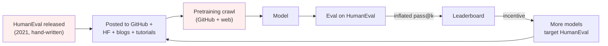
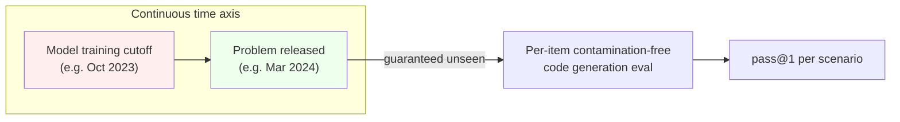

# Day 11 — Code generation: pass@k, exec-based scoring, and contamination-resistant successors

## The opening hook

A code benchmark sits in a privileged position relative to every other capability eval in this curriculum. For MMLU, GPQA, or TruthfulQA, the scoring rule is some flavor of "compare a string to a reference string" — exact match, log-likelihood, judge model — each with its own failure modes (Days 2–3). For code, the scoring rule is **the model's output is fed to a Python interpreter and run against unit tests**. There is no judge, no semantic-similarity threshold, no rubric. The test either passes or it doesn't. That property — **execution-based scoring** — is what makes code generation the cleanest pedagogical target for the *metric* side of capability evaluation.

What is *not* clean is the **data** side. The reference benchmark, **HumanEval** (Chen et al. 2021), is 164 hand-authored Python problems sitting on GitHub in plaintext, mirrored across thousands of forks, dataset cards, blog posts, and tutorial notebooks. By 2024, HumanEval had effectively *saturated* — frontier models score 95%+ on it (per the Day 7 saturation arc) — and there is strong evidence that a non-trivial fraction of those points come from memorization rather than synthesis (Riddell et al. 2024). This is the same Goodhart-collapse pattern from D6: a benchmark that became the optimization target leaked into pretraining.

**LiveCodeBench** (Jain et al. 2024) is the methodologically-resistant successor. It uses the same execution-based scoring, but sources problems from competitive-programming contests *after* a known training cutoff, and tags every problem with its release date so a researcher can filter to "only items the model could not have seen." This is the structural fix — not a better metric, a benchmark designed so contamination is *demonstrably* absent on a per-item basis.

Today is `pass@k` mechanics, the HumanEval contamination story, and the post-cutoff sampling design that replaces it.

## The pipeline, applied to code

Code evaluation has the same (dataset, scoring rule, reporting convention) shape as any benchmark from Day 1, but each box has a code-specific instantiation:

```mermaid
flowchart LR
    P["Problem<br/>(signature + docstring)"] -->|prompt| M{{"Model<br/>(stochastic; n samples)"}}
    M -->|n completions| EXEC["Execute<br/>(Python sandbox)"]
    EXEC -->|tests| C["c correct<br/>out of n"]
    C -->|pass@k estimator| PK["pass@k<br/>(per problem)"]
    PK -->|mean over problems| HN[Headline number]
```

The two non-obvious boxes are **the sandbox** (you are running model-generated code, which you should treat as untrusted — `human-eval` ships with `execution.py` opt-in and explicitly warns about it) and **the pass@k estimator** itself, which is more subtle than it first looks.

## Anchor: HumanEval (Chen et al. 2021)

**Citation.** Chen, M., Tworek, J., Jun, H., Yuan, Q., Pinto, H. P. de O., Kaplan, J., Edwards, H., Burda, Y., Joseph, N., Brockman, G., Ray, A., Puri, R., Krueger, G., Petrov, M., Khlaaf, H., Sastry, G., Mishkin, P., Chan, B., Gray, S., Ryder, N., Pavlov, M., Power, A., Kaiser, L., Bavarian, M., Winter, C., Tillet, P., Such, F. P., Cummings, D., Plappert, M., Chantzis, F., Barnes, E., Herbert-Voss, A., Guss, W. H., Nichol, A., Paino, A., Tezak, N., Tang, J., Babuschkin, I., Balaji, S., Jain, S., Saunders, W., Hesse, C., Carr, A. N., Leike, J., Achiam, J., Misra, V., Morikawa, E., Radford, A., Knight, M., Brundage, M., Murati, M., Mayer, K., Welinder, P., McGrew, B., Amodei, D., McCandlish, S., Sutskever, I., & Zaremba, W. (2021). *Evaluating Large Language Models Trained on Code.* arXiv:2107.03374. (The Codex paper.)

**What HumanEval is.**

- **164 hand-written Python programming problems**, authored at OpenAI specifically *not* to be in pretraining (the paper notes this; in practice we will see this guarantee leaked anyway).
- Each problem ships as a **function signature + docstring + canonical solution + a hidden test suite**, with **~7.7 unit tests per problem on average**.
- Released as a Hugging Face dataset (`openai/openai_humaneval`) under **MIT license**.

A canonical item — `HumanEval/0`, `has_close_elements` — looks like this:

```python
from typing import List

def has_close_elements(numbers: List[float], threshold: float) -> bool:
    """ Check if in given list of numbers, are any two numbers closer to each
    other than given threshold.
    >>> has_close_elements([1.0, 2.0, 3.0], 0.5)
    False
    >>> has_close_elements([1.0, 2.8, 3.0, 4.0, 5.0, 2.0], 0.3)
    True
    """
```

The model receives the prompt up to (but not including) the function body. Its job is to produce the body. The hidden test file (not shown to the model) contains assertions of the form `assert candidate([1.0, 2.0, 3.9, 4.0, 5.0, 2.2], 0.3) == True` and similar. The completion is concatenated to the prompt, the resulting Python file is executed in a sandbox, and the model's sample is scored as **correct iff every test in the suite passes**.

That single boolean — passes-all-tests vs. doesn't — is the per-sample score. Aggregating across $n$ samples per problem and across 164 problems is where `pass@k` enters.

### `pass@k` mechanics: the unbiased estimator

The naive thing is to sample $k$ completions per problem, score each, and report the fraction of problems where at least one of the $k$ samples is correct. That works, but has high variance and is wasteful — it discards information from any sampling beyond $k$. The standard practice from Chen et al. 2021 instead samples $n \geq k$ completions per problem, counts how many are correct ($c$), and uses an **unbiased estimator** for the probability that a random size-$k$ subset of those $n$ contains at least one correct sample:

$$
\text{pass@}k := \mathop{\mathbb{E}}_{\text{problems}} \left[ 1 - \frac{\binom{n - c}{k}}{\binom{n}{k}} \right]
$$

The intuition is hypergeometric. Of the $n$ samples, $c$ are correct and $n - c$ are wrong. The probability that a uniformly-random subset of size $k$ misses *every* correct sample is $\binom{n-c}{k} / \binom{n}{k}$ (choose $k$ from the wrong-only pool, divide by total ways to choose $k$). One minus that is the probability that at least one of the $k$ samples in the subset is correct — which is *the per-problem pass@k for this problem given $n$ samples observed*. Average over the 164 problems for the headline.

**Why naive `c / n` is not pass@k.** The naive estimator $\hat{p}_{\text{naive}} = c / n$ estimates the probability that *one* sampled completion is correct (i.e., pass@1). It does **not** estimate pass@k for $k > 1$, and the function $f(p) = 1 - (1 - p)^k$ that maps $p$ to "probability at least one of $k$ i.i.d. samples is correct" is non-linear, so $\mathbb{E}[1 - (1-\hat{p})^k] \neq 1 - (1-\mathbb{E}[\hat{p}])^k$ in general. Chen et al. point out specifically that the plug-in estimator $1 - (1 - c/n)^k$ is **biased**: it systematically overestimates pass@k because $f$ is concave in $p$ (Jensen's inequality, in the right direction here). The hypergeometric formula above is exactly the unbiased correction.

Two sanity checks:

- **At $k = 1$**: the formula reduces to $1 - \binom{n-c}{1}/\binom{n}{1} = 1 - (n-c)/n = c/n$. Pass@1 is just the empirical sample-correct rate, as you'd expect.
- **At $k = n$**: the formula reduces to $1 - \binom{n-c}{n}/\binom{n}{n}$. If $c \geq 1$, $\binom{n-c}{n} = 0$ (you can't choose $n$ items from a pool of fewer than $n$), so pass@n = 1; if $c = 0$, $\binom{n}{n}/\binom{n}{n} = 1$ and pass@n = 0. Pass@n is "did *any* of the $n$ samples pass?", which is exactly right.

The reference implementation from `openai/human-eval` is a few lines:

```python
import numpy as np

def pass_at_k(n: int, c: int, k: int) -> float:
    """Unbiased estimator from Chen et al. 2021. n = samples drawn,
    c = number correct, k = the k in pass@k. Requires n >= k."""
    if n - c < k:
        return 1.0
    # Compute 1 - C(n-c, k) / C(n, k) stably as a product:
    return 1.0 - np.prod(1.0 - k / np.arange(n - c + 1, n + 1))
```

The product form avoids overflow on large binomials. Standard practice is $n = 200$ for stable pass@1 / pass@10 / pass@100 reports; the `pass@1`, `pass@10`, `pass@100` triple is what most code-LLM papers cite.

### Sampling temperature: why you do not use the same temperature for every $k$

Chen et al. note that the sampling temperature that maximizes pass@1 is *lower* than the temperature that maximizes pass@100. Intuitively: pass@1 wants the single most-confident completion (low entropy), but pass@100 wants 100 *diverse* completions that collectively cover the solution space (higher entropy buys coverage). The Codex paper recommends temperature $\approx 0.2$ for pass@1 and $\approx 0.8$ for pass@100; mid-range $k$ uses an intermediate temperature. **A pass@k number reported without its sampling temperature is under-specified.** This is the code-eval analog of "n-shot and prompt template" being under-specified for MMLU (Day 1).

## The HumanEval contamination story

HumanEval's authors took care to hand-write the items so they wouldn't be in pretraining at the time of the Codex paper (2021). Two things happened in the four years since:

1. The dataset was uploaded to GitHub (the canonical location for code data) and to Hugging Face (the canonical location for benchmark data), where every subsequent pretraining crawl would index it.
2. Thousands of blog posts, tutorial notebooks, and YouTube transcripts now discuss specific HumanEval items by name and walk through their solutions. `has_close_elements` is in StackOverflow answers, in PyTorch tutorials, in interview-prep repos, and in dozens of "how I built a code LLM from scratch" posts.

The resulting picture, anchored to the contamination definitions from D6:

- **Verbatim contamination**: extreme. The HumanEval JSONL file is on GitHub. Any pretraining crawl that includes GitHub includes HumanEval verbatim — including the canonical solutions and test cases.
- **Paraphrase contamination**: extensive. Every blog post that walks through "the HumanEval problems" rewords each docstring at least slightly.
- **Indirect contamination**: total. There is no popular code LLM published after 2022 whose pretraining data plausibly excludes commentary on HumanEval.

**Quantitative evidence.** Riddell et al. (2024), *Quantifying Contamination in Evaluating Code Generation Capabilities of Language Models* (ACL 2024), measure exact and near-duplicate overlap between HumanEval items and The Stack (a public code pretraining corpus that is a subset of what frontier labs use). They find **substantial overlap** — both surface-level (string matching) and semantic (Dolos-toolkit similarity) — between HumanEval items and pretraining-corpus content. The paper's headline is that contamination is empirically measurable and large enough to inflate pass@1 reports on contaminated subsets relative to held-out subsets.

This is the same Goodhart loop from D6, instantiated on code:



By 2024, HumanEval had **saturated**: frontier models score 95%+ pass@1 (per public leaderboards as of 2026, with some reports above 97% — drift caveat from D7 applies; treat exact numbers as time-varying). That saturation is partly real capability and partly contamination-driven inflation; the two are not separable from outside the labs without held-out replicates.

### EvalPlus: the *test-coverage* critique, separate from contamination

Before getting to LiveCodeBench, one more critique of HumanEval that is worth keeping distinct from contamination. Liu et al. (2023), *Is Your Code Generated by ChatGPT Really Correct?* (NeurIPS 2023, arXiv:2305.01210), point out that HumanEval's ~7.7 tests per problem are **insufficient to actually verify functional correctness**: many wrong solutions pass all of HumanEval's tests because the tests don't cover edge cases. The EvalPlus toolkit augments HumanEval with **~80× more tests per problem** (auto-generated via type-aware mutation + LLM-driven seeding), producing **HumanEval+**. On HumanEval+, frontier-model pass@1 scores drop by **roughly 19–28 percentage points** vs. plain HumanEval, and the *ranking* of models can flip — WizardCoder and Phind-CodeLlama beat ChatGPT on HumanEval+, despite losing on plain HumanEval.

The HumanEval+ critique is *not* the contamination critique. It is the orthogonal point that **HumanEval's tests are a weak oracle** — passing them is necessary but not sufficient for correctness. A practitioner reporting HumanEval numbers in 2026 should be reporting HumanEval+ alongside, the way Day 1's MMLU practitioner should be reporting `acc` *and* `acc_norm`. EvalPlus addresses the *scoring rule* leg of the (dataset, scoring rule, reporting convention) triple; LiveCodeBench addresses the *dataset* leg.

## Anchor (overlay): LiveCodeBench (Jain et al. 2024)

**Citation.** Jain, N., Han, K., Gu, A., Li, W.-D., Yan, F., Zhang, T., Wang, S., Solar-Lezama, A., Sen, K., & Stoica, I. (2024). *LiveCodeBench: Holistic and Contamination Free Evaluation of Large Language Models for Code.* arXiv:2403.07974.

LiveCodeBench's design is the structural answer to the HumanEval contamination story. The construction:

- **Source**: programming problems are scraped continuously from three competitive-programming platforms — **LeetCode**, **AtCoder**, and **Codeforces**. These platforms post new contests regularly; each contest's problems become available *only when the contest is released*.
- **Date tagging**: every problem is annotated with its **release date** on the source platform. This is the load-bearing methodological move: a researcher evaluating a model with a known training-data cutoff (say, October 2023) restricts the eval to problems released *after* October 2023, guaranteeing per-item that the problem could not have been in training.
- **Scope**: the original paper reports **~400 problems from May 2023 to May 2024**; the live benchmark grows over time as more contests are added (current counts are higher and drift; verify against the live leaderboard before quoting).
- **Four scenarios**, not just code generation:
  1. **Code generation** — the HumanEval-style task: produce a function that solves the problem.
  2. **Self-repair** — given a broken solution and the failing test, produce a fix.
  3. **Code execution** — given a function and an input, predict the output (no code generation; tests *understanding* of code).
  4. **Test output prediction** — given a function and a test, predict whether it passes and what the output is.
- **Scoring**: execution-based, per-problem pass@1 (and higher $k$ on subsets), aggregated by scenario.

The contamination resistance is **per-item and demonstrable** rather than statistical: when you filter to problems released after the model's training cutoff, those problems were not on any platform — and therefore not in any web crawl — at training time. This is what D7 calls *structural* (rather than gatekept) saturation/contamination resistance. ARC-AGI's private split achieves the same property by withholding the items; LiveCodeBench achieves it by *time-shifting the items* relative to the training data.



The trade-offs vs. HumanEval:

- **Saturation timeline.** Frontier-model pass@1 on the post-cutoff slice is meaningfully *lower* than on HumanEval — e.g., as of 2026, HumanEval pass@1 sits at 95%+ for top models while LiveCodeBench-derived leaderboards (including LiveCodeBench Pro, an Elo-rated 2026 successor) discriminate frontier models cleanly across multiple-hundred-rating gaps. Headroom is restored.
- **Difficulty distribution.** Competitive-programming problems are *harder* than HumanEval's docstring-driven function tasks — they involve algorithmic reasoning (graph algorithms, dynamic programming, number theory) rather than translating an English spec into a 5-line Python function. This is part of the saturation-resistance story but is also a confound: a model can be "good at HumanEval-style synthesis" and "bad at competitive programming" without contradiction.
- **Continual update.** LiveCodeBench's release-date tagging means the benchmark itself moves forward in time, perpetually outpacing model training cutoffs. The "v1 saturated, build v2" loop from D6/D7 is replaced with a *continual* pipeline. The cost: scores on LiveCodeBench at time $T_1$ vs. $T_2$ are not directly comparable unless the underlying problem set is held constant, which is not the default.

## Conceptual contrast: HumanEval vs. LiveCodeBench

A side-by-side, mapped to the (dataset, scoring rule, reporting convention) triple from D1:

| Axis | HumanEval | LiveCodeBench |
| --- | --- | --- |
| Dataset | 164 hand-written Python function tasks (static, 2021) | Continuously-scraped competitive-programming problems with release-date tags (live, 2023–) |
| Source | Hand-authored at OpenAI | LeetCode + AtCoder + Codeforces |
| Difficulty | Beginner → intermediate algorithmic synthesis from English specs | Easy → hard competitive programming (DP, graphs, number theory) |
| Scoring rule | Exec-based, ~7.7 tests/problem, pass@k | Exec-based, contest-grade test suites, pass@k across 4 scenarios |
| Scoring oracle strength | Weak (HumanEval+ adds 80× more tests; pass@1 drops 19–28 pp) | Stronger (contest test suites are designed adversarially) |
| Contamination posture | Heavily contaminated as of 2024 (Riddell et al. 2024) | Per-item-demonstrably-clean by post-cutoff filtering |
| Saturation as of 2026 | Saturated at 95%+ pass@1 | Not saturated; frontier-model gaps are large and rankings are stable |
| Update cadence | None (static) | Continuous (new contests → new problems) |

The pattern from D7 — *saturated predecessor, contamination-resistant successor* — is exactly this table. Same execution-based scoring methodology, structurally-different data pipeline.

## Forward pointer

**D12 (SWE-Bench)** pushes code evaluation past the function-synthesis frame entirely: the unit of evaluation becomes a real GitHub issue with a real multi-file patch, scored by the real test suite the project ships. HumanEval and LiveCodeBench evaluate "can the model write a function?" — SWE-Bench Verified evaluates "can the model navigate a codebase, find the bug, write the fix, and not break existing tests?" That is the agentic frontier of code eval; pass@k mechanics carry over but the dataset, scoring rule, and reporting convention all upgrade. **D25 (reasoning-model / inference-time-scaling evaluation)** revisits competitive-programming evals — AIME, FrontierMath, and the Codeforces/ICPC-style problems that LiveCodeBench Pro now uses for Elo-rated reasoning-model leaderboards — under the cost-axis Pareto framing that pass@1 vs. pass@1024 vs. cons@N raises.

> **Safety researcher's note.** `pass@k` aggregation has a specific safety-relevant pathology that does not show up in MMLU-style accuracy metrics. The naive "model wins if any of $k$ samples passes" framing rewards generating many candidates and selecting the one that passes — which is a perfectly reasonable eval signal for capability, but is *also* the structure of an attack on test-suite-based oracles. If a model can generate adversarial test cases that the reference solution does not pass (or the reference solution does pass but for reasons the human-written test suite does not capture), pass@k inflates without genuine capability gain. Riddell et al. (2024) and the EvalPlus line of work both implicitly trust the reference test suite as a strong oracle; that trust is exactly what HumanEval+ shows is unwarranted on plain HumanEval. For agent and reasoning models that sample $k = 100$ or $k = 1024$ at inference time (D25), the failure mode "model finds a way to pass the tests that does not generalize" becomes a non-trivial threat surface — including, for capable enough systems, the reward-hacking variant where the model edits or learns to game the test harness itself. The mitigation isn't a different scalar metric; it's adversarial test-case generation (EvalPlus-style) plus held-out test suites the model never sees, plus per-item exec sandboxing that resists tampering. The cleanest framing: pass@k is an honest measure of *coverage under a fixed oracle*, but the oracle's strength is a separate axis that benchmark reports almost never quantify.

## Takeaways

1. Code evaluation is the cleanest example of **execution-based scoring**: the model's output is run in a sandbox against unit tests, and the score is a boolean per sample. No judge, no semantic threshold, no rubric.
2. **`pass@k`** (Chen et al. 2021) reports the probability that at least one of $k$ samples is correct, estimated unbiasedly from $n \geq k$ samples per problem as $1 - \binom{n-c}{k}/\binom{n}{k}$, averaged over problems. The naive plug-in $1 - (1 - c/n)^k$ is **biased** (overestimates).
3. A `pass@k` number is under-specified without its **sampling temperature**: pass@1 wants low temperature (~0.2), pass@100 wants higher temperature (~0.8) for diversity.
4. **HumanEval (164 hand-written Python tasks, MIT-licensed)** is the canonical code-LLM benchmark and the locus where pass@k was defined. As of 2026 it is heavily contaminated (Riddell et al. 2024) and saturated at 95%+ pass@1.
5. **HumanEval+ (Liu et al. 2023, EvalPlus)** is an orthogonal critique: ~80× more tests catches wrong-but-passes-the-tests solutions, dropping pass@1 by 19–28 pp and re-ranking models. Strengthens the *scoring oracle*; doesn't address contamination.
6. **LiveCodeBench (Jain et al. 2024)** is the structural-contamination-resistance successor: post-cutoff problem sourcing from LeetCode/AtCoder/Codeforces with per-problem release-date tags. Four scenarios (code generation, self-repair, code execution, test output prediction). Restores headroom and gives *per-item* contamination guarantees rather than statistical ones.
7. The HumanEval → LiveCodeBench arc is the same Goodhart-collapse-then-redesign pattern as MMLU → MMLU-Pro (D6) and the GPQA-saturation framing (D7), instantiated on code. Day 12 (SWE-Bench) extends it from function synthesis to multi-file agentic code eval.

## References

- **Anchor (HumanEval, pass@k).** Chen, M., Tworek, J., Jun, H., Yuan, Q., et al. (2021). *Evaluating Large Language Models Trained on Code.* arXiv:2107.03374. https://arxiv.org/abs/2107.03374
- **Anchor overlay (LiveCodeBench).** Jain, N., Han, K., Gu, A., Li, W.-D., Yan, F., Zhang, T., Wang, S., Solar-Lezama, A., Sen, K., & Stoica, I. (2024). *LiveCodeBench: Holistic and Contamination Free Evaluation of Large Language Models for Code.* arXiv:2403.07974. https://arxiv.org/abs/2403.07974
- **HumanEval contamination evidence.** Riddell, M., Ni, A., & Cohan, A. (2024). *Quantifying Contamination in Evaluating Code Generation Capabilities of Language Models.* ACL 2024. arXiv:2403.04811. https://arxiv.org/abs/2403.04811
- **HumanEval+ / EvalPlus (test-coverage critique).** Liu, J., Xia, C. S., Wang, Y., & Zhang, L. (2023). *Is Your Code Generated by ChatGPT Really Correct? Rigorous Evaluation of Large Language Models for Code Generation.* NeurIPS 2023. arXiv:2305.01210. https://arxiv.org/abs/2305.01210
- **Reference implementation (HumanEval, `pass_at_k`).** OpenAI. *human-eval* (MIT). https://github.com/openai/human-eval
- **HumanEval dataset card.** Hugging Face. *openai/openai_humaneval* (MIT). https://huggingface.co/datasets/openai/openai_humaneval
- **LiveCodeBench live leaderboard.** https://livecodebench.github.io/leaderboard.html
- **Forward — SWE-Bench (D12 anchor).** Jimenez, C. E., et al. (2023). *SWE-bench: Can Language Models Resolve Real-World GitHub Issues?* arXiv:2310.06770.

## Quiz

**Q1.** A model is sampled $n = 200$ times on a given HumanEval problem and $c = 40$ samples pass all unit tests. What is the unbiased estimate of pass@1 for this problem?

- A. $c/n = 40/200 = 0.20$
- B. $1 - (1 - c/n)^k = 1 - (160/200)^1 = 0.20$
- C. $1 - \binom{n-c}{k}/\binom{n}{k} = 1 - \binom{160}{1}/\binom{200}{1} = 0.20$
- D. All of the above; at $k = 1$ they coincide.

**Q2.** Why is the plug-in estimator $1 - (1 - c/n)^k$ biased for pass@k when $k > 1$?

- A. It underestimates pass@k because $f(p) = 1 - (1-p)^k$ is convex in $p$, so the plug-in deflates by Jensen's inequality.
- B. It overestimates pass@k because $f(p) = 1 - (1-p)^k$ is concave (Jensen's inequality).
- C. It is only biased when $n < k$, since the hypergeometric estimator is undefined for $n < k$.
- D. It is unbiased; Chen et al. 2021 use it as the canonical estimator in the human-eval reference repo.

**Q3.** A practitioner reports "Model X achieves pass@100 = 0.85 on HumanEval." Which piece of information is **most necessary** to interpret this number, beyond what's stated?

- A. The exact Python version used in the sandbox, since CPython 3.11's bytecode changes can affect timing-sensitive unit tests.
- B. The sampling temperature used during decoding.
- C. The model's parameter count, since pass@k variance scales with parameter count for a fixed sampling budget.
- D. Whether `numpy` and `scipy` are installed in the sandbox, since several HumanEval reference solutions import them implicitly.

**Q4.** A model is sampled $n = 5$ times on a problem. Three samples are correct ($c = 3$). Using the unbiased estimator, what is pass@2 for this problem?

- A. $1 - \binom{2}{2}/\binom{5}{2} = 1 - 1/10 = 0.9$
- B. $1 - (1 - 3/5)^2 = 1 - 0.16 = 0.84$ from the standard plug-in formula
- C. $3/5 = 0.6$, the empirical fraction of correct samples
- D. $1 - \binom{3}{2}/\binom{5}{2} = 1 - 3/10 = 0.7$ from the hypergeometric estimator

**Q5.** What is the *structural* difference between HumanEval and LiveCodeBench that makes LiveCodeBench contamination-resistant?

- A. LiveCodeBench replaces execution-based scoring with a stronger LLM-as-judge model that grades outputs against a contest-style rubric.
- B. Problems carry release-date tags; filtering to post-cutoff items guarantees per-item contamination-freedom.
- C. LiveCodeBench problems are authored in Rust and OCaml rather than Python, which prevents string-level memorization from pretraining crawls.
- D. LiveCodeBench keeps a private held-out test set behind an API gate that no submission ever sees, similar to ARC-AGI's hidden split.

**Q6.** Liu et al. (2023, EvalPlus / HumanEval+) and Riddell et al. (2024) are *both* critiques of HumanEval, but they target different legs of the (dataset, scoring rule, reporting convention) triple. Which best describes the distinction?

- A. They are the same critique restated using slightly different vocabulary across the two papers.
- B. EvalPlus targets the scoring rule and Riddell et al. target the dataset; the critiques are orthogonal.
- C. EvalPlus targets the dataset (overlap with pretraining corpora) while Riddell et al. target the scoring rule (test-suite weakness).
- D. EvalPlus measures pretraining contamination overlap, and Riddell et al. propose stronger test suites to address weak-oracle problems.

<details>
<summary>Answers</summary>

1. **D** — at $k = 1$ the unbiased estimator collapses to $c/n$ (since $\binom{n-c}{1}/\binom{n}{1} = (n-c)/n$), so all three expressions are algebraically identical: $40/200 = 0.20$. The pedagogical point is that pass@1 is the simplest case and the formulas all agree there; the divergence between estimators only matters at $k > 1$.
2. **B** — by Jensen's inequality, for a concave $f$, $\mathbb{E}[f(\hat{p})] \leq f(\mathbb{E}[\hat{p}])$, so the plug-in overestimates the expectation. Chen et al. 2021 explicitly call this out and derive the hypergeometric correction.
3. **B** — the temperature-sensitivity point from "Sampling temperature: why you do not use the same temperature for every $k$." A pass@100 reported at temperature 0.2 is a different (and worse) measurement than one at temperature 0.8. This is the code-eval analog of "n-shot and prompt template" being load-bearing for MMLU.
4. **A** — apply the unbiased estimator with $n = 5$, $c = 3$, $k = 2$: $\binom{n-c}{k}/\binom{n}{k} = \binom{2}{2}/\binom{5}{2} = 1/10$, so pass@2 $= 1 - 1/10 = 0.9$. (Distractor B is the *biased* plug-in $1 - (1 - c/n)^k = 0.84$ — close to the right answer, which is exactly the kind of small bias the unbiased estimator removes. Distractor C is pass@1, not pass@2. Distractor D miscomputes by using $\binom{c}{k}$ instead of $\binom{n-c}{k}$, a common direction-of-counting error.)
5. **B** — post-cutoff release-date tagging is the load-bearing structural property. (A) is wrong: LiveCodeBench uses execution-based scoring, not a judge. (C) is wrong: problems are language-flexible but typically Python. (D) describes ARC-AGI's design, not LiveCodeBench's.
6. **B** — the EvalPlus critique is that the *test suite* is a weak oracle (scoring rule); the Riddell et al. critique is that the *items* leaked into training (dataset). They are orthogonal; a HumanEval+ report on a contamination-free held-out item set would address both.

</details>
