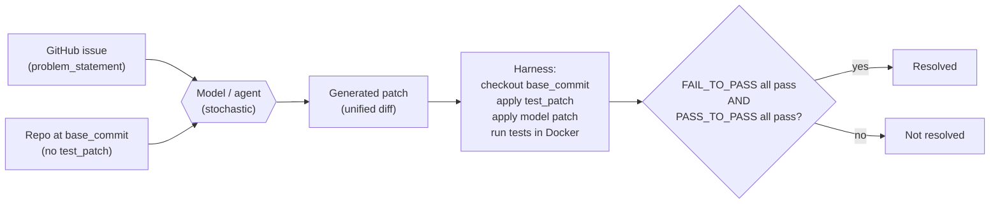

# Day 12 — SWE-Bench: from function synthesis to repository-grounded edits

## TL;DR

SWE-Bench evaluates whether an agent can fix a real GitHub issue: given a problem statement and a repo at `base_commit`, the agent must produce a unified diff that, when applied, makes a held-out test patch's `FAIL_TO_PASS` items pass without breaking `PASS_TO_PASS` items. The substantive jump from [D-11](/lesson/11)'s HumanEval is the *unit of work* — function body to multi-file repo patch with localization required and tests hidden until evaluation time. **SWE-Bench Verified** (500 human-curated instances) is the canonical anchor; **SWE-agent** (Yang et al. 2024) is the canonical scaffold and the Agent-Computer Interface idea — that small interface choices move the score as much as model gains — is the methodological lesson that recurs on [D-26](/lesson/26).

## Learning objectives

By the end of this lesson, you will be able to:

1. **(L2)** State SWE-Bench's resolution rule — `FAIL_TO_PASS` $\wedge$ `PASS_TO_PASS` under a Docker-isolated, judge-free harness — and identify why this is methodologically cleaner than [D-11](/lesson/11)'s pass@k for shipped-code questions.
2. **(L3)** *Compute* the curation retention rate from the SWE-Bench Verified pipeline (500 retained from a 1,699-instance sample) and use it to explain the empirical effect of curation (the GPT-4 Resolved-rate roughly tripling from the original benchmark to Verified).
3. **(L4)** *Decompose* a single SWE-Bench instance into its load-bearing fields (`problem_statement`, `base_commit`, `patch`, `test_patch`, `FAIL_TO_PASS`, `PASS_TO_PASS`) and identify which the model sees, which the harness applies, and which is the scoring oracle.
4. **(L4)** *Contrast* SWE-Bench (repo-scale, hidden tests) with HumanEval (function-scale, visible tests) along unit-of-work, localization, test-visibility, and scoring axes.
5. **(L5)** *Evaluate* a 2026 system-card SWE-Bench Verified score (e.g. 82%) with respect to scaffold-dependence, contamination posture, and the binomial CI on a 500-item benchmark.
6. **(L4)** Articulate the Agent-Computer Interface (ACI) framing — that scaffolding is part of the system under test — and link it forward to the same pattern in [D-26](/lesson/26) (web agents).

## Prerequisites & callback

This lesson presupposes **[D-11](/lesson/11)'s HumanEval / pass@k machinery** as the load-bearing prior. [D-11](/lesson/11) introduced *execution-based scoring* — the model's output is fed to an interpreter and run against unit tests, no judge in the loop — and pass@k as the unbiased estimator that summarizes "does the model produce correct code?" across multiple samples. SWE-Bench keeps the execution-based-scoring move and abandons everything else: the unit of work shifts from *function body* to *multi-file repository patch*; the test suite shifts from *visible at training time* to *hidden until the harness applies it*; and the per-item score shifts from a sample-budget pass@k to a binary `% Resolved`. The contamination thread [D-11](/lesson/11) names (HumanEval public since 2021, ~95% saturated, post-cutoff successor LiveCodeBench) recurs here in a structurally similar way: SWE-Bench's instances are public GitHub PRs from before October 2023, and post-cutoff successors (SWE-Bench Live, SWE-rebench, SWE-Bench Pro) exist for the same reason. What changes most is the *realism axis* — SWE-Bench is closer to the loop a working software engineer is actually in than HumanEval has ever been.

## The opening hook

Yesterday ([D-11](/lesson/11)) the model was given a function signature and a docstring and asked to fill in a body. The unit tests were small, the file was one screen long, and the only state the model had to track was the local namespace. HumanEval works because the *unit of evaluation* is the function.

Today the unit changes. The model is given:

- A real GitHub issue ("`ModelChoiceField.to_python` raises `TypeError` instead of `ValidationError` when given an invalid PK"), pasted as plain text.
- A snapshot of the entire repository (Django, ~3,000 files, ~250k lines of Python) at the commit *before* the bug fix landed.
- No pointer to where the bug is.
- No pointer to which tests will be used.

The model has to localize the bug, edit one or more files, and produce a unified diff. That diff is then applied to the repo, and a held-out test suite — the patch the human maintainer wrote when they actually fixed the issue — runs in a Docker container. The model "resolves" the issue iff every previously-failing test now passes and every previously-passing test still passes.

This is **SWE-Bench**. The substantive shift from [D-11](/lesson/11) isn't difficulty. It's that the eval target moved from *synthesis of an isolated function* to *grounded edits to existing code under hidden tests*. That shift — from function-shaped to repository-shaped problems — is what made SWE-Bench the canonical anchor for "agentic" code evaluation.

## Why HumanEval doesn't measure this

SWE-Bench and HumanEval are both code-generation benchmarks scored by execution. They are different evals.

| Axis | HumanEval ([D-11](/lesson/11)) | SWE-Bench |
| --- | --- | --- |
| **Unit of work** | Function body | Multi-file patch |
| **Context** | Function signature + docstring (~30 lines) | Whole repo (~$10^4$–$10^6$ LOC) |
| **What the model produces** | Function source | Unified diff |
| **Localization** | Free — the prompt names the function | Required — the model has to find the bug |
| **Tests** | Visible at training time (164 problems are public) | Hidden at submission time; revealed only inside the harness |
| **Failure modes** | Off-by-one, edge-case logic, type confusion | All of the above + wrong-file edits, broken-import fallout, unrelated-test regression |
| **Scoring** | `pass@k` over visible tests | `% Resolved` (hidden `FAIL_TO_PASS` + `PASS_TO_PASS`) |
| **What it tests** | Local synthesis | Repository-grounded edit under realistic test discipline |

The HumanEval-to-SWE-Bench jump is *not* "harder synthesis." It is a different evaluation philosophy. HumanEval asks: given a clean specification, can the model produce code? SWE-Bench asks: given an underspecified bug report and a real codebase, can the model localize the problem, make a minimal correct edit, and not break anything else? The second framing is closer to the loop a working software engineer is actually in. It is also where most modern "coding agent" work — Cursor's tab agent, GitHub Copilot Workspace, Claude Code, OpenAI's Codex agent — is benchmarked.

## Anchor: SWE-Bench (Jimenez et al. 2023)

**Citation.** Jimenez, C. E., Yang, J., Wettig, A., Yao, S., Pei, K., Press, O., & Narasimhan, K. (2023). *SWE-bench: Can Language Models Resolve Real-World GitHub Issues?* arXiv:2310.06770. ICLR 2024.

SWE-Bench locks in a single methodological move: *evaluation by per-instance Docker-isolated test execution against a held-out maintainer-authored test patch.* That move is what gives the benchmark its judge-free, fully-mechanical scoring rule and what made it the natural anchor for "agentic" code evaluation through 2024–2026.

### Construction

From 12 popular Python repositories — `django`, `scikit-learn`, `sympy`, `matplotlib`, `flask`, `requests`, `astropy`, `pytest`, `pylint`, `xarray`, `seaborn`, `sphinx` — the authors mined merged pull requests that (a) closed an issue and (b) modified at least one test file. Each PR yielded one task instance:

| Field | What it is |
| --- | --- |
| `repo` | e.g. `"django/django"` |
| `base_commit` | SHA of the parent commit — the repo state *before* the fix |
| `problem_statement` | The text of the GitHub issue |
| `patch` | The maintainer's gold patch (source files only) — held out from the model |
| `test_patch` | The maintainer's gold patch (test files only) — held out from the model and applied at evaluation time |
| `FAIL_TO_PASS` | List of test IDs that fail at `base_commit` and must pass after the model's patch is applied |
| `PASS_TO_PASS` | List of test IDs that pass at `base_commit` and must still pass after the model's patch is applied |

The original benchmark contains **2,294** instances across the 12 repositories. The dominant repo by instance count is Django (~850), then sympy (~386) and scikit-learn (~229); Flask contributes 11. Skew matters: a model that's good at Django ORM bugs will look good on aggregate even if it's weak elsewhere.

### Example item

A single SWE-Bench instance is a JSON record bundling the issue text, the repo state, and the held-out gold patches. Example (Django, abbreviated):

```json
{
  "repo": "django/django",
  "instance_id": "django__django-13447",
  "base_commit": "0ed7d155635da32e7bef4ed9b5f1f8a8da9b4f0f",
  "problem_statement": "ModelChoiceField does not provide value of invalid choice when raising ValidationError. The error message uses 'invalid_choice' but does not include the offending value, making debugging form errors harder.",
  "hints_text": "",
  "created_at": "2020-09-23T13:42:11Z",
  "version": "3.2",
  "patch": "diff --git a/django/forms/models.py b/django/forms/models.py\n@@ ...\n-            raise ValidationError(self.error_messages['invalid_choice'], code='invalid_choice')\n+            raise ValidationError(\n+                self.error_messages['invalid_choice'],\n+                code='invalid_choice',\n+                params={'value': value},\n+            )",
  "test_patch": "diff --git a/tests/forms_tests/tests/test_modelchoicefield.py ...",
  "FAIL_TO_PASS": ["tests/forms_tests/tests/test_modelchoicefield.py::ModelChoiceFieldTests::test_invalid_pk"],
  "PASS_TO_PASS": ["tests/forms_tests/tests/test_modelchoicefield.py::ModelChoiceFieldTests::test_valid_pk", "..."]
}
```

The model sees only `problem_statement` plus the repo at `base_commit`. Both `patch` (the maintainer's source-file fix) and `test_patch` (the maintainer's test) are held out. At evaluation time the harness applies `test_patch` plus the model's predicted patch and runs the test sets in Docker. The boolean `resolved` flag is set iff every test in `FAIL_TO_PASS` and `PASS_TO_PASS` passes.

### Scoring rule

The metric is **`% Resolved`** — the fraction of instances on which both `FAIL_TO_PASS` and `PASS_TO_PASS` test sets pass. There is no partial credit. Either the patch ships or it doesn't. Three things deserve emphasis here, because they distinguish SWE-Bench from [D-11](/lesson/11):

1. **The `test_patch` is hidden from the model and applied at evaluation time, not at submission time.** The model never sees the tests. It also doesn't know which files in the repo will end up being tested. This is the part that makes the eval *grounded*: the model can't game the test suite because it can't see it.
2. **Both `FAIL_TO_PASS` and `PASS_TO_PASS` must succeed.** `FAIL_TO_PASS` is the regression-style "the bug is fixed" check (these tests were failing on `base_commit`; they must pass now). `PASS_TO_PASS` is the side-effects check (these tests were passing on `base_commit`; they must *still* pass). A patch that fixes the issue but breaks an unrelated test fails the instance. This is closer to what shipping the patch through code review would feel like.
3. **The harness runs in Docker, per-instance.** Each repository at each `base_commit` needs its own dependencies, Python version, build steps. The SWE-Bench harness ships per-instance images so reproducibility is mechanical: anyone running the harness against the same model patches gets the same `resolved` flag.

### Mechanics: how the harness runs an instance



A typical instance, in JSON:

```json
{
  "repo": "django/django",
  "base_commit": "0ed7d155635da32e7bef4ed9b5f1f8a8da9b4f0f",
  "problem_statement": "ModelChoiceField does not provide value of invalid choice when raising ValidationError ...",
  "patch": "diff --git a/django/forms/models.py ...",
  "test_patch": "diff --git a/tests/forms_tests/tests/test_modelchoicefield.py ...",
  "FAIL_TO_PASS": ["tests/forms_tests/...test_invalid_pk"],
  "PASS_TO_PASS": ["tests/forms_tests/...test_valid_pk", "..."]
}
```

The model sees only `problem_statement` and the repo at `base_commit`. The harness applies `test_patch` and the model's predicted patch, runs the test sets in Docker, and emits a single boolean `resolved` per instance.

## ⏵ Check yourself — resolution mechanics

A candidate patch makes all 4 `FAIL_TO_PASS` tests pass but causes 1 of 217 previously-passing `PASS_TO_PASS` tests to fail. Is the SWE-Bench instance resolved? Why does this differ from a partial-credit metric like pass@k from [D-11](/lesson/11)?

<details>
<summary>Show answer</summary>

**Not resolved.** SWE-Bench's resolution rule is "all `FAIL_TO_PASS` pass *and* all `PASS_TO_PASS` pass." A single regression on previously-passing functionality flips the boolean — there is no fractional credit. The patch demonstrably fixes the bug, but it ships a regression, and shipping a regression is exactly the property `PASS_TO_PASS` is designed to catch (the bug-fix-vs-merge gap from a real code-review loop). Pass@k from [D-11](/lesson/11) has no analogue of `PASS_TO_PASS`: every HumanEval problem is its own self-contained function with no "rest of the codebase" to regress, so pass@k can be a per-sample boolean averaged over a sample budget. SWE-Bench's resolution rule is intentionally stricter because the realism axis it targets — patch-as-shipped-PR — has no use for partial credit.

</details>

## SWE-Bench Verified (OpenAI, August 2024)

**Citation.** OpenAI Preparedness Team, with the SWE-Bench authors. *Introducing SWE-bench Verified.* August 13, 2024. https://openai.com/index/introducing-swe-bench-verified/

By mid-2024 the SWE-Bench team and the OpenAI Preparedness team had identified a problem with the original benchmark: a non-trivial fraction of the 2,294 instances were *not actually solvable* in the way the harness assumed. Three failure modes recurred:

1. **Underspecified issue text.** The problem statement was too vague to identify what behavior the model was supposed to produce. Different reasonable readings of the issue lead to different patches, only one of which passes the held-out tests.
2. **Tests that demand implementation specifics.** The hidden test patch checks for a particular function name, exception type, or attribute that the issue text doesn't mention. A semantically correct fix using a different name fails.
3. **Broken environment setup.** The Docker image fails to build, dependencies are pinned to versions that no longer install, or the test runner is mis-configured. The model cannot pass the instance no matter what it produces.

The fix was a human-annotation pass. **93 experienced Python developers** screened **1,699** randomly sampled instances against three quality criteria — issue-statement clarity, test-specification clarity, and environment reproducibility — and produced **SWE-Bench Verified**: a curated subset of **500 instances** that pass all three filters. SWE-Bench Verified is now the canonical anchor; "SOTA on SWE-Bench" without further qualification almost always means "SOTA on Verified."

The empirical effect of the curation was substantial. On the original SWE-Bench, GPT-4 (with a strong scaffold) was reported in the **1.7–4% Resolved** range; the same scaffold on Verified roughly *tripled* — not because the model got better but because the benchmark stopped penalizing models for instances no model could resolve. The headline reframe: **a chunk of "the model failed" turned out to be "the eval was wrong."**

This curation also doubles as a contamination-response mechanism, even though it wasn't framed that way in the announcement. Both the original SWE-Bench instances and the canonical agent harnesses have been on the public web for over a year — they are plausibly in modern pretraining and post-training corpora. SWE-Bench Verified narrows the surface (500 instances vs. 2,294) and lets follow-up audits target a smaller, cleaner set when contamination concerns surface (and they have; see the forward pointer to [D-25](/lesson/25) below).

## ⏵ Check yourself — curation arithmetic

GPT-4 with a strong scaffold reports 1.7–4% Resolved on the original 2,294-instance SWE-Bench. On Verified (500 instances) the *same* scaffold roughly triples that number. Compute what the headline gain is plausibly attributable to (model improvement vs. benchmark curation), and explain the mechanism by which the curation effect can in principle exceed any genuine capability change on this comparison.

<details>
<summary>Show answer</summary>

The model is the same — same checkpoint, same scaffold. So *none* of the gain is model improvement; all of it is benchmark curation. The mechanism: removing the ~30% of original instances that had under-specified issue text, over-specified hidden tests, or broken Docker images means the denominator stops counting instances no model could resolve. As a stylized arithmetic check, suppose 30% of the original 2,294 were unresolvable in principle and the model would have scored 4% on the resolvable subset; the original benchmark would report $4\% \times 0.7 \approx 2.8\%$, while Verified — which by construction contains the resolvable subset — would report the full 4%. The curation can produce a 1.5–3× headline shift purely from filter mechanics, before any genuine capability change. This is why the methodological reframe lands as "a chunk of 'the model failed' was 'the eval was wrong'" rather than "the model got better."

</details>

## SWE-agent and the Agent-Computer Interface (Yang et al. 2024)

**Citation.** Yang, J., Jimenez, C. E., Wettig, A., Lieret, K., Yao, S., Narasimhan, K., & Press, O. (2024). *SWE-agent: Agent-Computer Interfaces Enable Automated Software Engineering.* arXiv:2405.15793. NeurIPS 2024.

A model that just sees `problem_statement` and the repo file tree can't do much. To make SWE-Bench tractable you need a *scaffold* — an environment the model can read and write through. SWE-agent is the canonical reference scaffold and the paired publication for the SWE-Bench harness.

The paper's contribution is the **Agent-Computer Interface (ACI)**: a small, deliberately-designed set of commands the agent uses to interact with the repo (read file, search by string or regex, scroll, edit by line range, run tests, submit). The ACI's design is the surprising part of the paper — the authors found that *small interface choices* (line-numbered file viewer, structured edit command that diffs against the visible window, an explicit "submit" action) move the eval-quality needle as much as model-side improvements. SWE-agent's reported number on the original SWE-Bench was **12.5% Resolved with GPT-4** at release, which was state-of-the-art for an agent at the time and demonstrated that agent-style scaffolding closes most of the gap to the maintainers' own patches on resolvable instances.

The methodological lesson runs through Week 4: when an eval is agentic, *the harness scaffolding is part of the system under test*. Two papers reporting different SWE-Bench numbers for the same base model usually disagree on the agent loop, not on the model. We return to this in [D-26](/lesson/26) (web agents — WebArena) where the same scaffolding-determines-score pattern repeats with a different action surface.

## ⏵ Check yourself — scaffolding is part of the system

Two papers report SWE-Bench Verified `% Resolved` on the *same* base model — paper A reports 41%, paper B reports 67%. Neither paper retrained or fine-tuned the model. Decompose the most likely sources of the 26-point gap, and identify which Week 4 forward pointer this anticipates.

<details>
<summary>Show answer</summary>

The dominant source is the **agent scaffold**, not the model: ACI design (file viewer, search granularity, edit primitives, submit affordance), prompt orchestration, retry policy, context-window management for large repos, and the per-instance compute budget. Secondary sources are the harness version (image registry tag, pytest version) and per-instance budgets (max steps, max tokens, allowed tool calls). The methodological rule from Yang et al. 2024 is that *the scaffold is part of the system under test*; two SWE-Bench numbers for the same base model are almost always disagreements about the agent loop. This anticipates **[D-26](/lesson/26) (WebArena)**, where the same pattern repeats with a different action surface — webpage actions instead of repo edits — and headline scores are again dominated by scaffold choices.

</details>

## Frontier performance, mid-2026

The trajectory on SWE-Bench Verified has been steeper than almost any other anchor benchmark in this curriculum. From the August 2024 release:

- **Aug 2024 (Verified release).** GPT-4o with the Agentless scaffold: ~33%.
- **Late 2024.** OpenAI o1 with agent scaffolds: ~48%.
- **Mid-2025.** Top reasoning models (Claude Sonnet/Opus 4.x family, GPT-5 family, Gemini 2.5 Pro family) crossed 60% and pushed toward 70%.
- **Early 2026.** Frontier reasoning models with strong scaffolds report SWE-Bench Verified Resolved rates in the **70–90%+** range; the leaderboards are crowded enough that month-to-month rank changes are usually noise. ([D-7](/lesson/7)'s saturation framing applies directly: at 90%+ Resolved on a 500-item benchmark, per-model 95% CIs are ~$\pm 2.5$ points and most reported gaps between top-tier systems are statistically inconclusive.)

Two contamination-flavored caveats worth carrying forward:

- The 500 Verified instances are public GitHub PRs from before October 2023. They almost certainly appear, in some form, in the pretraining corpora of every 2025–2026 frontier model. The original gold patches are recoverable from the upstream repos by anyone who knows the `base_commit`.
- The agent harness is itself a target of post-training — labs RL-tune on SWE-Bench-shaped trajectories. This is not contamination of the *test data* in the strict [D-6](/lesson/6) sense, but it does mean SWE-Bench Verified increasingly measures "how well has this model been trained against this specific harness shape" rather than "how well can this model do software engineering in the wild." Successor benchmarks that sample post-cutoff (SWE-Bench Live, SWE-rebench) and ones that sample from non-public industrial codebases (SWE-Bench Pro) exist precisely for this reason. Treat any 2026+ SWE-Bench Verified score as a measure-with-known-drift, not a clean capability number.

## The ecosystem around the anchor

A short pointer-only roundup of the variants you'll encounter — none of these are the anchor today, but the names recur:

- **SWE-Bench Lite** — 300-instance subset of the original, biased toward simpler-to-set-up instances. Commonly used when full Verified is too expensive to run.
- **SWE-Bench Multimodal** (Yang et al., ICLR 2025) — 517 instances drawn from front-end / visual repos where the issue includes screenshots or diagrams. Tests whether agents that can *see* the bug do better than agents that only read text.
- **SWE-Gym** (Pan et al., ICML 2025; arXiv:2412.21139) — 2,438 *training* instances, executable runtimes included. SWE-Gym is for fine-tuning agents and verifiers; not an evaluation set. The naming convention matters: "Gym" = training environment, "Bench" = evaluation set.
- **SWE-Bench Live** and **SWE-rebench** — continuously refreshed leaderboards that sample post-cutoff issues. The contamination-resistant successor pattern from [D-11](/lesson/11) (HumanEval $\to$ LiveCodeBench) repeats here.

You don't need to memorize these. The point is that "SWE-Bench" in 2026 names a *family* of benchmarks built around the original task structure; the anchor is Verified.

## Code: a worked instance, end to end

What it actually looks like when you run the harness on one model patch:

```bash
# 1. Run inference: model sees problem_statement + repo at base_commit
#    (the agent scaffold makes the calls; output is a model_patch field)
python -m swebench.inference.run \
  --dataset_name SWE-bench/SWE-bench_Verified \
  --model_name_or_path my-agent-scaffold \
  --output_dir ./preds

# 2. Run the harness: applies model_patch + the hidden test_patch
#    inside the per-instance Docker image, runs FAIL_TO_PASS + PASS_TO_PASS
python -m swebench.harness.run_evaluation \
  --dataset_name SWE-bench/SWE-bench_Verified \
  --predictions_path ./preds/preds.jsonl \
  --max_workers 8 \
  --run_id my-eval-2026-05
```

The harness emits a per-instance `resolved` boolean and a leaderboard-ready aggregate. There is no LLM-judge anywhere in the loop; the entire scoring rule is "did the test runner exit zero on both test sets?" That property — *fully executable, no judge, no human in the loop* — is what makes SWE-Bench the cleanest agentic eval methodologically. Most of Week 4's evals are not this clean.

> **Safety researcher's note.** SWE-Bench's resolution check is "the test suite exits zero." That is a strictly weaker guarantee than "the patch is correct." A model can produce a patch that passes `FAIL_TO_PASS` and `PASS_TO_PASS` *and also* introduces a subtle vulnerability the existing tests don't catch — a regex that's now exploitable, an authentication check that returns the right exception but in a guard-bypassable order, a sanitizer that's been narrowed to a specific input class. The benchmark's tests are written by maintainers fixing a bug, not by adversaries auditing the patch; nothing in the SWE-Bench harness checks for new attack surface introduced *by* the fix. This is the supply-chain edge case for code agents: as automated patches start landing in real repositories (and they are — Dependabot-style PR-bot agents are doing this in 2026), the eval signal "SWE-Bench Resolved %" doesn't directly measure the property that matters for shipping code, which is "does this patch pass the test suite *and* not introduce a security regression." Capability evals like SWE-Bench tell you the agent can write a patch that compiles and passes tests; they do not tell you the patch is safe to merge. Week 3 and the policy-relevant closer on [D-28](/lesson/28) are where this gap gets named — the relevant phrase is *capability outpacing audit*. We'll return to it on [D-26](/lesson/26) (indirect prompt injection on web agents) and [D-27](/lesson/27) (OS-level agents) where the action surface is wider and the audit asymmetry sharper.

## Cross-references

**Backward.**

- [D-1](/lesson/1) — pipeline framing (dataset, scoring rule, reporting convention) instantiated for repo-scale code: dataset is `(problem_statement, base_commit, test_patch, FAIL_TO_PASS, PASS_TO_PASS)`, scoring rule is the boolean conjunction, reporting convention is mean `% Resolved` over instances.
- [D-5](/lesson/5) — binomial CI on a 500-item benchmark used in the system-card critique below; near 80–90% Resolved, the per-model 95% half-width is ~$\pm 2.5$–$3.4$ points.
- [D-6](/lesson/6) — public-since-2023 GitHub PRs as the contamination surface; the gold patch is recoverable upstream by anyone who knows the `base_commit`.
- [D-7](/lesson/7) — saturation framing applied to top-end SWE-Bench Verified scores; once the ceiling is in sight, model-vs-model differences collapse into the noise floor.
- [D-11](/lesson/11) — execution-based scoring carries forward from HumanEval; the unit of work shifts from function body to repo patch and the test suite shifts from visible to hidden.

**Forward.**

- [D-25](/lesson/25) — SWE-Bench Verified is one of the two or three benchmarks the 2024–2025 reasoning-model launches led with; expect it paired with AIME and GPQA Diamond on every system card. The cost-axis Pareto framing [D-25](/lesson/25) introduces — accuracy reported with tokens/$\$$ on the x-axis — applies directly: an agent that wins SWE-Bench Verified by 3 points but uses 10× the tokens isn't obviously better.
- [D-26](/lesson/26) — web agents (WebArena): the action surface widens (webpage actions instead of repo edits) but the scaffold-determines-score lesson recurs.
- [D-27](/lesson/27) — OS-level agents widen the surface again; the audit asymmetry the safety note flags here is sharper there.
- [D-28](/lesson/28) — *capability outpacing audit*: SWE-Bench's "tests pass" being weaker than "patch is correct" is exactly the operational handle [D-28](/lesson/28) uses for the autonomy frontier.

## Takeaways

1. SWE-Bench evaluates *repository-grounded patches*: model sees an issue and a repo at `base_commit`, must produce a unified diff that, when applied, makes a hidden test patch's `FAIL_TO_PASS` tests pass without breaking `PASS_TO_PASS` tests. Scoring is binary `% Resolved`, executed per-instance in Docker, no judge in the loop. *(LO 1, LO 3)*
2. The substantive jump from HumanEval is *unit of work*: function body to multi-file patch with localization required and tests hidden until evaluation time — closer to the realistic SWE loop than HumanEval is. *(LO 4)*
3. Original SWE-Bench (Jimenez et al. 2023, ICLR 2024) has 2,294 instances across 12 Python repos; SWE-Bench Verified (OpenAI, Aug 2024) is a 500-instance subset filtered by 93 human annotators from a 1,699-instance random sample against issue-clarity, test-clarity, and environment-reproducibility criteria. The retention rate ($500/1{,}699 \approx 29\%$) and the GPT-4 Resolved-rate roughly tripling on the same scaffold together demonstrate that a chunk of "the model failed" was "the eval was wrong." *(LO 2)*
4. SWE-agent (Yang et al. 2024, NeurIPS 2024) is the canonical scaffold; the Agent-Computer Interface idea — that scaffolding is part of the system under test — recurs on [D-26](/lesson/26) (web agents). *(LO 6)*
5. As of mid-2026, top reasoning models on SWE-Bench Verified are in the 70–90%+ range; per-model 95% CIs at $p \approx 0.85$ on $n = 500$ are $\sqrt{0.85 \cdot 0.15 / 500} \cdot 1.96 \approx \pm 3.1$ points, so most leaderboard gaps between top-tier systems are statistically inconclusive. Post-cutoff successors (SWE-Bench Live, SWE-rebench, SWE-Bench Pro) exist for the contamination-and-saturation reason. *(LO 5)*
6. Resolution is a *weaker* guarantee than correctness: a patch that passes `FAIL_TO_PASS` + `PASS_TO_PASS` can still introduce vulnerabilities or behavioral regressions the maintainer-authored tests don't catch — capability outpacing audit, the [D-28](/lesson/28) throughline. *(LO 1, LO 5)*

## Glossary

- **`% Resolved`**: SWE-Bench's headline metric — fraction of instances on which both `FAIL_TO_PASS` and `PASS_TO_PASS` test sets pass inside the Docker harness. Binary per instance, no partial credit [introduced D-12](/lesson/12).
- **`FAIL_TO_PASS`**: per-instance list of test IDs that fail at `base_commit` and must pass after the model's patch. The "bug is fixed" check [introduced D-12](/lesson/12).
- **`PASS_TO_PASS`**: per-instance list of test IDs that pass at `base_commit` and must still pass after the model's patch. The "no unrelated regression" check that has no analogue in HumanEval [introduced D-12](/lesson/12).
- **gold patch**: the maintainer-authored diff that actually closed the GitHub issue. Held out from the model; recoverable from upstream repos by anyone who knows the `base_commit`, which is part of the contamination surface [introduced D-12](/lesson/12).
- **Agent-Computer Interface (ACI)**: the small set of commands an agent uses to interact with a repo (read, search, scroll, edit, run, submit). Yang et al. 2024 show ACI design moves the eval needle as much as model gains [introduced D-12 · forward to D-26](/lesson/12).
- **SWE-Bench Verified**: 500-instance subset of the original SWE-Bench, human-annotated by 93 Python developers from a 1,699-instance random sample against issue-clarity, test-clarity, and environment-reproducibility criteria. The canonical anchor since August 2024 [introduced D-12](/lesson/12).
- **scaffold-dependence**: the property that an agentic eval's headline number depends on the harness scaffold (ACI, retry policy, compute budget) as much as on the base model. Two SWE-Bench numbers for the same base model usually disagree on the scaffold, not the model [introduced D-12 · forward to D-26](/lesson/12).
- **execution-based scoring**: scoring rule where the model's output is fed to an interpreter / test runner and graded by the runner's exit code, with no judge in the loop [introduced D-11 · reused](/lesson/11).

## References

- **Anchor.** Jimenez, C. E., Yang, J., Wettig, A., Yao, S., Pei, K., Press, O., & Narasimhan, K. (2023). *SWE-bench: Can Language Models Resolve Real-World GitHub Issues?* arXiv:2310.06770. ICLR 2024. https://arxiv.org/abs/2310.06770
- **Anchor (curated subset).** OpenAI Preparedness Team, with the SWE-Bench authors. *Introducing SWE-bench Verified.* August 13, 2024. https://openai.com/index/introducing-swe-bench-verified/
- **Harness.** SWE-Bench team. Project home, harness, leaderboards: https://www.swebench.com/ — leaderboards for original / Verified / Lite / Multimodal / Live; harness docs; per-instance Docker image registry. Repo: https://github.com/SWE-bench/SWE-bench
- **Secondary.** Yang, J., Jimenez, C. E., Wettig, A., Lieret, K., Yao, S., Narasimhan, K., & Press, O. (2024). *SWE-agent: Agent-Computer Interfaces Enable Automated Software Engineering.* arXiv:2405.15793. NeurIPS 2024. https://arxiv.org/abs/2405.15793
- **Secondary.** Yang, J., et al. (2024/2025). *SWE-bench Multimodal: Do AI Systems Generalize to Visual Software Domains?* ICLR 2025.
- **Secondary.** Pan, J., et al. (2024/2025). *Training Software Engineering Agents and Verifiers with SWE-Gym.* arXiv:2412.21139. ICML 2025. https://arxiv.org/abs/2412.21139
- **Secondary.** Public leaderboards (mid-2026): Epoch AI SWE-bench Verified (https://epoch.ai/benchmarks/swe-bench-verified); SWE-Bench official leaderboard (https://www.swebench.com/); vendor system cards. Specific 2026 numbers drift weekly; cite primary system cards rather than leaderboard snapshots.

## Quiz

**Q1.** What does it mean for a SWE-Bench instance to be "resolved" by a model?

- A. The model's diff matches the maintainer's gold patch byte-for-byte after both are normalized for whitespace, line endings, and `import` ordering.
- B. An LLM judge scores the model's patch as semantically equivalent to the held-out gold patch under a chain-of-thought correctness rubric.
- C. Both the `FAIL_TO_PASS` and `PASS_TO_PASS` test sets pass when the harness runs them against the patched repo.
- D. The model's patch compiles cleanly, type-checks under `mypy --strict`, and produces no warnings from `ruff` or the project's lint config.

**Q2.** SWE-Bench differs from HumanEval primarily in:

- A. Programming-language coverage: SWE-Bench spans Python, Rust, TypeScript, and Go via per-language Docker images, while HumanEval is restricted to Python prompts.
- B. Unit of work and test visibility — repo-scale patches with hidden tests vs. function bodies with visible tests.
- C. Scoring backend: SWE-Bench passes each candidate patch through an LLM-judge rubric, while HumanEval's `pass@k` runs the generated function against unit tests.
- D. Output format: SWE-Bench frames each instance as a four-option multiple-choice item over candidate diffs, while HumanEval is open-ended free-form synthesis.

**Q3.** **Compute** the human-curation retention rate for SWE-Bench Verified given that 500 instances were retained from a 1,699-instance random sample. Which option below best characterizes how Verified differs from the original 2,294-instance SWE-Bench?

- A. Verified replaces the original's unit-test runner with a stronger LLM judge trained on maintainer-authored gold patches.
- B. Verified is a 500-instance human-curated subset filtered by 93 annotators against three quality criteria.
- C. Verified runs each instance inside the SWE-Bench Docker harness, while the original benchmark required bare-metal execution against a system Python install.
- D. Verified swaps the original's pytest-based unit tests for a property-based testing framework using Hypothesis to widen coverage.

**Q4.** Why is the `PASS_TO_PASS` test set required, in addition to `FAIL_TO_PASS`?

- A. To check that the model's patch doesn't break unrelated, previously-passing functionality.
- B. To extend the harness's runtime budget so per-instance Docker image builds get longer warm-up windows.
- C. To award the model partial credit on instances where it can fix the bug but only on a subset of the new tests.
- D. To validate the unified diff syntactically and confirm it applies cleanly to the repo at `base_commit` before any tests run.

**Q5.** What is the central methodological idea of SWE-agent (Yang et al. 2024)?

- A. Replace the per-instance pytest runner with a learned reward model trained on the SWE-Bench Verified gold-patch corpus, then score patches against that head.
- B. Generate the candidate patch via constrained decoding against the repository's tree-sitter AST so syntactic validity is guaranteed by construction.
- C. The Agent-Computer Interface (ACI): the agent's tool surface — file viewer, search, edit, run, submit — is part of the system under test.
- D. Train a custom verifier model on SWE-Bench gold patches and use it to filter and re-rank candidate patches before submission to the harness.

**Q6.** A 2026 system card reports "82% Resolved on SWE-Bench Verified" with no further details. Which critique is **most defensible** given Week 1 + Week 2 framing?

- A. The score should be reported on the original 2,294-instance SWE-Bench, since Verified's 500-instance curation discards pass-rate signal that aggregate leaderboards still need.
- B. The score should use `acc_norm` rather than raw accuracy because SWE-Bench's `FAIL_TO_PASS` and `PASS_TO_PASS` test sets are unbalanced in length per instance.
- C. At ~82% on a 500-instance public-since-2023 benchmark, three load-bearing facts are unstated: the agent scaffold, the per-model 95% CI (≈ ±3.4 points), and the contamination posture.
- D. SWE-Bench is a multiple-choice task over candidate diffs and percentages aren't a meaningful unit; the report should instead cite letter-grade resolution rates.

<details>
<summary>Answers</summary>

1. **C** — the binary, executable definition of resolution. A is too strict (many semantically correct patches diverge byte-wise from the gold patch); B is wrong (no judge in the SWE-Bench loop); D is too weak (lint/type-check pass without correctness).
2. **B** — the function-vs-patch and visible-vs-hidden-tests jump is the core contrast; A misstates language coverage, C misstates the scoring backend, D misstates the output format.
3. **B** — retention rate is $500/1{,}699 \approx 29.4\%$. Verified is the 500-instance human-curated subset that 93 annotators retained from the 1,699-instance sample after filtering against issue-clarity, test-specification clarity, and environment-reproducibility criteria; the original 2,294-instance set was unfiltered. (A is wrong: there is no LLM judge in the SWE-Bench loop, before or after curation. C is wrong: both versions run in Docker. D is wrong: both use pytest under the hood.)
4. **A** — `PASS_TO_PASS` is the no-regressions check; the patch must fix the bug (`FAIL_TO_PASS`) without breaking unrelated functionality.
5. **C** — the ACI framing is the paper's contribution and the methodological lesson that recurs on [D-26](/lesson/26) (web agents).
6. **C** — [D-5](/lesson/5)'s CI math gives $\sqrt{0.82 \cdot 0.18 / 500} \approx 0.017$, so the per-model 95% half-width is roughly $\pm 3.4$ points. Combined with the scaffold-dependence of agent scores ([D-12](/lesson/12)) and the public-since-2023 contamination surface ([D-6](/lesson/6)), a bare 82% number is under-specified in three distinct ways. (A would *lose* signal — Verified is the cleaner anchor. B is wrong: SWE-Bench is not MC and `acc_norm` is an MC scoring fix. D is wrong: SWE-Bench is not multiple choice.)

</details>
