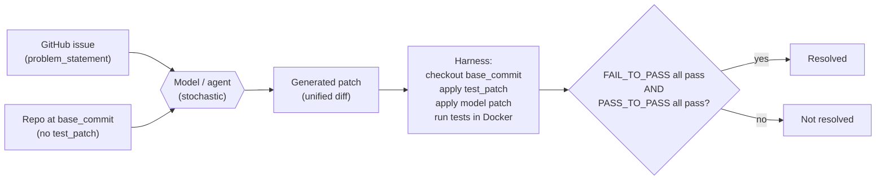

# Day 12 — SWE-Bench Verified: from function synthesis to repository-grounded edits

## The opening hook

Yesterday (D11) the model was given a function signature and a docstring and asked to fill in a body. The unit tests were small, the file was one screen long, and the only state the model had to track was the local namespace. HumanEval works because the *unit of evaluation* is the function.

Today the unit changes. The model is given:

- A real GitHub issue ("`ModelChoiceField.to_python` raises `TypeError` instead of `ValidationError` when given an invalid PK"), pasted as plain text.
- A snapshot of the entire repository (Django, ~3,000 files, ~250k lines of Python) at the commit *before* the bug fix landed.
- No pointer to where the bug is.
- No pointer to which tests will be used.

The model has to localize the bug, edit one or more files, and produce a unified diff. That diff is then applied to the repo, and a held-out test suite — the patch the human maintainer wrote when they actually fixed the issue — runs in a Docker container. The model "resolves" the issue iff every previously-failing test now passes and every previously-passing test still passes.

This is **SWE-Bench**. The substantive shift from D11 isn't difficulty. It's that the eval target moved from *synthesis of an isolated function* to *grounded edits to existing code under hidden tests*. That shift — from function-shaped to repository-shaped problems — is what made SWE-Bench the canonical anchor for "agentic" code evaluation.

## SWE-Bench, the original (Jimenez et al. 2023)

**Citation.** Jimenez, C. E., Yang, J., Wettig, A., Yao, S., Pei, K., Press, O., & Narasimhan, K. (2023). *SWE-bench: Can Language Models Resolve Real-World GitHub Issues?* arXiv:2310.06770. ICLR 2024.

The construction is simple to state and hard to execute at scale. From 12 popular Python repositories — `django`, `scikit-learn`, `sympy`, `matplotlib`, `flask`, `requests`, `astropy`, `pytest`, `pylint`, `xarray`, `seaborn`, `sphinx` — the authors mined merged pull requests that (a) closed an issue and (b) modified at least one test file. Each PR yielded one task instance:

| Field | What it is |
| --- | --- |
| `repo` | e.g. `"django/django"` |
| `base_commit` | SHA of the parent commit — the repo state *before* the fix |
| `problem_statement` | The text of the GitHub issue |
| `patch` | The maintainer's gold patch (source files only) — held out from the model |
| `test_patch` | The maintainer's gold patch (test files only) — held out from the model and used at evaluation time |
| `FAIL_TO_PASS` | List of test IDs that fail at `base_commit` and must pass after the model's patch is applied |
| `PASS_TO_PASS` | List of test IDs that pass at `base_commit` and must still pass after the model's patch is applied |

The original benchmark contains **2,294** instances across the 12 repositories. The dominant repo by instance count is Django (~850), then sympy (~386) and scikit-learn (~229); Flask contributes 11. Skew matters: a model that's good at Django ORM bugs will look good on aggregate even if it's weak elsewhere.

## How a model "resolves" an instance

This is the mechanism that distinguishes SWE-Bench from D11:



Three things deserve emphasis:

1. **The `test_patch` is hidden from the model and applied at evaluation time, not at submission time.** The model never sees the tests. It also doesn't know which files in the repo will end up being tested. This is the part that makes the eval grounded: the model can't game the test suite because it can't see it.
2. **Both `FAIL_TO_PASS` and `PASS_TO_PASS` must succeed.** `FAIL_TO_PASS` is the regression-style "the bug is fixed" check (these tests were failing on `base_commit`; they must pass now). `PASS_TO_PASS` is the side-effects check (these tests were passing on `base_commit`; they must *still* pass). A patch that fixes the issue but breaks an unrelated test fails the instance. This is closer to what shipping the patch through code review would feel like.
3. **The harness runs in Docker, per-instance.** Each repository at each `base_commit` needs its own dependencies, Python version, build steps. The SWE-Bench harness ships per-instance images so reproducibility is mechanical: anyone running the harness against the same model patches gets the same `resolved` flag.

A typical instance, in JSON:

```json
{
  "repo": "django/django",
  "base_commit": "0ed7d155635da32e7bef4ed9b5f1f8a8da9b4f0f",
  "problem_statement": "ModelChoiceField does not provide value of invalid choice when raising ValidationError ...",
  "patch": "diff --git a/django/forms/models.py ...",
  "test_patch": "diff --git a/tests/forms_tests/tests/test_modelchoicefield.py ...",
  "FAIL_TO_PASS": ["tests/forms_tests/...test_invalid_pk"],
  "PASS_TO_PASS": ["tests/forms_tests/...test_valid_pk", "..."]
}
```

The metric is **% Resolved** — the fraction of instances on which both test sets pass. There is no partial credit. Either the patch ships or it doesn't.

## The contrast with HumanEval

SWE-Bench and HumanEval (D11) are both code-generation benchmarks scored by execution. They are different evals.

| Axis | HumanEval (D11) | SWE-Bench |
| --- | --- | --- |
| **Unit of work** | Function body | Multi-file patch |
| **Context** | Function signature + docstring (~30 lines) | Whole repo (~10⁴–10⁶ LOC) |
| **What the model produces** | Function source | Unified diff |
| **Localization** | Free — the prompt names the function | Required — the model has to find the bug |
| **Tests** | Visible at training time (164 problems are public) | Hidden at submission time; revealed only inside the harness |
| **Failure modes** | Off-by-one, edge-case logic, type confusion | All of the above + wrong-file edits, broken-import fallout, unrelated-test regression |
| **Scoring** | `pass@k` over visible tests | % Resolved (hidden `FAIL_TO_PASS` + `PASS_TO_PASS`) |
| **What it tests** | Local synthesis | Repository-grounded edit under realistic test discipline |

The HumanEval-to-SWE-Bench jump is *not* "harder synthesis." It is a different evaluation philosophy. HumanEval asks: given a clean specification, can the model produce code? SWE-Bench asks: given an underspecified bug report and a real codebase, can the model localize the problem, make a minimal correct edit, and not break anything else? The second framing is closer to the loop a working software engineer is actually in. It is also where most modern "coding agent" work — Cursor's tab agent, GitHub Copilot Workspace, Claude Code, OpenAI's Codex agent — is benchmarked.

## SWE-Bench Verified (OpenAI, August 2024)

**Citation.** OpenAI, with the SWE-Bench team. *Introducing SWE-bench Verified.* August 13, 2024. https://openai.com/index/introducing-swe-bench-verified/

By mid-2024 the SWE-Bench team and the OpenAI Preparedness team had identified a problem with the original benchmark: a non-trivial fraction of the 2,294 instances were *not actually solvable* in the way the harness assumed. Three failure modes recurred:

1. **Underspecified issue text.** The problem statement was too vague to identify what behavior the model was supposed to produce. Different reasonable readings of the issue lead to different patches, only one of which passes the held-out tests.
2. **Tests that demand implementation specifics.** The hidden test patch checks for a particular function name, exception type, or attribute that the issue text doesn't mention. A semantically correct fix using a different name fails.
3. **Broken environment setup.** The Docker image fails to build, dependencies are pinned to versions that no longer install, or the test runner is mis-configured. The model cannot pass the instance no matter what it produces.

The fix was a human-annotation pass. **93 experienced Python developers** screened **1,699** randomly sampled instances against three quality criteria — issue-statement clarity, test-specification clarity, and environment reproducibility — and produced **SWE-Bench Verified**: a curated subset of **500 instances** that pass all three filters. SWE-Bench Verified is now the canonical anchor; "SOTA on SWE-Bench" without further qualification almost always means "SOTA on Verified."

The empirical effect of the curation was substantial. On the original SWE-Bench, GPT-4 (with a strong scaffold) was reported in the 1.7–4% Resolved range; the same scaffold on Verified roughly tripled — not because the model got better but because the benchmark stopped penalizing models for instances that no model could resolve. The headline reframe: **a chunk of "the model failed" turned out to be "the eval was wrong."**

This curation also doubles as a contamination-response mechanism, even though it wasn't framed that way in the announcement. Both the original SWE-Bench instances and the canonical agent harnesses have been on the public web for over a year — they are plausibly in modern pretraining and post-training corpora. SWE-Bench Verified narrows the surface (500 instances vs. 2,294) and lets follow-up audits target a smaller, cleaner set when contamination concerns surface (and they have; see the forward pointer to D25 below).

## SWE-Agent and the Agent-Computer Interface

**Citation.** Yang, J., Jimenez, C. E., Wettig, A., Lieret, K., Yao, S., Narasimhan, K., & Press, O. (2024). *SWE-agent: Agent-Computer Interfaces Enable Automated Software Engineering.* arXiv:2405.15793. NeurIPS 2024.

A model that just sees `problem_statement` and the repo file tree can't do much. To make SWE-Bench tractable you need a *scaffold* — an environment the model can read and write through. SWE-Agent is the canonical reference scaffold and the paired publication for the SWE-Bench harness.

The paper's contribution is the **Agent-Computer Interface (ACI)**: a small, deliberately-designed set of commands the agent uses to interact with the repo (read file, search by string or regex, scroll, edit by line range, run tests, submit). The ACI's design is the surprising part of the paper — the authors found that *small interface choices* (line-numbered file viewer, structured edit command that diffs against the visible window, an explicit "submit" action) move the eval-quality needle as much as model-side improvements. SWE-Agent's reported number on the original SWE-Bench was **12.5% Resolved with GPT-4** at release, which was state-of-the-art for an agent at the time and demonstrated that agent-style scaffolding closes most of the gap to the maintainers' own patches on resolvable instances.

The methodological lesson runs through Week 4: when an eval is agentic, *the harness scaffolding is part of the system under test*. Two papers reporting different SWE-Bench numbers for the same base model usually disagree on the agent loop, not on the model. We return to this in D26 (web agents — WebArena) where the same scaffolding-determines-score pattern repeats with a different action surface.

## Frontier performance, mid-2026

The trajectory on SWE-Bench Verified has been steeper than almost any other anchor benchmark in this curriculum. From the August 2024 release:

- **Aug 2024 (Verified release).** GPT-4o with the Agentless scaffold: ~33%.
- **Late 2024.** OpenAI o1 with agent scaffolds: ~48%.
- **Mid-2025.** Top reasoning models (Claude Sonnet/Opus 4.x family, GPT-5 family, Gemini 2.5 Pro family) crossed 60% and pushed toward 70%.
- **Early 2026.** Frontier reasoning models with strong scaffolds report SWE-Bench Verified Resolved rates in the **70–90%+** range; the leaderboards are crowded enough that month-to-month rank changes are usually noise. (D7's saturation framing applies directly: at 90%+ Resolved on a 500-item benchmark, per-model 95% CIs are ~±2.5 points and most reported gaps between top-tier systems are statistically inconclusive.)

Two contamination-flavored caveats worth carrying forward, both consistent with the D6 / D7 thread without elevating Goodhart to the foreground:

- The 500 Verified instances are public GitHub PRs from before October 2023. They almost certainly appear, in some form, in the pretraining corpora of every 2025–2026 frontier model. The original gold patches are recoverable from the upstream repos by anyone who knows the `base_commit`.
- The agent harness is itself a target of post-training — labs RL-tune on SWE-Bench-shaped trajectories. This is not contamination of the *test data* in the strict D6 sense, but it does mean SWE-Bench Verified increasingly measures "how well has this model been trained against this specific harness shape" rather than "how well can this model do software engineering in the wild." Successor benchmarks that sample post-cutoff (SWE-Bench Live, SWE-rebench) and ones that sample from non-public industrial codebases (SWE-Bench Pro) exist precisely for this reason. Treat any 2026+ SWE-Bench Verified score as a measure-with-known-drift, not a clean capability number.

## The ecosystem around the anchor

A short pointer-only roundup of the variants you'll encounter — none of these are the anchor today, but the names recur:

- **SWE-Bench Lite** — 300-instance subset of the original, biased toward simpler-to-set-up instances. Commonly used when full Verified is too expensive to run.
- **SWE-Bench Multimodal** (Yang et al., ICLR 2025) — 517 instances drawn from front-end / visual repos where the issue includes screenshots or diagrams. Tests whether agents that can *see* the bug do better than agents that only read text.
- **SWE-Gym** (Pan et al., ICML 2025; arXiv:2412.21139) — 2,438 *training* instances, executable runtimes included. SWE-Gym is for fine-tuning agents and verifiers; not an evaluation set. The naming convention matters: "Gym" = training environment, "Bench" = evaluation set.
- **SWE-Bench Live** and **SWE-rebench** — continuously refreshed leaderboards that sample post-cutoff issues. The contamination-resistant successor pattern from D11 (HumanEval → LiveCodeBench) repeats here.

You don't need to memorize these. The point is that "SWE-Bench" in 2026 names a *family* of benchmarks built around the original task structure; the anchor is Verified.

## Code: a worked instance, end to end

What it actually looks like when you run the harness on one model patch:

```bash
# 1. Run inference: model sees problem_statement + repo at base_commit
#    (the agent scaffold makes the calls; output is a model_patch field)
python -m swebench.inference.run \
  --dataset_name SWE-bench/SWE-bench_Verified \
  --model_name_or_path my-agent-scaffold \
  --output_dir ./preds

# 2. Run the harness: applies model_patch + the hidden test_patch
#    inside the per-instance Docker image, runs FAIL_TO_PASS + PASS_TO_PASS
python -m swebench.harness.run_evaluation \
  --dataset_name SWE-bench/SWE-bench_Verified \
  --predictions_path ./preds/preds.jsonl \
  --max_workers 8 \
  --run_id my-eval-2026-05
```

The harness emits a per-instance `resolved` boolean and a leaderboard-ready aggregate. There is no LLM-judge anywhere in the loop; the entire scoring rule is "did the test runner exit zero on both test sets?" That property — *fully executable, no judge, no human in the loop* — is what makes SWE-Bench the cleanest agentic eval methodologically. Most of Week 4's evals are not this clean.

## Forward pointers

- **D11 (HumanEval / LiveCodeBench).** Yesterday's function-level predecessor. Useful if you want to feel the synthesis-vs-edit difference end-to-end on the same model.
- **D25 (reasoning models on AIME / FrontierMath).** SWE-Bench Verified is one of the two or three benchmarks the 2024–2025 reasoning-model launches led with. Expect to see SWE-Bench Verified % Resolved on every frontier-model system card from o1 onward, paired with AIME and GPQA Diamond. The cost-axis Pareto framing D25 introduces — accuracy reported with tokens/$ on the x-axis — applies directly: an agent that wins SWE-Bench Verified by 3 points but uses 10× the tokens isn't obviously better.
- **D26 (web agents — WebArena).** The agentic capability throughline runs D11 (function synthesis) → D12 (repository edits) → D26 (web actions on a live UI). The action surface widens; the scaffolding-is-part-of-the-system lesson recurs.

> **Safety researcher's note.** SWE-Bench's resolution check is "the test suite exits zero." That is a strictly weaker guarantee than "the patch is correct." A model can produce a patch that passes `FAIL_TO_PASS` and `PASS_TO_PASS` *and also* introduces a subtle vulnerability the existing tests don't catch — a regex that's now exploitable, an authentication check that returns the right exception but in a guard-bypassable order, a sanitizer that's been narrowed to a specific input class. The benchmark's tests are written by maintainers fixing a bug, not by adversaries auditing the patch; nothing in the SWE-Bench harness checks for new attack surface introduced *by* the fix. This is the supply-chain-Goodhart edge case for code agents: as automated patches start landing in real repositories (and they are — Dependabot-style PR-bot agents are already doing this in 2026), the eval signal "SWE-Bench Resolved %" doesn't directly measure the property that matters for shipping code, which is "does this patch pass the test suite *and* not introduce a security regression." Capability evals like SWE-Bench tell you the agent can write a patch that compiles and passes tests; they do not tell you the patch is safe to merge. Week 3 and the policy-relevant closer on D28 are where this gap gets named — the relevant phrase is *capability outpacing audit*. We'll return to it on D26 (indirect prompt injection on web agents) and D27 (OS-level agents) where the action surface is wider and the audit asymmetry sharper.

## Takeaways

1. SWE-Bench evaluates *repository-grounded patches*: model sees an issue and a repo at `base_commit`, must produce a unified diff that, when applied, makes a hidden test patch's `FAIL_TO_PASS` tests pass without breaking `PASS_TO_PASS` tests. Scoring is binary (% Resolved), executed in Docker, no judge in the loop.
2. The substantive jump from HumanEval (D11) is *unit of work*: function body → multi-file patch with localization required and tests hidden until evaluation time. SWE-Bench is closer to the realistic SWE loop than HumanEval is.
3. Original SWE-Bench (Jimenez et al. 2023, ICLR 2024) has 2,294 instances across 12 Python repos. SWE-Bench Verified (OpenAI, Aug 2024) is a 500-instance subset filtered by 93 human annotators against issue-clarity, test-clarity, and environment-reproducibility criteria.
4. SWE-Agent (Yang et al. 2024, NeurIPS 2024) is the canonical agent scaffold; the Agent-Computer Interface idea — that small interface choices move the eval needle as much as model-side gains — is the methodological lesson and recurs on D26.
5. As of mid-2026, top reasoning models on SWE-Bench Verified are in the 70–90%+ range; the benchmark is approaching saturation, and post-cutoff successors (SWE-Bench Live, SWE-rebench, SWE-Bench Pro) are the contamination-and-saturation response. SWE-Gym is the *training-set* sibling, not an eval.
6. Resolution is a weaker guarantee than correctness: a patch that passes `FAIL_TO_PASS` + `PASS_TO_PASS` can still introduce vulnerabilities or behavioral regressions the maintainer-authored tests don't catch.

## References

- **Anchor (original benchmark).** Jimenez, C. E., Yang, J., Wettig, A., Yao, S., Pei, K., Press, O., & Narasimhan, K. (2023). *SWE-bench: Can Language Models Resolve Real-World GitHub Issues?* arXiv:2310.06770. ICLR 2024. https://arxiv.org/abs/2310.06770
- **Anchor (curated subset).** OpenAI Preparedness Team, with the SWE-Bench authors. *Introducing SWE-bench Verified.* August 13, 2024. https://openai.com/index/introducing-swe-bench-verified/
- **Reference scaffold.** Yang, J., Jimenez, C. E., Wettig, A., Lieret, K., Yao, S., Narasimhan, K., & Press, O. (2024). *SWE-agent: Agent-Computer Interfaces Enable Automated Software Engineering.* arXiv:2405.15793. NeurIPS 2024. https://arxiv.org/abs/2405.15793
- **Project home, harness, leaderboards.** SWE-Bench team. https://www.swebench.com/ — leaderboards for original / Verified / Lite / Multimodal / Live; harness docs; Docker image registry. Repo: https://github.com/SWE-bench/SWE-bench
- **Multimodal variant.** Yang, J., et al. (2024/2025). *SWE-bench Multimodal: Do AI Systems Generalize to Visual Software Domains?* ICLR 2025.
- **Training-set sibling.** Pan, J., et al. (2024/2025). *Training Software Engineering Agents and Verifiers with SWE-Gym.* arXiv:2412.21139. ICML 2025. https://arxiv.org/abs/2412.21139
- **Frontier-model SOTA tracking.** Public leaderboards: Epoch AI SWE-bench Verified (https://epoch.ai/benchmarks/swe-bench-verified), the SWE-Bench official leaderboard (https://www.swebench.com/), and vendor system cards. Specific 2026 numbers drift weekly; cite primary system cards rather than leaderboard snapshots.

## Quiz

**Q1.** What does it mean for a SWE-Bench instance to be "resolved" by a model?

- A. The model's patch matches the maintainer's gold patch byte-for-byte.
- B. An LLM judge rates the model's patch as "correct."
- C. After applying the model's patch, every `FAIL_TO_PASS` test passes and every `PASS_TO_PASS` test still passes, in a Docker container running the repo's actual test suite.
- D. The model's patch compiles without warnings.

**Q2.** SWE-Bench differs from HumanEval primarily in:

- A. The programming language: SWE-Bench is multi-language, HumanEval is Python-only.
- B. The unit of work and the test visibility: SWE-Bench tests multi-file patches against tests hidden at submission time, while HumanEval tests function bodies against tests visible to the prompt.
- C. SWE-Bench uses an LLM judge while HumanEval uses execution.
- D. SWE-Bench is multiple-choice while HumanEval is free-form.

**Q3.** What is the primary distinction between SWE-Bench (original) and SWE-Bench Verified?

- A. Verified uses a stronger LLM judge.
- B. Verified is a 500-instance human-curated subset filtered by 93 annotators against issue-clarity, test-clarity, and environment-reproducibility criteria; the original 2,294-instance set was unfiltered.
- C. Verified runs in Docker, the original ran in bare metal.
- D. Verified replaces unit tests with property-based tests.

**Q4.** Why is the `PASS_TO_PASS` test set required, in addition to `FAIL_TO_PASS`?

- A. To check that the model's patch doesn't break unrelated, previously-passing functionality.
- B. To increase the harness's runtime and make benchmarking more thorough.
- C. To give the model partial credit when it can't pass `FAIL_TO_PASS`.
- D. To validate the model's patch syntactically.

**Q5.** What is the central methodological idea of SWE-Agent (Yang et al. 2024)?

- A. Replace the test runner with a learned reward model.
- B. Generate patches via constrained decoding against the AST.
- C. The Agent-Computer Interface (ACI): the design of the tool surface the agent acts through (file viewer, search, edit, run, submit) materially affects eval performance — interface design is part of the system under test.
- D. Train a custom verifier model on SWE-Bench gold patches and use it to filter candidate patches.

**Q6.** A 2026 system card reports "82% Resolved on SWE-Bench Verified" with no further details. Which critique is **most precise** given Week 1 + Week 2 framing?

- A. The score should be reported on the original 2,294-instance SWE-Bench, not Verified.
- B. The score should use `acc_norm` instead of `acc`.
- C. At ~82% on a 500-instance benchmark with public-since-2023 instances, three things are unstated and load-bearing: the agent scaffold (the system being measured includes it), the test of statistical significance vs. peers (per-model 95% CI is roughly ±3.4 points at p ≈ 0.82), and the contamination posture of the model's training corpus relative to the upstream Python repos.
- D. SWE-Bench is multiple-choice and shouldn't be reported as a percentage.

<details>
<summary>Answers</summary>

1. **C** — the binary, executable definition of resolution. A is too strict (many semantically correct patches diverge byte-wise from the gold patch); B is wrong (no judge in the SWE-Bench loop); D is too weak.
2. **B** — the function-vs-patch and visible-vs-hidden-tests jump is the core contrast.
3. **B** — the curation pipeline (93 annotators, 1,699 sampled, 500 retained, three quality criteria) is the defining property of Verified.
4. **A** — `PASS_TO_PASS` is the no-regressions check; the patch must fix the bug (`FAIL_TO_PASS`) without breaking unrelated functionality.
5. **C** — the ACI framing is the paper's contribution and the methodological lesson that recurs on D26 (web agents).
6. **C** — D5's CI math gives $\sqrt{0.82 \cdot 0.18 / 500} \approx 0.017$, so per-model 95% CI is roughly $\pm 3.4$ points. Combined with the scaffold-dependence of agent scores (D12) and the public-since-2023 contamination surface (D6), a bare 82% number is under-specified in three distinct ways.

</details>
