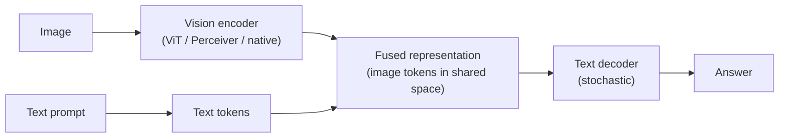
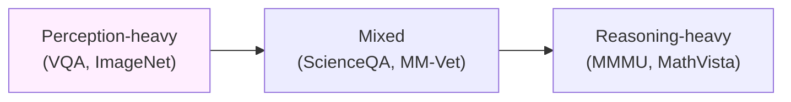

# Day 13 — Multimodal evaluation: vision + language reasoning

## TL;DR

Multimodal evaluation is the same (dataset, scoring rule, reporting convention) pipeline from [D-1](/lesson/1), applied to a wider input modality — images, sometimes audio or video — with two new degrees of freedom (image preprocessing and image-token interleaving). The first decade of multimodal benchmarks (VQA, ScienceQA) measured *perception*; today's anchor — **MMMU** (Yue et al. 2023/2024), 11,550 college-level items across 6 disciplines, 30 subjects, and 30 heterogeneous image types — measures *perception-conditioned reasoning*, and **MMMU-Pro** (Yue et al. 2024) is its already-deployed harder successor. A score on either is unfalsifiable until you say which split, which preprocessing, and (for Pro) which setting.

## Learning objectives

By the end of this lesson, you will be able to:

1. **(L2)** State the perception-vs-reasoning axis and locate VQA, ScienceQA, MathVista, and MMMU on it.
2. **(L2)** Describe MMMU's construction principle — 6 disciplines × 30 subjects × 30 heterogeneous image types — and recall the canonical 150 / 900 / 10,500 dev/val/test split structure.
3. **(L3)** *Apply* MMMU-Pro's reported 16.8–26.9-point gap to interpret a model's MMMU-vs-Pro score pair as in-distribution or anomalous.
4. **(L4)** *Decompose* the new degrees of freedom a multimodal pipeline introduces relative to [D-1](/lesson/1)'s text-only pipeline (image preprocessing, image-token interleaving, modality routing) and identify which axis a given two-paper disagreement most plausibly hangs on.
5. **(L5)** *Evaluate* a model card's MMMU score against the pipeline questions a Week-2 reader is now equipped to ask before treating it as a measurement.
6. **(L4)** Read FigStep-style typographic jailbreaks as a third axis — *visual-channel safety* — that neither MMMU nor a text-only refusal benchmark measures.

## Prerequisites & callback

[D-7](/lesson/7) is the most load-bearing predecessor today: MMMU's already-deployed harder successor (MMMU-Pro) is a saturation arc in motion, and the saturation-then-redesign pattern from [D-7](/lesson/7) reapplies directly — visual-channel safety (FigStep-style typographic jailbreaks) sits as a second *capability-overhang* axis on the same template. [D-5](/lesson/5)'s per-discipline reporting machinery also returns: MMMU partitions across 6 disciplines × 30 subjects × 30 image types, and any aggregate number you read should be paired with a sub-domain breakdown for the same reasons [D-5](/lesson/5) catalogued. The pipeline shape ([D-1](/lesson/1)'s (dataset, scoring rule, reporting convention) triple) is preserved: multimodal evaluation widens the *input stage*, adding image preprocessing and image-token interleaving as two new drift sources on top of the original four (n-shot, prompt template, scoring rule, subset), but does not redefine the rule. Everything about reading "Model X scored 84.7% on MMMU" inherits the ask-the-pipeline-first reflex from Week 1.

## The opening hook

If you ask a 2017-era vision-language model "Is there a dog in this picture?" it answers competently. If you ask it "Given the circuit shown, what is the voltage across $R_2$ when $V_s = 12\text{ V}$, $R_1 = 4\,\Omega$, $R_2 = 8\,\Omega$?" it cannot. Not because it can't see the resistors — it can — but because *seeing* the resistors is at most 10% of the work. The other 90% is recognizing the circuit topology, mapping symbols to a system of linear equations, applying Kirchhoff's laws, and arithmetic.

The first decade of multimodal evaluation (VQA, COCO Captions, ImageNet-VQA derivatives) measured the 10%. **MMMU** measures the 90%. That shift — from *perception* to *perception-conditioned reasoning* — is what makes MMMU the right Week 2 anchor for the multimodal axis.

## What "multimodal evaluation" actually means

A multimodal LLM (interchangeably: VLM, LMM, LVLM in the literature) takes inputs that are not all text — typically images, sometimes audio or video — and produces text. The pipeline picks up two new pieces relative to [D-1](/lesson/1):



Two architectural variants matter for evaluation:

- **Adapter-style** (LLaVA, BLIP-2): a separate vision encoder produces a sequence of "image tokens" that are projected into the language model's embedding space and prepended to the text prompt.
- **Native multimodal** (GPT-4o, Gemini, Claude 3.5+): the model is trained from scratch (or extensively co-trained) with image tokens as first-class inputs alongside text.

The pipeline-level point from [D-1](/lesson/1) still holds: an evaluation is a (dataset, scoring rule, reporting convention) triple plus a model run. The new degrees of freedom are *image preprocessing* (resolution, tiling, aspect ratio handling), *image-token interleaving* (where in the prompt the image goes), and *modality routing* (some harnesses send images as URLs, others as base64, others as file uploads — each can change the model's effective input).

## The perception-vs-reasoning axis

Benchmarks fall along a spectrum:



- **Perception-heavy benchmarks** ask "what is in the image?" — object recognition, attribute identification, scene description. The classic VQA dataset (Antol et al. 2015, arXiv:1505.00468) is the archetype: 0.25M images and 0.76M short-answer questions like "What color is the bus?". Solvable with strong vision features and a thin language head.
- **Mixed benchmarks** ask science-y questions where the image often supplements text. ScienceQA (Lu et al. 2022, arXiv:2209.09513) has 21,208 elementary-and-high-school multiple-choice items — only 48.7% even include an image, and most images are diagrams labelled clearly enough that a strong language model with weak vision can still pass. ScienceQA was the benchmark that demonstrated chain-of-thought helps on multimodal science QA, but it doesn't isolate *image reasoning* the way later benchmarks do.
- **Reasoning-heavy benchmarks** ask questions that *require* extracting structured information from a non-photographic image (a diagram, chart, equation, score, scan) and then performing multi-step domain reasoning over it. MMMU and MathVista (Lu et al. 2023, arXiv:2310.02255) are the two canonical anchors here.

The pedagogical move for the rest of the lesson: MMMU doesn't beat VQA on perception. It beats VQA on *what you have to do once you've perceived the image*. A model that crushes ImageNet but has only a 7B language backbone will fail MMMU not because it can't see, but because it can't think after it sees.

## ⏵ Check yourself — sorting benchmarks

A 2026 paper reports a 13B open-weights VLM scoring **78%** on VQA, **74%** on ScienceQA, and **31%** on MMMU. **Decompose** the spread along the perception-vs-reasoning axis and identify what it tells you, and does not tell you, about the model's vision encoder.

<details>
<summary>Show answer</summary>

The spread is consistent with a model whose vision-and-language stack handles short-answer perception (VQA: object/attribute recognition) and image-supplemented K–12 science MCQ (ScienceQA: ~49% of items have an image at all, and most diagrams are clearly labelled) but lacks the *domain-knowledge backbone* for college-level multi-discipline reasoning (MMMU: chemistry, medicine, music notation, etc.). The 78% / 74% pair tells you the *vision encoder* is competent — the model can perceive the image. The 31% on MMMU does not tell you the vision encoder is broken; it tells you that perception is at most ~10% of the work on MMMU and the remaining ~90% is domain reasoning over what was perceived. A bigger language backbone, not a better vision encoder, is the load-bearing fix.

</details>

## Anchor: MMMU (Yue et al. 2023/2024)

**Citation.** Yue, X., Ni, Y., Zhang, K., Zheng, T., Liu, R., Zhang, G., Stevens, S., Jiang, D., Ren, W., Sun, Y., Wei, C., Yu, B., Yuan, R., Sun, R., Yin, M., Zheng, B., Yang, Z., Liu, Y., Huang, W., Sun, H., Su, Y., & Chen, W. (2024). *MMMU: A Massive Multi-discipline Multimodal Understanding and Reasoning Benchmark for Expert AGI.* CVPR 2024 (Oral). arXiv:2311.16502.

### Construction

MMMU is **11,550 multimodal questions** sourced from college-level exams, quizzes, and textbooks across **6 broad disciplines** and **30 subjects** (further broken into 183 subfields):

| Discipline | Example subjects |
| --- | --- |
| Art & Design | Art, Art Theory, Design, Music |
| Business | Accounting, Economics, Finance, Manage, Marketing |
| Science | Biology, Chemistry, Geography, Math, Physics |
| Health & Medicine | Basic Medical Science, Clinical Medicine, Diagnostics, Pharmacy, Public Health |
| Humanities & Social Science | History, Literature, Psychology, Sociology |
| Tech & Engineering | Agriculture, Architecture, Computer Science, Electronics, Energy & Power, Materials, Mechanical Engineering |

The construction guarantee that distinguishes MMMU from earlier benchmarks is the **30 heterogeneous image types**: charts, plots, tables, chemical structures, photographs, paintings, geometric shapes, musical scores, medical images (CT, MRI, microscopy slides), pathology slides, mathematical notations, sketches and drafts, geographic maps, technical blueprints, sheet music, comics panels, advertisements, sports scenes, screenshots, and several more. A model can't ace MMMU by being good at one image modality — chart QA models that crush ChartQA still fail on chemical structures, music notation, and CT scans.

### Splits

| Split | Items | Use |
| --- | --- | --- |
| Dev | 150 (5/subject) | In-context / few-shot demonstrations |
| Validation | 900 | Public answers — debugging, model selection |
| Test | 10,500 | Answers held out — leaderboard submission only |

The 150/900/10,500 split is the standard convention. Most published numbers ("GPT-4V scored 56% on MMMU") refer to the *validation* split because the test set requires server-side submission. When you read a number, check which split.

### Scoring

MMMU is mostly multiple-choice (the format scales) with a minority of short-answer items. The harness applies micro-average accuracy across items, then reports macro-averages by discipline and subject. The scoring back-end uses regex extraction of the answer letter from the model's free-form output — i.e., generative scoring, not log-likelihood ([D-1](/lesson/1)). This matters: a model that says "I think the answer is (B), because..." scores correct, but a model that says "B" without parens may or may not depending on the regex. Cross-paper comparability requires the same extraction code, which is why VLMEvalKit (below) exists.

### An example item: why a vision-only model fails

The construction makes the perception-vs-reasoning split tangible. A representative Tech & Engineering item (paraphrased composite, not a verbatim MMMU item):

> *[Image: a labelled circuit diagram showing $V_s$ in series with $R_1$, then a parallel pair $R_2 \parallel R_3$, then ground.]*
>
> Given $V_s = 12\text{ V}$, $R_1 = 4\,\Omega$, $R_2 = 8\,\Omega$, $R_3 = 8\,\Omega$, what is the voltage across $R_2$?
>
> (A) 3 V  (B) 4 V  (C) 6 V  (D) 8 V

The reasoning chain: recognize the topology (series + parallel), compute the parallel resistance ($R_2 \parallel R_3 = 4\,\Omega$), apply the voltage divider ($V_{R_2} = V_s \cdot R_\text{parallel}/(R_1 + R_\text{parallel}) = 12 \cdot 4/8 = 6\text{ V}$), match to (C). Step 1 needs vision; steps 2–4 need an electrical-engineering prior, the symbolic manipulation that goes with it, and arithmetic. A pure perception model (image-classifier + caption head) has no path to (C) even if it correctly captions "circuit with three resistors."

The same logic applies across MMMU image types: chemical-structure questions require recognizing functional groups *and* knowing reaction mechanisms; pathology slides require recognizing tissue *and* knowing diagnostic criteria; sheet-music questions require reading notation *and* knowing music-theory relationships. The *reasoning load on heterogeneous image types* is the construction principle.

### Performance — paper baseline and 2026 frontier

Numbers reported by the paper (Yue et al. 2024) on the validation split:

- **Best human expert:** 88.6%
- **Medium human expert:** 82.6%
- **Worst human expert:** 76.2%
- **GPT-4V (Nov 2023):** 56%
- **Gemini Ultra (Dec 2023):** 59%
- **Open-source SOTA at release** (LLaVA-1.5, etc.): 30–37%

As of mid-2026, frontier proprietary models on MMMU validation are reported in the **84–86%** range — within a point of the *best* human expert ceiling. As with [D-7](/lesson/7), treat the specific 2026 numbers as drift-prone: vendor leaderboards update weekly, and self-reports vary on prompt template and image preprocessing. **Verify against primary system cards before quoting a specific score.** What's stable is the trajectory: 56% → ~85% in ~30 months, paralleling GPQA Diamond's 39% → ~94% over a similar window. MMMU is closer to its construction-time ceiling than its designers expected.

This is the same saturation problem [D-7](/lesson/7) framed, applied to multimodal:

$$
\text{headroom} = (\text{human ceiling}) - (\text{frontier score}) \approx 88.6 - 85 = 3.6 \text{ points}
$$

On a 900-item validation split with $p \approx 0.85$, the per-model 95% CI is roughly $\sqrt{0.85 \cdot 0.15 / 900} \cdot 1.96 \approx \pm 2.3$ points — comparable to the gap between two frontier models, which is why MMMU-Pro now exists.

### MMMU-Pro: the contamination-and-difficulty hardened variant

**Citation.** Yue, X., et al. (2024). *MMMU-Pro: A More Robust Multi-discipline Multimodal Understanding Benchmark.* arXiv:2409.02813.

MMMU-Pro is the same authors' response to two failure modes:

1. **Text-only solvability.** A non-trivial slice of MMMU items can be answered without the image — a strong language model that ignores the image still gets credit. MMMU-Pro filters these out by running text-only models against MMMU and rejecting items that text-only models pass.
2. **Multiple-choice cue exploitation.** With 4 options and the original distribution, a guess-the-pattern model can score well above random. MMMU-Pro **expands candidate options from 4 to 10**, dropping the random baseline from 25% to 10%.
3. **Vision-only setting.** MMMU-Pro adds a setting where the *question text itself* is rendered into the image, forcing the model to OCR-and-reason rather than read text and glance at the image. Models that pipeline OCR sloppily lose meaningful score here.

The result: **3,460 questions** across the same 6 disciplines, with reported scores 16.8–26.9 points lower than each model's MMMU score. As of 2026, MMMU-Pro is the contamination-and-saturation-hardened multimodal anchor, and the score-to-quote when MMMU itself is too saturated to discriminate. This is the same successor pattern [D-7](/lesson/7) named: original benchmark saturates → harder variant restores headroom.

## ⏵ Check yourself — Pro gap math

A 2026 system card reports the model scoring **86.4%** on MMMU validation and **64.1%** on MMMU-Pro. **Compute** the absolute and relative gaps, place them inside or outside the published 16.8–26.9-point Pro-vs-original range, and identify what the comparison is — and is not — evidence for.

<details>
<summary>Show answer</summary>

Absolute gap: $86.4 - 64.1 = 22.3$ points. Relative gap: $22.3 / 86.4 \approx 25.8\%$. The 22.3-point absolute drop sits *inside* the published 16.8–26.9-point Pro-vs-original window across models, so the magnitude alone is unremarkable — it is the construction-driven difficulty bump (text-only-solvable items removed, options 4 → 10, vision-only setting added), not a model fault. What the comparison **is** evidence for: the model is performing roughly in line with frontier expectations on the harder Pro setting. What it **is not** evidence for: that the model is "a 22-point worse multimodal model on Pro" in any deeper sense than the construction guarantees. The same model scoring 64.1% on Pro and 86.4% on the easier MMMU is the published pattern; both numbers, with their split labels, are needed to read the model card honestly.

</details>

## Multimodal contrast benchmarks

A short tour of the surrounding multimodal eval landscape, useful as foils:

- **VQA (Antol et al. 2015, arXiv:1505.00468).** The original perception-heavy benchmark. ~0.25M images, short open-ended answers. Saturated for years; useful pedagogically as the "what we used to mean by multimodal" anchor.
- **ScienceQA (Lu et al. 2022, arXiv:2209.09513).** 21,208 K–12 science MCQs, multimodal-but-not-always-image (~49% have images). The chain-of-thought-on-multimodal demo. Solvable largely from text plus weak vision.
- **MathVista (Lu et al. 2023, arXiv:2310.02255).** 6,141 visual-mathematical-reasoning items (charts, function plots, geometric figures, scientific figures from papers). Narrower-than-MMMU domain (math) but with similar reasoning emphasis. GPT-4V scored 49.9% at release, vs. ~60% human performance.
- **MM-Vet (Yu et al. 2023, arXiv:2308.02490; ICML 2024).** 218 items probing 6 core VL capabilities (recognition, knowledge, spatial awareness, language generation, OCR, math) and their 16 integrations. Open-ended, scored by an LLM-judge — directly tied to [D-22](/lesson/22).

Pick MMMU when you want a *broad-discipline reasoning-load* number. Pick MathVista when you want a *deep math-and-charts* number. Pick MM-Vet when you want a *qualitative integration-of-capabilities* number, with the caveat that you've now opened the LLM-judge can of worms ([D-22](/lesson/22)).

## The harness — VLMEvalKit

The multimodal harness ecosystem split early. The de-facto standard as of 2026 is **VLMEvalKit** (https://github.com/open-compass/VLMEvalKit), part of the OpenCompass ecosystem. It supports 220+ VLMs and 80+ benchmarks (MMMU, MMMU-Pro, MathVista, MM-Vet, MMBench, OCRBench, RealWorldQA, and many more) under a single command-line interface, with both exact-match and LLM-judge answer extraction.

A canonical run looks like:

```bash
python run.py \
  --data MMMU_DEV_VAL \
  --model GPT4V \
  --verbose
```

The Stage 2-relevant point: VLMEvalKit is the multimodal analogue of `lm-evaluation-harness` from [D-1](/lesson/1). It standardizes image preprocessing, prompt templates, answer extraction, and aggregation across benchmarks so that "Model A scored 84.7 on MMMU" and "Model B scored 83.9 on MMMU" are running on the same pipeline. Without it, two papers' MMMU numbers diverge for the usual reasons ([D-1](/lesson/1)) plus a new set: image resolution defaults, tiling, aspect-ratio padding, base64-vs-URL routing.

A minimal model-call snippet — what the harness is actually wrapping when it queries a frontier API — looks like:

```python
import base64, requests

with open("circuit.png", "rb") as f:
    img_b64 = base64.b64encode(f.read()).decode()

response = requests.post(
    "https://api.openai.com/v1/chat/completions",
    headers={"Authorization": f"Bearer {API_KEY}"},
    json={
        "model": "gpt-4o",
        "messages": [{
            "role": "user",
            "content": [
                {"type": "text", "text": "Given V_s=12V, R_1=4Ω, R_2=R_3=8Ω, what is V across R_2? (A) 3V (B) 4V (C) 6V (D) 8V"},
                {"type": "image_url",
                 "image_url": {"url": f"data:image/png;base64,{img_b64}"}},
            ],
        }],
    },
)
```

The `content` array interleaves text and image — that ordering is one of the prompt-template degrees of freedom MMMU implementations have to fix to be reproducible.

## Visual prompt injection and the multimodal jailbreak surface

The moment you add an image input to an evaluated system, you have added an attack surface that purely text-evaluated safety scores do not measure. Two multimodal-specific failure modes (neither of which exists in text-only LLMs):

1. **Visual prompt injection / embedded-text attacks.** An adversary embeds text instructions into an image — sometimes visibly (FigStep-style typography that converts a refused text request into an image of that request), sometimes subtly (small adversarial text rendered in image corners), sometimes via steganography (instructions in pixel statistics invisible to humans). The model OCRs and follows. FigStep (Gong et al. 2023, arXiv:2311.05608) reports a **>82% attack success rate** on six open-source LVLMs by simply rendering the disallowed prompt as a screenshot.
2. **Cross-modal indirect prompt injection.** A multimodal agent retrieves an image (from the web, from a user upload, from a tool's output) that contains attacker-controlled instructions — the agent reads the image as a benign observation but the model treats the embedded text as a directive. This is the multimodal extension of the indirect-prompt-injection threat model that [D-26](/lesson/26) (AgentDojo) and [D-27](/lesson/27) (OSWorld, screenshot-as-observation) make concrete.

A model that scores 85% on MMMU and 99% on a text-only refusal benchmark may still be 50% jailbreakable via embedded-image text — and you cannot read that off any of the headline numbers in this lesson alone. A frontier multimodal jailbreak suite therefore needs *both* axes — text-channel attacks *and* visual-channel attacks. HarmBench's 2024+ multimodal-attack subsets ([D-19](/lesson/19)) are the right place to look for that compound surface.

The pedagogical point parallels [D-1](/lesson/1)'s *capability overhang* note: just as MMLU is a capability number that does not move with safety alignment, MMMU is a *visual-capability* number that does not move with *visual-channel safety* — and the visual-channel safety axis itself is largely unmeasured by the text-only refusal benchmarks model cards quote.

## Cross-references

**Backward.**
- [D-1](/lesson/1) — picks up the (dataset, scoring rule, reporting convention) pipeline framing as the load-bearing scaffold; multimodal eval is the same pipeline applied to a wider input modality, with two new degrees of freedom (image preprocessing, image-token interleaving).
- [D-1](/lesson/1) — picks up the *capability overhang* framing; visual-channel safety is the multimodal extension of the capability-vs-alignment delta.
- [D-6](/lesson/6) — leakage-flavored pattern: MMMU → MMMU-Pro is the multimodal datapoint for the recurring "popular benchmark gets a `-Pro` successor within ~18 months" trajectory the contamination lesson named.
- [D-7](/lesson/7) — saturation framing for the 56% → ~85% MMMU trajectory; same successor-benchmark arc as GPQA → harder construction, different modality.

**Forward.**
- [D-14](/lesson/14) — long-context evaluation as the adjacent input-axis growth story; multimodal long-context (Video-MME, LongVideoBench) compounds [D-13](/lesson/13)'s perception-conditioned-reasoning load with [D-14](/lesson/14)'s needle-in-haystack retrieval load.
- [D-19](/lesson/19) — HarmBench is the right place to look for compound (text + visual) jailbreak suites; the FigStep / embedded-text family above is one half of that surface.
- [D-22](/lesson/22) — LLM-as-judge mechanics that open-ended multimodal benchmarks (MM-Vet) lean on for free-form scoring, with the foregrounded-Goodhart tradeoffs intact.
- [D-26](/lesson/26) — AgentDojo / indirect prompt injection: the cross-modal extension where attacker-controlled images become the indirect-PI surface for a multimodal agent.
- [D-27](/lesson/27) — OSWorld: every observation is a screenshot, so [D-13](/lesson/13)'s perception-conditioned-reasoning load is the load OSWorld agents pay on every step of a multi-step OS plan.

## Takeaways

1. Multimodal evaluation moved from *perception* (VQA, ImageNet) to *perception-conditioned reasoning* (MMMU, MathVista). MMMU's construction principle is heterogeneous image types (30) crossed with college-level domain reasoning (6 disciplines, 30 subjects, 183 subfields). *(LO 1)*
2. MMMU's split is 150 dev / 900 validation / 10,500 test, and most published numbers are validation-split; check the split label before comparing two papers' headlines. *(LO 2)*
3. Paper baselines: human expert 76.2 / 82.6 / 88.6% (worst / medium / best), GPT-4V 56%, Gemini Ultra 59%. As of 2026, frontier scores ~84–86% on validation — within a point of the best human expert. Verify against primary system cards. *(LO 5)*
4. The pipeline gains two new degrees of freedom relative to [D-1](/lesson/1): image preprocessing (resolution, tiling, aspect ratio) and image-token interleaving (where the image goes in the prompt). Both are pipeline-drift sources that VLMEvalKit standardizes. *(LO 4)*
5. MMMU-Pro (2024) is the harder successor: text-only-solvable items removed, options expanded 4 → 10, vision-only setting added. Frontier scores on Pro are 16.8–26.9 points lower than on MMMU; a same-model gap inside that window is in-distribution, not a fault. *(LO 3)*
6. The multimodal jailbreak surface (visual prompt injection, embedded-text attacks, cross-modal indirect-PI) is a third axis distinct from capability scores and text-only refusal scores. [D-19](/lesson/19), [D-26](/lesson/26), [D-27](/lesson/27) are where this gets concrete. *(LO 6)*

## Glossary

- **multimodal LLM (VLM / LMM / LVLM)**: a model that accepts non-text inputs (images, sometimes audio or video) alongside text and emits text. Architectural variants split into adapter-style (separate vision encoder + projection) and native-multimodal (image tokens trained from scratch as first-class inputs) [introduced D-13](/lesson/13).
- **perception-vs-reasoning axis**: the spectrum on which multimodal benchmarks sit — perception-heavy items (recognize the object) vs. reasoning-heavy items (reason in a domain after extracting structured information from a non-photographic image). VQA is the perception archetype; MMMU is the reasoning archetype [introduced D-13](/lesson/13).
- **multi-discipline reasoning**: MMMU's construction principle — heterogeneous image types (charts, chemical structures, medical scans, music notation, …) crossed with college-level domain knowledge across 6 disciplines, 30 subjects, and 183 subfields. The construction guarantee is that no single image-modality skill carries the benchmark [introduced D-13](/lesson/13).
- **text-only solvability**: a multimodal item that can be answered correctly without the image. MMMU-Pro's first construction-time filter removes such items by running text-only models against MMMU and rejecting the items they pass [introduced D-13](/lesson/13).
- **MMMU-Pro**: the contamination-and-saturation-hardened MMMU successor — text-only-solvable items removed, candidate options expanded 4 → 10 (random baseline 25% → 10%), and a vision-only setting added in which the question text is rendered into the image. Reported scores 16.8–26.9 points below each model's MMMU score [introduced D-13](/lesson/13).
- **VLMEvalKit**: the multimodal analogue of `lm-evaluation-harness` ([D-1](/lesson/1)) — the OpenCompass-ecosystem harness that standardizes image preprocessing, prompt templates, answer extraction, and aggregation across 220+ VLMs and 80+ benchmarks (MMMU, MMMU-Pro, MathVista, MM-Vet, …) [introduced D-13](/lesson/13).
- **visual prompt injection**: image-channel attack where adversary-controlled instructions are embedded in the image (visible typography, adversarial text in corners, or steganographic payloads) and the model OCR-reads-and-follows them. Adds a third axis (visual-channel safety) to the capability-vs-text-refusal pair [introduced D-13](/lesson/13).
- **FigStep**: typographic-prompt visual jailbreak (Gong et al. 2023) that converts a refused text request into an image of the same request, reportedly achieving >82% attack success on six open-source LVLMs [introduced D-13](/lesson/13).

## References

- **Anchor.** Yue, X., et al. (2024). *MMMU: A Massive Multi-discipline Multimodal Understanding and Reasoning Benchmark for Expert AGI.* CVPR 2024 (Oral). arXiv:2311.16502. https://arxiv.org/abs/2311.16502
- **Anchor — harder successor.** Yue, X., et al. (2024). *MMMU-Pro: A More Robust Multi-discipline Multimodal Understanding Benchmark.* arXiv:2409.02813. https://arxiv.org/abs/2409.02813
- **Anchor website + leaderboard.** https://mmmu-benchmark.github.io/
- **Harness.** OpenCompass / VLMEvalKit. https://github.com/open-compass/VLMEvalKit
- **Foil — perception-heavy.** Antol, S., et al. (2015). *VQA: Visual Question Answering.* ICCV 2015. arXiv:1505.00468. https://arxiv.org/abs/1505.00468
- **Foil — mixed.** Lu, P., et al. (2022). *Learn to Explain: Multimodal Reasoning via Thought Chains for Science Question Answering.* NeurIPS 2022. arXiv:2209.09513. https://arxiv.org/abs/2209.09513
- **Foil — reasoning-heavy (math).** Lu, P., et al. (2023). *MathVista: Evaluating Mathematical Reasoning of Foundation Models in Visual Contexts.* arXiv:2310.02255. https://arxiv.org/abs/2310.02255
- **Foil — integrated capabilities.** Yu, W., et al. (2023). *MM-Vet: Evaluating Large Multimodal Models for Integrated Capabilities.* ICML 2024. arXiv:2308.02490. https://arxiv.org/abs/2308.02490
- **Visual prompt injection.** Gong, Y., et al. (2023). *FigStep: Jailbreaking Large Vision-Language Models via Typographic Visual Prompts.* arXiv:2311.05608. https://arxiv.org/abs/2311.05608

## Quiz

**Q1.** Which of the following is the **best statement of** the construction property that distinguishes MMMU from VQA (Antol et al. 2015)?

- A. MMMU is multilingual across 30 source languages with parallel translations, while VQA is English-only with no localization variants.
- B. MMMU is exclusively multiple-choice with a fixed four-option format, while VQA is purely open-ended with free-form short-answer scoring.
- C. MMMU items demand domain reasoning over heterogeneous image types — charts, chemical structures, medical scans, music notation — beyond photographic recognition.
- D. MMMU uses log-likelihood scoring over option tokens, while VQA uses exact-match against a pool of ten human reference answers.

**Q2.** A model scores 56% on MMMU but 92% on ScienceQA. Which is the most plausible interpretation?

- A. The model has a regression in its image-tiling preprocessing pipeline that drops resolution below MMMU's expected input size, causing a 35-point hit.
- B. ScienceQA has many text-only-solvable items and simple diagrams; MMMU requires domain knowledge plus image-grounded reasoning over heterogeneous types.
- C. ScienceQA is contaminated through its inclusion in pretraining web crawls, while MMMU's textbook-sourced items remain uncontaminated.
- D. The model uses chain-of-thought decoding on ScienceQA but defaults to direct-answer mode on MMMU's MCQ format.

**Q3.** **Compute** MMMU's total item count from the canonical dev / val / test split sizes. Which line below states the split correctly?

- A. 1,000 / 5,000 / 5,500 split across dev / val / test, totalling 11,500 items.
- B. 150 / 900 / 10,500 (dev / val / test) — totalling 11,550 items.
- C. 198 (Diamond) / 250 (Main) — like GPQA, with no additional dev split.
- D. There is no held-out test split; all 11,550 items are public on HuggingFace.

**Q4.** **Decompose** MMMU-Pro's three structural changes relative to MMMU. Which option below is **not** one of them?

- A. Filter out items that text-only models can solve without the image.
- B. Expand candidate options from 4 to 10, dropping the random baseline.
- C. Add a vision-only setting where the question text itself is rendered into the image.
- D. Replace MCQ scoring with an LLM-judge over open-ended outputs.

**Q5.** A 2026 paper reports "Model X scored 86.4% on MMMU and 64.1% on MMMU-Pro." Which is the right reflex?

- A. Model X must be broken on MMMU-Pro because its image-tiling configuration drops resolution below the Pro setting's expected input.
- B. The 22-point drop sits inside the 16.8–26.9 published Pro-vs-original range; it reflects Pro's harder construction, not a model fault.
- C. MMMU-Pro is multilingual across 12 target languages with parallel translations, and Model X is English-only — so the gap is a localization artefact.
- D. The MMMU score must therefore be on the held-out test split rather than the public validation set, which inflates results by ~20 points.

**Q6.** A multimodal model scores 87% on a text-only refusal benchmark and 84% on MMMU. A red-teamer reports that 60% of refused requests succeed when re-rendered as an image (FigStep-style typographic jailbreak). Which option **best explains** what the two headline scores miss?

- A. The text-only refusal benchmark is contaminated through web crawls that included its disallowed prompts during the model's safety alignment training.
- B. The MMMU validation score is overestimated by roughly 10 points because image-tiling drift across the 900-item split inflates accuracy.
- C. Multimodal jailbreak surface — visual prompt injection, embedded-text attacks — is an axis distinct from capability scores and text-only refusal.
- D. The model's vision encoder is broken on text-rendered images and must be re-trained on OCR-heavy datasets to recover text-channel safety.

<details>
<summary>Answers</summary>

1. **C** — heterogeneous-image-type + domain-reasoning is MMMU's construction principle. (B) is wrong because MMMU is mostly but not exclusively MCQ (a minority are short-answer) and VQA also has MCQ variants; (A) and (D) misattribute properties that don't differentiate the two.
2. **B** — ScienceQA's items skew K–12 and ~51% have no image at all; the multimodal slice is dominated by simpler diagrams. MMMU's reasoning load on heterogeneous images is the gap.
3. **B** — the standard MMMU split. Most reported numbers are validation-split (the 900); the 10,500 test items are server-side held out.
4. **D** — MMMU-Pro retains MCQ scoring (in fact extends MCQ with 10 options). A/B/C are the three Pro changes per Yue et al. 2024.
5. **B** — the 16.8–26.9 point Pro-vs-original gap is the published range across models. A 22-point drop is in-distribution, not a red flag.
6. **C** — visual jailbreak attacks (FigStep, embedded text, steganographic) bypass safety alignment that was trained on text channels alone. The capability-vs-safety gap from [D-1](/lesson/1)'s safety-researcher note has a multimodal-specific extension: a third axis (visual-channel safety) that neither MMMU nor a text-only refusal score measures. [D-19](/lesson/19) HarmBench, [D-26](/lesson/26) indirect prompt injection, and [D-27](/lesson/27) OSWorld are where this gets concrete.

</details>
