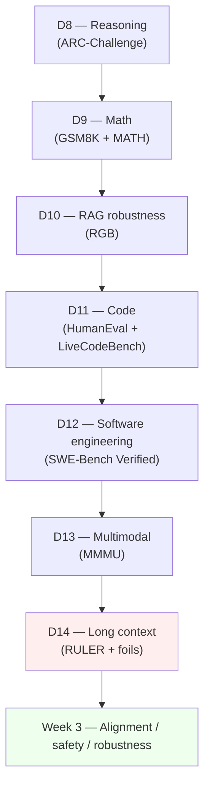

# Day 14 — Long-context evaluation: RULER and the effective-context-length metric

## TL;DR

A model's *claimed* context length is an architectural ceiling; its *effective* context length is the longest input at which it actually does the task. RULER (Hsieh et al. 2024) — **13 synthetic tasks across 4 categories**, parameterized by sequence length — turns that gap into a single number by picking the longest $L$ at which the model's mean RULER score stays above $\tau = 0.856$. The lesson installs the metric, walks one worked computation, and names the foils (LongBench-v2, ∞-Bench, BABILong) that anchor the long-context axes RULER deliberately leaves out.

## Learning objectives

By the end of this lesson, you will be able to:

1. **(L2)** State why perplexity is structurally inadequate for long-context capability evaluation, and distinguish *claimed* from *effective* context length.
2. **(L3)** *Compute* a model's effective context length under RULER's threshold rule given an accuracy-vs-length curve and the reference threshold $\tau = 0.856$.
3. **(L4)** *Decompose* RULER's 13-task taxonomy into its four categories (Retrieval, Multi-hop Tracing, Aggregation, Question Answering) and explain which conflated capability each category isolates.
4. **(L4)** *Contrast* vanilla single-NIAH with RULER's MK-NIAH, identifying which capability (localization vs. discrimination) each one tests.
5. **(L5)** *Evaluate* a vendor claim that headlines a saturated vanilla-NIAH score at the full claimed length, and judge what evidence a long-context-careful reader should still demand.
6. **(L4)** *Articulate* how RULER's retrieval-axis anchoring relates to the orthogonal foils — LongBench-v2 (real-document QA), ∞-Bench (100K+ mixed domains), BABILong (rule-tracking in irrelevant haystack) — and why a complete long-context report cites at least two axes.

## Prerequisites & callback

Two prior lessons are load-bearing today. **[D-5](/lesson/5)'s statistical-hygiene machinery** — confidence intervals and the "is a delta resolvable?" framing — is the toolkit for reading any RULER score: the effective-context-length metric is itself a CI-aware aggregation (a *threshold* over a noisy curve, not a point estimate), and the same per-item SE math from [D-5](/lesson/5) is what tells you whether two adjacent length-bins are distinguishable. **[D-1](/lesson/1)'s pipeline framing** — that an evaluation is a (dataset, scoring rule, reporting convention) triple — is what lets us locate the claimed-vs-effective gap as a property of the *reporting convention*: spec sheets advertise an architectural cap, but RULER's *scoring rule* is "highest $L$ at which mean accuracy $\geq \tau$", and the two answer different questions about the same model. Today's lesson is the first capability-axis lesson where the input itself, not just the scoring rule, becomes the object of measurement.

## The opening hook

Every frontier model ships with a *claimed* context length on its spec sheet — 128K, 200K, 1M, 2M tokens. That number is a property of the architecture and the inference stack: it tells you how many tokens the model will *accept* before it errors out. It does not tell you how many tokens the model will *use*. A model that accepts 1M tokens may, in practice, retrieve a fact reliably only up to 64K — beyond that, accuracy on even the simplest retrieval task collapses, and the remaining 936K tokens are decorative.

The pattern of claimed-length-much-greater-than-effective-length is now the standard finding in long-context evaluation. RULER (Hsieh et al. 2024) is the benchmark that made the gap visible by giving the field a single, controllable, threshold-based metric — **effective context length** — that everyone could compute on the same axes.

It is also a *single anchor*. Long-context evaluation is genuinely multi-axis: retrieval is one axis, document understanding is another, rule-tracking is a third. RULER is the cleanest entry point for the retrieval axis because it is synthetic, controllable, and reports a single comparable number per model. It is *not* a complete picture. The design-space sidebar at the end of this lesson names the foils — LongBench-v2, ∞-Bench, BABILong — that cover the axes RULER deliberately leaves out. Downstream lessons should not equate "long-context evaluation" with RULER.

## Why long-context evaluation needs its own framing

Static MC benchmarks (Week 1) feed the model a few-hundred-token prompt; the only thing the context length stresses is the prompt template. As soon as a benchmark's inputs reach 10K+ tokens, two new failure modes appear that no Week 1 metric measures:

1. **Position-dependent retrieval.** A fact inserted at depth 50% (the middle of the context) is harder to retrieve than the same fact at depth 0% or 100% — the **lost-in-the-middle** finding (Liu et al. 2024). Models attend more strongly to context boundaries.
2. **Length-dependent degradation.** Accuracy on a fixed task shape monotonically declines as the context grows, even when the task itself does not get harder. A model that scores 95% on a retrieval task at 4K tokens may score 60% on the *same task* at 64K and 20% at 128K.

Perplexity does *not* reliably surface these failures. A model can have low perplexity on a long document — meaning it predicts the next token well *on average* — while completely failing to retrieve a specific fact embedded in that document. Perplexity is a token-level distributional metric; long-context capability is a task-level retrieval-and-reasoning metric. The distinction is sharp:

$$
\text{Perplexity}(x_{1:T}) = \exp\!\left(-\frac{1}{T}\sum_{t=1}^{T}\log P(x_t \mid x_{<t})\right)
$$

is averaged over all $T$ tokens and dominated by the typical-case prediction. A long-context retrieval task instead asks: conditional on a context of length $L$, can the model answer a query whose answer depends on a *specific* token span at depth $d \in [0, 1]$? That is a very different question, and pre-RULER long-context papers that reported only perplexity were measuring the wrong thing.

## The pre-RULER NIAH baseline

Before RULER, the de facto long-context probe was Greg Kamradt's **Needle in a Haystack** (NIAH) test, shared as an informal benchmark on GitHub in November 2023. The methodology:

1. Take a long document (originally Paul Graham essays concatenated to the target length).
2. Insert a single out-of-place sentence — the "needle" — at a controllable depth, e.g. *"The best thing to do in San Francisco is eat a sandwich and sit in Dolores Park on a sunny day."*
3. Ask the model the corresponding question, conditioned on the full document plus the needle.
4. Sweep across context lengths $L \in \{1\text{K}, 2\text{K}, \ldots, L_{\max}\}$ and depths $d \in \{0\%, 10\%, \ldots, 100\%\}$.
5. Plot a 2D heatmap (length × depth) with per-cell pass/fail.

NIAH was viral because the heatmap is *legible* — you can see the lost-in-the-middle band as a dark stripe across the middle depths. But it has two limitations that RULER set out to fix:

- **One task, one needle.** Vanilla NIAH only tests single-fact retrieval. A model that aces single-needle NIAH may fail at multi-key retrieval, multi-value retrieval, multi-hop tracing, or aggregation.
- **No single comparable metric.** Each model produces a different heatmap; comparing two models means comparing two pictures.

By 2024, frontier models were saturating vanilla NIAH near 100% across their full claimed context. That made vanilla NIAH a *necessary but not sufficient* probe — passing it told you nothing about whether the model could do real long-context work.

## Anchor: RULER (Hsieh et al. 2024)

**Citation.** Hsieh, C.-P., Sun, S., Kriman, S., Acharya, S., Rekesh, D., Jia, F., Zhang, Y., & Ginsburg, B. (2024). *RULER: What's the Real Context Size of Your Long-Context Language Models?* COLM 2024. arXiv:2404.06654.

RULER is a synthetic benchmark with **13 tasks across 4 categories**, each parameterized by sequence length so the same task can be run at 4K, 8K, 16K, 32K, 64K, 128K, etc. The tasks are designed to dissociate four capabilities that vanilla NIAH conflates.

### The 13 tasks and 4 categories

```mermaid
flowchart TB
    R["Retrieval (8 NIAH variants)"]
    M["Multi-hop Tracing (1 task)"]
    A["Aggregation (2 tasks)"]
    Q["Question Answering (2 tasks)"]

    R --> R1["S-NIAH (passkey)"]
    R --> R2["S-NIAH (vanilla)"]
    R --> R3["S-NIAH (UUID)"]
    R --> R4["MK-NIAH (4 distractor needles)"]
    R --> R5["MK-NIAH (line retrieval)"]
    R --> R6["MK-NIAH (KV / UUID retrieval)"]
    R --> R7["MV-NIAH (4 values per key)"]
    R --> R8["MQ-NIAH (4 distinct queries)"]

    M --> M1["Variable Tracking (chain of 4 name-binding hops)"]

    A --> A1["Common Words Extraction (CWE)"]
    A --> A2["Frequent Words Extraction (FWE, Zeta dist.)"]

    Q --> Q1["SQuAD-style QA"]
    Q --> Q2["HotpotQA-style QA (multi-hop)"]
```



Why this taxonomy matters:

- **Retrieval (8 of 13)** is the NIAH family, expanded along three dimensions. *Single* NIAH varies the needle type (a numeric passkey, a vanilla sentence, a UUID). *Multi-key* NIAH adds distractor needles that look like the target but aren't. *Multi-value* NIAH binds multiple values to one key and asks for all of them. *Multi-query* NIAH puts several distinct needles in the haystack and queries each. A model can ace single-NIAH and fail multi-key NIAH because the latter requires *discrimination*, not just retrieval.
- **Multi-hop Tracing** asks the model to follow a chain of variable bindings: `X1 = 12345`, `X2 = X1`, `X3 = X2`, `X4 = X3`, `X5 = X4`. The model must return all five names that resolve to `12345`. This tests whether long context supports *internal computation*, not just lookup.
- **Aggregation** asks the model to find the most common or most frequent words in the context. This is structurally different from retrieval — there is no single "needle" to find; the model has to maintain counts across the entire context.
- **Question Answering** uses real SQuAD and HotpotQA items, padded with distractor passages drawn from the same corpus, so the long context is naturalistic rather than synthetic. This is the bridge between RULER's controllable synthetic regime and the noisier real-document regime that the foil benchmarks (below) target.

### Example item: NIAH-with-distractors

The cleanest illustration is **MK-NIAH-2** (multi-key with distractors). The needle is a UUID-keyed value; the haystack is a long stream of *other* UUID-keyed values that look identical in form but are not the target. Schematically:

```
[long padding text...]
The special key is 8a3f-2e91-bc44.
[long padding text...]
Magic number for 8a3f-2e91-bc44 is 47281.   <-- target needle
[long padding text...]
Magic number for 7c1d-9e22-aa15 is 39104.   <-- distractor
Magic number for 4f88-1b53-ce72 is 18603.   <-- distractor
[long padding text...]

Question: What is the magic number for 8a3f-2e91-bc44?
```

Vanilla NIAH would have *only* the target line; the model just has to find the one out-of-place sentence. MK-NIAH adds distractors, so the model has to discriminate the right key — a genuine retrieval task rather than an anomaly-detection one. Frontier models that scored 100% on vanilla NIAH at 128K typically drop 10–30 points on MK-NIAH at the same length. The construction is the entire point: vanilla NIAH was too easy to be informative once models got good at it, and MK-NIAH restores the headroom that the distractors provide.

## ⏵ Check yourself — vanilla vs. MK-NIAH

A model scores 99% on vanilla single-NIAH at 128K, and 71% on MK-NIAH-2 (UUID retrieval with 4 distractor needles) at the same length. The lengths and depths are matched; only the haystack structure differs. **Decompose** which capability the 28-point drop isolates, and what the gap implies for citing the vanilla-NIAH score on its own.

<details>
<summary>Show answer</summary>

The drop isolates *discrimination*, not localization. Vanilla NIAH only requires finding the one out-of-place sentence in an otherwise homogeneous haystack — that is fundamentally an anomaly-detection task. MK-NIAH-2 places several keyed values that look structurally identical to the target and asks the model to pick the *right* key; that requires reading the question, comparing against multiple candidates, and selecting the matching binding. A 28-point gap at fixed length and depth says the model can locate an anomaly but cannot reliably discriminate among similarly-formatted candidates at this length.

The implication for reporting: a vanilla-NIAH score is necessary but not sufficient. A 99% vanilla number alone does not license claims about long-context retrieval more broadly. RULER's whole point is that *retrieval* is at least four sub-capabilities — single-key, multi-key (discrimination), multi-value (exhaustive recall), multi-query (parallel) — and headline numbers should report at least the first two.

</details>

### The effective-context-length metric

RULER's headline contribution is a single threshold-based summary: **a model's effective context length is the longest length $L$ at which its averaged RULER score across the 13 tasks meets a quality threshold of 85%.**

Formally, let $s_m(L)$ be model $m$'s mean accuracy across the 13 RULER tasks at sequence length $L$. The effective context length is

$$
L^{\text{eff}}_m = \max\{L : s_m(L) \geq \tau\}, \quad \tau = 0.856
$$

where $\tau$ is calibrated against Llama-2-7B's score at its native 4K context (≈85.6%). The intuition: 4K is the length at which Llama-2-7B was trained, so its 4K performance defines "what a competent short-context model looks like on these tasks." A model claiming 128K+ context should at minimum match that bar throughout its claimed length. If $s_m(128\text{K}) < \tau$, the model's *claimed* 128K is not its *effective* 128K.

This is a measurement story about a marketed-vs-underlying gap. The marketed metric — claimed context length — is the one in spec sheets and product announcements. The underlying capability — does the model actually use those tokens — is what users care about. RULER's effective context length is the field's attempt to put a number on the *underlying* capability, in roughly the same spirit that [D-7](/lesson/7)'s expert-validated GPQA Diamond is an attempt to put a number on the underlying capability that "MMLU score" was supposed to be measuring before saturation.

> **Worked example.** Compute the effective context length for a hypothetical model whose mean RULER score curve $s_m(L)$ is reported as:
>
> | $L$ | 4K | 8K | 16K | 32K | 64K | 128K | 256K |
> | --- | --- | --- | --- | --- | --- | --- | --- |
> | $s_m(L)$ | 0.94 | 0.92 | 0.90 | 0.87 | 0.84 | 0.71 | 0.42 |
>
> Apply the rule $L^{\text{eff}} = \max\{L : s_m(L) \geq 0.856\}$.
>
> - At $L = 32\text{K}$: $s_m = 0.87 \geq 0.856$. Pass.
> - At $L = 64\text{K}$: $s_m = 0.84 < 0.856$. **Fail.**
>
> So $L^{\text{eff}}_m = 32\text{K}$. Note two things. First, the curve is monotone-decreasing — once it drops below $\tau$, the metric does not "recover" at longer lengths even if a single bin happens to spike above the threshold. The standard convention is to report the longest length where the curve stays $\geq \tau$ contiguously from short lengths up. Second, the gap between $L^{\text{eff}} = 32\text{K}$ and a possibly-claimed 1M context window is the headline number a careful reader extracts: a 32× claimed-vs-effective ratio is not unusual for 2024-era frontier models, and the gap is exactly what spec-sheet readers should ask vendors to disclose.

The pattern in RULER's results — and the pattern that has held across model releases since — is that effective context lags claimed context by a large factor:

| Model (paper-era) | Claimed length | Effective length (RULER, $\tau = 85.6\%$) |
| --- | --- | --- |
| GPT-4-1106-preview | 128K | 64K |
| Llama-3.1-70B | 128K | 64K |
| Mistral-Large | 128K | 64K |
| Gemini-1.5-Pro | 1M | >128K (paper-era cap) |
| Jamba-1.5-Large | 256K | >128K |

(Numbers are paper-era; specific models drift, the *gap* persists. Cite primary system cards or the live leaderboard at https://github.com/NVIDIA/RULER for current numbers — the same drift caveat from [D-7](/lesson/7) applies. Several frontier models released in 2025–2026 advertise 1M+ tokens; effective context as measured by RULER-style protocols typically remains well below the claimed length, often by 4–16×.)

The drift caveat is structural, not incidental: as models train on more long-context data and as inference stacks improve, the gap between claimed and effective will close, but the *measurement protocol* — synthetic tasks at controllable lengths with a threshold — is what stays useful even as specific numbers age.

## ⏵ Check yourself — effective length on a noisy curve

A second model reports the curve

| $L$ | 4K | 8K | 16K | 32K | 64K | 128K |
| --- | --- | --- | --- | --- | --- | --- |
| $s_m(L)$ | 0.93 | 0.90 | 0.88 | 0.83 | 0.86 | 0.55 |

The 32K bin dips to 0.83 (below $\tau$), but the 64K bin recovers to 0.86 (above $\tau$). **Compute** the effective context length under RULER's standard contiguous-from-short-lengths convention, and explain why the recovery at 64K does not extend $L^{\text{eff}}$ past 32K.

<details>
<summary>Show answer</summary>

$L^{\text{eff}} = 16\text{K}$. The contiguous-pass-from-short-lengths convention requires every bin from 4K up to and including the reported length to satisfy $s_m \geq \tau$. The dip at 32K (0.83 < 0.856) breaks the contiguous run; 16K is the last length at which all earlier bins also passed.

The 64K recovery is real but does not license extending the claim. Operationally, an isolated above-threshold bin between two below-threshold neighbours is more likely to be sampling noise ([D-5](/lesson/5)'s sampling-noise floor) on a small per-bin item count than a genuine capability return. RULER's threshold rule is conservative on purpose: it is built to make claimed-vs-effective gaps visible, not to give the model the benefit of the doubt on the longest favourable bin. Reporting a non-contiguous effective length would also re-introduce the cherry-pick failure mode that the metric was designed to suppress.

</details>

### Running RULER

RULER ships its own evaluator (the benchmark-native pattern from [D-5](/lesson/5) onward — when the benchmark's task structure is non-trivial, the canonical implementation lives with the benchmark, not in `lm-evaluation-harness`). The repo is at `https://github.com/NVIDIA/RULER`. A canonical run sweeps a model across `{4K, 8K, 16K, 32K, 64K, 128K}` and reports per-task and aggregate scores at each length. The aggregate-vs-length curve is the artifact you actually consume; the effective context length is the highest $L$ at which that curve sits above $\tau$.

## Design-space sidebar — RULER's foils

RULER is a *single anchor on the retrieval axis*. The long-context evaluation literature is multi-axis, and three contemporaneous benchmarks anchor axes that RULER deliberately doesn't cover. They are not anchors in this curriculum — they are *foils* that make RULER's scope explicit.

| Benchmark | Citation | Axis it anchors | What RULER doesn't cover that this does |
| --- | --- | --- | --- |
| **LongBench-v2** | Bai et al. 2024 (arXiv:2412.15204) | Realistic-document QA + reasoning | Real human-written documents (8K–2M words) across single-doc QA, multi-doc QA, in-context learning, dialogue, code repos, structured data. Hard for human experts (53.7% in 15 min). |
| **∞-Bench / InfiniteBench** | Zhang et al. 2024 (arXiv:2402.13718) | 100K+ token tasks across mixed domains | 12 tasks averaging >100K tokens spanning retrieval, code, math, novels, dialogue (English + Chinese). Pushes the *length* axis past where RULER's reported leaderboard typically goes. |
| **BABILong** | Kuratov et al. 2024 (arXiv:2406.10149) | Rule-tracking embedded in irrelevant text | 20 bAbI reasoning tasks (fact chaining, induction, deduction, counting) padded with PG-19 book text out to 10M tokens. Measures *reasoning across* facts distributed in a haystack, not just retrieval. |

The four together cover roughly orthogonal axes: synthetic-vs-natural (RULER, BABILong synthetic; LongBench-v2, ∞-Bench natural), retrieval-vs-reasoning (RULER retrieval-heavy; BABILong reasoning-heavy), and length regime (BABILong's 10M tokens dwarfs everything else). A model that aces RULER at 128K and fails LongBench-v2 at 32K is not contradicting itself — it has good retrieval and weak document understanding, and those are two different capabilities. A complete long-context eval report cites at least two axes; using only RULER over-indexes on retrieval.

## ⏵ Check yourself — multi-axis reporting

You read a system card claiming "RULER 92% effective at 128K" with no other long-context numbers. **Which axes** of long-context capability are still unreported, and what is the most defensible thing the model card should add?

<details>
<summary>Show answer</summary>

RULER alone covers the *retrieval* axis on synthetic inputs. The unreported axes include (a) *real-document understanding* (LongBench-v2 anchors this — natural documents vs. synthetic haystacks), (b) *rule-tracking* under irrelevant context (BABILong — reasoning across distributed facts, not just locating one), and (c) *length regime past 128K* (∞-Bench averages >100K, and several 2025+ models advertise 1M-2M windows that RULER's typical reported range doesn't fully exercise).

The most defensible addition is at least one *natural-document* score — LongBench-v2 is the cleanest pick because its construction guarantees (real human-written long docs, hard-for-experts) directly probe what the synthetic-retrieval RULER number does *not*. A two-axis report ("RULER at 128K = 92%; LongBench-v2 = 41%") is the kind of cite a long-context-careful reader can actually use; a one-axis report invites the reader to over-generalize from retrieval to all of long-context capability.

</details>

## Long context as attack surface

> **Safety researcher's note.** Long-context capability is the substrate on which several Week 3–4 attack surfaces depend. **Indirect prompt injection** ([D-26](/lesson/26)) is the canonical case: as context windows grow from 32K to 1M+, the volume of attacker-controllable content the model can be made to ingest — through retrieval-augmented generation, web browsing, ingested files, email tool outputs — scales with the window. A 1M-token context is a 1M-token *attack surface* if any of those tokens come from a source the user does not control. **Retrieval poisoning** is the special case where the attacker's content is in a retrieved document; **agentic indirect-PI** (AgentDojo, InjecAgent — [D-26](/lesson/26)) is the case where the attacker's content arrives through tool calls. Long-context evaluation is therefore not just a capability story. A model with 4× higher effective context and unchanged jailbreak-robustness has 4× the indirect-PI surface, and that delta is what frontier-safety teams pay attention to. The [D-14](/lesson/14) capability number is one input to the [D-26](/lesson/26) threat-model number. ([D-13](/lesson/13)'s MMMU is the sister-modality benchmark for the analogous "as input modalities expand, attack surface expands" framing — vision-injected jailbreaks scale the same way as long-context-injected ones.)

## Cross-references

**Backward.**

- [D-1](/lesson/1) — extends [D-1](/lesson/1)'s *(dataset, scoring rule, reporting convention)* triple by treating the input *length* itself as a controlled axis of the dataset.
- [D-5](/lesson/5) — uses [D-5](/lesson/5)'s CI machinery as the load-bearing toolkit for reading per-bin RULER scores and judging whether two adjacent length-bins are distinguishable.
- [D-7](/lesson/7) — reuses the saturation framing applied to vanilla NIAH (saturated by 2024) and the *successor-by-construction* pattern for RULER's MK / MV / MQ extensions.
- [D-13](/lesson/13) — multimodal evaluation is the sister-axis story: input modality expands the same way input length does, and the headline-number-conceals-axis-coverage pattern is identical.

**Forward.**

- [D-22](/lesson/22) — the QA-category items in RULER (SQuAD/HotpotQA-style) sit upstream of LLM-as-judge debates: when the answer is free-form, scoring conventions are a separable design choice from length.
- [D-26](/lesson/26) — *indirect prompt injection* and the "long context is an attack surface" framing pick up the safety-side specialization of today's capability number.
- [D-27](/lesson/27) — OS-level agents read screen state into very long context windows; [D-14](/lesson/14)'s claimed-vs-effective gap is the load-bearing reason their reasoning degrades on long sessions.

## Week 2 review

Week 2 has been one connected argument about what models can do, with each lesson naming an axis the previous one didn't cover.



The chain reads as a single argument: capability evaluation is *not* one number per model. It is a stack of axes — deductive reasoning ([D-8](/lesson/8)), mathematical reasoning with the CoT-vs-direct gap and process supervision ([D-9](/lesson/9)), retrieval-augmented robustness with the noise/rejection/integration/counterfactual quartet ([D-10](/lesson/10)), exec-based code generation with the contamination story ([D-11](/lesson/11)), real-world software engineering on actual GitHub issues ([D-12](/lesson/12)), multimodal reasoning that tests vision-grounded reasoning rather than perception alone ([D-13](/lesson/13)), and long-context capability with the claimed-vs-effective gap ([D-14](/lesson/14)). Two recurring patterns sit across the week. First, **the contamination-resistant successor pattern from [D-7](/lesson/7)** runs through every lesson: HumanEval → LiveCodeBench, MMLU → MMLU-Pro/GPQA, MMMU → MMMU-Pro, vanilla NIAH → RULER. Second, **single-number reporting is increasingly inadequate**: [D-11](/lesson/11) already needs `pass@k` instead of accuracy, [D-13](/lesson/13) needs subject-domain breakdowns, [D-14](/lesson/14) needs accuracy-vs-length curves and a threshold. By the end of Week 2, "what's the score?" is not a well-posed question without a clarifying "on which axis, at which length, with which scoring rule, on which subset?".

## Week 2 handoff

You are now equipped to read any capability-axis benchmark with the same structural lens: identify the axis (knowledge, reasoning, math, RAG, code, SWE, multimodal, length), name the saturated predecessor and the construction-resistant successor, ask whether the headline number aggregates over a curve or a matrix that should be reported instead, and check whether at least two axes are cited when the claim generalizes beyond the one anchor's regime. Week 3 turns the lens. The question stops being *what can the model do* and starts being *what does the model do that we don't want it to* — imitative falsehoods ([D-15](/lesson/15) TruthfulQA), bias ([D-16](/lesson/16) BBQ), situational awareness ([D-17](/lesson/17) SAD), instruction-following ([D-18](/lesson/18) IFEval), jailbreaks and harm elicitation ([D-19](/lesson/19) HarmBench), sycophancy ([D-20](/lesson/20)), and dangerous-capability proxies ([D-21](/lesson/21) WMDP). The capability ceiling Week 2 measured is the floor under which Week 3's safety questions become urgent: the higher the capability, and the wider the input surface ([D-13](/lesson/13) modalities, [D-14](/lesson/14) length), the more the safety delta matters. [D-15](/lesson/15) opens with the design move that makes a benchmark "safety" rather than "capability" — *what the dataset rewards* — and TruthfulQA's incentive structure is the canonical case.

## Takeaways

1. Long-context evaluation is not a perplexity story. Perplexity averages over tokens; long-context tasks ask whether a *specific* fact at a *specific* depth is retrievable at a *specific* length. The two metrics can disagree completely. *(LO 1)*
2. The pre-RULER baseline was Greg Kamradt's NIAH (Nov 2023): one needle, one haystack, sweep length × depth. Frontier models saturated vanilla NIAH by 2024 — passing it became necessary but not sufficient. *(LO 5)*
3. RULER (Hsieh et al. 2024) is **13 tasks across 4 categories** — Retrieval (8 NIAH variants: single, multi-key, multi-value, multi-query), Multi-hop Tracing (variable tracking), Aggregation (CWE, FWE), Question Answering (SQuAD, HotpotQA-style). The taxonomy dissociates retrieval, discrimination, internal computation, and counting. *(LO 3)*
4. **Effective context length** is the longest contiguous-from-short-lengths $L$ at which a model's mean RULER score $\geq 0.856$ (calibrated against Llama-2-7B at native 4K). Computing it is a thresholding operation on the accuracy-vs-length curve. *(LO 2)*
5. Vanilla NIAH tests *localization* (one out-of-place sentence); MK-NIAH adds distractors and tests *discrimination*. The drop from 100% vanilla to 70-90% MK at fixed length is the typical signature of the gap between the two capabilities. *(LO 4)*
6. RULER is a *single anchor on the retrieval axis*. LongBench-v2 (real-document QA), ∞-Bench (100K+ tokens, mixed domains), and BABILong (rule-tracking in irrelevant haystack) anchor orthogonal axes. A complete long-context eval report cites at least two axes — do not equate "long-context evaluation" with RULER. *(LO 6)*
7. Long-context capability is also an attack surface: indirect prompt injection ([D-26](/lesson/26)) scales with the window. Capability and safety evaluation are coupled at long context. *(LO 5)*

## Glossary

- **needle in a haystack (NIAH)**: an out-of-place sentence inserted into a long document at a controllable depth, used to probe single-fact retrieval at long context [introduced D-14](/lesson/14).
- **multi-key NIAH (MK-NIAH)**: NIAH variant with several distractor needles bound to different keys, forcing discrimination rather than anomaly-detection [introduced D-14](/lesson/14).
- **effective context length**: $L^{\text{eff}} = \max\{L : s_m(L) \geq \tau\}$ with $\tau = 0.856$, the threshold-based summary RULER uses to reduce a length × accuracy curve to a single comparable number per model [introduced D-14](/lesson/14).
- **lost in the middle**: the empirical finding (Liu et al. 2024) that facts at intermediate context depth are harder to retrieve than facts near either boundary [introduced D-14](/lesson/14).
- **multi-hop tracing**: RULER's variable-tracking task (e.g., `X1 = 12345; X2 = X1; X3 = X2;` …) — tests internal computation across long context, not just lookup [introduced D-14](/lesson/14).
- **claimed-vs-effective gap**: the (often 4-16×) ratio between a model's spec-sheet context length and its RULER-effective length; the headline pattern long-context evaluation surfaces [introduced D-14](/lesson/14).
- **long-context attack surface**: the indirect-PI threat surface that scales with the input window; couples capability evaluation ([D-14](/lesson/14)) to safety evaluation ([D-26](/lesson/26)) [introduced D-14](/lesson/14).
- **perplexity (long-context limitation)**: token-averaged log-likelihood; structurally inadequate for long-context capability because it does not isolate retrieval of specific facts at specific depths [introduced D-14](/lesson/14).

## References

- **Anchor.** Hsieh, C.-P., Sun, S., Kriman, S., Acharya, S., Rekesh, D., Jia, F., Zhang, Y., & Ginsburg, B. (2024). *RULER: What's the Real Context Size of Your Long-Context Language Models?* COLM 2024. arXiv:2404.06654. https://arxiv.org/abs/2404.06654
- **Harness.** NVIDIA. *RULER source code and leaderboard.* https://github.com/NVIDIA/RULER
- **Secondary.** Kamradt, G. (2023). *Needle In A Haystack — Pressure Testing LLMs.* https://github.com/gkamradt/LLMTest_NeedleInAHaystack — the pre-RULER NIAH baseline.
- **Secondary.** Liu, N. F., Lin, K., Hewitt, J., Paranjape, A., Bevilacqua, M., Petroni, F., & Liang, P. (2024). *Lost in the Middle: How Language Models Use Long Contexts.* TACL. arXiv:2307.03172. https://arxiv.org/abs/2307.03172 — the position-dependent retrieval finding.
- **Secondary.** Bai, Y., et al. (2024). *LongBench v2: Towards Deeper Understanding and Reasoning on Realistic Long-context Multitasks.* arXiv:2412.15204. https://arxiv.org/abs/2412.15204 — real-document QA foil.
- **Secondary.** Zhang, X., et al. (2024). *∞Bench: Extending Long Context Evaluation Beyond 100K Tokens.* ACL 2024. arXiv:2402.13718. https://arxiv.org/abs/2402.13718 — 100K+ mixed-domains foil.
- **Secondary.** Kuratov, Y., Bulatov, A., Anokhin, P., Rodkin, I., Sorokin, D., Sorokin, A., & Burtsev, M. (2024). *BABILong: Testing the Limits of LLMs with Long Context Reasoning-in-a-Haystack.* NeurIPS 2024 D&B. arXiv:2406.10149. https://arxiv.org/abs/2406.10149 — rule-tracking foil.

## Quiz

**Q1.** **Compute** the model's effective context length under RULER's metric: a model with a 1M-token claimed window has mean RULER score $s_m(L) \geq 0.856$ for all $L \leq 64\text{K}$, and $s_m(L) < 0.856$ for all $L > 64\text{K}$.

- A. 64K tokens, the longest length at which mean RULER score meets the 0.856 threshold.
- B. 1M tokens, since RULER reports effective context as equal to the model's architectural context window cap.
- C. The arithmetic mean of 64K and 1M, weighted by RULER's per-task accuracy curve.
- D. Undefined, since RULER only reports effective context for models trained natively on long context.

**Q2.** Why is perplexity an inadequate metric for long-context capability?

- A. Perplexity is computed only on the test set, not on the long-context document supplied at inference time.
- B. Perplexity averages over all tokens; it does not measure whether a specific fact at a specific depth can be retrieved.
- C. Perplexity requires a held-out validation set that long-context benchmarks like RULER do not supply.
- D. Perplexity is inherently bounded above by 1, so it cannot distinguish good from poor long-context recall.

**Q3.** RULER's 13 tasks fall into which 4 categories?

- A. Retrieval, Multi-hop Tracing, Aggregation, Question Answering.
- B. Retrieval, Summarization, Translation, Code Generation.
- C. NIAH-1, NIAH-2, NIAH-3, NIAH-4 (one task family per category).
- D. Knowledge Recall, Logical Reasoning, Mathematical Reasoning, Safety Refusal.

**Q4.** What is the **structural difference** between vanilla single-NIAH and RULER's MK-NIAH (multi-key NIAH)?

- A. MK-NIAH uses Chinese-language haystacks and English-language needles to test cross-lingual retrieval.
- B. MK-NIAH places all needles at exactly depth 50% to isolate the lost-in-the-middle effect.
- C. MK-NIAH adds distractor needles bound to different keys, forcing discrimination rather than localization.
- D. MK-NIAH uses log-likelihood scoring at the needle position; vanilla NIAH uses free-form generative scoring.

**Q5.** Which is the **most defensible reading** of RULER's relationship to the long-context evaluation landscape?

- A. RULER replaces all prior long-context benchmarks; LongBench-v2, ∞-Bench, and BABILong have been formally deprecated by their authors and superseded.
- B. RULER is a closed-source NVIDIA benchmark; LongBench-v2, ∞-Bench, and BABILong are its open-source academic-community alternatives released alongside it.
- C. RULER, LongBench-v2, ∞-Bench, and BABILong are all single-needle NIAH variants with identical task taxonomies and produce equivalent leaderboard rankings.
- D. RULER anchors the retrieval axis; LongBench-v2, ∞-Bench, and BABILong anchor orthogonal axes (real-document QA, 100K+ mixed domains, rule-tracking). A complete report cites at least two.

**Q6.** A vendor announces a new model claiming a 2M-token context window. The model card reports 100% on vanilla NIAH at 2M but does not report RULER scores. From this lesson, the **right reflex** is to:

- A. Trust the 2M figure, since 100% on vanilla NIAH at 2M is the strongest single-task evidence currently available for usable long context across the full window.
- B. Treat 2M as the claimed length and demand the RULER effective-context number, since vanilla NIAH has been near-saturated since 2024 and is necessary but not sufficient.
- C. Conclude the model is unsafe at long context, since unreported RULER scores typically signal that the model fails indirect-PI robustness checks in the safety surface.
- D. Compute perplexity on a representative 2M-token document instead, since perplexity at the claimed length is the field-standard substitute for RULER.

<details>
<summary>Answers</summary>

1. **A** — effective context is $\max\{L : s_m(L) \geq \tau\}$ with $\tau = 0.856$. Above 64K the score is sub-threshold, so the effective length is 64K regardless of the architectural claim.
2. **B** — perplexity is a token-level average; long-context capability is a task-level retrieval-and-reasoning question. A model can have low perplexity on a document and still fail to retrieve a specific embedded fact.
3. **A** — Retrieval (8 NIAH variants), Multi-hop Tracing (variable tracking), Aggregation (CWE, FWE), Question Answering (SQuAD/HotpotQA-style). The taxonomy is the lesson's anchor table.
4. **C** — distractor needles force discrimination, not just localization. Vanilla NIAH conflates the two; MK-NIAH separates them, which is why frontier models that ace vanilla NIAH still drop on MK-NIAH at the same length.
5. **D** — long-context evaluation is multi-axis (retrieval, document understanding, rule-tracking, length regime). RULER anchors retrieval; the foils anchor the other axes. Equating "long-context eval" with RULER is the failure mode this lesson is built to prevent.
6. **B** — vanilla NIAH became near-saturated by 2024; passing it is necessary but not sufficient. RULER's multi-task aggregate plus a threshold-based effective-length number is the standard ask. This is the claimed-vs-effective gap applied to the spec sheet.

</details>
