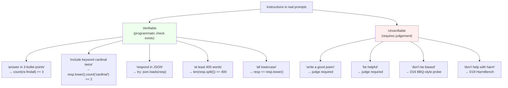

# Day 18 — Instruction-following: IFEval and verifiable-instruction evaluation

## The opening hook

Most "instruction-following" benchmarks score the *content* of a response — was the answer good, was the summary faithful, did the model do what the user asked? Content is a judge problem. As Day 3 established, when the answer is free-form there is no clean automatic metric: $n$-gram overlap is paraphrase-blind, embedding metrics miss negation, and the modern default — LLM-as-judge — drags in self-preference, position bias, verbosity bias, and the cost of a frontier model in the loop (Day 22).

IFEval (Zhou et al. 2023) makes a different design move. Instead of scoring whether the response is *good*, it scores whether the response *satisfies a constraint that can be checked by a 20-line Python function*. "Answer in exactly three bullet points." "Include the keyword 'cardinal' at least twice." "End your response with the postscript 'P.S.'." "Respond in valid JSON." A regex, a `len()` call, or a `json.loads()` settles it. No judge, no embedding model, no human rater — just a deterministic check.

This is the cleanest available answer to the Day 3 free-form-scoring problem on the slice of behaviour where it works: when you can write the check, *write the check*. Reach for a judge only when you can't.

## Verifiable vs. unverifiable instructions

The whole benchmark hinges on a single split.



IFEval lives entirely in the green box. That is its scope, and it is also its honest limitation: most instructions a real user gives a model are in the red box. IFEval is not a complete instruction-following eval. It is the *automatic* slice — the one a CI pipeline can run on every commit without paying for a judge model.

The contrast benchmarks land in the red box and pay the judge cost: **AlpacaEval 2.0** uses GPT-4 to compare candidate vs. reference completions on Vicuna/self-instruct-style prompts; **Arena-Hard-Auto** (covered on D22) uses an auto-judge against a reference model on 500 hard Arena-derived prompts; **MT-Bench** uses GPT-4 to score on a 1–10 scale across 80 multi-turn prompts. All three are good benchmarks. None of them avoids the judge biases. IFEval avoids them by construction — at the cost of testing only the constraints a regex can check.

## Anchor: IFEval (Zhou et al. 2023)

**Citation.** Zhou, J., Lu, T., Mishra, S., Brahma, S., Basu, S., Luan, Y., Zhou, D., & Hou, L. (2023). *Instruction-Following Evaluation for Large Language Models.* arXiv:2311.07911. (Google Research / Yale.)

The paper introduces ~500 prompts, each containing one or more instructions drawn from a taxonomy of **25 verifiable-instruction types across 9 categories**. A prompt typically combines two to four instructions:

> *"Write a 300+ word summary of the Wikipedia page about Saint Mary's College of California. Do not use any commas in your response. Highlight at least 3 sections in your answer with markdown, i.e. \*highlighted section\*."*

Three verifiable instructions, three independent checks: word count, comma count, count of `*…*` spans. Every check is a Python function the IFEval repo ships.

### The 25 instructions across 9 categories

The categories partition the constraint surface. Approximate counts per category (consult the paper's Table 1 for the canonical breakdown):

| Category | Example instructions | What the check does |
| --- | --- | --- |
| **Keywords** | "include keyword X at least N times", "do not include keyword X", "use exactly K of these keywords" | Substring/word-boundary count |
| **Length Constraints** | "≥ N words", "between $a$ and $b$ paragraphs", "exactly N sentences" | `len(re.split(...))` against a bound |
| **Detectable Format** | "respond in JSON", "use markdown headers", "wrap in `<<…>>`", "N highlighted sections" | Format-specific parser / regex |
| **Detectable Content** | "include a postscript starting 'P.S.'", "include exactly N placeholders in square brackets" | Anchor pattern presence |
| **Punctuation** | "do not use any commas" | Character-class count |
| **Change Cases** | "all lowercase", "all caps", "frequency of capital words ≤ N" | `str.lower()` / `str.upper()` equality |
| **Startend** | "wrap entire response in double quotes", "end with the exact phrase 'Is there anything else I can help with?'" | Prefix/suffix match |
| **Combination** | "two responses separated by 6 asterisks `******`", "repeat the request before answering" | Compound structural check |
| **Language** | "respond entirely in Korean" | Language-ID classifier |

The point of the taxonomy isn't memorization. It's that *every* row is a constraint a regex or a small classifier can settle. The benchmark's atom of measurement is "the model's output passed `instruction_check_fn(response, kwargs)`" — a boolean. Everything else is aggregation.

### The four metrics

A prompt $p$ contains $k_p \geq 1$ instructions. Let $\mathbb{1}[c_i(r)]$ be 1 iff response $r$ passes the check for instruction $i$.

**Instruction-level accuracy.** Average over instructions, ignoring how they group into prompts:

$$
\text{Acc}_{\text{inst}} = \frac{\sum_p \sum_{i=1}^{k_p} \mathbb{1}[c_i(r_p)]}{\sum_p k_p}
$$

**Prompt-level accuracy.** A prompt scores 1 iff *every* instruction in it is followed:

$$
\text{Acc}_{\text{prompt}} = \frac{1}{|P|} \sum_{p \in P} \prod_{i=1}^{k_p} \mathbb{1}[c_i(r_p)]
$$

Prompt-level is strictly harder: a prompt with 4 instructions, each independently followed 80% of the time, scores 41% prompt-level and 80% instruction-level. The gap is the lesson — instruction-following compounds multiplicatively.

Each accuracy is then reported under two settings:

**Strict.** The check is run against the raw model response.

**Loose.** The check is run against multiple lightly-transformed versions of the response, and the instruction passes if *any* version passes:

$$
c^{\text{loose}}_i(r) = \bigvee_{t \in T} c_i(t(r))
$$

where $T$ is the powerset of three transformations: (i) strip markdown emphasis (`*`, `**`); (ii) drop the first line (handles "Sure, here it is:"); (iii) drop the last line (handles "Hope this helps!"). The intent is to give partial credit when a model added a polite preamble or markdown formatting that cosmetically violates a constraint without violating its spirit.

The four headline numbers — **prompt-strict, prompt-loose, instruction-strict, instruction-loose** — are reported together, and the *gap* between them is the most informative part. A model that scores well on instruction-loose but poorly on prompt-strict is following individual constraints reasonably but cracking when asked to satisfy three at once *and* not wrap the answer in chatty boilerplate.

### A concrete checker

The benchmark ships with one Python file per check. A representative one:

```python
def check_word_count(response: str, n_min: int = None, n_max: int = None) -> bool:
    """Returns True iff the response's word count is in [n_min, n_max]."""
    n = len(response.split())
    if n_min is not None and n < n_min:
        return False
    if n_max is not None and n > n_max:
        return False
    return True

def check_no_commas(response: str) -> bool:
    return "," not in response

def check_json(response: str) -> bool:
    import json
    try:
        json.loads(response)
        return True
    except (json.JSONDecodeError, ValueError):
        return False
```

That is the entire scoring rule for those instructions. No model is loaded at scoring time. No human judges are paid. The benchmark is reproducible to the byte across machines that share a Python version. This is the property the design buys.

### Running it

In `lm-evaluation-harness`:

```bash
lm_eval \
  --model hf \
  --model_args pretrained=meta-llama/Llama-3.1-8B-Instruct \
  --tasks ifeval \
  --batch_size 8
```

The `ifeval` task is **0-shot generative** by default — the prompts are themselves the instructions, so few-shot exemplars would distort the test. The harness reports the four metrics above. The same dataset is in Inspect (`inspect_evals/ifeval`) and is one of the six benchmarks on Hugging Face's **Open LLM Leaderboard v2** (launched June 2024, retired March 2025; D1 covered the v2 transition), alongside MMLU-Pro, GPQA, MUSR, MATH-Hard, and BBH.

## IFEval vs. judge-based instruction-following

IFEval and the judge-based foils are not substitutes. They measure different cuts.

| Property | IFEval (this lesson) | AlpacaEval 2.0 | Arena-Hard-Auto (D22) | MT-Bench (D22) |
| --- | --- | --- | --- | --- |
| Scope | Programmatically verifiable constraints | Free-form helpfulness vs. reference | Free-form helpfulness vs. reference, hard prompts | Free-form quality, multi-turn |
| Scorer | Python check function | GPT-4-class judge | GPT-4-class judge | GPT-4-class judge |
| Judge biases? | None by construction | Length, position, self-preference | Length-controlled; still self-preference | Position, verbosity, self-preference |
| Cost / 1k prompts | ~$0 (CPU) | ~$10–50 (judge tokens) | ~$10–50 (judge tokens) | ~$5–20 (judge tokens) |
| What it misses | Instruction quality, helpfulness, coherence | Verifiable constraints (the judge often gets these wrong) | Same as AlpacaEval | Same |

The right reading: **report both**. IFEval tells you whether the model can satisfy a hard constraint. The judge-based benchmarks tell you whether, when there's no hard constraint, the model produces output a human would prefer. A model can ace one and fail the other, and the gap is informative — a model that wins on AlpacaEval but loses on IFEval is producing pleasant-sounding prose that doesn't actually do what it was told.

## Goodhart sub-thread: RL on verifiable instructions

The same property that makes IFEval clean to score makes it cheap to optimize. A check function is a reward signal. Post-training pipelines starting around 2024 explicitly target IFEval-style constraints with rule-based rewards: the model is RL'd to satisfy "exactly 3 bullets," "no commas," "valid JSON" against the IFEval check functions or close paraphrases.

This produces models that pattern-match the *form* of an IFEval instruction reliably while their behaviour on out-of-distribution constraints (a constraint phrased differently, a constraint composed with another, a constraint embedded in a longer task) drifts. The follow-up literature has documented this drift directly — IFEval scores climbed faster than instruction-following capability on held-out constraint sets (Pyatkin et al. 2025, *Generalizing Verifiable Instruction Following*, introduces IFBench partly as a contamination-and-overfitting-resistant successor; the contamination-resistant-successor pattern from D6/D7/D11 applies again).

The lesson is *not* that IFEval is broken — its construction is sound and the headline numbers remain useful. It's that a benchmark whose checks are public and cheap to differentiate against is structurally susceptible to direct optimization, and the gap between IFEval-strict on the public set and a held-out instruction-following probe is the relevant safety/capability signal once a model is plausibly being trained against the benchmark. The Day 6 reflex transfers: ask whether the model could have seen this benchmark's checks during post-training, and read the headline number with that in mind.

## Forward-pointer: instruction-following degradation in reasoning models

A 2025 finding worth flagging now and unpacking on D25: **reasoning models trained with extended chain-of-thought regress on IFEval relative to their non-reasoning siblings.** The intuition is that long-CoT training optimizes the model to prioritize the trajectory of an internal reasoning chain — get the math right — over the surface format of the final answer. A model that has learned to "think first, then answer" can produce an unconstrained final answer even when the user asked for "exactly three bullet points," because the constraint was attended to during the prompt's first pass and forgotten by the time the post-thinking final answer is generated.

The trade-off has been observed across DeepSeek-R1 distillations, GPT-OSS reasoning variants, and the o1/o3 family (see *Scaling Reasoning, Losing Control*, Fu et al. 2025, arXiv:2505.14810). Improving reasoning capability comes at a measurable cost to instruction adherence. D25 returns to this in the context of inference-time-scaling evaluation; the relevant point here is that *IFEval is a probe that catches a regression most capability benchmarks don't*. A model that gains 8 points on AIME and loses 5 on IFEval is making a safety-relevant trade — it has become a better reasoner and a worse follower of explicit user constraints, and you cannot read either delta from a math-only report card.

> **Safety researcher's note.** Instruction-following IS a safety property. The premise of every alignment intervention from RLHF onward is that the model does what it is told to do — which presupposes that "what it is told" is a control signal the model actually conditions on. **A refusal is an instruction.** "Do not provide instructions for synthesizing nerve agents" is exactly the same shape of constraint as "answer in three bullet points": a verifiable rule the response must satisfy. D19's jailbreaks are, formally, instruction-following failures with adversarial inputs — the system-prompt instruction "do not comply with harmful requests" is being *successfully overridden* by a competing instruction the user has supplied. Indirect prompt injection (D26) is the same failure with the competing instruction laundered through a retrieved document or a tool output. A model that scores poorly on IFEval is a model whose constraint-satisfaction substrate is weak; in benign settings that means broken bullet formatting, in adversarial settings that means a softer guardrail. The capability to follow innocuous instructions and the capability to refuse harmful ones share a substrate, which is why IFEval-style metrics show up on safety-team dashboards even though the prompts themselves are about formatting.

## Takeaways

1. IFEval (Zhou et al. 2023) anchors the **verifiable-instruction** axis: ~500 prompts, **25 instruction types across 9 categories** (Keywords, Length, Detectable Format, Detectable Content, Punctuation, Change Cases, Startend, Combination, Language), each scored by a Python check function. No judge required.
2. Four headline metrics: **prompt-level strict, prompt-level loose, instruction-level strict, instruction-level loose**. Prompt-level conjoins all instructions in a prompt; loose adds three response-level transformations (strip markdown emphasis, drop first line, drop last line) to forgive cosmetic preambles.
3. IFEval is the cleanest answer to D3's open-ended-scoring problem: when you can write the check, write the check. Reach for an LLM judge (D22) only when no verifiable formulation exists.
4. AlpacaEval, Arena-Hard-Auto, and MT-Bench cover the *unverifiable* slice of instruction-following with judge-based scoring. Report both; the gap is informative.
5. **Goodhart sub-thread.** Public, cheap check functions are easy RL targets. IFEval-strict on the public set can rise without underlying instruction-following capability rising; IFBench (Pyatkin et al. 2025) is the contamination-resistant successor pattern applied to this benchmark.
6. **Forward to D25.** Reasoning-model training (long CoT, RL on math) regresses IFEval scores relative to non-reasoning siblings — a measurable trade between reasoning ability and constraint adherence.
7. **Safety framing.** Refusal is an instruction; jailbreaks (D19) and indirect PI (D26) are instruction-following failures under adversarial pressure. The capability that lets a model honour "answer in JSON" and the capability that lets it honour "do not produce CSAM" share a substrate.

## References

- **Anchor.** Zhou, J., Lu, T., Mishra, S., Brahma, S., Basu, S., Luan, Y., Zhou, D., & Hou, L. (2023). *Instruction-Following Evaluation for Large Language Models.* arXiv:2311.07911. https://arxiv.org/abs/2311.07911
- **Anchor code.** Google Research. *IFEval source code and data.* https://github.com/google-research/google-research/tree/master/instruction_following_eval
- **Harness.** EleutherAI. *lm-evaluation-harness, ifeval task.* https://github.com/EleutherAI/lm-evaluation-harness/tree/main/lm_eval/tasks/ifeval
- **Inspect implementation.** UK AISI. *inspect_evals/ifeval.* https://ukgovernmentbeis.github.io/inspect_evals/evals/reasoning/ifeval/
- **Open LLM Leaderboard v2 (archived).** Hugging Face. *About the v2 benchmark suite (IFEval, BBH, MATH-Hard, GPQA, MUSR, MMLU-Pro).* https://huggingface.co/docs/leaderboards/en/open_llm_leaderboard/archive
- **Foil — judge-based.** Li, X., et al. (2023). *AlpacaEval: An Automatic Evaluator of Instruction-following Models.* https://github.com/tatsu-lab/alpaca_eval — and Zheng, L., et al. (2023). *Judging LLM-as-a-Judge with MT-Bench and Chatbot Arena.* arXiv:2306.05685. https://arxiv.org/abs/2306.05685 (Full treatment on D22.)
- **Successor / overfitting probe.** Pyatkin, V., et al. (2025). *Generalizing Verifiable Instruction Following* (IFBench). arXiv:2507.02833. https://arxiv.org/abs/2507.02833
- **Reasoning-model trade-off (forward-ptr to D25).** Fu, T., et al. (2025). *Scaling Reasoning, Losing Control: Evaluating Instruction Following in Large Reasoning Models.* arXiv:2505.14810. https://arxiv.org/abs/2505.14810

## Quiz

**Q1.** A prompt contains 4 verifiable instructions. The model satisfies each one *independently* with probability 0.8. Assuming independence, what are the model's expected instruction-level and prompt-level accuracies on this prompt?

- A. Both 0.8.
- B. Instruction-level 0.8; prompt-level $0.8^4 \approx 0.41$.
- C. Instruction-level $0.8^4 \approx 0.41$; prompt-level 0.8.
- D. Both $0.8 \times 4 = 3.2$.

**Q2.** What is the difference between IFEval's *strict* and *loose* accuracy?

- A. Strict uses 0-shot, loose uses 5-shot.
- B. Strict checks the raw response; loose checks the response under multiple light transformations (strip markdown emphasis, drop first line, drop last line) and passes if any transformation satisfies the instruction.
- C. Strict requires exact match; loose uses BLEU.
- D. Strict scores prompt-level only; loose scores instruction-level only.

**Q3.** Why is IFEval a structurally cleaner benchmark than AlpacaEval or MT-Bench for the constraints it covers?

- A. IFEval has more prompts.
- B. IFEval scores with deterministic Python check functions, so it avoids the position, verbosity, length, and self-preference biases that judge-based evaluation introduces.
- C. IFEval is multilingual and the others are English-only.
- D. IFEval uses log-likelihood scoring and the others use generative scoring.

**Q4.** Which is **not** a category in IFEval's 9-category taxonomy of verifiable instructions?

- A. Length Constraints (e.g., "≥ 400 words").
- B. Detectable Format (e.g., "respond in JSON").
- C. Factual Accuracy (e.g., "all stated dates are correct").
- D. Change Cases (e.g., "all lowercase").

**Q5.** A vendor reports IFEval prompt-strict = 0.85 for a new model that was post-trained with RL on rule-based rewards. The same vendor's previous model (without IFEval-targeted RL) scored 0.55. What is the right reading?

- A. The new model is unambiguously better at instruction-following; the score gain is the capability gain.
- B. The score gain is real on the IFEval distribution, but a fraction of it likely reflects optimization against IFEval's specific check functions and may not transfer to held-out constraints. A contamination-resistant successor like IFBench would be the natural cross-check.
- C. The gain is meaningless because IFEval has been retired.
- D. The gain proves the new model is unsafe.

**Q6.** A 2025 reasoning model (extended-CoT post-training) scores **+8 points on AIME** and **−5 points on IFEval prompt-strict** versus its non-reasoning sibling. What does this tell a safety-leaning practitioner?

- A. Nothing — the two benchmarks are unrelated.
- B. The reasoning training improved math at the cost of explicit-constraint adherence; instruction-following has measurably regressed, and since refusal is itself an instruction the regression is safety-relevant — D25 returns to this trade-off.
- C. The IFEval drop must be a measurement artifact since reasoning models are more capable.
- D. The model should be retrained from scratch.

<details>
<summary>Answers</summary>

1. **B** — instruction-level accuracy averages over instructions (4 instructions × 0.8 each averages to 0.8). Prompt-level requires *all* instructions to pass simultaneously, so under independence it's $0.8^4 \approx 0.4096$. The instruction-level/prompt-level gap is the multiplicative-compounding lesson.
2. **B** — loose applies the powerset of three response-level transformations (markdown emphasis stripping, first-line drop, last-line drop) and passes if any combination satisfies the check. Strict checks the raw response. The intent is to forgive cosmetic preambles like "Sure, here it is:" without forgiving genuine constraint violations.
3. **B** — the entire design move is replacing a judge with a deterministic check. That eliminates the judge biases by construction. (A is wrong on the facts — IFEval has ~500 prompts, fewer than MT-Bench-paired Arena tracks. C and D are factually wrong.)
4. **C** — Factual Accuracy is not in the taxonomy and could not be (it's not programmatically verifiable from the response alone — it would require a judge or a fact-checker). The other three are real categories.
5. **B** — the Goodhart sub-thread. Public check functions are direct RL targets, so a large IFEval gain in a vendor that explicitly used rule-based rewards needs cross-checking on a held-out constraint set. IFBench (Pyatkin et al. 2025) is the canonical such cross-check; the contamination-resistant-successor pattern from D6/D7/D11 applies. A overclaims; C is false (IFEval is on the retired Open LLM Leaderboard v2 but the benchmark itself is still in active use); D is unsupported by the data given.
6. **B** — the reasoning-vs-instruction-following trade-off documented in *Scaling Reasoning, Losing Control* (Fu et al. 2025) and the broader 2025 literature. Instruction-following is a safety property because refusal is an instruction (the lesson's safety note), so a measurable regression on IFEval after reasoning training is a signal worth surfacing. D25 returns to this with the cost-axis Pareto framing.

</details>
