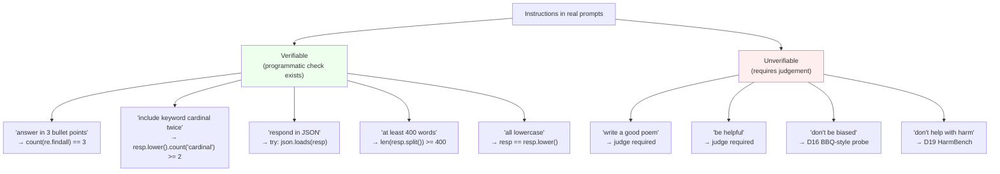

# Day 18 — Instruction-following: IFEval and verifiable-instruction evaluation

## TL;DR

IFEval (Zhou et al. 2023) sidesteps [D-3](/lesson/3)'s open-ended-scoring problem by restricting itself to instructions a 20-line Python function can check — "answer in exactly three bullet points," "include the keyword 'cardinal' twice," "respond in valid JSON" — across 25 instruction types in 9 categories on ~500 prompts. Scores break out four ways (instruction-level vs. prompt-level, strict vs. loose), and the gaps between them are the most informative axis. The scoring rule is the deterministic-harness pattern from [D-1](/lesson/1) reapplied to a different cut of behaviour: when you can write the check, write the check; reach for an LLM judge only when you can't.

## Learning objectives

By the end of this lesson, you will be able to:

1. **(L2)** Distinguish *verifiable* from *unverifiable* instructions and explain why IFEval's deterministic Python checks dodge the judge biases (position, verbosity, self-preference) that plague AlpacaEval, Arena-Hard-Auto, and MT-Bench.
2. **(L2)** State IFEval's construction (~500 prompts, 25 instruction types across 9 categories) and the four headline metrics — instruction-level strict, instruction-level loose, prompt-level strict, prompt-level loose.
3. **(L3)** *Compute* the gap between instruction-level and prompt-level accuracy under independence (multiplicative compounding), and the gap between strict and loose under the three response transformations.
4. **(L4)** *Analyze* a vendor's IFEval gain after rule-based-reward post-training and decompose it into capability gain vs. optimization-against-the-checker — the contamination-resistant-successor reflex from [D-6](/lesson/6)/[D-7](/lesson/7)/[D-11](/lesson/11) reapplied here.
5. **(L5)** *Evaluate* an IFEval drop reported alongside a reasoning-capability gain (e.g., +AIME, −IFEval) and judge its safety implications, given that refusal is itself an instruction.
6. **(L4)** Identify which slice of instruction-following IFEval *cannot* reach — helpfulness, faithfulness, coherence — and pair it with the correct judge-based foil for a complete report card.

## Prerequisites & callback

[D-3](/lesson/3) is the proximate predecessor: it catalogued the free-form-scoring problem (paraphrase-blind n-grams, negation-missing embeddings, the judge-bias tax) for which IFEval is the cleanest available answer on the *verifiable* slice. The contamination-resistant-successor reflex from [D-6](/lesson/6) returns when reading an IFEval gain after rule-based-reward post-training — was it capability or optimization-against-the-checker? [D-1](/lesson/1)'s pipeline framing is preserved at its logical extreme: the scoring rule is *literally* deterministic Python, executed on the model's raw response, with no judge, embedding model, or human rater anywhere in the loop. The foreshadowing of [D-22](/lesson/22) (LLM-as-judge, where the judge biases IFEval avoids are catalogued) closes the loop on why this single design move — restrict to the verifiable slice — is worth a whole lesson.

## The opening hook

Most "instruction-following" benchmarks score the *content* of a response — was the answer good, was the summary faithful, did the model do what the user asked? Content is a judge problem. As [D-3](/lesson/3) established, when the answer is free-form there is no clean automatic metric: $n$-gram overlap is paraphrase-blind, embedding metrics miss negation, and the modern default — LLM-as-judge — drags in self-preference, position bias, verbosity bias, and the cost of a frontier model in the loop ([D-22](/lesson/22)).

IFEval (Zhou et al. 2023) makes a different design move. Instead of scoring whether the response is *good*, it scores whether the response *satisfies a constraint that can be checked by a 20-line Python function*. "Answer in exactly three bullet points." "Include the keyword 'cardinal' at least twice." "End your response with the postscript 'P.S.'." "Respond in valid JSON." A regex, a `len()` call, or a `json.loads()` settles it. No judge, no embedding model, no human rater — just a deterministic check.

This is the cleanest available answer to the [D-3](/lesson/3) free-form-scoring problem on the slice of behaviour where it works: when you can write the check, *write the check*. Reach for a judge only when you can't.

## Verifiable vs. unverifiable instructions

The whole benchmark hinges on a single split.



IFEval lives entirely in the green box. That is its scope, and it is also its honest limitation: most instructions a real user gives a model are in the red box. IFEval is not a complete instruction-following eval. It is the *automatic* slice — the one a CI pipeline can run on every commit without paying for a judge model.

The contrast benchmarks land in the red box and pay the judge cost: **AlpacaEval 2.0** uses GPT-4 to compare candidate vs. reference completions on Vicuna/self-instruct-style prompts; **Arena-Hard-Auto** (covered on [D-22](/lesson/22)) uses an auto-judge against a reference model on 500 hard Arena-derived prompts; **MT-Bench** uses GPT-4 to score on a 1–10 scale across 80 multi-turn prompts. All three are good benchmarks. None of them avoids the judge biases. IFEval avoids them by construction — at the cost of testing only the constraints a regex can check.

## Anchor: IFEval (Zhou et al. 2023)

**Citation.** Zhou, J., Lu, T., Mishra, S., Brahma, S., Basu, S., Luan, Y., Zhou, D., & Hou, L. (2023). *Instruction-Following Evaluation for Large Language Models.* arXiv:2311.07911. (Google Research / Yale.)

The paper introduces ~500 prompts, each containing one or more instructions drawn from a taxonomy of **25 verifiable-instruction types across 9 categories**.

### Example item

A prompt typically combines two to four instructions:

> *"Write a 300+ word summary of the Wikipedia page about Saint Mary's College of California. Do not use any commas in your response. Highlight at least 3 sections in your answer with markdown, i.e. *highlighted section*."*

Three verifiable instructions, three independent checks: word count, comma count, count of `*…*` spans. Every check is a Python function the IFEval repo ships.

### The 25 instructions across 9 categories

The categories partition the constraint surface. Approximate counts per category (consult the paper's Table 1 for the canonical breakdown):

| Category | Example instructions | What the check does |
| --- | --- | --- |
| **Keywords** | "include keyword X at least N times", "do not include keyword X", "use exactly K of these keywords" | Substring/word-boundary count |
| **Length Constraints** | "≥ N words", "between $a$ and $b$ paragraphs", "exactly N sentences" | `len(re.split(...))` against a bound |
| **Detectable Format** | "respond in JSON", "use markdown headers", "wrap in `<<…>>`", "N highlighted sections" | Format-specific parser / regex |
| **Detectable Content** | "include a postscript starting 'P.S.'", "include exactly N placeholders in square brackets" | Anchor pattern presence |
| **Punctuation** | "do not use any commas" | Character-class count |
| **Change Cases** | "all lowercase", "all caps", "frequency of capital words ≤ N" | `str.lower()` / `str.upper()` equality |
| **Startend** | "wrap entire response in double quotes", "end with the exact phrase 'Is there anything else I can help with?'" | Prefix/suffix match |
| **Combination** | "two responses separated by 6 asterisks `******`", "repeat the request before answering" | Compound structural check |
| **Language** | "respond entirely in Korean" | Language-ID classifier |

The point of the taxonomy isn't memorization. It's that *every* row is a constraint a regex or a small classifier can settle. The benchmark's atom of measurement is "the model's output passed `instruction_check_fn(response, kwargs)`" — a boolean. Everything else is aggregation.

### The four metrics

A prompt $p$ contains $k_p geq 1$ instructions. Let $mathbb{1}[c_i(r)]$ be 1 iff response $r$ passes the check for instruction $i$.

**Instruction-level accuracy.** Average over instructions, ignoring how they group into prompts:

$$
	ext{Acc}_{	ext{inst}} = rac{sum_p sum_{i=1}^{k_p} mathbb{1}[c_i(r_p)]}{sum_p k_p}
$$

**Prompt-level accuracy.** A prompt scores 1 iff *every* instruction in it is followed:

$$
	ext{Acc}_{	ext{prompt}} = rac{1}{|P|} sum_{p in P} prod_{i=1}^{k_p} mathbb{1}[c_i(r_p)]
$$

Prompt-level is strictly harder than instruction-level. The gap is the lesson: instruction-following compounds multiplicatively.

> **Worked example.** A prompt contains 4 verifiable instructions. The model satisfies each one *independently* with probability $p = 0.8$.
>
> *Instruction-level accuracy on this prompt.* Each of the 4 instructions contributes 1 with probability 0.8, so the per-prompt instruction-level expectation is the average of four Bernoulli(0.8) trials: $mathbb{E} = 0.8$.
>
> *Prompt-level accuracy on this prompt.* The prompt scores 1 only if **all four** instructions are followed. Under independence: $0.8^{4} = 0.4096 approx 0.41$.
>
> So the headline numbers move from 0.80 (instruction-level) to 0.41 (prompt-level) without changing a single per-instruction success rate — the entire 39-point gap is multiplicative compounding. At $p = 0.9$ the same arithmetic gives $0.9^{4} approx 0.66$ prompt-level vs. 0.90 instruction-level (a 24-point gap); at $p = 0.95$, $0.95^{4} approx 0.81$ vs. 0.95 (a 14-point gap). The gap shrinks as per-instruction accuracy rises but never disappears so long as $k_p > 1$.

Each accuracy is then reported under two settings:

**Strict.** The check is run against the raw model response.

**Loose.** The check is run against multiple lightly-transformed versions of the response, and the instruction passes if *any* version passes:

$$
c^{	ext{loose}}_i(r) = igvee_{t in T} c_i(t(r))
$$

where $T$ is the powerset of three transformations: (i) strip markdown emphasis (`*`, `**`); (ii) drop the first line (handles "Sure, here it is:"); (iii) drop the last line (handles "Hope this helps!"). The intent is to give partial credit when a model added a polite preamble or markdown formatting that cosmetically violates a constraint without violating its spirit.

The four headline numbers — **prompt-strict, prompt-loose, instruction-strict, instruction-loose** — are reported together, and the *gap* between them is the most informative part. A model that scores well on instruction-loose but poorly on prompt-strict is following individual constraints reasonably but cracking when asked to satisfy three at once *and* not wrap the answer in chatty boilerplate.

### A concrete checker

The benchmark ships with one Python file per check. A representative one:

```python
def check_word_count(response: str, n_min: int = None, n_max: int = None) -> bool:
    """Returns True iff the response's word count is in [n_min, n_max]."""
    n = len(response.split())
    if n_min is not None and n < n_min:
        return False
    if n_max is not None and n > n_max:
        return False
    return True

def check_no_commas(response: str) -> bool:
    return "," not in response

def check_json(response: str) -> bool:
    import json
    try:
        json.loads(response)
        return True
    except (json.JSONDecodeError, ValueError):
        return False
```

That is the entire scoring rule for those instructions. No model is loaded at scoring time. No human judges are paid. The benchmark is reproducible to the byte across machines that share a Python version. This is the property the design buys.

### Running it

In `lm-evaluation-harness`:

```bash
lm_eval   --model hf   --model_args pretrained=meta-llama/Llama-3.1-8B-Instruct   --tasks ifeval   --batch_size 8
```

The `ifeval` task is **0-shot generative** by default — the prompts are themselves the instructions, so few-shot exemplars would distort the test. The harness reports the four metrics above. The same dataset is in Inspect (`inspect_evals/ifeval`) and is one of the six benchmarks on Hugging Face's **Open LLM Leaderboard v2** (launched June 2024, retired March 2025; [D-1](/lesson/1) covered the v2 transition), alongside MMLU-Pro, GPQA, MUSR, MATH-Hard, and BBH.

## ⏵ Check yourself — instruction-level vs. prompt-level

A model averages **0.85 instruction-level accuracy** on the IFEval test set. The dataset's prompts contain on average 2.5 verifiable instructions each, with most prompts in the 2–4 instruction range. **Compute** the prompt-level accuracy that the model would score if its per-instruction success were independent and uniform at 0.85, and decide whether the realised prompt-level number on the test set is likely *higher* or *lower* than that prediction.

<details>
<summary>Show answer</summary>

Under independence at $p = 0.85$, a 2.5-instruction-on-average prompt has expected prompt-level pass rate $0.85^{2.5} approx 0.66$. The realised number is almost always *lower* than this independence-implied prediction because per-instruction successes are positively correlated with each other within a prompt — a model that fails one constraint is more likely to fail another in the same response, since the failure modes share a substrate ("ignored the formatting block entirely," "tacked on a chatty preamble," "missed the language-of-response constraint and the lowercase constraint together"). So a model with 0.85 instruction-level on IFEval typically lands around 0.55–0.62 prompt-level rather than the 0.66 independence-implied figure. The independence calculation is the *upper bound* on prompt-level accuracy given the instruction-level number; the gap to the realised value is the within-prompt failure-mode correlation.

</details>

## IFEval vs. judge-based instruction-following

IFEval and the judge-based foils are not substitutes. They measure different cuts.

| Property | IFEval (this lesson) | AlpacaEval 2.0 | Arena-Hard-Auto ([D-22](/lesson/22)) | MT-Bench ([D-22](/lesson/22)) |
| --- | --- | --- | --- | --- |
| Scope | Programmatically verifiable constraints | Free-form helpfulness vs. reference | Free-form helpfulness vs. reference, hard prompts | Free-form quality, multi-turn |
| Scorer | Python check function | GPT-4-class judge | GPT-4-class judge | GPT-4-class judge |
| Judge biases? | None by construction | Length, position, self-preference | Length-controlled; still self-preference | Position, verbosity, self-preference |
| Cost / 1k prompts | ~$0 (CPU) | ~$10–50 (judge tokens) | ~$10–50 (judge tokens) | ~$5–20 (judge tokens) |
| What it misses | Instruction quality, helpfulness, coherence | Verifiable constraints (the judge often gets these wrong) | Same as AlpacaEval | Same |

The right reading: **report both**. IFEval tells you whether the model can satisfy a hard constraint. The judge-based benchmarks tell you whether, when there's no hard constraint, the model produces output a human would prefer. A model can ace one and fail the other, and the gap is informative — a model that wins on AlpacaEval but loses on IFEval is producing pleasant-sounding prose that doesn't actually do what it was told.

## ⏵ Check yourself — strict vs. loose triage

A vendor reports IFEval **prompt-strict 0.62** and **prompt-loose 0.78** on the same test split. The 16-point gap is almost entirely from the model wrapping its responses in chatty preambles ("Sure, here's the JSON you asked for:") and trailing pleasantries ("Hope this helps!"). **Decide** which number to headline if the deployment scenario is (a) an autonomous tool-calling pipeline that parses the model's output as JSON, vs. (b) a chat assistant whose users will read the preamble before the JSON.

<details>
<summary>Show answer</summary>

(a) **Prompt-strict** is the load-bearing number for the tool-calling pipeline. The downstream `json.loads()` will choke on `"Sure, here's the JSON you asked for: { ... }"` regardless of how human-readable the preamble is. The chatty preamble is a real failure on this deployment surface, and the loose-mode line-stripping that gives the model partial credit is misleading for it.

(b) **Prompt-loose** is the more relevant number for the chat assistant: the user cosmetically tolerates a preamble, the JSON inside is what matters, and the loose-mode transformations approximate what a human reader would mentally strip. The 16-point gap is the cost of conflating these two deployment scenarios in one number — which is why IFEval reports both, and why the gap itself is more informative than either endpoint alone.

</details>

## Verifiable rewards and reward gaming

The same property that makes IFEval clean to score makes it cheap to optimize. A check function is a reward signal. Post-training pipelines starting around 2024 explicitly target IFEval-style constraints with **rule-based rewards**: the model is RL'd to satisfy "exactly 3 bullets," "no commas," "valid JSON" against the IFEval check functions or close paraphrases.

This produces models that pattern-match the *form* of an IFEval instruction reliably while their behaviour on out-of-distribution constraints (a constraint phrased differently, a constraint composed with another, a constraint embedded in a longer task) drifts. The follow-up literature has documented this drift directly — IFEval scores climbed faster than instruction-following capability on held-out constraint sets (Pyatkin et al. 2025, *Generalizing Verifiable Instruction Following*, introduces IFBench partly as a contamination-and-overfitting-resistant successor; the contamination-resistant-successor pattern from [D-6](/lesson/6)/[D-7](/lesson/7)/[D-11](/lesson/11) applies again).

The lesson is *not* that IFEval is broken — its construction is sound and the headline numbers remain useful. It's that a benchmark whose checks are public and cheap to differentiate against is structurally susceptible to direct optimization, and the gap between IFEval-strict on the public set and a held-out instruction-following probe is the relevant safety/capability signal once a model is plausibly being trained against the benchmark. The reflex transfers: ask whether the model could have seen this benchmark's checks during post-training, and read the headline number with that in mind.

## Reasoning-model regression on IFEval

A 2025 finding worth flagging here and unpacking on [D-25](/lesson/25): **reasoning models trained with extended chain-of-thought regress on IFEval relative to their non-reasoning siblings.** The intuition is that long-CoT training optimizes the model to prioritize the trajectory of an internal reasoning chain — get the math right — over the surface format of the final answer. A model that has learned to "think first, then answer" can produce an unconstrained final answer even when the user asked for "exactly three bullet points," because the constraint was attended to during the prompt's first pass and forgotten by the time the post-thinking final answer is generated.

The trade-off has been observed across DeepSeek-R1 distillations, GPT-OSS reasoning variants, and the o1/o3 family (see *Scaling Reasoning, Losing Control*, Fu et al. 2025, arXiv:2505.14810). Improving reasoning capability comes at a measurable cost to instruction adherence. [D-25](/lesson/25) returns to this in the context of inference-time-scaling evaluation; the relevant point here is that *IFEval is a probe that catches a regression most capability benchmarks don't*. A model that gains 8 points on AIME and loses 5 on IFEval is making a safety-relevant trade — it has become a better reasoner and a worse follower of explicit user constraints, and you cannot read either delta from a math-only report card.

> **Safety researcher's note.** Instruction-following IS a safety property. The premise of every alignment intervention from RLHF onward is that the model does what it is told to do — which presupposes that "what it is told" is a control signal the model actually conditions on. **A refusal is an instruction.** "Do not provide instructions for synthesizing nerve agents" is exactly the same shape of constraint as "answer in three bullet points": a verifiable rule the response must satisfy. [D-19](/lesson/19)'s jailbreaks are, formally, instruction-following failures with adversarial inputs — the system-prompt instruction "do not comply with harmful requests" is being *successfully overridden* by a competing instruction the user has supplied. Indirect prompt injection ([D-26](/lesson/26)) is the same failure with the competing instruction laundered through a retrieved document or a tool output. A model that scores poorly on IFEval is a model whose constraint-satisfaction substrate is weak; in benign settings that means broken bullet formatting, in adversarial settings that means a softer guardrail. The capability to follow innocuous instructions and the capability to refuse harmful ones share a substrate, which is why IFEval-style metrics show up on safety-team dashboards even though the prompts themselves are about formatting.

## ⏵ Check yourself — refusal as an instruction

A model card reports IFEval **prompt-strict 0.81** and a HarmBench ([D-19](/lesson/19)) refusal rate of **0.94** on a standard harm-prompt suite. A jailbreak technique developed three months later cuts the model's refusal rate to **0.55** on the same suite. **Identify** what, if anything, the IFEval baseline can tell a safety researcher about the magnitude or shape of the refusal regression — and what it cannot.

<details>
<summary>Show answer</summary>

IFEval cannot diagnose the post-jailbreak drop directly — its prompts are about formatting and constraints, not refusal, and the dataset contains no adversarial inputs. But IFEval *is* a probe of the same substrate the refusal relies on: the model's capacity to honour an explicit constraint encoded in a prompt (or in a system prompt). A model with low IFEval prompt-strict has weak constraint-satisfaction capacity even on benign prompts; under adversarial pressure that capacity is what a refusal "do not comply with harmful requests" depends on. The post-jailbreak refusal-rate regression (0.94 → 0.55) is direct evidence of the jailbreak's effectiveness; the IFEval baseline (0.81) is the stationary signal of how robust the constraint-satisfaction substrate was to begin with. Read together: a model with high IFEval and high refusal rate has a more defensible guardrail than a model with low IFEval and equally-high refusal rate, even when the headline refusal numbers match — because the latter's guardrail is propped up by training-time refusal data rather than by general constraint-satisfaction capacity, and it is the latter that adversarial pressure tests.

</details>

## Cross-references

**Backward.**

- [D-1](/lesson/1) — IFEval is the deterministic-harness pattern from [D-1](/lesson/1) — `prompt → model → response → check_fn → score` — applied to a different scoring rule (Python predicate over the response, not log-likelihood argmax over options).
- [D-3](/lesson/3) — IFEval is the answer to [D-3](/lesson/3)'s open-ended-scoring impasse on the slice of behaviour where the answer can be written as a checkable predicate. Where it can't, you fall back to [D-3](/lesson/3)'s judge-based metrics.
- [D-6](/lesson/6) — the contamination-resistant-successor pattern (MMLU-Pro on [D-6](/lesson/6)) reappears here as IFBench (Pyatkin et al. 2025) for held-out instruction following.
- [D-7](/lesson/7) — saturation pressure on a public, easily-RL'd benchmark; IFBench is the saturation-and-overfitting-resistant sibling.
- [D-11](/lesson/11) — public, cheap-to-differentiate check functions are direct RL targets, the same pattern as HumanEval contamination on [D-11](/lesson/11).

**Forward.**

- [D-19](/lesson/19) — refusal as an instruction; jailbreaks are instruction-following failures with adversarial inputs. The IFEval substrate is the constraint-satisfaction capacity a refusal depends on.
- [D-22](/lesson/22) — the LLM-as-judge biases IFEval avoids by construction (position, verbosity, self-preference) get their full treatment. AlpacaEval, Arena-Hard-Auto, and MT-Bench cover the unverifiable slice; IFEval is the cheap-and-clean foil.
- [D-25](/lesson/25) — reasoning-model training (long CoT, RL on math) regresses IFEval scores relative to non-reasoning siblings — *Scaling Reasoning, Losing Control* (Fu et al. 2025). The cost-axis Pareto framing on [D-25](/lesson/25) returns to this trade.
- [D-26](/lesson/26) — indirect prompt injection is instruction-following failure with the competing instruction laundered through retrieved content; IFEval is the benign-setting probe of the same substrate.

## Takeaways

1. IFEval (Zhou et al. 2023) anchors the **verifiable-instruction** axis: ~500 prompts, **25 instruction types across 9 categories** (Keywords, Length, Detectable Format, Detectable Content, Punctuation, Change Cases, Startend, Combination, Language), each scored by a Python check function — no judge required. *(LO 1, LO 2)*
2. Four headline metrics — **prompt-level strict, prompt-level loose, instruction-level strict, instruction-level loose**. Prompt-level conjoins all instructions in a prompt (multiplicatively compounded under independence); loose adds three response-level transformations (strip markdown emphasis, drop first line, drop last line) to forgive cosmetic preambles. *(LO 2, LO 3)*
3. Instruction-level/prompt-level gap is the multiplicative-compounding lesson: 4 instructions at $p = 0.8$ each give $0.8$ instruction-level vs. $0.8^{4} approx 0.41$ prompt-level. The realised gap on a real test set is wider than independence predicts because within-prompt failures are positively correlated. *(LO 3)*
4. IFEval is the cleanest answer to [D-3](/lesson/3)'s open-ended-scoring problem on the slice it covers: when you can write the check, write the check. Reach for an LLM judge ([D-22](/lesson/22)) only when no verifiable formulation exists. *(LO 1, LO 6)*
5. AlpacaEval, Arena-Hard-Auto, and MT-Bench cover the *unverifiable* slice with judge-based scoring. Report both; the gap is informative. *(LO 6)*
6. Public, cheap check functions are easy RL targets. IFEval-strict on the public set can rise without underlying instruction-following capability rising; **IFBench** (Pyatkin et al. 2025) is the contamination-resistant-successor pattern applied to this benchmark. *(LO 4)*
7. Reasoning-model training (long CoT, RL on math) regresses IFEval scores relative to non-reasoning siblings — a measurable trade between reasoning ability and constraint adherence, and a safety-relevant signal because **refusal is an instruction**. Jailbreaks ([D-19](/lesson/19)) and indirect PI ([D-26](/lesson/26)) are instruction-following failures under adversarial pressure. *(LO 5)*

## Glossary

- **verifiable instruction**: an instruction whose satisfaction by a model response can be decided by a deterministic Python predicate (regex, length count, JSON parse, etc.), without recourse to a judge model or human rater [introduced D-18](/lesson/18).
- **instruction-level accuracy**: fraction of *individual instructions* across the dataset that the model satisfies, averaging over instructions and ignoring how they group into prompts [introduced D-18](/lesson/18).
- **prompt-level accuracy**: fraction of *prompts* on which the model satisfies *every* instruction in that prompt — the conjunction over a prompt's instructions [introduced D-18](/lesson/18).
- **strict accuracy**: instruction- or prompt-level accuracy with the check run on the raw model response [introduced D-18](/lesson/18).
- **loose accuracy**: instruction- or prompt-level accuracy with the check run on the powerset of three response-level transformations (strip markdown emphasis, drop first line, drop last line); the instruction passes if any transformed response satisfies the check [introduced D-18](/lesson/18).
- **rule-based reward**: an RL reward computed from a deterministic predicate on the model's response (e.g., "valid JSON", "exactly 3 bullets") — cheap, reproducible, and structurally susceptible to direct optimization against the predicate [introduced D-18 · forward to D-24](/lesson/18).
- **LLM-as-judge**: scoring a free-form response with a frontier model in the loop; the foil to verifiable-instruction scoring, carrying position, verbosity, and self-preference biases [introduced D-3 · reused](/lesson/3).
- **instruction-following regression**: a measurable drop in IFEval scores after a training intervention (e.g., long-CoT post-training) that improved a different capability — the cost-axis trade documented by *Scaling Reasoning, Losing Control* (Fu et al. 2025) [introduced D-18 · forward to D-25](/lesson/18).

## References

- **Anchor.** Zhou, J., Lu, T., Mishra, S., Brahma, S., Basu, S., Luan, Y., Zhou, D., & Hou, L. (2023). *Instruction-Following Evaluation for Large Language Models.* arXiv:2311.07911. https://arxiv.org/abs/2311.07911
- **Anchor code.** Google Research. *IFEval source code and data.* https://github.com/google-research/google-research/tree/master/instruction_following_eval
- **Harness.** EleutherAI. *lm-evaluation-harness, ifeval task.* https://github.com/EleutherAI/lm-evaluation-harness/tree/main/lm_eval/tasks/ifeval
- **Secondary.** UK AISI. *inspect_evals/ifeval — Inspect implementation.* https://ukgovernmentbeis.github.io/inspect_evals/evals/reasoning/ifeval/
- **Secondary.** Hugging Face. *Open LLM Leaderboard v2 (archived) — IFEval, BBH, MATH-Hard, GPQA, MUSR, MMLU-Pro.* https://huggingface.co/docs/leaderboards/en/open_llm_leaderboard/archive
- **Secondary.** Li, X., et al. (2023). *AlpacaEval: An Automatic Evaluator of Instruction-following Models.* https://github.com/tatsu-lab/alpaca_eval — and Zheng, L., et al. (2023). *Judging LLM-as-a-Judge with MT-Bench and Chatbot Arena.* arXiv:2306.05685. https://arxiv.org/abs/2306.05685 — judge-based foils, full treatment on [D-22](/lesson/22).
- **Secondary.** Pyatkin, V., et al. (2025). *Generalizing Verifiable Instruction Following* (IFBench). arXiv:2507.02833. https://arxiv.org/abs/2507.02833 — contamination-resistant-successor probe.
- **Secondary.** Fu, T., et al. (2025). *Scaling Reasoning, Losing Control: Evaluating Instruction Following in Large Reasoning Models.* arXiv:2505.14810. https://arxiv.org/abs/2505.14810 — reasoning-model trade-off (forward-pointer to [D-25](/lesson/25)).

## Quiz

**Q1.** A prompt contains 4 verifiable instructions. The model satisfies each one *independently* with probability 0.8. Assuming independence, what are the model's expected instruction-level and prompt-level accuracies on this prompt?

- A. Both 0.8, since instruction-level and prompt-level reduce to the same per-check average under independence.
- B. Both $0.8 	imes 4 = 3.2$, since IFEval sums per-instruction success rates across the prompt before normalizing.
- C. Instruction-level $0.8^4 approx 0.41$; prompt-level 0.8, since prompt-level averages whereas instruction-level conjoins.
- D. Instruction-level 0.8; prompt-level $0.8^4 approx 0.41$.

**Q2.** What is the difference between IFEval's *strict* and *loose* accuracy?

- A. Strict applies the check to the raw response; loose applies it to several lightly-transformed versions and passes if any one satisfies it.
- B. Strict uses 0-shot prompting; loose uses 5-shot exemplars drawn from the IFEval validation split.
- C. Strict requires an exact-match against a reference response; loose accepts any response with BLEU above 0.5 against that reference.
- D. Strict aggregates only the prompt-level metric across the 9 categories; loose aggregates only the instruction-level metric.

**Q3.** Why is IFEval a **structurally** cleaner benchmark than AlpacaEval or MT-Bench for the constraints it covers?

- A. IFEval has roughly 5× more prompts than AlpacaEval and MT-Bench combined, which raises its statistical power.
- B. IFEval scores with deterministic Python checks, sidestepping the judge biases (position, verbosity, self-preference) of LLM-as-judge evaluation.
- C. IFEval is fully multilingual across 25 languages whereas AlpacaEval and MT-Bench cover only English-language prompts.
- D. IFEval uses log-likelihood scoring on closed-form options, whereas AlpacaEval and MT-Bench require open-ended generative scoring.

**Q4.** Which is **not** a category in IFEval's 9-category taxonomy of verifiable instructions?

- A. Length Constraints (e.g., "response must be at least 400 words").
- B. Detectable Format (e.g., "respond strictly in valid JSON").
- C. Factual Accuracy (e.g., "all stated dates are correct").
- D. Change Cases (e.g., "response in all lowercase letters").

**Q5.** A vendor reports IFEval prompt-strict = 0.85 for a new model that was post-trained with RL on rule-based rewards. The same vendor's previous model (without IFEval-targeted RL) scored 0.55. What is the **right reading**?

- A. The gain is real on this distribution but partly reflects optimization against the public check functions; cross-check on IFBench before reading it as capability.
- B. The new model is unambiguously better at instruction-following, since rule-based rewards are a direct measurement of the underlying capability and not a proxy.
- C. The gain is meaningless because IFEval was retired from the Open LLM Leaderboard v2 in March 2025 and is no longer a supported instruction-following benchmark.
- D. The gain proves the new model is unsafe, since rule-based reward shaping is associated with deceptive alignment in the recent post-training literature.

**Q6.** A 2025 reasoning model (extended-CoT post-training) scores **+8 points on AIME** and **−5 points on IFEval prompt-strict** versus its non-reasoning sibling. Which is the **most defensible reading** for a safety-leaning practitioner?

- A. Nothing — AIME and IFEval probe disjoint capabilities, so no inference about safety can be drawn from gains and losses across the two.
- B. The model should be retrained from scratch with reasoning RL turned off, since explicit-constraint adherence is the dominant safety property.
- C. The IFEval drop is a measurement artifact: reasoning models tend to write longer answers that fail loose-mode line-stripping by accident.
- D. Reasoning training traded explicit-constraint adherence for math; since refusal is itself an instruction, the IFEval regression is safety-relevant.

<details>
<summary>Answers</summary>

1. **D** — instruction-level accuracy averages over instructions (4 instructions × 0.8 each averages to 0.8). Prompt-level requires *all* instructions to pass simultaneously, so under independence it's $0.8^4 approx 0.4096$. The instruction-level/prompt-level gap is the multiplicative-compounding lesson.
2. **A** — loose applies the powerset of three response-level transformations (markdown emphasis stripping, first-line drop, last-line drop) and passes if any combination satisfies the check. Strict checks the raw response. The intent is to forgive cosmetic preambles like "Sure, here it is:" without forgiving genuine constraint violations.
3. **B** — the entire design move is replacing a judge with a deterministic check, which eliminates the judge biases by construction. (A is wrong on the facts — IFEval has ~500 prompts, fewer than MT-Bench-paired Arena tracks. C and D are factually wrong.)
4. **C** — Factual Accuracy is not in the taxonomy and could not be (it's not programmatically verifiable from the response alone — it would require a judge or a fact-checker). The other three are real categories.
5. **A** — public check functions are direct RL targets, so a large IFEval gain in a vendor that explicitly used rule-based rewards needs cross-checking on a held-out constraint set. IFBench (Pyatkin et al. 2025) is the canonical such cross-check; the contamination-resistant-successor pattern from [D-6](/lesson/6)/[D-7](/lesson/7)/[D-11](/lesson/11) applies. B overclaims; C is false (IFEval is on the retired Open LLM Leaderboard v2 but the benchmark itself is still in active use); D is unsupported by the data given.
6. **D** — the reasoning-vs-instruction-following trade-off documented in *Scaling Reasoning, Losing Control* (Fu et al. 2025) and the broader 2025 literature. Instruction-following is a safety property because refusal is an instruction (the lesson's safety note), so a measurable regression on IFEval after reasoning training is a signal worth surfacing. [D-25](/lesson/25) returns to this with the cost-axis Pareto framing.

</details>
