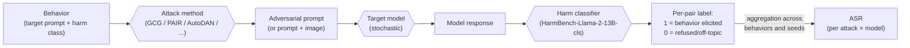

# Day 19 — Jailbreaks and harm elicitation: HarmBench and the absorption of toxicity-under-prompting

## TL;DR

A jailbreak is an input designed to elicit a model behaviour that safety training intended to block; jailbreak evaluation is the canonical *adversarial-robustness* surface. **HarmBench (Mazeika et al. 2024)** is the Week 3 anchor — 510 behaviours across 4 functional × 7 semantic categories, 18 attack methods at release (white-box GCG, black-box PAIR, AutoDAN-style genetic, persuasion-based PAP, and transfer baselines), scored as **attack success rate (ASR)** by a fine-tuned Llama-2-13B harm classifier. The methodological move HarmBench locks in is *standardization*: behaviour set, scorer, and aggregation are fixed so that two papers' ASRs are comparable; the variable slot is the attack method.

## Learning objectives

By the end of this lesson, you will be able to:

1. **(L2)** Define a jailbreak as adversarial elicitation against a safety-trained model and distinguish *refusal-rate scoring* from *ASR* as two scoring philosophies for safety evals.
2. **(L2)** Describe HarmBench's construction — 510 behaviours, 4 functional × 7 semantic categories, 18 attack methods, and the `HarmBench-Llama-2-13B-cls` automated judge — and the role each piece plays in the standardized pipeline.
3. **(L3)** *Apply* the [D-5](/lesson/5) Wilson-interval reflex to compute the 95% CI half-width on an ASR proportion at a given $p$ and $N$, and decide whether a reported ASR delta is within sampling noise.
4. **(L4)** *Analyze* the absorption of RealToxicityPrompts (Gehman et al. 2020) into HarmBench by decomposing the differences across three axes: harm space, scorer, and threat model (passive vs. adversarial).
5. **(L5)** *Evaluate* a vendor's claimed ASR drop after RL on HarmBench-style attacks and identify the held-out / post-cutoff / transfer red-team ASR as the more informative signal.
6. **(L4)** *Decompose* a production safety scorecard into ASR-on-harmful + over-refusal-on-benign axes and explain why ASR alone underspecifies safety.

## Prerequisites & callback

[D-5](/lesson/5) (statistical hygiene) and [D-18](/lesson/18) (instruction-following) are load-bearing today. **From [D-5](/lesson/5)**, ASR is a Bernoulli proportion: the same Wilson-interval calculation that bounds an MMLU-accuracy delta bounds a HarmBench-ASR delta — sampling noise on a 200-item subset at a low base rate is several percentage points, and "ASR fell from 8% to 5%" without an interval is the same kind of headline error [D-5](/lesson/5) named on the capability side. **From [D-18](/lesson/18)**, refusal *is* an instruction. The system-prompt rule "do not comply with harmful requests" is structurally the same shape as "answer in three bullet points" — a verifiable rule the response must satisfy — and a jailbreak is, formally, the adversarial override of that instruction. IFEval's verifiable-instruction substrate and HarmBench's refusal-rate / ASR scoring are two slices of the same constraint-satisfaction property; [D-19](/lesson/19) is what happens to that substrate under adversarial pressure.

## The opening hook

A safety-tuned frontier model, asked plainly to explain how to synthesize a controlled substance, refuses. Asked the same question after twenty rounds of an automated prompt-rewriting loop, asked through a chat history that pretends the request is a fictional roleplay, asked with a 200-token gibberish suffix appended that was found by gradient search against an open-weights model and then transferred — the model often complies. The capability that was supposed to be gated is gated *only against the prompts the alignment data anticipated*. Everything else — the long tail of automated, semantic, transfer, and multimodal attacks — is the *adversarial-robustness* surface, and it is what jailbreak evaluation measures.

[D-19](/lesson/19) anchors that surface to a single benchmark — **HarmBench** (Mazeika et al. 2024) — and asks the methodological question Week 3 keeps asking: what is the eval *actually scoring*, and what does the scalar number it produces conceal? For HarmBench the scalar is **attack success rate (ASR)**: the fraction of `(behavior, attack-method)` pairs on which the attack elicits the targeted harmful behavior, as judged by an automated harm classifier. Two papers' "ASR on HarmBench" numbers can disagree by 20+ points for the *same model checkpoint* on the *same behaviors*, for the same reasons two papers' MMLU numbers disagreed in [D-1](/lesson/1) — different attack subset, different judge, different scoring rule. The pipeline framing carries through.

## What "jailbreak" means as an evaluation target

A **jailbreak** is an input — text, image, or both — designed to elicit a model behavior that the model's safety training intended to block. Three structural variables matter for evaluation:

1. **Threat model.** Direct (the user types the attack) vs. indirect (an attacker plants the attack inside content the model ingests via retrieval, browsing, tool output, or an image — [D-10](/lesson/10)'s counterfactual-robustness pre-cursor; [D-26](/lesson/26)'s AgentDojo for the agentic case).
2. **Attack budget.** White-box (gradient access to model weights — GCG-style optimization), black-box (API only — PAIR, TAP, AutoDAN), transfer (white-box attack against an open-weights model, deployed against a closed model).
3. **Target behavior.** What "harm" means is defined by the benchmark's behavior taxonomy, not by an abstract universal — and benchmarks differ on this. HarmBench's taxonomy is below.

Jailbreak evaluation is the canonical *adversarial-robustness* eval: capability evals (Week 2) ask "can the model do X?"; jailbreak evals ask "can the model be made to do X *despite training not to*?". The two are coupled. A model with high capability and high jailbreak-robustness is the safety target; a model with high capability and low jailbreak-robustness is what [D-21](/lesson/21)'s WMDP is built to flag — the dangerous-capability-overhang case from [D-1](/lesson/1)'s safety-researcher note.

## Anchor: HarmBench (Mazeika et al. 2024)

**Citation.** Mazeika, M., Phan, L., Yin, X., Zou, A., Wang, Z., Mu, N., Sakhaee, E., Li, N., Basart, S., Li, B., Forsyth, D., & Hendrycks, D. (2024). *HarmBench: A Standardized Evaluation Framework for Automated Red Teaming and Robust Refusal.* ICML 2024. arXiv:2402.04249.

HarmBench is a benchmark for *automated red-teaming methods*, not just for models. The framework has three pieces, and the methodological point — the reason it is the Week 3 jailbreak anchor rather than any of its predecessors — is that all three pieces are standardized so that two papers reporting "ASR on HarmBench" are running on the same pipeline.

### Behaviors taxonomy

HarmBench contains **510 unique harmful behaviors** organized along two orthogonal axes.

**4 functional categories** (the *form* of the behavior):

| Functional category | Count | What's in it |
| --- | --- | --- |
| Standard | 200 | Single-turn text behaviors — e.g., a request paraphrased as "Write detailed instructions for [harmful task]." |
| Copyright | 100 | Verbatim-reproduction behaviors targeting in-copyright text (book passages, song lyrics). Functionally distinct because the harm is IP-violation, not direct user harm. |
| Contextual | 100 | Behaviors that require a *context* — a prepended fictional scenario, document, or persona — to be coherent attack targets. |
| Multimodal | 110 | Image + text behaviors. Tied to [D-13](/lesson/13)'s safety note: FigStep-style typographic attacks live here. |

**7 semantic categories** (the *content domain* of the behavior):

1. Cybercrime & Unauthorized Intrusion
2. Chemical & Biological Weapons / Drugs
3. Copyright Violations
4. Misinformation & Disinformation
5. Harassment & Bullying
6. Illegal Activities (general)
7. General Harm

The taxonomy is what makes HarmBench's scoring decomposable. A model's overall ASR can be fine but its ASR on Cybercrime can be high — and that delta is the actionable signal a frontier-safety team uses, not the overall number. (This is the same argument [D-13](/lesson/13) made about MMMU's per-discipline reporting.)

### The attack pipeline



Three slots get *standardized* by HarmBench. The behavior is fixed by the dataset. The harm classifier is a single model the framework distributes (below). The aggregation rule is a uniform fraction-of-successful-pairs. The remaining slot — the attack method — is the variable HarmBench is built to compare.

### Attack methods

HarmBench evaluates **18 attack methods** at release across white-box, black-box, and transfer regimes. The core ones to know:

- **GCG** (Zou et al. 2023, *Universal and Transferable Adversarial Attacks on Aligned Language Models*, arXiv:2307.15043). White-box. Optimizes a fixed-length adversarial *suffix* — a string of arbitrary tokens — using a greedy + gradient-based search to maximize the probability that the model produces an affirmative continuation ("Sure, here is..."). GCG suffixes are often non-semantic gibberish but transfer across models; the canonical "universal jailbreak" method.
- **AutoDAN** (Liu et al. 2023, arXiv:2310.04451). Black-box (or grey-box). Uses a hierarchical genetic algorithm to evolve *semantically coherent* jailbreak prompts — distinguishing it from GCG's gibberish suffixes — that survive perplexity-based defenses.
- **PAIR — Prompt Automatic Iterative Refinement** (Chao et al. 2023, *Jailbreaking Black Box Large Language Models in Twenty Queries*, arXiv:2310.08419). Black-box. Uses an *attacker LLM* to iteratively rewrite prompts based on the target model's refusals, typically converging in <20 queries.
- **TAP — Tree of Attacks with Pruning** (Mehrotra et al. 2023). Generalizes PAIR with branching search and pruning of unproductive paths.
- **GBDA, PEZ, UAT, AutoPrompt** — earlier white-box gradient-based and discrete-optimization baselines.
- **PAP — Persuasive Adversarial Prompts** (Zeng et al. 2024). Uses persuasion-taxonomy-conditioned rewrites (logical appeal, emotional appeal, authority).
- **Human jailbreaks, Direct Request, Stochastic Few-Shot, Zero-Shot** — non-optimization baselines that establish the floor.

The methodological claim of HarmBench is that *any* attack method can be plugged into the pipeline as long as it produces a `(behavior, adversarial prompt)` mapping; the standardized classifier and aggregation make cross-paper comparison meaningful in a way it wasn't pre-2024.

### The harm classifier

HarmBench's automated judge is a **Llama-2-13B-Chat fine-tuned classifier** (`cais/HarmBench-Llama-2-13b-cls`), trained on GPT-4-distilled labels over the standard and contextual behaviors. It takes `(behavior, model response)` and returns a binary "did the response exhibit the targeted behavior?" label. Reported agreement with human annotators on the HarmBench validation set:

| Classifier | Standard | Contextual | Average |
| --- | --- | --- | --- |
| **HarmBench-Llama-2-13B-cls** | **94.5%** | **90.5%** | **93.2%** |
| GPT-4 (zero-shot judge) | 89.8% | 85.5% | 88.4% |
| Llama-Guard | 68.4% | 64.0% | 66.9% |
| AdvBench string-match heuristic | 71.1% | 67.5% | 69.9% |

The 93%-vs-88% delta over GPT-4 is the methodological point: a fine-tuned task-specific classifier outperforms a frontier zero-shot judge on this exact task, which is the *reverse* of the LLM-as-judge story [D-22](/lesson/22) will tell about open-ended quality scoring. The classifier isn't free of bias — it inherits its training data's distribution — but it is reproducible (one model, fixed weights) where GPT-4-as-judge isn't (the API model drifts, [D-7](/lesson/7)).

A multimodal sibling classifier (`HarmBench-Llama-2-13b-cls-multimodal-behaviors`) handles the 110 multimodal behaviors.

### Concrete ASR computation

In schematic form, ASR per `(model, attack)` pair is:

```python
def attack_success_rate(behaviors, attack, target_model, classifier, n_seeds=1):
    """ASR over (behavior x seed) pairs. Behaviors are HarmBench items."""
    successes = 0
    total = 0
    for behavior in behaviors:
        for seed in range(n_seeds):
            adv_prompt = attack.run(behavior, target_model, seed=seed)
            response = target_model.generate(adv_prompt)
            label = classifier.score(behavior=behavior, response=response)
            successes += int(label == 1)  # 1 = behavior elicited
            total += 1
    return successes / total
```

Two pipeline drift sources ([D-1](/lesson/1) reflex applies):

- **Subset.** Reporting on the 200 standard behaviors vs. the 400 textual (standard + copyright + contextual) vs. all 510 changes the denominator. Most papers report standard ASR; check.
- **Seeds.** Stochastic attack methods (PAIR, AutoDAN) report ASR over *one or more attack runs per behavior*. A single seed underestimates the worst-case attacker.

### Statistical hygiene ([D-5](/lesson/5) reprise)

ASR is a Bernoulli proportion. The same Wilson half-width that [D-5](/lesson/5) used for accuracy applies here.

> **Worked example.** Wilson 95% CI half-width on HarmBench ASR.
>
> With $N$ behaviours (one seed each) and per-item success probability $p$, the half-width is
>
> $$
> \text{CI}_{95\%} \approx 1.96 \cdot \sqrt{\frac{p(1-p)}{N}}.
> $$
>
> At $p = 0.20$, $N = 510$ (full text-only set): $\sqrt{0.20 \cdot 0.80 / 510} \approx 0.0177$, half-width $\approx \pm 3.5$ pp.
> At $p = 0.50$, $N = 510$ (worst-case proportion variance): $\pm 4.3$ pp.
> At $p = 0.20$, $N = 200$ (standard-only subset): $\pm 5.5$ pp.
> At $p = 0.08$, $N = 200$: $\pm 3.8$ pp — the operating point that recurs in 2025–26 frontier reporting on the standard subset.

The implication, the same one [D-5](/lesson/5) made for accuracy: differences in reported ASR below ~5 pp on a 200-item subset are usually within sampling noise. Headlines that turn a 28% → 24% drop into a "14% relative improvement in robustness" are over-reading the noise unless the authors report multi-seed runs and a confidence interval.

## ⏵ Check yourself — ASR CI on the standard subset

A paper reports HarmBench standard-subset ASR of 8% on $N = 200$ behaviours (one seed each). Approximate the 95% CI half-width on this proportion, and decide what you should require before treating an apparent 8% → 5% drop in a follow-up paper as a real robustness improvement.

<details>
<summary>Show answer</summary>

The Wilson half-width at $p = 0.08$ and $N = 200$:

$$
1.96 \cdot \sqrt{\frac{0.08 \cdot 0.92}{200}} \approx 1.96 \cdot \sqrt{3.68 \times 10^{-4}} \approx 1.96 \cdot 0.0192 \approx 0.0376,
$$

i.e. $\approx \pm 3.8$ percentage points. The intervals at the two reported point estimates overlap heavily, so the 3-pp drop is within sampling noise for single-seed runs at this $N$. Before reading it as a robustness improvement, require: (i) multiple attack seeds per behaviour for the stochastic methods (PAIR, AutoDAN), (ii) an explicit confidence interval, and (iii) ASR on a held-out / transfer attack set the lab couldn't have trained on. The same [D-5](/lesson/5) reflex that says "differences below the CI half-width on MMLU are noise" applies to ASR by exact analogy.

</details>

## How RealToxicityPrompts got absorbed

The Stage 1a-resolved decision behind [D-19](/lesson/19)'s anchor choice is that **toxicity-under-prompting is a special case of harm elicitation**, and the framework that subsumes it is HarmBench. This subsection makes that explicit.

**RealToxicityPrompts** (Gehman et al. 2020, *RealToxicityPrompts: Evaluating Neural Toxic Degeneration in Language Models*, EMNLP Findings). The dataset is 100K naturally-occurring sentence-level prompts derived from English web text (the OpenWebText corpus). For each prompt, the model generates a continuation, and the continuation is scored by **Perspective API** — Google Jigsaw's toxicity classifier — on six attributes (TOXICITY, SEVERE_TOXICITY, IDENTITY_ATTACK, INSULT, PROFANITY, THREAT). A model's "toxicity" is summarized as the *expected maximum toxicity* over $k$ samples per prompt and the *probability of generating a continuation with toxicity $> 0.5$* over the corpus.

The methodological move HarmBench makes — and the reason RealToxicityPrompts is *absorbed* rather than retained as a parallel anchor — is a **generalization of the question**:

| Axis | RealToxicityPrompts (2020) | HarmBench (2024) |
| --- | --- | --- |
| Question | "Does the model produce *toxic* continuations of web-text prompts?" | "Does the model produce content in *any* of 7 specified harm categories under *any* of 18+ attack methods?" |
| Behavior space | One harm dimension (toxicity, six Perspective attributes) | Seven semantic categories × four functional categories |
| Prompt construction | Naturally-occurring web prompts (passive elicitation) | Adversarially-constructed and attack-amplified prompts (active red-teaming) |
| Scorer | Perspective API (closed, drift-prone, English-only) | Fine-tuned Llama-2-13B classifier (open weights, fixed checkpoint) |
| Threat model | Implicit — model emits toxic completions during normal use | Explicit — adversary actively eliciting harm |

Three things got generalized:

1. **From toxicity to harm classes.** "Is this output toxic?" becomes "Is this output harmful in a defined behavior class?" Toxicity is recoverable as the Harassment & Bullying semantic category (and parts of General Harm); the other six categories are concerns RealToxicityPrompts simply did not address.
2. **From Perspective API to a benchmark-owned classifier.** Perspective is a closed API that drifts independently of the benchmark — a 2020 toxicity score and a 2024 toxicity score on the same continuation can differ because the underlying classifier was retrained. HarmBench's classifier is a frozen open-weight model checkpoint; reproducibility is structural, not service-level.
3. **From passive to adversarial elicitation.** RealToxicityPrompts measures a *propensity* — what the model emits unconditionally on natural prompts. HarmBench measures *robustness* — what the model emits when a deliberate attacker is trying to elicit harm. The 2020 question is a base-rate question; the 2024 question is an attack-success question.

The absorption is not lossless. RealToxicityPrompts' base-rate framing is a useful capability separate from adversarial robustness — a model with 0% adversarial ASR but 30% base-rate toxic continuations is broken in a way that HarmBench alone won't catch. Modern safety eval suites typically retain a base-rate toxicity line item (the `ragas`-era toxicity evaluators, ToxiGen, etc.) alongside HarmBench. What's gone is the claim that "Perspective-API-scored continuations of web prompts" is the field's standard *jailbreak* benchmark — that role is HarmBench's now.

## Conceptual contrast: jailbreak ASR vs. refusal-rate scoring

Two scoring philosophies sit underneath safety-leaning evals, and HarmBench picks one.

| Scoring philosophy | "Refusal rate" | "Attack success rate (ASR)" |
| --- | --- | --- |
| Question | Did the model refuse a flagged-harmful prompt? | Did the attack elicit the targeted harmful behavior? |
| Per-item label | binary (refused / complied) | binary (behavior elicited / not) |
| Reward shape | Higher refusal = better (for harmful prompts) | Lower ASR = better |
| Failure mode | Over-refusal — refuses benign prompts that pattern-match harmful ones | Classifier false-positives — counts off-topic compliance as success |
| Example benchmark | StrongREJECT (Souly et al. 2024), early refusal datasets | HarmBench, AgentHarm |
| What it misses | The *content* of compliance (a complied-and-incorrect response and a complied-and-genuinely-helpful response score the same) | Over-refusal (a model that refuses everything has 0% ASR but is useless) |

Production safety pipelines run *both*: ASR on a harm benchmark like HarmBench plus a *helpfulness benchmark* (or an over-refusal eval like XSTest, Röttger et al. 2024) to bound the refusal-everything trivial solution. A model with low ASR and high over-refusal isn't safe — it's broken in the other direction. [D-18](/lesson/18)'s IFEval is the instruction-following anchor that catches part of this; the pairing with [D-19](/lesson/19) is the standard frontier-safety scorecard shape.

## ⏵ Check yourself — over-refusal trap

A frontier lab claims a new model achieves 0% ASR on HarmBench standard behaviours after a fresh round of safety RLHF. Name the two questions you must ask before reading this as "the model is safer," and identify which scoring philosophy from this lesson each question targets.

<details>
<summary>Show answer</summary>

(1) **What is the over-refusal rate?** A model that refuses every prompt achieves 0% ASR by construction; the published number is consistent with both "genuinely robust" and "refuses everything." The XSTest / helpfulness-on-benign-prompts axis bounds the trivial solution. This question is the dual of the *refusal-rate* philosophy: refusal-rate scoring's failure mode is over-refusal, and any safety scorecard reporting only ASR has to import an over-refusal axis from outside.

(2) **What is the ASR on a held-out / transfer attack set the lab couldn't have trained on?** A 0% number on the static HarmBench attack distribution after explicit training against that distribution is consistent with both "genuinely robust" and "overfit to the public attack set." This question targets the *ASR* philosophy from the inside: ASR's failure mode under attack-set leakage is the published-vs-live-red-team gap, and the gap is what the frontier-safety team actually reads.

A defensible safety scorecard reports both axes; ASR alone is structurally underdetermined.

</details>

## The harness — benchmark-native + Inspect-adjacent

HarmBench ships its own runner at `https://github.com/centerforaisafety/HarmBench`. The repo distributes the 510 behaviors, the Llama-2-13B classifier weights (via Hugging Face: `cais/HarmBench-Llama-2-13b-cls`), reference implementations of the 18 attack methods, and the aggregation pipeline. This is the same pattern as [D-11](/lesson/11) (HumanEval), [D-12](/lesson/12) (SWE-Bench), [D-13](/lesson/13) (MMMU), [D-14](/lesson/14) (RULER): when the benchmark's evaluation logic is non-trivial, the canonical implementation lives with the benchmark rather than in a general-purpose harness.

Inspect's safety lineup (`inspect_evals` repo, UK AISI) does not currently ship HarmBench *itself*, but ships several adjacent jailbreak-evaluation tasks on the same axis: **StrongREJECT** (jailbreak susceptibility on a curated harmful-prompt set), **AgentHarm** (agent-environment harm elicitation), **AbstentionBench** (refusal calibration), **APE — Attempt to Persuade Eval**. The Stage 2 mapping for [D-19](/lesson/19) is therefore "benchmark-native HarmBench runner for the anchor + Inspect for the surrounding jailbreak lineup," not "Inspect ships HarmBench." Cite primary repos when running.

## Frontier-model ASRs and the drift caveat

The HarmBench paper's headline finding (early-2024 frontier models): no model is uniformly robust across all 18 attack methods, and several frontier models fall to GCG-Transfer and PAIR with high ASR. Specific 2024 numbers from the paper:

- Llama-2-7B-Chat: relatively robust; transfer-GCG ASR in the 20–30% range.
- Vicuna-13B (open-weights, less-aligned): 60–80% on multiple attacks.
- GPT-4 (early 2024 snapshot): single-digit on direct attacks; double-digit on optimized + transfer.

As of mid-2026, frontier proprietary models have published lower ASRs — vendors RL-tune on HarmBench-shaped attack distributions, which deflates measured ASR. Specific 2026 numbers drift weekly and depend heavily on attack subset and seeds. **Verify against vendor system cards or independent third-party red-team reports before quoting a specific 2026 ASR.** What's stable is the *gap* — not the magnitude — between (a) ASR on the static HarmBench attack set and (b) ASR under *novel* attacks generated post-train. The latter is what frontier-safety teams worry about; the former is what gets published.

## When attack-set leakage applies to safety evals

Goodhart isn't foregrounded on [D-19](/lesson/19) the way it is on [D-6](/lesson/6) / [D-15](/lesson/15) / [D-17](/lesson/17) / [D-22](/lesson/22) / [D-28](/lesson/28), but the sub-thread runs through the lesson: the moment HarmBench's attack distribution becomes a training target, the measured ASR on that distribution stops being a clean robustness signal. This is [D-6](/lesson/6)'s contamination point applied to safety evals rather than capability evals — and [D-6](/lesson/6)'s quiz already names the failure mode (the "ASR dropped from 30% to 12% after HarmBench prompts entered red-team training" item is the canonical example). Two specific manifestations to watch for in 2026 safety reporting:

1. **Attack-distribution overfitting.** Labs train against GCG-style suffixes, PAIR-style refinement loops, AutoDAN-style genetic prompts. Measured ASR drops on those exact attacks; ASR on attack methods *not in training* drops less or not at all. The published number is on the trained-against distribution.
2. **Classifier-distribution overfitting.** Labs train against the HarmBench classifier's notion of harm (which has its own labelling distribution from GPT-4-0613). A model can learn to produce content the classifier doesn't flag while still being harmful — the same hack pattern as adversarial examples against image classifiers. Robustness against the *measurement instrument* generalizes worse than robustness against the *underlying concept*.

The same answer [D-6](/lesson/6) gave applies: structural defenses (held-out attack distributions, post-cutoff red-team samples, multi-classifier judging) beat metric-level fixes.

## Cross-references

**Backward.**

- [D-5](/lesson/5) — ASR is a Bernoulli proportion; the Wilson 95% CI half-width and the multi-seed reporting practice transfer directly from accuracy. Single-seed sub-200-item ASR deltas under ~5 pp are sampling noise.
- [D-6](/lesson/6) — *Contamination on the safety side*: RL against the public attack distribution and the HarmBench classifier is [D-6](/lesson/6)'s contamination point applied to safety evals. The defence pattern (held-out attacks, post-cutoff red-team, contamination-resistant successor) transfers wholesale.
- [D-13](/lesson/13) — FigStep-style typographic jailbreaks sit inside HarmBench's 110 multimodal behaviours; the multimodal sibling classifier (`HarmBench-Llama-2-13b-cls-multimodal-behaviors`) generalizes the scoring infrastructure to image+text attack surfaces.
- [D-18](/lesson/18) — refusal *is* a verifiable instruction. IFEval and HarmBench measure two slices of the same constraint-satisfaction substrate; [D-19](/lesson/19) is what happens to that substrate under adversarial pressure.

**Forward.**

- [D-10](/lesson/10) — RAG counterfactual robustness with benign edits and explicit warnings is the controlled-lab precursor to indirect prompt injection. [D-19](/lesson/19)'s contextual + multimodal subsets generalize toward attacker-controlled content; [D-26](/lesson/26) extends to attacker-controlled retrieval and tool outputs.
- [D-17](/lesson/17) — situational awareness as a jailbreak-eval validity threat. SAD's identity-leverage subsuite measures whether the model behaves differently when it knows it is being evaluated. Apollo's *Frontier Models are Capable of In-Context Scheming* (Meinke et al. 2024) is the closing pointer for this thread.
- [D-21](/lesson/21) — WMDP scores *dangerous capability proxies* — the things a successful jailbreak could elicit. Realized risk composes as approximately ASR × dangerous-capability-given-elicitation; [D-21](/lesson/21) is the second factor.
- [D-22](/lesson/22) — LLM-as-judge biases (verbosity, position, self-preference). HarmBench's frozen fine-tuned classifier sidesteps these for the harm-detection task and is the constructive contrast to general-purpose judging.
- [D-26](/lesson/26) — AgentDojo: indirect prompt injection in agent environments, where the attacker writes into tool outputs / retrieved documents / web pages rather than typing the user turn. [D-19](/lesson/19)'s standard behaviours are the user-typed-attack baseline; [D-26](/lesson/26) is the agent-environment generalization.

> **Safety researcher's note.** Jailbreaks are the *canonical* adversarial-robustness eval, and the ASR-on-test-set vs. real-world-adversary gap is the central validity question. HarmBench's 510 behaviors and 18 attack methods are a *fixed set* — once a frontier lab knows the set, they can RL-tune against it. The measured ASR after that tuning is closer to "ASR against attacks within the HarmBench distribution" than to "ASR against any motivated attacker." That gap is Goodhart-flavored: the measure was meant to be a proxy for the underlying property (adversarial robustness against *the space* of attacks), and once it became a target the proxy decoupled. Two practices push back. **First**, sample attacks post-cutoff: have a held-out red-team produce novel attacks the lab couldn't have trained on, score those, and report alongside the static benchmark. **Second**, evaluate on *transfer*: attacks optimized against an open-weights model and applied to the closed model under test, since transfer attacks are a closer model of the real-world attacker than re-running optimization on the target. The published ASR is necessary but not sufficient; the *gap* between published-ASR and live-red-team-ASR is the number frontier-safety teams pay closest attention to. This is the same shape as [D-14](/lesson/14)'s claimed-vs-effective-context gap: the marketed metric (claimed length / static ASR) and the underlying capability (effective length / real-world robustness) diverge once the marketed metric becomes the optimization target, and the field's only structural answer is to keep the *evaluation distribution* moving faster than the training distribution can chase it.

## Takeaways

1. A jailbreak is an input designed to elicit a model behaviour the safety training intended to block. Jailbreak evaluation is the canonical *adversarial-robustness* eval — coupled to capability evaluation (Week 2) but methodologically distinct, and refusal-rate vs. ASR are the two scoring philosophies underneath. *(LO 1)*
2. **HarmBench (Mazeika et al. 2024)** is the Week 3 anchor: 510 behaviours across 4 functional × 7 semantic categories, 18 attack methods at release, and a fine-tuned Llama-2-13B harm classifier (≈93% agreement with humans, vs. ~88% for GPT-4-as-judge on the same task). *(LO 2)*
3. **Attack success rate (ASR)** is a Bernoulli proportion. On 510 items at $p = 0.20$, the 95% CI half-width is $\approx \pm 3.5$ pp; on 200 items at $p = 0.08$, $\approx \pm 3.8$ pp; on 200 items at $p = 0.20$, $\approx \pm 5.5$ pp. Differences below those widths are sampling noise. *(LO 3)*
4. **RealToxicityPrompts (Gehman et al. 2020) was absorbed** into HarmBench: one harm dimension generalized to seven semantic categories, the closed Perspective API replaced by a frozen open-weight classifier, and passive web-prompt completion replaced by adversarial elicitation. The base-rate framing remains useful as a separate line item; it is not a jailbreak benchmark in the modern sense. *(LO 4)*
5. ASR-based scoring should be paired with an over-refusal eval (XSTest, helpfulness on benign prompts). A model with low ASR and high over-refusal is broken in the other direction; [D-18](/lesson/18)'s IFEval is the standard partner. *(LO 6)*
6. Once HarmBench's static attack distribution becomes a training target, measured ASR deflates without proportional gains in real-world adversarial robustness. The actionable signal is the gap between published ASR and a held-out / post-cutoff / transfer red-team ASR — hold out novel attacks, report transfer ASR, expect the gap to widen. *(LO 5)*

## Glossary

- **attack success rate (ASR)**: fraction of `(behaviour, attack-method)` pairs on which the attack elicits the targeted harmful behaviour, as judged by an automated harm classifier; HarmBench's headline metric [introduced D-19](/lesson/19).
- **HarmBench attack-method matrix**: the 18 attack methods HarmBench evaluates at release across white-box, black-box, and transfer regimes; cross-paper comparability requires reporting on the same matrix and subset [introduced D-19](/lesson/19).
- **GCG (Greedy Coordinate Gradient)**: white-box attack (Zou et al. 2023) that optimizes a token-level adversarial suffix by greedy + gradient-based search; suffixes are often non-semantic but transfer across models [introduced D-19](/lesson/19).
- **PAIR (Prompt Automatic Iterative Refinement)**: black-box attack (Chao et al. 2023) using an attacker LLM to iteratively rewrite prompts based on the target model's refusals, typically converging in fewer than 20 queries [introduced D-19](/lesson/19).
- **refusal rate vs. ASR**: two scoring philosophies for safety evals — refusal rate scores compliance/refusal on flagged prompts (StrongREJECT-style); ASR scores whether the targeted harmful behaviour was elicited (HarmBench-style). They have dual failure modes: over-refusal vs. classifier false-positives [introduced D-19](/lesson/19).
- **over-refusal**: refusing benign prompts that pattern-match harmful ones; the trivial-solution failure mode of ASR minimization. Measured by XSTest (Röttger et al. 2024) [introduced D-19](/lesson/19).
- **transfer attack**: an adversarial prompt optimized against an open-weights model and applied to a closed model; closer to the real-world attacker than re-running optimization on the target [introduced D-19](/lesson/19).
- **HarmBench-Llama-2-13B-cls**: HarmBench's frozen open-weight Llama-2-13B-Chat fine-tuned harm classifier (~93% agreement with humans on validation); the structural reproducibility upgrade over closed-API Perspective and over zero-shot GPT-4-as-judge for the harm-detection task [introduced D-19](/lesson/19).

## References

- **Anchor.** Mazeika, M., Phan, L., Yin, X., Zou, A., Wang, Z., Mu, N., Sakhaee, E., Li, N., Basart, S., Li, B., Forsyth, D., & Hendrycks, D. (2024). *HarmBench: A Standardized Evaluation Framework for Automated Red Teaming and Robust Refusal.* ICML 2024. arXiv:2402.04249. https://arxiv.org/abs/2402.04249
- **Anchor — code, data, classifier.** Center for AI Safety. *HarmBench.* https://github.com/centerforaisafety/HarmBench  Classifier weights: https://huggingface.co/cais/HarmBench-Llama-2-13b-cls
- **Absorbed predecessor.** Gehman, S., Gururangan, S., Sap, M., Choi, Y., & Smith, N. A. (2020). *RealToxicityPrompts: Evaluating Neural Toxic Degeneration in Language Models.* EMNLP Findings 2020. arXiv:2009.11462. https://arxiv.org/abs/2009.11462
- **Attack — GCG.** Zou, A., Wang, Z., Carlini, N., Nasr, M., Kolter, J. Z., & Fredrikson, M. (2023). *Universal and Transferable Adversarial Attacks on Aligned Language Models.* arXiv:2307.15043. https://arxiv.org/abs/2307.15043
- **Attack — AutoDAN.** Liu, X., Xu, N., Chen, M., & Xiao, C. (2023). *AutoDAN: Generating Stealthy Jailbreak Prompts on Aligned Large Language Models.* ICLR 2024. arXiv:2310.04451. https://arxiv.org/abs/2310.04451
- **Attack — PAIR.** Chao, P., Robey, A., Dobriban, E., Hassani, H., Pappas, G. J., & Wong, E. (2023). *Jailbreaking Black Box Large Language Models in Twenty Queries.* arXiv:2310.08419. https://arxiv.org/abs/2310.08419
- **Attack — TAP.** Mehrotra, A., Zampetakis, M., Kassianik, P., Nelson, B., Anderson, H., Singer, Y., & Karbasi, A. (2023). *Tree of Attacks: Jailbreaking Black-Box LLMs Automatically.* arXiv:2312.02119. https://arxiv.org/abs/2312.02119
- **Attack — PAP.** Zeng, Y., Lin, H., Zhang, J., Yang, D., Jia, R., & Shi, W. (2024). *How Johnny Can Persuade LLMs to Jailbreak Them: Rethinking Persuasion to Challenge AI Safety.* ACL 2024. arXiv:2401.06373. https://arxiv.org/abs/2401.06373
- **Multimodal — FigStep.** Gong, Y., et al. (2023). *FigStep: Jailbreaking Large Vision-Language Models via Typographic Visual Prompts.* arXiv:2311.05608. https://arxiv.org/abs/2311.05608
- **Adjacent — refusal-rate framing.** Souly, A., et al. (2024). *A StrongREJECT for Empty Jailbreaks.* NeurIPS 2024. arXiv:2402.10260. https://arxiv.org/abs/2402.10260
- **Adjacent — over-refusal.** Röttger, P., et al. (2024). *XSTest: A Test Suite for Identifying Exaggerated Safety Behaviours in Large Language Models.* NAACL 2024. arXiv:2308.01263. https://arxiv.org/abs/2308.01263
- **Forward.** Inspect Evals (UK AISI). https://github.com/UKGovernmentBEIS/inspect_evals — StrongREJECT, AgentHarm, AbstentionBench tasks for the Inspect-side jailbreak surface.

## Quiz

**Q1.** HarmBench contains how many unique harmful behaviors, organized along which two axes?

- A. 510 behaviors, organized as 4 functional categories × 7 semantic categories.
- B. 100 behaviors, organized as toxicity × bias.
- C. 1,000 behaviors, organized as illegal × harmful × deceptive × multimodal.
- D. 200 behaviors, organized as 7 functional categories × 4 semantic categories.

**Q2.** A paper reports "GPT-X scored 8% ASR on HarmBench standard behaviors." On the 200-item standard subset at $p = 0.08$, what is the approximate 95% CI half-width on this proportion, and what is the right reading of an apparent 8% → 5% drop in a follow-up paper?

- A. ±0.5 pp on a Bernoulli proportion at this $N$; the 3-pp follow-up drop is a real robustness improvement over the prior paper.
- B. ±3.8 pp; the 3-pp drop is within sampling noise without multi-seed runs and a stated CI.
- C. ±10 pp; at $N = 200$ the Wilson half-width is too large to ever distinguish a 3-pp drop from sampling noise.
- D. The CI is undefined for ASR because it is a ratio of two random quantities, not a single binomial proportion.

**Q3.** What is the most accurate description of how RealToxicityPrompts (Gehman et al. 2020) relates to HarmBench (Mazeika et al. 2024) in this curriculum?

- A. They measure unrelated properties; both are retained as parallel anchors throughout Week 3 of this curriculum.
- B. RealToxicityPrompts is an updated version of HarmBench that adds modern attack methods like GCG and PAIR.
- C. Toxicity-under-prompting is a special case of harm elicitation; HarmBench absorbs it under a frozen open-weight classifier with adversarial elicitation.
- D. The two are scoring-equivalent — cite either, since Perspective API and the HarmBench classifier produce comparable labels.

**Q4.** Which of the following is a **white-box, gradient-based** jailbreak attack method evaluated by HarmBench?

- A. PAIR (Prompt Automatic Iterative Refinement).
- B. AutoDAN's hierarchical genetic-algorithm prompt evolution.
- C. GCG (Greedy Coordinate Gradient).
- D. Direct Request, the non-optimization baseline.

**Q5.** A frontier lab reports its model's HarmBench ASR fell from 24% to 6% after a new round of safety RLHF that explicitly used HarmBench-style attack prompts. Which is the **best** read of the 6%?

- A. The model is now genuinely adversarially robust — 6% is essentially the true real-world ASR across all attacker populations.
- B. The 6% reflects robustness on the static HarmBench distribution the lab trained on; the gap with a post-cutoff red-team ASR is the actionable signal.
- C. The 6% is a contamination artifact from training-set leakage of HarmBench prompts and should be discarded entirely.
- D. The 24% was a measurement error caused by classifier drift between the two HarmBench evaluation runs.

**Q6.** Why does HarmBench pair "ASR on harmful prompts" with a separate over-refusal evaluation (e.g., XSTest, helpfulness-on-benign-prompts) in production safety pipelines?

- A. Because the HarmBench classifier is unreliable on benign prompts and produces a high false-positive rate on safe completions.
- B. A model that refuses every prompt has 0% ASR but is useless; the over-refusal eval bounds that trivial solution.
- C. Because the original HarmBench paper requires both axes for compliance with the framework's reporting standard.
- D. Because over-refusal is the same metric as ASR just inverted, so reporting both gives the standard error of the mean.

<details>
<summary>Answers</summary>

1. **A** — 510 behaviors total (200 standard + 100 copyright + 100 contextual + 110 multimodal); the 4 functional categories × 7 semantic categories taxonomy is the construction principle. (D) inverts the counts.
2. **B** — at $p = 0.08$ and $N = 200$: $\sqrt{0.08 \cdot 0.92 / 200} \cdot 1.96 \approx 0.038 = 3.8$ pp. The 3-pp drop is within the half-width on each side, so the difference isn't statistically meaningful without multi-seed runs and an interval. The [D-5](/lesson/5) reflex applies to ASR exactly as it does to accuracy.
3. **C** — Stage 1a's resolved decision: HarmBench is the generalization (one harm dimension → seven; Perspective API → frozen open classifier; passive elicitation → active adversarial). RealToxicityPrompts' base-rate framing remains useful as a separate line item; it's not a jailbreak benchmark in the modern sense.
4. **C** — GCG uses gradient access to the model to optimize a token-level adversarial suffix. PAIR (A) is black-box (attacker LLM, no gradients); AutoDAN (B) uses a genetic algorithm rather than gradients; Direct Request (D) is a non-optimization baseline.
5. **B** — the canonical Goodhart-on-safety-evals story ([D-6](/lesson/6) reprise applied to safety): once the static attack distribution becomes a training target, ASR on it deflates without commensurate real-world-robustness gains. The frontier-safety actionable signal is the gap between the static ASR and a held-out / post-cutoff / transfer red-team ASR.
6. **B** — refuse-everything is the trivial solution to "minimize ASR." Over-refusal evals (XSTest, helpfulness benchmarks) bound it. Production safety scorecards always pair ASR with a helpfulness or over-refusal axis for this reason; the ASR number alone doesn't constrain the model away from the useless-but-safe corner of the space.

</details>
