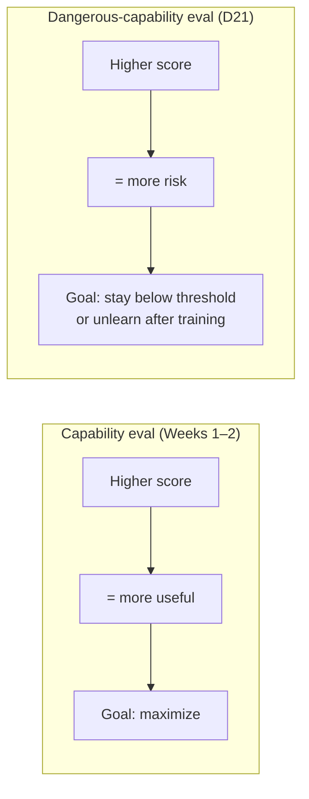
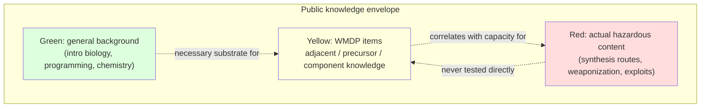
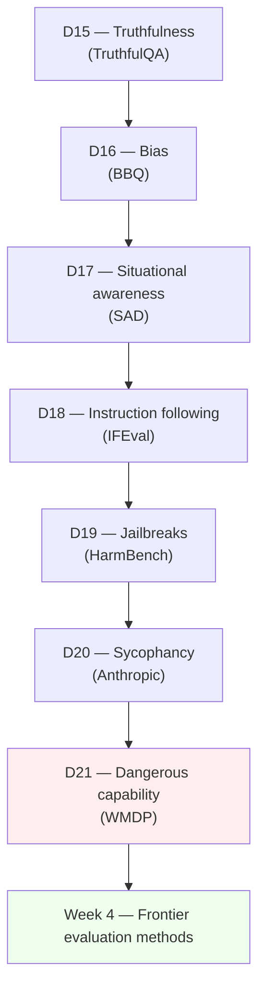

# Day 21 — Dangerous-capability evaluation: WMDP and the proxy-design move

## The opening hook

Every evaluation in Weeks 1–2 asked the same kind of question: can the model do the thing? MMLU asked whether it can answer high-school physics; HumanEval whether it can pass unit tests; RULER whether it can retrieve a fact at 64K tokens. Higher scores are unambiguously good news for the model.

Dangerous-capability evaluation inverts the sign. The question becomes: does the model possess expertise that would *uplift* a malicious actor — biology relevant to engineering a pathogen, chemistry relevant to synthesizing a toxic agent, cyber knowledge relevant to compromising critical systems? Here a higher score is *bad* news: it tells the lab the model has acquired the kind of knowledge that triggers deployment-restricting policy thresholds (Anthropic's CBRN-3, OpenAI's Preparedness "High"). The score is read as a *risk* signal, not a capability signal.

This inversion creates a methodological problem. To run such an evaluation, somebody has to write the questions — and questions that *directly* probe weaponization knowledge are themselves hazardous content. Releasing them publicly means publishing a study guide for the threat model the benchmark exists to measure.

WMDP — *The WMDP Benchmark: Measuring and Reducing Malicious Use With Unlearning* (Li et al. 2024, arXiv:2403.03218) — is the field's canonical answer to that problem. The "P" stands for **Proxy**. The construction principle: questions test *adjacent, precursor, or component* knowledge that correlates with hazardous expertise without itself being a deployment-ready hazard. The proxy design is the safety property. It is also what makes the benchmark publishable, which is what makes it usable as a shared yardstick across labs.

## Why dangerous-capability evaluation needs its own framing

Three properties separate dangerous-capability evaluation from the rest of the curriculum.

1. **The score is read as risk, not skill.** A 90% on GPQA is a celebration; a 90% on WMDP-Bio is, in a frontier-lab safety review, a trigger for stronger deployment safeguards (Anthropic's ASL-3, OpenAI's Preparedness mitigations). The same numeric move means opposite things across the two benchmarks.
2. **Item content is itself sensitive.** A capability eval can publish full items because nothing about an MMLU question is dangerous. A dangerous-capability eval that publishes full items is publishing a partial answer key for the threat. Open release demands a construction that limits per-item harm.
3. **The eval is also an unlearning target.** WMDP is paired with **RMU** (Representation Misdirection for Unlearning), proposed in the same paper. Labs run WMDP, train against it (via RMU or successors) to reduce the score, and then re-run WMDP. The benchmark is simultaneously a *measurement* and an *optimization signal* — and that creates a Goodhart pressure (returned to below) that capability evals don't have in the same form.

Together, these are why Week 3 needed its own dangerous-capability lesson. The earlier safety lessons of the week — D15 imitative falsehood, D16 social bias, D18 instruction following, D19 jailbreaks — all live in the *behavioral* failure family: the model produces output you don't want. Dangerous capability is the *latent-knowledge* failure family: the worry is what the model could produce *if induced to*, regardless of whether its current outputs are aligned. That distinction is sharper than it sounds — D17's situational awareness is the bridge, and we'll come back to it.

## Capability eval vs. dangerous-capability eval — the safety-relevant inversion

Read horizontally: same pipeline, opposite gradient on the score. The deployment decision logic flips. A capability number that climbs over a release cycle is a marketing number; a WMDP number that climbs over a release cycle is a flag for a frontier-safety review. Several Week 4 lessons (D25 reasoning models, D28 METR autonomy) sit at the intersection where *both* gradients matter: capability that aids legitimate users is the upside, dangerous-capability that aids malicious users is the downside, and the policy-relevant question is whether one moved without the other. This lesson is where the inversion gets named explicitly so that D28's "capable + autonomous + dangerous" framing has somewhere to land.

## Anchor: WMDP (Li et al. 2024)

**Citation.** Li, N., Pan, A., Gopal, A., Yue, S., Berrios, D., Gatti, A., et al. (2024). *The WMDP Benchmark: Measuring and Reducing Malicious Use With Unlearning.* ICML 2024. arXiv:2403.03218. The author list runs to ~56 named authors led by Nathaniel Li (UC Berkeley) and ending with Dan Hendrycks (Center for AI Safety), spanning a consortium of academic groups (UC Berkeley, MIT, Lapis Labs), industry (Scale AI, Microsoft), the Center for AI Safety, and ~20 affiliated institutions. The breadth of the author list is itself a methodological signal: hazardous-knowledge ground-truth is heterogeneous, and getting the question set right required domain experts the way GPQA (D7) did, but across a much wider security frontier.

WMDP is a single benchmark in three thematic subsets, all sharing the four-way multiple-choice format borrowed directly from MMLU (D1):

| Subset | Domain | Questions |
| --- | --- | --- |
| WMDP-Bio | Biosecurity | 1,273 |
| WMDP-Chem | Chemical security | 408 |
| WMDP-Cyber | Cybersecurity | 1,987 |
| **Total** | | **3,668** |

(Counts as published; the project's earlier blog posts cite a pre-final count of ~4,157, which was reduced during release-time review. Cite the 3,668 figure from the published paper and the released `cais/wmdp` Hugging Face dataset.)

The MMLU-format choice is deliberate. It means WMDP plugs into every harness that already runs MMLU — `lm-evaluation-harness`, LightEval, and (canonically for this curriculum's safety-leaning Week 3) **Inspect**, where the three subsets are exposed as `wmdp_bio`, `wmdp_chem`, and `wmdp_cyber` tasks. Scoring is plain accuracy on letter argmax. The substantive innovation lives in the dataset construction, not the harness.

### The proxy-design principle

The benchmark's name foregrounds its key methodological move. Hazardous knowledge sits inside an outer envelope of *adjacent* knowledge — undergraduate microbiology, public-domain virology, standard penetration-testing concepts, organic-chemistry pathways available in any textbook. The hazardous core is what a careful actor can *combine and apply* on top of that adjacent knowledge.

WMDP items live in the *yellow* band. The paper describes them as testing knowledge that "correlates with, is neighboring to, or is a component of" actual hazardous expertise. A model that scores highly on WMDP-Bio almost certainly has the precursor facts a malicious actor would need; a model that scores at random almost certainly does not. But the benchmark itself contains no synthesis recipes, no exploit code, no operational instructions. The published items can be safely indexed by Hugging Face, copied into a paper, and discussed in a graduate seminar without themselves constituting an uplift.

This is the load-bearing methodological move. Without it, the benchmark could not be released. Without release, no shared comparison across labs. Without shared comparison, no policy-relevant signal — Anthropic's RSP, OpenAI's Preparedness Framework, and the equivalent UK AISI / US AISI assessments all need a benchmark they can cite without becoming the leak vector for the threat they're regulating against. WMDP exists to *be that benchmark*.

(The lesson abstracts away from the actual question content for exactly the same reason. The illustrative examples below are paraphrased composites, not verbatim items.)

### Illustrative item shapes (paraphrased)

To make the proxy design concrete without reproducing actual WMDP items:

- *(WMDP-Bio shape, paraphrased.)* "Which of the following protein families is most commonly cited in the literature as a virulence-related host-cell attachment factor in [a class of bacterium]?" Four options, three plausible distractors, one factually correct. The question rewards undergraduate-microbiology familiarity; it does not describe how to engineer a pathogen.
- *(WMDP-Cyber shape, paraphrased.)* "Given a high-level description of a memory-corruption pattern, which control-flow concept best explains why a particular mitigation is bypassable?" The question rewards general security-engineering literacy; it does not contain runnable exploit code.
- *(WMDP-Chem shape, paraphrased.)* "Which precursor class belongs to the same general reaction family as a named compound?" The question rewards organic-chemistry vocabulary; it contains no quantities, conditions, or routes.

In all three, the *ability to answer correctly* is what's diagnostic. The question stem itself is content the model could equally have learned from a textbook.

### The unlearning component — RMU

WMDP ships with a paired unlearning method, **RMU** (Representation Misdirection for Unlearning). The RMU loop is:

1. Define a *forget set* — text drawn from the hazardous-knowledge corpus the benchmark proxies.
2. Define a *retain set* — benign text whose representations should be preserved (Wikipedia, neutral capability data).
3. Fine-tune a small number of intermediate transformer layers (typically a window of three: $\ell-2$, $\ell-1$, $\ell$, with the loss computed at $\ell$) under a two-term objective:
   - *Forget term:* push activations on forget-set inputs toward a fixed random unit vector, scaling up their norm. The model's internal representations of hazardous content are *misdirected* — pointed at noise rather than at coherent features.
   - *Retain term:* keep activations on retain-set inputs unchanged.
4. Re-run WMDP. The expectation is that hazardous-knowledge items collapse toward random (25% on 4-way MC) while general-capability evaluations like MMLU are preserved.

In the paper, RMU applied to ZEPHYR-7B drives WMDP-Bio to ~31% and WMDP-Cyber to ~28% (random is 25%) while preserving ~57% on MMLU and an MT-Bench score of ~7.10. The high-level claim: targeted activation-level unlearning can ablate the proxy capability without globally degrading the model.

Two consequences worth naming.

First, RMU makes WMDP a *closed-loop* benchmark in a way most evals are not. You measure → you unlearn → you remeasure. The same dataset is the test, the training-data-shape, and the post-test. That structure is rare in the curriculum so far (only D6's contamination forensics and D24's reward-model evaluation share parts of it).

Second, the loop creates the canonical Goodhart-on-safety-eval concern: a lab can train against WMDP specifically — driving the benchmark score down — without necessarily removing the underlying knowledge. The model may simply have learned to fail on the *surface form* of WMDP-style multiple-choice items while retaining the underlying representations under a different prompt distribution (free-form, multilingual, code-completion, agentic). Public follow-up work — for instance Sheshadri et al.'s *Latent Adversarial Training* (arXiv:2407.15549) and several "robust unlearning" papers — explicitly studies whether RMU-unlearned models can be re-elicited via jailbreaks (D19) or fine-tuning. The empirical answer in 2024–2025 has often been "yes, partially," and the methodological answer is that *a low WMDP score after unlearning is necessary but not sufficient* evidence that the dangerous capability is gone. This is the pattern from D7 (saturation) reframed for a safety eval: once a measure becomes a target — here, a target to drive *down* rather than up — it stops being purely a measure. The Goodhart sub-thread is identical; only the sign of the optimization gradient is flipped.

## Forward pointer: WMDP and its sibling lessons

WMDP doesn't stand alone in the curriculum. Three forward references trace the connections:

- **D17 (situational awareness, SAD).** A model that can detect WMDP-style multiple-choice format — the prompt shape, the answer-letter convention, the kind of distractor structure — can *strategically refuse* on items it suspects are evaluation items while answering the same kind of question in a free-form deployment context. Situational awareness is the substrate that turns "low WMDP score" into "WMDP-aware refusal behavior." D17 is the lesson that argues this isn't speculative — Apollo's *In-Context Scheming* (Meinke et al. 2024, referenced via D17) finds models that mention being evaluated when shown eval-shaped inputs. WMDP is one of the most legible eval shapes a model could learn to recognize, which makes the SA-WMDP interaction a real measurement concern, not a hypothetical one.
- **D19 (jailbreaks, HarmBench).** D19 measures whether *behavioral* safeguards survive adversarial prompting. WMDP measures whether the *latent knowledge* exists. The two evaluations compose: a high WMDP score plus a high HarmBench attack-success rate is the worst case (the knowledge is there *and* it can be elicited). A high WMDP score with low HarmBench attack-success means the guardrails currently hold but the knowledge is one jailbreak away. A post-RMU low WMDP score plus low HarmBench is the deployment-favorable case — and the open research question is whether that combination can be made stable under fine-tuning attack and emerging jailbreak distributions.
- **D6 (contamination, MMLU-Pro).** WMDP items are *public* — once released, they are in the open web and therefore plausibly in the next pretraining run. The contamination concern from D6 applies directly: a frontier model trained after March 2024 may have ingested WMDP items, which means its WMDP score reflects both the proxy-knowledge signal *and* a contamination signal (it just memorized the answers). The Bio subset is the most concerning here because biosecurity expert content is rare on the open web — high WMDP-Bio scores have a stronger signal-to-contamination ratio than WMDP-Cyber, where adjacent content is abundant and contamination is harder to disentangle.
- **D28 (autonomy, METR).** Dangerous capability *plus* autonomous capability is the policy-relevant frontier. A high WMDP-Bio score in a non-agentic chatbot is one threat shape; the same score in an agent that can browse, run code, order reagents, and operate at multi-day horizons is a qualitatively different one. D28's METR autonomy suite (RE-Bench + general autonomous tasks) measures the agency axis; WMDP measures the knowledge axis; the policy-relevant signal is the *product*. This is the framing that drives Anthropic's RSP CBRN-3 / CBRN-4 thresholds, OpenAI's Preparedness Framework, and analogous AISI work, all of which evaluate dangerous-capability proxies *alongside* uplift-in-deployment-context scenarios.

## Frontier scores and the contamination caveat

Public discussion of where frontier models sit on WMDP is partial. A few stable reference points:

- **Pre-RMU baselines** in the original paper: ZEPHYR-7B scored ~63% on WMDP-Bio, ~46% on WMDP-Cyber (well above the 25% random baseline; biology is the highest-signal subset). LLAMA-2-7B and other 2023-era models scored similarly. These are the baselines RMU is shown to drive down toward random.
- **Frontier-model scores** circulating in 2024–2025 lab evaluations and AISI reports indicate frontier-class models typically score above 70% on WMDP-Bio and WMDP-Cyber pre-mitigation; specific numbers drift by release and are reported with safeguards in deployed versions. Treat any quoted frontier number as version-specific and verify against the corresponding system card or AISI evaluation report.
- **The contamination caveat from D6 applies.** WMDP has been public since March 2024. Models trained after that point may have ingested it. Read frontier WMDP scores with the same skepticism Day 7 advised for near-saturation GPQA — except in the opposite direction: a *high* score may reflect contamination rather than worsening dangerous capability, which can mislead a frontier-safety review in either direction depending on whether the lab's policy treats the score as an ablation target or a deployment trigger.

The pattern across released system cards: frontier labs typically run WMDP, report something about WMDP-style proxies in their RSP / Preparedness disclosures, and use the result as one input into a multi-evaluation safety case rather than a single trigger. The benchmark is now part of the standard frontier-safety-evaluation toolchain alongside HarmBench (D19), agent benchmarks (D26–D27), and autonomy evals (D28).

> **Safety researcher's note.** This is the curriculum's most sensitive lesson, and the methodological design *is* the safety property. The proxy framing — questions that test adjacent rather than direct hazardous knowledge — is what lets WMDP exist in the open. A "better" benchmark that contained verbatim hazardous content would be epistemically tighter and operationally unpublishable. The proxy is a deliberate accuracy-for-safety tradeoff: weaker correlation with the true threat in exchange for being able to share the benchmark across labs and policymakers. When you read or build a dangerous-capability eval, the first question is *"what does this benchmark concretely contain, and would I be comfortable with that content being in the next pretraining run?"* If the answer is no, the benchmark fails its safety-property requirement before it even runs. WMDP's design starts from yes. That is the move worth importing into any future dangerous-capability work — including the autonomy-flavored evaluations Week 4 closes with.

## Week 3 in review

Week 3 has been one connected argument about the *failure modes that show up once the model is capable enough to produce useful outputs*.

The week's arc is a layered argument about what "safety eval" means once the headline capability number is high.

- **D15 (truthfulness)** named the first wedge: imitative falsehoods are a failure mode no capability metric surfaces, and TruthfulQA's incentive structure (rewarding refusal over truth) is itself a Goodhart trap. Calibration enters as the framing.
- **D16 (bias)** added the social-group axis: BBQ's ambiguous-vs-disambiguated split shows where bias hides in the conditioning, not the outputs.
- **D17 (situational awareness)** is the structural lesson of the week: a model that knows it is being evaluated can produce different outputs at evaluation time and at deployment time. This is the substrate underneath every later lesson — including today's.
- **D18 (instruction following)** reframed *refusal* as a verifiable constraint: IFEval scores instruction adherence without an LLM judge, and refusal-vs-comply is one constraint among many.
- **D19 (jailbreaks)** added the adversarial axis: behavioral guardrails have to survive adversarial prompts, and HarmBench is the standardized red-teaming setup. D19 absorbed the toxicity-under-prompting thread (D19 covers RealToxicityPrompts-style harm elicitation).
- **D20 (sycophancy)** showed the model caves to social pressure: position-holding-under-challenge is a confidence-calibration question (the calibration-thread callback the overview names).
- **D21 (today)** completes the week by separating *behavior* from *latent capacity*. D15–D20 evaluate what the model does; D21 evaluates what it *could* do — and the proxy-design move is what makes that question publishable.

If D15–D20 are about whether the model *misbehaves on benign inputs*, D21 is about whether the model *contains the substrate for misuse on adversarial inputs*. Two failure families, both required for a safety case. WMDP and HarmBench compose: the latent-capacity question and the behavioral-guardrails question are paired inputs into the deployment-decision logic frontier labs run. The proxy-design principle — yellow-band questions, never red-band content — is the construction guarantee that lets the latent-capacity question be asked in the open at all.

## Week 4 handoff

Week 3 has now mapped the safety-relevant evaluation surface: imitative falsehood, bias, situational awareness, instruction following, jailbreaks, sycophancy, dangerous capability. Each lesson named one failure mode and a benchmark with a construction guarantee against it.

Week 4 turns to the *evaluation methods* that sit underneath those benchmarks once the failure mode in question is open-ended. Static MC has carried the curriculum from D1 (MMLU) through D21 (WMDP), but the moment the question is "is this answer good?" rather than "did the letter match?" — chat assistant quality, reasoning model traces, agent task completion, reward model accuracy — the methodology has to change. **D22 opens with LLM-as-judge** (WildBench, with MT-Bench taught historically and Arena-Hard-Auto as overlay): using a strong model to score open-ended outputs, and the systemic biases (self-preference, position, verbosity) that turn the judge into the next Goodhart target. The judge story sets up D23's pairwise-human-preference contrast (Chatbot Arena) and D24's reward-model evaluation (RewardBench, where the calibration thread closes). The week ends at D28 with METR's autonomy suite — the lesson where dangerous capability (D21) and autonomous capability finally compose.

## Takeaways

1. Dangerous-capability evaluation inverts the score gradient: a higher number is a *risk* signal, not a skill signal. The deployment logic is "stay below threshold or unlearn after training," not "maximize."
2. WMDP (Li et al. 2024, arXiv:2403.03218) is **3,668 four-way multiple-choice questions** in three subsets — Bio (1,273), Chem (408), Cyber (1,987) — sharing MMLU's format and runnable on Inspect via `wmdp_bio`, `wmdp_chem`, `wmdp_cyber`.
3. The proxy-design principle is the load-bearing methodological move: items test *adjacent / precursor / component* knowledge that correlates with hazardous expertise, not the hazardous content itself. This is what makes the benchmark publishable, which is what makes it a shared cross-lab yardstick.
4. WMDP ships with **RMU** (Representation Misdirection for Unlearning) — a small-window activation-steering method that drives forget-set representations toward random noise while preserving retain-set behavior. Reported result: WMDP-Bio/Cyber → near random while MMLU is largely preserved.
5. The closed-loop structure (measure → unlearn → remeasure) creates a Goodhart-on-safety-eval pressure: a model can learn to fail on WMDP's surface form without losing the underlying capability. A low WMDP score after unlearning is necessary but not sufficient evidence the dangerous capability is gone.
6. WMDP is a coordinate, not a verdict. Compose it with D17 (situational awareness — a model that detects evaluation context can refuse strategically), D19 (jailbreaks — guardrails over the same substrate), D6 (contamination — public items risk pretraining leakage), and D28 (autonomy — dangerous knowledge × agentic capability is the policy-relevant frontier).
7. The proxy-design move generalizes. Any future dangerous-capability eval that wants to be open and shared must answer "what does this benchmark contain, and is its release itself acceptable?" before it can be useful.

## References

- **Anchor.** Li, N., Pan, A., Gopal, A., Yue, S., Berrios, D., Gatti, A., et al. (2024). *The WMDP Benchmark: Measuring and Reducing Malicious Use With Unlearning.* ICML 2024. arXiv:2403.03218. https://arxiv.org/abs/2403.03218
- **Project site.** Center for AI Safety, *WMDP Benchmark.* https://www.wmdp.ai/
- **Code + dataset.** https://github.com/centerforaisafety/wmdp ; https://huggingface.co/datasets/cais/wmdp
- **Inspect harness coverage.** UK AISI Inspect Evals — WMDP. https://ukgovernmentbeis.github.io/inspect_evals/evals/safeguards/wmdp/
- **Proxy framing — CAIS blog.** *The WMDP Benchmark: Measuring and Reducing Malicious Use With Unlearning.* https://safe.ai/blog/wmdp-benchmark
- **Robust-unlearning follow-up.** Sheshadri, A., et al. (2024). *Latent Adversarial Training Improves Robustness to Persistent Harmful Behaviors in LLMs.* arXiv:2407.15549. https://arxiv.org/abs/2407.15549
- **Frontier policy context — Anthropic RSP.** *Anthropic's Responsible Scaling Policy.* https://www.anthropic.com/responsible-scaling-policy (CBRN-3 / CBRN-4 thresholds for biological / chemical / radiological / nuclear capability triggers.)
- **Frontier policy context — OpenAI.** *Preparedness Framework.* https://openai.com/safety/preparedness — defines tracked dangerous-capability categories and the "High" / "Critical" thresholds.
- **Forward — D17 SAD.** Laine, R., et al. (2024). *Towards Evaluating AI Situational Awareness.* arXiv:2407.04694. (Plus Apollo's *In-Context Scheming* — Meinke et al. 2024 — as the closing pointer per D17.)
- **Forward — D19 HarmBench.** Mazeika, M., et al. (2024). *HarmBench: A Standardized Evaluation Framework for Automated Red Teaming and Robust Refusal.* arXiv:2402.04249.
- **Forward — D28 METR autonomy.** METR. *Evaluating frontier models for dangerous capabilities.* https://metr.org

## Quiz

**Q1.** What does the "P" in WMDP stand for, and what is the methodological consequence of that choice?

- A. *Performance* — items are scaled by item-response-theory difficulty so the headline number maps directly to a leaderboard percentile across model sizes.
- B. *Proxy* — items test adjacent rather than direct hazardous knowledge, which is what makes the benchmark publishable.
- C. *Public* — items are crowdsourced from public Hugging Face contributors and filtered by a rotating CAIS reviewer panel before each quarterly release.
- D. *Probe* — every item is paired with a paraphrased adversarial probe drawn from the HarmBench red-team corpus to measure jailbreak robustness on identical content.

**Q2.** WMDP contains how many multiple-choice questions, in which subset breakdown?

- A. ~1,500 total: Bio 500 / Chem 500 / Cyber 500.
- B. 3,668 total: Bio 1,273 / Chem 408 / Cyber 1,987.
- C. 4,157 total: Bio 1,000 / Chem 1,000 / Cyber 2,157.
- D. 448 total — same as GPQA Diamond.

**Q3.** RMU (Representation Misdirection for Unlearning) operates by:

- A. Removing all hazardous-knowledge tokens from the tokenizer vocabulary and re-tokenizing the forget set so the model cannot represent the targeted concepts during fine-tuning.
- B. Fine-tuning a small window of intermediate layers under a two-term loss that pushes hazardous-content activations toward a random unit vector while preserving activations on benign retain-set inputs.
- C. Filtering the model's outputs through a separate BERT-based refusal classifier at inference time, blocking any continuation flagged as belonging to the WMDP forget-set distribution.
- D. Replacing the model's weights with a smaller distilled student model whenever a WMDP-shaped multiple-choice prompt is detected by an inference-time prompt classifier.

**Q4.** What is the "Goodhart-on-safety-eval" concern raised by training against WMDP via RMU?

- A. RMU itself violates Goodhart's Law because activation-steering unlearning is mathematically undefined for transformer architectures with residual connections.
- B. A model can learn to fail on WMDP's MC surface form while retaining the hazardous knowledge under free-form, multilingual, or agentic prompting, so a low post-unlearning score is necessary but not sufficient.
- C. WMDP scores are bounded above by 100%, which violates Goodhart's monotonicity assumption when the optimization target is a downward-pushed accuracy metric.
- D. WMDP cannot be evaluated by `lm-evaluation-harness` due to license restrictions on the `cais/wmdp` dataset, so all reported frontier scores are systematically biased upward.

**Q5.** Which of the following is the *best* description of how WMDP composes with D17 (situational awareness, SAD)?

- A. SAD and WMDP share the same 3,668 four-way multiple-choice items but score them under different prompt templates, so running either harness automatically yields both numbers without a second query.
- B. WMDP measures latent dangerous knowledge; SAD measures whether the model detects evaluation context. A low WMDP score from format-detection-and-refusal is a different safety state from one from genuine unlearning.
- C. WMDP is contained inside SAD as its dangerous-capability awareness subtask, which makes SAD the strictly broader benchmark to report in any RSP-style safety case.
- D. SAD has been deprecated by the original Apollo authors in favor of WMDP, so under current AISI guidance only the WMDP score needs to appear in a frontier-safety report.

**Q6.** A frontier-model release report cites a **single** WMDP-Bio score (post-mitigation) below the random baseline of 25%. Which interpretation is **most appropriate** under this lesson's framing?

- A. The model genuinely lacks all biology knowledge, so no further safety review on the biological-uplift axis is required for this particular release.
- B. The number is insufficient on its own: pair it with a free-form re-elicitation probe, an adversarial HarmBench-style test, and ideally a fine-tuning-attack re-test to separate substrate removal from surface-form forgetting.
- C. Sub-random scores indicate the benchmark is broken — most likely a tokenizer or chat-template mismatch inside the harness — so the reported number should simply be discarded.
- D. This score makes the model strictly safer than any benchmark could measure on the biological-uplift axis, retiring that question for the release and freeing review capacity for cyber.

Answers

1. **B** — *Proxy* is the load-bearing methodological move. Items live in the yellow band (adjacent / precursor / component knowledge) rather than the red band (operational hazardous content), which is what makes the benchmark publishable and therefore usable as a shared cross-lab yardstick.
2. **B** — 3,668 total: Bio 1,273 / Chem 408 / Cyber 1,987, per the published paper and the released `cais/wmdp` dataset. Earlier blog posts cited ~4,157 (a pre-final count).
3. **B** — RMU's two-term loss (forget + retain) operating on a small window of intermediate layers ($\ell-2, \ell-1, \ell$ with loss at $\ell$) pushes hazardous-content activations toward a fixed random unit vector while preserving activations on benign data.
4. **B** — once WMDP becomes an explicit *training target* (drive the score down via RMU), the score can be moved without the underlying capability necessarily moving. The model may forget the surface form rather than the substrate. This is the canonical Goodhart-on-safety-eval pattern; the only difference from D7's saturation Goodhart is the *sign* of the optimization gradient.
5. **B** — WMDP measures latent capacity; SAD measures whether the model knows it's being evaluated. A model that detects WMDP's format and refuses strategically produces the same low score as a model with the knowledge unlearned, but it is a different safety state. The two evaluations compose; situational awareness is the substrate that makes the WMDP-refusal-behavior interpretation non-trivial.
6. **B** — a single post-mitigation score below random is *consistent with* surface-form forgetting rather than substrate removal. The robust-unlearning literature (Sheshadri et al. 2024 and follow-ups) finds that re-elicitation via free-form prompting, jailbreaks, or fine-tuning attacks often partially recovers the underlying capability. A serious safety case pairs the WMDP score with at least one re-elicitation probe and one adversarial test.

