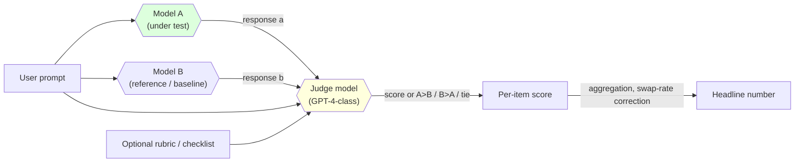
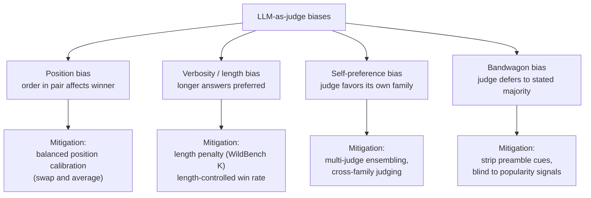

# Day 22 — LLM-as-a-judge: WildBench, MT-Bench, and the judge as the next Goodhart target

## The opening hook

Three days of Week 1 (D1 MMLU, D2 HellaSwag, D6 MMLU-Pro) trained the eye on multiple-choice scoring: the answer is a letter, the rule is set membership, the grader is a regex. D3 already telegraphed the limit — the moment the answer is prose rather than `(A)`, the grader becomes a *similarity function*, and EM, F1, BLEU, ROUGE all fail in known ways on anything longer than a noun phrase. D21 closed Week 3 on dangerous-capability evaluation and explicitly handed off to today: **once the question is "is this answer good?" rather than "did the letter match?", the methodology has to change.**

The methodology that ate the field is **LLM-as-a-judge** — prompt a strong model (GPT-4-class, Claude-class) with the user prompt and a candidate response, ask it to score or compare. The shift is structural. The stochastic process inside the harness is now *two* models: the model under test, and the model doing the grading. Everything that made D1's pipeline picture clean — deterministic harness wrapping a stochastic model — gets a second stochastic box, with a second prompt template, a second sampler, and a second set of biases.

D22's job is to make those biases legible, anchor the modern methodology on **WildBench** (Lin et al. 2024), trace the lineage through **MT-Bench** (Zheng et al. 2023, the paper that established the methodology), contrast with **Arena-Hard-Auto** (Li et al. 2024, the auto-judge derived from human-preference data), and foreground the Goodhart mechanism that distinguishes this lesson from D6, D15, and D17: **the measurement instrument itself becomes the optimization target**.

## The judge pipeline



Two stochastic boxes, two prompt templates, two sampling decisions. The yellow box is the new failure surface. Every property of an LLM that we've spent three weeks naming as a problem in the model under test — calibration drift, prompt sensitivity, situational awareness, sycophancy, confident wrongness — now applies *to the grader as well*.

Two scoring shapes are common, and they have different bias profiles:

- **Pointwise scoring** — the judge sees one response and emits a score (typically 1–10). Cheap; one judge call per item. Used by WildBench's **WB-Score** and by MT-Bench's single-answer setting.
- **Pairwise comparison** — the judge sees two responses for the same prompt and picks a winner (or tie). More information per call; agreement with human preference is generally higher than pointwise; but pairwise is where **position bias** is sharpest. Used by WildBench's **WB-Reward**, MT-Bench's pairwise mode, and Arena-Hard-Auto.

## Anchor: WildBench (Lin et al. 2024)

**Citation.** Lin, B. Y., Deng, Y., Chandu, K., Brahman, F., Ravichander, A., Pyatkin, V., Dziri, N., Le Bras, R., & Choi, Y. (2024). *WildBench: Benchmarking LLMs with Challenging Tasks from Real Users in the Wild.* arXiv:2406.04770. Project: <https://huggingface.co/spaces/allenai/WildBench>; code: <https://github.com/allenai/WildBench>.

WildBench is the modern, less-saturated anchor for the LLM-as-judge methodology. The construction principle is the load-bearing methodological move:

- **Real-user prompts.** **1,024 tasks** drawn from over one million human-chatbot conversations in the **WildChat** corpus (Zhao et al. 2024) — i.e., things actual users typed at real assistants, filtered for difficulty and quality. Compare to MT-Bench's 80 expert-curated items: WildBench is over an order of magnitude larger and is sampled from in-distribution deployment traffic rather than authored by researchers.
- **Two scoring metrics, both LLM-judged.** The benchmark reports **WB-Score** (pointwise) and **WB-Reward** (pairwise) so that the position-bias-sharper pairwise number can be cross-checked against the cheaper pointwise number.
- **Per-item checklists.** Each prompt ships with a model-generated checklist of evaluation criteria (e.g., "Does the response correctly identify the entity X?", "Does it avoid hallucinating Y?"). Checklists are generated by a *combination* of GPT-4-Turbo and Claude-3-Opus and merged — explicit dual-judge construction to reduce single-judge bias at the rubric level.
- **Explicit length-bias mitigation.** This is the eval-design move that most distinguishes WildBench from MT-Bench, and it is the load-bearing answer to verbosity bias (named below). The WB-Reward pipeline applies a *length penalty parameter K* (in characters): when a "Slightly Win" or "Slightly Lose" outcome would have favored the longer response by more than K characters over the shorter, the outcome is **converted to Tie**. Setting $K = \infty$ disables the penalty; the published WildBench leaderboard reports both the with-penalty and without-penalty numbers, so the reader can see the verbosity component separately.

### WB-Score — pointwise (1–10 rescaled)

For a candidate response $r$ to prompt $p$ with checklist $C$, GPT-4-Turbo emits an integer score $Y \in \{1, \ldots, 10\}$. The reported score is rescaled:

$$
\text{WB-Score}(r) = (Y - 5) \times 2
$$

so that $Y = 5$ ("borderline acceptable") maps to $0$, $Y = 10$ ("excellent") maps to $+10$, and $Y = 1$ ("unusable") maps to $-8$. The rescaling makes the headline number signed — a model below borderline is reported negative — which is a small but useful design choice for cross-model deltas.

### WB-Reward — pairwise (5-point scale, three baselines)

Pairwise comparison against three reference models at varying performance levels (a strong, a mid, and a weaker reference). Each pair yields one of five outcomes scored:

| Outcome | Score |
| :-- | --: |
| Much better | $+100$ |
| Slightly better | $+50$ |
| Tie | $0$ |
| Slightly worse | $-50$ |
| Much worse | $-100$ |

WB-Reward-Mix averages across the three baselines. The length penalty (described above) applies to the "Slightly" rows, mapping verbose-but-not-substantively-better responses to Tie.

### Why WildBench over MT-Bench (briefly)

MT-Bench's 80 items have been on the public web since 2023; the items themselves are now in pretraining and the saturation arc has been steep — frontier models cluster near the top of MT-Bench's 1–10 scale, compressing the dynamic range. WildBench's 1,024 items are real-user prompts at deployment scale; they are harder to curate-for, and the size + length-mitigation makes the eval less single-judge-confident. The same pedagogical relationship as MMLU → MMLU-Pro on D6: the methodology is the same, the redesign restores headroom and adds explicit defenses against the most legible biases. (MT-Bench remains the right pedagogical anchor for *naming* the methodology; WildBench is the right anchor for *running* it in 2026. We cover MT-Bench next as the methodology's origin.)

### Worked example

A user-typed prompt: *"I have an old Python 2 codebase using `print` statements and `urllib2`. Convert this 30-line module to Python 3 and explain each change."*

```
Model A response:  [60-line response — converted code + a numbered list of
                    every change, including print → print(), urllib2 →
                    urllib.request, and a paragraph about why bytes/str
                    handling differs]

Model B response:  [180-line response — converted code + the same change list,
                    plus a tutorial on Python 3 type hints, an unrequested
                    refactor to use requests instead of urllib, and a closing
                    "if you have more questions..." paragraph]
```

Pointwise (WB-Score, GPT-4-Turbo as judge):

- Model A: $Y = 8$, WB-Score $= +6$.
- Model B: $Y = 8$, WB-Score $= +6$.

Pairwise (WB-Reward, against the strong baseline, judge sees both responses):

- *Without* length penalty: judge picks Model B as "Slightly better" — extra material reads as helpfulness. WB-Reward = $+50$ for B over A.
- *With* length penalty (default $K$): B is ~3× longer than A while not being substantively better on the checklist; the "Slightly better" rolls to **Tie**, WB-Reward $= 0$.

The gap between the two pairwise numbers — $+50$ vs $0$ — is the verbosity-bias component made legible. The whole point of WildBench's design is that this gap is *reported* rather than hidden.

## Methodology origin: MT-Bench (Zheng et al. 2023)

**Citation.** Zheng, L., Chiang, W.-L., Sheng, Y., Zhuang, S., Wu, Z., Zhuang, Y., Lin, Z., Li, Z., Li, D., Xing, E. P., Zhang, H., Gonzalez, J. E., & Stoica, I. (2023). *Judging LLM-as-a-Judge with MT-Bench and Chatbot Arena.* NeurIPS 2023 Datasets & Benchmarks Track. arXiv:2306.05685.

MT-Bench is where LLM-as-judge was named and validated as a methodology. The construction:

- **80 multi-turn questions**, expert-authored, **8 categories** of 10 items each: writing, roleplay, extraction, reasoning, math, coding, STEM-knowledge, humanities-knowledge.
- **Two-turn structure** for each item: a first question and a follow-up that depends on the assistant's first answer.
- **GPT-4 as default judge**, in either single-answer (pointwise) or pairwise mode. The paper reports that GPT-4 and GPT-4-judged pairwise comparisons reach **over 80% agreement with human preferences — the same level of agreement humans reach with each other** (Zheng et al. 2023, §4). This is the methodology's empirical foundation: a strong LLM judge is not noisier than a human rater on this distribution, while being orders of magnitude cheaper.

The 80% number is what made the methodology defensible to publish and to build on. It is *also* the number that travels poorly to other distributions — frontier coding tasks, long-form factuality, multilingual prompts — without re-validation. Reading "GPT-4 ≈ humans" as a property of LLM-as-judge in general rather than as a property of MT-Bench's specific item distribution is the standard error.

MT-Bench is taught here for two reasons: (1) the methodology's biases are sharpest and easiest to demonstrate on its 80 items, and (2) any later auto-judge benchmark — Arena-Hard-Auto, WildBench, AlpacaEval-LC — is a response to one of MT-Bench's specific holes. Knowing MT-Bench is the prerequisite for reading the responses.

## Overlay: Arena-Hard-Auto (Li et al. 2024)

**Citation.** Li, T., Chiang, W.-L., Frick, E., Dunlap, L., Wu, T., Zhu, B., Gonzalez, J. E., & Stoica, I. (2024). *From Crowdsourced Data to High-Quality Benchmarks: Arena-Hard and BenchBuilder Pipeline.* arXiv:2406.11939. LMSYS blog: <https://www.lmsys.org/blog/2024-04-19-arena-hard/>.

Arena-Hard-Auto is the structurally most interesting of the three because it derives an auto-judge benchmark from *human preference data* (Chatbot Arena, the D23 anchor). The pipeline:

1. Start from ~200,000 user queries collected via Chatbot Arena.
2. Cluster queries with BERTopic + UMAP + HDBSCAN.
3. Have an LLM (GPT-3.5/GPT-4-Turbo) score each prompt 0–7 on seven challenge-oriented criteria — specificity, domain knowledge, complexity, problem-solving, creativity, technical accuracy, real-world applicability.
4. Keep clusters whose mean score $\geq 6/7$. **250 clusters** survive.
5. Sample 2 prompts per cluster for the final benchmark: **500 prompts**.
6. Score with GPT-4-Turbo as judge in pairwise mode against a fixed reference model; aggregate with a Bradley-Terry model.

Two reported separability/agreement numbers from the paper, both relative to Chatbot Arena's human-preference rankings:

- **Separability with 95% confidence intervals: 87.4%** (vs. MT-Bench's ~22.6%).
- **Agreement with Chatbot Arena rankings: 89.1%** (vs. MT-Bench's ~26.1% under the same protocol).

These are higher than MT-Bench's because (a) 500 items > 80 items so the confidence intervals are tighter, (b) the prompts are filtered for difficulty, and (c) the construction is *grounded in human preference data* — the item set is the one the auto-judge has the best chance of agreeing with humans on. That last is the structural feature: Arena-Hard-Auto is an auto-judge on items that were already pre-filtered for being the kinds of items humans rank consistently.

The contrast with WildBench is the lesson's key methodological pivot. Both are 2024-vintage responses to MT-Bench saturation. **Arena-Hard-Auto** is calibrated against human preference and therefore shines on the dimensions humans care about — but its construction inherits whatever Chatbot Arena's user population cares about (a real distribution, but a specific one). **WildBench** is calibrated against a different kind of real distribution (WildChat in-the-wild conversations) and adds explicit length-bias mitigation. Reporting both is the 2026 default; reporting only one is a choice that needs justifying.

## The judge biases — the canonical four

Zheng et al. (2023) named four systematic biases that an LLM judge brings to the pipeline. Subsequent work has elaborated each. They are the failure modes any judge-based eval has to budget for.



### Position bias

**Citation.** Wang, P., Li, L., Chen, L., Cai, Z., Zhu, D., Lin, B., Cao, Y., Liu, Q., Liu, T., & Sui, Z. (2023). *Large Language Models are not Fair Evaluators.* ACL 2024. arXiv:2305.17926.

In pairwise judging, the judge has a systematic preference for one position (typically first or second) independent of content. The original paper's headline demonstration: with ChatGPT as evaluator on 80 queries, **Vicuna-13B beat ChatGPT on 66 out of 80 queries** simply by being placed in the favored slot. The same response-pair, swapped, flips many decisions.

Define the **swap rate** for a judge $J$ on a dataset of pairs $\{(a_i, b_i)\}$:

$$
\text{swap-rate}(J) = \frac{1}{N} \sum_{i=1}^{N} \mathbb{1}\bigl[\, J(a_i, b_i) \neq \text{reverse}(J(b_i, a_i)) \,\bigr]
$$

A judge with no position bias has swap-rate $= 0$ (the judgment is invariant under reordering). A judge with severe position bias has swap-rate that can exceed $0.5$. Wang et al. show GPT-4 has lower swap-rate than ChatGPT but is not zero; subsequent work (Shi et al. 2024, *Judging the Judges*, arXiv:2406.07791) measures position bias systematically across modern judges and finds it persists even in frontier models.

The standard mitigation — **balanced position calibration** — runs every pair both ways and averages, doubling judge cost per item but eliminating the first-order positional confound. WildBench's pairwise pipeline does this; Arena-Hard-Auto does this; a custom judge eval that doesn't do this is reporting numbers with a known systematic error.

### Verbosity / length bias

**Citation.** Saito, K., Wachi, A., Wataoka, K., & Akimoto, Y. (2023). *Verbosity Bias in Preference Labeling by Large Language Models.* arXiv:2310.10076.

Judges (and reward models — D24) systematically prefer longer responses even when the longer response is not better on the checklist. The Saito et al. result is the canonical citation; Dubois et al.'s **AlpacaEval-LC** (length-controlled win rate, arXiv:2404.04475) is the canonical mitigation in the AlpacaEval lineage; WildBench's **K-character length penalty** is the structurally simpler mitigation in the WildBench lineage.

The safety-relevant consequence is sharp. RLAIF pipelines (RL from AI Feedback) using a verbosity-biased judge as the reward signal produce models that grow longer over training without growing better — the canonical "model gets more verbose every release" observation has its formal source here. D24 picks up this thread on the reward-model side.

### Self-preference bias

**Citation.** Panickssery, A., Bowman, S. R., & Feng, S. (2024). *LLM Evaluators Recognize and Favor Their Own Generations.* arXiv:2404.13076.

A judge from family $F$ scores responses generated by family $F$ higher than equivalent-quality responses from other families. Panickssery et al. establish the mechanism: there is a **linear correlation between a model's self-recognition capability and the strength of its self-preference bias**, and the relationship survives controls. The judge can identify its own outputs and rates them up.

The deployment-relevant version of this: **a lab whose own model is the judge for a public benchmark has a structural conflict of interest in reporting that benchmark's numbers for its competitors.** The mitigation is multi-judge ensembling (cross-family panels — e.g., GPT-4 + Claude + Gemini judging together with majority vote or averaging) or judging with a *different family* than the model under test. WildBench's checklist construction uses GPT-4-Turbo + Claude-3-Opus jointly partly for this reason.

### Bandwagon bias

The judge defers to a stated majority opinion in the prompt: "75% of users prefer X" or "this answer aligns with mainstream view" cues the judge toward agreement, independent of content. The bias is largely inherited from RLHF — human raters reward agreement with stated norms, and the judge is itself an RLHF'd model. The standard defense is to strip popularity / preamble cues from judge prompts and to monitor judge agreement under controlled prompt perturbations. (Justice or Prejudice — Ye et al. 2024, arXiv:2410.02736 — is the standard quantitative reference; see references below.)

### Other named biases (sidebar)

The four above are the canonical ones; the literature has extended the list:

| Bias | One-line shape |
| :-- | :-- |
| **Style / formatting bias** | Markdown, bullet lists, headers preferred over plain prose. |
| **Sycophancy** (D20) | Judge agrees with whichever side of a contested factual question is presented confidently. |
| **Anchor / numeric bias** | Judge anchors on numeric scores already present in context. |
| **Compassion / sentiment bias** | Judge prefers responses with hedged/empathetic phrasing. |
| **Refusal bias** | Judge over-rewards safety-shaped refusals (close cousin of D15 incentive-shape Goodhart). |

A 2026 judge-eval report that names only the canonical four and stops is incomplete. The full bias surface is broader, and judging-the-judge work (Shi et al. 2024, Ye et al. 2024) is now its own subfield.

## Goodhart foregrounded — the measurement instrument as target

This is the fourth Goodhart-foregrounded lesson in the curriculum. Restate the law:

> When a measure becomes a target, it ceases to be a good measure.

The D22 mechanism is **the measurement instrument itself becoming the optimization target**. When models are RL-tuned on judge-derived signals — RLAIF directly using a judge as reward (Bai et al. 2022, *Constitutional AI*; Lee et al. 2023, RLAIF), or indirectly through reward models trained on judge-labeled preferences (D24) — the judge's biases become the optimization gradient. A model trained against a verbosity-biased judge gets verbose. A model trained against a self-preference-biased judge of family $F$ converges toward producing $F$-style outputs. The judge's *systematic errors* propagate into the model's *output distribution*.

The mechanism is structurally distinct from the three prior Goodhart lessons:

| Lesson | Goodhart mechanism | What leaks | Target of optimization |
| :--- | :--- | :--- | :--- |
| **D6** (MMLU-Pro) | **Data leakage** | Test items into pretraining set | Score, via memorization of leaked items |
| **D15** (TruthfulQA) | **Incentive structure of the rubric** | Refusal-shaped strings count as truthful | Score, via aggressive abstention on contested-fact items |
| **D17** (SAD) | **Situational conditioning** | Model classifier over input contexts | Behavior conditional on "looks like eval" |
| **D22** (LLM-as-judge) | **Measurement instrument as target** | Judge biases (verbosity, position, self-preference, bandwagon) | Output distribution that *games the judge*, not output distribution that satisfies the underlying user |

Three properties make D22's mechanism distinct.

1. **The leak is in the grader, not the test set or the rubric.** D6's defense is to rebuild the test set (MMLU → MMLU-Pro). D15's defense is to rebuild the reward shape (FActScore, atomic-fact decomposition). D17's defense is to make eval indistinguishable from deployment. D22's defense has to operate on *the judge model*: ensemble across families, measure swap-rate, apply length penalty, audit with judge-the-judge frameworks. The location of the defense moves.
2. **The optimization gradient is automated and at scale.** RLAIF can apply a judge to millions of generations per training run. If the judge has a 5-point-on-the-scale verbosity bias, the model learns to be verbose to recover those 5 points, *every gradient step*. The judge bias is not a measurement noise term — it is a coherent training signal pointing in a specific wrong direction.
3. **Self-preference closes the loop.** The most uncomfortable case: a lab's frontier model, $M$, is also a (or *the*) standard judge for benchmarks $M$'s next version is being trained against. $M$-as-judge prefers $M$-style outputs (Panickssery et al. 2024). Training the next model with $M$ as judge selects for $M$-style output. The lab's model, the lab's judge, the lab's reward signal — all from the same family. The eval, the optimizer, and the optimizee are not three independent systems.

The defense story is correspondingly different from D6/D15/D17. The 2026 working answers:

- **Multi-judge cross-family ensembling.** Average GPT-4, Claude, Gemini judgments. WildBench uses GPT-4-Turbo + Claude-3-Opus for checklists for exactly this reason. Multi-judge does not eliminate position or verbosity bias (those are correlated across families) but it does cut self-preference at the lab-of-origin granularity.
- **Length-controlled scoring.** AlpacaEval-LC, WildBench's K-penalty, and Arena-Hard-Auto's length controls are different implementations of the same insight: report scores at fixed length, or convert "slight wins by length" to ties.
- **Balanced position calibration.** Run every pair both ways, average. Doubles cost; eliminates first-order position bias.
- **Judge-the-judge audits.** Independent benchmarks of judge reliability — Shi et al. 2024 (*Judging the Judges*), Ye et al. 2024 (*Justice or Prejudice*), Tan et al. 2025 (*Judge Reliability Harness*) — measure how much a given judge's biases shift specific decisions, and they are now standard companion artifacts to any judge-based benchmark report.

The deeper point: **D22's Goodhart mechanism is the one most directly coupled to RLHF's training loop.** D6's leak happens in pretraining; D15's happens in fine-tuning reward design; D17's happens in deployment-vs-eval distribution shift. D22's leak is the only one where the *current* training run uses a *current* version of the eval *every gradient step*. That makes it the highest-bandwidth Goodhart channel in the curriculum, and the one whose defenses are most operationally load-bearing for any lab using AI-feedback at scale.

## Inspect harness coverage

Per the curriculum's harness mapping, **D22 = Inspect**. Inspect (UK AISI) ships first-class support for judge-style evaluations through its **model-graded scorers**:

- `model_graded_qa()` — general open-ended grading; the grading template is customizable, and the default asks the judge for `GRADE: C` (correct) or `GRADE: I` (incorrect) extracted by regex.
- `model_graded_fact()` — narrower factuality-focused variant.
- Custom scorers can take a **list of judge models**; each model grades independently and the final grade is by majority vote — the multi-judge ensembling pattern made first-class.

A schematic Inspect task for a WildBench-style judge eval:

```python
# Illustrative; cross-reference inspect_evals for a maintained reference.
from inspect_ai import Task, task
from inspect_ai.dataset import json_dataset
from inspect_ai.scorer import model_graded_qa
from inspect_ai.solver import generate

@task
def wildbench_style():
    return Task(
        dataset=json_dataset("wildbench_subset.jsonl"),
        solver=generate(),
        scorer=model_graded_qa(
            model=["openai/gpt-4-turbo",
                   "anthropic/claude-3-5-sonnet"],  # cross-family panel
            template="...",       # WildBench-style 1–10 with checklist
            grade_pattern=r"GRADE:\s*([0-9]+)",
        ),
    )
```

The pattern in production runs is: cross-family judge panel, balanced position calibration on pairwise items, length penalty as a post-processing step, and a separate audit run on a held-out judge-the-judge set to measure swap-rate.

## Frontier 2026 status — drift caveat

The set of judges in standard use shifts every release cycle, and the right reflex is the same as on every other live benchmark in this curriculum: cite the version explicitly, treat numbers as version-specific, and read against a contemporaneous system card. Stable points as of mid-2026:

- **GPT-4-Turbo / GPT-4o** remains the default WildBench, MT-Bench, and Arena-Hard-Auto judge in published numbers; Claude-3.5-Sonnet / Claude Opus 4 family is the standard cross-family complement.
- **AlpacaEval-LC** is the standard length-controlled headline number for chat-assistant eval; WildBench is the standard real-prompt headline; Arena-Hard-Auto is the standard human-preference-derived headline.
- **Multi-judge cross-family panels** are standard practice in 2026 published benchmarks; single-judge headline numbers (especially with the judge from the same family as a reported model) are now a flag for skepticism rather than a default.
- **Saturation arc:** MT-Bench is saturated for frontier models and now used pedagogically rather than as a current discriminator. WildBench and Arena-Hard-Auto have headroom in 2026 but the same arc is in motion. The D22 reading on saturation is the same as Day 7's: the mechanism that drove saturation on MMLU drives it on judge benchmarks too — the difference is that the optimization gradient for judge benchmarks runs through the judge, not through training-data leakage.

The D7 drift caveat applies in full: any specific judge-benchmark number cited here will be wrong by some release cycle from now, and the methodology is what carries forward.

## Cross-references and forward pointers

- **D3 (open-ended scoring) → D22.** D3 forward-pointed to D22 as the modern alternative to BLEU/ROUGE for open-ended scoring. The full picture: BLEU/ROUGE → BERTScore/COMET → reward models → LLM-as-judge is the historical sequence, with each step trading more compute and more bias for better correlation with human judgment. D22 is the current frontier of automated open-ended scoring; D24 (RewardBench) measures the reward-model layer one level up the RLHF pipeline.
- **D6, D15, D17 (Goodhart trio) → D22.** Four of the five Goodhart-foregrounded lessons; the comparison table above is the load-bearing summary. The mechanisms are distinct and the defenses are different.
- **D20 (sycophancy) → D22.** A judge that is itself sycophantic propagates sycophancy into the reward signal. Measuring judge sycophancy is a distinct task from measuring model-under-test sycophancy and is part of the bias-audit surface.
- **D23 (Chatbot Arena, next lesson) — pairwise human preference at scale.** D23 is the contrast: keep the *human* in the loop. Arena-Hard-Auto (covered today) is the auto-judge derivative of Chatbot Arena's human preference data; D23 is where we read the original. The pedagogical point is precisely the contrast: D22's biases are judge biases; D23's biases are human-rater biases; the two are *correlated but not identical*, and reading them together is how you triangulate ground truth on open-ended quality.
- **D24 (RewardBench, two lessons forward) — reward-model evaluation, full calibration reprise.** Reward models inherit judge biases (verbosity especially) and a reward model trained on judge-labeled preferences is one level removed from the judge but one level closer to the optimization target. D24 closes the calibration thread (D2 → D15 → D20 → D24) and the judge-as-target Goodhart story together.

> **Safety researcher's note.** D22 is the curriculum's introduction to the chunk of the safety surface that emerges *after* you decide to use AI to evaluate AI at scale. The reflex to read a single LLM-judge number as "this model is better" is exactly what this lesson is built to disrupt. Three operational habits are load-bearing for safety-leaning practitioners. First, **never report a judge-based number from a single judge in the same family as the model under test** — self-preference bias is real, measured, and mechanical; cross-family panels are now standard, and a single-judge same-family report is a flag. Second, **report the length-penalty-on and length-penalty-off numbers** (or AlpacaEval-LC alongside the raw win rate). Verbosity bias is the most common axis on which RLAIF pipelines drift, and the gap between the two numbers is the most legible signal you have on it. Third, **treat any benchmark whose judge is also being optimized against as a closed-loop benchmark** (the D21 RMU framing applies). A judge that grades a model whose training signal includes that judge is a different epistemic object from a judge that grades a model trained without it. The 2026 working hypothesis — and the one D24 will sharpen — is that the most reliable judge-based numbers are the ones produced by a judge family that is *not* being trained against. As soon as a frontier lab starts using its own model as a judge for its own training signal, the headline number from that judge stops being an independent measurement and becomes a snapshot of the lab's RLAIF setpoint. That is the highest-bandwidth Goodhart channel this curriculum will name.

## Takeaways

1. **LLM-as-judge** is the modern methodology for scoring open-ended outputs. The pipeline has *two* stochastic models: the model under test, and the grader. Every property of an LLM that we treat as a problem in the model under test (prompt sensitivity, calibration drift, situational awareness) applies to the grader as well.
2. **WildBench (Lin et al. 2024)** is the modern, less-saturated anchor: **1,024 real-user tasks** drawn from WildChat, scored with **WB-Score** (pointwise 1–10 rescaled to $\pm$) and **WB-Reward** (pairwise vs. three baselines, 5-point scale), with explicit **K-character length-bias mitigation** that converts marginal length-driven wins to ties.
3. **MT-Bench (Zheng et al. 2023)** is the methodology's origin: 80 multi-turn questions in 8 categories, with the headline empirical finding that GPT-4 reaches >80% agreement with humans — the same level humans reach with each other. The 80% is on MT-Bench's specific item distribution, not a general property of LLM-as-judge.
4. **Arena-Hard-Auto (Li et al. 2024)** is the auto-judge derived from human-preference data: 500 prompts (2 each from 250 difficulty-filtered Arena clusters), GPT-4-Turbo as judge, reported 87.4% separability and 89.1% agreement with Chatbot Arena rankings — far higher than MT-Bench's protocol-matched figures.
5. **Four canonical judge biases:** position (Wang et al. 2023), verbosity (Saito et al. 2023), self-preference (Panickssery et al. 2024), bandwagon — plus a longer tail (style, sycophancy, anchor, refusal). Standard mitigations: balanced position calibration, length penalty, multi-judge cross-family ensembling, prompt-cue stripping. All four biases survive in frontier 2026 judges to varying degrees.
6. **Goodhart on D22 is *measurement instrument as target*** — structurally distinct from D6 (data leakage), D15 (rubric incentive shape), D17 (situational conditioning). The judge's biases become the optimization gradient when models are RL-tuned against judge-derived signals. The defense moves from the test set / rubric / input distribution to *the judge model itself*: cross-family panels, length controls, judge-the-judge audits.
7. **Inspect** (UK AISI) ships first-class judge support: `model_graded_qa()` and `model_graded_fact()` with optional multi-judge majority-vote ensembling. Cross-family panels, balanced position calibration, and length-penalty post-processing are standard practice in 2026 published benchmarks.

## References

- **Anchor.** Lin, B. Y., Deng, Y., Chandu, K., Brahman, F., Ravichander, A., Pyatkin, V., Dziri, N., Le Bras, R., & Choi, Y. (2024). *WildBench: Benchmarking LLMs with Challenging Tasks from Real Users in the Wild.* arXiv:2406.04770. <https://arxiv.org/abs/2406.04770>
- **Anchor — leaderboard + code.** AI2 WildBench Leaderboard. <https://huggingface.co/spaces/allenai/WildBench> ; <https://github.com/allenai/WildBench>
- **WildChat (source corpus).** Zhao, W., Ren, X., Hessel, J., Cardie, C., Choi, Y., & Deng, Y. (2024). *WildChat: 1M ChatGPT Interaction Logs in the Wild.* ICLR 2024. arXiv:2405.01470. <https://arxiv.org/abs/2405.01470>
- **Methodology origin.** Zheng, L., Chiang, W.-L., Sheng, Y., Zhuang, S., Wu, Z., Zhuang, Y., Lin, Z., Li, Z., Li, D., Xing, E. P., Zhang, H., Gonzalez, J. E., & Stoica, I. (2023). *Judging LLM-as-a-Judge with MT-Bench and Chatbot Arena.* NeurIPS 2023 Datasets & Benchmarks Track. arXiv:2306.05685. <https://arxiv.org/abs/2306.05685>
- **Arena-Hard-Auto.** Li, T., Chiang, W.-L., Frick, E., Dunlap, L., Wu, T., Zhu, B., Gonzalez, J. E., & Stoica, I. (2024). *From Crowdsourced Data to High-Quality Benchmarks: Arena-Hard and BenchBuilder Pipeline.* arXiv:2406.11939. <https://arxiv.org/abs/2406.11939> — and LMSYS blog: <https://www.lmsys.org/blog/2024-04-19-arena-hard/>.
- **Position bias.** Wang, P., Li, L., Chen, L., Cai, Z., Zhu, D., Lin, B., Cao, Y., Liu, Q., Liu, T., & Sui, Z. (2023). *Large Language Models are not Fair Evaluators.* ACL 2024. arXiv:2305.17926. <https://arxiv.org/abs/2305.17926>
- **Verbosity bias.** Saito, K., Wachi, A., Wataoka, K., & Akimoto, Y. (2023). *Verbosity Bias in Preference Labeling by Large Language Models.* arXiv:2310.10076. <https://arxiv.org/abs/2310.10076>
- **Self-preference bias.** Panickssery, A., Bowman, S. R., & Feng, S. (2024). *LLM Evaluators Recognize and Favor Their Own Generations.* arXiv:2404.13076. <https://arxiv.org/abs/2404.13076>
- **Length-controlled win rate.** Dubois, Y., Galambosi, B., Liang, P., & Hashimoto, T. B. (2024). *Length-Controlled AlpacaEval: A Simple Way to Debias Automatic Evaluators.* arXiv:2404.04475. <https://arxiv.org/abs/2404.04475>
- **Judging the judges (systematic position-bias study).** Shi, L., Ma, W., et al. (2024). *Judging the Judges: A Systematic Investigation of Position Bias in LLM-as-a-Judge.* arXiv:2406.07791. <https://arxiv.org/abs/2406.07791>
- **Justice or Prejudice (broader bias quantification).** Ye, J., Wang, Y., Huang, Y., et al. (2024). *Justice or Prejudice? Quantifying Biases in LLM-as-a-Judge.* arXiv:2410.02736. <https://arxiv.org/abs/2410.02736>
- **RLAIF / Constitutional AI (judge as training signal).** Bai, Y., Kadavath, S., Kundu, S., et al. (2022). *Constitutional AI: Harmlessness from AI Feedback.* arXiv:2212.08073. <https://arxiv.org/abs/2212.08073> — and Lee, H., Phatale, S., et al. (2023). *RLAIF: Scaling Reinforcement Learning from Human Feedback with AI Feedback.* arXiv:2309.00267. <https://arxiv.org/abs/2309.00267>
- **Inspect harness — model-graded scorers.** UK AI Security Institute. *Inspect — Scorers documentation.* <https://inspect.aisi.org.uk/scorers.html>
- **Inspect Evals (community task collection).** <https://github.com/UKGovernmentBEIS/inspect_evals>

## Quiz

**Q1.** WildBench (Lin et al. 2024) anchors this lesson. Which of the following is the **best** description of its construction?

- A. 80 expert-authored multi-turn questions across 8 categories (writing, roleplay, extraction, reasoning, math, coding, STEM-knowledge, humanities), graded by GPT-4 in pointwise single-answer mode on a 1–10 scale.
- B. ~1,024 real-user prompts from the WildChat corpus, scored by WB-Score (pointwise) and WB-Reward (pairwise vs. three baselines), with checklists from GPT-4-Turbo + Claude-3-Opus and a K-character length penalty converting marginal length-driven wins to ties.
- C. 500 prompts mined from Chatbot Arena traffic via BERTopic + UMAP + HDBSCAN clustering, scored by GPT-4-Turbo pairwise against a fixed reference and aggregated under a Bradley-Terry model for the leaderboard ranking.
- D. ~12,000 graduate-level questions across 14 STEM and humanities disciplines with 10 answer choices each, evaluated under exact-match scoring on a held-out test partition.

**Q2.** Wang et al. (2023), *Large Language Models are not Fair Evaluators*, demonstrated that:

- A. ChatGPT-as-judge preferred Vicuna-13B on 66 of 80 queries when Vicuna's response was placed in the favored slot — swapping the pair flips many decisions, exposing systematic position bias.
- B. GPT-4 used as a pairwise judge on MT-Bench's 80 expert-authored multi-turn questions reaches over 80% agreement with human raters — the same level of inter-annotator agreement humans reach with each other on the same expert-curated 8-category item distribution.
- C. RLAIF training pipelines that use a verbosity-biased judge as the reward signal produce models that grow systematically longer with each release cycle.
- D. A model's self-recognition capability is linearly correlated with the strength of its self-preference bias when the model is used as its own grader.

**Q3.** A frontier lab announces a new chat assistant and reports a 12-point gain on MT-Bench using GPT-4-Turbo as the judge. Three weeks later they release a follow-up that uses *their own model* as the judge for an internal "improvement" eval and reports a further 8-point gain. From this lesson, the right reflex is to:

- A. Trust both numbers, provided the harness, prompt template, judge sampling temperature, position-balancing scheme, and length-penalty parameter were held identical across the two reported runs and the random seed for judge sampling was fixed across both grader configurations.
- B. Trust the first more — self-preference bias (Panickssery et al. 2024) predicts upward inflation when a lab uses its own model as judge, and a cross-family panel is the standard discriminator.
- C. Trust the second number more — a model grading its own outputs has the most accurate access to the underlying generation distribution and its quality.
- D. Conclude both numbers are uninterpretable noise and discard them entirely until human-rater preference data is available as ground truth.

**Q4.** Which of the following is the **best** statement of D22's Goodhart mechanism, distinguishing it from D6/D15/D17?

- A. The judge's training corpus is contaminated with the test set, so the headline score reflects memorization of leaked items rather than novel capability — this is D6's mechanism.
- B. The benchmark's reference set treats refusal-shaped abstention strings as truthful, so the score selects for aggressive refusal rather than truth-tracking ability — this is D15's mechanism.
- C. The model conditions its behavior on whether the input distribution looks like an evaluation harness, so the eval-time sample is not deployment-representative — this is D17's mechanism.
- D. The judge's systematic biases (verbosity, position, self-preference) become the optimization gradient when models are RL-tuned against judge-derived signals — the measurement instrument is itself the target.

**Q5.** WildBench's WB-Reward pipeline includes a length-penalty parameter $K$ measured in characters. What does it do, and why?

- A. It subtracts a continuous score penalty proportional to the absolute character-length differential between the two responses, with $K$ serving as the per-character penalty coefficient applied before judge-call aggregation across the three WB-Reward baselines.
- B. When a "Slightly Better/Worse" outcome would favor the longer response over the shorter by more than $K$ characters, the outcome is converted to Tie — canceling marginal length-driven wins.
- C. It serves as a length-regularization term applied during downstream RLAIF reward-model training rather than during eval-time scoring.
- D. It applies only to responses the judge model itself produced under a dual-role evaluation protocol, leaving cross-model comparisons unaffected.

**Q6.** A 2026 evaluation report cites three numbers: (a) MT-Bench score = 9.1 (judge: own-family GPT-4-Turbo, single-judge, no position-balancing); (b) Arena-Hard-Auto score = 78%; (c) WildBench WB-Reward = +12 (with K-penalty) / +28 (without). Which is the **most defensible** reading?

- A. (a) should be the headline number because MT-Bench has been validated longest and its absolute scores carry the highest precision; (b) and (c) introduce additional measurement noise inherited from newer protocols.
- B. (a) is the *least* trustworthy — same-family single-judge with no position-balancing exposes all four canonical biases. The WildBench gap (+12 vs +28) is the verbosity component made legible; (b) cross-checks human preference.
- C. (b) is the only number worth citing — human-preference-derived auto-judges dominate methodologically over single-judge and length-mitigated alternatives; (a) and (c) should be discarded.
- D. All three numbers are equivalent once length-controlled win-rate normalization is uniformly applied across all three judge protocols and their respective score aggregations.

<details>
<summary>Answers</summary>

1. **B** — WildBench: ~1,024 real-user tasks from WildChat, WB-Score (pointwise) + WB-Reward (pairwise vs. three baselines), GPT-4-Turbo + Claude-3-Opus checklist generation, K-character length-penalty mitigation. (A is MT-Bench; C is Arena-Hard-Auto; D is MMLU-Pro from D6.)
2. **A** — Wang et al. 2023's headline experimental result is the position-bias demonstration: with ChatGPT as judge, swapping the order of responses changes the winner on a large fraction of pairs, and Vicuna-13B "beats" ChatGPT on 66/80 queries when placed in the favored slot. (B is the MT-Bench paper's headline result; C is Saito et al.'s area; D is Panickssery et al.'s area.)
3. **B** — self-preference bias (Panickssery et al. 2024) is the direct mechanism: a judge from family $F$ scores responses from family $F$ higher than equivalent-quality responses from other families, and self-recognition capability correlates linearly with the bias strength. The second number is consistent with self-preference inflation, and a cross-family judge panel is the standard discriminator. The first number, with a cross-family judge, has structurally lower exposure to this specific bias (though not zero — verbosity, position, and bandwagon biases still apply).
4. **D** — D22's mechanism is *measurement instrument as target*. Cross-reference: D6 = data leakage; D15 = rubric incentive structure; D17 = situational conditioning; D22 = judge biases as gradient signal. The five Goodhart-foregrounded lessons are five distinct mechanisms.
5. **B** — the K-penalty converts marginal length-driven wins to Tie, directly canceling verbosity-bias-driven small wins. WildBench reports both with-penalty and without-penalty numbers, so the verbosity-component gap is legible. The whole point is that the verbosity bias is *reported* rather than hidden in the headline.
6. **B** — same-family single-judge with no position-balancing is exposed to all four canonical biases simultaneously; that combination is the standard 2026 flag for skepticism. The WildBench with-K vs. without-K gap is the verbosity component made legible (the lesson's load-bearing reporting habit). Arena-Hard-Auto provides the cross-check against human-preference rankings. The right read combines (b) and (c) and treats (a) as legacy.

</details>
