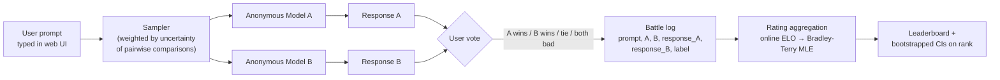
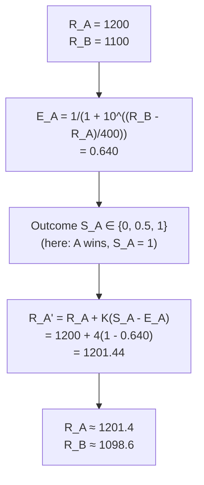
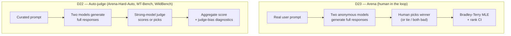

# Day 23 — Pairwise human preference at scale: Chatbot Arena, ELO, and Bradley-Terry

## The opening hook

D22 closed on a queasy observation: an LLM-as-judge is an automated scoring rule with systemic biases (self-preference, position, verbosity, bandwagon), and once a judge is the optimization target, those biases become Goodhart pressure. WildBench, MT-Bench, and Arena-Hard-Auto all live inside that frame — strong models scoring open-ended outputs, with the judge as the load-bearing piece.

Today's anchor inverts the substitution. **Chatbot Arena** keeps the *human* in the loop. Two anonymous models answer the same user prompt; the user picks a winner; many such votes are aggregated into a leaderboard via a paired-comparison statistical model (online ELO at launch, Bradley-Terry MLE since late 2023). The judge is not a model. The dataset is not pre-curated. The prompts are whatever real users typed into a public web UI.

That single methodological choice changes every downstream property of the evaluation. The cost goes up by orders of magnitude. The throughput goes down. The prompt distribution stops being a fixed test set and becomes a slowly-drifting window over user behaviour. The biases shift — judge biases vanish, but human-population biases (geography, language, expertise distribution) and adversarial biases (vote-stuffing, prompt-leakage that reveals identity) appear in their place. The relationship to D22 is not "Arena replaces auto-judges" — it is "Arena and Arena-Hard-Auto are two points on the human-vs-auto spectrum, and the right tool depends on whether you can afford the human." Arena-Hard-Auto is the *derivative* of Arena: an attempt to recover the open-prompt, pairwise-preference structure with a model judge after the human-preference data has already been collected.

This lesson teaches the human-in-the-loop side. It anchors on the original LMSYS paper (Chiang et al. 2024), works through the ELO update math and the Bradley-Terry MLE that replaced it, and closes by pointing at D24 — where reward models trained on Arena-style data inherit Arena's biases as a downstream calibration problem.

## Anchor: Chatbot Arena (Chiang et al. 2024)

**Citation.** Chiang, W.-L., Zheng, L., Sheng, Y., Angelopoulos, A. N., Li, T., Li, D., Zhang, H., Zhu, B., Jordan, M., Gonzalez, J. E., & Stoica, I. (2024). *Chatbot Arena: An Open Platform for Evaluating LLMs by Human Preference.* ICML 2024. arXiv:2403.04132. The author list is led by LMSYS / UC Berkeley with Stanford collaborators; Michael Jordan and Ion Stoica anchor the methodology and systems sides respectively.

As of the paper's January 2024 snapshot the platform had collected **~240,000 votes from ~90,000 users across 50+ models**. The 2026 number is much larger and drifts continuously — treat any current count as version-specific (the same drift discipline D7 advised for saturating capability benchmarks). The platform is hosted at `lmarena.ai` (renamed from `chat.lmsys.org`).

### Mechanics of an anonymous pairwise battle

The four-way label space is load-bearing. *A wins* and *B wins* are the standard pairwise outcomes; *tie* and *both bad* are needed because the prompt distribution includes items neither model handles well, and forcing a binary vote on those items would inject noise into the ratings. The Bradley-Terry fit folds ties into a half-credit outcome ($H = 0.5$); *both bad* is typically excluded from the rating computation. Model identities are revealed only after the vote — the *anonymous* property is what makes the rating signal a comparison of outputs rather than a comparison of brand recognition.

The sampler is also load-bearing. Random pairing across $M$ models gives $\binom{M}{2}$ pairs and quadratic vote requirements for tight CIs on every cell. The deployed sampler weights pair selection toward comparisons where the rating gap is small or the data is sparse — an *active sampling* policy that targets the highest-uncertainty cells of the pairwise win-rate matrix. The paper formalizes this as minimizing a $D$-optimal design objective; the practical effect is that newly added models converge to a stable rating in fewer votes than uniform sampling would require.

### From pairwise votes to a single-number rating: ELO

ELO (Arpad Elo, 1960; the chess rating system) is the simplest paired-comparison model and was Arena's launch-time aggregator. Each model holds a rating $R$. The *expected score* of model $a$ against model $b$ is

$$E_a = \frac{1}{1 + 10^{(R_b - R_a)/400}}$$

The constant 400 is a scale convention — a 400-point rating gap means a 10:1 expected-win ratio; a 200-point gap is roughly 76% expected win. After a battle with observed score $S_a \in \{0, 0.5, 1\}$ (loss / tie / win), the rating updates as

$$R_a' = R_a + K \cdot (S_a - E_a)$$

with $R_b$ symmetrically. The hyperparameter $K$ controls how aggressively a single battle moves the rating: large $K$ means new models converge fast but ratings are noisy; small $K$ means stability at the cost of slow convergence for new entrants. LMSYS's published implementation in the public Colab notebook uses **K = 4, SCALE = 400, INIT\_RATING = 1000** — every new model starts at 1000 and the first 100 votes against an established field can move it by at most 400 points. Chess uses $K \in [10, 40]$ depending on player class; Arena's much smaller $K$ reflects that the underlying "skill" (model identity) is fixed across battles and a single vote is therefore weaker evidence than a chess game.

Worked example. Suppose model A has rating 1200 and model B has rating 1100. The expected score for A is

$$E_A = \frac{1}{1 + 10^{(1100 - 1200)/400}} = \frac{1}{1 + 10^{-0.25}} = \frac{1}{1 + 0.5623} \approx 0.640$$

A wins. The update is $R_A' = 1200 + 4 \cdot (1 - 0.640) = 1200 + 1.44 \approx 1201.4$. B's update is $R_B' = 1100 + 4 \cdot (0 - 0.360) = 1100 - 1.44 \approx 1098.6$. One battle moves each rating by under 1.5 points; many thousands of battles are required for stable separation between similar-strength models.

### Why ELO was the wrong tool, and what replaced it

Online ELO has two properties that fit chess and misfit Arena. First, ELO is *order-dependent*: the rating after $N$ battles depends on the order the battles were processed (because each update conditions on the current rating estimate). For a chess player whose skill genuinely drifts over a career, that's a feature — recent games should weigh more. For a frozen LLM checkpoint whose "skill" is fixed, it's a bug: shuffling the same battle log produces different final ratings, and the variance from this artefact is non-trivial relative to the rating gaps Arena tries to resolve. Second, ELO has no built-in confidence interval — the public leaderboard at launch reported point estimates and used a bootstrap-over-shuffles trick (re-run online ELO on $B$ random permutations of the battle log) to produce error bars that papered over the order-dependence rather than actually quantifying battle-level sampling noise.

LMSYS migrated to a **Bradley-Terry (BT) MLE** in late 2023 (Chatbot Arena leaderboard update, December 2023) for exactly the reasons D5's statistical-hygiene framing predicts. Bradley-Terry (Bradley & Terry, 1952) is the maximum-likelihood paired-comparison model that ELO is a heuristic approximation of. It assumes a latent strength parameter $\xi_i$ for each model and models the probability that $a$ beats $b$ as

$$P(a \succ b) = \frac{1}{1 + e^{\xi_b - \xi_a}}$$

(equivalent to the ELO logistic with a different scale convention; the paper writes it in natural-log form, the leaderboard rescales to ELO-equivalent units by multiplying $\xi$ by $400 / \ln 10 \approx 173.7$ and adding the conventional 1000 offset for human readability). Given a battle log $\{(a_t, b_t, h_t)\}_{t=1}^{T}$ with $h_t = 1$ if $a_t$ won, $0$ if $b_t$ won, and $h_t = 0.5$ for ties, the MLE minimizes the binary cross-entropy

$$\hat\xi = \arg\min_\xi \sum_t \ell\!\left(h_t, \frac{1}{1 + e^{\xi_{b_t} - \xi_{a_t}}}\right) \quad \text{with} \quad \ell(h, p) = -h \log p - (1-h)\log(1-p)$$

This is a convex optimization (logistic regression with the model-identity indicators as features and the outcome as the target), order-independent, and has standard sandwich-robust standard errors that the leaderboard converts into chi-square confidence intervals on the rankings. The Chiang et al. paper proves that under their assumptions the BT estimator concentrates around the true latent strengths at the standard $1/\sqrt{T}$ rate, and it derives explicit CI widths for the *rank* of each model.

The methodological hierarchy from D5 — *report rank, not score, with a confidence interval, and prefer paired tests* — applies directly. The publicly displayed Arena leaderboard reports each model's rank with a 95% CI on the rank (e.g., "rank between 3 and 7"), not just a point ELO. Two models with overlapping rank intervals are "tied within the noise floor," which is more honest than a point-estimate ranking would be and is a direct application of D1's *ranking is more robust than scoring* principle.

### Tie handling and the half-credit convention

Ties in BT are handled by setting $h_t = 0.5$ — equivalent to splitting the battle into one half-win for each model. This is the *Rao-Kupper* extension's half-credit collapse rather than a separate tie-probability parameter; LMSYS uses it because the simpler model has fewer parameters, and the empirical fit is good enough on Arena's dataset. The cost is that "well-matched" pairs (frequent ties) and "both-bad" pairs (frequent ties for the wrong reason) collapse into the same signal — which is one motivation for filtering *both bad* out of the rating computation rather than treating it as a tie.

## Arena vs. auto-judging — the conceptual contrast with D22

Same outer pipeline; opposite trade-offs at the judge box.

| Axis | Arena (D23) | Auto-judge (D22) |
| --- | --- | --- |
| Judge | Crowdsourced human | Strong LLM (e.g., GPT-4-class) |
| Cost per battle | Free at the margin (volunteer); slow | Cheap; throughput scales with API |
| Prompt distribution | Real-user, drifting, multilingual, long-tail | Curated, fixed, English-skewed |
| Reproducibility | Low (human population, prompt drift) | High (re-run judge on same data) |
| Bias surface | Crowd demographics, language, expertise | Self-preference, position, verbosity |
| Bottleneck | Human throughput | Judge model quality + bias |
| Used for | Industry leaderboard, marketing, generalist comparison | Fast iteration, paper experiments, regression checks |

Crucially, neither dominates. Arena-Hard-Auto (covered on D22) was constructed as Arena's auto-judge derivative — its prompt set is sampled from real Arena traffic, and its purpose is to give a cheap, reproducible proxy for Arena ranks when a fresh round of human votes is too expensive to collect. It correlates well with Arena ranks at the top of the leaderboard but inherits the auto-judge biases D22 catalogued, which is why it is reported alongside Arena rather than as a substitute.

The right reading: human preference is the gold standard for "do users prefer this output?" because users are the ground truth for that question. Auto-judging is the cheap proxy — useful when the proxy's biases are characterized and the development loop needs to move faster than human votes can be collected.

## What Arena measures, and what it doesn't

Arena answers one question well: *given a prompt drawn from real-user traffic, which of two responses does a typical Arena voter prefer?* That question is what users care about, but it is not the same as several adjacent questions:

- **Capability.** Arena does not directly measure whether a model can solve hard math (D9), pass exec-based code (D11), or recall niche facts (D1). A high Arena rank reflects that *a typical user, faced with a typical prompt, picks this model's answer over alternatives* — which mostly rewards style, helpfulness, formatting, and willingness to engage. A model that is technically correct but terse can lose to one that is wrong but warm.
- **Truthfulness.** Arena voters often cannot verify factual claims, especially in technical domains. A confidently-stated wrong answer beats a hedged correct one in many votes — this is the imitative-falsehood failure mode named on D15 (TruthfulQA), now playing out in human votes rather than benchmark items.
- **Safety.** Arena's sampler does not over-weight harmful prompts, so high Arena rank is consistent with poor refusal calibration on the long tail. Policy-relevant safety claims need D19 (HarmBench), D20 (sycophancy), and D21 (WMDP) alongside Arena.

The reflex is the same one introduced on D5: *what does this number measure, and what is the next decision-relevant question it doesn't answer?* For Arena, the answer is that it is the most-watched leaderboard in the field for one specific question, and it is a single coordinate in a multi-axis safety case for any other.

### Goodhart sub-thread: rank-stuffing and prompt leakage

Arena is a public, high-stakes leaderboard, and it has the standard public-leaderboard pathologies. Two are worth naming so the rank-vs-score discipline (D1) lands.

First, *vote-stuffing*. Because individual votes are anonymous and the platform is open, an organized actor can submit votes biased toward a specific model to inflate its rating. Huang et al. 2025 (*Improving Your Model Ranking on Chatbot Arena by Vote Rigging*, arXiv:2501.17858) show empirically how cheap a meaningful rank shift is at the margins. LMSYS deploys countermeasures (rate limits, suspicious-pattern detection, removing biased votes from the rating computation) but the arms race is structural. The methodological response is the same one HELM uses (D5): *report ranks, not scores, with conservative CIs on the rank*. Rank with a CI is more robust than a point ELO, both to legitimate sampling noise and to adversarial vote injection.

Second, *prompt leakage / model self-identification*. Some models include identifying tokens in their outputs (e.g., "As an AI assistant by [vendor], I..."), which leaks the anonymous identity to the voter. This biases votes toward (or against) the recognized brand and is technically a violation of the *anonymous* condition the rating signal depends on. The deployed mitigation is detection-and-filtering of such votes, but the methodological lesson is that *the construction guarantee that makes the eval valid is fragile*, and that fragility is the same shape as D17's situational-awareness concern: a model that knows it is being evaluated can condition on that fact, and a model that knows it is *being voted on anonymously* can violate the anonymity by name-dropping itself. The two failure modes are the same Goodhart pattern in different clothes.

The "Leaderboard Illusion" critique (Singh et al. 2025, arXiv:2504.20879) extends this further, arguing that frontier-lab strategies of submitting many private model variants to Arena to identify the best one before public release converts Arena from a measurement instrument into a model-selection oracle — Goodhart on the *meta-level* of how labs use the leaderboard, not just how individual models score on it.

## Frontier scores and the drift caveat

As of the original 2024 paper, frontier-class models (then GPT-4-Turbo, Claude-3 Opus, Gemini Pro) clustered in the 1200–1280 ELO range with rank CIs of ±2–3 positions. As of early 2026 the cluster of top-rated models has shifted upward (the *whole* distribution shifts when stronger models enter, because BT is identifiable only up to an additive constant and the leaderboard renormalizes), and the rankings churn release-to-release. Treat any quoted current ELO as version-specific. The methodologically defensible cite is the *gap structure* — top-tier models cluster within a few rank positions of each other; the gap to mid-tier (instruction-tuned 7B–13B open-weight models) is much larger; the gap to base / poorly-tuned models is enormous — rather than any specific point estimate. This is the same drift discipline D7 advised for saturating capability benchmarks: cite the ranks and the structure, not the headline number.

## Forward pointer: D24 (RewardBench)

Reward models — the scoring functions inside RLHF pipelines — are typically trained on Arena-style preference data. That means *Arena's biases compose into reward-model biases*: a reward model trained on Arena votes will learn to reward whatever Arena voters reward, including the style-over-substance pattern, the verbosity preference, the truthfulness-blind preference, and any residual brand or formatting biases that survived the anonymity guarantee. D24 introduces RewardBench (Lambert et al. 2024) as the systematic eval of reward models, and the calibration-thread reprise (D2 → D15 → D20 → **D24**) closes there: a reward model's confidence is itself a calibration story, and a reward model trained on Arena inherits Arena's preference structure as a downstream calibration problem.

The composition is the lesson. Arena → preference dataset → reward model → fine-tuned model → next-generation Arena votes. The loop is closed. If Arena's biases are not characterized, they propagate around the loop.

> **Safety researcher's note.** Arena is the field's best answer to "what do users actually prefer?" and its worst answer to "is this model safe to deploy?" — and the gap between those two questions is the entire reason Week 3 existed. A model that wins Arena votes is, by construction, the model that produces outputs a population of typical users find more pleasant, useful, or convincing than alternatives. None of those properties are safety properties. Some are anti-safety properties: confident, fluent, plausible-sounding wrong answers tend to win against hedged correct ones (the imitative-falsehood failure from D15), and warm, agreeable, low-friction responses tend to win against blunt, refusal-heavy ones (the sycophancy failure from D20). When you read an Arena rank as part of a safety case, the question is never "did this model rank high?" but "did this model rank high *and* hold position on D15/TruthfulQA, D18/IFEval, D19/HarmBench, D20/sycophancy, and D21/WMDP?" Arena is one coordinate, not a verdict — the same framing D21 used for WMDP, applied in the opposite direction (Arena measures user preference; WMDP measures latent risk; both compose into the deployment decision rather than substituting for it).

## Takeaways

1. Chatbot Arena (Chiang et al. 2024, arXiv:2403.04132) is a crowdsourced pairwise-preference platform: anonymous side-by-side battles, ~240K votes / ~90K users / 50+ models at paper time, ranked by a paired-comparison statistical model.
2. The original aggregator was online ELO with $E_a = 1/(1 + 10^{(R_b - R_a)/400})$ and update $R_a' = R_a + K(S_a - E_a)$, using $K=4$, SCALE=400, INIT\_RATING=1000 in LMSYS's public implementation. ELO is order-dependent and lacks principled CIs, which is why LMSYS migrated to Bradley-Terry MLE in late 2023.
3. Bradley-Terry MLE is the convex paired-comparison fit that ELO heuristically approximates: $P(a \succ b) = 1/(1 + e^{\xi_b - \xi_a})$, fitted by minimizing binary cross-entropy across the battle log. It is order-independent and admits standard sandwich-robust CIs on rankings.
4. Arena reports **ranks with confidence intervals** rather than raw ELOs as the headline output — a direct application of D1's "ranking is more robust than scoring" and D5's "a score without an interval is not a measurement."
5. Arena is the *human* point on the human-vs-auto-judge spectrum; Arena-Hard-Auto (D22) is the auto-judge derivative built from Arena prompts and used as a cheap reproducible proxy. Neither replaces the other.
6. Arena measures "what do typical users prefer?" — which mostly rewards style, helpfulness, and confidence-of-presentation. It does not measure capability (Weeks 1–2), truthfulness (D15), or safety (D17–D21). Compose, don't substitute.
7. Goodhart sub-thread: vote-stuffing and prompt-leakage / self-identification are real attack surfaces. The rank-with-CI reporting discipline is the structural defense; the methodological lesson is that the *anonymity* construction guarantee is fragile in the same shape as D17's situational-awareness concern.
8. Forward to D24: reward models trained on Arena-style preference data inherit Arena's biases. The calibration thread closes there.

## References

- **Anchor.** Chiang, W.-L., Zheng, L., Sheng, Y., Angelopoulos, A. N., Li, T., Li, D., Zhang, H., Zhu, B., Jordan, M., Gonzalez, J. E., & Stoica, I. (2024). *Chatbot Arena: An Open Platform for Evaluating LLMs by Human Preference.* ICML 2024. arXiv:2403.04132. https://arxiv.org/abs/2403.04132
- **Live leaderboard.** LMSYS / lmarena.ai. *Chatbot Arena LLM Leaderboard.* https://lmarena.ai/
- **Launch post.** LMSYS. *Chatbot Arena: Benchmarking LLMs in the Wild with Elo Ratings.* May 2023. https://lmsys.org/blog/2023-05-03-arena/
- **ELO → Bradley-Terry migration.** LMSYS. *Chatbot Arena: New models & Elo system update.* December 2023. https://lmsys.org/blog/2023-12-07-leaderboard/
- **Public Colab — rating computation.** LMSYS. *Chatbot Arena Leaderboard Calculation (Bradley-Terry model).* https://colab.research.google.com/drive/1KdwokPjirkTmpO_P1WByFNFiqxWQquwH (source for K=4, SCALE=400, INIT\_RATING=1000)
- **Bradley-Terry original.** Bradley, R. A., & Terry, M. E. (1952). *Rank Analysis of Incomplete Block Designs: The Method of Paired Comparisons.* Biometrika 39(3/4), 324–345.
- **ELO original.** Elo, A. (1978). *The Rating of Chessplayers, Past and Present.* Arco Publishing. (Original system 1960; the 400-point / 10:1-ratio convention dates from this work.)
- **Vote rigging.** Huang, R., et al. (2025). *Improving Your Model Ranking on Chatbot Arena by Vote Rigging.* arXiv:2501.17858. https://arxiv.org/abs/2501.17858
- **Leaderboard meta-critique.** Singh, S., et al. (2025). *The Leaderboard Illusion.* arXiv:2504.20879. https://arxiv.org/abs/2504.20879
- **Forward — D22 LLM-as-judge.** Lin, B. Y., et al. (2024). *WildBench.* (Plus Zheng et al. 2023 *MT-Bench / LLM-as-a-Judge* and Li et al. 2024 *From Live Data to High-Quality Benchmarks: The Arena-Hard Pipeline* — covered on D22.)
- **Forward — D24 RewardBench.** Lambert, N., et al. (2024). *RewardBench: Evaluating Reward Models for Language Modeling.* arXiv:2403.13787.

## Quiz

**Q1.** Two models on Chatbot Arena have ratings $R_A = 1300$ and $R_B = 1100$. Using the standard ELO expected-score formula with scale 400, what is $E_A$, the expected score for A?

- A. 0.500
- B. 0.640
- C. 0.760
- D. 0.909

**Q2.** Continuing Q1: A wins the battle ($S_A = 1$). Under LMSYS's published parameters ($K = 4$, scale 400), what is A's updated rating?

- A. 1300.96
- B. 1301.44
- C. 1304.00
- D. 1316.00

**Q3.** Why did LMSYS migrate Chatbot Arena's headline aggregator from online ELO to Bradley-Terry MLE in late 2023?

- A. Bradley-Terry produces higher rating numbers, which look better in marketing.
- B. ELO updates are order-dependent and lack principled confidence intervals; Bradley-Terry MLE is a convex, order-independent fit that admits standard sandwich-robust CIs on the rankings, which fits Arena's "frozen-checkpoint" setting better than ELO's "drifting-skill" assumption.
- C. ELO cannot handle ties, while Bradley-Terry can.
- D. Bradley-Terry is faster to compute on large battle logs.

**Q4.** Which of the following best captures the conceptual contrast between Chatbot Arena (D23) and the LLM-as-judge frameworks of D22 (WildBench, MT-Bench, Arena-Hard-Auto)?

- A. Arena uses ELO and the auto-judge frameworks use Bradley-Terry; the difference is purely statistical.
- B. The auto-judge frameworks replace Arena because human preference is too noisy to be useful.
- C. Arena keeps a *human* in the judge position with the cost-and-throughput trade-offs that implies; the auto-judge frameworks replace the human with a strong LLM, gaining throughput and reproducibility at the cost of judge biases (self-preference, position, verbosity); Arena-Hard-Auto in particular is the auto-judge *derivative* of Arena, not a substitute.
- D. Arena and the auto-judge frameworks use different prompts, but the methodology is otherwise identical.

**Q5.** A frontier-model release report cites "Arena ELO 1287, rank 4." Which interpretation is **most consistent** with this lesson's framing?

- A. The model is the 4th-best model on every dimension; rank 4 is a verdict.
- B. The headline rank is one coordinate. Without (i) a confidence interval on the rank, (ii) the size of the cluster the model sits in, and (iii) composition with capability evals (Week 1–2), truthfulness (D15), and safety (D17–D21), the number is a marketing artefact rather than a deployment-ready safety signal. Arena rewards user-preferred style; it does not measure correctness or safety.
- C. Arena ELO of 1287 means the model wins ~64% of battles against a 1000-rated baseline; nothing else can be inferred.
- D. Rank 4 implies the model is unsafe to deploy.

**Q6.** Which property of Arena's design makes the rank signal *fragile* in a Goodhart-relevant way, and what is the structural defense?

- A. Property: ELO ratings are unbounded above, so models can be optimized indefinitely. Defense: cap ratings at 2000.
- B. Property: anonymity is required for the rating signal to be valid, but it can be violated by vote-stuffing or by models that name-drop themselves in outputs (a form of model self-identification that compromises the anonymous condition); both attacks are documented in the literature. Defense: report ranks with conservative confidence intervals (rather than point ELOs), filter suspicious votes from the rating computation, and treat Arena rank as one coordinate in a multi-axis safety case rather than a verdict.
- C. Property: Bradley-Terry MLE is non-convex, so the optimization can be gamed by adversarial battle logs. Defense: switch back to online ELO.
- D. Property: ties are handled with the half-credit convention, which biases the ranking toward middle-rated models. Defense: drop ties from the dataset entirely.

Answers

1. **C** — $E_A = 1 / (1 + 10^{(1100 - 1300)/400}) = 1 / (1 + 10^{-0.5}) = 1 / (1 + 0.3162) \approx 0.760$. (B is the value for a 100-point gap, not a 200-point gap; A is the equal-rating case; D is the value for a roughly 400-point gap.)
2. **A** — $R_A' = R_A + K(S_A - E_A) = 1300 + 4(1 - 0.760) = 1300 + 4 \cdot 0.240 = 1300 + 0.96 = 1300.96$. The small magnitude of the update (under 1 point) reflects the deliberately conservative $K = 4$ that LMSYS uses to keep ratings stable across battles; in chess, $K \in [10, 40]$ would produce updates of several points per game.
3. **B** — ELO's order-dependence is the structural mismatch with Arena's frozen-checkpoint setting (the underlying "skill" is fixed across battles, so the order in which you process the battle log shouldn't matter, but for ELO it does). Bradley-Terry is a convex MLE that is order-independent and admits standard CIs, fitting Arena's setting properly. (A and D are wrong on substance; C is wrong because both models can handle ties.)
4. **C** — Arena keeps the human in the judge position; D22's frameworks replace the human with a strong LLM. Arena-Hard-Auto is the auto-judge derivative of Arena (its prompts are sampled from Arena traffic and its purpose is to be a cheap reproducible proxy for Arena ranks), not a substitute. The trade-offs (cost, reproducibility, biases) flow from this difference.
5. **B** — Arena measures user preference, which rewards style, helpfulness, and confidence-of-presentation. It does not measure correctness, truthfulness, or safety. A safety-relevant deployment decision needs Arena rank *plus* the capability and safety axes the rest of the curriculum names — Arena rank is a coordinate, not a verdict, in the same shape D21 framed WMDP.
6. **B** — anonymity is the construction guarantee that makes Arena's rating signal a comparison of *outputs* rather than of brand recognition. Both vote-stuffing (Huang et al. 2025) and self-identification (models leaking identifying tokens, the "Leaderboard Illusion" submission strategies) violate that guarantee in different ways, and both are real attack surfaces in the deployed system. The rank-with-CI reporting discipline plus suspicious-vote filtering plus *don't read Arena rank as a single-number verdict* is the structural defense, and it is the same multi-axis composition framing D21 used for WMDP applied to user-preference rather than dangerous-capability.

