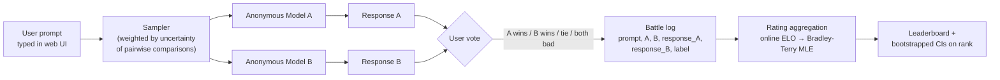
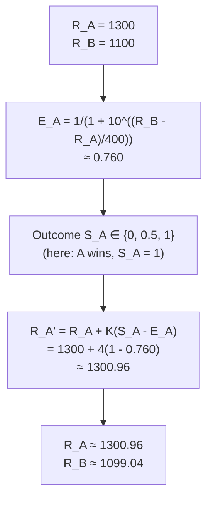
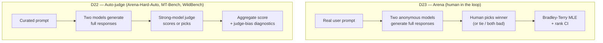

# Day 23 — Pairwise human preference at scale: Chatbot Arena, ELO, and Bradley-Terry

## TL;DR

Chatbot Arena (Chiang et al. 2024) keeps the *human* in the judge box: anonymous side-by-side battles between two models, a four-way user vote (A wins / B wins / tie / both bad), and a paired-comparison aggregator on the other end. The aggregator was online ELO at launch and migrated to a Bradley-Terry MLE in late 2023 because ELO is order-dependent and lacks principled CIs while BT is a convex MLE with standard CIs on rank. The headline output is rank-with-CI rather than raw ELO — a direct application of [D-5](/lesson/5)'s "score without an interval is not a measurement" — and Arena is the human counterpart to [D-22](/lesson/22)'s auto-judges, not a substitute.

## Learning objectives

By the end of this lesson, you will be able to:

1. **(L2)** State Arena's setup (anonymous side-by-side battles, four-way label, active-sampling pair selection) and LMSYS's published ELO parameters ($K = 4$, SCALE = 400, INIT_RATING = 1000).
2. **(L3)** *Apply* the ELO expected-score and update formulas to a worked rating pair, computing $E_A$ and the post-battle ratings.
3. **(L4)** *Analyze* why ELO's order-dependence misfits Arena's frozen-checkpoint setting and how Bradley-Terry MLE resolves it via convex optimisation and standard CIs on rank.
4. **(L4)** Decompose the contrast between Arena ([D-23](/lesson/23)) and the LLM-as-judge frameworks of [D-22](/lesson/22) along cost, reproducibility, prompt-distribution, and bias-surface axes.
5. **(L5)** *Evaluate* a model-card claim of "Arena rank N" and identify the load-bearing follow-up questions (rank CI, cluster size, composition with capability and safety axes).
6. **(L4)** Frame anonymity as the fragile construction guarantee Arena's rating signal depends on, and explain how vote-stuffing and self-identification violate it.

## Prerequisites & callback

[D-5](/lesson/5) (statistical hygiene) is the load-bearing methodological prerequisite: every move Arena makes — rank with a CI rather than raw ELO, BT MLE rather than online ELO, bootstrapped rank intervals rather than point estimates — is a direct application of [D-5](/lesson/5)'s *report rank, not score, with a confidence interval, and prefer paired tests*. Treat the BT migration as the canonical worked example of [D-5](/lesson/5)'s principles applied to a high-stakes public leaderboard.

[D-22](/lesson/22) (LLM-as-a-judge) is the structural counterpart. [D-22](/lesson/22)'s WildBench, MT-Bench, and Arena-Hard-Auto remove the human from the judge box and substitute a strong LLM. [D-23](/lesson/23) is the same outer pipeline (prompt → two responses → judge → aggregation) with the *human* kept in. The two are points on a single human-vs-auto spectrum — Arena-Hard-Auto is the auto-judge derivative of Arena, sampled from real Arena traffic to be a cheap reproducible proxy, not a replacement. Reading [D-23](/lesson/23) against [D-22](/lesson/22) is the load-bearing move; both are prerequisite.

## The opening hook

[D-22](/lesson/22) closed on a queasy observation: an LLM-as-judge is an automated scoring rule with systemic biases (self-preference, position, verbosity, bandwagon), and once a judge is the optimisation target, those biases become Goodhart pressure. WildBench, MT-Bench, and Arena-Hard-Auto all live inside that frame — strong models scoring open-ended outputs, with the judge as the load-bearing piece.

Today's anchor inverts the substitution. **Chatbot Arena** keeps the *human* in the loop. Two anonymous models answer the same user prompt; the user picks a winner; many such votes are aggregated into a leaderboard via a paired-comparison statistical model (online ELO at launch, Bradley-Terry MLE since late 2023). The judge is not a model. The dataset is not pre-curated. The prompts are whatever real users typed into a public web UI.

That single methodological choice changes every downstream property. Cost rises by orders of magnitude. Throughput drops. The prompt distribution stops being a fixed test set and becomes a slowly-drifting window over user behaviour. The biases shift — judge biases vanish, but human-population biases (geography, language, expertise distribution) and adversarial biases (vote-stuffing, prompt-leakage that reveals identity) appear in their place. The relationship to [D-22](/lesson/22) is not "Arena replaces auto-judges" — it is "Arena and Arena-Hard-Auto are two points on the human-vs-auto spectrum, and the right tool depends on whether you can afford the human." Arena-Hard-Auto is the *derivative* of Arena: an attempt to recover the open-prompt, pairwise-preference structure with a model judge after the human-preference data has already been collected.

## Anchor: Chatbot Arena (Chiang et al. 2024)

**Citation.** Chiang, W.-L., Zheng, L., Sheng, Y., Angelopoulos, A. N., Li, T., Li, D., Zhang, H., Zhu, B., Jordan, M., Gonzalez, J. E., & Stoica, I. (2024). *Chatbot Arena: An Open Platform for Evaluating LLMs by Human Preference.* ICML 2024. arXiv:2403.04132.

As of the paper's January 2024 snapshot the platform had collected **~240,000 votes from ~90,000 users across 50+ models**. The 2026 number is much larger and drifts continuously — treat any current count as version-specific (the same drift discipline [D-7](/lesson/7) advised for saturating capability benchmarks). The platform is hosted at `lmarena.ai` (renamed from `chat.lmsys.org`).

### Mechanics of an anonymous pairwise battle



The four-way label space is load-bearing. *A wins* and *B wins* are the standard pairwise outcomes; *tie* and *both bad* are needed because the prompt distribution includes items neither model handles well, and forcing a binary vote on those items would inject noise into the ratings. The Bradley-Terry fit folds ties into a half-credit outcome ($H = 0.5$); *both bad* is typically excluded from the rating computation. Model identities are revealed only after the vote — the *anonymous* property is what makes the rating signal a comparison of outputs rather than a comparison of brand recognition.

### Example item

A single Arena battle is the unit of data: one user prompt, two anonymized model responses, one vote label. A representative battle-log entry, shaped like a row from the public conv-log release (Zheng et al. 2023, `lmsys-chat-1m` schema):

```json
{
  "question_id": "e3b41ad7",
  "prompt": "Explain the difference between TCP and UDP in two sentences.",
  "model_a": "vicuna-13b-v1.3",
  "model_b": "gpt-3.5-turbo-0301",
  "response_a": "TCP is connection-oriented and guarantees ordered, reliable delivery via handshakes and retransmissions; UDP is connectionless and fires datagrams without delivery guarantees, trading reliability for lower latency.",
  "response_b": "TCP makes sure all packets arrive in order, while UDP just sends packets without checking.",
  "winner": "model_a",
  "judge": "arena_user",
  "turn": 1,
  "language": "English"
}
```

The `winner` field is the four-way label collapsed to its rating-affecting form: `model_a`, `model_b`, or `tie` (with `tie (bothbad)` excluded from BT fitting). The identities are stored *only* in the battle log; the user saw `Model A` and `Model B` and voted blind.

The sampler is also load-bearing. Random pairing across $M$ models gives $\binom{M}{2}$ pairs and quadratic vote requirements for tight CIs on every cell. The deployed sampler weights pair selection toward comparisons where the rating gap is small or the data is sparse — an *active sampling* policy that targets the highest-uncertainty cells of the pairwise win-rate matrix. The paper formalises this as minimising a $D$-optimal design objective; the practical effect is that newly added models converge to a stable rating in fewer votes than uniform sampling would require.

### From pairwise votes to a single-number rating: ELO

ELO (Arpad Elo, 1960; the chess rating system) is the simplest paired-comparison model and was Arena's launch-time aggregator. Each model holds a rating $R$. The *expected score* of model $a$ against model $b$ is

$$E_a = \frac{1}{1 + 10^{(R_b - R_a)/400}}$$

The constant 400 is a scale convention — a 400-point rating gap means a 10:1 expected-win ratio; a 200-point gap is roughly 76% expected win. After a battle with observed score $S_a \in \{0, 0.5, 1\}$ (loss / tie / win), the rating updates as

$$R_a' = R_a + K \cdot (S_a - E_a)$$

with $R_b$ symmetrically. The hyperparameter $K$ controls how aggressively a single battle moves the rating: large $K$ means new models converge fast but ratings are noisy; small $K$ means stability at the cost of slow convergence for new entrants. LMSYS's published implementation in the public Colab notebook uses **$K = 4$, SCALE = 400, INIT_RATING = 1000** — every new model starts at 1000 and the first 100 votes against an established field can move it by at most 400 points. Chess uses $K \in [10, 40]$ depending on player class; Arena's much smaller $K$ reflects that the underlying "skill" (model identity) is fixed across battles and a single vote is therefore weaker evidence than a chess game.

> **Worked example.** Two models on Arena have ratings $R_A = 1300$ and $R_B = 1100$ (a 200-point gap). A wins one battle ($S_A = 1$) under LMSYS parameters ($K = 4$, SCALE = 400).
>
> Expected score for A:
>
> $$E_A = \frac{1}{1 + 10^{(R_B - R_A)/400}} = \frac{1}{1 + 10^{(1100 - 1300)/400}} = \frac{1}{1 + 10^{-0.5}} = \frac{1}{1 + 0.3162} \approx 0.760.$$
>
> ELO update for A:
>
> $$R_A' = R_A + K(S_A - E_A) = 1300 + 4 \cdot (1 - 0.760) = 1300 + 4 \cdot 0.240 = 1300 + 0.96 \approx 1300.96.$$
>
> Symmetrically, $R_B' = 1100 + 4 \cdot (0 - 0.240) = 1100 - 0.96 \approx 1099.04$. The whole battle moves each rating by under 1 point — the deliberately conservative $K = 4$ is what keeps individual battles from shaking the leaderboard, at the cost of requiring thousands of battles for stable separation between similar-strength models.



## ⏵ Check yourself — ELO at parity

Two models on Arena both currently sit at $R = 1500$ (no rating gap). A wins a single battle under LMSYS parameters ($K = 4$). **Compute** $E_A$ and the post-battle rating $R_A'$, and explain why a "rating change per battle" intuition imported from chess (where $K \in [10, 40]$) overstates how fast Arena ratings move.

<details>
<summary>Show answer</summary>

At parity, $E_A = 1/(1 + 10^0) = 1/2 = 0.5$. The update is $R_A' = 1500 + 4 \cdot (1 - 0.5) = 1500 + 2 = 1502$. A single battle at parity moves the winner by 2 points and the loser by 2 points symmetrically. Under chess's $K = 32$ the same parity-battle move would be 16 points. Arena's $K = 4$ is roughly an order of magnitude smaller because the underlying "skill" (model identity at a fixed checkpoint) is fixed across battles, so each vote is weaker evidence than a chess game between players whose form genuinely fluctuates. The trade-off is that resolving small rating gaps between similar-strength models requires thousands of battles, which is exactly why Arena's active sampler targets the highest-uncertainty cells of the win-rate matrix.

</details>

### Why ELO was the wrong tool, and what replaced it

Online ELO has two properties that fit chess and misfit Arena. First, ELO is *order-dependent*: the rating after $N$ battles depends on the order the battles were processed, because each update conditions on the current rating estimate. For a chess player whose skill genuinely drifts over a career, that's a feature — recent games should weigh more. For a frozen LLM checkpoint whose "skill" is fixed, it's a bug: shuffling the same battle log produces different final ratings, and the variance from this artefact is non-trivial relative to the rating gaps Arena tries to resolve. Second, ELO has no built-in confidence interval — the public leaderboard at launch reported point estimates and used a bootstrap-over-shuffles trick (re-run online ELO on $B$ random permutations of the battle log) to produce error bars that papered over the order-dependence rather than actually quantifying battle-level sampling noise.

LMSYS migrated to a **Bradley-Terry (BT) MLE** in late 2023 (Chatbot Arena leaderboard update, December 2023) for exactly the reasons [D-5](/lesson/5)'s statistical-hygiene framing predicts. Bradley-Terry (Bradley & Terry, 1952) is the maximum-likelihood paired-comparison model that ELO is a heuristic approximation of. It assumes a latent strength parameter $\xi_i$ for each model and models the probability that $a$ beats $b$ as

$$P(a \succ b) = \frac{1}{1 + e^{\xi_b - \xi_a}}$$

(equivalent to the ELO logistic with a different scale convention; the paper writes it in natural-log form, the leaderboard rescales to ELO-equivalent units by multiplying $\xi$ by $400 / \ln 10 \approx 173.7$ and adding the conventional 1000 offset for human readability). Given a battle log $\{(a_t, b_t, h_t)\}_{t=1}^{T}$ with $h_t = 1$ if $a_t$ won, $0$ if $b_t$ won, and $h_t = 0.5$ for ties, the MLE minimises the binary cross-entropy

$$\hat\xi = \arg\min_\xi \sum_t \ell\!\left(h_t, \frac{1}{1 + e^{\xi_{b_t} - \xi_{a_t}}}\right) \quad \text{with} \quad \ell(h, p) = -h \log p - (1-h)\log(1-p).$$

This is a convex optimisation (logistic regression with the model-identity indicators as features and the outcome as the target), order-independent, and has standard sandwich-robust standard errors that the leaderboard converts into chi-square confidence intervals on the rankings. The Chiang et al. paper proves that under their assumptions the BT estimator concentrates around the true latent strengths at the standard $1/\sqrt{T}$ rate, and it derives explicit CI widths for the *rank* of each model.

The methodological hierarchy from [D-5](/lesson/5) — *report rank, not score, with a confidence interval, and prefer paired tests* — applies directly. The publicly displayed Arena leaderboard reports each model's rank with a 95% CI on the rank (e.g., "rank between 3 and 7"), not just a point ELO. Two models with overlapping rank intervals are "tied within the noise floor," which is more honest than a point-estimate ranking would be and is a direct application of [D-1](/lesson/1)'s *ranking is more robust than scoring* principle.

## ⏵ Check yourself — order-independence

Suppose you take Arena's full battle log and shuffle the battle ordering uniformly at random before re-running the aggregator. **Decompose** what happens to the resulting rating estimates under (a) online ELO and (b) Bradley-Terry MLE, and identify which of the two outcomes is the *load-bearing* reason LMSYS migrated.

<details>
<summary>Show answer</summary>

(a) Online ELO produces *different* final ratings on each shuffle, because each update conditions on the current rating estimate and that estimate evolves through the log. The empirical variance across shuffles of the original Arena log was non-trivial relative to frontier-tier rating gaps — large enough that "Model A is rated 1280 and Model B is rated 1273" could flip between shuffles. (b) Bradley-Terry MLE is *order-independent* by construction: the loss function is a sum over battles, addition is commutative, and the convex optimum is the same regardless of the order the terms are summed in. Both shuffles produce identical $\hat\xi$.

The load-bearing reason is (a): the order-dependence is a *property of the estimator*, not a property of the data, so any rating gap small enough to flip under shuffling cannot be claimed as a real ordering. BT MLE removes the artefact entirely. The lack of principled CIs is a closely related second reason — bootstrapping over shuffles was the launch-era workaround, and BT's standard sandwich-robust errors are the principled replacement — but it is downstream of the order-dependence problem.

</details>

### Tie handling and the half-credit convention

Ties in BT are handled by setting $h_t = 0.5$ — equivalent to splitting the battle into one half-win for each model. This is the *Rao-Kupper* extension's half-credit collapse rather than a separate tie-probability parameter; LMSYS uses it because the simpler model has fewer parameters, and the empirical fit is good enough on Arena's dataset. The cost is that "well-matched" pairs (frequent ties) and "both-bad" pairs (frequent ties for the wrong reason) collapse into the same signal — which is one motivation for filtering *both bad* out of the rating computation rather than treating it as a tie.

## Arena vs. auto-judging — the conceptual contrast with [D-22](/lesson/22)



Same outer pipeline; opposite trade-offs at the judge box.

| Axis | Arena ([D-23](/lesson/23)) | Auto-judge ([D-22](/lesson/22)) |
| --- | --- | --- |
| Judge | Crowdsourced human | Strong LLM (e.g., GPT-4-class) |
| Cost per battle | Free at the margin (volunteer); slow | Cheap; throughput scales with API |
| Prompt distribution | Real-user, drifting, multilingual, long-tail | Curated, fixed, English-skewed |
| Reproducibility | Low (human population, prompt drift) | High (re-run judge on same data) |
| Bias surface | Crowd demographics, language, expertise | Self-preference, position, verbosity |
| Bottleneck | Human throughput | Judge model quality + bias |
| Used for | Industry leaderboard, marketing, generalist comparison | Fast iteration, paper experiments, regression checks |

Crucially, neither dominates. Arena-Hard-Auto (covered on [D-22](/lesson/22)) was constructed as Arena's auto-judge derivative — its prompt set is sampled from real Arena traffic, and its purpose is to give a cheap, reproducible proxy for Arena ranks when a fresh round of human votes is too expensive to collect. It correlates well with Arena ranks at the top of the leaderboard but inherits the auto-judge biases [D-22](/lesson/22) catalogued, which is why it is reported alongside Arena rather than as a substitute.

The right reading: human preference is the gold standard for "do users prefer this output?" because users are the ground truth for that question. Auto-judging is the cheap proxy — useful when the proxy's biases are characterised and the development loop needs to move faster than human votes can be collected.

## What Arena measures, and what it doesn't

Arena answers one question well: *given a prompt drawn from real-user traffic, which of two responses does a typical Arena voter prefer?* That question is what users care about, but it is not the same as several adjacent questions:

- **Capability.** Arena does not directly measure whether a model can solve hard math ([D-9](/lesson/9)), pass exec-based code ([D-11](/lesson/11)), or recall niche facts ([D-1](/lesson/1)). A high Arena rank reflects that *a typical user, faced with a typical prompt, picks this model's answer over alternatives* — which mostly rewards style, helpfulness, formatting, and willingness to engage. A model that is technically correct but terse can lose to one that is wrong but warm.
- **Truthfulness.** Arena voters often cannot verify factual claims, especially in technical domains. A confidently-stated wrong answer beats a hedged correct one in many votes — this is the imitative-falsehood failure mode named on [D-15](/lesson/15) (TruthfulQA), now playing out in human votes rather than benchmark items.
- **Safety.** Arena's sampler does not over-weight harmful prompts, so high Arena rank is consistent with poor refusal calibration on the long tail. Policy-relevant safety claims need [D-19](/lesson/19) (HarmBench), [D-20](/lesson/20) (sycophancy), and [D-21](/lesson/21) (WMDP) alongside Arena.

The reflex is the same one introduced on [D-5](/lesson/5): *what does this number measure, and what is the next decision-relevant question it doesn't answer?* For Arena, the answer is that it is the most-watched leaderboard in the field for one specific question, and it is a single coordinate in a multi-axis safety case for any other.

### Rank-stuffing and prompt leakage

Arena is a public, high-stakes leaderboard, and it has the standard public-leaderboard pathologies. Two are worth naming so the rank-vs-score discipline ([D-1](/lesson/1)) lands.

First, *vote-stuffing*. Because individual votes are anonymous and the platform is open, an organised actor can submit votes biased toward a specific model to inflate its rating. Huang et al. 2025 (*Improving Your Model Ranking on Chatbot Arena by Vote Rigging*, arXiv:2501.17858) show empirically how cheap a meaningful rank shift is at the margins. LMSYS deploys countermeasures (rate limits, suspicious-pattern detection, removing biased votes from the rating computation) but the arms race is structural. The methodological response is the same one HELM uses ([D-5](/lesson/5)): *report ranks, not scores, with conservative CIs on the rank*. Rank with a CI is more robust than a point ELO, both to legitimate sampling noise and to adversarial vote injection.

Second, *prompt leakage / model self-identification*. Some models include identifying tokens in their outputs (e.g., "As an AI assistant by [vendor], I..."), which leaks the anonymous identity to the voter. This biases votes toward (or against) the recognised brand and is technically a violation of the *anonymous* condition the rating signal depends on. The deployed mitigation is detection-and-filtering of such votes, but the methodological lesson is that *the construction guarantee that makes the eval valid is fragile*, and that fragility is the same shape as [D-17](/lesson/17)'s situational-awareness concern: a model that knows it is being evaluated can condition on that fact, and a model that knows it is *being voted on anonymously* can violate the anonymity by name-dropping itself.

The "Leaderboard Illusion" critique (Singh et al. 2025, arXiv:2504.20879) extends this further, arguing that frontier-lab strategies of submitting many private model variants to Arena to identify the best one before public release converts Arena from a measurement instrument into a model-selection oracle — a *meta-level* decoupling of how labs use the leaderboard, not just how individual models score on it.

## Frontier scores and the drift caveat

As of the original 2024 paper, frontier-class models (then GPT-4-Turbo, Claude-3 Opus, Gemini Pro) clustered in the 1200–1280 ELO range with rank CIs of ±2–3 positions. As of early 2026 the cluster of top-rated models has shifted upward (the *whole* distribution shifts when stronger models enter, because BT is identifiable only up to an additive constant and the leaderboard renormalises), and the rankings churn release-to-release. Treat any quoted current ELO as version-specific. The methodologically defensible cite is the *gap structure* — top-tier models cluster within a few rank positions of each other; the gap to mid-tier (instruction-tuned 7B–13B open-weight models) is much larger; the gap to base / poorly-tuned models is enormous — rather than any specific point estimate. This is the same drift discipline [D-7](/lesson/7) advised for saturating capability benchmarks: cite the ranks and the structure, not the headline number.

## ⏵ Check yourself — reading a leaderboard claim

A frontier model release report cites a single line: "Arena ELO 1287, rank 4." **Evaluate** what is missing for this number to function as evidence in a deployment decision, and identify the most-defensible *next* question to ask.

<details>
<summary>Show answer</summary>

The headline omits at least three pieces. (1) The **CI on the rank**: rank 4 with CI [3, 7] is a tight cluster claim; rank 4 with CI [3, 12] is an "indistinguishable from the middle of the leaderboard" claim. (2) The **cluster structure**: how many models share the rank-4 confidence interval, and what the rating gaps to the next cluster look like. Frontier-tier models routinely cluster within a few positions of each other, so rank 4 inside a 6-model cluster carries different information than rank 4 with clear separation. (3) The **composition with capability and safety axes**: Arena measures user preference, not correctness or safety, so a rank-4 Arena claim carries no information about [D-9](/lesson/9) / [D-11](/lesson/11) / [D-15](/lesson/15) / [D-19](/lesson/19) / [D-20](/lesson/20) / [D-21](/lesson/21) performance.

The most-defensible next question is some version of *"what is the rank CI, and how does this model perform on the safety and capability axes the rest of my deployment decision turns on?"* — exactly the multi-axis-composition reflex [D-5](/lesson/5) introduced and [D-21](/lesson/21) reinforced for WMDP.

</details>

> **Safety researcher's note.** Arena is the field's best answer to "what do users actually prefer?" and its worst answer to "is this model safe to deploy?" — and the gap between those two questions is the entire reason Week 3 existed. A model that wins Arena votes is, by construction, the model that produces outputs a population of typical users find more pleasant, useful, or convincing than alternatives. None of those properties are safety properties. Some are anti-safety properties: confident, fluent, plausible-sounding wrong answers tend to win against hedged correct ones (the imitative-falsehood failure from [D-15](/lesson/15)), and warm, agreeable, low-friction responses tend to win against blunt, refusal-heavy ones (the sycophancy failure from [D-20](/lesson/20)). When you read an Arena rank as part of a safety case, the question is never "did this model rank high?" but "did this model rank high *and* hold position on [D-15](/lesson/15)/TruthfulQA, [D-18](/lesson/18)/IFEval, [D-19](/lesson/19)/HarmBench, [D-20](/lesson/20)/sycophancy, and [D-21](/lesson/21)/WMDP?" Arena is one coordinate, not a verdict — the same framing [D-21](/lesson/21) used for WMDP, applied in the opposite direction (Arena measures user preference; WMDP measures latent risk; both compose into the deployment decision rather than substituting for it).

## Cross-references

**Backward.**

- [D-1](/lesson/1) — picks up *ranking is more robust than scoring* applied to Arena's rank-with-CI reporting; the Open-LLM-Leaderboard retirement framing previewed today's "score-as-target" pathologies.
- [D-5](/lesson/5) — picks up the statistical-hygiene framing as the load-bearing methodological prerequisite: BT MLE plus a rank CI is the canonical worked example of [D-5](/lesson/5)'s *report rank, not score, with a CI* applied to a public leaderboard.
- [D-7](/lesson/7) — picks up the saturation-and-drift framing: Arena's frontier-tier rating cluster shifts release-to-release, so cite the gap structure rather than any specific ELO point estimate.
- [D-15](/lesson/15) — picks up the imitative-falsehood failure from TruthfulQA: confidently-stated wrong answers beat hedged correct ones in many Arena votes, the same failure mode now expressed in human-preference data.
- [D-17](/lesson/17) — picks up situational awareness as the load-bearing fragility-of-construction concern: anonymity is Arena's analogue of the eval/deployment distinction, and self-identification violates it the same way conditioning on eval context violates [D-17](/lesson/17)'s setup.
- [D-20](/lesson/20) — picks up sycophancy as the warm-agreeable-low-friction preference Arena voters reward; preference data inherits the bias and feeds it forward to [D-24](/lesson/24).
- [D-22](/lesson/22) — picks up the LLM-as-judge methodology that Arena keeps the human counterpart of; Arena-Hard-Auto is the auto-judge derivative built on Arena traffic, not a substitute.

**Forward.**

- [D-24](/lesson/24) — picks up reward-model evaluation: a reward model trained on Arena-style preference data inherits Arena's biases, and the calibration thread ([D-2](/lesson/2) → [D-15](/lesson/15) → [D-20](/lesson/20) → [D-24](/lesson/24)) closes there with a reward model whose confidence is itself a calibration story.
- [D-25](/lesson/25) — picks up reasoning-model evaluation, where verifier-graded math benchmarks complement preference-graded leaderboards as orthogonal axes.
- [D-26](/lesson/26) / [D-27](/lesson/27) / [D-28](/lesson/28) — pick up agentic and autonomy regimes where preference signals are too coarse to score multi-step tool use, and the cost / horizon axes dominate.

## Takeaways

1. Chatbot Arena (Chiang et al. 2024, arXiv:2403.04132) is a crowdsourced pairwise-preference platform: anonymous side-by-side battles, ~240K votes / ~90K users / 50+ models at paper time, ranked by a paired-comparison statistical model. *(LO 1)*
2. The original aggregator was online ELO with $E_a = 1/(1 + 10^{(R_b - R_a)/400})$ and update $R_a' = R_a + K(S_a - E_a)$, using LMSYS's published $K = 4$, SCALE = 400, INIT_RATING = 1000. The worked example shows a 200-point gap moves each rating by under 1 point per battle. *(LO 2)*
3. ELO is order-dependent and lacks principled CIs, so LMSYS migrated to a Bradley-Terry MLE in late 2023. BT is the convex paired-comparison fit ELO heuristically approximates: $P(a \succ b) = 1/(1 + e^{\xi_b - \xi_a})$, fitted by minimising binary cross-entropy across the battle log; it is order-independent and admits standard sandwich-robust CIs on rankings. *(LO 3)*
4. Arena reports **ranks with confidence intervals** rather than raw ELOs as the headline output — a direct application of [D-1](/lesson/1)'s "ranking is more robust than scoring" and [D-5](/lesson/5)'s "a score without an interval is not a measurement." *(LO 3)*
5. Arena is the *human* point on the human-vs-auto-judge spectrum; Arena-Hard-Auto ([D-22](/lesson/22)) is the auto-judge derivative built from Arena prompts and used as a cheap reproducible proxy. Cost / reproducibility / prompt-distribution / bias-surface trade-offs flow from this difference. Neither replaces the other. *(LO 4)*
6. Arena measures "what do typical users prefer?" — which mostly rewards style, helpfulness, and confidence-of-presentation. It does not measure capability (Weeks 1–2), truthfulness ([D-15](/lesson/15)), or safety ([D-17](/lesson/17)–[D-21](/lesson/21)). Read a single Arena rank as a coordinate in a multi-axis safety case, not a verdict — and the load-bearing follow-up question is the rank CI plus composition with the safety axes. *(LO 5)*
7. Anonymity is a fragile construction guarantee: vote-stuffing (Huang et al. 2025) and self-identification / submission-strategy gaming ("Leaderboard Illusion," Singh et al. 2025) both violate it. Rank with a CI plus suspicious-vote filtering is the structural defence; reward models trained on Arena data inherit the bias and forward it to [D-24](/lesson/24). *(LO 6)*

## Glossary

- **Chatbot Arena**: LMSYS's open platform for crowdsourced pairwise preference judgements between anonymous LLM responses; hosted at `lmarena.ai` [introduced D-23](/lesson/23).
- **pairwise battle**: a single anonymous A-vs-B comparison on Arena; the user emits one of four labels (A wins / B wins / tie / both bad) [introduced D-23](/lesson/23).
- **ELO rating**: the chess-derived paired-comparison rating system Arena used at launch; computes an expected score $E_a = 1/(1 + 10^{(R_b - R_a)/400})$ and updates ratings by $R_a' = R_a + K(S_a - E_a)$ [introduced D-23](/lesson/23).
- **expected score $E_a$**: the probability that model $a$ beats model $b$ implied by their current ratings under the ELO logistic with scale 400 [introduced D-23](/lesson/23).
- **K-factor**: the ELO step-size hyperparameter; LMSYS uses $K = 4$, much smaller than chess's $K \in [10, 40]$, because LLM "skill" is fixed across battles [introduced D-23](/lesson/23).
- **Bradley-Terry MLE**: the convex maximum-likelihood paired-comparison estimator $P(a \succ b) = 1/(1 + e^{\xi_b - \xi_a})$ that ELO heuristically approximates; order-independent and admits standard sandwich-robust standard errors [introduced D-23](/lesson/23).
- **rank confidence interval**: the leaderboard's headline output — a 95% CI on each model's rank, derived from BT's standard errors; the operational form of [D-5](/lesson/5)'s "score without an interval is not a measurement" [introduced D-5 · reused](/lesson/5).
- **vote-stuffing**: organised submission of biased votes to inflate a target model's Arena rating; structural mitigation is rank-with-CI reporting plus suspicious-pattern filtering [introduced D-23](/lesson/23).

## References

- **Anchor.** Chiang, W.-L., Zheng, L., Sheng, Y., Angelopoulos, A. N., Li, T., Li, D., Zhang, H., Zhu, B., Jordan, M., Gonzalez, J. E., & Stoica, I. (2024). *Chatbot Arena: An Open Platform for Evaluating LLMs by Human Preference.* ICML 2024. arXiv:2403.04132. https://arxiv.org/abs/2403.04132
- **Harness.** LMSYS / lmarena.ai. *Chatbot Arena LLM Leaderboard* (live leaderboard; benchmark-native pipeline). https://lmarena.ai/
- **Harness.** LMSYS. *Chatbot Arena Leaderboard Calculation (Bradley-Terry model)* — public Colab notebook; source for $K = 4$, SCALE = 400, INIT_RATING = 1000. https://colab.research.google.com/drive/1KdwokPjirkTmpO_P1WByFNFiqxWQquwH
- **Secondary.** LMSYS. *Chatbot Arena: Benchmarking LLMs in the Wild with Elo Ratings* (May 2023 launch post). https://lmsys.org/blog/2023-05-03-arena/
- **Secondary.** LMSYS. *Chatbot Arena: New models & Elo system update* (December 2023; ELO → Bradley-Terry migration). https://lmsys.org/blog/2023-12-07-leaderboard/
- **Secondary.** Bradley, R. A., & Terry, M. E. (1952). *Rank Analysis of Incomplete Block Designs: The Method of Paired Comparisons.* Biometrika 39(3/4), 324–345.
- **Secondary.** Elo, A. (1978). *The Rating of Chessplayers, Past and Present.* Arco Publishing. (Original system 1960; the 400-point / 10:1-ratio convention dates from this work.)
- **Secondary.** Huang, R., et al. (2025). *Improving Your Model Ranking on Chatbot Arena by Vote Rigging.* arXiv:2501.17858. https://arxiv.org/abs/2501.17858
- **Secondary.** Singh, S., et al. (2025). *The Leaderboard Illusion.* arXiv:2504.20879. https://arxiv.org/abs/2504.20879
- **Secondary.** Lambert, N., et al. (2024). *RewardBench: Evaluating Reward Models for Language Modeling.* arXiv:2403.13787. https://arxiv.org/abs/2403.13787 — forward link to [D-24](/lesson/24).

## Quiz

**Q1.** Two models on Chatbot Arena have ratings $R_A = 1300$ and $R_B = 1100$. Using the standard ELO expected-score formula with scale 400, **compute** $E_A$, the expected score for A.

- A. 0.500
- B. 0.640
- C. 0.760
- D. 0.909

**Q2.** Continuing Q1: A wins the battle ($S_A = 1$). Under LMSYS's published parameters ($K = 4$, scale 400), **compute** A's updated rating.

- A. 1300.96
- B. 1301.44
- C. 1304.00
- D. 1316.00

**Q3.** Why did LMSYS migrate Chatbot Arena's headline aggregator from online ELO to Bradley-Terry MLE in late 2023?

- A. Bradley-Terry produces inflated rating numbers that compress the visible gap between frontier-tier models, which makes the top of the public leaderboard look more competitive in marketing materials.
- B. ELO is order-dependent and lacks principled CIs; Bradley-Terry is the convex MLE that ELO heuristically approximates, with order-independent fits and standard CIs on rank.
- C. ELO has no native treatment for tied battles, whereas Bradley-Terry's Rao-Kupper extension fits a dedicated tie-probability parameter that Arena needs because its four-way label space includes ties and *both bad*.
- D. Bradley-Terry is asymptotically faster than online ELO on million-battle logs because its closed-form MLE avoids the per-battle update step that makes online ELO scale linearly in vote count.

**Q4.** Which of the following best captures the conceptual contrast between Chatbot Arena ([D-23](/lesson/23)) and the LLM-as-judge frameworks of [D-22](/lesson/22) (WildBench, MT-Bench, Arena-Hard-Auto)?

- A. Arena uses online ELO whereas the auto-judge frameworks use Bradley-Terry MLE on the judge's pairwise outputs; the methodological gap between the two reduces to a choice of paired-comparison estimator on otherwise-identical pipelines.
- B. The auto-judge frameworks supersede Arena because crowd-vote noise dominates the signal once frontier models cluster within a 50-ELO band, making human preference statistically uninformative at the top of the leaderboard.
- C. Arena keeps a *human* judge; the [D-22](/lesson/22) frameworks substitute a strong LLM, gaining throughput at the cost of judge biases. Arena-Hard-Auto is the auto-judge derivative of Arena, not a substitute.
- D. Arena draws prompts from live user traffic while the auto-judge frameworks use curated test sets, but the scoring rule, aggregation method, and bias profile are otherwise identical across the two families.

**Q5.** A frontier-model release report cites "Arena ELO 1287, rank 4." Which interpretation is the most defensible reading of this number under the framing in this lesson?

- A. The model is unambiguously the fourth-best system on every relevant axis — capability, truthfulness, safety, and user preference — so rank 4 from Arena is a sufficient single-number verdict for any production deployment decision.
- B. The headline rank is one coordinate; without a CI on the rank, the cluster size, and composition with capability and safety axes, it is a marketing artefact. Arena rewards user-preferred style, not correctness or safety.
- C. Arena ELO of 1287 corresponds to roughly a 64% expected win rate against a 1000-rated baseline under the 400-point logistic scale, and the rank-4 position is a derived statistic with no additional safety-relevant information beyond that.
- D. Rank 4 implies the model has not yet passed the safety threshold required for deployment, because Arena's pairwise rating system penalises refusal-heavy responses by construction and a top-tier rank under that rule is itself a safety red flag.

**Q6.** Which property of Arena's design makes the rank signal *fragile* in a Goodhart-relevant way, and what is the structural defense?

- A. Property: online ELO ratings are unbounded above, so a model that wins enough battles can drift its rating indefinitely upward and dominate the leaderboard regardless of true underlying skill. Defense: cap ratings at 2000 and renormalise the leaderboard quarterly to keep the scale interpretable.
- B. Property: the anonymity guarantee that makes the rating signal valid is fragile — vote-stuffing and self-identification (models leaking identity tokens in outputs) both violate it. Defense: report ranks with CIs, filter suspicious votes, and treat Arena rank as one coordinate in a multi-axis safety case.
- C. Property: the Bradley-Terry MLE objective is non-convex when the battle log contains a high fraction of ties, so adversarial vote patterns can push the optimiser into a local minimum that overrates a target model. Defense: revert the leaderboard to online ELO with a higher K factor for stability.
- D. Property: ties are handled with the Rao-Kupper half-credit convention, which biases the rankings toward middle-rated models because frequent ties between mid-tier systems compress the effective rating spread. Defense: drop all *tie* and *both bad* labels from the rating computation entirely.

<details>
<summary>Answers</summary>

1. **C** — $E_A = 1 / (1 + 10^{(1100 - 1300)/400}) = 1 / (1 + 10^{-0.5}) = 1 / (1 + 0.3162) \approx 0.760$. (B is the value for a 100-point gap, not a 200-point gap; A is the equal-rating case; D is the value for a roughly 400-point gap.)
2. **A** — $R_A' = R_A + K(S_A - E_A) = 1300 + 4(1 - 0.760) = 1300 + 4 \cdot 0.240 = 1300 + 0.96 = 1300.96$. The small magnitude of the update (under 1 point) reflects the deliberately conservative $K = 4$ that LMSYS uses to keep ratings stable across battles; in chess, $K \in [10, 40]$ would produce updates of several points per game.
3. **B** — ELO's order-dependence is the structural mismatch with Arena's frozen-checkpoint setting (the underlying "skill" is fixed across battles, so the order in which you process the battle log shouldn't matter, but for ELO it does). Bradley-Terry is a convex MLE that is order-independent and admits standard CIs, fitting Arena's setting properly. (A and D are wrong on substance; C is wrong because both models handle ties — ELO via $S = 0.5$, Bradley-Terry via the half-credit collapse LMSYS actually deploys, not the separate tie-probability extension.)
4. **C** — Arena keeps the human in the judge position; [D-22](/lesson/22)'s frameworks replace the human with a strong LLM. Arena-Hard-Auto is the auto-judge derivative of Arena (its prompts are sampled from Arena traffic and its purpose is to be a cheap reproducible proxy for Arena ranks), not a substitute. The trade-offs (cost, reproducibility, biases) flow from this difference.
5. **B** — Arena measures user preference, which rewards style, helpfulness, and confidence-of-presentation. It does not measure correctness, truthfulness, or safety. A safety-relevant deployment decision needs Arena rank *plus* the capability and safety axes the rest of the curriculum names — Arena rank is a coordinate, not a verdict, in the same shape [D-21](/lesson/21) framed WMDP.
6. **B** — anonymity is the construction guarantee that makes Arena's rating signal a comparison of *outputs* rather than of brand recognition. Both vote-stuffing (Huang et al. 2025) and self-identification (models leaking identifying tokens, the "Leaderboard Illusion" submission strategies) violate that guarantee in different ways, and both are real attack surfaces in the deployed system. The rank-with-CI reporting discipline plus suspicious-vote filtering plus *don't read Arena rank as a single-number verdict* is the structural defense, and it is the same multi-axis composition framing [D-21](/lesson/21) used for WMDP applied to user-preference rather than dangerous-capability.

</details>
