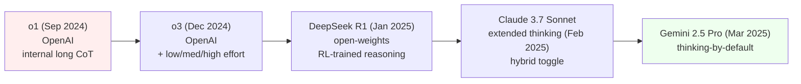
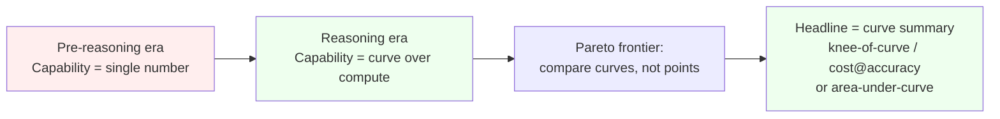

# Day 25 — Reasoning models and inference-time scaling: AIME, FrontierMath, and the cost-axis Pareto frontier

## The opening hook

Every benchmark in Weeks 1–3 reported a *single number per model*. MMLU is 89.5; HumanEval is 95.0; GPQA Diamond is 78.3. The implicit contract is that a model is a fixed mapping from inputs to outputs, and the eval measures that mapping. Sample once, score, repeat. Anything beyond that — best-of-$N$, self-consistency `maj@k`, PRM-reranked best-of-$N$ from D9 — has historically been a methodological footnote rather than the primary axis.

That contract broke in **September 2024** with the release of OpenAI's o1 model, and it has not been re-stitched since. o1's headline AIME 2024 numbers as reported in *Learning to Reason with LLMs* (OpenAI, Sept 12, 2024):

- **GPT-4o**: 12% (≈ 1.8 / 15 problems).
- **o1, pass@1**: 74% (≈ 11.1 / 15).
- **o1, cons@64** (majority vote across 64 samples): 83% (≈ 12.5 / 15).
- **o1, best-of-1000 with a learned scoring function**: 93% (≈ 13.9 / 15).

The pass@1 jump is the headline. The pass@1 → cons@64 → best-of-1000 *trajectory* is the methodological news. A single number — *o1 = 83% on AIME 2024* — is now under-specified in a way that *o1 = 89% on MMLU* never was, because o1's accuracy is an explicit function of inference-time compute. Three months later, **o3** (announced December 20, 2024) reported **~96.7% on AIME 2024** and **25.2% on FrontierMath** (the Glazer et al. 2024 frontier overlay we'll meet below) — but the o3 announcement also introduced explicit "low / medium / high" reasoning-effort settings, making "*which o3?*" a per-row variable on the leaderboard.

Today's lesson is the methodological consequence of that shift. The single-scalar reporting convention from D1 stops being adequate the moment the model itself has a tunable compute knob. Accuracy becomes a *curve* over inference-time tokens, and any honest comparison has to put **tokens (or dollars) on the x-axis**. We work the AIME mechanics, the FrontierMath difficulty ceiling, the o1 system card's cost-axis reporting methodology, and the Pareto reframing of what a benchmark report should now look like.

## The reasoning-model lineage



Five releases in seven months turned "reasoning model" from a single OpenAI artifact into a class. They share three properties that distinguish them from prior chat models:

1. **An internal long chain-of-thought** that consumes substantial output tokens *before* the user-visible answer. D4 framed CoT as a prompting trick; here it becomes a model property — the model is trained, typically with reinforcement learning from outcome rewards (DeepSeek R1's recipe is the cleanest published example) or from process supervision (D9's PRM800K was a precursor signal), to produce extended internal reasoning regardless of the prompt.
2. **A tunable reasoning-effort budget**. o3's `reasoning_effort: low | medium | high`, Claude's extended-thinking on/off, Gemini's thinking budget knob — all expose inference-time compute as a *first-class API parameter*. The same model is now multiple points on a curve.
3. **Substantial inference cost**. A single hard AIME problem under o1 can consume tens of thousands of internal-reasoning tokens; o3-high configurations reportedly used hundreds of thousands per problem on ARC-AGI. The cost gap between *answer* and *correct answer* is now a non-trivial fraction of a deployment budget.

The capability number (D4 was 56.6% → 73.9% on BBH from a *prompt change*) is now decoupled from the *cost* of producing it. That decoupling is what this lesson is about.

> *Note on rapidly-drifting numbers.* The release sequence above is verified to early 2026; specific frontier scores quoted later in this lesson are version-locked to the cited reports and will drift. Per D7's saturation caveat, treat absolute numbers as time-stamped data points, not durable claims.

## Anchor 1: AIME 2024 / 2025

### The competition

The **American Invitational Mathematics Examination (AIME)** is the second round of the MAA's high-school olympiad ladder (AMC 10/12 → AIME → USAMO/USAJMO). Mechanics:

- **15 problems, 3 hours**, no calculator, administered annually by the Mathematical Association of America.
- **Each answer is an integer from 000 to 999.** No multiple choice; no partial credit; no LaTeX equivalence checking. The answer space is exactly $1{,}000$ values per problem, so random guessing scores $1/1000 = 0.1\%$ per problem.
- **AIME I and AIME II** are administered two weeks apart each year — students take *one*, with the other available as a make-up. Both are valid, comparable instruments.

Recent dates:

- **AIME 2024**: AIME I on Jan 31, 2024; AIME II on Feb 1, 2024. (The MAA scheduled them on consecutive days that year rather than two weeks apart.)
- **AIME 2025**: AIME I on Feb 6, 2025; AIME II on Feb 12, 2025.

The **AIME-as-LLM-benchmark** convention treats each year's I+II as a 30-problem set (sometimes reported per-paper; both are common). Scoring is **integer exact match**, identical in spirit to GSM8K's `####`-suffix integer match (D9) but on a much harder problem distribution. There is no answer-extraction problem of the MATH/`\boxed{...}` variety (D9), and no equivalence-checker disagreement to confound cross-paper comparisons. **AIME's clean scoring rule is exactly why it became the post-MATH frontier math anchor**: when you spend tens of thousands of inference-time tokens per problem, you do not want the scoring rule itself to be a source of variance.

### Why AIME, why now

GSM8K saturated at 95%+ by 2024; MATH-500 sits near 90–96% on frontier models in early 2026 (D9). AIME is what's left of *checkable, integer-answer math* with meaningful headroom. The 2024 / 2025 papers were also *released after* most reasoning-model training cutoffs — AIME 2024 in late January, AIME 2025 in early February — which is a contamination property the benchmark inherits from the time-shifted continuous-update logic of LiveCodeBench (D11). A vendor reporting "o3 on AIME 2025" is reporting on problems the model demonstrably did not see at training time, *provided* the cutoff is correctly disclosed.

### The frontier trajectory

A snapshot of the public AIME 2024 trajectory (numbers drift; verify against the cited sources):

| Model | Reported AIME 2024 | Notes | Source |
| --- | --- | --- | --- |
| GPT-4o | ~12% | Single sample. Pre-reasoning-model baseline. | OpenAI o1 launch post (Sept 2024) |
| o1 (pass@1) | ~74% | Single sample, full internal CoT. | OpenAI o1 launch post |
| o1 (cons@64) | ~83% | Majority vote across 64 samples. | OpenAI o1 launch post |
| o1 (best-of-1000, learned scorer) | ~93% | Reranked, not just voted. | OpenAI o1 launch post |
| o3 | ~96.7% | Reasoning-effort high; specific setting per OpenAI announcement. | OpenAI o3 launch (Dec 2024) |

The 12% → 96.7% gap across one model generation is the largest single-benchmark single-year jump in the curriculum's coverage. The D7 saturation framing applies: AIME 2024 may be approaching its useful-ranking ceiling for the strongest reasoning models, and AIME 2025 + 2026 are the natural successors. Per D7, *and* per the inference-time-scaling story below, "approaching saturation" now also means "approaching the regime where small accuracy gains require disproportionate compute." A 96.7% on AIME 2024 is a different number depending on whether o3-high used $10^4$ or $10^6$ tokens to produce it — and OpenAI's announcement reported both an accuracy and a *cost band* per evaluation, which is the methodological seed of this lesson.

## Anchor 2: FrontierMath (Glazer et al. 2024)

**Citation.** Glazer, E., Erdil, E., Besiroglu, T., Chicharro, D., Chen, E., Gunning, A., Olsson, C. F., Denain, J.-S., Ho, A., Santucci, E. de O., Järviniemi, O., Barnett, M., Sandler, R., Vrzala, M., Sevilla, J., Ren, Q., Pratt, E., Levine, L., Barkley, G., Stewart, N., Grechuk, B., Grechuk, T., Enugandla, S. V., & Wildon, M. (2024). *FrontierMath: A Benchmark for Evaluating Advanced Mathematical Reasoning in AI.* arXiv:2411.04872.

FrontierMath is the **difficulty-ceiling overlay** for the AIME story. Where AIME problems are high-school olympiad-level (still solvable in the 3-hour window by very strong contest students), FrontierMath problems are **research-level**, drawn from across modern mathematics — number theory, real and complex analysis, algebraic geometry, category theory, combinatorics, and adjacent areas. The construction and methodological properties:

- **350 original problems total**, structured as a base set of **300 problems** across Tiers 1–3 plus an expansion set of **50 Tier-4 problems** described as "exceptionally difficult."
- **Authored and vetted by 60+ expert mathematicians**, including IMO problem-setters and Fields medalists. The construction parallels GPQA's domain-expert framing (D7) but at a substantially harder difficulty band.
- **Expert-only solvability claim**: Glazer et al. argue that even strong research mathematicians typically need *multiple hours* per problem in their own subfield, and *days or weeks* for problems outside it. This is the load-bearing claim that distinguishes FrontierMath from "another hard math benchmark" — the difficulty floor is calibrated to professional research rather than student competition.
- **Held-out**: the dataset is *not* publicly released as a downloadable JSONL. Evaluation runs through Epoch AI's infrastructure on a held-out problem set, with a small public sample. This is structurally similar to ARC-AGI's private-set design (D6/D7) and is the contamination-resistance move the benchmark needs to remain a meaningful difficulty-ceiling instrument as reasoning models close in on it.
- **Automated, exact-answer scoring**: problems are designed to have **definitive numerical or symbolic answers** that are checkable without judge models. The scoring rule is the same kind of integer/symbolic match as AIME, scaled up to harder objects (e.g., specific numbers of solutions in a Diophantine system; specific Galois-group orders).

The frontier number that anchored the early FrontierMath story:

> Glazer et al. report (Nov 2024) that **state-of-the-art models solve under 2%** of FrontierMath problems, against a backdrop where AIME 2024 was already near 83% under cons@64.

That gap — 83% on AIME 2024 vs. <2% on FrontierMath, *for the same model class* — is what makes FrontierMath the right overlay for D25. The AIME ceiling is one Pareto frontier; the FrontierMath ceiling is another, much further away. A reasoning model's "math capability" is not a single point but a profile across difficulty bands.

The o3 announcement (Dec 2024) reported **~25.2% on FrontierMath**, which the Glazer et al. team and OpenAI both characterized as a substantial jump while emphasizing that the bulk of the benchmark remained out of reach. That 2% → 25% jump in two months is the *open* story this benchmark exists to track; AIME 2024 is the *closed* story.

> *Caveat — funding disclosure.* Public discussion in late 2024 and early 2025 noted that OpenAI provided funding for FrontierMath's construction, which was disclosed only after the o3 announcement. This is methodologically relevant — the benchmark is *not* a third-party-only artifact in the sense GPQA is — without invalidating the technical construction. Treat FrontierMath the way you treat any vendor-funded benchmark: the construction details matter more than the headline number, and the held-out structure carries most of the credibility weight.

## Anchor 3: The o1 system card and cost-axis reporting (OpenAI 2024)

**Citation.** OpenAI. (2024). *OpenAI o1 System Card.* Initially released September 12, 2024; substantially revised version published December 5, 2024 (and republished as arXiv:2412.16720). https://openai.com/index/openai-o1-system-card/ ; https://cdn.openai.com/o1-system-card.pdf ; https://cdn.openai.com/o1-system-card-20241205.pdf

The o1 system card is this lesson's **methodological anchor** rather than a benchmark anchor. It is the document where the field's largest lab first published a deliberate framing of accuracy *as a function of inference-time compute*. Three load-bearing reporting moves to study from it:

1. **Pass@1 alongside cons@$N$ as default reporting.** Where prior model cards reported a single accuracy per benchmark, the o1 system card reports both pass@1 (single sample) *and* a majority-vote / consensus number across $N$ samples ($N = 32$ or $N = 64$ depending on the eval). This makes the *sampling-budget axis* visible at the row level: "o1 = 83% on AIME 2024" is reported as "*o1, AIME 2024, cons@64 = 83%; pass@1 = 74%*", which carries the cost dimension by structure.
2. **Test-time compute scaling curves.** The accompanying *Learning to Reason with LLMs* post (and the corresponding figures referenced in the system card) plot accuracy versus inference-time compute on log-scaled x-axes for AIME and several other benchmarks. The relationship is roughly **log-linear** over multiple orders of magnitude — doubling inference compute buys a roughly constant accuracy increment in absolute percentage points, until task-specific ceilings are approached. The shape of the curve matters as much as any single point on it.
3. **Capability-vs-cost framing in safety review.** The system card's safety sections evaluate dangerous-capability proxies (cf. D21 WMDP) at *multiple inference-effort settings*, recognizing that a model that can be coaxed into hazardous output at $10^6$ tokens of internal reasoning is a different deployment risk from one that cannot — even if both score the same at pass@1.

The combination of these three moves is what makes the o1 system card the right anchor for the cost-axis story. Subsequent system cards (o3, Claude 3.7 Sonnet, Gemini 2.5 Pro, DeepSeek R1) have either followed the same template or have been criticized in public review for *not* doing so. The methodological norm being established is: **for a reasoning model, accuracy without an inference-cost axis is an unfinished report**.

## The cost-axis Pareto reframing (mandatory section)

This is the methodological core of the lesson. The argument is sharp.

### Why a single scalar accuracy is no longer sufficient

A standard accuracy report — "Model X scores 83% on AIME 2024" — is well-defined when the model is a *fixed* function: one prompt, one sample, one answer. The 83% has an implicit cost: roughly the input-prompt-plus-answer-tokens that any model would use on this benchmark. Cross-model comparison at fixed cost is then automatic, because all models are spending similar token budgets.

For reasoning models that condition heavily on internal CoT, *this assumption fails*. Three concrete failures:

1. **Same accuracy, different cost.** Model A reaches 83% on AIME 2024 at ~10k tokens per problem; Model B reaches 83% at ~100k tokens per problem. The single-scalar leaderboard treats them as tied; the deployment economics are 10× apart.
2. **Same model, different accuracy.** o3 with `reasoning_effort: low` and o3 with `reasoning_effort: high` produce dramatically different AIME 2024 numbers from the same checkpoint. "o3 = 96.7% on AIME" is genuinely under-specified without an effort setting and a token-budget bound.
3. **Cost-gaming the score.** A vendor optimizing for headline numbers can scale inference budget to whatever level wins the leaderboard, then report the resulting accuracy as a model property. This is a *pure Goodhart-on-the-cost-axis pattern*: when only accuracy is reported, accuracy becomes the target, and inference-time compute is the unmeasured slack variable that absorbs the optimization pressure. The capability-overhang framing from D1's safety note inverts here: the leaderboard number can climb without the underlying *per-fixed-budget* capability changing at all.

The remedy is to report **(accuracy, cost) pairs**, not accuracies alone — or, at the limit, full **accuracy-vs-tokens curves** on a log-scaled x-axis.

### The conceptual shift: capability number → capability curve



Concretely: a model's AIME 2024 result is now best summarized as a function $a(c)$ mapping inference-cost $c$ (in tokens or dollars) to expected accuracy, with sampling at $T > 0$ to expose variance. Two models' Pareto-frontier comparison is then "*does $a_1(c) > a_2(c)$ for all $c$ in the deployment-relevant range, or do the curves cross?*" — a richer question than "which is the bigger number."

### A schematic accuracy-vs-tokens curve

The empirical shape across multiple labs and benchmarks is consistent: roughly log-linear in the middle of the range, with floor and ceiling effects at the extremes. A schematic for AIME 2024-class problems (illustrative; not a fit to specific reported numbers — see the o1 system card for actual curves):

```
Accuracy (%)
  100 |                                  ......_______ ceiling regime
      |                            ....''
   90 |                       ..''
      |                   .''
   80 |                .''       <-- log-linear regime
      |             .''          (each 2x compute  ~+5pp)
   70 |          .''
      |        .'
   60 |     .'
      |   .'                         <-- threshold regime
   50 | .'                           (compute below floor: model
      |.                              cannot solve at all)
   40 +'-----+------+------+------+------+------+----- log10(tokens)
            3      4      5      6      7      8
                    ^             ^             ^
                    |             |             |
                pass@1, low    cons@64        best-of-1024
                effort         medium         + reranker
```

Three regimes are visible:

- **Threshold (low compute).** Accuracy is below the floor where the chain-budget can support multi-step reasoning; output is essentially random or pattern-matched. Below this, *more* compute does not help — the model lacks the substrate.
- **Log-linear (mid compute).** The regime the o1 system card documents most clearly: accuracy rises roughly linearly in $\log_2(\text{tokens})$. Each doubling of compute buys a roughly constant absolute-percentage-point gain. This is the regime where "*how much compute did you use?*" is the most informative single follow-up question to "*what's the accuracy?*".
- **Ceiling (high compute).** Returns diminish; the remaining problems are either above the difficulty ceiling for this model or are mislabeled in the test set (the same label-noise floor D9 named for GSM8K). Past the knee, additional compute is wasted.

### Cost-aware metric variants

The math literature has consolidated around a few cost-aware accuracy variants. The most important to know:

**pass@k (Chen et al. 2021 — D11 anchor).** Probability that *at least one* of $k$ i.i.d. samples is correct, estimated unbiasedly as

$$
\text{pass@}k = \mathop{\mathbb{E}}_{\text{problems}} \left[ 1 - \frac{\binom{n - c}{k}}{\binom{n}{k}} \right]
$$

where $n \geq k$ samples are drawn per problem and $c$ are correct (D11 derives this in detail). At reasoning-model scale, papers now routinely report **pass@1, pass@64, pass@1024** — the three-orders-of-magnitude span is what makes the "curve, not a number" framing concrete. Note that pass@$k$ requires a *checker* that verifies correctness without choosing among samples, which AIME's integer-match scoring provides for free.

**cons@N / `maj@N` (Wang et al. 2022 self-consistency — D9 anchor).** Sample $N$ chains at $T > 0$, take the **plurality vote** over their final answers:

$$
\hat{a}_{\text{cons}@N} = \arg\max_{a \in \mathcal{A}} \sum_{i=1}^{N} \mathbb{1}[\text{answer}(s_i) = a]
$$

where $s_1, \ldots, s_N$ are the sampled chains and $\mathcal{A}$ is the answer space (for AIME, $\{0, 1, \ldots, 999\}$). cons@$N$ scores correctness as $\mathbb{1}[\hat{a}_{\text{cons}@N} = a^*]$ on the gold answer $a^*$; the per-problem indicator averages over the test set. Unlike pass@$k$, cons@$N$ does *not* require an external verifier — it relies on the model's own output distribution to concentrate on the correct answer. This is the metric the o1 system card uses (`cons@64` in the AIME report) and is the natural choice when no verifier exists.

**Cost-bounded variants.** A more honest reporting convention pairs accuracy with a token bound: **acc@$B$ tokens**, the expected per-problem accuracy when total inference is capped at $B$ tokens (across however many samples the model chooses to generate). This is the metric that most directly reflects a deployment budget. METR's HCAST suite (D28 forward) operationalizes this exactly: for each model, evaluation runs are capped at a token budget (16M tokens per task for o3/o4-mini-class models, 8M for DeepSeek R1, 2M for smaller models in METR's published reports), and the scaffold exposes the remaining budget to the agent so that *cost-aware behavior* is part of the eval.

The relationship at $T \to 0$ greedy decoding is that pass@1 = cons@1 = the deterministic accuracy. At $T > 0$ they diverge — pass@$k$ rewards coverage, cons@$N$ rewards mode-concentration — and the right choice depends on whether you have a checker.

## The Goodhart sub-thread: cost-axis gaming

The Goodhart frame from D1, D7, D11, D17, D21 has a specific instantiation in the cost-axis era worth naming explicitly.

When a benchmark reports accuracy *without* cost, the inference budget becomes a free variable that vendors can scale to whatever level wins. The pattern is:

1. **Vendor A reports model $M$ at cons@64 = 83%.**
2. **Vendor B reports model $M'$ at "best-of-1024 + learned reranker" = 93%.**
3. **The leaderboard** shows $M' > M$ by 10 points.
4. **In production** at a fixed user-facing latency budget, $M$ may strictly dominate $M'$ because $M'$'s 93% is purchased with 16× more compute per query than the deployment can afford.

The leaderboard treats $M'$ as the better model; the deployment treats $M$ as the better model. The leaderboard number was the target; cost was the slack variable; Goodhart's Law took its standard course. The fix is *not* a different headline metric (any single number recreates the same dynamic). The fix is **structural**: report (accuracy, cost) pairs by default, and treat any cost-stripped headline with the same skepticism D7 advised for benchmarks at saturation. The METR HCAST move — pre-declared per-model token budgets exposed to the agent — is an operationalization of that fix at the agent-eval level.

This is the same Goodhart pattern as the D11 contamination story (HumanEval became a target, leaked into pretraining, score inflated) and the D21 unlearning-target story (WMDP became a target, models learned to fail on its surface form), with the optimization pressure routed through inference compute rather than training data. The structure is identical; only the slack variable differs.

## Forward pointer: D26, D28, and the cost axis everywhere

Today's framing extends into the rest of Week 4:

- **D11 (LiveCodeBench)** retroactively becomes a cost-axis benchmark too: pass@$k$ on competitive-programming problems is the same kind of curve, and LiveCodeBench Pro's 2026 Elo-rated leaderboards now report it under explicit compute bands. The math story leads, but the code story follows.
- **D26 (web agents — WebArena, GAIA, AgentDojo)**. Once an agent is allowed to spend many forward passes per task, every per-task success rate is implicitly a function of step budget *and* tool-use budget. The cost axis multiplies: tokens × tool calls × wall-clock minutes. The cost-axis Pareto frame from today is the prerequisite framing for D26's metrics.
- **D28 (METR autonomy — RE-Bench + general autonomous tasks)**. Reasoning models are the *substrate* on which METR's autonomy evaluations run. The HCAST token-budget design is the explicit cost-aware-eval reference for this lesson, and METR's preliminary o3 / o4-mini reports operationalize the (capability, cost) Pareto framing for autonomy specifically. The dangerous-capability inversion from D21 (higher = riskier) composes with the cost axis: a model that is dangerous *only at 16M tokens of effort* is a different policy artifact from one that is dangerous at 16k.

The through-line: Week 1's "an evaluation is a pipeline" generalizes in Week 4 to "an evaluation is a pipeline, *and one of the pipeline's free variables is now compute-per-item*". Capability is a curve; Goodhart routes through the unmeasured axis; the methodological fix is structural cost reporting.

> **Safety researcher's note.** Reasoning models reshape the safety landscape in three specific ways the cost-axis frame helps name. First, **dangerous-capability evaluation (D21)** has to be re-run at multiple effort settings — a model that refuses or fails at low effort and complies at high effort is a different deployment risk than either alone, and the system-card convention of single-effort dangerous-capability scores is straightforwardly insufficient for this generation. Second, **CoT faithfulness (D4, D9)** becomes more pressing, not less: the long internal chains that produce the capability gain are *also* the visible-but-not-necessarily-faithful surface that safety claims have started to lean on. Anthropic's 2025 *Reasoning Models Don't Always Say What They Think* and the broader unfaithful-CoT line (Turpin et al. 2023) argue that high-capability reasoning models can produce externally legible chains whose content does not drive the answer, and the optimization pressure to make chains *look* faithful (because that is what the system card displays and the safety reviewer reads) is exactly the Goodhart-on-transparency concern D9's safety note named. Third, **the cost axis itself is a safety-relevant lever.** A capability that requires 10⁶ tokens to elicit is a *more contained* threat than one elicitable at 10⁴; deployment policies can in principle be specified in terms of *capability-at-budget* rather than capability-at-all. METR's HCAST framing and Anthropic's RSP / OpenAI's Preparedness frameworks have started to incorporate this implicitly. The methodological shift this lesson documents — accuracy is a curve, not a number — is a safety-relevant shift, not just an economic one.

## Takeaways

1. **Reasoning models are a class** (o1 Sep 2024 → o3 Dec 2024 → DeepSeek R1 Jan 2025 → Claude extended thinking Feb 2025 → Gemini 2.5 Pro thinking Mar 2025) defined by long internal CoT, tunable reasoning-effort budgets, and substantial inference cost. CoT stops being a prompting trick (D4) and becomes a model property.
2. **AIME 2024/2025** (15 integer-answer problems per AIME I + II, answer space 0–999, exact-match scoring) is the post-MATH frontier math anchor: clean scoring, meaningful headroom into 2024, post-cutoff for most reasoning models. Reported trajectory: GPT-4o ~12% → o1 pass@1 ~74% → o1 cons@64 ~83% → o3 ~96.7% on AIME 2024.
3. **FrontierMath** (Glazer et al. 2024, arXiv:2411.04872, 350 expert-authored research-level problems, held-out, automated exact-answer scoring) is the difficulty-ceiling overlay. Frontier <2% at release; o3 ~25.2% in December 2024. The benchmark exists where AIME has saturated.
4. **The o1 system card** (OpenAI Sept 2024 / Dec 2024 revision) is the methodological anchor: pass@1 alongside cons@$N$ as default reporting, log-scaled accuracy-vs-tokens curves, multi-effort safety evaluation. The norm being established: for a reasoning model, accuracy without an inference-cost axis is an unfinished report.
5. **Capability is now a curve, not a number.** A model's AIME-class accuracy is a function $a(c)$ of inference cost, with three regimes — threshold floor, log-linear midrange, ceiling — and Pareto-frontier comparison across models replaces single-scalar comparison.
6. **Cost-axis Goodhart**: when accuracy is reported without cost, vendors can scale inference compute to whatever level wins the leaderboard. The leaderboard number rises; the deployment-relevant per-fixed-budget capability does not. The structural fix is (accuracy, cost) pair reporting; METR HCAST's pre-declared token budgets are the canonical operationalization.
7. **pass@$k$, cons@$N$, acc@$B$ tokens** are the cost-aware metric family. pass@$k$ requires a checker (D11 anchor); cons@$N$ does not (D9 anchor); acc@$B$ binds total compute. The choice depends on whether a verifier exists and what deployment quantity is being predicted.

## References

- **Anchor — AIME 2024.** Mathematical Association of America. *2024 AIME I & II competitions.* https://maa.org/maa-invitational-competitions/ ; AoPS wiki: https://artofproblemsolving.com/wiki/index.php/American_Invitational_Mathematics_Examination
- **Anchor — AIME 2025.** Mathematical Association of America. *2025 AIME I (Feb 6, 2025) and AIME II (Feb 12, 2025).* AoPS: https://artofproblemsolving.com/wiki/index.php/2025_AIME_I
- **Anchor — FrontierMath.** Glazer, E., Erdil, E., Besiroglu, T., Chicharro, D., Chen, E., Gunning, A., et al. (2024). *FrontierMath: A Benchmark for Evaluating Advanced Mathematical Reasoning in AI.* arXiv:2411.04872. https://arxiv.org/abs/2411.04872
- **FrontierMath project page (Epoch AI).** https://epoch.ai/frontiermath
- **Anchor — methodological framing.** OpenAI. (2024). *OpenAI o1 System Card.* Sept 12, 2024 (https://cdn.openai.com/o1-system-card.pdf) and Dec 5, 2024 revision (https://cdn.openai.com/o1-system-card-20241205.pdf ; arXiv:2412.16720). Companion post: *Learning to Reason with LLMs.* https://openai.com/index/learning-to-reason-with-llms/
- **o3 announcement.** OpenAI. (Dec 20, 2024). *Introducing OpenAI o3 and o4-mini* (later expansion). Initial coverage: https://openai.com/index/introducing-o3-and-o4-mini/
- **DeepSeek R1.** DeepSeek-AI. (Jan 20, 2025). *DeepSeek-R1: Incentivizing Reasoning Capability in LLMs via Reinforcement Learning.* arXiv:2501.12948. https://arxiv.org/abs/2501.12948
- **Claude extended thinking.** Anthropic. (Feb 2025). *Claude 3.7 Sonnet and Claude Code.* https://www.anthropic.com/news/claude-3-7-sonnet
- **Gemini 2.5 Pro (thinking).** Google DeepMind. (Mar 2025). *Gemini 2.5: Our most intelligent AI model.* https://blog.google/technology/google-deepmind/gemini-model-thinking-updates-march-2025/
- **Self-consistency / cons@N.** Wang, X., Wei, J., Schuurmans, D., Le, Q., Chi, E., Narang, S., Chowdhery, A., & Zhou, D. (2022). *Self-Consistency Improves Chain of Thought Reasoning in Language Models.* ICLR 2023. arXiv:2203.11171. https://arxiv.org/abs/2203.11171
- **pass@k (D11 cross-reference).** Chen, M., Tworek, J., Jun, H., Yuan, Q., et al. (2021). *Evaluating Large Language Models Trained on Code.* arXiv:2107.03374. https://arxiv.org/abs/2107.03374
- **Cost-aware autonomy eval (D28 forward).** METR. *HCAST: Human-Calibrated Autonomy Software Tasks.* arXiv:2503.17354. https://arxiv.org/abs/2503.17354 ; project page: https://metr.org/hcast.pdf ; o3/o4-mini evaluation report: https://evaluations.metr.org/openai-o3-report/
- **CoT faithfulness (D4/D9 cross-reference).** Turpin, M., Michael, J., Perez, E., & Bowman, S. R. (2023). *Language Models Don't Always Say What They Think: Unfaithful Explanations in Chain-of-Thought Prompting.* NeurIPS 2023. arXiv:2305.04388. https://arxiv.org/abs/2305.04388

## Quiz

**Q1.** A model is sampled $n = 10$ times on an AIME 2024 problem and $c = 4$ samples produce the correct integer answer. Using the unbiased Chen et al. 2021 estimator, what is pass@2 for this problem?

- A. $1 - \binom{6}{2}/\binom{10}{2} = 1 - 15/45 = 2/3 \approx 0.667$
- B. $1 - (1 - 4/10)^2 = 1 - 0.36 = 0.64$
- C. $4/10 = 0.4$
- D. $1 - \binom{4}{2}/\binom{10}{2} = 1 - 6/45 = 13/15 \approx 0.867$

**Q2.** A model produces 5 sampled chains on an AIME problem. The final integers are $\{42, 42, 17, 42, 600\}$. The gold answer is $42$. What is the cons@5 score for this problem, and which property of cons@$N$ does this illustrate?

- A. $0$, because not all 5 samples agree.
- B. $1$, because the plurality vote is $42$ (3/5 chains) and matches the gold answer; cons@$N$ rewards mode-concentration rather than coverage.
- C. $3/5 = 0.6$, the fraction of correct samples.
- D. Undefined, because cons@$N$ requires $N$ to be even.

**Q3.** A vendor reports "Model X: AIME 2024 = 89%". Which single follow-up question is most informative about whether the number is comparable to a competitor's "Model Y: AIME 2024 = 87%"?

- A. What was the GPU type used at inference?
- B. What inference-time compute (tokens or dollars per problem) and what aggregation (pass@1, cons@$N$, best-of-$k$ with reranker) was used to produce the 89%?
- C. Whether the model is open-weights.
- D. Whether the AIME papers were AIME I or AIME II.

**Q4.** Which of the following best describes the **structural** Goodhart pattern that single-scalar accuracy reporting creates for reasoning-model leaderboards?

- A. Reasoning models can be trained on the test set, inflating their score.
- B. When only accuracy is reported and inference-time compute is not, vendors can scale inference budget to whatever level wins the leaderboard, so the leaderboard number rises while the deployment-relevant per-fixed-budget capability does not. The fix is structural: report (accuracy, cost) pairs.
- C. Reasoning models always saturate benchmarks within one year of release.
- D. cons@$N$ is biased upward relative to pass@1 by exactly $\log N$ percentage points.

**Q5.** FrontierMath (Glazer et al. 2024) and AIME 2024 sit at very different difficulty bands. Which best describes the methodological *complementarity* between them in this lesson's framing?

- A. They are interchangeable; either can stand in for the other in a reasoning-model report.
- B. AIME provides a near-saturation discriminator with a clean scoring rule and per-year contamination control; FrontierMath provides a research-level difficulty ceiling with held-out problems and exact-answer scoring. Together they let a report claim a *capability profile across difficulty bands* rather than a single number — and a model with high AIME and low FrontierMath has a much narrower capability claim than one with high scores on both.
- C. FrontierMath is a subset of AIME at higher difficulty levels.
- D. AIME problems are scored by an LLM-as-judge while FrontierMath uses exact match; the difference is purely about scoring infrastructure.

**Q6.** A reasoning model produces an accuracy-vs-log-tokens curve on AIME 2024 with three regimes: a low-compute floor where accuracy is near random, a log-linear midrange where each doubling of compute buys a roughly constant absolute-percentage-point gain, and a high-compute ceiling. Which of the following is the **most accurate** characterization of why each doubling in the midrange buys roughly the *same* absolute gain rather than a constant *relative* gain?

- A. Because the model's parameter count doubles each time inference compute doubles.
- B. Because, empirically and per the o1 system card's reported curves, accuracy is approximately linear in $\log_2(\text{tokens})$ over a wide compute range — a doubling of compute moves $\log_2(\text{tokens})$ by 1, and a linear function of $\log_2$ adds a constant amount per doubling. The shape is task-specific; AIME-class problems exhibit it cleanly within the midrange.
- C. Because cons@$N$ is a linear estimator of pass@1.
- D. Because token costs are billed in fixed-size blocks.

<details>
<summary>Answers</summary>

1. **A** — apply the unbiased estimator with $n = 10$, $c = 4$, $k = 2$: $\binom{n-c}{k}/\binom{n}{k} = \binom{6}{2}/\binom{10}{2} = 15/45 = 1/3$, so pass@2 $= 1 - 1/3 = 2/3 \approx 0.667$. Distractor B is the *biased* plug-in $1 - (1 - c/n)^k = 0.64$ (close, but slightly lower than the unbiased estimate — the typical bias direction at small $n$). Distractor C is pass@1, not pass@2. Distractor D miscomputes by counting correct-pool subsets ($\binom{c}{k}$) instead of wrong-pool subsets ($\binom{n-c}{k}$) — the canonical direction-of-counting error D11 flagged.
2. **B** — cons@5 takes the plurality vote: $42$ wins with 3 chains vs. $17$ (1) and $600$ (1). The vote matches the gold answer, so the per-problem score is $1$. The illustrative point is that cons@$N$ rewards mode-concentration ("most chains agree on the same answer"), not coverage ("at least one chain is right" — that's pass@$k$). On AIME's integer answer space of size 1000, plurality voting concentrates strongly on correct answers when the model's distribution is well-calibrated.
3. **B** — without an inference-time-compute disclosure and an aggregation method (pass@1 vs. cons@$N$ vs. best-of-$k$-reranker), the two numbers are not on the same axis. Per the lesson's central argument: reasoning-model accuracy reported without cost is structurally under-specified. (A and C are second-order; D is a small effect — AIME I and AIME II are calibrated to be of comparable difficulty within a year.)
4. **B** — the cost-axis Goodhart pattern. Inference compute is the unmeasured slack variable that absorbs the optimization pressure; the leaderboard number rises without per-fixed-budget capability changing. The structural fix — (accuracy, cost) pair reporting; METR HCAST's pre-declared budgets — is what the lesson argues for. (A is a separate Goodhart pattern at training time; C is empirically false; D is a fabricated relationship.)
5. **B** — capability is a *profile across difficulty bands*, not a single number, and AIME + FrontierMath together cover meaningfully more of the relevant frontier than either alone. The contrast — saturation-near AIME vs. floor-near FrontierMath — is what makes the pair informative. (A misses the entire point; C is factually wrong — they're independent constructions; D mischaracterizes both scoring rules.)
6. **B** — the empirical claim from the o1 system card's test-time-compute scaling curves. If $a(c) \approx \alpha \cdot \log_2(c) + \beta$ over the midrange, then $a(2c) - a(c) = \alpha$, a constant in absolute percentage points per doubling — *not* a constant ratio. The shape is task-specific; the floor and ceiling regimes break the log-linearity. (A confuses inference-time compute with parameter count; C is wrong — cons@$N$ is not a linear estimator; D is unrelated.)

</details>
