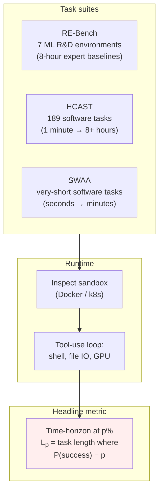
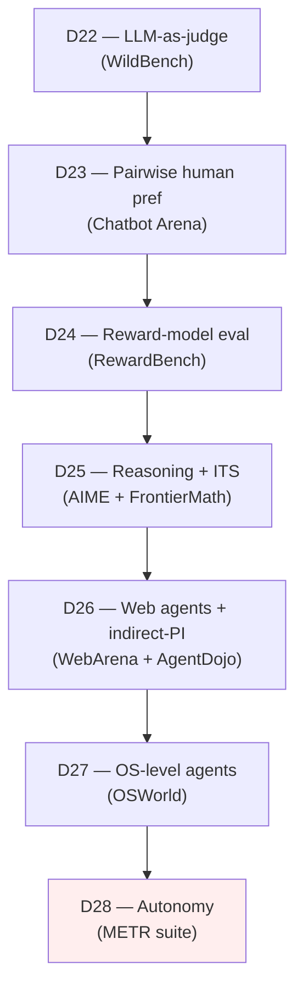
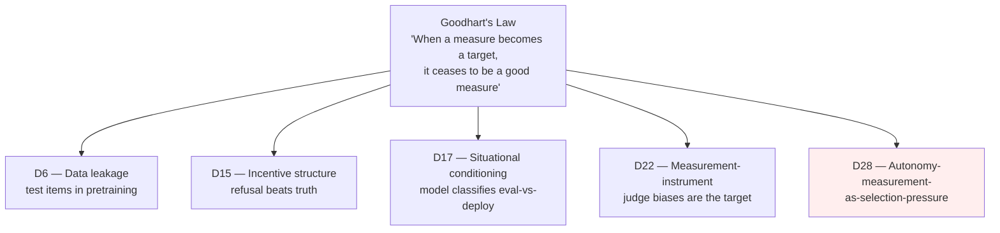

# Day 28 — Autonomous-capability evaluation: METR's autonomy suite, and a 28-day synthesis

## The opening hook

Day 1 began with a single number — *GPT-5 scores 89.5 on MMLU* — and asked what was hidden inside it. Twenty-eight days later we close on a different kind of number, one that isn't on a leaderboard and isn't reported in marketing decks: **how long is the human task that this model can complete autonomously, end-to-end, with 50% probability?** Per METR (Kwa, West, et al. 2025), the answer for the frontier in early 2025 was about an hour, and the trend line shows that horizon doubling roughly every seven months. By the time you read this, the answer is already different. The trend itself is the lesson.

That is qualitatively a new kind of evaluation. Every benchmark in Weeks 1–3 asked *can the model produce a correct token, sentence, or program?*. Autonomy evaluation asks *can the model run a multi-hour, multi-action loop — observe, plan, act, recover from errors, recover from its own mistakes, persist a goal across hundreds of steps — without a human in the loop?*. That capability is what frontier-safety policy was built to track: Anthropic's RSP autonomy checkpoints, OpenAI's Preparedness "model autonomy" tracked-capability category, the UK and US AI Security Institutes' pre-deployment third-party evaluations. METR is the standalone non-profit that measures it.

This is also the curriculum closer. The lesson body covers METR's anchor work; the second half is a synthesis of the 28-day arc. If you've read the previous 27 lessons, the second half is the payoff.

## METR — the organization

**METR** stands for *Model Evaluation and Threat Research*. It spun out of the Alignment Research Center as **ARC Evals** (the team behind the much-cited 2023 GPT-4 autonomous-replication evaluation in OpenAI's GPT-4 system card) and was renamed and incorporated as an independent 501(c)(3) non-profit in December 2023 ([metr.org/blog/2023-12-04-metr-announcement](https://metr.org/blog/2023-12-04-metr-announcement/)). Its founder and CEO is Beth Barnes; it is based in Berkeley.

What METR does, operationally, is run pre-deployment evaluations of frontier models — under NDA, before public release — focused on what its mission documents call *catastrophic-risk thresholds*. Public-facing partnerships and outputs include contributions to system cards for Anthropic's Claude family and OpenAI's o1 / o3 / o4-mini / GPT-4.5 ([metr.org](https://metr.org/)). Under those evaluations sits a stack of measurement infrastructure — task suites, scaffolds, runtime sandboxes, scoring methodology — that METR has open-sourced. That open-sourced stack is what the rest of this lesson covers, because it is the part the rest of the field can use.

The choice to anchor Day 28 on METR rather than on **ARC-AGI** (the alternative considered in `overview.md`'s "What's intentionally NOT in the grid") is deliberate. ARC-AGI (Chollet 2019, ARC-AGI-2 in Chollet et al. 2025; D7 referenced both) is the cleanest example of *structurally* contamination-resistant evaluation, but its task type — visual grid-transformation puzzles — does not directly probe the capability frontier-safety policy is written against. METR's autonomy suite does. The closer is policy-relevant by construction.

## Anchor: METR's autonomy suite

Three published artefacts compose what this lesson calls "the METR autonomy suite":

1. **RE-Bench** — Wijk, Lin, et al. (2024), *RE-Bench: Evaluating frontier AI R&D capabilities of language model agents against human experts.* arXiv:2411.15114.
2. **HCAST** — Rein, Becker, et al. (2025), *HCAST: Human-Calibrated Autonomy Software Tasks.* arXiv:2503.17354.
3. **The horizon-length result** — Kwa, West, et al. (2025), *Measuring AI Ability to Complete Long Tasks.* arXiv:2503.14499 ([metr.org/blog/2025-03-19-measuring-ai-ability-to-complete-long-tasks](https://metr.org/blog/2025-03-19-measuring-ai-ability-to-complete-long-tasks/)).

### RE-Bench (Wijk et al. 2024)

RE-Bench is **7 hand-crafted, open-ended ML research-engineering environments**, each paired with **human-expert baselines** (71 attempts, 61 distinct experts, 8 hours per attempt as the core setting). The environments were chosen by consultation with ML researchers at top labs and academia for realism; representative examples named in the paper and METR's blog post include *fitting a scaling law*, *optimizing a GPU kernel*, and similar research-engineering tasks (full list at [github.com/METR/RE-Bench](https://github.com/METR/RE-Bench)).

Scoring is **continuous and environment-specific**. Each environment ships its own scoring function (e.g., maximize accuracy on a held-out dataset, minimize wall-clock time of a training loop, maximize a learned metric). The agent is given GPU access, a working dir, the scoring function, and a time budget; the score reported is the best score achieved in-budget, normalised against a strong reference solution. The headline empirical finding from the paper:

- **At a 2-hour time budget**, the best AI agents in their evaluation outscore human experts by ~4×.
- **At higher time budgets** (4–8 hours, the human reference), human experts pull ahead — agents stop improving while humans keep iterating.
- 82% of expert attempts achieve a non-zero score; 24% match or exceed the strong reference solution.

That 2-hour-vs-8-hour crossover is the load-bearing finding. It is not "agents have replaced researchers"; it is "agents are now competitive with researchers on the kind of bounded, well-specified, fast-feedback task that fills the first two hours of a research sprint." The capability frontier this reports — short-horizon, high-density-feedback ML work — is exactly the slice of AI R&D that policy frameworks track because of its self-improvement implications.

### HCAST (Rein et al. 2025)

HCAST — *Human-Calibrated Autonomy Software Tasks* — is the breadth complement to RE-Bench's depth. **189 tasks** across machine-learning engineering, cybersecurity, software engineering, and general reasoning, each calibrated against human baselines. The calibration data is the methodologically distinctive piece: **563 human baselines, ~1,500 hours total**, run under conditions identical to the AI agent setting (same sandbox, same tools, same time budget). Tasks span **from one minute to over eight hours of human-baseline time**.

Headline empirical findings from Rein et al. 2025:

- Frontier agents succeed on **70–80%** of tasks with human-baseline time **under one hour**.
- Agent success drops to **under 20%** on tasks with human-baseline time **over four hours**.
- Roughly 10% of HCAST tasks have an average successful-trajectory length above 25 actions; the median successful run takes 5–15 actions.

This is the empirical curve underneath Kwa et al.'s horizon-length result.

### The horizon-length metric (Kwa et al. 2025)

Given a task suite where every task has a calibrated *human-baseline length* $\ell_i$ in minutes, and an agent that succeeds on task $i$ with empirical probability $\hat{p}_i$, fit a logistic regression of success against log-length:

$$
\Pr[\text{agent succeeds on task of length } \ell] = \sigma\!\left(\beta_0 + \beta_1 \log \ell\right).
$$

The **$p$-task-completion time horizon** $L_p$ is the inverse: the human-baseline length at which the agent succeeds with probability $p$. Kwa et al. report two anchored thresholds:

- $L_{50}$: the length at which the agent succeeds 50% of the time. This is the headline number.
- $L_{80}$: the same at the more conservative 80% threshold.

Plotting $L_{50}$ across model releases from 2019–2025 yields the now-canonical curve: an exponential trend with a **doubling time of approximately 7 months over the past 6 years** (Kwa et al. 2025; see also METR's Time Horizon 1.1 update at [metr.org/blog/2026-1-29-time-horizon-1-1](https://metr.org/blog/2026-1-29-time-horizon-1-1/) for refreshed numbers). At the 2025 reporting cut, frontier models had $L_{50} \approx 1$ hour. METR's own update notes the 2024 doubling rate may have accelerated to ~4 months, with the 7-month figure as the long-run trend.

The doubling-time framing matters because it puts a clock on capability. If you accept the curve and extrapolate, the time at which $L_{50}$ crosses standard policy thresholds (one full work-week of expert time, one full month, one expert-year) is in years rather than decades. That extrapolation is contested — the trend may saturate, the task distribution may not generalize, scaffolding overhead may dominate at long horizons — and METR's own analyses are explicit about those caveats. But it is the first time the field has had a quantitative trajectory for *agency* the way it has had quantitative trajectories for compute, parameters, and data ([epoch.ai](https://epoch.ai/) plots the latter; METR plots the former).

### Running the suite

The suite runs through **Inspect** (UK AI Security Institute), with sandboxing supplied by Inspect's Docker / Kubernetes / Proxmox sandbox providers ([www.aisi.gov.uk/blog/the-inspect-sandboxing-toolkit-scalable-and-secure-ai-agent-evaluations](https://www.aisi.gov.uk/blog/the-inspect-sandboxing-toolkit-scalable-and-secure-ai-agent-evaluations)). The pattern that closes Week 4: D22's WildBench is Inspect-native, D27's OSWorld is Inspect-via-sandbox, D28's METR suite is Inspect-via-sandbox plus METR's own task definitions and scoring functions ([github.com/METR](https://github.com/METR), [metr.github.io/autonomy-evals-guide](https://metr.github.io/autonomy-evals-guide/)). A canonical run sweeps a model across the HCAST distribution and fits the logistic to extract $L_{50}$; RE-Bench is run separately because its scoring is continuous and environment-specific.

> **A note on dataset hygiene.** METR explicitly asks evaluators to take "reasonable steps" to keep the RE-Bench and HCAST tasks out of training data, because the suites are intended for *forward* evaluation of new releases. This is the D6 / D11 contamination problem applied to autonomy — and unlike post-cutoff sampling (LiveCodeBench), task-shaped autonomy benchmarks cannot be trivially refreshed. The standard mitigation in 2025–2026 is held-out task subsets and pre-deployment NDA arrangements, which the public leaderboard can reference but not reproduce.

## Goodhart foregrounded — autonomy-measurement-as-selection-pressure

This is the fifth and final Goodhart-foregrounded lesson in the curriculum. The four prior mechanisms:

| Day | Mechanism | One-sentence summary |
| --- | --- | --- |
| **D6** | Data leakage | The benchmark items end up in the pretraining set, so the score measures memorization rather than generalization. |
| **D15** | Incentive structure | The benchmark's reference set rewards refusal-shaped strings on contested-fact items, so optimizing the score selects for *legibly safe-looking refusal* rather than truth-tracking. |
| **D17** | Situational conditioning | The model conditions on an upstream feature — "this looks like an evaluation" — that it has learned to detect, so the score is computed on a sample drawn from the conditional-on-eval distribution rather than the deployment distribution. |
| **D22** | Measurement-instrument-as-target | The judge model has systematic biases (self-preference, position, verbosity, bandwagon), so optimizing against the judge selects for output-shape features the judge favours rather than for the underlying quality. |

D28's mechanism is distinct from all four:

> **Autonomy-measurement-as-selection-pressure: any benchmark for autonomous capability is itself a training signal that selects for the very property the safety community wants to track passively.**

The mechanism, made concrete:

1. To measure autonomous capability, you need task suites with calibrated horizons, runtime sandboxes, and scoring functions (RE-Bench, HCAST, the Inspect sandboxing toolkit).
2. Once those task suites and runtime infrastructures exist, **they are the natural training environment** for the next generation of agentic models. Scaffolding, RL training loops, and post-training fine-tuning all converge on the same shape of environment that the eval is run in.
3. The result is that the eval-vs-deployment distribution gap from D17 *does not exist* for autonomy benchmarks in the same way — because the deployment shape (a model in an agentic loop with tool access in a sandboxed environment) and the evaluation shape are *the same shape*, by design. The eval doesn't generalize from a held-out distribution; it grades performance on the in-training distribution.
4. **More structurally:** capability evaluations (Weeks 1–2) optimize for *more* capability — that's their job. Safety evaluations (Week 3) optimize for *less* of various failure modes — also their job. Autonomy evaluation sits at the place where measurement *itself* is fraught: the better the benchmark, the cleaner the training signal it provides for the property it tracks. METR's task suites are state-of-the-art *because* they are realistic, calibrated, and well-scored — and that is exactly why publishing them creates the optimization pressure they were built to track.

This is why the four prior Goodhart mechanisms have *technical* defenses (decontamination on D6, atomic-fact decomposition on D15, deployment-realistic prompts on D17, judge ensembling on D22) but D28 does not have a corresponding technical fix. The structural responses are *organizational* and *policy*, not methodological:

- **Pre-deployment evaluation under NDA** keeps the held-out task subsets out of public training corpora.
- **Third-party evaluator independence** (METR, AISI, US CAISI, Apollo) puts the evaluator outside the lab whose model is being graded.
- **Held-out task families** that are never released, only used in pre-deployment runs.
- **Trend monitoring rather than fixed thresholds**, so the *rate of change* (Kwa et al.'s horizon doubling) is the signal rather than a leaderboard number that will be optimized against.

These are responses, not solutions. The honest framing is that D28's Goodhart is the failure mode the field does not yet know how to fully neutralize — which is why the curriculum closes here. The four prior mechanisms have at least partial technical answers; D28's mechanism is the open frontier-safety problem that *this whole curriculum was building toward naming*.

## Frontier policy framing

Three frameworks make autonomy-measurement load-bearing in deployment decisions:

- **Anthropic Responsible Scaling Policy (RSP) v3.x** — defines an *autonomy* checkpoint alongside the CBRN-3/CBRN-4 thresholds carried over from D21. The 2025 RSP updates replaced the earlier "autonomous replication and adaptation" (ARA) trigger with a checkpoint mechanism: crossing the autonomy capability threshold prompts additional evaluation rather than automatically triggering ASL-4 safeguards ([anthropic.com/responsible-scaling-policy](https://www.anthropic.com/responsible-scaling-policy)). METR's $L_{50}$ is one of the inputs into that checkpoint determination.
- **OpenAI Preparedness Framework** — tracks "model autonomy" as one of four dangerous-capability categories (alongside CBRN, cyber, persuasion). High and Critical thresholds in this category trigger deployment mitigations. METR's third-party evaluations contributed to the o1, o3, o4-mini, GPT-4.5, and GPT-4o system cards ([metr.org](https://metr.org/)).
- **AISI / CAISI pre-deployment evaluations** — the UK AI Security Institute and US Center for AI Standards and Innovation use Inspect-based evaluation pipelines (the same harness this curriculum has used since D17) to assess frontier models before public release. The Inspect sandboxing toolkit was co-developed with METR and Apollo specifically for this use case.

This is the reason the closer is METR rather than ARC-AGI. ARC-AGI is the cleanest *intellectual* anchor for novel-task generalisation; METR is the *operational* anchor that frontier-safety policy is currently written against.

## Week 4 in review

Week 4 is the methodology week. D22 named the LLM-as-judge methodology and the four systematic biases that turn the judge into the next Goodhart target — the curriculum's fourth foregrounded Goodhart. D23 contrasted with Chatbot Arena's pairwise *human* preference at scale, separating the philosophy of human-in-the-loop ranking from auto-judging. D24 closed the calibration thread (D2 → D15 → D20 → D24) by evaluating the evaluator: RewardBench measures whether reward models are themselves calibrated, since miscalibration in the RM propagates as miscalibration in the policy. D25 reframed accuracy reporting once *think-time* and tokens-per-dollar became axes — pass@1 vs. pass@1024 vs. cons@N on AIME, with FrontierMath as the difficulty-ceiling overlay and the o1 system card formalising cost-axis reporting. D26 brought tool use and web environments into scope and named indirect prompt injection as the threat model that scales with long context (the D14 forward pointer, closed). D27 generalised to cross-application OS-level agents — the largest indirect-PI surface and the hardest agent benchmark. D28 closes the week and the curriculum on the policy-relevant frontier: autonomous capability, horizon length, and the open Goodhart mechanism that has no purely technical defense.

## 28-day curriculum synthesis

This is the curriculum closer. The synthesis below ties the 28 lessons into one structure so you have something to reach for when you sit down to read a new benchmark paper, design a new evaluation, or argue with a leaderboard.

### The pipeline framing (D1)

Every benchmark in this curriculum instantiates the pipeline you met on Day 1:

$$
\text{Benchmark} = (\text{dataset}, \text{scoring rule}, \text{reporting convention})
$$

with a model run on top. The single most useful reflex you can build is to read any new benchmark paper's first three sections by mapping them onto this triple. Examples drawn from the curriculum:

| Lesson | Dataset | Scoring rule | Reporting convention |
| --- | --- | --- | --- |
| D1 MMLU | 14,042 4-way MC items, 57 subjects | Letter-argmax accuracy or `acc_norm` | Macro-average across subjects |
| D7 GPQA Diamond | 198 expert-validated MC items | Accuracy on letter argmax | Single number, paired bootstrap recommended |
| D11 HumanEval / LiveCodeBench | Programming problems with unit tests | `pass@k` exec-based | Per-problem pass@k aggregated |
| D14 RULER | 13 synthetic tasks × $\{4K, \ldots, 128K\}$ | Per-task accuracy | Mean across tasks; effective-length threshold |
| D21 WMDP | 3,668 4-way MC items, 3 subsets | Letter-argmax accuracy | Per-subset, read as risk |
| D22 WildBench | Real WildChat-derived prompts | Judge-scored pairwise / WB-Score | Length-bias-mitigated win-rate |
| D23 Chatbot Arena | User-submitted prompts at scale | Pairwise human preference | Bradley-Terry / ELO ranking |
| D28 METR suite | RE-Bench (7 envs) + HCAST (189) | Continuous (RE-Bench) / pass-at-budget (HCAST) | $L_{50}$, $L_{80}$, doubling-time fit |

Every disagreement between two reports of the "same" benchmark traces back to a difference inside this triple. That was the first claim of D1; it has held all the way through D28.

### The five Goodhart mechanisms

Five distinct mechanisms, not five instances of one. One sentence each:

- **D6 (data leakage).** The benchmark's test items appear in pretraining, so the score measures memorization. Defense: structurally hard-to-contaminate construction (post-cutoff sampling, private splits, procedural generation).
- **D15 (incentive structure).** The benchmark's reference set treats refusal-shaped strings as truthful, so RLHF optimizes for legibly safe-looking refusal rather than truth-tracking. Defense: atomic-fact decomposition (FActScore), risk–coverage curves, multi-axis truthfulness reporting.
- **D17 (situational conditioning).** The model has learned a classifier over input contexts and conditions its behavior on whether the input looks like an evaluation. Defense: deployment-realistic system prompts, surprise-evaluation protocols, SAD's Stages-Oversight as an instrument for the gap.
- **D22 (measurement-instrument-as-target).** The judge model's own biases (self-preference, position, verbosity, bandwagon) become the optimization target instead of the underlying answer quality. Defense: judge ensembling, position-randomization, length-bias controls, anchoring on human preference (D23).
- **D28 (autonomy-measurement-as-selection-pressure).** Any benchmark for autonomous capability is itself a training signal that selects for the very property the safety community wants to passively track. Defense: pre-deployment NDA evaluation, third-party evaluator independence, held-out task families, trend-rate monitoring rather than threshold leaderboards. *No purely technical fix.*

The progression is not arbitrary. D6 leaks data. D15 leaks reward shape. D17 leaks distribution shape. D22 leaks the measurement instrument. D28 leaks *the existence of measurement itself*. Each successive mechanism closes the loop one level higher up the optimization stack, and D28 is the level above which the loop closes on the field's ability to evaluate at all.

### The calibration thread (D2 → D15 → D20 → D24) — closed

The calibration thread runs from D2 (HellaSwag, ECE, reliability diagrams) through D15 (selective prediction and abstention as truthfulness), via D20 (sycophancy as position-holding-under-challenge), and closed at D24 (RewardBench: reward-model confidence and how it composes with downstream sampling). The single takeaway: **a model's confidence is informative about correctness if and only if it is calibrated, and miscalibration anywhere in the RLHF pipeline propagates everywhere downstream of it.** D28 does not extend this thread; it only references it. Calibration is a closed thread by D24.

### The contamination-resistant successor pattern

The recurring design pattern, six instances drawn from the curriculum:

| Saturated / contaminated predecessor | Resistant successor | Resistance mechanism |
| --- | --- | --- |
| MMLU (D1) | MMLU-Pro (D6) | 4 → 10 options, "too easy" items dropped |
| MMLU (D1) | GPQA Diamond (D7) | Expert gatekeeping, Google-proof piloting |
| HumanEval (D11) | LiveCodeBench (D11) | Post-cutoff problem sampling |
| Claimed context length (D14) | Effective context length (D14) | Threshold-based metric over multi-task accuracy |
| RealToxicityPrompts (D19, absorbed) | HarmBench (D19) | Standardised attacks + automated harm classifier |
| Open LLM Leaderboard v1 (D1) | Retired March 2025 (D1, D7) | Goodhart-collapse acknowledgment, no successor leaderboard |
| AIME-as-benchmark (D25) | AIME-as-Pareto-curve (D25) | Cost-axis reporting (tokens/$, think-time) |

Once you internalize the pattern — *original benchmark saturates and/or gets contaminated; the field builds a harder/cleaner successor; that one too eventually saturates* — you can read any 2024+ benchmark paper's introduction in 30 seconds. The first paragraph names a saturated predecessor; the second describes the construction guarantee meant to fix it; the third reports the headroom the new benchmark restores. METR's autonomy suite is not strictly an instance of this pattern (its predecessor is "no benchmark" rather than a saturated one), but its *design rationale* — measuring a property that older benchmarks could not — is the same logical move.

### The capability/safety inversion

Weeks 1–2 are about maximizing scores. Higher MMLU, GPQA, MATH, HumanEval, SWE-Bench, MMMU, RULER are unambiguously good news for the model. **D21 (WMDP)** inverted the gradient on hazardous knowledge: a higher score is now a *risk* signal. **D28 (METR autonomy)** completes the inversion across the *agency* axis: a higher horizon length is also a risk signal under frontier-safety policy.

The composition is what makes the inversion load-bearing. Each axis alone is not the policy-relevant quantity:

$$
\text{deployment risk} \approx f\left(\text{capability}, \text{dangerous knowledge}, \text{autonomy}, \text{robustness of safeguards}\right)
$$

A model with high capability + low dangerous-knowledge + low autonomy + high safeguard-robustness is the deployment-favorable case. A model with high capability + high dangerous-knowledge + high autonomy + low safeguard-robustness is the threat-model case. D21's WMDP score and D28's $L_{50}$ are two of those four inputs; the *product* of them — dangerous expertise plus the agency to act on it — is the policy-relevant quantity that no single benchmark surfaces. Frontier-safety reviews compose the numbers; this curriculum has now given you the components.

### The harness landscape

| Harness | Where you used it | Anchor model |
| --- | --- | --- |
| **lm-evaluation-harness** (EleutherAI) | Static MC and log-likelihood evals (D1–D9, D15, D16, D18) | "Standard library" for evaluation-as-code; the de-facto comparison baseline |
| **Inspect** (UK AISI) | Safety evals, agents, situational awareness, autonomy (D17, D19, D20, D21, D22, D24, D27, D28) | Tool-use-first, sandbox-first, deployment-realistic |
| **LightEval** (Hugging Face) | Open LLM Leaderboard v2 reproducibility, MMLU-Pro (D6) | Newer, leaderboard-aligned |
| **HELM** (Stanford) | Statistical hygiene + scenario-coverage reporting (D5) | The "report many numbers, with CIs" philosophy |
| **Benchmark-native runners** | RGB (D10), HumanEval (D11), SWE-Bench (D12), MMMU (D13), RULER (D14), WebArena (D26), OSWorld (D27), METR autonomy suite (D28) | When the task structure is non-trivial, the canonical implementation lives with the benchmark |

The selection pattern across the curriculum: lm-eval-harness for static-MC, Inspect for safety + agentic + autonomy, benchmark-native where the benchmark's task structure is too rich for a generic harness. The Inspect adoption you watched grow across Weeks 3–4 is not an accident — it's the harness frontier-safety teams converged on, and METR's choice to build on it for D28 closes the loop.

### What to read next — frontier open problems

Five frontier open problems sit at the edge of what this curriculum could cover. Each is an explicit pointer to where the field is going past D28:

1. **Scheming evaluation under realistic incentives.** Apollo's *Frontier Models are Capable of In-Context Scheming* (Meinke et al. 2024, arXiv:2412.04984; introduced under D17) measures whether models, given goals and oversight-incentive structures, deliberately undermine oversight. We do not yet have a SAD-equivalent canonical benchmark for scheming. Read alongside Hubinger et al.'s Sleeper Agents (arXiv:2401.05566) for the model-organisms framing.

2. **Mech-interp evaluations for evaluation-awareness.** Mechanistic-interpretability work building on SAD (D17) is starting to identify *features* in frontier models corresponding to "this is an eval" detection. If those features can be probed and steered, the D17 Goodhart mechanism becomes partially measurable from the inside, not only behaviorally. This is the mech-interp track this curriculum deliberately excluded (per `overview.md`); follow it through Anthropic's circuits work and follow-ups.

3. **Robust unlearning.** D21's RMU is one method, and the literature (Sheshadri et al.'s Latent Adversarial Training, the broader robust-unlearning thread) finds RMU-unlearned models are partially re-elicitable via fine-tuning attack and free-form prompting. The open question is whether dangerous capability can be *durably* removed rather than surface-form-suppressed.

4. **Agentic indirect-PI defenses.** D26's AgentDojo and D27's OSWorld establish indirect prompt injection as the canonical agent-safety threat model. Defense-side work — provenance tracking, untrusted-content sandboxing, tool-output verification — is active and unsettled. The threat surface scales with long-context (D14) and with agent capability (D26–D27); the defenses do not yet scale at the same rate.

5. **Composition: autonomy + capability + dangerous-knowledge.** The frontier-safety question is the *product* of the axes the curriculum has measured separately. A model with $L_{50}$ of one work-week, MMLU-Pro near ceiling, WMDP-Bio above policy thresholds, and HarmBench attack-success-rate below threshold is a different deployment risk from a model with the same capability profile but order-of-magnitude lower autonomy. We do not yet have a clean *composition* benchmark; what we have is RSP / Preparedness-style multi-input safety cases. The methodology to grade those compositions is the open frontier this curriculum's last lesson hands you.

## Final words

The 28-day arc started with a single number on a leaderboard and ends with a doubling time on a frontier-safety dashboard. In between, you've seen 28 anchor benchmarks; six instances of the contamination-resistant-successor pattern; five distinct Goodhart mechanisms; the calibration thread opening on D2 and closing on D24; the capability-eval gradient inverting twice (D21, D28); five harnesses; and one consistent reading reflex — *what is the dataset, what is the scoring rule, what is the reporting convention, and what is the model run on top of those three?*

Evaluation literacy is not a body of facts about specific benchmarks. It is the habit of refusing to read a single number without those four questions answered, plus a working sense of which Goodhart mechanism is most likely the active one for the benchmark in front of you. If you finish this curriculum with that habit, the specific benchmarks will rotate out — MMLU is already mostly retired, GPQA Diamond is near-saturated, HumanEval has been displaced — and the habit will outlast them.

The frontier moves. The reading habits don't. That's the curriculum.

## Takeaways

1. **METR** (Model Evaluation and Threat Research, formerly ARC Evals) is the standalone non-profit that anchors autonomous-capability evaluation, with pre-deployment partnerships with Anthropic, OpenAI, UK AISI, and US CAISI.
2. **The METR autonomy suite** in this curriculum's framing is three artefacts: **RE-Bench** (Wijk et al. 2024, arXiv:2411.15114; 7 ML-R&D environments with 8-hour expert baselines), **HCAST** (Rein et al. 2025, arXiv:2503.17354; 189 software tasks with 563 human baselines spanning 1 minute to 8+ hours), and **Kwa et al. 2025** (arXiv:2503.14499) which fits the **horizon-length metric** $L_{50}$ across the suite and reports a doubling time of approximately **7 months** over six years.
3. **D28's Goodhart mechanism** is *autonomy-measurement-as-selection-pressure*: any benchmark for autonomous capability is itself a training signal that selects for the property the safety community wants to passively track. Distinct from D6 (data leakage), D15 (incentive structure), D17 (situational conditioning), and D22 (measurement-instrument). No purely technical defense; the responses are organizational (NDA pre-deployment evaluation, third-party evaluator independence, held-out task families, trend-rate monitoring).
4. **Frontier policy** — Anthropic RSP autonomy checkpoint, OpenAI Preparedness model-autonomy category, AISI / CAISI pre-deployment evaluations — is written against METR-style autonomy measurements. METR was chosen as the curriculum closer over ARC-AGI for this policy-relevance reason.
5. **The 28-day synthesis** ties the pipeline framing (D1), five Goodhart mechanisms (D6, D15, D17, D22, D28), the calibration thread (D2 → D15 → D20 → D24, closed), the contamination-resistant successor pattern (six instances), the capability/safety inversion (D21 + D28), and the harness landscape (lm-eval-harness, Inspect, LightEval, HELM, benchmark-native) into one structure. Evaluation literacy is the habit of reading any score against the (dataset, scoring rule, reporting convention, model run) tuple plus an active hypothesis about which Goodhart mechanism is in play.
6. **Frontier open problems past D28**: scheming evaluation under realistic incentives (Apollo, Meinke et al. 2024), mech-interp for evaluation-awareness, robust unlearning, agentic indirect-PI defenses, and the composition of autonomy × capability × dangerous-knowledge as a single safety case.

## References

- **Anchor — RE-Bench.** Wijk, H., Lin, T., Becker, J., Jawhar, S., Parikh, N., Broadley, T., Chan, L., Chen, M., Clymer, J., Dhyani, J., Ericheva, E., Garcia, K., Goodrich, B., Jurkovic, N., Kinniment, M., Lajko, H., Nix, S., Sato, L., Saunders, W., Taran, M., West, B., & Barnes, E. (2024). *RE-Bench: Evaluating frontier AI R&D capabilities of language model agents against human experts.* arXiv:2411.15114. https://arxiv.org/abs/2411.15114
- **Anchor — HCAST.** Rein, D., Becker, J., Deng, A., Nix, S., Canal, C., O'Connor, D., Arnott, P., Bloom, R., Broadley, T., Garcia, K., Goodrich, B., Hasin, M., Jawhar, S., Kinniment, M., Kwa, T., Miles, L. H., Mishra, A., Parikh, N., Rush, N., Sato, L., Von Arx, S., West, B., Barnes, E., & Chan, L. (2025). *HCAST: Human-Calibrated Autonomy Software Tasks.* arXiv:2503.17354. https://arxiv.org/abs/2503.17354
- **Anchor — horizon length.** Kwa, T., West, B., Becker, J., Deng, A., Garcia, K., Hasin, M., Jawhar, S., Kinniment, M., Rush, N., Von Arx, S., Bloom, R., Broadley, T., Du, H., Goodrich, B., Jurkovic, N., Miles, L. H., Nix, S., Lin, T., Parikh, N., Rein, D., Sato, L., Wijk, H., Ziegler, D. M., Barnes, E., & Chan, L. (2025). *Measuring AI Ability to Complete Long Tasks.* arXiv:2503.14499. https://arxiv.org/abs/2503.14499
- **Anchor — blog announcement.** METR. *Measuring AI Ability to Complete Long Tasks.* (2025). https://metr.org/blog/2025-03-19-measuring-ai-ability-to-complete-long-tasks/
- **Anchor — Time Horizon 1.1 update.** METR. *Time Horizon 1.1.* (2026). https://metr.org/blog/2026-1-29-time-horizon-1-1/
- **Organization.** METR. *ARC Evals is now METR.* (December 2023). https://metr.org/blog/2023-12-04-metr-announcement/
- **Project site + autonomy resources.** METR. https://metr.org/ ; *Autonomy Evaluation Resources.* https://evaluations.metr.org/ ; https://metr.github.io/autonomy-evals-guide/
- **Code.** METR/RE-Bench. https://github.com/METR/RE-Bench ; METR organization. https://github.com/METR
- **Harness — Inspect sandboxing.** UK AISI. *The Inspect Sandboxing Toolkit: Scalable and secure AI agent evaluations.* https://www.aisi.gov.uk/blog/the-inspect-sandboxing-toolkit-scalable-and-secure-ai-agent-evaluations
- **Frontier policy — Anthropic.** *Responsible Scaling Policy* (current and v3 archive). https://www.anthropic.com/responsible-scaling-policy
- **Frontier policy — OpenAI.** *Preparedness Framework.* https://openai.com/safety/preparedness
- **Cross-curriculum — D17 SAD.** Laine, R., et al. (2024). *Me, Myself, and AI: The Situational Awareness Dataset (SAD) for LLMs.* arXiv:2407.04694.
- **Cross-curriculum — D17 scheming pointer.** Meinke, A., et al. (2024). *Frontier Models are Capable of In-Context Scheming.* Apollo Research. arXiv:2412.04984. https://arxiv.org/abs/2412.04984
- **Cross-curriculum — D21 WMDP / robust unlearning.** Li, N., et al. (2024). *The WMDP Benchmark.* arXiv:2403.03218. Sheshadri, A., et al. (2024). *Latent Adversarial Training Improves Robustness to Persistent Harmful Behaviors in LLMs.* arXiv:2407.15549.
- **Cross-curriculum — model organisms.** Hubinger, E., et al. (2024). *Sleeper Agents.* arXiv:2401.05566.
- **Alternative considered.** Chollet, F. (2019). *On the Measure of Intelligence.* arXiv:1911.01547. Chollet, F., et al. (2025). *ARC-AGI-2.* arXiv:2505.11831. (Considered and rejected as the D28 closer per `overview.md` for being less policy-relevant than METR.)

## Quiz

**Q1.** METR (Model Evaluation and Threat Research) is best described as:

- A. A division of OpenAI's Preparedness team.
- B. A standalone 501(c)(3) non-profit, formerly *ARC Evals* (a project of the Alignment Research Center), spun out and renamed in December 2023; runs pre-deployment autonomy evaluations for frontier labs and contributes to system cards.
- C. A UK government agency.
- D. The author of the lm-evaluation-harness.

**Q2.** Which three published artefacts together constitute the METR autonomy suite as framed in this lesson?

- A. ARC-AGI-1, ARC-AGI-2, and Humanity's Last Exam.
- B. RE-Bench (Wijk et al. 2024, ~7 ML-R&D environments with expert baselines), HCAST (Rein et al. 2025, 189 software tasks calibrated against ~563 human baselines), and the Kwa et al. 2025 horizon-length result that fits the doubling-time curve across the suite.
- C. WMDP-Bio, WMDP-Chem, WMDP-Cyber.
- D. WebArena, OSWorld, AgentDojo.

**Q3.** Kwa et al. 2025's headline finding — that the agent's *50%-task-completion time horizon* doubles approximately every 7 months over the past 6 years — is computed by:

- A. Counting the number of MMLU-Pro questions the model answers correctly per second.
- B. Fitting a logistic regression of agent success against log-task-length on a calibrated task suite (HCAST + RE-Bench + SWAA), reading off the human-baseline length at which agent success probability equals 0.5, and plotting that length against model-release date.
- C. Taking the median completion time across SWE-Bench Verified.
- D. Counting tool calls per minute.

**Q4.** Day 28's Goodhart mechanism is *autonomy-measurement-as-selection-pressure*. Which is the **best** statement of how it differs from the four prior foregrounded mechanisms?

- A. It is the same as D17 (situational conditioning) but applied to agents instead of chat models.
- B. The four prior mechanisms (D6 data leakage, D15 incentive structure, D17 situational conditioning, D22 measurement-instrument biases) each have at least partial *technical* defenses; D28's mechanism does not — any benchmark for autonomous capability is itself a natural training signal for the property it tracks, so the responses are organizational (NDA pre-deployment evaluation, third-party evaluator independence, held-out task families, trend-rate rather than threshold monitoring) rather than methodological.
- C. D28's mechanism is about contamination of the test set, the same as D6.
- D. D28's mechanism only applies to multimodal models.

**Q5.** *(Synthesis question.)* A 2026 model card reports the following: **GPQA Diamond 94%**, **MMLU-Pro 84%**, **WMDP-Bio post-mitigation 24%**, **HarmBench attack-success 8%**, **RULER effective context 96K (claimed 1M)**, **METR $L_{50}$ ≈ 90 minutes**, **Stages-Oversight 81%**. Which **single** lesson's framing most directly explains why the 24% post-mitigation WMDP-Bio score, taken alone, is *insufficient* evidence that dangerous bio capability has been removed?

- A. D7 (saturation) — because GPQA is near ceiling.
- B. D14 (RULER) — because effective context lags claimed context.
- C. D21 (WMDP / RMU). The Goodhart-on-safety-eval pattern says that training against WMDP can drive the surface-form score below random without removing the underlying capability. A serious safety case pairs the post-mitigation score with re-elicitation probes (free-form, multilingual, agentic) and an adversarial fine-tuning attack — and the high SA score (Stages-Oversight 81%) makes the strategic-refusal hypothesis from D17 additionally plausible.
- D. D23 (Chatbot Arena) — because human preference is the gold standard.

**Q6.** *(Synthesis question.)* The calibration thread runs through which four lessons, and at which lesson does it close?

- A. D1 → D7 → D14 → D21; closes at D21.
- B. D2 (HellaSwag, ECE / reliability diagrams) → D15 (TruthfulQA, selective prediction / abstention) → D20 (sycophancy, position-holding-under-challenge as a confidence-calibration question) → D24 (RewardBench, reward-model confidence and how it composes with downstream sampling); the thread *closes* at D24, and D28 references it but does not extend it.
- C. D6 → D15 → D17 → D22; closes at D28.
- D. D11 → D12 → D26 → D27; closes at D27.

Answers

1. **B** — METR is a standalone non-profit, formerly ARC Evals, spun out in December 2023 ([metr.org/blog/2023-12-04-metr-announcement](https://metr.org/blog/2023-12-04-metr-announcement/)). The other options are wrong: it is independent of OpenAI (A), it is a US non-profit not a UK government agency (the UK equivalent is AISI, C), and the lm-evaluation-harness is from EleutherAI (D).
2. **B** — RE-Bench (depth: 7 ML-R&D environments, 8-hour expert baselines), HCAST (breadth: 189 tasks calibrated against 563 human baselines spanning ~1 min to 8+ hours), and Kwa et al. 2025 (the horizon-length analysis that fits the trend across the suite). A is the alternative-considered ARC-AGI thread; C is D21; D is D26–D27.
3. **B** — the metric is fit by logistic regression of empirical success against log-task-length, with $L_p$ defined as the human-baseline length at which the agent's success probability equals $p$. The headline plot is $L_{50}$ across model-release dates.
4. **B** — the lesson's central Goodhart claim. The four prior mechanisms have technical defenses (decontamination on D6, atomic-fact decomposition on D15, deployment-realistic prompts on D17, judge ensembling on D22); D28's mechanism is *the existence of measurement itself* leaking optimization pressure, which is why the responses are organizational rather than methodological.
5. **C** — D21 is the lesson that names this exact pattern. The 24% post-mitigation score is consistent with surface-form forgetting rather than substrate removal; the Sheshadri et al. 2024 robust-unlearning literature finds RMU-unlearned models often partially re-elicitable. The high Stages-Oversight number (D17) further raises the strategic-refusal hypothesis. Answer A misses the point (GPQA is a capability eval); B describes a different lesson (D14 long-context); D is unrelated.
6. **B** — D2 → D15 → D20 → D24 is the calibration thread as `overview.md` and the lessons themselves describe it. D24 is where it closes (reward-model confidence is the last lift of the thread); D28 references it but does not extend it. The other options chain unrelated lessons.

